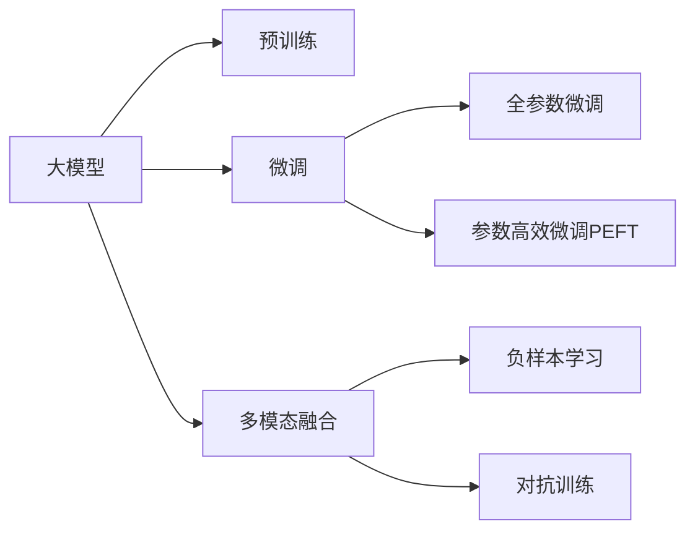

                 

## 1. 背景介绍

### 1.1 问题由来

随着移动互联网和数字广告的迅猛发展，个性化广告推荐系统（Personalized Advertising Recommendation System, PARS）成为各大互联网公司竞争的关键。传统的基于规则和统计特征的推荐方法已无法满足日益复杂的广告需求，而基于深度学习的大模型（Large Model），特别是预训练语言模型，为广告推荐带来了新的突破。

在广告推荐中，大模型能够利用文本、图像、用户行为等多维度数据，通过预训练-微调（Pre-training & Fine-tuning）的方式，精准地预测用户的兴趣和行为，实现广告的个性化投放，从而提升广告效果和用户体验。

### 1.2 问题核心关键点

大模型在广告推荐中的关键点主要包括：

1. **预训练与微调**：大模型通过在海量数据上进行预训练，学习通用语言知识和特征表示，然后在特定广告推荐任务上进行微调，以适应特定的业务需求。
2. **多模态融合**：广告推荐涉及文本、图像、用户行为等多种数据源，大模型通过融合这些多模态数据，构建更加全面的用户画像，提升推荐精度。
3. **参数高效微调**：大模型的参数量通常较大，全参数微调计算成本高，参数高效微调方法可以在保持高精度的情况下，减少计算资源消耗。
4. **因果推理**：广告推荐要求模型具备因果推理能力，能够识别用户行为与广告投放之间的因果关系，从而构建更为可靠的用户行为预测模型。
5. **对抗训练**：对抗样本的存在可能导致模型过拟合，通过对抗训练（Adversarial Training）可以提高模型的鲁棒性，减少异常样本的影响。
6. **负样本学习**：在广告推荐中，负样本（Negative Samples）对于提升模型泛化能力至关重要，大模型可以通过微调学习负样本，减少误判。

### 1.3 问题研究意义

个性化广告推荐系统在大模型辅助下，能够显著提升广告投放的精准度和效果，从而带来更高的商业价值和用户满意度。研究大模型在广告推荐中的应用，对于提升广告投放效率、优化广告收入分配、保护用户隐私等方面具有重要意义。

## 2. 核心概念与联系

### 2.1 核心概念概述

为了更好地理解大模型在广告推荐中的应用，本节将介绍几个密切相关的核心概念：

1. **大模型（Large Model）**：如BERT、GPT、XLNet等，具有数亿乃至数十亿参数的深度神经网络模型。通过在大规模数据上进行预训练，学习通用的语言表示和特征表示。

2. **预训练（Pre-training）**：在大规模无标注数据上，通过自监督学习任务（如语言模型、掩码语言模型）训练大模型的过程。预训练使得模型学习到广泛的语言知识和特征表示。

3. **微调（Fine-tuning）**：在预训练模型的基础上，使用下游任务（如广告推荐）的少量标注数据，通过有监督学习优化模型在该任务上的性能。微调可以显著提升模型对特定任务的适应能力。

4. **多模态融合（Multimodal Fusion）**：广告推荐系统不仅仅依赖文本数据，还需要融合图像、视频、用户行为等多种模态的数据，以构建更加全面的用户画像，提升推荐精度。

5. **参数高效微调（Parameter-Efficient Fine-tuning, PEFT）**：全参数微调计算成本高，而参数高效微调可以在保持高精度的情况下，减少计算资源消耗。

6. **因果推理（Causal Reasoning）**：广告推荐要求模型能够理解用户行为与广告投放之间的因果关系，从而构建更为可靠的用户行为预测模型。

7. **对抗训练（Adversarial Training）**：通过引入对抗样本，提高模型的鲁棒性，减少异常样本的影响。

8. **负样本学习（Negative Sample Learning）**：在广告推荐中，负样本对于提升模型泛化能力至关重要，大模型可以通过微调学习负样本，减少误判。

这些核心概念之间的逻辑关系可以通过以下Mermaid流程图来展示：



这个流程图展示了大模型的核心概念及其之间的关系：

1. 大模型通过预训练获得基础能力。
2. 微调是对预训练模型进行任务特定的优化，可以分为全参数微调和参数高效微调（PEFT）。
3. 多模态融合使得广告推荐系统能够利用多种数据源，构建更为全面的用户画像。
4. 参数高效微调方法可以在固定大部分预训练参数的情况下，仍可取得不错的微调效果。
5. 因果推理和对抗训练增强了模型的鲁棒性和可解释性。
6. 负样本学习进一步提升了模型的泛化能力。

这些概念共同构成了广告推荐系统的学习框架，使其能够精准地预测用户行为，实现广告的个性化投放。

## 3. 核心算法原理 & 具体操作步骤
### 3.1 算法原理概述

基于大模型的广告推荐系统，本质上是一个有监督的微调过程。其核心思想是：将预训练的大模型视作一个强大的"特征提取器"，通过在有标注的广告推荐数据上进行微调，使得模型能够适应特定的广告投放任务，实现个性化推荐。

形式化地，假设预训练模型为 $M_{\theta}$，其中 $\theta$ 为预训练得到的模型参数。给定广告推荐任务 $T$ 的标注数据集 $D=\{(x_i, y_i)\}_{i=1}^N$，微调的目标是找到新的模型参数 $\hat{\theta}$，使得：

$$
\hat{\theta}=\mathop{\arg\min}_{\theta} \mathcal{L}(M_{\theta},D)
$$

其中 $\mathcal{L}$ 为针对任务 $T$ 设计的损失函数，用于衡量模型预测输出与真实标签之间的差异。常见的损失函数包括交叉熵损失、均方误差损失等。

通过梯度下降等优化算法，微调过程不断更新模型参数 $\theta$，最小化损失函数 $\mathcal{L}$，使得模型输出逼近真实标签。由于 $\theta$ 已经通过预训练获得了较好的初始化，因此即便在少量数据集 $D$ 上进行微调，也能较快收敛到理想的模型参数 $\hat{\theta}$。

### 3.2 算法步骤详解

基于大模型的广告推荐系统一般包括以下几个关键步骤：

**Step 1: 准备预训练模型和数据集**
- 选择合适的预训练语言模型 $M_{\theta}$ 作为初始化参数，如 BERT、GPT 等。
- 准备广告推荐任务的标注数据集 $D$，划分为训练集、验证集和测试集。一般要求标注数据与预训练数据的分布不要差异过大。

**Step 2: 添加任务适配层**
- 根据广告推荐任务类型，在预训练模型顶层设计合适的输出层和损失函数。
- 对于分类任务，通常在顶层添加线性分类器和交叉熵损失函数。
- 对于生成任务，通常使用语言模型的解码器输出概率分布，并以负对数似然为损失函数。

**Step 3: 设置微调超参数**
- 选择合适的优化算法及其参数，如 AdamW、SGD 等，设置学习率、批大小、迭代轮数等。
- 设置正则化技术及强度，包括权重衰减、Dropout、Early Stopping 等。
- 确定冻结预训练参数的策略，如仅微调顶层，或全部参数都参与微调。

**Step 4: 执行梯度训练**
- 将训练集数据分批次输入模型，前向传播计算损失函数。
- 反向传播计算参数梯度，根据设定的优化算法和学习率更新模型参数。
- 周期性在验证集上评估模型性能，根据性能指标决定是否触发 Early Stopping。
- 重复上述步骤直到满足预设的迭代轮数或 Early Stopping 条件。

**Step 5: 测试和部署**
- 在测试集上评估微调后模型 $M_{\hat{\theta}}$ 的性能，对比微调前后的精度提升。
- 使用微调后的模型对新样本进行推理预测，集成到实际的应用系统中。
- 持续收集新的数据，定期重新微调模型，以适应数据分布的变化。

以上是基于大模型的广告推荐系统的微调范式。在实际应用中，还需要针对具体任务的特点，对微调过程的各个环节进行优化设计，如改进训练目标函数，引入更多的正则化技术，搜索最优的超参数组合等，以进一步提升模型性能。

### 3.3 算法优缺点

基于大模型的广告推荐系统具有以下优点：

1. 提升广告投放的精准度。通过预训练学习到通用的语言知识和特征表示，大模型在微调后能够精准地预测用户的兴趣和行为，实现广告的个性化投放。
2. 增强模型的泛化能力。由于大模型的预训练过程，模型具备较强的泛化能力，可以在较少的标注数据下取得不错的效果。
3. 提升广告转化率。通过精准的个性化推荐，提升广告的点击率和转化率，从而提升广告主的ROI。
4. 简化推荐模型的开发。大模型的预训练过程已经训练出了高质量的特征表示，微调过程相对简单，开发难度较低。

同时，该方法也存在一定的局限性：

1. 依赖标注数据。微调的效果很大程度上取决于标注数据的质量和数量，获取高质量标注数据的成本较高。
2. 模型复杂度高。大模型的参数量通常较大，微调过程计算复杂度高，资源消耗较大。
3. 泛化能力有限。当目标任务与预训练数据的分布差异较大时，微调的性能提升有限。
4. 可解释性不足。微调模型的决策过程通常缺乏可解释性，难以对其推理逻辑进行分析和调试。

尽管存在这些局限性，但就目前而言，基于大模型的广告推荐系统仍然是广告推荐领域的领先方案。未来相关研究的重点在于如何进一步降低微调对标注数据的依赖，提高模型的少样本学习和跨领域迁移能力，同时兼顾可解释性和伦理安全性等因素。

### 3.4 算法应用领域

基于大模型的广告推荐系统已经在多个领域得到广泛应用，例如：

- 在线广告推荐：如百度、谷歌等互联网公司，通过预训练-微调的大模型，对用户的搜索行为、浏览历史等进行建模，推荐个性化的广告。
- 社交媒体广告推荐：如Facebook、Twitter等平台，通过分析用户的社交行为，推荐个性化广告内容。
- 电商广告推荐：如阿里巴巴、京东等电商平台，通过分析用户浏览和购买行为，推荐个性化的商品广告。
- 视频广告推荐：如YouTube、腾讯视频等视频平台，通过分析用户的观看历史和行为，推荐相关视频广告。

除了上述这些经典应用外，大模型在广告推荐领域的应用还在不断扩展，如基于模型的高频用户画像构建、广告效果分析、广告投放优化等，为广告推荐系统带来了新的突破。

## 4. 数学模型和公式 & 详细讲解 & 举例说明

### 4.1 数学模型构建

本节将使用数学语言对基于大模型的广告推荐系统进行更加严格的刻画。

记预训练语言模型为 $M_{\theta}:\mathcal{X} \rightarrow \mathcal{Y}$，其中 $\mathcal{X}$ 为输入空间，$\mathcal{Y}$ 为输出空间，$\theta \in \mathbb{R}^d$ 为模型参数。假设广告推荐任务的标注数据集为 $D=\{(x_i, y_i)\}_{i=1}^N, x_i \in \mathcal{X}, y_i \in \mathcal{Y}$。

定义模型 $M_{\theta}$ 在数据样本 $(x,y)$ 上的损失函数为 $\ell(M_{\theta}(x),y)$，则在数据集 $D$ 上的经验风险为：

$$
\mathcal{L}(\theta) = \frac{1}{N} \sum_{i=1}^N \ell(M_{\theta}(x_i),y_i)
$$

微调的优化目标是最小化经验风险，即找到最优参数：

$$
\theta^* = \mathop{\arg\min}_{\theta} \mathcal{L}(\theta)
$$

在实践中，我们通常使用基于梯度的优化算法（如SGD、Adam等）来近似求解上述最优化问题。设 $\eta$ 为学习率，$\lambda$ 为正则化系数，则参数的更新公式为：

$$
\theta \leftarrow \theta - \eta \nabla_{\theta}\mathcal{L}(\theta) - \eta\lambda\theta
$$

其中 $\nabla_{\theta}\mathcal{L}(\theta)$ 为损失函数对参数 $\theta$ 的梯度，可通过反向传播算法高效计算。

### 4.2 公式推导过程

以下我们以二分类任务为例，推导交叉熵损失函数及其梯度的计算公式。

假设模型 $M_{\theta}$ 在输入 $x$ 上的输出为 $\hat{y}=M_{\theta}(x) \in [0,1]$，表示样本属于正类的概率。真实标签 $y \in \{0,1\}$。则二分类交叉熵损失函数定义为：

$$
\ell(M_{\theta}(x),y) = -[y\log \hat{y} + (1-y)\log (1-\hat{y})]
$$

将其代入经验风险公式，得：

$$
\mathcal{L}(\theta) = -\frac{1}{N}\sum_{i=1}^N [y_i\log M_{\theta}(x_i)+(1-y_i)\log(1-M_{\theta}(x_i))]
$$

根据链式法则，损失函数对参数 $\theta_k$ 的梯度为：

$$
\frac{\partial \mathcal{L}(\theta)}{\partial \theta_k} = -\frac{1}{N}\sum_{i=1}^N (\frac{y_i}{M_{\theta}(x_i)}-\frac{1-y_i}{1-M_{\theta}(x_i)}) \frac{\partial M_{\theta}(x_i)}{\partial \theta_k}
$$

其中 $\frac{\partial M_{\theta}(x_i)}{\partial \theta_k}$ 可进一步递归展开，利用自动微分技术完成计算。

在得到损失函数的梯度后，即可带入参数更新公式，完成模型的迭代优化。重复上述过程直至收敛，最终得到适应广告推荐任务的最优模型参数 $\theta^*$。

## 5. 项目实践：代码实例和详细解释说明
### 5.1 开发环境搭建

在进行广告推荐系统微调实践前，我们需要准备好开发环境。以下是使用Python进行PyTorch开发的环境配置流程：

1. 安装Anaconda：从官网下载并安装Anaconda，用于创建独立的Python环境。

2. 创建并激活虚拟环境：
```bash
conda create -n pytorch-env python=3.8 
conda activate pytorch-env
```

3. 安装PyTorch：根据CUDA版本，从官网获取对应的安装命令。例如：
```bash
conda install pytorch torchvision torchaudio cudatoolkit=11.1 -c pytorch -c conda-forge
```

4. 安装Transformers库：
```bash
pip install transformers
```

5. 安装各类工具包：
```bash
pip install numpy pandas scikit-learn matplotlib tqdm jupyter notebook ipython
```

完成上述步骤后，即可在`pytorch-env`环境中开始微调实践。

### 5.2 源代码详细实现

下面我以电商广告推荐为例，给出使用Transformers库对BERT模型进行微调的PyTorch代码实现。

首先，定义广告推荐任务的数据处理函数：

```python
from transformers import BertTokenizer
from torch.utils.data import Dataset
import torch

class AdDataset(Dataset):
    def __init__(self, items, tags, tokenizer, max_len=128):
        self.items = items
        self.tags = tags
        self.tokenizer = tokenizer
        self.max_len = max_len
        
    def __len__(self):
        return len(self.items)
    
    def __getitem__(self, item):
        item = self.items[item]
        tags = self.tags[item]
        
        encoding = self.tokenizer(item, return_tensors='pt', max_length=self.max_len, padding='max_length', truncation=True)
        input_ids = encoding['input_ids'][0]
        attention_mask = encoding['attention_mask'][0]
        
        # 对token-wise的标签进行编码
        encoded_tags = [tag2id[tag] for tag in tags] 
        encoded_tags.extend([tag2id['O']] * (self.max_len - len(encoded_tags)))
        labels = torch.tensor(encoded_tags, dtype=torch.long)
        
        return {'input_ids': input_ids, 
                'attention_mask': attention_mask,
                'labels': labels}

# 标签与id的映射
tag2id = {'O': 0, 'click': 1, 'not_click': 2}
id2tag = {v: k for k, v in tag2id.items()}

# 创建dataset
tokenizer = BertTokenizer.from_pretrained('bert-base-cased')

train_dataset = AdDataset(train_items, train_tags, tokenizer)
dev_dataset = AdDataset(dev_items, dev_tags, tokenizer)
test_dataset = AdDataset(test_items, test_tags, tokenizer)
```

然后，定义模型和优化器：

```python
from transformers import BertForTokenClassification, AdamW

model = BertForTokenClassification.from_pretrained('bert-base-cased', num_labels=len(tag2id))

optimizer = AdamW(model.parameters(), lr=2e-5)
```

接着，定义训练和评估函数：

```python
from torch.utils.data import DataLoader
from tqdm import tqdm
from sklearn.metrics import classification_report

device = torch.device('cuda') if torch.cuda.is_available() else torch.device('cpu')
model.to(device)

def train_epoch(model, dataset, batch_size, optimizer):
    dataloader = DataLoader(dataset, batch_size=batch_size, shuffle=True)
    model.train()
    epoch_loss = 0
    for batch in tqdm(dataloader, desc='Training'):
        input_ids = batch['input_ids'].to(device)
        attention_mask = batch['attention_mask'].to(device)
        labels = batch['labels'].to(device)
        model.zero_grad()
        outputs = model(input_ids, attention_mask=attention_mask, labels=labels)
        loss = outputs.loss
        epoch_loss += loss.item()
        loss.backward()
        optimizer.step()
    return epoch_loss / len(dataloader)

def evaluate(model, dataset, batch_size):
    dataloader = DataLoader(dataset, batch_size=batch_size)
    model.eval()
    preds, labels = [], []
    with torch.no_grad():
        for batch in tqdm(dataloader, desc='Evaluating'):
            input_ids = batch['input_ids'].to(device)
            attention_mask = batch['attention_mask'].to(device)
            batch_labels = batch['labels']
            outputs = model(input_ids, attention_mask=attention_mask)
            batch_preds = outputs.logits.argmax(dim=2).to('cpu').tolist()
            batch_labels = batch_labels.to('cpu').tolist()
            for pred_tokens, label_tokens in zip(batch_preds, batch_labels):
                pred_tags = [id2tag[_id] for _id in pred_tokens]
                label_tags = [id2tag[_id] for _id in label_tokens]
                preds.append(pred_tags[:len(label_tokens)])
                labels.append(label_tags)
                
    print(classification_report(labels, preds))
```

最后，启动训练流程并在测试集上评估：

```python
epochs = 5
batch_size = 16

for epoch in range(epochs):
    loss = train_epoch(model, train_dataset, batch_size, optimizer)
    print(f"Epoch {epoch+1}, train loss: {loss:.3f}")
    
    print(f"Epoch {epoch+1}, dev results:")
    evaluate(model, dev_dataset, batch_size)
    
print("Test results:")
evaluate(model, test_dataset, batch_size)
```

以上就是使用PyTorch对BERT进行电商广告推荐任务微调的完整代码实现。可以看到，得益于Transformers库的强大封装，我们可以用相对简洁的代码完成BERT模型的加载和微调。

### 5.3 代码解读与分析

让我们再详细解读一下关键代码的实现细节：

**AdDataset类**：
- `__init__`方法：初始化广告数据、标签、分词器等关键组件。
- `__len__`方法：返回数据集的样本数量。
- `__getitem__`方法：对单个样本进行处理，将广告数据输入编码为token ids，将标签编码为数字，并对其进行定长padding，最终返回模型所需的输入。

**tag2id和id2tag字典**：
- 定义了标签与数字id之间的映射关系，用于将token-wise的预测结果解码回真实的标签。

**训练和评估函数**：
- 使用PyTorch的DataLoader对数据集进行批次化加载，供模型训练和推理使用。
- 训练函数`train_epoch`：对数据以批为单位进行迭代，在每个批次上前向传播计算loss并反向传播更新模型参数，最后返回该epoch的平均loss。
- 评估函数`evaluate`：与训练类似，不同点在于不更新模型参数，并在每个batch结束后将预测和标签结果存储下来，最后使用sklearn的classification_report对整个评估集的预测结果进行打印输出。

**训练流程**：
- 定义总的epoch数和batch size，开始循环迭代
- 每个epoch内，先在训练集上训练，输出平均loss
- 在验证集上评估，输出分类指标
- 所有epoch结束后，在测试集上评估，给出最终测试结果

可以看到，PyTorch配合Transformers库使得BERT微调的代码实现变得简洁高效。开发者可以将更多精力放在数据处理、模型改进等高层逻辑上，而不必过多关注底层的实现细节。

当然，工业级的系统实现还需考虑更多因素，如模型的保存和部署、超参数的自动搜索、更灵活的任务适配层等。但核心的微调范式基本与此类似。

## 6. 实际应用场景
### 6.1 电商平台广告推荐

电商平台广告推荐系统能够根据用户的历史浏览、购买行为，推荐用户可能感兴趣的商品广告。传统的基于规则和特征工程的推荐系统已难以满足日益复杂的广告推荐需求。通过使用预训练-微调的大模型，可以构建一个更加精准、高效、灵活的广告推荐系统。

具体而言，可以收集用户的浏览记录、购买记录、评分记录等数据，构建监督数据集。然后，利用预训练-微调的大模型对模型进行微调，使其能够理解用户的行为意图，精准地预测用户是否会对某件商品产生购买兴趣。微调后的模型可以实时接收用户的实时浏览记录，并根据其行为特征，推荐可能感兴趣的广告。

### 6.2 新闻网站广告推荐

新闻网站广告推荐系统通过分析用户的浏览历史和行为数据，推荐可能感兴趣的新闻广告。通过预训练-微调的大模型，可以构建一个更加个性化、精准的广告推荐系统。

具体而言，可以收集用户的浏览历史、点击行为、停留时间等数据，构建监督数据集。然后，利用预训练-微调的大模型对模型进行微调，使其能够理解用户对新闻内容的兴趣，精准地预测用户是否会对某篇新闻产生点击兴趣。微调后的模型可以实时接收用户的实时浏览记录，并根据其行为特征，推荐可能感兴趣的新闻广告。

### 6.3 视频平台广告推荐

视频平台广告推荐系统通过分析用户的观看历史和行为数据，推荐可能感兴趣的视频广告。通过预训练-微调的大模型，可以构建一个更加个性化、精准的广告推荐系统。

具体而言，可以收集用户的观看历史、点赞行为、评论行为等数据，构建监督数据集。然后，利用预训练-微调的大模型对模型进行微调，使其能够理解用户对视频内容的兴趣，精准地预测用户是否会对某段视频产生观看兴趣。微调后的模型可以实时接收用户的实时观看记录，并根据其行为特征，推荐可能感兴趣的视频广告。

### 6.4 未来应用展望

随着大模型和微调方法的不断发展，基于大模型的广告推荐系统将具备更强的个性化推荐能力，进一步提升广告投放的精准度和效果。未来，大模型还将在以下方面取得突破：

1. **多模态融合**：广告推荐系统不仅仅依赖文本数据，还需要融合图像、视频、用户行为等多种模态的数据，以构建更加全面的用户画像，提升推荐精度。

2. **参数高效微调**：全参数微调计算成本高，而参数高效微调方法可以在保持高精度的情况下，减少计算资源消耗。

3. **因果推理**：广告推荐要求模型能够理解用户行为与广告投放之间的因果关系，从而构建更为可靠的用户行为预测模型。

4. **对抗训练**：通过引入对抗样本，提高模型的鲁棒性，减少异常样本的影响。

5. **负样本学习**：在广告推荐中，负样本对于提升模型泛化能力至关重要，大模型可以通过微调学习负样本，减少误判。

6. **元学习**：利用元学习（Meta-Learning）技术，快速适应新领域的广告推荐任务，提高模型迁移能力。

7. **隐私保护**：在广告推荐过程中，保护用户隐私数据的安全，采用差分隐私等技术手段。

8. **效果评估**：引入效果评估指标，如点击率（CTR）、转化率（CVR）等，定期评估广告推荐效果，优化广告投放策略。

这些方向的探索，必将引领广告推荐技术迈向更高的台阶，为广告主和用户带来更大的价值。

## 7. 工具和资源推荐
### 7.1 学习资源推荐

为了帮助开发者系统掌握大模型在广告推荐中的应用，这里推荐一些优质的学习资源：

1. **《Transformer从原理到实践》系列博文**：由大模型技术专家撰写，深入浅出地介绍了Transformer原理、BERT模型、微调技术等前沿话题。

2. **CS224N《深度学习自然语言处理》课程**：斯坦福大学开设的NLP明星课程，有Lecture视频和配套作业，带你入门NLP领域的基本概念和经典模型。

3. **《Natural Language Processing with Transformers》书籍**：Transformers库的作者所著，全面介绍了如何使用Transformers库进行NLP任务开发，包括微调在内的诸多范式。

4. **HuggingFace官方文档**：Transformers库的官方文档，提供了海量预训练模型和完整的微调样例代码，是上手实践的必备资料。

5. **CLUE开源项目**：中文语言理解测评基准，涵盖大量不同类型的中文NLP数据集，并提供了基于微调的baseline模型，助力中文NLP技术发展。

通过对这些资源的学习实践，相信你一定能够快速掌握大模型在广告推荐中的应用精髓，并用于解决实际的广告推荐问题。
###  7.2 开发工具推荐

高效的开发离不开优秀的工具支持。以下是几款用于大模型广告推荐系统开发的常用工具：

1. **PyTorch**：基于Python的开源深度学习框架，灵活动态的计算图，适合快速迭代研究。大部分预训练语言模型都有PyTorch版本的实现。

2. **TensorFlow**：由Google主导开发的开源深度学习框架，生产部署方便，适合大规模工程应用。同样有丰富的预训练语言模型资源。

3. **Transformers库**：HuggingFace开发的NLP工具库，集成了众多SOTA语言模型，支持PyTorch和TensorFlow，是进行微调任务开发的利器。

4. **Weights & Biases**：模型训练的实验跟踪工具，可以记录和可视化模型训练过程中的各项指标，方便对比和调优。与主流深度学习框架无缝集成。

5. **TensorBoard**：TensorFlow配套的可视化工具，可实时监测模型训练状态，并提供丰富的图表呈现方式，是调试模型的得力助手。

6. **Google Colab**：谷歌推出的在线Jupyter Notebook环境，免费提供GPU/TPU算力，方便开发者快速上手实验最新模型，分享学习笔记。

合理利用这些工具，可以显著提升大模型广告推荐系统的开发效率，加快创新迭代的步伐。

### 7.3 相关论文推荐

大模型在广告推荐领域的研究源于学界的持续研究。以下是几篇奠基性的相关论文，推荐阅读：

1. **Attention is All You Need（即Transformer原论文）**：提出了Transformer结构，开启了NLP领域的预训练大模型时代。

2. **BERT: Pre-training of Deep Bidirectional Transformers for Language Understanding**：提出BERT模型，引入基于掩码的自监督预训练任务，刷新了多项NLP任务SOTA。

3. **Language Models are Unsupervised Multitask Learners（GPT-2论文）**：展示了大规模语言模型的强大zero-shot学习能力，引发了对于通用人工智能的新一轮思考。

4. **Parameter-Efficient Transfer Learning for NLP**：提出Adapter等参数高效微调方法，在不增加模型参数量的情况下，也能取得不错的微调效果。

5. **Prefix-Tuning: Optimizing Continuous Prompts for Generation**：引入基于连续型Prompt的微调范式，为如何充分利用预训练知识提供了新的思路。

6. **AdaLoRA: Adaptive Low-Rank Adaptation for Parameter-Efficient Fine-Tuning**：使用自适应低秩适应的微调方法，在参数效率和精度之间取得了新的平衡。

这些论文代表了大模型在广告推荐技术的发展脉络。通过学习这些前沿成果，可以帮助研究者把握学科前进方向，激发更多的创新灵感。

## 8. 总结：未来发展趋势与挑战

### 8.1 总结

本文对基于大模型的广告推荐系统进行了全面系统的介绍。首先阐述了大模型和微调技术的研究背景和意义，明确了微调在广告推荐中的应用价值。其次，从原理到实践，详细讲解了微调的数学原理和关键步骤，给出了广告推荐任务开发的完整代码实例。同时，本文还广泛探讨了微调方法在电商、新闻、视频等多个领域的应用前景，展示了微调范式的巨大潜力。此外，本文精选了微调技术的各类学习资源，力求为开发者提供全方位的技术指引。

通过本文的系统梳理，可以看到，基于大模型的广告推荐系统在大数据、深度学习和人工智能技术的支持下，能够显著提升广告投放的精准度和效果，从而带来更高的商业价值和用户满意度。研究大模型在广告推荐中的应用，对于提升广告投放效率、优化广告收入分配、保护用户隐私等方面具有重要意义。

### 8.2 未来发展趋势

展望未来，大模型在广告推荐系统中的应用将呈现以下几个发展趋势：

1. **多模态融合**：广告推荐系统不仅仅依赖文本数据，还需要融合图像、视频、用户行为等多种模态的数据，以构建更加全面的用户画像，提升推荐精度。

2. **参数高效微调**：全参数微调计算成本高，而参数高效微调方法可以在保持高精度的情况下，减少计算资源消耗。

3. **因果推理**：广告推荐要求模型能够理解用户行为与广告投放之间的因果关系，从而构建更为可靠的用户行为预测模型。

4. **对抗训练**：通过引入对抗样本，提高模型的鲁棒性，减少异常样本的影响。

5. **负样本学习**：在广告推荐中，负样本对于提升模型泛化能力至关重要，大模型可以通过微调学习负样本，减少误判。

6. **元学习**：利用元学习（Meta-Learning）技术，快速适应新领域的广告推荐任务，提高模型迁移能力。

7. **隐私保护**：在广告推荐过程中，保护用户隐私数据的安全，采用差分隐私等技术手段。

8. **效果评估**：引入效果评估指标，如点击率（CTR）、转化率（CVR）等，定期评估广告推荐效果，优化广告投放策略。

这些趋势凸显了大模型在广告推荐系统中的广阔前景。这些方向的探索发展，必将进一步提升广告系统的性能和应用范围，为广告推荐系统带来新的突破。

### 8.3 面临的挑战

尽管大模型在广告推荐系统中取得了显著效果，但在迈向更加智能化、普适化应用的过程中，它仍面临着诸多挑战：

1. **标注成本瓶颈**：尽管微调能够减少标注数据的需求，但对于长尾应用场景，获取高质量标注数据的成本较高。如何进一步降低微调对标注样本的依赖，将是一大难题。

2. **模型鲁棒性不足**：当前微调模型面对域外数据时，泛化性能往往大打折扣。对于测试样本的微小扰动，微调模型的预测也容易发生波动。如何提高微调模型的鲁棒性，避免灾难性遗忘，还需要更多理论和实践的积累。

3. **推理效率有待提高**：大规模语言模型虽然精度高，但在实际部署时往往面临推理速度慢、内存占用大等效率问题。如何在保证性能的同时，简化模型结构，提升推理速度，优化资源占用，将是重要的优化方向。

4. **可解释性亟需加强**：当前微调模型更像是"黑盒"系统，难以解释其内部工作机制和决策逻辑。对于医疗、金融等高风险应用，算法的可解释性和可审计性尤为重要。如何赋予微调模型更强的可解释性，将是亟待攻克的难题。

5. **安全性有待保障**。预训练语言模型难免会学习到有偏见、有害的信息，通过微调传递到下游任务，产生误导性、歧视性的输出，给实际应用带来安全隐患。如何从数据和算法层面消除模型偏见，避免恶意用途，确保输出的安全性，也将是重要的研究课题。

6. **知识整合能力不足**：现有的微调模型往往局限于任务内数据，难以灵活吸收和运用更广泛的先验知识。如何让微调过程更好地与外部知识库、规则库等专家知识结合，形成更加全面、准确的信息整合能力，还有很大的想象空间。

正视微调面临的这些挑战，积极应对并寻求突破，将是大模型在广告推荐系统中的应用不断成熟的关键。

### 8.4 研究展望

面对大模型在广告推荐系统中的应用面临的种种挑战，未来的研究需要在以下几个方面寻求新的突破：

1. **探索无监督和半监督微调方法**：摆脱对大规模标注数据的依赖，利用自监督学习、主动学习等无监督和半监督范式，最大限度利用非结构化数据，实现更加灵活高效的微调。

2. **研究参数高效和计算高效的微调范式**：开发更加参数高效的微调方法，在固定大部分预训练参数的同时，只更新极少量的任务相关参数。同时优化微调模型的计算图，减少前向传播和反向传播的资源消耗，实现更加轻量级、实时性的部署。

3. **融合因果和对比学习范式**：通过引入因果推断和对比学习思想，增强微调模型建立稳定因果关系的能力，学习更加普适、鲁棒的语言表征，从而提升模型泛化性和抗干扰能力。

4. **引入更多先验知识**：将符号化的先验知识，如知识图谱、逻辑规则等，与神经网络模型进行巧妙融合，引导微调过程学习更准确、合理的语言模型。同时加强不同模态数据的整合，实现视觉、语音等多模态信息与文本信息的协同建模。

5. **结合因果分析和博弈论工具**：将因果分析方法引入微调模型，识别出模型决策的关键特征，增强输出解释的因果性和逻辑性。借助博弈论工具刻画人机交互过程，主动探索并规避模型的脆弱点，提高系统稳定性。

6. **纳入伦理道德约束**：在模型训练目标中引入伦理导向的评估指标，过滤和惩罚有偏见、有害的输出倾向。同时加强人工干预和审核，建立模型行为的监管机制，确保输出符合人类价值观和伦理道德。

这些研究方向的探索，必将引领大模型在广告推荐系统中的应用迈向更高的台阶，为构建安全、可靠、可解释、可控的智能系统铺平道路。面向未来，大模型在广告推荐系统中的应用还需要与其他人工智能技术进行更深入的融合，如知识表示、因果推理、强化学习等，多路径协同发力，共同推动广告推荐系统的进步。只有勇于创新、敢于突破，才能不断拓展大模型的边界，让智能技术更好地造福人类社会。

## 9. 附录：常见问题与解答

**Q1：大模型在广告推荐中是否适用于所有应用场景？**

A: 大模型在广告推荐中适用于大多数应用场景，特别是数据量较大的领域。但对于一些特定领域，如医疗、法律等，仅仅依靠通用语料预训练的模型可能难以很好地适应。此时需要在特定领域语料上进一步预训练，再进行微调，才能获得理想效果。

**Q2：微调过程中如何选择合适的学习率？**

A: 微调的学习率一般要比预训练时小1-2个数量级，如果使用过大的学习率，容易破坏预训练权重，导致过拟合。一般建议从1e-5开始调参，逐步减小学习率，直至收敛。也可以使用warmup策略，在开始阶段使用较小的学习率，再逐渐过渡到预设值。需要注意的是，不同的优化器(如AdamW、Adafactor等)以及不同的学习率调度策略，可能需要设置不同的学习率阈值。

**Q3：采用大模型微调时会面临哪些资源瓶颈？**

A: 目前主流的预训练大模型动辄以亿计的参数规模，对算力、内存、存储都提出了很高的要求。GPU/TPU等高性能设备是必不可少的，但即便如此，超大批次的训练和推理也可能遇到显存不足的问题。因此需要采用一些资源优化技术，如梯度积累、混合精度训练、模型并行等，来突破硬件瓶颈。同时，模型的存储和读取也可能占用大量时间和空间，需要采用模型压缩、稀疏化存储等方法进行优化。

**Q4：如何缓解微调过程中的过拟合问题？**

A: 过拟合是微调面临的主要挑战，尤其是在标注数据不足的情况下。常见的缓解策略包括：
1. 数据增强：通过回译、近义替换等方式扩充训练集
2. 正则化：使用L2正则、Dropout、Early Stopping等避免过拟合
3. 对抗训练：引入对抗样本，提高模型鲁棒性
4. 参数高效微调：只调整少量参数(如Adapter、Prefix等)，减小过拟合风险
5. 多模型集成：训练多个微调模型，取平均输出，抑制过拟合

这些策略往往需要根据具体任务和数据特点进行灵活组合。只有在数据、模型、训练、推理等各环节进行全面优化，才能最大限度地发挥大模型微调的威力。

**Q5：微调模型在落地部署时需要注意哪些问题？**

A: 将微调模型转化为实际应用，还需要考虑以下因素：
1. 模型裁剪：去除不必要的层和参数，减小模型尺寸，加快推理速度
2. 量化加速：将浮点模型转为定点模型，压缩存储空间，提高计算效率
3. 服务化封装：将模型封装为标准化服务接口，便于集成调用
4. 弹性伸缩：根据请求流量动态调整资源配置，平衡服务质量和成本
5. 监控告警：实时采集系统指标，设置异常告警阈值，确保服务稳定性
6. 安全防护：采用访问鉴权、数据脱敏等措施，保障数据和模型安全

大模型微调为广告推荐系统提供了广阔的想象空间，但如何将强大的性能转化为稳定、高效、安全的业务价值，还需要工程实践的不断打磨。唯有从数据、算法、工程、业务等多个维度协同发力，才能真正实现人工智能技术在广告推荐系统中的规模化落地。总之，微调需要开发者根据具体任务，不断迭代和优化模型、数据和算法，方能得到理想的效果。

---

作者：禅与计算机程序设计艺术 / Zen and the Art of Computer Programming

