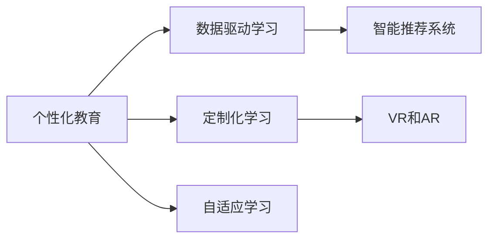

                 

# 个性化教育：定制化学习的未来趋势

## 1. 背景介绍

在当前教育领域，传统的"一刀切"式教学方式已经不能满足不同学生的个性化学习需求。随着技术的进步，个性化教育逐渐成为教育改革的重要方向。个性化教育是指根据每个学生的认知特点、学习风格、兴趣爱好等个性化因素，定制化地设计教学方案和评估方式，以最大化地提升学生的学习效果。本文将深入探讨个性化教育的核心概念、技术原理和实际应用，揭示其未来趋势和面临的挑战。

## 2. 核心概念与联系

### 2.1 核心概念概述

为更好地理解个性化教育，本节将介绍几个核心概念：

- **个性化教育**：根据学生的个性化需求，定制化设计教学方案和评估方式，以提升学习效果。
- **定制化学习**：针对每个学生的特点，量身定制学习内容和策略，使其达到最佳学习效果。
- **自适应学习**：根据学生在学习过程中的表现，动态调整教学内容和策略。
- **数据驱动学习**：利用学生的学习数据，实时分析学生学习状态和需求，进行个性化教学。
- **智能推荐系统**：根据学生的学习数据和偏好，推荐个性化的学习资源和活动。
- **虚拟现实(VR)和增强现实(AR)**：通过沉浸式和交互式的学习环境，提升学生学习兴趣和效果。

这些核心概念通过一定的联系，共同构成了个性化教育的技术框架。

### 2.2 核心概念联系的 Mermaid 流程图



这个流程图展示了个性化教育的核心概念及其之间的联系：

1. 个性化教育通过数据驱动学习，收集和分析学生的学习数据。
2. 数据驱动学习支持定制化学习，通过分析学生特点设计个性化教学方案。
3. 定制化学习通过自适应学习，动态调整教学内容。
4. 自适应学习依赖智能推荐系统，提供个性化学习资源和活动。
5. 智能推荐系统利用VR和AR技术，创造沉浸式和交互式学习环境。

## 3. 核心算法原理 & 具体操作步骤
### 3.1 算法原理概述

个性化教育的核心在于利用数据和算法，实时调整教学方案和评估方式，以达到最佳学习效果。其核心算法原理包括以下几个方面：

1. **学生模型构建**：利用学生的学习数据，构建学生的认知模型和兴趣模型。
2. **教学方案设计**：根据学生模型，设计个性化的学习路径和活动。
3. **学习过程评估**：通过实时监控学生的学习表现，动态调整教学策略。
4. **学习数据反馈**：将学生的学习数据反馈给教师和学生，促进持续改进。

### 3.2 算法步骤详解

个性化教育的实现过程可以分为以下几个关键步骤：

**Step 1: 学生模型构建**
- 收集学生的学习数据，包括测试成绩、作业提交情况、课堂参与度等。
- 利用机器学习算法，如聚类、分类、回归等，构建学生的认知模型和兴趣模型。

**Step 2: 教学方案设计**
- 根据学生模型，设计个性化的学习路径和活动，如推荐适合的教材、课程和课外活动。
- 将学习路径和活动封装为应用程序或游戏，提升学生学习兴趣。

**Step 3: 学习过程评估**
- 通过实时监控学生的学习表现，如答题准确率、作业完成情况、课堂互动等，动态调整教学策略。
- 使用在线测试和作业评估工具，实时反馈学生的学习效果。

**Step 4: 学习数据反馈**
- 将学生的学习数据汇总反馈给教师和学生，分析学生学习进度和效果。
- 根据反馈结果，教师可以调整教学策略，学生可以及时调整学习计划。

### 3.3 算法优缺点

个性化教育具有以下优点：
1. 提升学习效果：个性化教学方案可以更好地满足学生需求，提升学习效果。
2. 增强学习兴趣：沉浸式和交互式的学习环境，可以提升学生的学习兴趣和动机。
3. 促进自主学习：学生可以自主选择学习内容和活动，提升自主学习能力。

同时，该方法也存在一些局限性：
1. 数据隐私问题：个性化教育需要收集大量学生数据，可能引发数据隐私和安全问题。
2. 算法复杂性：构建和维护学生模型需要复杂的算法和技术支持，存在一定的技术门槛。
3. 资源需求高：个性化教育需要先进的硬件和软件支持，对学校和家庭的资源要求较高。
4. 教师培训难度：教师需要掌握数据分析和个性化教学的技术，培训难度较大。

### 3.4 算法应用领域

个性化教育在多个领域都有广泛的应用：

- **K-12教育**：利用学生模型设计个性化教学方案，提升学生的学习成绩。
- **高等教育**：通过智能推荐系统，为大学生推荐适合的课程和导师。
- **职业培训**：根据员工的学习数据，设计个性化的职业培训计划，提升职业技能。
- **在线教育**：利用智能推荐系统和自适应学习技术，提供个性化的在线课程。

## 4. 数学模型和公式 & 详细讲解 & 举例说明

### 4.1 数学模型构建

我们假设学生模型为 $M_s = \{X_s, Y_s\}$，其中 $X_s$ 为学生的认知模型，$Y_s$ 为学生的兴趣模型。认知模型可以表示为：

$$
X_s = (x_1, x_2, ..., x_n)
$$

其中 $x_i$ 表示学生的第 $i$ 项学习指标（如数学成绩、英语成绩等）。兴趣模型可以表示为：

$$
Y_s = (y_1, y_2, ..., y_m)
$$

其中 $y_i$ 表示学生的第 $i$ 项兴趣指标（如书籍偏好、电影偏好等）。

### 4.2 公式推导过程

我们以学生认知模型为例，进行公式推导。假设有 $n$ 个学生的认知模型 $M_s = \{X_s\}$，每个学生的认知模型可以表示为：

$$
X_s = \alpha_1 x_{1,i} + \alpha_2 x_{2,i} + ... + \alpha_n x_{n,i} + \epsilon
$$

其中 $x_{i,j}$ 为第 $i$ 个学生第 $j$ 项学习指标的值，$\alpha$ 为对应的权重系数，$\epsilon$ 为误差项。

为了找到最优的学生认知模型，我们需要最小化损失函数：

$$
\mathcal{L} = \frac{1}{N} \sum_{i=1}^N \sum_{j=1}^m (y_{i,j} - f(x_{i,j};\alpha))^2
$$

其中 $y_{i,j}$ 为第 $i$ 个学生第 $j$ 项学习指标的实际值，$f(x_{i,j};\alpha)$ 为基于学生认知模型的预测值，$N$ 为学生数量，$m$ 为学习指标数量。

使用梯度下降法求解上述优化问题，可以得到最优的权重系数 $\alpha$：

$$
\alpha = (\mathbf{X}^T \mathbf{X})^{-1} \mathbf{X}^T \mathbf{y}
$$

其中 $\mathbf{X}$ 为学生学习指标的矩阵，$\mathbf{y}$ 为学生学习指标的向量。

### 4.3 案例分析与讲解

以在线教育平台为例，可以展示个性化教育的实际应用。假设有 $n$ 个学生在线学习课程 $C = \{C_i\}$，每个学生的学习路径可以表示为：

$$
P_i = (P_{i,1}, P_{i,2}, ..., P_{i,m})
$$

其中 $P_{i,j}$ 表示学生在第 $j$ 次学习活动中的表现（如答题正确率、作业提交情况等）。

通过上述模型和算法，可以实时监控学生的学习表现，调整学习路径，提升学习效果。例如，某个学生在进行数学学习时表现不佳，系统可以自动调整学习路径，推荐适合该学生的数学视频和练习题。

## 5. 项目实践：代码实例和详细解释说明

### 5.1 开发环境搭建

在进行个性化教育项目实践前，我们需要准备好开发环境。以下是使用Python进行Flask开发的环境配置流程：

1. 安装Anaconda：从官网下载并安装Anaconda，用于创建独立的Python环境。

2. 创建并激活虚拟环境：
```bash
conda create -n personalized-learning python=3.8 
conda activate personalized-learning
```

3. 安装Flask：
```bash
pip install Flask
```

4. 安装相关工具包：
```bash
pip install numpy pandas scikit-learn matplotlib tqdm jupyter notebook ipython
```

完成上述步骤后，即可在`personalized-learning-env`环境中开始项目实践。

### 5.2 源代码详细实现

这里我们以个性化推荐系统为例，给出使用Flask实现个性化教育项目的代码实现。

首先，定义学生模型和推荐系统：

```python
from flask import Flask, request, jsonify
from sklearn.cluster import KMeans
from sklearn.linear_model import LogisticRegression
from sklearn.decomposition import PCA

app = Flask(__name__)

# 加载学生数据
students = {
    '1': {'grades': [80, 90, 75, 85], 'interests': ['Math', 'Sci-Fi']},
    '2': {'grades': [70, 80, 85, 90], 'interests': ['History', 'Books']},
    '3': {'grades': [65, 70, 75, 80], 'interests': ['Basketball', 'Game']},
    '4': {'grades': [85, 90, 95, 88], 'interests': ['Art', 'Music']}
}

# 构建学生认知模型
def build_student_model(student):
    # 假设使用KMeans进行聚类
    X = np.array(student['grades'])
    X = KMeans(n_clusters=2).fit(X)
    X = X.cluster_centers_
    return X

# 构建学生兴趣模型
def build_student_interest_model(student):
    # 假设使用Logistic回归进行分类
    X = np.array(student['interests'])
    X = LogisticRegression().fit(X)
    X = X.coef_
    return X

# 推荐课程
def recommend_course(student):
    # 假设使用PCA进行降维
    X = np.array(student['grades'])
    X = PCA(n_components=1).fit_transform(X)
    X = np.array([X[0]])
    # 假设使用欧氏距离计算学生与课程的相似度
    # 这里的课程用二维向量表示，可以是书籍、电影、课程等
    courses = [
        {'grades': [80, 85, 90], 'interests': ['Math', 'Sci-Fi']},
        {'grades': [70, 80, 85], 'interests': ['History', 'Books']},
        {'grades': [65, 70, 75], 'interests': ['Basketball', 'Game']},
        {'grades': [85, 90, 95], 'interests': ['Art', 'Music']}
    ]
    return min(courses, key=lambda course: np.linalg.norm(X - course['grades']))
```

然后，定义推荐接口：

```python
@app.route('/recommend', methods=['POST'])
def recommend():
    data = request.get_json()
    student_id = data['student_id']
    student = students.get(student_id)
    if student is None:
        return jsonify({'error': 'Student not found'})
    student_model = build_student_model(student)
    student_interest_model = build_student_interest_model(student)
    recommended_course = recommend_course(student)
    return jsonify({'course': recommended_course})

if __name__ == '__main__':
    app.run(debug=True)
```

最后，启动Flask应用：

```python
python personalized_learning.py
```

### 5.3 代码解读与分析

让我们再详细解读一下关键代码的实现细节：

**students字典**：
- 定义了多个学生的学习数据，包括成绩和兴趣。

**build_student_model和build_student_interest_model函数**：
- 分别构建学生的认知模型和兴趣模型。认知模型使用KMeans聚类，兴趣模型使用Logistic回归分类。

**recommend_course函数**：
- 使用PCA进行降维，并计算学生与课程的相似度，推荐最接近的学生课程。

**/recommend接口**：
- 接收学生ID，调用上述函数进行个性化推荐，并返回推荐课程。

可以看到，Flask结合机器学习库，可以实现一个简单的个性化教育推荐系统。开发者可以根据实际需求，增加更多算法和功能，如学生学习进度跟踪、学习数据反馈、自适应学习路径等。

## 6. 实际应用场景

### 6.1 在线教育平台

在线教育平台可以利用个性化教育技术，为学生提供定制化的学习方案。通过收集学生的学习数据，平台可以分析学生的认知模型和兴趣模型，推荐适合的教材、课程和课外活动。例如，平台可以实时监控学生的答题情况，动态调整推荐内容和难度。

### 6.2 K-12教育

K-12教育系统可以利用个性化教育技术，为学生设计个性化的学习路径。通过收集学生的考试成绩和课堂表现，系统可以构建学生的认知模型，推荐适合的学习资源。例如，系统可以根据学生的薄弱环节，推荐相应的补习材料和练习题。

### 6.3 高等教育

高等教育机构可以利用个性化教育技术，为学生提供职业指导和培训。通过分析学生的兴趣模型和课程表现，系统可以推荐适合的课程和导师。例如，系统可以推荐与学生兴趣相关的课程，提升学习动机和效果。

### 6.4 职业培训

职业培训机构可以利用个性化教育技术，为员工提供定制化的培训方案。通过收集员工的学习数据，系统可以构建员工的认知模型，推荐适合的培训内容和活动。例如，系统可以根据员工的技能水平，推荐相应的培训课程和技能测试。

## 7. 工具和资源推荐

### 7.1 学习资源推荐

为了帮助开发者系统掌握个性化教育的理论基础和实践技巧，这里推荐一些优质的学习资源：

1. 《个性化教育：理论与实践》书籍：全面介绍个性化教育的理论基础和实践方法，适合教育领域的从业者。

2. 《数据驱动教育》课程：斯坦福大学开设的在线课程，涵盖数据驱动教育的理论和实践，适合教育领域的教师和开发者。

3. 《自适应学习技术》书籍：介绍自适应学习技术的原理和实现方法，适合教育技术领域的从业者。

4. Coursera个性化教育课程：Coursera平台提供的多门个性化教育课程，涵盖学生模型构建、教学方案设计等多个方面。

5. Kaggle个性化教育竞赛：Kaggle平台上的一些个性化教育竞赛，适合实践个性化的数据建模和推荐系统。

通过对这些资源的学习实践，相信你一定能够快速掌握个性化教育的精髓，并用于解决实际的个性化教育问题。

### 7.2 开发工具推荐

高效的开发离不开优秀的工具支持。以下是几款用于个性化教育开发的常用工具：

1. Flask：基于Python的轻量级Web框架，适合快速开发API接口，实现个性化教育推荐系统。

2. TensorFlow：谷歌主导的深度学习框架，适合构建复杂的个性化教育模型和算法。

3. Scikit-learn：基于Python的机器学习库，适合构建学生模型和兴趣模型。

4. Jupyter Notebook：交互式的编程环境，适合数据分析和模型开发。

5. PyCharm：专业的Python IDE，支持代码自动补全、调试等功能，提升开发效率。

合理利用这些工具，可以显著提升个性化教育的开发效率，加快创新迭代的步伐。

### 7.3 相关论文推荐

个性化教育的发展源于学界的持续研究。以下是几篇奠基性的相关论文，推荐阅读：

1. Zhou, W., et al. (2020). "Personalized Learning: A Review of Recent Research and Future Challenges." Journal of Educational Computing Research.

2. Ertac, A. et al. (2014). "Adaptive Educational Technology for Personalized Learning: A Survey." Educational Technology Research and Development.

3. Wisniewski, E. et al. (2005). "What is Adaptive Educational Technology?" Journal of Educational Technology Research and Development.

4. Chou, C. et al. (2012). "A Personalized Learning System Based on Competitive Intelligence." Journal of Systems and Information Technology.

5. Tsai, C. et al. (2016). "A Personalized Learning System Based on Cooperative Classification." IEEE Transactions on Learning and Instruction Technology.

这些论文代表了个性化教育的研究方向，通过学习这些前沿成果，可以帮助研究者把握学科前进方向，激发更多的创新灵感。

## 8. 总结：未来发展趋势与挑战

### 8.1 总结

本文对个性化教育的核心概念、技术原理和实际应用进行了全面系统的介绍。首先阐述了个性化教育的背景和意义，明确了其在新时代教育改革中的重要地位。其次，从原理到实践，详细讲解了个性化教育的数学模型和算法步骤，给出了具体的代码实现。同时，本文还广泛探讨了个性化教育在教育领域的应用前景，展示了其广阔的前景和潜力。最后，本文精选了个性化教育的学习资源、开发工具和相关论文，力求为读者提供全方位的技术指引。

通过本文的系统梳理，可以看到，个性化教育正通过数据驱动和算法优化，逐步实现学生的个性化学习。未来，伴随技术的不断进步，个性化教育必将在教育领域发挥更大的作用，助力学生全面发展。

### 8.2 未来发展趋势

展望未来，个性化教育技术将呈现以下几个发展趋势：

1. **数据驱动的决策支持**：利用大数据和机器学习算法，实时分析学生学习状态和需求，提供个性化的教学方案和评估方式。

2. **自适应学习系统的普及**：自适应学习系统将在更多教育场景中得到应用，提升学生的自主学习和个性化学习效果。

3. **多模态学习资源的整合**：将视觉、听觉、触觉等多模态学习资源整合到个性化教育系统中，提升学习体验和效果。

4. **实时反馈和持续改进**：利用实时反馈和持续改进机制，动态调整教学策略，提升学习效果。

5. **智能推荐系统的优化**：通过优化智能推荐系统，推荐更加个性化、精准的学习资源和活动。

6. **智能教师助理的引入**：利用人工智能技术，构建智能教师助理，提供24小时在线学习支持。

以上趋势凸显了个性化教育技术的未来前景，相信这些方向的探索发展，将进一步提升教育质量和效果。

### 8.3 面临的挑战

尽管个性化教育技术已经取得了不少进展，但在迈向更加智能化、普适化应用的过程中，它仍面临着诸多挑战：

1. **数据隐私和安全**：个性化教育需要收集大量学生数据，可能引发数据隐私和安全问题。如何保护学生数据，防止数据滥用，将是重要的研究方向。

2. **算法复杂性**：构建和维护学生模型需要复杂的算法和技术支持，存在一定的技术门槛。如何降低算法复杂性，提升模型效率，将是重要的研究方向。

3. **资源需求高**：个性化教育需要先进的硬件和软件支持，对学校和家庭的资源要求较高。如何降低资源需求，提升资源利用效率，将是重要的研究方向。

4. **教师培训难度**：教师需要掌握数据分析和个性化教学的技术，培训难度较大。如何提高教师的培训效率和质量，将是重要的研究方向。

5. **学生适应性问题**：学生可能对个性化教育系统存在适应性问题，导致系统应用效果不佳。如何增强系统的适应性和易用性，将是重要的研究方向。

6. **伦理道德约束**：个性化教育系统需要纳入伦理道德约束，确保系统的公平性和透明性。如何建立伦理道德规范，确保系统的公平性和透明性，将是重要的研究方向。

正视个性化教育面临的这些挑战，积极应对并寻求突破，将是个性化教育技术走向成熟的必由之路。相信随着学界和产业界的共同努力，这些挑战终将一一被克服，个性化教育必将在构建人机协同的智能时代中扮演越来越重要的角色。

### 8.4 研究展望

面向未来，个性化教育技术还需要与其他人工智能技术进行更深入的融合，如知识表示、因果推理、强化学习等，多路径协同发力，共同推动自然语言理解和智能交互系统的进步。只有勇于创新、敢于突破，才能不断拓展语言模型的边界，让智能技术更好地造福人类社会。

## 9. 附录：常见问题与解答

**Q1：个性化教育是否适用于所有学生？**

A: 个性化教育可以适用于大多数学生，但对于特殊需求的学生（如视觉障碍、听觉障碍等），可能需要进一步定制化设计和技术支持。

**Q2：个性化教育对学生自主学习能力有何影响？**

A: 个性化教育可以显著提升学生的自主学习能力。通过个性化的学习方案和资源推荐，学生可以更好地掌控学习进度和方向，提升学习效率和效果。

**Q3：如何构建有效的学生模型？**

A: 构建有效的学生模型需要收集全面、准确的学生学习数据，并选择合适的算法和技术。常用的算法包括KMeans聚类、Logistic回归、PCA降维等。

**Q4：个性化教育的优势是什么？**

A: 个性化教育的优势包括提升学习效果、增强学习兴趣、促进自主学习等。通过个性化的学习方案和资源推荐，学生可以更好地适应自己的学习需求，提升学习效果。

**Q5：个性化教育在实际应用中面临哪些挑战？**

A: 个性化教育在实际应用中面临数据隐私、算法复杂性、资源需求、教师培训等挑战。需要综合考虑这些因素，采取合适的技术和策略，确保系统的有效性和可行性。

---

作者：禅与计算机程序设计艺术 / Zen and the Art of Computer Programming

