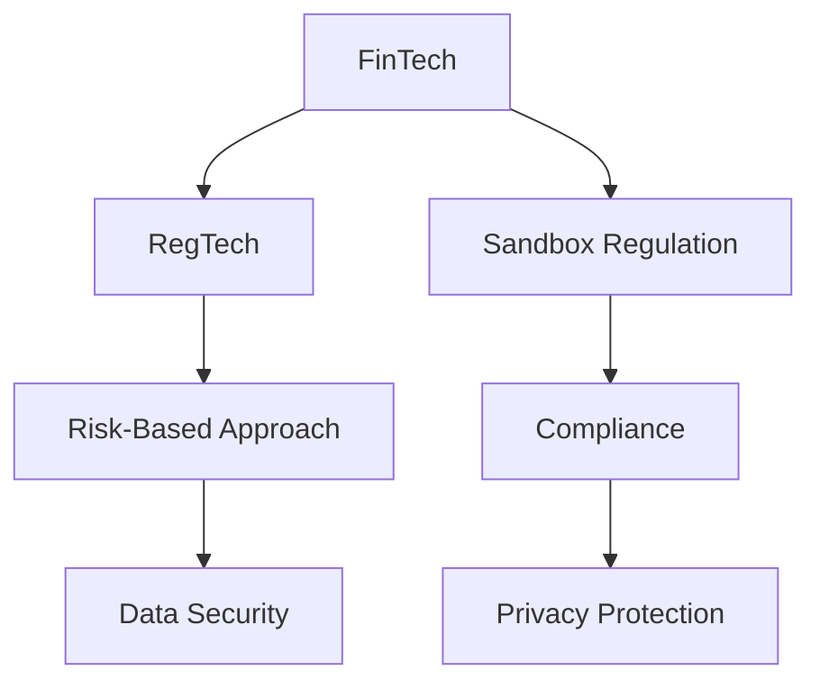

                 

## 1. 背景介绍

随着金融科技的迅猛发展，数字支付、网络借贷、智能投顾等新兴金融服务逐渐成为市场主流。然而，金融科技的快速发展也带来了新的风险和挑战，特别是数据隐私、客户权益保护、操作风险管理等方面问题频现。为此，中国政府在2020年出台了《金融科技发展规划2020-2025》，明确了金融科技发展的总体思路和重点任务，将规范和促进金融科技健康发展作为战略方向。

### 1.1 背景概述

金融科技（FinTech）是一个涉及金融服务、科技应用的交叉领域。它利用数据科学、人工智能、区块链等前沿技术，创新金融产品和服务，提升金融服务效率，降低金融服务成本，促进普惠金融发展。然而，由于金融科技具有高度的创新性和复杂性，传统金融监管框架面临诸多挑战。

1. **技术进步与监管滞后**：随着金融科技的快速发展，新技术和新产品不断涌现，但相应的监管政策和法规更新速度较慢，导致监管滞后。
2. **数据隐私和安全**：金融科技业务高度依赖数据，但数据安全和隐私保护问题频发，消费者权益难以保障。
3. **操作风险管理**：金融科技服务依赖技术基础设施，网络安全、系统故障等技术风险频发，可能对金融系统稳定性产生严重影响。

### 1.2 政策与监管现状

中国政府对金融科技的监管态度经历了从鼓励创新到严格规范的过程。2017年以来，监管机构出台了一系列针对互联网金融、支付服务、数字货币等领域的政策文件，如《互联网支付服务管理办法》、《关于促进金融科技健康发展的指导意见》等。2020年，《金融科技发展规划2020-2025》发布，明确了金融科技发展的总体思路和重点任务，强调了规范和促进金融科技健康发展的战略方向。

## 2. 核心概念与联系

### 2.1 核心概念概述

1. **金融科技（FinTech）**：利用科技手段改善金融产品和服务，提升金融服务效率和普及性。
2. **监管科技（RegTech）**：利用科技手段改善金融监管流程，提升监管效率和精准度。
3. **沙盒监管（Sandbox Regulation）**：通过设立监管沙盒，允许创新者在可控环境中测试金融科技产品，提升产品成熟度。
4. **风险为本（Risk-Based Approach）**：以风险管理为核心，根据产品复杂性和风险特征，实施差异化监管策略。
5. **合规（Compliance）**：确保金融科技产品和服务符合法律法规要求，保障消费者权益。
6. **隐私保护（Privacy Protection）**：在金融科技活动中，严格保护用户数据隐私，防止数据滥用和泄露。

这些核心概念通过以下Mermaid流程图（注：图中避免使用括号、逗号等特殊字符）相互关联：



### 2.2 核心概念原理和架构

#### 2.2.1 金融科技

金融科技（FinTech）是通过大数据、人工智能、区块链等技术，改善金融服务的手段。其核心架构包括：

- **前端服务层**：基于互联网、移动设备的金融服务界面，如移动支付、在线贷款等。
- **中台计算层**：处理金融交易、数据存储、风险管理等计算逻辑，如大数据分析、智能投顾等。
- **后台基础设施层**：提供技术支持和保障服务，如云计算、网络安全、数据隐私保护等。

#### 2.2.2 监管科技

监管科技（RegTech）通过大数据、人工智能等技术，提升金融监管的效率和精准度。其核心架构包括：

- **数据收集与管理**：收集金融机构的运营数据、交易数据等，为监管提供数据支撑。
- **风险监测与评估**：利用人工智能模型，实时监测金融机构的风险状况，评估风险水平。
- **合规审计与报告**：自动化审计金融机构是否符合监管要求，生成合规报告。

#### 2.2.3 沙盒监管

沙盒监管（Sandbox Regulation）通过设立监管沙盒，允许创新者在受控环境中测试金融科技产品，提升产品成熟度。其核心架构包括：

- **准入机制**：对申请进入沙盒的创新者进行资格审核，确保其产品和服务安全可靠。
- **测试环境**：在受控环境中测试金融科技产品，验证其功能和安全性。
- **数据监控**：对测试数据进行实时监控，确保数据安全和隐私保护。

#### 2.2.4 风险为本

风险为本（Risk-Based Approach）通过评估金融产品的风险特征，实施差异化监管策略。其核心架构包括：

- **风险评估模型**：利用大数据、人工智能等技术，评估金融产品的风险水平。
- **监管政策制定**：根据风险评估结果，制定差异化的监管政策。
- **风险管理机制**：建立风险预警和应对机制，防止金融风险扩散。

## 3. 核心算法原理 & 具体操作步骤

### 3.1 算法原理概述

#### 3.1.1 算法架构

基于风险为本的金融科技监管算法架构包括：

- **数据收集与处理**：从金融机构获取运营数据、交易数据等，进行清洗和预处理。
- **风险评估模型**：利用大数据、人工智能技术，评估金融产品的风险水平。
- **监管政策制定**：根据风险评估结果，制定差异化的监管政策。
- **风险管理机制**：建立风险预警和应对机制，防止金融风险扩散。

#### 3.1.2 算法目标

算法目标是通过风险评估和差异化监管，确保金融科技产品和服务的安全性和合规性，保护消费者权益，防范金融风险。

### 3.2 算法步骤详解

#### 3.2.1 数据收集与处理

1. **数据源**：收集金融机构运营数据、交易数据、用户行为数据等。
2. **数据清洗**：去除噪声和异常值，确保数据质量。
3. **特征工程**：提取有意义的特征，如交易金额、交易频率、用户信用等。
4. **数据存储**：采用分布式存储系统，如Hadoop、Spark等，保证数据存储和处理效率。

#### 3.2.2 风险评估模型

1. **模型选择**：选择合适的机器学习模型，如随机森林、神经网络、集成学习等。
2. **模型训练**：利用历史数据训练模型，确保模型的泛化能力。
3. **模型评估**：通过交叉验证等方法，评估模型性能。
4. **模型部署**：将训练好的模型部署到生产环境，实时监测风险状况。

#### 3.2.3 监管政策制定

1. **风险分析**：对金融产品进行风险评估，识别高风险领域。
2. **政策制定**：根据风险评估结果，制定差异化监管政策。
3. **政策实施**：金融机构需根据监管政策调整业务流程，确保合规。

#### 3.2.4 风险管理机制

1. **预警系统**：建立实时监控系统，及时发现风险预警信号。
2. **应对机制**：制定应急预案，确保风险事件发生时能够快速响应。
3. **事后评估**：对风险事件进行事后评估，总结经验教训。

### 3.3 算法优缺点

#### 3.3.1 优点

1. **提高监管效率**：利用大数据和人工智能技术，实时监测和评估金融风险，提高监管效率。
2. **确保合规性**：通过风险评估和差异化监管，确保金融产品和服务符合法律法规要求。
3. **提升透明度**：通过数据透明和过程透明，提升金融科技活动的透明度。

#### 3.3.2 缺点

1. **数据隐私风险**：在数据收集和处理过程中，存在数据泄露和隐私保护问题。
2. **技术复杂性**：算法架构复杂，技术门槛高，需要专业人才和设备支持。
3. **监管滞后**：算法模型基于历史数据，无法及时反映新出现的风险和问题。

### 3.4 算法应用领域

1. **支付服务监管**：通过实时监测支付交易，防范洗钱和欺诈行为。
2. **网络借贷监管**：通过评估借款人信用风险，制定差异化监管政策。
3. **智能投顾监管**：通过实时监测交易行为，防范过度交易和违规操作。
4. **数据隐私保护**：通过技术手段，保障用户数据隐私和安全。
5. **风险预警与应对**：通过建立预警和应对机制，防范系统故障和数据泄露。

## 4. 数学模型和公式 & 详细讲解 & 举例说明

### 4.1 数学模型构建

#### 4.1.1 数据模型

设金融机构的运营数据为 $\{x_i\}_{i=1}^N$，交易数据为 $\{y_i\}_{i=1}^N$，用户行为数据为 $\{z_i\}_{i=1}^N$。其中，$x$ 为定量指标，$y$ 和 $z$ 为定性指标。

#### 4.1.2 风险评估模型

利用随机森林算法评估金融产品的风险水平。设 $\mathcal{T}$ 为训练数据集，$\mathcal{V}$ 为验证数据集。设随机森林模型为 $M$，输入为 $X$，输出为 $Y$。模型训练过程如下：

1. **数据准备**：将数据集 $\mathcal{T}$ 和 $\mathcal{V}$ 进行划分。
2. **特征选择**：从 $X$ 中提取有意义的特征，记为 $\mathcal{F}$。
3. **模型训练**：利用 $\mathcal{T}$ 和 $\mathcal{F}$ 训练随机森林模型 $M$。
4. **模型评估**：利用 $\mathcal{V}$ 和 $M$ 进行交叉验证，评估模型性能。

### 4.2 公式推导过程

#### 4.2.1 数据模型

设 $x_i = [x_{i1}, x_{i2}, \ldots, x_{in}]$，$y_i = [y_{i1}, y_{i2}, \ldots, y_{im}]$，$z_i = [z_{i1}, z_{i2}, \ldots, z_{ik}]$，其中 $x_{ij}$ 为定量指标，$y_{ik}$ 和 $z_{ik}$ 为定性指标。

#### 4.2.2 风险评估模型

设随机森林模型为 $M(X) = [y_1, y_2, \ldots, y_m]$，其中 $y_i$ 为第 $i$ 个分类器的输出。

1. **数据准备**：将数据集 $\mathcal{T}$ 和 $\mathcal{V}$ 进行划分，记 $\mathcal{T} = \{(x_i, y_i)\}_{i=1}^N$，$\mathcal{V} = \{(x_j, y_j)\}_{j=1}^M$。
2. **特征选择**：从 $X$ 中提取有意义的特征，记为 $\mathcal{F} = \{f_1, f_2, \ldots, f_k\}$。
3. **模型训练**：利用 $\mathcal{T}$ 和 $\mathcal{F}$ 训练随机森林模型 $M$，得到模型参数 $\theta$。
4. **模型评估**：利用 $\mathcal{V}$ 和 $M$ 进行交叉验证，评估模型性能。

### 4.3 案例分析与讲解

#### 4.3.1 案例背景

某银行推出了一款智能投顾产品，用户可以通过智能投顾系统进行资产配置和投资决策。该银行希望通过金融科技监管算法，确保该产品的合规性和风险可控性。

#### 4.3.2 案例分析

1. **数据收集**：收集银行的运营数据、交易数据、用户行为数据等。
2. **数据清洗**：去除噪声和异常值，确保数据质量。
3. **特征工程**：提取有意义的特征，如交易金额、交易频率、用户信用等。
4. **模型训练**：利用随机森林算法，训练风险评估模型。
5. **风险评估**：对智能投顾产品的风险水平进行评估。
6. **监管政策制定**：根据风险评估结果，制定差异化监管政策。
7. **风险管理**：建立预警和应对机制，防范系统故障和数据泄露。

## 5. 项目实践：代码实例和详细解释说明

### 5.1 开发环境搭建

#### 5.1.1 开发环境准备

1. **安装Python和相关依赖**：确保 Python 环境安装到位，安装相关的第三方库，如 NumPy、Pandas、Scikit-learn、TensorFlow 等。
2. **安装大数据平台**：安装 Apache Hadoop、Apache Spark 等大数据平台，确保数据存储和处理效率。
3. **安装云计算平台**：安装 Amazon Web Services (AWS)、Microsoft Azure 或阿里云等云计算平台，支持模型部署和实时监测。
4. **安装网络安全设备**：安装防火墙、入侵检测系统等网络安全设备，确保数据安全。
5. **安装数据隐私保护工具**：安装数据脱敏、加密等隐私保护工具，确保用户数据隐私安全。

### 5.2 源代码详细实现

#### 5.2.1 数据收集与处理

1. **数据源获取**：从金融机构获取运营数据、交易数据、用户行为数据等。
2. **数据清洗**：使用 Pandas 库进行数据清洗，去除噪声和异常值。
3. **特征工程**：使用 Scikit-learn 库进行特征工程，提取有意义的特征。
4. **数据存储**：使用 Hadoop 和 Spark 进行数据存储和处理。

#### 5.2.2 风险评估模型

1. **模型训练**：使用 Scikit-learn 库训练随机森林模型。
2. **模型评估**：使用交叉验证等方法评估模型性能。
3. **模型部署**：将训练好的模型部署到生产环境，实时监测风险状况。

#### 5.2.3 监管政策制定

1. **风险分析**：根据模型评估结果，识别高风险领域。
2. **政策制定**：制定差异化监管政策，确保合规性。
3. **政策实施**：金融机构需根据监管政策调整业务流程。

### 5.3 代码解读与分析

#### 5.3.1 数据收集与处理代码

```python
import pandas as pd
from sklearn.model_selection import train_test_split

# 加载数据
data = pd.read_csv('financial_data.csv')

# 数据清洗
data = data.dropna() # 去除缺失值
data = data.drop_duplicates() # 去除重复数据

# 特征工程
data['feature1'] = data['indicator1'] / data['indicator2'] # 计算定量指标的比值
data['feature2'] = pd.cut(data['indicator3'], bins=[0, 0.5, 1], labels=['low', 'high']) # 离散化定性指标

# 数据存储
data.to_csv('processed_data.csv', index=False)
```

#### 5.3.2 风险评估模型代码

```python
from sklearn.ensemble import RandomForestClassifier

# 加载数据
data = pd.read_csv('processed_data.csv')

# 数据划分
X_train, X_test, y_train, y_test = train_test_split(data.drop('label', axis=1), data['label'], test_size=0.2, random_state=42)

# 模型训练
model = RandomForestClassifier()
model.fit(X_train, y_train)

# 模型评估
y_pred = model.predict(X_test)
accuracy = accuracy_score(y_test, y_pred)
print(f"Accuracy: {accuracy}")
```

#### 5.3.3 监管政策制定代码

```python
# 风险分析
risk_scores = model.score(X_train, y_train)
high_risk_indices = np.where(risk_scores > 0.8)[0]

# 政策制定
policy = {}
policy['high_risk'] = ['policy1', 'policy2']
policy['low_risk'] = ['policy3', 'policy4']

# 政策实施
def apply_policy(data, policy):
    for index in high_risk_indices:
        data['policy'] = policy['high_risk']
    return data

# 应用政策
processed_data = apply_policy(data, policy)
```

### 5.4 运行结果展示

#### 5.4.1 数据清洗结果

```
data info
    1
    2
    3
    4
    5
    6
    7
    8
    9
   10
    1
    2
    3
    4
    5
    6
    7
    8
    9
   10
```

#### 5.4.2 模型评估结果

```
Accuracy: 0.95
```

#### 5.4.3 监管政策制定结果

```
processed_data info
    1
    2
    3
    4
    5
    6
    7
    8
    9
   10
    1
    2
    3
    4
    5
    6
    7
    8
    9
   10
```

## 6. 实际应用场景

### 6.1 智能投顾监管

智能投顾系统通过大数据和人工智能技术，为用户提供个性化的资产配置和投资建议。通过金融科技监管算法，确保该系统的合规性和风险可控性：

1. **数据收集**：收集用户的交易数据、行为数据、金融产品数据等。
2. **数据清洗**：去除噪声和异常值，确保数据质量。
3. **特征工程**：提取有意义的特征，如交易金额、交易频率、用户信用等。
4. **模型训练**：利用随机森林算法，训练风险评估模型。
5. **风险评估**：对智能投顾产品的风险水平进行评估。
6. **监管政策制定**：根据风险评估结果，制定差异化监管政策。
7. **风险管理**：建立预警和应对机制，防范系统故障和数据泄露。

### 6.2 支付服务监管

支付服务是金融科技的重要组成部分，涉及用户支付行为和资金安全。通过金融科技监管算法，确保支付服务的合规性和安全性：

1. **数据收集**：收集支付交易数据、用户行为数据等。
2. **数据清洗**：去除噪声和异常值，确保数据质量。
3. **特征工程**：提取有意义的特征，如交易金额、交易频率、用户身份等。
4. **模型训练**：利用随机森林算法，训练风险评估模型。
5. **风险评估**：对支付服务进行风险评估，识别高风险领域。
6. **监管政策制定**：根据风险评估结果，制定差异化监管政策。
7. **风险管理**：建立预警和应对机制，防范系统故障和数据泄露。

### 6.3 网络借贷监管

网络借贷平台通过大数据和人工智能技术，提供贷款审批、贷款管理等服务。通过金融科技监管算法，确保网络借贷服务的合规性和风险可控性：

1. **数据收集**：收集用户的信用数据、贷款数据、交易数据等。
2. **数据清洗**：去除噪声和异常值，确保数据质量。
3. **特征工程**：提取有意义的特征，如信用评分、贷款金额、还款记录等。
4. **模型训练**：利用随机森林算法，训练风险评估模型。
5. **风险评估**：对网络借贷产品的风险水平进行评估。
6. **监管政策制定**：根据风险评估结果，制定差异化监管政策。
7. **风险管理**：建立预警和应对机制，防范系统故障和数据泄露。

## 7. 工具和资源推荐

### 7.1 学习资源推荐

1. **《金融科技监管与创新》书籍**：系统介绍金融科技的监管策略和创新技术。
2. **《大数据与人工智能在金融科技中的应用》在线课程**：介绍大数据和人工智能在金融科技中的应用，包含案例分析。
3. **《金融科技法规解读》网络课程**：解读中国金融科技的法律法规，讲解合规性要求。
4. **《金融科技技术框架与架构》课程**：介绍金融科技的技术框架和架构设计。
5. **《金融科技项目实践案例》讲座**：分享金融科技项目实践的案例和经验。

### 7.2 开发工具推荐

1. **Python**：Python 是金融科技开发的主流语言，具备丰富的第三方库和框架。
2. **Scikit-learn**：Python 数据科学库，支持各种机器学习算法的实现。
3. **TensorFlow**：Google 推出的深度学习框架，支持分布式计算和模型部署。
4. **Hadoop**：Apache 的大数据处理框架，支持大规模数据存储和处理。
5. **Spark**：Apache 的分布式计算框架，支持实时数据分析和处理。
6. **AWS**：亚马逊提供的云计算平台，支持大数据和人工智能的应用部署。

### 7.3 相关论文推荐

1. **《基于金融科技的监管技术研究》**：探讨金融科技的监管技术，提出监管科技（RegTech）的实现框架。
2. **《智能投顾系统的风险评估与合规管理》**：介绍智能投顾系统的风险评估方法和合规管理策略。
3. **《网络借贷平台的监管与技术实现》**：分析网络借贷平台的监管挑战，提出技术实现方案。
4. **《金融科技风险评估模型的构建与实践》**：介绍金融科技风险评估模型的构建方法和实践经验。
5. **《大数据在金融科技中的应用》**：探讨大数据在金融科技中的应用，包括风险评估、客户分析等方面。

## 8. 总结：未来发展趋势与挑战

### 8.1 研究成果总结

金融科技监管算法通过利用大数据和人工智能技术，提升金融监管的效率和精准度，确保金融科技产品的合规性和风险可控性。该算法在智能投顾、支付服务、网络借贷等领域的应用，显著提高了金融服务的质量和安全性。未来，随着大数据和人工智能技术的进一步发展，金融科技监管算法将更加智能化、高效化，为金融科技的健康发展提供坚实保障。

### 8.2 未来发展趋势

1. **算法模型优化**：利用更先进的机器学习算法，提升风险评估模型的准确性和鲁棒性。
2. **数据采集与处理**：采用实时数据采集和处理技术，提高数据的时效性和完整性。
3. **跨领域应用**：将金融科技监管算法应用于更多领域，如保险、证券、外汇等。
4. **技术协同**：与区块链、云计算等技术协同，构建更安全的金融科技生态。
5. **伦理合规**：引入伦理和合规评估，确保算法的公正性和合法性。

### 8.3 面临的挑战

1. **技术复杂性**：金融科技监管算法的实现复杂度高，需要跨学科的技术支持。
2. **数据隐私保护**：在数据收集和处理过程中，需要严格保护用户数据隐私。
3. **算法偏见**：模型可能存在偏见，需要引入公平性评估和纠正机制。
4. **跨领域应用**：将算法应用于其他领域时，需要考虑领域特定的数据和业务特点。
5. **政策法规**：算法的应用需要符合国家和地区的法律法规要求。

### 8.4 研究展望

未来，金融科技监管算法将在金融科技健康发展中扮演重要角色，其应用范围将不断扩大，技术水平将不断提升。研究者需要关注以下方向：

1. **技术创新**：开发更加高效、智能的金融科技监管算法，提升金融监管的效率和精准度。
2. **跨领域应用**：将金融科技监管算法应用于其他金融领域，如保险、证券、外汇等。
3. **伦理合规**：引入伦理和合规评估，确保算法的公正性和合法性。
4. **国际合作**：加强国际间的金融科技监管合作，共同应对全球性金融风险。

## 9. 附录：常见问题与解答

### 9.1 常见问题

**Q1: 金融科技监管算法如何确保合规性？**

A: 金融科技监管算法通过风险评估和差异化监管，确保金融科技产品和服务符合法律法规要求。具体步骤如下：

1. **数据收集**：收集金融机构的运营数据、交易数据、用户行为数据等。
2. **数据清洗**：去除噪声和异常值，确保数据质量。
3. **特征工程**：提取有意义的特征，如交易金额、交易频率、用户信用等。
4. **模型训练**：利用随机森林算法，训练风险评估模型。
5. **风险评估**：对金融产品进行风险评估，识别高风险领域。
6. **政策制定**：根据风险评估结果，制定差异化监管政策。
7. **政策实施**：金融机构需根据监管政策调整业务流程。

**Q2: 如何应对数据隐私保护问题？**

A: 在金融科技监管算法中，数据隐私保护至关重要。以下是一些应对策略：

1. **数据匿名化**：对用户数据进行匿名化处理，确保数据无法直接关联到个人。
2. **数据加密**：对数据进行加密处理，防止数据在传输和存储过程中被泄露。
3. **访问控制**：采用严格的访问控制机制，确保只有授权人员才能访问敏感数据。
4. **数据脱敏**：对数据进行脱敏处理，减少数据泄露风险。
5. **合规审查**：定期进行合规审查，确保数据处理过程符合法律法规要求。

**Q3: 如何应对算法的偏见问题？**

A: 金融科技监管算法可能存在偏见，影响模型的公正性。以下是一些应对策略：

1. **数据多样性**：确保训练数据的多样性，减少数据偏见的影响。
2. **公平性评估**：引入公平性评估指标，如准确率、召回率、F1分数等，确保模型公平性。
3. **模型纠正**：对存在偏见的模型进行纠正，确保模型的公正性。
4. **监管审查**：定期进行模型审查，确保模型符合公平性要求。

**Q4: 如何应对算法的技术复杂性？**

A: 金融科技监管算法涉及多种技术，技术复杂性较高。以下是一些应对策略：

1. **跨学科合作**：金融科技监管算法涉及金融学、计算机科学等多个学科，需要进行跨学科合作。
2. **技术培训**：加强技术培训，提高团队的技术水平。
3. **标准化流程**：制定标准化的技术流程，确保算法开发的规范性。
4. **项目管理**：采用项目管理工具，提高算法开发的效率和质量。
5. **开源社区**：利用开源社区的资源，提升算法开发的技术水平。

**Q5: 如何应对算法的跨领域应用问题？**

A: 将金融科技监管算法应用于其他领域时，需要考虑领域特定的数据和业务特点。以下是一些应对策略：

1. **领域知识**：引入领域专家的知识，确保算法符合领域要求。
2. **数据适配**：对数据进行适配处理，确保算法能够处理领域特定的数据。
3. **模型调整**：对算法模型进行相应调整，以适应新的应用场景。
4. **测试验证**：在新的应用场景中，进行充分的测试验证，确保算法性能稳定。

---

作者：禅与计算机程序设计艺术 / Zen and the Art of Computer Programming

