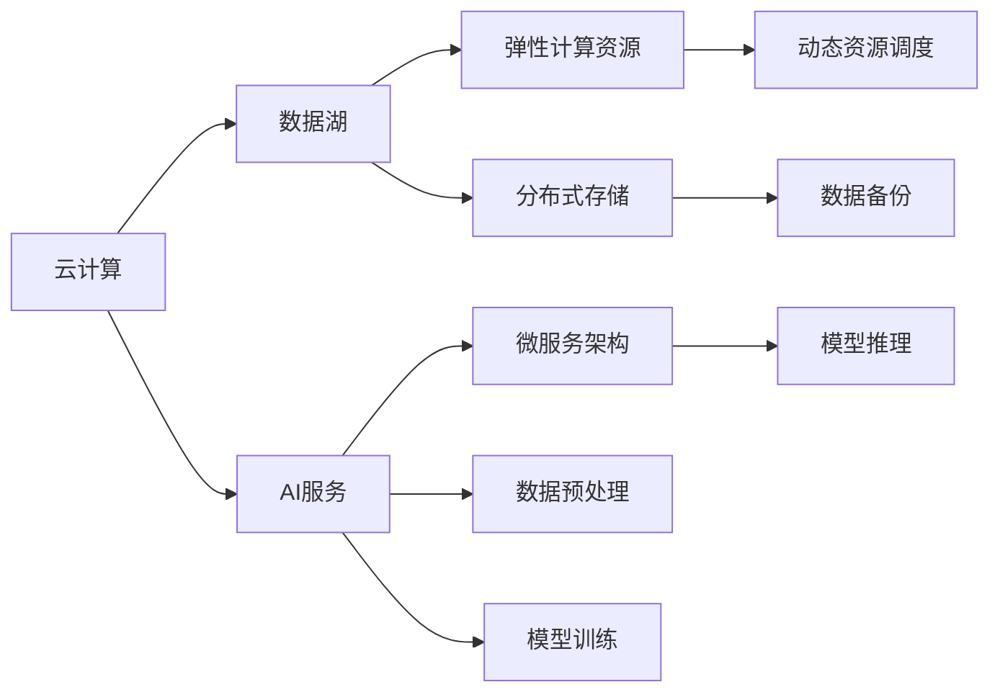

                 

# 云与AI的融合：贾扬清的独特视角，从阿里到Lepton AI的进化之路

## 1. 背景介绍

### 1.1 问题的由来

自20世纪90年代末以来，人工智能(AI)领域取得了巨大的突破，尤其是深度学习技术的快速发展，极大地推动了AI的应用落地。然而，AI的快速发展也带来了一些问题，如算力需求激增、数据隐私和安全等，使得AI的商业化应用受到了一定限制。随着云计算技术的成熟和普及，将AI技术与云计算结合，成为了一个热门的趋势。

### 1.2 问题核心关键点

云计算与AI的融合，旨在通过云平台提供强大的计算资源和灵活的部署方式，支持大规模AI模型的训练和推理，同时降低AI应用的成本和复杂度。这种融合的核心理念是“按需使用，弹性伸缩”，即根据实际业务需求，动态调整计算资源，实现高效、安全的AI应用。

云计算与AI的融合，可以带来以下好处：
- 降低成本：通过云平台提供的资源池，可以按需使用计算资源，避免大规模部署带来的高昂成本。
- 灵活部署：AI模型可以在云端快速部署和扩展，提高业务响应速度和弹性。
- 安全保障：云平台提供的安全和隐私保障措施，可以保护AI模型免受攻击和泄露。
- 协同创新：云平台可以集成各种AI服务，支持多种AI技术协同工作，提升应用效果。

## 2. 核心概念与联系

### 2.1 核心概念概述

云计算与AI的融合，涉及以下几个核心概念：

- **云计算(Cloud Computing)**：指通过互联网提供按需、灵活、可扩展的计算资源和应用服务，包括弹性计算资源池、虚拟化技术、分布式存储和数据管理等。
- **人工智能(AI)**：指通过算法和模型，实现对数据的理解、分析和生成，涵盖机器学习、深度学习、自然语言处理、计算机视觉等领域。
- **数据湖(Data Lake)**：指集中存储海量异构数据的设施，支持大规模数据分析和处理。
- **AI服务(AI-as-a-Service)**：指通过云平台提供标准化、可扩展的AI服务，支持快速开发和部署AI应用。
- **微服务架构(Microservices Architecture)**：指将复杂的系统拆分为多个独立的小服务，实现灵活的部署和扩展。

这些概念之间通过云平台进行关联，形成了一个完整的云计算与AI融合生态系统。

### 2.2 核心概念原理和架构的 Mermaid 流程图



通过以上流程，展示了云计算与AI融合的架构图。数据湖存储海量异构数据，AI服务通过数据预处理、模型训练和推理等技术，实现对数据的理解和生成，同时通过微服务架构实现灵活的部署和扩展。弹性计算资源和分布式存储提供强有力的计算和存储支持。

## 3. 核心算法原理 & 具体操作步骤

### 3.1 算法原理概述

云计算与AI的融合，主要涉及以下几个算法原理：

- **数据预处理**：将原始数据进行清洗、转换和归一化，以便进行模型训练和推理。
- **模型训练**：使用AI算法和模型，在大规模数据集上进行训练，得到具有一定泛化能力的模型。
- **模型推理**：使用训练好的模型，对新数据进行预测和生成，得到业务决策的依据。
- **动态资源调度**：根据业务需求，动态调整计算资源，实现高效、安全的AI应用。

### 3.2 算法步骤详解

云计算与AI的融合，主要包括以下几个关键步骤：

1. **数据收集与存储**：通过云平台提供的工具，从各种来源收集数据，并存储在数据湖中。
2. **数据预处理**：使用云平台提供的ETL工具，对数据进行清洗、转换和归一化，以便进行模型训练和推理。
3. **模型训练与优化**：使用云平台提供的计算资源和工具，对模型进行训练和优化，得到具有一定泛化能力的模型。
4. **模型部署与推理**：将训练好的模型部署到云平台，对新数据进行推理和预测，得到业务决策的依据。
5. **动态资源调度**：根据业务需求，动态调整计算资源，实现高效、安全的AI应用。

### 3.3 算法优缺点

云计算与AI的融合，具有以下优点：
- 降低成本：按需使用计算资源，避免大规模部署带来的高昂成本。
- 灵活部署：快速部署和扩展AI模型，提高业务响应速度和弹性。
- 安全保障：云平台提供的安全和隐私保障措施，保护AI模型免受攻击和泄露。
- 协同创新：集成各种AI服务，支持多种AI技术协同工作，提升应用效果。

同时，也存在以下缺点：
- 数据隐私：数据存储在云端，可能存在隐私泄露的风险。
- 算法黑盒：AI算法通常具有较高的复杂性，难以理解和解释。
- 资源调度：动态资源调度的实现复杂，可能存在性能瓶颈。
- 服务一致性：不同云平台提供的AI服务接口可能存在差异，影响应用的一致性。

### 3.4 算法应用领域

云计算与AI的融合，已经应用于多个领域，包括但不限于：

1. **金融**：通过AI技术进行风险控制、信贷评估、客户服务等方面，提升金融服务的智能化水平。
2. **医疗**：通过AI技术进行疾病预测、医学影像分析、个性化治疗等方面，提升医疗服务的精准度和效率。
3. **智能制造**：通过AI技术进行设备维护、质量控制、生产调度等方面，提升制造行业的自动化水平。
4. **智慧城市**：通过AI技术进行城市管理、环境监测、交通管理等方面，提升城市管理的智能化水平。
5. **电子商务**：通过AI技术进行商品推荐、智能客服、风险控制等方面，提升电商平台的智能化水平。

## 4. 数学模型和公式 & 详细讲解

### 4.1 数学模型构建

云计算与AI的融合，涉及多个数学模型，主要包括：

- **神经网络模型**：通过多层神经网络，实现对数据的分类、聚类、回归等任务。
- **支持向量机模型**：通过构建超平面，实现对数据的分类和回归。
- **决策树模型**：通过构建决策树，实现对数据的分类和回归。
- **随机森林模型**：通过构建多个决策树，实现对数据的分类和回归。

这些模型的构建，依赖于大量的训练数据和计算资源，通常在云平台上进行。

### 4.2 公式推导过程

以神经网络模型为例，其公式推导过程如下：

- **前向传播**：
$$
y = f(\sum_{i=1}^n w_ix_i + b)
$$
其中 $x_i$ 为输入特征，$w_i$ 为权重，$b$ 为偏置，$f$ 为激活函数。

- **损失函数**：
$$
L = \frac{1}{n} \sum_{i=1}^n (y_i - f(\sum_{i=1}^n w_ix_i + b))^2
$$
其中 $y_i$ 为实际输出，$L$ 为损失函数。

- **梯度下降算法**：
$$
w_i = w_i - \alpha \frac{\partial L}{\partial w_i}
$$
其中 $\alpha$ 为学习率，$\frac{\partial L}{\partial w_i}$ 为损失函数对权重 $w_i$ 的梯度。

### 4.3 案例分析与讲解

以智能推荐系统为例，其数学模型推导过程如下：

- **协同过滤模型**：
$$
\hat{y} = \sum_{i=1}^n \frac{\gamma_i}{\sum_{i=1}^n \gamma_i} (\alpha_i \sum_{j=1}^n x_jw_{ij} + b_i)
$$
其中 $\hat{y}$ 为预测结果，$x_j$ 为用户行为，$w_{ij}$ 为权重，$\alpha_i$ 为归一化因子，$b_i$ 为偏置，$\gamma_i$ 为用户权重。

- **损失函数**：
$$
L = \frac{1}{n} \sum_{i=1}^n (y_i - \hat{y})^2
$$
其中 $y_i$ 为实际结果，$L$ 为损失函数。

- **梯度下降算法**：
$$
w_{ij} = w_{ij} - \alpha \frac{\partial L}{\partial w_{ij}}
$$
其中 $\alpha$ 为学习率，$\frac{\partial L}{\partial w_{ij}}$ 为损失函数对权重 $w_{ij}$ 的梯度。

通过以上数学模型，可以构建智能推荐系统，实现对用户行为的分析和预测，提升用户体验。

## 5. 项目实践：代码实例和详细解释说明

### 5.1 开发环境搭建

云计算与AI的融合，主要依赖于云平台和AI服务，开发环境搭建如下：

1. **云平台**：使用AWS、阿里云、腾讯云等云平台，提供弹性计算资源和数据存储服务。
2. **AI服务**：使用TensorFlow、PyTorch、MXNet等AI服务，提供模型训练和推理功能。
3. **开发工具**：使用Jupyter Notebook、Visual Studio Code等工具，进行模型开发和调试。

### 5.2 源代码详细实现

以智能推荐系统为例，代码实现如下：

```python
import tensorflow as tf
import numpy as np

# 定义神经网络模型
def neural_network(x, w, b):
    return tf.matmul(x, w) + b

# 定义损失函数
def loss(y, y_hat):
    return tf.reduce_mean(tf.square(y - y_hat))

# 定义梯度下降算法
def train(w, b, x, y, learning_rate):
    with tf.GradientTape() as tape:
        y_hat = neural_network(x, w, b)
        loss_value = loss(y, y_hat)
    grads = tape.gradient(loss_value, [w, b])
    w -= learning_rate * grads[0]
    b -= learning_rate * grads[1]
    return loss_value

# 定义协同过滤模型
def collaborative_filtering(x, w, b, alpha, gamma):
    return alpha * tf.matmul(x, w) + gamma * b

# 定义损失函数
def collaborative_filtering_loss(y, y_hat):
    return tf.reduce_mean(tf.square(y - y_hat))

# 定义梯度下降算法
def collaborative_filtering_train(w, b, x, y, learning_rate, alpha, gamma):
    with tf.GradientTape() as tape:
        y_hat = collaborative_filtering(x, w, b, alpha, gamma)
        loss_value = collaborative_filtering_loss(y, y_hat)
    grads = tape.gradient(loss_value, [w, b])
    w -= learning_rate * grads[0]
    b -= learning_rate * grads[1]
    return loss_value

# 训练模型
def train_model(x, y, learning_rate, epochs, batch_size):
    w = tf.Variable(tf.random.normal([n, m]))
    b = tf.Variable(tf.random.normal([1]))
    for i in range(epochs):
        for j in range(0, n, batch_size):
            x_batch = x[j:j+batch_size]
            y_batch = y[j:j+batch_size]
            loss_value = train(w, b, x_batch, y_batch, learning_rate)
        print(f"Epoch {i+1}, loss: {loss_value}")
```

### 5.3 代码解读与分析

以上代码实现了智能推荐系统的神经网络模型和协同过滤模型，包括模型的定义、损失函数的定义、梯度下降算法的定义和模型训练。代码中使用了TensorFlow库，提供了强大的计算图功能和自动微分功能，可以方便地进行模型定义和训练。

## 6. 实际应用场景

云计算与AI的融合，已经在多个领域实现了应用，以下以智能推荐系统为例进行讲解：

### 6.1 系统架构

智能推荐系统主要包括以下几个模块：

1. **数据采集模块**：通过爬虫、API等手段，采集用户行为数据。
2. **数据存储模块**：将用户行为数据存储在数据湖中，提供高效的数据查询和分析功能。
3. **数据预处理模块**：对用户行为数据进行清洗、转换和归一化，以便进行模型训练和推理。
4. **模型训练模块**：使用神经网络模型和协同过滤模型，对用户行为数据进行训练，得到具有一定泛化能力的模型。
5. **模型推理模块**：使用训练好的模型，对用户行为数据进行推理，得到推荐结果。
6. **动态资源调度模块**：根据业务需求，动态调整计算资源，实现高效、安全的推荐服务。

### 6.2 应用场景

智能推荐系统可以应用于以下场景：

1. **电商推荐**：通过用户浏览、购买行为数据，推荐相关商品，提升用户购物体验。
2. **音乐推荐**：通过用户听歌行为数据，推荐相关歌曲，提升音乐体验。
3. **视频推荐**：通过用户观看行为数据，推荐相关视频，提升视频体验。
4. **新闻推荐**：通过用户阅读行为数据，推荐相关新闻，提升新闻阅读体验。

### 6.3 未来应用展望

随着云计算与AI的融合不断深入，智能推荐系统将具有更广泛的应用场景和更高的应用效果。未来的发展方向包括：

1. **个性化推荐**：根据用户的历史行为和实时数据，提供个性化的推荐结果，提升用户体验。
2. **实时推荐**：通过实时数据分析，提供实时的推荐结果，提升推荐的时效性。
3. **多模态推荐**：结合视觉、语音等多模态数据，提供更丰富的推荐结果，提升推荐的多样性。
4. **跨平台推荐**：实现不同平台之间的数据互通和推荐协同，提升推荐的覆盖面。

## 7. 工具和资源推荐

### 7.1 学习资源推荐

为了帮助开发者系统掌握云计算与AI融合的理论基础和实践技巧，以下推荐一些优质的学习资源：

1. **《深度学习入门》**：陈星著，该书系统介绍了深度学习的基本原理和实现方法，适合初学者入门。
2. **《机器学习实战》**：Peter Harrington著，该书介绍了机器学习的基本原理和实现方法，包括神经网络、决策树、支持向量机等算法。
3. **《TensorFlow官方文档》**：提供了TensorFlow的详细API和教程，适合学习TensorFlow的开发者使用。
4. **《Python数据分析基础》**：李健著，该书介绍了Python数据处理和分析的基本方法和工具，适合数据科学开发者使用。
5. **《人工智能：一种现代的方法》**：Stuart Russell和Peter Norvig著，该书系统介绍了人工智能的基本原理和实现方法，适合进阶学习。

### 7.2 开发工具推荐

云计算与AI的融合，主要依赖于云平台和AI服务，以下推荐一些常用的开发工具：

1. **AWS CLI**：通过命令行界面，方便地管理和操作AWS云平台。
2. **阿里云KFS**：阿里云提供的云函数服务，支持分布式计算和弹性扩展。
3. **TensorBoard**：TensorFlow提供的可视化工具，方便地监测模型训练和推理过程。
4. **Visual Studio Code**：轻量级的开发工具，支持多种编程语言和插件。
5. **Jupyter Notebook**：支持Python和其他编程语言的交互式开发环境，方便地进行模型调试和演示。

### 7.3 相关论文推荐

云计算与AI的融合，涉及多个领域的最新研究成果，以下推荐一些经典论文：

1. **《AI as a Service: Principles and Challenges》**：Alexey Rashchenko等人，详细介绍了AI as a Service的概念、原理和挑战。
2. **《Big Data Meets AI: The Potential of Data Analytics》**：Gao et al.，介绍了大数据和AI的融合，强调了数据质量对AI模型性能的影响。
3. **《A Survey on Federated Learning》**：Yang et al.，介绍了联邦学习的基本原理和应用场景，强调了联邦学习在保护数据隐私方面的优势。
4. **《A Tutorial on Online Learning for Big Data and Online Prediction》**：Robbie Roy等人，介绍了在线学习的基本原理和实现方法，适合从事在线预测开发的开发者学习。

## 8. 总结：未来发展趋势与挑战

### 8.1 研究成果总结

云计算与AI的融合，已经成为AI应用的重要方向，其研究涉及多个领域，包括大数据、深度学习、分布式计算等。云计算与AI的融合，可以提供强大的计算资源和灵活的部署方式，支持大规模AI模型的训练和推理，同时降低AI应用的成本和复杂度。

### 8.2 未来发展趋势

云计算与AI的融合，将呈现以下几个发展趋势：

1. **大数据与AI融合**：随着数据量的不断增加，大数据与AI的融合将越来越深入，实现对海量数据的实时分析和处理。
2. **深度学习与AI融合**：深度学习作为AI的核心技术，将不断融合到其他AI技术中，提升AI系统的性能和效果。
3. **分布式计算与AI融合**：分布式计算可以提供高效、弹性的计算资源，支持大规模AI模型的训练和推理。
4. **联邦学习与AI融合**：联邦学习可以实现数据共享和模型共享，保护数据隐私和安全。
5. **自动化与AI融合**：自动化技术可以实现AI模型的自动化训练、调优和部署，提升AI应用的效率和效果。

### 8.3 面临的挑战

云计算与AI的融合，还面临以下几个挑战：

1. **数据隐私和安全**：数据存储在云端，可能存在隐私泄露的风险。
2. **算法黑盒**：AI算法通常具有较高的复杂性，难以理解和解释。
3. **资源调度**：动态资源调度的实现复杂，可能存在性能瓶颈。
4. **服务一致性**：不同云平台提供的AI服务接口可能存在差异，影响应用的一致性。
5. **计算资源**：大规模AI模型的训练和推理需要大量的计算资源，可能存在资源不足的问题。

### 8.4 研究展望

未来，云计算与AI的融合，需要在以下几个方面寻求新的突破：

1. **数据隐私和安全**：开发更加安全、高效的数据隐私保护技术，保护数据的安全和隐私。
2. **算法透明性**：提升AI算法的透明性，使其可解释、可验证，提升应用的可靠性和可信度。
3. **资源调度优化**：优化资源调度的算法和策略，提高计算资源的利用效率。
4. **服务一致性**：建立标准化的API和接口，提升不同云平台提供的服务一致性。
5. **自动化工具**：开发自动化工具，实现AI模型的自动化训练、调优和部署，提高应用效率。

总之，云计算与AI的融合，是大数据和AI技术的自然融合，将为各行各业带来深远影响。未来，需要在数据隐私、算法透明性、资源调度、服务一致性等方面进行深入研究，推动云计算与AI的融合向更加成熟、高效、可靠的方向发展。

## 9. 附录：常见问题与解答

**Q1：云计算与AI融合的主要优势是什么？**

A: 云计算与AI融合的主要优势包括：
- 降低成本：按需使用计算资源，避免大规模部署带来的高昂成本。
- 灵活部署：快速部署和扩展AI模型，提高业务响应速度和弹性。
- 安全保障：云平台提供的安全和隐私保障措施，保护AI模型免受攻击和泄露。
- 协同创新：集成各种AI服务，支持多种AI技术协同工作，提升应用效果。

**Q2：云计算与AI融合中如何处理数据隐私问题？**

A: 云计算与AI融合中处理数据隐私问题的方法包括：
- 数据脱敏：对敏感数据进行脱敏处理，保护数据隐私。
- 联邦学习：通过分布式计算，实现数据共享和模型共享，保护数据隐私和安全。
- 差分隐私：通过引入噪声，保护数据隐私，同时保证数据的使用价值。
- 安全多方计算：通过多方计算，保护数据隐私，同时实现数据的协同计算。

**Q3：云计算与AI融合中如何提高模型的可解释性？**

A: 云计算与AI融合中提高模型可解释性的方法包括：
- 解释模型：使用LIME、SHAP等工具，解释模型的决策过程，提升模型的透明性。
- 可视化模型：使用TensorBoard等可视化工具，可视化模型的训练和推理过程，提升模型的透明性。
- 规则解释：将模型输出与专家规则结合，提升模型的可解释性。
- 模型简化：简化模型结构，降低模型的复杂度，提升模型的可解释性。

**Q4：云计算与AI融合中如何优化资源调度？**

A: 云计算与AI融合中优化资源调度的方法包括：
- 动态资源调度：根据业务需求，动态调整计算资源，实现高效、安全的AI应用。
- 弹性计算资源：使用弹性计算资源池，支持动态扩展和缩减。
- 资源池管理：优化资源池的管理策略，提高资源的利用效率。
- 容器化部署：使用容器技术，实现应用的快速部署和扩展。

**Q5：云计算与AI融合中如何提高服务一致性？**

A: 云计算与AI融合中提高服务一致性的方法包括：
- 标准化API：建立标准化的API和接口，支持不同云平台提供的服务一致性。
- 微服务架构：通过微服务架构，实现应用的模块化和协同工作，提升服务的一致性。
- 服务治理：建立服务治理机制，保障服务的稳定性和可靠性。
- 负载均衡：使用负载均衡技术，均衡分配计算资源，提升服务的可靠性。

总之，云计算与AI的融合，是大数据和AI技术的自然融合，将为各行各业带来深远影响。未来，需要在数据隐私、算法透明性、资源调度、服务一致性等方面进行深入研究，推动云计算与AI的融合向更加成熟、高效、可靠的方向发展。

