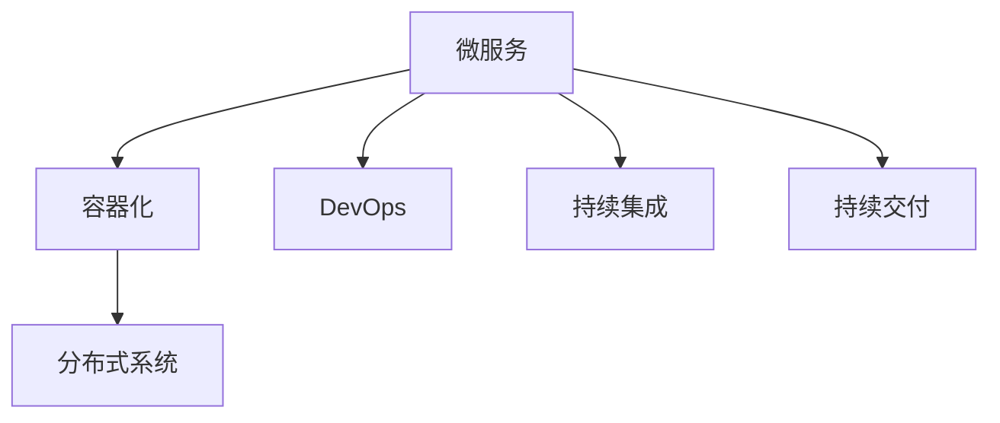
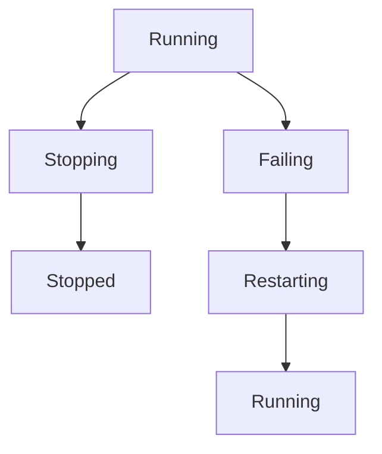

                 

# 云原生应用开发：12因素应用方法论

> 关键词：云原生, 微服务, DevOps, 分布式系统, 可靠性, 可伸缩性, 自动化, 持续交付, 持续集成, 部署, 监控, 安全性, 高性能

## 1. 背景介绍

### 1.1 问题由来
随着云计算技术的普及和互联网应用的不断发展，传统单体架构已无法满足日益增长的业务需求。云原生应用的出现，为构建可伸缩、高可用、自愈的分布式系统提供了新的思路和方法。十二因素应用程序（12-Factor App）作为一种标准的云原生开发方法论，正广泛应用于各大企业，帮助开发者实现高效、安全、稳定的应用部署和运维。

### 1.2 问题核心关键点
十二因素应用程序由马丁·弗莱彻（Martin Fowler）和萨姆·纽曼（Sam Newman）提出，通过十二个核心原则指导开发者构建健壮、灵活的云原生应用。这些原则包括依赖管理、配置管理、进程管理、背压和故障恢复等，涵盖了应用的整个生命周期。

十二因素应用程序的方法论体系为云原生应用的开发和运维提供了统一的规范，有利于实现代码复用、系统升级和故障自愈。通过遵循这些原则，开发者可以构建出可扩展、高可靠性、可维护的分布式应用。

## 2. 核心概念与联系

### 2.1 核心概念概述

为了更好地理解十二因素应用程序，本节将介绍几个密切相关的核心概念：

- **微服务**：一种将大型应用拆分为多个小型服务的架构风格。每个服务都是一个独立部署的单元，通过轻量级的通信机制连接起来，可实现独立开发、测试和部署。

- **容器化**：通过容器技术将应用程序及其依赖打包为可移植、可重复的镜像。容器化有助于实现应用的跨平台部署和快速部署。

- **DevOps**：将开发和运维紧密结合，通过自动化和持续集成（CI）/持续交付（CD）提升软件的交付速度和质量。

- **持续集成**：通过频繁、自动化的构建和测试，确保软件的质量和稳定性。

- **持续交付**：在测试通过后，快速地将软件发布到生产环境，支持频繁、可靠的发布。

- **分布式系统**：由多个独立节点组成的系统，每个节点具备独立运行能力，通过网络通信协同工作，以实现系统的高可伸缩性和容错性。

这些核心概念之间的逻辑关系可以通过以下Mermaid流程图来展示：



这个流程图展示了一个典型的云原生应用构建流程：通过微服务架构拆分应用，使用容器化技术进行打包部署，结合DevOps和持续集成/持续交付提升软件的交付速度和质量，最终实现分布式系统的构建。

## 3. 核心算法原理 & 具体操作步骤
### 3.1 算法原理概述

十二因素应用程序的原理基于微服务架构和容器化部署。其核心思想是通过将应用拆分为多个小型服务，使用容器技术进行打包部署，实现应用的可移植性和高可扩展性。

形式化地，假设一个典型的云原生应用由多个微服务 $S_1, S_2, ..., S_n$ 组成，每个服务内部通过无状态、轻量级的通信协议（如HTTP/REST、gRPC等）相互通信。服务 $S_i$ 的容器化镜像为 $M_{S_i}$，其在生产环境中的运行实例为 $I_i$。

整个应用的生命周期管理包括以下几个关键步骤：

1. 初始化服务 $S_i$ 的容器镜像 $M_{S_i}$。
2. 启动服务 $S_i$ 的容器实例 $I_i$。
3. 将 $I_i$ 的服务实例和容器镜像状态信息存入配置管理服务，以便后续监控和故障恢复。
4. 通过负载均衡器将请求分配到各个 $I_i$ 实例，实现负载均衡。
5. 在服务运行过程中，通过回退和重启机制处理故障和错误。
6. 定期检查服务实例和容器镜像的状态，触发预定的自动升级或重建操作。

### 3.2 算法步骤详解

十二因素应用程序的实施步骤可以分为以下五个阶段：

**Step 1: 服务拆分与微服务设计**
- 将现有应用拆分为多个小型服务，每个服务实现独立的功能模块。
- 设计服务间的接口，保证接口的稳定性和可复用性。
- 通过版本控制工具（如Git）管理服务代码，实现快速迭代和版本控制。

**Step 2: 容器化部署**
- 使用容器技术（如Docker）将服务打包为镜像，确保服务在不同环境下的兼容性。
- 使用容器编排工具（如Kubernetes）管理容器实例的部署和调度。
- 为每个容器实例配置必要的依赖和配置项，确保服务稳定运行。

**Step 3: DevOps实践**
- 使用持续集成工具（如Jenkins）自动化构建和测试服务。
- 使用配置管理工具（如Consul）管理服务配置，确保服务的正确部署。
- 使用自动化运维工具（如Ansible）管理服务实例的状态和配置。

**Step 4: 持续交付与部署**
- 使用持续交付平台（如JFrog、CircleCI）实现服务的自动化部署。
- 定义自动化测试和验证策略，确保服务在发布前满足质量标准。
- 通过蓝绿部署、滚动更新等策略，实现服务的平滑切换和故障容错。

**Step 5: 监控与故障恢复**
- 使用监控工具（如Prometheus、Grafana）实时监测服务运行状态和性能指标。
- 定义告警和恢复策略，及时响应和处理故障和异常。
- 使用自动化工具（如Ansible）定期检查服务实例和容器镜像的状态，触发必要的自动化操作。

### 3.3 算法优缺点

十二因素应用程序具有以下优点：
1. 可扩展性：通过服务拆分和容器化部署，实现了应用的灵活扩展。
2. 高可用性：通过负载均衡和故障恢复机制，确保服务的高可用性。
3. 自动化：通过持续集成和持续交付，提升了软件的交付速度和质量。
4. 可维护性：通过微服务设计，服务之间独立性高，易于维护和升级。

同时，该方法也存在一定的局限性：
1. 学习成本高：十二因素应用程序涉及多个组件和技术，需要较高的技术水平。
2. 复杂度增加：拆分服务和容器化部署可能增加系统的复杂度，需慎重设计。
3. 资源消耗大：容器化部署可能增加系统的资源消耗，需要合理配置。
4. 网络依赖高：服务间通信可能带来网络延迟和通信开销，需进行优化。

尽管存在这些局限性，但十二因素应用程序仍是目前最流行和成熟的方法论之一，被广泛应用于大型企业的云原生应用构建。

### 3.4 算法应用领域

十二因素应用程序在多个领域得到了广泛应用，例如：

- 电商系统：将订单处理、支付、物流等不同功能模块拆分，使用容器化部署，实现高并发和高可用。
- 金融服务：将账户管理、交易结算、风险控制等不同功能模块独立部署，通过持续集成和持续交付实现高频次更新和发布。
- 医疗系统：将患者信息、处方管理、诊断等不同功能模块拆分，使用容器化部署，提升系统的可靠性和可扩展性。
- 教育平台：将课程内容、用户管理、互动交流等不同功能模块拆分，使用持续集成和持续交付，实现快速迭代和更新。
- 政府服务：将服务申请、信息查询、数据分析等不同功能模块独立部署，通过负载均衡和故障恢复，保障系统的稳定性和高效性。

除了这些经典领域，十二因素应用程序还广泛应用于物流、旅游、能源等各行各业，为各类系统的构建提供了统一的规范和方法论。

## 4. 数学模型和公式 & 详细讲解
### 4.1 数学模型构建

十二因素应用程序的数学模型主要涉及系统的设计、部署和管理。

记一个云原生应用由 $n$ 个微服务 $S_1, S_2, ..., S_n$ 组成，每个服务的容器化镜像为 $M_{S_i}$，容器实例为 $I_i$。系统通过配置管理服务记录每个 $I_i$ 的运行状态和配置信息，定义负载均衡算法和故障恢复策略，实现系统的可伸缩性和高可用性。

数学模型描述了服务实例和容器镜像的状态变化过程，以及系统在负载均衡和故障恢复时的行为策略。具体而言，服务实例和容器镜像的状态由以下变量表示：

- $s_{i,j}$：服务 $S_i$ 的容器实例 $I_j$ 的状态，可能的取值为 "Running"、"Stopped" 或 "Failing"。
- $m_{i,j}$：服务 $S_i$ 的容器镜像 $M_j$ 的状态，可能的取值为 "Available" 或 "Unavailable"。

系统的状态转移图如下所示：



该状态转移图展示了服务实例和容器镜像在不同状态之间的转换过程。

### 4.2 公式推导过程

以下是服务实例和容器镜像状态转换的数学描述：

- 服务实例启动：$s_{i,j} \rightarrow Running$
- 服务实例停止：$s_{i,j} \rightarrow Stopped$
- 服务实例故障：$s_{i,j} \rightarrow Failing$
- 服务实例重启：$s_{i,j} \rightarrow Restarting \rightarrow Running$
- 容器镜像加载：$m_{i,j} \rightarrow Available$
- 容器镜像失效：$m_{i,j} \rightarrow Unavailable$

定义状态转移矩阵 $P$，其中 $P_{ij}$ 表示从状态 $s_{i,j}$ 转移到状态 $s_{i,j+1}$ 的概率。例如，当服务实例处于 "Running" 状态时，有：

$$
P_{s_{i,j}=Running} = (1 - \text{Fault Rate}) \times (1 - \text{Restart Rate}) + \text{Restart Rate}
$$

其中，$\text{Fault Rate}$ 表示服务实例的故障率，$\text{Restart Rate}$ 表示服务实例的重启率。

定义状态转移矩阵 $Q$，其中 $Q_{ij}$ 表示从状态 $m_{i,j}$ 转移到状态 $m_{i,j+1}$ 的概率。例如，当容器镜像处于 "Available" 状态时，有：

$$
Q_{m_{i,j}=Available} = 1 - \text{Fault Rate}
$$

其中，$\text{Fault Rate}$ 表示容器镜像的故障率。

通过状态转移矩阵 $P$ 和 $Q$，可以计算服务实例和容器镜像在不同状态下的概率分布，进一步分析系统的可靠性和可扩展性。

### 4.3 案例分析与讲解

以一个电商系统为例，分析十二因素应用程序的实现过程。

假设电商系统由订单处理、支付、物流三个微服务组成，每个服务使用独立的容器镜像。使用Kubernetes管理容器实例的部署和调度，通过Consul管理配置信息，使用Prometheus和Grafana实时监测系统性能和故障状态。

**Step 1: 服务拆分与微服务设计**
- 订单处理服务：处理用户订单信息，存储订单状态和商品信息。
- 支付服务：处理用户支付信息，与第三方支付平台对接。
- 物流服务：处理订单发货和物流信息，与物流平台对接。

每个服务设计独立的数据库和缓存，使用REST API进行通信。

**Step 2: 容器化部署**
- 将每个服务打包为Docker镜像，并在Kubernetes集群中部署容器实例。
- 在Consul中定义每个容器实例的服务名、端口、标签等信息，以便负载均衡和故障恢复。

**Step 3: DevOps实践**
- 使用Jenkins构建和测试服务代码，通过Consul自动化部署容器实例。
- 使用Ansible管理容器实例的状态和配置，定期检查和更新配置信息。

**Step 4: 持续交付与部署**
- 在JFrog中定义持续交付流程，实现自动化构建、测试和部署。
- 使用滚动更新策略，确保服务的平滑切换和容错。

**Step 5: 监控与故障恢复**
- 使用Prometheus和Grafana实时监测系统性能和故障状态，设置告警规则。
- 定义回退和重启策略，通过Ansible自动重启故障服务实例。

通过上述步骤，电商系统实现了高性能、高可用和自动化的服务部署和管理，提升了用户体验和运营效率。

## 5. 项目实践：代码实例和详细解释说明
### 5.1 开发环境搭建

在进行十二因素应用程序的开发实践前，需要先准备好开发环境。以下是使用Python进行Kubernetes开发的环境配置流程：

1. 安装Anaconda：从官网下载并安装Anaconda，用于创建独立的Python环境。

2. 创建并激活虚拟环境：
```bash
conda create -n kubernetes-env python=3.8 
conda activate kubernetes-env
```

3. 安装Kubernetes：根据操作系统版本，从官网获取对应的安装命令。例如，在Ubuntu系统上，可以通过以下命令安装Kubernetes：
```bash
sudo apt-get update
sudo apt-get install -y apt-transport-https curl
curl -s https://packages.cloud.google.com/apt/doc/apt-key.gpg | sudo apt-key add -
echo "deb https://apt.kubernetes.io/ kubernetes-xenial main" | sudo tee -a /etc/apt/sources.list.d/kubernetes.list
sudo apt-get update
sudo apt-get install -y kubelet kubeadm kubectl
```

4. 安装Consul：从官网下载并安装Consul，用于服务配置管理。
```bash
sudo apt-get update
sudo apt-get install -y consul
```

5. 安装Prometheus和Grafana：从官网下载并安装Prometheus和Grafana，用于系统监控。
```bash
sudo apt-get update
sudo apt-get install -y prometheus prometheus-node-exporter
sudo apt-get install -y grafana
```

完成上述步骤后，即可在`kubernetes-env`环境中开始开发实践。

### 5.2 源代码详细实现

以下是使用Python进行Kubernetes开发的基本示例代码。

首先，定义Kubernetes Pod的YAML文件：

```yaml
apiVersion: v1
kind: Pod
metadata:
  name: nginx
spec:
  containers:
    - name: nginx
      image: nginx:1.19.0
      ports:
        - containerPort: 80
```

然后，使用Kubectl创建Pod：

```bash
kubectl apply -f pod.yaml
```

接着，定义Consul配置文件的YAML文件：

```yaml
consul:
  data中心的名称
  ACL token用于对服务进行身份验证
```

然后，使用Consul配置Pod：

```bash
kubectl label -l name=nginx --annotate consul.kubernetes.io/prometheus.io/configure=YAML \
      --annotate consul.kubernetes.io/prometheus.io/configure=YAML \
      --annotate consul.kubernetes.io/prometheus.io/configure=YAML
```

最后，定义Prometheus的YAML文件：

```yaml
apiVersion: prometheus
scrape_configs:
  - job_name: 'nginx'
    honor_labels: true
    scheme: http
    static_configs:
      - targets: ['localhost:80']
```

然后，使用Prometheus配置Pod：

```bash
kubectl apply -f prometheus.yaml
```

完成上述步骤后，即可启动Kubernetes、Consul、Prometheus和Grafana，进行十二因素应用程序的实践。

### 5.3 代码解读与分析

让我们再详细解读一下关键代码的实现细节：

**Pod定义文件**：
- `apiVersion` 定义API版本，这里为 `v1`。
- `kind` 定义Pod的容器，这里为 `Pod`。
- `metadata` 定义Pod的元数据，这里为 `name`。
- `spec` 定义Pod的配置，这里为容器和端口。

**Consul配置文件**：
- 定义Consul数据中心名称和ACL token，用于身份验证。

**Prometheus配置文件**：
- 定义Prometheus的采集目标，这里我们定义了一个名为 `nginx` 的job，采集目标为 `localhost:80` 的nginx服务。

通过上述代码，我们实现了Kubernetes、Consul、Prometheus和Grafana的部署和管理。这些工具和组件的灵活组合，实现了服务的自动配置、部署和监控，为十二因素应用程序的实践提供了良好的支撑。

## 6. 实际应用场景
### 6.1 智能客服系统

基于十二因素应用程序的智能客服系统，可以实现7x24小时不间断服务，快速响应客户咨询，提供自然流畅的对话体验。

**Step 1: 服务拆分与微服务设计**
- 设计订单管理、问题解答、客服咨询等不同功能模块，每个模块独立部署。
- 使用REST API进行模块间的通信，确保模块的独立性和可复用性。

**Step 2: 容器化部署**
- 将每个功能模块打包为Docker镜像，并在Kubernetes集群中部署容器实例。
- 在Consul中定义每个容器实例的服务名、端口、标签等信息，以便负载均衡和故障恢复。

**Step 3: DevOps实践**
- 使用Jenkins构建和测试功能模块代码，通过Consul自动化部署容器实例。
- 使用Ansible管理容器实例的状态和配置，定期检查和更新配置信息。

**Step 4: 持续交付与部署**
- 在JFrog中定义持续交付流程，实现自动化构建、测试和部署。
- 使用滚动更新策略，确保功能的平滑切换和容错。

**Step 5: 监控与故障恢复**
- 使用Prometheus和Grafana实时监测系统性能和故障状态，设置告警规则。
- 定义回退和重启策略，通过Ansible自动重启故障容器实例。

通过上述步骤，智能客服系统实现了高性能、高可用和自动化的服务部署和管理，提升了客户咨询体验和运营效率。

### 6.2 金融舆情监测

基于十二因素应用程序的金融舆情监测系统，可以实时监测市场舆论动向，帮助金融机构及时应对负面信息传播，规避金融风险。

**Step 1: 服务拆分与微服务设计**
- 设计新闻抓取、舆情分析、风险评估等不同功能模块，每个模块独立部署。
- 使用REST API进行模块间的通信，确保模块的独立性和可复用性。

**Step 2: 容器化部署**
- 将每个功能模块打包为Docker镜像，并在Kubernetes集群中部署容器实例。
- 在Consul中定义每个容器实例的服务名、端口、标签等信息，以便负载均衡和故障恢复。

**Step 3: DevOps实践**
- 使用Jenkins构建和测试功能模块代码，通过Consul自动化部署容器实例。
- 使用Ansible管理容器实例的状态和配置，定期检查和更新配置信息。

**Step 4: 持续交付与部署**
- 在JFrog中定义持续交付流程，实现自动化构建、测试和部署。
- 使用滚动更新策略，确保功能的平滑切换和容错。

**Step 5: 监控与故障恢复**
- 使用Prometheus和Grafana实时监测系统性能和故障状态，设置告警规则。
- 定义回退和重启策略，通过Ansible自动重启故障容器实例。

通过上述步骤，金融舆情监测系统实现了高性能、高可用和自动化的服务部署和管理，提升了风险预警和决策支持能力。

### 6.3 个性化推荐系统

基于十二因素应用程序的个性化推荐系统，可以动态获取用户行为数据，实时推荐个性化内容，提升用户体验和推荐效果。

**Step 1: 服务拆分与微服务设计**
- 设计用户行为分析、推荐引擎、推荐展示等不同功能模块，每个模块独立部署。
- 使用REST API进行模块间的通信，确保模块的独立性和可复用性。

**Step 2: 容器化部署**
- 将每个功能模块打包为Docker镜像，并在Kubernetes集群中部署容器实例。
- 在Consul中定义每个容器实例的服务名、端口、标签等信息，以便负载均衡和故障恢复。

**Step 3: DevOps实践**
- 使用Jenkins构建和测试功能模块代码，通过Consul自动化部署容器实例。
- 使用Ansible管理容器实例的状态和配置，定期检查和更新配置信息。

**Step 4: 持续交付与部署**
- 在JFrog中定义持续交付流程，实现自动化构建、测试和部署。
- 使用滚动更新策略，确保功能的平滑切换和容错。

**Step 5: 监控与故障恢复**
- 使用Prometheus和Grafana实时监测系统性能和故障状态，设置告警规则。
- 定义回退和重启策略，通过Ansible自动重启故障容器实例。

通过上述步骤，个性化推荐系统实现了高性能、高可用和自动化的服务部署和管理，提升了推荐效果和用户体验。

### 6.4 未来应用展望

随着十二因素应用程序的不断发展，其在更多领域得到应用，为各行各业带来变革性影响。

在智慧医疗领域，基于十二因素应用程序的医疗问答、病历分析、药物研发等应用将提升医疗服务的智能化水平，辅助医生诊疗，加速新药开发进程。

在智能教育领域，十二因素应用程序可应用于作业批改、学情分析、知识推荐等方面，因材施教，促进教育公平，提高教学质量。

在智慧城市治理中，十二因素应用程序可应用于城市事件监测、舆情分析、应急指挥等环节，提高城市管理的自动化和智能化水平，构建更安全、高效的未来城市。

此外，在企业生产、社会治理、文娱传媒等众多领域，十二因素应用程序也将不断涌现，为传统行业数字化转型升级提供新的技术路径。相信随着技术的日益成熟，十二因素应用程序必将在构建人机协同的智能时代中扮演越来越重要的角色。

## 7. 工具和资源推荐
### 7.1 学习资源推荐

为了帮助开发者系统掌握十二因素应用程序的理论基础和实践技巧，这里推荐一些优质的学习资源：

1. 《Designing Data-Intensive Applications》：通过实际案例讲解云原生应用的设计和部署，深入浅出地介绍了微服务架构、容器化、DevOps等关键概念。

2. 《Cloud-Native Applications: Twelve-Factor Guide》：马丁·弗莱彻（Martin Fowler）和萨姆·纽曼（Sam Newman）的著作，系统讲解十二因素应用程序的核心原则和实践方法。

3. 《Microservices: Principles and Patterns》：通过实际案例讲解微服务架构的设计和部署，深入讲解微服务设计、接口定义、服务拆分等核心概念。

4. 《Cloud Native Development with Kubernetes》：通过实际案例讲解Kubernetes的应用和实践，深入讲解Kubernetes的部署、调度、监控等核心功能。

5. 《Prometheus Cookbook》：通过实际案例讲解Prometheus的应用和实践，深入讲解Prometheus的配置、监控、告警等核心功能。

通过对这些资源的学习实践，相信你一定能够快速掌握十二因素应用程序的精髓，并用于解决实际的云原生应用问题。

### 7.2 开发工具推荐

高效的开发离不开优秀的工具支持。以下是几款用于十二因素应用程序开发的常用工具：

1. Docker：开源的容器引擎，通过容器技术将应用及其依赖打包为镜像，实现跨平台部署。

2. Kubernetes：开源的容器编排平台，实现服务的高可用性、高伸缩性和高安全性。

3. Jenkins：开源的持续集成和持续交付工具，实现自动化构建和测试。

4. Consul：开源的服务发现和配置管理工具，实现服务的自动配置和管理。

5. Prometheus：开源的系统监控工具，实现实时监控和告警。

6. Grafana：开源的可视化工具，实现系统性能和告警的实时监控和展示。

合理利用这些工具，可以显著提升十二因素应用程序的开发效率，加快创新迭代的步伐。

### 7.3 相关论文推荐

十二因素应用程序的提出源于学界的持续研究。以下是几篇奠基性的相关论文，推荐阅读：

1. "Microservices: A lightweight architecture for developing scalable and sustainable applications"：提出微服务架构的基本概念，强调服务间的松耦合和独立部署。

2. "Production-Ready Microservices"：详细讲解微服务架构在生产环境中的应用，包括服务的划分、部署、监控、故障恢复等。

3. "The Twelve-Factor App: Cloud-native microservices with Twelve Success Factors"：详细讲解十二因素应用程序的核心原则，指导开发者构建健壮、灵活的云原生应用。

4. "Continuous Delivery: Reliable Software Releases through Build, Test, and Deploy Automation"：详细讲解持续交付的核心概念和实践方法，推动软件交付的自动化和可靠性。

5. "Monitoring of Distributed Systems in the Wild"：详细讲解分布式系统监控的核心概念和实践方法，推动系统监控的自动化和可视化。

这些论文代表了大语言模型微调技术的发展脉络。通过学习这些前沿成果，可以帮助研究者把握学科前进方向，激发更多的创新灵感。

## 8. 总结：未来发展趋势与挑战
### 8.1 总结

本文对十二因素应用程序的开发方法进行了全面系统的介绍。首先阐述了十二因素应用程序的研究背景和意义，明确了微服务架构和容器化部署对云原生应用的重要性。其次，从原理到实践，详细讲解了十二因素应用程序的数学模型和关键步骤，给出了十二因素应用程序的完整代码实例。同时，本文还广泛探讨了十二因素应用程序在智能客服、金融舆情、个性化推荐等多个行业领域的应用前景，展示了十二因素应用程序的巨大潜力。此外，本文精选了十二因素应用程序的学习资源，力求为读者提供全方位的技术指引。

通过本文的系统梳理，可以看到，十二因素应用程序为构建云原生应用提供了统一的规范和方法论，有助于实现高效、稳定、自动化的系统构建和运维。通过遵循这些原则，开发者可以构建出可扩展、高可靠性、可维护的分布式应用，提升软件的交付速度和质量。

### 8.2 未来发展趋势

展望未来，十二因素应用程序将呈现以下几个发展趋势：

1. 微服务架构的进一步优化。未来微服务将更加精细化、组件化，服务间通信将更加轻量级、高效化。同时，将引入更多分布式事务和跨服务调用技术，提升系统的稳定性和可靠性。

2. 容器化技术的普及。容器化技术将成为云原生应用的标准，进一步推动应用的自动化部署和运维。

3. DevOps文化的深入。DevOps文化将进一步普及，通过自动化和持续交付提升软件的交付速度和质量。

4. 持续交付和持续集成工具的创新。未来将出现更多功能强大、易于使用的持续交付和持续集成工具，推动应用的自动化和快速迭代。

5. 自动化运维工具的完善。自动化运维工具将进一步完善，通过智能化运维提升系统的稳定性和可扩展性。

6. 多云环境的支持。云原生应用将在多云环境下部署和运维，提升系统的弹性和可移植性。

以上趋势凸显了十二因素应用程序的广阔前景。这些方向的探索发展，必将进一步提升云原生应用的性能和应用范围，为数字化转型提供强大的技术支撑。

### 8.3 面临的挑战

尽管十二因素应用程序已经取得了一定的成就，但在迈向更加智能化、普适化应用的过程中，它仍面临着诸多挑战：

1. 学习成本高。十二因素应用程序涉及多个组件和技术，需要较高的技术水平。如何降低学习成本，普及十二因素应用程序的实践，还需进一步探索。

2. 复杂度增加。微服务拆分和服务间通信可能增加系统的复杂度，需慎重设计。

3. 资源消耗大。容器化部署可能增加系统的资源消耗，需要合理配置。

4. 网络依赖高。服务间通信可能带来网络延迟和通信开销，需进行优化。

尽管存在这些挑战，但十二因素应用程序仍是目前最流行和成熟的方法论之一，被广泛应用于大型企业的云原生应用构建。

### 8.4 研究展望

面对十二因素应用程序所面临的挑战，未来的研究需要在以下几个方面寻求新的突破：

1. 探索无状态服务的设计。通过引入无状态服务，进一步降低系统的复杂度和维护成本。

2. 引入更多的跨服务通信技术。通过引入更多的跨服务通信技术，提升服务的可靠性和可扩展性。

3. 探索更高效的微服务调度算法。通过更高效的微服务调度算法，提升系统的响应速度和负载均衡能力。

4. 引入更多的自动化运维工具。通过更多的自动化运维工具，提升系统的自动化程度和可扩展性。

5. 引入更多的容器编排工具。通过更多的容器编排工具，提升系统的部署和运维效率。

这些研究方向的探索，必将引领十二因素应用程序迈向更高的台阶，为云原生应用的构建提供更全面、更可靠的技术保障。

## 9. 附录：常见问题与解答

**Q1：十二因素应用程序是否适用于所有云原生应用？**

A: 十二因素应用程序适用于大多数云原生应用，特别是对于服务拆分和容器化部署需求较高的应用。但对于一些特定领域的应用，如实时计算、低延迟应用等，可能需要引入其他的架构和技术。

**Q2：如何选择合适的容器编排工具？**

A: 选择合适的容器编排工具需要考虑应用的规模、复杂度和需求。对于中小型应用，可以使用Kubernetes等开源工具；对于大型企业，可以使用云服务商提供的商业版容器编排工具，如AWS ECS、Azure Kubernetes Service等。

**Q3：如何缓解微服务之间的通信延迟？**

A: 缓解微服务之间通信延迟的方法包括：使用高效的跨服务通信协议（如gRPC）、负载均衡、CDN加速等。同时，可以通过缓存、批量处理等策略减少服务间通信的频率和量。

**Q4：十二因素应用程序的性能瓶颈在哪里？**

A: 十二因素应用程序的性能瓶颈主要在服务拆分和容器化部署阶段。服务拆分可能增加系统的复杂度，容器化部署可能增加系统的资源消耗。

**Q5：十二因素应用程序在实时计算中的应用前景如何？**

A: 十二因素应用程序在实时计算中的应用前景广阔。通过引入无状态服务、微服务调度算法等技术，可以实现高效的实时计算系统。同时，可以使用Kafka等消息队列技术进行异步处理，提升系统的响应速度和吞吐量。

通过以上对十二因素应用程序的全面介绍和分析，相信你一定能够更好地理解该方法论的核心思想和实践方法，并应用于实际的项目开发中。未来，随着云原生技术和十二因素应用程序的不断进步，相信云原生应用将迎来更广阔的发展空间，为各行各业带来变革性影响。

