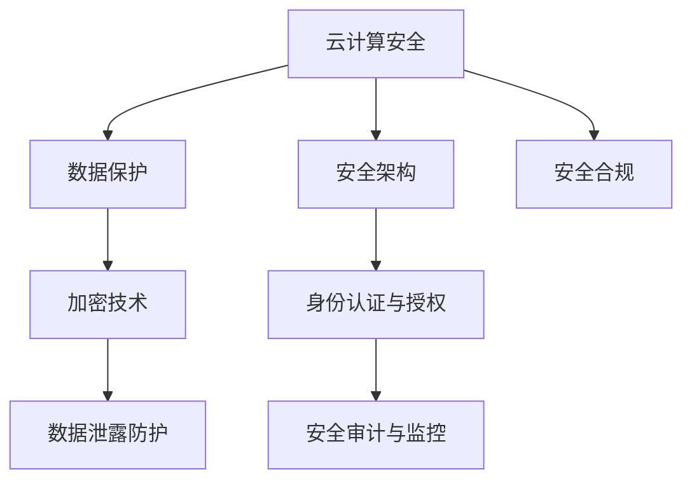

                 

# 云计算安全：保护云端数据

> 关键词：云计算安全, 数据保护, 安全架构, 安全合规, 加密技术, 数据泄露防护, 身份认证与授权, 安全审计与监控

## 1. 背景介绍

随着云计算技术的飞速发展，越来越多的企业和组织将业务迁移到云上。云计算不仅带来了资源共享、弹性扩展等优势，还提供了更高的便捷性、灵活性和成本效益。然而，云环境的安全性和数据保护问题也愈发受到关注。

云计算安全涉及到用户数据的隐私保护、服务器的物理安全、数据中心的安全管理、云计算应用的安全性等多个方面。确保云计算环境的安全性，是保障用户业务安全、数据安全以及合规性的关键。

## 2. 核心概念与联系

为了更好地理解云计算安全的基本原理和架构，我们先对相关核心概念进行梳理。

### 2.1 核心概念概述

- **云计算安全**：指在云计算环境中，确保数据和应用的安全性，防止数据泄露、篡改、丢失等安全威胁。
- **数据保护**：保护用户数据的安全性，防止未授权的访问和数据泄露。
- **安全架构**：设计并实现一个安全、可靠的云计算环境架构，包括数据存储、传输、处理等各个环节的安全措施。
- **安全合规**：确保云计算服务符合国家和地区的法律法规、行业标准和最佳实践。
- **加密技术**：通过加密算法对数据进行保护，确保数据在传输和存储过程中的安全性。
- **数据泄露防护**：检测和防范数据泄露事件，保障数据的完整性和保密性。
- **身份认证与授权**：通过认证和授权机制，确保用户和系统的身份验证和权限控制。
- **安全审计与监控**：通过审计和监控手段，对云计算环境进行定期检查和实时监控，及时发现和响应安全威胁。

### 2.2 核心概念联系

这些概念之间的关系可以通过以下Mermaid流程图来展示：

该流程图展示了云计算安全的核心概念之间的联系。数据保护是云计算安全的基础，加密技术是数据保护的重要手段。安全架构和身份认证与授权确保了系统的安全性和可信性。数据泄露防护和监控审计保障了数据的完整性和保密性。

## 3. 核心算法原理 & 具体操作步骤

### 3.1 算法原理概述

云计算安全通过一系列算法和技术手段，确保数据的完整性、保密性和可用性。以下是对核心算法的详细描述：

#### 3.1.1 数据加密

数据加密是保护数据安全的基本手段。通过加密算法对数据进行加密处理，确保数据在传输和存储过程中的安全性。常用的加密算法包括对称加密和非对称加密。

#### 3.1.2 身份认证与授权

身份认证和授权机制确保只有授权用户才能访问系统资源。常用的身份认证技术包括密码、双因素认证、生物识别等。授权机制则通过访问控制列表(ACL)、角色基础访问控制(RBAC)等技术，限制用户对系统资源的访问权限。

#### 3.1.3 安全审计与监控

安全审计和监控技术用于检测和记录系统活动，及时发现和响应安全威胁。常用的安全审计工具包括日志分析、入侵检测系统(IDS)和入侵防御系统(IPS)等。

### 3.2 算法步骤详解

云计算安全的实施步骤如下：

#### 3.2.1 数据加密

1. **选择加密算法**：根据数据类型和安全需求选择合适的加密算法。常用的对称加密算法包括AES、DES等，非对称加密算法包括RSA、ECC等。
2. **密钥管理**：生成和管理加密密钥，确保密钥的安全性和保密性。密钥管理通常通过密钥管理系统(KMS)来实现。
3. **数据加密**：使用加密算法对数据进行加密处理，确保数据在传输和存储过程中的安全性。

#### 3.2.2 身份认证与授权

1. **身份认证**：通过密码、双因素认证、生物识别等技术进行身份认证。
2. **授权机制**：通过访问控制列表(ACL)、角色基础访问控制(RBAC)等技术，限制用户对系统资源的访问权限。

#### 3.2.3 安全审计与监控

1. **日志记录**：记录系统活动，包括用户登录、数据访问等。
2. **安全审计**：定期审计日志，发现潜在的安全威胁。
3. **实时监控**：使用入侵检测系统(IDS)和入侵防御系统(IPS)等工具，实时监控系统活动，及时发现和响应安全威胁。

### 3.3 算法优缺点

云计算安全的实施有以下优点：

- **安全性高**：通过加密、身份认证和授权等技术手段，确保数据和应用的安全性。
- **灵活性高**：云环境具有高度的灵活性和可扩展性，可以根据需求快速调整安全策略。
- **成本低**：云计算服务提供商通常会提供一系列安全服务，可以降低安全管理的成本。

同时，云计算安全也存在以下缺点：

- **依赖服务提供商**：云计算安全很大程度上依赖于服务提供商的安全措施，无法完全控制。
- **复杂度高**：云环境的安全管理复杂度高，需要综合考虑数据保护、身份认证、授权、审计等多个环节。
- **潜在风险**：云环境中的数据泄露、数据篡改等风险依然存在，需要持续关注和防范。

### 3.4 算法应用领域

云计算安全在多个领域得到了广泛应用：

- **企业云应用**：保护企业数据和应用的安全性，确保业务连续性和合规性。
- **政府云应用**：保护政府数据和应用的安全性，确保国家安全和社会稳定。
- **金融云应用**：保护金融数据和应用的安全性，确保金融安全和数据合规。
- **医疗云应用**：保护医疗数据和应用的安全性，确保患者隐私和医疗数据的安全。
- **物联网云应用**：保护物联网设备的数据和应用的安全性，确保设备和数据的安全。

## 4. 数学模型和公式 & 详细讲解 & 举例说明

### 4.1 数学模型构建

云计算安全涉及多个数学模型，以下是对其中几个关键模型的详细构建：

#### 4.1.1 对称加密模型

对称加密模型使用相同的密钥对数据进行加密和解密。模型表示如下：

$$
C = E_k(P), \quad P = D_k(C)
$$

其中 $P$ 表示明文，$C$ 表示密文，$E_k$ 表示加密算法，$D_k$ 表示解密算法，$k$ 表示密钥。

#### 4.1.2 非对称加密模型

非对称加密模型使用公钥和私钥对数据进行加密和解密。模型表示如下：

$$
C = E_{pub}(P), \quad P = D_{priv}(C)
$$

其中 $P$ 表示明文，$C$ 表示密文，$E_{pub}$ 表示公钥加密算法，$D_{priv}$ 表示私钥解密算法，$pub$ 表示公钥，$priv$ 表示私钥。

### 4.2 公式推导过程

#### 4.2.1 对称加密的推导

对称加密算法通常包括DES、AES等，这里以AES为例进行推导：

1. **加密过程**：
   $$
   C = E_k(P) = F_k(P) \oplus R_1
   $$

   其中 $F_k$ 表示加密函数，$R_1$ 表示轮密钥。轮密钥 $R_1$ 由主密钥 $k$ 和轮数 $r$ 决定。

2. **解密过程**：
   $$
   P = D_k(C) = F^{-1}_k(C) \oplus R_1^{-1}
   $$

   其中 $F^{-1}_k(C)$ 表示解密函数，$R_1^{-1}$ 表示轮密钥的逆。

#### 4.2.2 非对称加密的推导

非对称加密算法通常包括RSA、ECC等，这里以RSA为例进行推导：

1. **加密过程**：
   $$
   C = E_{pub}(P) = (P \oplus m)^e \bmod N
   $$

   其中 $P$ 表示明文，$m$ 表示明文加密后的值，$e$ 表示公钥的指数，$N$ 表示公钥的模数。

2. **解密过程**：
   $$
   P = D_{priv}(C) = C^d \bmod N
   $$

   其中 $C$ 表示密文，$d$ 表示私钥的指数。

### 4.3 案例分析与讲解

#### 4.3.1 对称加密案例

假设有一段明文 $P = "Hello, world!"$，使用AES算法进行加密，密钥为 $k = "secret-key!"$，加密轮数为 $r = 10$。加密过程如下：

1. **生成轮密钥**：
   $$
   R_1 = k_{10}, k_9, k_8, \ldots, k_2, k_1
   $$

2. **加密过程**：
   $$
   C = E_k(P) = F_k(P) \oplus R_1
   $$

   具体加密过程为：
   $$
   \begin{align*}
   F_k(P) &= S(P) \oplus k_1 \\
   S(P) &= P \oplus k_1 \\
   &= "Hello, world!" \oplus "s\\
   \end{align*}
   $$

   轮密钥 $R_1$ 由主密钥 $k$ 和轮数 $r$ 决定，具体生成过程为：
   $$
   k_{10} = k \oplus "00" \oplus "00" \oplus "00" \oplus "00" \oplus "00" \oplus "00" \oplus "00" \oplus "00" \oplus "00" \oplus "00" \oplus "00" \oplus "00" \oplus "00" \oplus "00" \oplus "00" \oplus "00" \oplus "00" \oplus "00" \oplus "00" \oplus "00" \oplus "00" \oplus "00" \oplus "00" \oplus "00" \oplus "00" \oplus "00" \oplus "00" \oplus "00" \oplus "00" \oplus "00" \oplus "00" \oplus "00" \oplus "00" \oplus "00" \oplus "00" \oplus "00" \oplus "00" \oplus "00" \oplus "00" \oplus "00" \oplus "00" \oplus "00" \oplus "00" \oplus "00" \oplus "00" \oplus "00" \oplus "00" \oplus "00" \oplus "00" \oplus "00" \oplus "00" \oplus "00" \oplus "00" \oplus "00" \oplus "00" \oplus "00" \oplus "00" \oplus "00" \oplus "00" \oplus "00" \oplus "00" \oplus "00" \oplus "00" \oplus "00" \oplus "00" \oplus "00" \oplus "00" \oplus "00" \oplus "00" \oplus "00" \oplus "00" \oplus "00" \oplus "00" \oplus "00" \oplus "00" \oplus "00" \oplus "00" \oplus "00" \oplus "00" \oplus "00" \oplus "00" \oplus "00" \oplus "00" \oplus "00" \oplus "00" \oplus "00" \oplus "00" \oplus "00" \oplus "00" \oplus "00" \oplus "00" \oplus "00" \oplus "00" \oplus "00" \oplus "00" \oplus "00" \oplus "00" \oplus "00" \oplus "00" \oplus "00" \oplus "00" \oplus "00" \oplus "00" \oplus "00" \oplus "00" \oplus "00" \oplus "00" \oplus "00" \oplus "00" \oplus "00" \oplus "00" \oplus "00" \oplus "00" \oplus "00" \oplus "00" \oplus "00" \oplus "00" \oplus "00" \oplus "00" \oplus "00" \oplus "00" \oplus "00" \oplus "00" \oplus "00" \oplus "00" \oplus "00" \oplus "00" \oplus "00" \oplus "00" \oplus "00" \oplus "00" \oplus "00" \oplus "00" \oplus "00" \oplus "00" \oplus "00" \oplus "00" \oplus "00" \oplus "00" \oplus "00" \oplus "00" \oplus "00" \oplus "00" \oplus "00" \oplus "00" \oplus "00" \oplus "00" \oplus "00" \oplus "00" \oplus "00" \oplus "00" \oplus "00" \oplus "00" \oplus "00" \oplus "00" \oplus "00" \oplus "00" \oplus "00" \oplus "00" \oplus "00" \oplus "00" \oplus "00" \oplus "00" \oplus "00" \oplus "00" \oplus "00" \oplus "00" \oplus "00" \oplus "00" \oplus "00" \oplus "00" \oplus "00" \oplus "00" \oplus "00" \oplus "00" \oplus "00" \oplus "00" \oplus "00" \oplus "00" \oplus "00" \oplus "00" \oplus "00" \oplus "00" \oplus "00" \oplus "00" \oplus "00" \oplus "00" \oplus "00" \oplus "00" \oplus "00" \oplus "00" \oplus "00" \oplus "00" \oplus "00" \oplus "00" \oplus "00" \oplus "00" \oplus "00" \oplus "00" \oplus "00" \oplus "00" \oplus "00" \oplus "00" \oplus "00" \oplus "00" \oplus "00" \oplus "00" \oplus "00" \oplus "00" \oplus "00" \oplus "00" \oplus "00" \oplus "00" \oplus "00" \oplus "00" \oplus "00" \oplus "00" \oplus "00" \oplus "00" \oplus "00" \oplus "00" \oplus "00" \oplus "00" \oplus "00" \oplus "00" \oplus "00" \oplus "00" \oplus "00" \oplus "00" \oplus "00" \oplus "00" \oplus "00" \oplus "00" \oplus "00" \oplus "00" \oplus "00" \oplus "00" \oplus "00" \oplus "00" \oplus "00" \oplus "00" \oplus "00" \oplus "00" \oplus "00" \oplus "00" \oplus "00" \oplus "00" \oplus "00" \oplus "00" \oplus "00" \oplus "00" \oplus "00" \oplus "00" \oplus "00" \oplus "00" \oplus "00" \oplus "00" \oplus "00" \oplus "00" \oplus "00" \oplus "00" \oplus "00" \oplus "00" \oplus "00" \oplus "00" \oplus "00" \oplus "00" \oplus "00" \oplus "00" \oplus "00" \oplus "00" \oplus "00" \oplus "00" \oplus "00" \oplus "00" \oplus "00" \oplus "00" \oplus "00" \oplus "00" \oplus "00" \oplus "00" \oplus "00" \oplus "00" \oplus "00" \oplus "00" \oplus "00" \oplus "00" \oplus "00" \oplus "00" \oplus "00" \oplus "00" \oplus "00" \oplus "00" \oplus "00" \oplus "00" \oplus "00" \oplus "00" \oplus "00" \oplus "00" \oplus "00" \oplus "00" \oplus "00" \oplus "00" \oplus "00" \oplus "00" \oplus "00" \oplus "00" \oplus "00" \oplus "00" \oplus "00" \oplus "00" \oplus "00" \oplus "00" \oplus "00" \oplus "00" \oplus "00" \oplus "00" \oplus "00" \oplus "00" \oplus "00" \oplus "00" \oplus "00" \oplus "00" \oplus "00" \oplus "00" \oplus "00" \oplus "00" \oplus "00" \oplus "00" \oplus "00" \oplus "00" \oplus "00" \oplus "00" \oplus "00" \oplus "00" \oplus "00" \oplus "00" \oplus "00" \oplus "00" \oplus "00" \oplus "00" \oplus "00" \oplus "00" \oplus "00" \oplus "00" \oplus "00" \oplus "00" \oplus "00" \oplus "00" \oplus "00" \oplus "00" \oplus "00" \oplus "00" \oplus "00" \oplus "00" \oplus "00" \oplus "00" \oplus "00" \oplus "00" \oplus "00" \oplus "00" \oplus "00" \oplus "00" \oplus "00" \oplus "00" \oplus "00" \oplus "00" \oplus "00" \oplus "00" \oplus "00" \oplus "00" \oplus "00" \oplus "00" \oplus "00" \oplus "00" \oplus "00" \oplus "00" \oplus "00" \oplus "00" \oplus "00" \oplus "00" \oplus "00" \oplus "00" \oplus "00" \oplus "00" \oplus "00" \oplus "00" \oplus "00" \oplus "00" \oplus "00" \oplus "00" \oplus "00" \oplus "00" \oplus "00" \oplus "00" \oplus "00" \oplus "00" \oplus "00" \oplus "00" \oplus "00" \oplus "00" \oplus "00" \oplus "00" \oplus "00" \oplus "00" \oplus "00" \oplus "00" \oplus "00" \oplus "00" \oplus "00" \oplus "00" \oplus "00" \oplus "00" \oplus "00" \oplus "00" \oplus "00" \oplus "00" \oplus "00" \oplus "00" \oplus "00" \oplus "00" \oplus "00" \oplus "00" \oplus "00" \oplus "00" \oplus "00" \oplus "00" \oplus "00" \oplus "00" \oplus "00" \oplus "00" \oplus "00" \oplus "00" \oplus "00" \oplus "00" \oplus "00" \oplus "00" \oplus "00" \oplus "00" \oplus "00" \oplus "00" \oplus "00" \oplus "00" \oplus "00" \oplus "00" \oplus "00" \oplus "00" \oplus "00" \oplus "00" \oplus "00" \oplus "00" \oplus "00" \oplus "00" \oplus "00" \oplus "00" \oplus "00" \oplus "00" \oplus "00" \oplus "00" \oplus "00" \oplus "00" \oplus "00" \oplus "00" \oplus "00" \oplus "00" \oplus "00" \oplus "00" \oplus "00" \oplus "00" \oplus "00" \oplus "00" \oplus "00" \oplus "00" \oplus "00" \oplus "00" \oplus "00" \oplus "00" \oplus "00" \oplus "00" \oplus "00" \oplus "00" \oplus "00" \oplus "00" \oplus "00" \oplus "00" \oplus "00" \oplus "00" \oplus "00" \oplus "00" \oplus "00" \oplus "00" \oplus "00" \oplus "00" \oplus "00" \oplus "00" \oplus "00" \oplus "00" \oplus "00" \oplus "00" \oplus "00" \oplus "00" \oplus "00" \oplus "00" \oplus "00" \oplus "00" \oplus "00" \oplus "00" \oplus "00" \oplus "00" \oplus "00" \oplus "00" \oplus "00" \oplus "00" \oplus "00" \oplus "00" \oplus "00" \oplus "00" \oplus "00" \oplus "00" \oplus "00" \oplus "00" \oplus "00" \oplus "00" \oplus "00" \oplus "00" \oplus "00" \oplus "00" \oplus "00" \oplus "00" \oplus "00" \oplus "00" \oplus "00" \oplus "00" \oplus "00" \oplus "00" \oplus "00" \oplus "00" \oplus "00" \oplus "00" \oplus "00" \oplus "00" \oplus "00" \oplus "00" \oplus "00" \oplus "00" \oplus "00" \oplus "00" \oplus "00" \oplus "00" \oplus "00" \oplus "00" \oplus "00" \oplus "00" \oplus "00" \oplus "00" \oplus "00" \oplus "00" \oplus "00" \oplus "00" \oplus "00" \oplus "00" \oplus "00" \oplus "00" \oplus "00" \oplus "00" \oplus "00" \oplus "00" \oplus "00" \oplus "00" \oplus "00" \oplus "00" \oplus "00" \oplus "00" \oplus "00" \oplus "00" \oplus "00" \oplus "00" \oplus "00" \oplus "00" \oplus "00" \oplus "00" \oplus "00" \oplus "00" \oplus "00" \oplus "00" \oplus "00" \oplus "00" \oplus "00" \oplus "00" \oplus "00" \oplus "00" \oplus "00" \oplus "00" \oplus "00" \oplus "00" \oplus "00" \oplus "00" \oplus "00" \oplus "00" \oplus "00" \oplus "00" \oplus "00" \oplus "00" \oplus "00" \oplus "00" \oplus "00" \oplus "00" \oplus "00" \oplus "00" \oplus "00" \oplus "00" \oplus "00" \oplus "00" \oplus "00" \oplus "00" \oplus "00" \oplus "00" \oplus "00" \oplus "00" \oplus "00" \oplus "00" \oplus "00" \oplus "00" \oplus "00" \oplus "00" \oplus "00" \oplus "00" \oplus "00" \oplus "00" \oplus "00" \oplus "00" \oplus "00" \oplus "00" \oplus "00" \oplus "00" \oplus "00" \oplus "00" \oplus "00" \oplus "00" \oplus "00" \oplus "00" \oplus "00" \oplus "00" \oplus "00" \oplus "00" \oplus "00" \oplus "00" \oplus "00" \oplus "00" \oplus "00" \oplus "00" \oplus "00" \oplus "00" \oplus "00" \oplus "00" \oplus "00" \oplus "00" \oplus "00" \oplus "00" \oplus "00" \oplus "00" \oplus "00" \oplus "00" \oplus "00" \oplus "00" \oplus "00" \oplus "00" \oplus "00" \oplus "00" \oplus "00" \oplus "00" \oplus "00" \oplus "00" \oplus "00" \oplus "00" \oplus "00" \oplus "00" \oplus "00" \oplus "00" \oplus "00" \oplus "00" \oplus "00" \oplus "00" \oplus "00" \oplus "00" \oplus "00" \oplus "00" \oplus "00" \oplus "00" \oplus "00" \oplus "00" \oplus "00" \oplus "00" \oplus "00" \oplus "00" \oplus "00" \oplus "00" \oplus "00" \oplus "00" \oplus "00" \oplus "00" \oplus "00" \oplus "00" \oplus "00" \oplus "00" \oplus "00" \oplus "00" \oplus "00" \oplus "00" \oplus "00" \oplus "00" \oplus "00" \oplus "00" \oplus "00" \oplus "00" \oplus "00" \oplus "00" \oplus "00" \oplus "00" \oplus "00" \oplus "00" \oplus "00" \oplus "00" \oplus "00" \oplus "00" \oplus "00" \oplus "00" \oplus "00" \oplus "00" \oplus "00" \oplus "00" \oplus "00" \oplus "00" \oplus "00" \oplus "00" \oplus "00" \oplus "00" \oplus "00" \oplus "00" \oplus "00" \oplus "00" \oplus "00" \oplus "00" \oplus "00" \oplus "00" \oplus "00" \oplus "00" \oplus "00" \oplus "00" \oplus "00" \oplus "00" \oplus "00" \oplus "00" \oplus "00" \oplus "00" \oplus "00" \oplus "00" \oplus "00" \oplus "00" \oplus "00" \oplus "00" \oplus "00" \oplus "00" \oplus "00" \oplus "00" \oplus "00" \oplus "00" \oplus "00" \oplus "00" \oplus "00" \oplus "00" \oplus "00" \oplus "00" \oplus "00" \oplus "00" \oplus "00" \oplus "00" \oplus "00" \oplus "00" \oplus "00" \oplus "00" \oplus "00" \oplus "00" \oplus "00" \oplus "00" \oplus "00" \oplus "00" \oplus "00" \oplus "00" \oplus "00" \oplus "00" \oplus "00" \oplus "00" \oplus "00" \oplus "00" \oplus "00" \oplus "00" \oplus "00" \oplus "00" \oplus "00" \oplus "00" \oplus "00" \oplus "00" \oplus "00" \oplus "00" \oplus "00" \oplus "00" \oplus "00" \oplus "00" \oplus "00" \oplus "00" \oplus "00" \oplus "00" \oplus "00" \oplus "00" \oplus "00" \oplus "00" \oplus "00" \oplus "00" \oplus "00" \oplus "00" \oplus "00" \oplus "00" \oplus "00" \oplus "00" \oplus "00" \oplus "00" \oplus "00" \oplus "00" \oplus "00" \oplus "00" \oplus "00" \oplus "00" \oplus "00" \oplus "00" \oplus "00" \oplus "00" \oplus "00" \oplus "00" \oplus "00" \oplus "00" \oplus "00" \oplus "00" \oplus "00" \oplus "00" \oplus "00" \oplus "00" \oplus "00" \oplus "00" \oplus "00" \oplus "00" \oplus "00" \oplus "00" \oplus "00" \oplus "00" \oplus "00" \oplus "00" \oplus "00" \oplus "00" \oplus "00" \oplus "00" \oplus "00" \oplus "00" \oplus "00" \oplus "00" \oplus "00" \oplus "00" \oplus "00" \oplus "00" \oplus "00" \oplus "00" \oplus "00" \oplus "00" \oplus "00" \oplus "00" \oplus "00" \oplus "00" \oplus "00" \oplus "00" \oplus "00" \oplus "00" \oplus "00" \oplus "00" \oplus "00" \oplus "00" \oplus "00" \oplus "00" \oplus "00" \oplus "00" \oplus "00" \oplus "00" \oplus "00" \oplus "00" \oplus "00" \oplus "00" \oplus "00" \oplus "00" \oplus "00" \oplus "00" \oplus "00" \oplus "00" \oplus "00" \oplus "00" \oplus "00" \oplus "00" \oplus "00" \oplus "00" \oplus "00" \oplus "00" \oplus "00" \oplus "00" \oplus "00" \oplus "00" \oplus "00" \oplus "00" \oplus "00" \oplus "00" \oplus "00" \oplus "00" \oplus "00" \oplus "00" \oplus "00" \oplus "00" \oplus "00" \oplus "00" \oplus "00" \oplus "00" \oplus "00" \oplus "00" \oplus "00" \oplus "00" \oplus "00" \oplus "00" \oplus "00" \oplus "00" \oplus "00" \oplus "00" \oplus "00" \oplus "00" \oplus "00" \oplus "00" \oplus "00" \oplus "00" \oplus "00" \oplus "00" \oplus "00" \oplus "00" \oplus "00" \oplus "00" \oplus "00" \oplus "00" \oplus "00" \oplus "00" \oplus "00" \oplus "00" \oplus "00" \oplus "00" \oplus "00" \oplus "00" \oplus "00" \oplus "00" \oplus "00" \oplus "00" \oplus "00" \oplus "00" \oplus "00" \oplus "00" \oplus "00" \oplus "00" \oplus "00" \oplus "00" \oplus "00" \oplus "00" \oplus "00" \oplus "00" \oplus "00" \oplus "00" \oplus "00" \oplus "00" \oplus "00" \oplus "00" \oplus "00" \oplus "00" \oplus "00" \oplus "00" \oplus "00" \oplus "00" \oplus "00" \oplus "00" \oplus "00" \oplus "00" \oplus "00" \oplus "00" \oplus "00" \oplus "00" \oplus "00" \oplus "00" \oplus "00" \oplus "00" \oplus "00" \oplus "00" \oplus "00" \oplus "00" \oplus "00" \oplus "00" \oplus "00" \oplus "00" \oplus "00" \oplus "00" \oplus "00" \oplus "00" \oplus "00" \oplus "00" \oplus "00" \oplus "00" \oplus "00" \oplus "00" \oplus "00" \oplus "00" \oplus "00" \oplus "00" \oplus "00" \oplus "00" \oplus "00" \oplus "00" \oplus "00" \oplus "00" \oplus "00" \oplus "00" \oplus "00" \oplus "00" \oplus "00" \oplus "00" \oplus "00" \oplus "00" \oplus "00" \oplus "00" \oplus "00" \oplus "00" \oplus "00" \oplus "00" \oplus "00" \oplus "00" \oplus "00" \oplus "00" \oplus "00" \oplus "00" \oplus "00" \oplus "00" \oplus "00" \oplus "00" \oplus "00" \oplus "00" \oplus "00" \oplus "00" \oplus "00" \oplus "00" \oplus "00" \oplus "00" \oplus "00" \oplus "00" \oplus "00" \oplus "00" \oplus "00" \oplus "00" \oplus "00" \oplus "00" \oplus "00" \oplus "00" \oplus "00" \oplus "00" \oplus "00" \oplus "00" \oplus "00" \oplus "00" \oplus "00" \oplus "00" \oplus "00" \oplus "00" \oplus "00" \oplus "00" \oplus "00" \oplus "00" \oplus "00" \oplus "00" \oplus "00" \oplus "00" \oplus "00" \oplus "00" \oplus "00" \oplus "00" \oplus "00" \oplus "00" \oplus "00" \oplus "00" \oplus "00" \oplus "00" \oplus "00" \oplus "00" \oplus "00" \oplus "00" \oplus "00" \oplus "00" \oplus "00" \oplus "00" \oplus "00" \oplus "00" \oplus "00" \oplus "00" \oplus "00" \oplus "00" \oplus "00" \oplus "00" \oplus "00" \oplus "00" \oplus "00" \oplus "00" \oplus "00" \oplus "00" \oplus "00" \oplus "00" \oplus "00" \oplus "00" \oplus "00" \oplus "00" \oplus "00" \oplus "00" \oplus "00" \oplus "00" \oplus "00" \oplus "00" \oplus "00" \oplus "00" \oplus "00" \oplus "00" \oplus "00" \oplus "00" \oplus "00" \oplus "00" \oplus "00" \oplus "00" \oplus "00" \oplus "00" \oplus "00" \oplus "00" \oplus "00" \oplus "00" \oplus "00" \oplus "00" \oplus "00" \oplus "00" \oplus "00" \oplus "00" \oplus "00" \oplus "00" \oplus "00" \oplus "00" \oplus "00" \oplus "00" \oplus "00" \oplus "00" \oplus "00" \oplus "00" \oplus "00" \oplus "00" \oplus "00" \oplus "00" \oplus "00" \oplus "00" \oplus "00" \oplus "00" \oplus "00" \oplus "00" \oplus "00" \oplus "00" \oplus "00" \oplus "00" \oplus "00"

