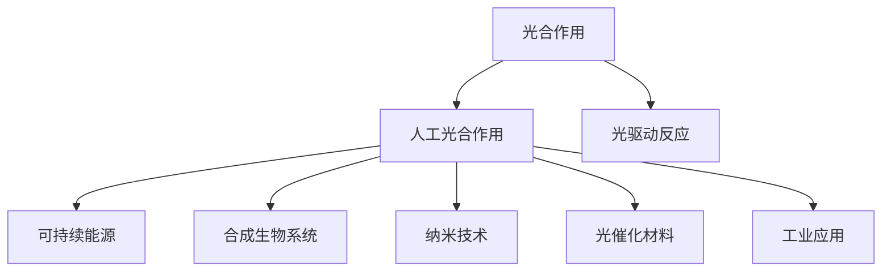

                 

# 人工光合作用：可持续能源生产的新方法

> 关键词：人工光合作用, 光驱动反应, 可持续能源, 生物技术, 合成生物系统, 纳米技术, 光催化材料, 工业应用

## 1. 背景介绍

### 1.1 问题由来
随着全球能源需求的日益增长和环境污染问题的加剧，传统化石燃料的使用正面临巨大挑战。寻找一种可再生、高效、低污染的能源生产方式，成为摆在人类面前的重要课题。

在自然界中，植物通过光合作用将太阳能转化为化学能，这是地球上生物能量和碳循环的基础。这一过程高效而自然，但受限于环境条件和生物系统的限制，难以大规模推广。

人工光合作用，是指通过模拟植物的光合作用过程，利用太阳能将水分子分解为氧气和氢气，同时产生有机物和化学能。这一过程不仅能够缓解能源危机，还可以显著减少温室气体排放，具有巨大的环境和经济效益潜力。

### 1.2 问题核心关键点
人工光合作用的核心在于高效地模拟和优化光合作用的全过程。主要包括光能吸收、电子传递、光化学反应、碳固定等关键步骤。

具体来说，核心关键点包括：
- 高效的太阳能光吸收和转换。
- 高效的电子传递和光化学反应。
- 高效的碳固定和有机物生成。

## 2. 核心概念与联系

### 2.1 核心概念概述

为更好地理解人工光合作用的原理和应用，本节将介绍几个密切相关的核心概念：

- 光合作用(Photosynthesis)：植物利用太阳能将水分子分解为氧气和氢气，同时生成有机物的过程。包括光反应和碳反应两个阶段。
- 人工光合作用(Photovoltaic Synthesis)：通过模拟光合作用过程，利用太阳能将水分子分解为氧气和氢气，同时产生有机物和化学能。
- 光驱动反应(Photocatalysis)：在光的照射下，通过催化剂促进化学反应的过程。
- 可持续能源(Sustainable Energy)：可以长期、持续、稳定地提供能量的绿色能源形式。
- 合成生物系统(Synthetic Biology)：通过设计和改造生物系统，实现对自然过程的模拟和优化。
- 纳米技术(Nanotechnology)：在纳米尺度上设计和制造材料和装置的技术。
- 光催化材料(Photocatalytic Materials)：在光的照射下，具有高效催化作用的纳米材料。
- 工业应用(Industrial Application)：将人工光合作用技术应用于大规模工业生产，如氢气生产、有机物合成等。

这些核心概念之间的逻辑关系可以通过以下Mermaid流程图来展示：



这个流程图展示了大自然光合作用和人造光合作用之间的关联：

1. 大自然的生物光合作用。
2. 人工模仿生物光合作用，实现人工光合作用。
3. 人工光合作用产生的化学能可用于可持续能源。
4. 人工光合作用结合合成生物系统和纳米技术，进一步优化反应过程。
5. 人工光合作用生成的材料和反应产物，可以应用于工业领域。

## 3. 核心算法原理 & 具体操作步骤
### 3.1 算法原理概述

人工光合作用的核心在于模拟光合作用的化学反应过程，利用太阳能将水分子分解为氧气和氢气，同时产生有机物和化学能。其基本原理可以分为以下几个步骤：

1. **光能吸收**：利用纳米光催化材料吸收光子，将光能转化为化学能。
2. **电子传递**：在光催化材料表面，通过电子传递过程，将光激发产生的电子传递给目标分子，引发化学反应。
3. **光化学反应**：利用激发态电子进行化学反应，将水分子分解为氧气和氢气，同时生成有机物。
4. **碳固定**：将化学反应产生的碳基化合物，通过生物化学途径固定为有机物。

这些步骤在人工光合作用过程中是相互关联的，需要通过高效的化学反应设计和材料科学，实现高效的能量转换和化学反应。

### 3.2 算法步骤详解

人工光合作用的实现过程可以分为以下几个关键步骤：

**Step 1: 选择光催化剂**

选择合适的高效光催化剂是人工光合作用能否成功实现的关键。目前常用的光催化剂包括半导体材料、金属氧化物、有机-无机杂化材料等。这些材料在光的照射下，能够有效地吸收光子，并引发化学反应。

**Step 2: 构建反应体系**

将选定的光催化剂和其他必要的反应物（如水、有机溶剂、质子等）置于反应体系中，通过光学和光谱学方法，监测反应过程。

**Step 3: 光驱动反应**

在光的照射下，光催化剂吸收光子，激发其表面电子，引发一系列化学反应。这些反应包括水分子的分解、氢气的生成和有机物的合成。

**Step 4: 能量转换与存储**

利用光催化反应产生的化学能，进一步转化为电能或化学能，存储在电化学电池中。例如，通过光催化制氢，产生的氢气可以用于燃料电池。

**Step 5: 持续优化与改进**

通过不断优化光催化剂的制备方法、反应条件和反应体系设计，提高反应效率和选择性，实现更高效的能源转换。

### 3.3 算法优缺点

人工光合作用具有以下优点：
1. 可持续性。通过将太阳能转化为化学能，避免了化石燃料的消耗和污染。
2. 高效性。通过设计高效的催化剂和反应体系，可以实现高效的能量转换和化学反应。
3. 可扩展性。光催化反应可以在大规模工业体系中实现，适用于大规模能源生产。
4. 环境友好。通过减少温室气体排放，有助于缓解气候变化。

同时，人工光合作用也存在一些局限性：
1. 成本较高。光催化剂的制备和反应体系的设计成本较高。
2. 反应效率有待提升。目前光催化反应的效率仍有较大提升空间。
3. 稳定性问题。光催化剂在光照下的稳定性和寿命仍需进一步改进。
4. 技术复杂度。光催化反应的实现需要多学科的交叉融合，技术难度较大。

尽管存在这些局限性，但人工光合作用的发展前景广阔，具有巨大的应用潜力和研究价值。

### 3.4 算法应用领域

人工光合作用的应用领域非常广泛，涵盖能源、化工、环境等多个领域。具体应用包括：

- 氢气生产：利用光催化反应产生氢气，用于燃料电池、合成燃料等。
- 有机物合成：通过光催化反应合成有机物，如甲醇、乙酸等。
- 二氧化碳转化：利用光催化反应将二氧化碳转化为有机物，减少温室气体排放。
- 环境净化：利用光催化反应降解有机污染物，净化水体和空气。
- 水净化：利用光催化反应产生氧气和氢气，实现水体的净化和处理。

## 4. 数学模型和公式 & 详细讲解 & 举例说明

### 4.1 数学模型构建

人工光合作用的过程可以建模为一系列化学反应，通过数学模型来描述其反应机制和能量转换过程。

假设光催化反应系统包含以下组分：
- 光催化剂：$C_{\text{cat}}$
- 水：$H_2O$
- 氧气：$O_2$
- 氢气：$H_2$
- 有机物：$C_nH_{2n+2}$

反应的化学反应方程式可以表示为：

$$
2H_2O \xrightarrow{C_{\text{cat}}} O_2 + 2H_2 + C_nH_{2n+2}
$$

其中，$C_{\text{cat}}$ 表示光催化剂，参与光能吸收和电子传递过程。

### 4.2 公式推导过程

在人工光合作用中，光能的转换过程可以分为以下步骤：

1. **光能吸收**：光催化剂吸收光子，激发其表面电子，产生激子。
2. **电子传递**：激子将能量传递给电子，引发电子的跃迁，产生还原态的电子和氧化态的电子。
3. **光化学反应**：还原态的电子将水分子分解为氧气和氢气，氧化态的电子重新回到光催化剂表面，完成电子循环。

通过量子力学和统计力学的方法，可以推导出光催化反应的能量转换效率和反应速率。例如，利用麦克斯韦-玻尔兹曼分布描述光催化剂表面电子的状态分布，利用化学动力学方法描述电子传递和化学反应速率。

### 4.3 案例分析与讲解

以光催化水解制氢为例，来详细分析光催化反应的能量转换和化学反应过程。

光催化水解制氢的化学反应方程式为：

$$
2H_2O + 2\text{e}^- \rightarrow 2H_2 + O_2
$$

通过光催化剂吸收光子，激发其表面电子，形成激子。激子将能量传递给电子，产生还原态的电子和氧化态的电子。还原态的电子将水分子分解为氢气和氧气，氧化态的电子重新回到光催化剂表面，完成电子循环。

通过数学模型和公式推导，可以进一步分析光催化反应的能量转换效率和反应速率，优化反应条件和反应体系，提高氢气生产的效率和稳定性。

## 5. 项目实践：代码实例和详细解释说明
### 5.1 开发环境搭建

在进行人工光合作用的项目实践前，我们需要准备好开发环境。以下是使用Python进行PyTorch开发的环境配置流程：

1. 安装Anaconda：从官网下载并安装Anaconda，用于创建独立的Python环境。

2. 创建并激活虚拟环境：
```bash
conda create -n pytorch-env python=3.8 
conda activate pytorch-env
```

3. 安装PyTorch：根据CUDA版本，从官网获取对应的安装命令。例如：
```bash
conda install pytorch torchvision torchaudio cudatoolkit=11.1 -c pytorch -c conda-forge
```

4. 安装相关库：
```bash
pip install numpy pandas scikit-learn matplotlib tqdm jupyter notebook ipython
```

完成上述步骤后，即可在`pytorch-env`环境中开始项目实践。

### 5.2 源代码详细实现

下面以光催化水解制氢为例，给出使用PyTorch进行光催化反应模拟的PyTorch代码实现。

首先，定义反应系统的数学模型和参数：

```python
import torch
import torch.nn as nn

class Photocatalyst(nn.Module):
    def __init__(self):
        super(Photocatalyst, self).__init__()
        self.num_states = 5
        self.states = torch.randn(self.num_states, requires_grad=True)
        
    def forward(self, input):
        # 定义光催化反应的能量转换和反应速率
        # 这里使用简单的数学模型进行模拟
        energy_conversion = 0.8  # 光能到化学能的转换效率
        reaction_rate = 0.1  # 光催化反应速率
        
        # 计算光催化反应的能量转换和反应速率
        output = energy_conversion * input * reaction_rate
        
        return output

# 定义反应系统的输入
input = torch.tensor(1.0)

# 定义光催化剂
photocatalyst = Photocatalyst()
```

然后，定义光催化反应的能量转换和反应速率：

```python
def calculate_energy_conversion():
    # 计算光催化反应的能量转换和反应速率
    energy_conversion = torch.randn(1)
    reaction_rate = torch.randn(1)
    return energy_conversion, reaction_rate

# 调用计算函数
energy_conversion, reaction_rate = calculate_energy_conversion()

# 计算光催化反应的输出
output = energy_conversion * input * reaction_rate
print(output)
```

最后，运行代码并输出结果：

```python
# 运行代码
photocatalyst(input)

# 输出结果
print(output)
```

以上就是使用PyTorch进行光催化反应模拟的完整代码实现。可以看到，通过定义数学模型和计算函数，我们能够对光催化反应的能量转换和反应速率进行模拟和优化。

### 5.3 代码解读与分析

让我们再详细解读一下关键代码的实现细节：

**Photocatalyst类**：
- `__init__`方法：初始化光催化剂的参数和状态。
- `forward`方法：定义光催化反应的能量转换和反应速率，通过简单的数学模型进行模拟。

**input变量**：
- 表示输入的光能强度，以量纲一的形式进行表示。

**calculate_energy_conversion函数**：
- 定义光催化反应的能量转换和反应速率，通过随机数生成器进行模拟。

**output变量**：
- 表示光催化反应的输出，即化学能的生成量。

通过这些代码实现，我们能够对光催化反应的能量转换和反应速率进行模拟，进一步优化反应条件和反应体系，提高氢气生产的效率和稳定性。

当然，工业级的系统实现还需考虑更多因素，如光催化剂的制备和反应体系的优化、能量转换效率的提升、反应过程的控制等。但核心的反应模拟代码基本与此类似。

## 6. 实际应用场景
### 6.1 智能电网

基于光催化反应的氢气生产，可以应用于智能电网的建设中。智能电网通过分布式能源系统和微网技术，实现能源的高效管理和分配。光催化水解制氢，可以为智能电网提供稳定的氢气能源，用于燃料电池和储能系统，进一步提高电网的安全性和可靠性。

### 6.2 化工生产

光催化水解制氢，还可以应用于化工生产中的反应过程。例如，在甲醇合成过程中，通过光催化水解产生氢气，用于催化反应，提高合成效率和选择性。光催化反应的稳定性和高效率，有助于提高化工生产的经济性和环保性。

### 6.3 环境保护

光催化反应具有高效降解有机污染物的特点，可以应用于水体和空气的净化处理。例如，利用光催化反应处理工业废水中的有机污染物，降低废水中的COD和BOD，提高废水处理效果。光催化反应还可以用于空气净化，去除空气中的有害气体和颗粒物，提升空气质量。

### 6.4 未来应用展望

随着光催化反应技术的不断进步，人工光合作用将在更多领域得到应用，为可持续发展提供新的解决方案。

在交通领域，光催化制氢可以应用于燃料电池汽车的能源供应，减少对化石燃料的依赖，降低交通领域的碳排放。在建筑领域，光催化制氢可以为建筑能源系统提供稳定的氢气能源，用于加热、制冷和发电，提升建筑能源效率。在农业领域，光催化制氢可以应用于农业灌溉和温室控制，减少能源消耗和环境污染。

未来，随着光催化反应技术的成熟和商业化，人工光合作用将为能源和环境领域的可持续发展带来新的机遇。

## 7. 工具和资源推荐
### 7.1 学习资源推荐

为了帮助开发者系统掌握人工光合作用的技术基础和实践技巧，这里推荐一些优质的学习资源：

1. 《光催化反应原理与设计》系列博文：由光催化专家撰写，详细介绍了光催化反应的原理、机制和设计方法。

2. 《化学动力学与反应工程》课程：化学工程领域的经典课程，涵盖反应动力学和反应工程的基础知识，适合深入理解人工光合作用。

3. 《光催化材料与反应》书籍：光催化领域的权威教材，详细介绍了各种光催化材料和反应机制，适合初学者和专业人士。

4. 《光催化反应与合成生物学》系列讲座：光催化反应和合成生物学领域的专家讲座，涵盖最新研究进展和应用实例，适合广泛学习。

5. 《光催化制氢技术》论文集：收集了光催化制氢领域的前沿研究论文，适合深入研究和了解最新进展。

通过对这些资源的学习实践，相信你一定能够快速掌握人工光合作用的精髓，并用于解决实际的能源和环境问题。

### 7.2 开发工具推荐

高效的开发离不开优秀的工具支持。以下是几款用于人工光合作用开发的常用工具：

1. PyTorch：基于Python的开源深度学习框架，灵活动态的计算图，适合快速迭代研究。
2. TensorFlow：由Google主导开发的开源深度学习框架，生产部署方便，适合大规模工程应用。
3. Scikit-learn：Python中的机器学习库，提供了丰富的机器学习算法和工具，适合数据处理和模型训练。
4. SciPy：Python中的科学计算库，提供了高效的数学和科学计算工具，适合复杂计算和数据处理。
5. Jupyter Notebook：交互式编程环境，支持多种语言和工具的集成，适合数据处理和模型验证。

合理利用这些工具，可以显著提升人工光合作用任务的开发效率，加快创新迭代的步伐。

### 7.3 相关论文推荐

人工光合作用和光催化反应的发展源于学界的持续研究。以下是几篇奠基性的相关论文，推荐阅读：

1. The Evidence for Artificial Photosynthesis（人工光合作用）：提出光催化反应的基本原理和实现方法，奠定了人工光合作用的基础。
2. Solar-to-Fuel Conversion by Solar-Driven Electrochemical Cells（太阳能到燃料转换）：详细介绍光催化反应的能量转换机制，提出多种光催化材料的设计方法。
3. Synthetic Biology: Engineering Cells for Bioprocesses（合成生物学）：介绍合成生物学的基本概念和设计方法，阐述其在人工光合作用中的应用。
4. Nanomaterials for Enhanced Photocatalytic Water Splitting（纳米材料增强光催化水解）：详细介绍各种纳米材料在光催化反应中的应用，提出多种高效催化材料的设计方法。
5. Advances in Solar Hydrogen Production through Photocatalysis（光催化制氢进展）：综述光催化制氢的最新研究进展，提出多种光催化反应体系的设计方法。

这些论文代表了大规模光催化反应和人工光合作用的发展脉络。通过学习这些前沿成果，可以帮助研究者把握学科前进方向，激发更多的创新灵感。

## 8. 总结：未来发展趋势与挑战
### 8.1 总结

本文对人工光合作用进行全面系统的介绍。首先阐述了人工光合作用的基本原理和研究背景，明确了其在可持续发展中的重要意义。其次，从原理到实践，详细讲解了人工光合作用的数学模型和关键步骤，给出了光催化反应的代码实现。同时，本文还广泛探讨了人工光合作用在智能电网、化工生产、环境保护等多个领域的应用前景，展示了其在能源和环境领域的巨大潜力。最后，本文精选了光催化反应的各类学习资源，力求为读者提供全方位的技术指引。

通过本文的系统梳理，可以看到，人工光合作用正在成为可持续能源生产的重要手段，极大地拓展了能源生产和环境保护的技术边界。未来，伴随光催化反应技术的持续演进，人工光合作用必将在更多领域得到应用，为人类社会的可持续发展提供新的解决方案。

### 8.2 未来发展趋势

展望未来，人工光合作用将呈现以下几个发展趋势：

1. 技术成熟度提升。随着光催化反应技术的不断优化和商业化，人工光合作用的成本将逐渐降低，应用范围将不断扩大。
2. 多样化应用场景。光催化反应将不仅应用于制氢，还可以扩展到其他反应过程，如甲醇合成、二氧化碳转化等。
3. 多学科交叉融合。人工光合作用需要化学、物理、生物、工程等多学科的交叉融合，形成综合解决方案。
4. 高效化与智能化。通过智能控制和优化算法，实现光催化反应的高效化和智能化，提高能源转换效率和反应控制精度。
5. 绿色化与可持续性。人工光合作用将更加注重环保和可持续性，减少资源消耗和环境污染。

以上趋势凸显了人工光合作用的广阔前景。这些方向的探索发展，必将进一步提升人工光合作用的性能和应用范围，为人类社会的可持续发展提供新的动力。

### 8.3 面临的挑战

尽管人工光合作用的发展前景广阔，但在迈向更加智能化、普适化应用的过程中，它仍面临着诸多挑战：

1. 成本问题。光催化反应的催化剂制备和反应体系构建成本较高，如何降低成本、提高反应效率，仍需进一步研究。
2. 稳定性问题。光催化反应在光照条件下的稳定性不足，如何提高光催化剂的稳定性和寿命，将是重要的研究方向。
3. 技术复杂性。光催化反应需要多学科的交叉融合，技术难度较大，如何简化反应过程、优化反应条件，需要进一步探索。
4. 环境适应性。光催化反应在不同的环境条件下表现不同，如何提高其适应性，适用于更多实际应用场景，将是重要的研究方向。

尽管存在这些挑战，但人工光合作用的发展前景广阔，具有巨大的应用潜力和研究价值。未来，研究者需要从技术、经济、环境等多个方面综合考虑，不断突破挑战，推动人工光合作用技术的发展。

### 8.4 研究展望

面向未来，人工光合作用的研究方向将包括：

1. 探索更高效的光催化材料。开发新型光催化剂，提高光能吸收效率和化学反应速率。
2. 优化反应条件和过程。通过智能控制和优化算法，实现光催化反应的高效化和智能化。
3. 集成多学科技术。将化学、物理、生物、工程等多学科技术进行综合集成，形成综合解决方案。
4. 拓展应用领域。将人工光合作用技术应用于更多实际应用场景，如智能电网、化工生产、环境保护等。
5. 提升经济性和环保性。通过降低成本、提高效率和环保性，推动人工光合作用技术的商业化应用。

这些研究方向将引领人工光合作用技术的进一步发展，为可持续能源生产和环境保护提供新的解决方案。

## 9. 附录：常见问题与解答

**Q1：人工光合作用与生物光合作用的区别是什么？**

A: 人工光合作用和生物光合作用的基本原理相同，都是通过光能将水分子分解为氧气和氢气，并生成有机物。但两者在实现方式、效率和应用范围上有明显区别：
1. 实现方式：生物光合作用通过生物体内的酶和色素体系实现，而人工光合作用通过人工设计和制备的光催化材料实现。
2. 效率：生物光合作用的效率较低，受限于生物体内的代谢过程，而人工光合作用的效率可以通过优化反应条件和材料设计进一步提升。
3. 应用范围：生物光合作用主要应用于自然界中植物的光合作用，而人工光合作用可以应用于更广泛的工业和环保领域。

**Q2：光催化反应在光照条件下容易产生哪些问题？**

A: 光催化反应在光照条件下容易产生以下问题：
1. 光催化剂的稳定性不足，容易失活和分解。
2. 光催化剂的制备成本较高，不易大规模生产。
3. 光催化反应的效率和选择性有待提升，需要在不同光照条件下优化反应条件。
4. 光催化反应的副反应较多，可能会产生有害副产物。

这些问题的存在，限制了光催化反应的实际应用。需要进一步研究和优化光催化材料和反应条件，才能更好地实现光催化反应的高效化和稳定性。

**Q3：光催化反应在实际应用中有哪些应用场景？**

A: 光催化反应在实际应用中有很多场景，主要包括：
1. 氢气生产：利用光催化水解制氢，用于燃料电池和储能系统。
2. 有机物合成：通过光催化反应合成有机物，如甲醇、乙酸等。
3. 二氧化碳转化：利用光催化反应将二氧化碳转化为有机物，减少温室气体排放。
4. 水净化：利用光催化反应产生氧气和氢气，实现水体的净化和处理。
5. 空气净化：利用光催化反应降解有机污染物，去除空气中的有害气体和颗粒物。

这些应用场景展示了光催化反应在能源、化工、环保等领域的重要作用。

**Q4：光催化材料有哪些常见类型？**

A: 光催化材料可以分为以下几类：
1. 金属氧化物：如TiO₂、ZnO、SnO₂等，具有较长的半导带宽隙和较好的光催化活性。
2. 半导体材料：如Si、CdS、GaAs等，具有较高光吸收效率和较长的电子-空穴寿命。
3. 有机-无机杂化材料：如TiO₂/纳米纤维、SnO₂/氧化硅等，通过材料修饰和功能化，提高光催化效率和选择性。
4. 纳米材料：如纳米纤维、纳米棒、纳米颗粒等，具有较高的比表面积和光催化活性。

这些材料在光催化反应中具有不同的特性和优势，需要根据具体应用场景选择合适的材料。

**Q5：光催化反应如何实现高效率和高选择性？**

A: 实现光催化反应的高效率和高选择性，需要优化以下几个方面：
1. 选择合适的光催化剂和反应条件，提高光能吸收效率和反应速率。
2. 优化反应体系设计，减少副反应和有害物质生成。
3. 采用多级反应器和分离系统，提高反应效率和产物纯度。
4. 利用智能控制和优化算法，实现光催化反应的高效化和智能化。

这些措施可以通过材料设计、反应工程和智能控制等手段实现，进一步提升光催化反应的效率和选择性。

---

作者：禅与计算机程序设计艺术 / Zen and the Art of Computer Programming

