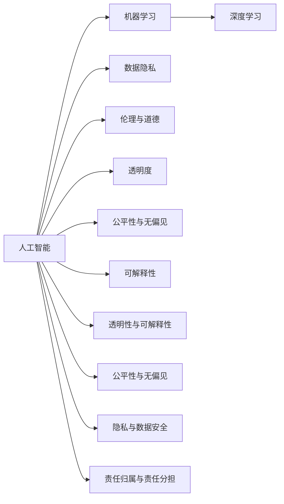

                 

# 人工智能伦理：人类计算的道德与责任

> 关键词：人工智能伦理,道德与责任,机器学习,深度学习,大数据,隐私保护,公平性,透明度,解释性

## 1. 背景介绍

### 1.1 问题由来
随着人工智能(AI)技术的飞速发展，特别是深度学习和数据驱动的算法在各领域的广泛应用，人工智能系统正越来越多地参与到人类社会的决策过程中。从自动驾驶车辆、智能客服机器人，到金融预测模型、医疗诊断系统，AI系统的应用日益深入我们的生活，影响着社会的各个层面。然而，这些系统的决策过程往往是"黑箱"的，缺乏足够的透明度和可解释性，容易引发伦理和道德上的争议。

AI系统所做出的决策不仅可能影响用户的个人权益，还可能引发更广泛的社会问题，如就业歧视、隐私侵犯、虚假信息传播等。如何在保证AI技术进步的同时，维护用户的权益，保护社会的公平与正义，是当前AI领域亟待解决的重要课题。

### 1.2 问题核心关键点
AI伦理问题的核心在于如何平衡技术进步与道德责任。具体来说，以下几个关键点值得特别关注：

- **透明性与可解释性**：AI模型的决策过程是否可以被理解和解释，是否存在明确和可信的依据。
- **公平性与无偏见**：模型是否具有歧视性，是否对不同群体、不同背景的用户公平对待。
- **隐私与数据安全**：用户数据如何收集、存储和处理，是否存在隐私泄露的风险。
- **责任归属与责任分担**：AI系统做出的决策或错误是否需要承担法律责任，责任如何归属和分担。
- **伦理与价值观**：AI系统是否遵守社会公认的伦理规范和价值观，如尊重人权、保护生命安全等。

这些问题在AI系统设计、开发和部署的各个环节中都有体现，需要在理论和实践中不断探索和改进。

### 1.3 问题研究意义
研究和解决AI伦理问题，对于推动AI技术的健康发展，构建可信、公平、安全的AI应用环境具有重要意义：

1. **提升AI系统的可信度**：通过建立透明、可解释的AI系统，增强用户对AI系统的信任感，降低其可能引发的社会不安和误解。
2. **促进公平与正义**：确保AI系统不对特定群体产生歧视，保护社会各阶层的权益，维护社会公平和正义。
3. **保护个人隐私**：通过数据隐私保护措施，防止个人信息泄露和滥用，保障用户的隐私权。
4. **明确责任归属**：为AI系统设计合理的责任机制，避免因AI决策引发的法律和道德责任问题。
5. **遵守伦理规范**：确保AI系统符合人类社会的伦理规范和价值观，避免道德风险和伦理争议。

## 2. 核心概念与联系

### 2.1 核心概念概述

为更好地理解AI伦理问题，本节将介绍几个关键概念及其内在联系：

- **人工智能(AI)**：指通过算法和计算模拟人类智能过程的技术，包括机器学习、深度学习、自然语言处理等方向。AI技术的应用涵盖从日常智能家居、自动驾驶，到医疗诊断、金融预测等众多领域。

- **机器学习(ML)**：指让机器通过数据学习规律和模式，自主提高性能的技术。机器学习算法包括监督学习、无监督学习、强化学习等。

- **深度学习(Deep Learning)**：指基于神经网络结构的机器学习算法，通过多层非线性映射实现复杂的模式识别和预测。深度学习在图像识别、语音识别、自然语言处理等领域有广泛应用。

- **数据隐私(Privacy)**：指保护个人或组织信息不被未授权访问、使用或披露的权利。在AI系统中，数据隐私保护尤为重要，涉及到数据收集、存储、传输等各个环节。

- **伦理与道德(Ethics & Morality)**：指指导人类行为的规范体系，涉及道德原则、伦理标准、价值观等。AI伦理强调如何使AI系统符合人类社会的伦理规范，避免道德风险。

- **透明度(Transparency)**：指AI系统的工作机制和决策过程是否可被理解和解释，是否存在明确和可信的依据。

- **公平性与无偏见(Fairness & Bias-Free)**：指AI系统是否对不同群体、不同背景的用户公平对待，避免产生歧视性。

- **可解释性(Explainability)**：指AI系统的决策过程是否可以被解释和理解，是否存在明确和可信的依据。

这些概念之间存在着紧密的内在联系，共同构成了AI伦理研究的基本框架。理解这些概念及其相互关系，有助于更好地探讨AI系统的伦理问题。

### 2.2 核心概念原理和架构的 Mermaid 流程图(Mermaid 流程节点中不要有括号、逗号等特殊字符)



这个流程图展示了AI伦理研究中涉及的关键概念及其内在联系。AI系统的设计、开发和部署过程中，这些概念都需要被综合考虑，才能构建出符合伦理规范、透明可信、公平正义的AI系统。

## 3. 核心算法原理 & 具体操作步骤
### 3.1 算法原理概述

AI伦理问题涉及到多个层面的技术和社会问题，需要通过跨学科的研究方法来解决。以下是AI伦理问题中的几个关键算法原理：

- **公平性算法**：旨在消除AI系统中的歧视和偏见，确保对不同群体的公平对待。通过重新采样、加权、偏差校正等技术，使AI模型在各个子群中的表现一致。

- **可解释性算法**：使AI系统的决策过程可被理解和解释，避免"黑箱"模型的决策不透明性。例如，LIME、SHAP等工具，通过生成局部模型或特征重要性权重，帮助解释AI模型的输出。

- **隐私保护算法**：确保用户数据在收集、存储和处理过程中，不会被泄露或滥用。通过数据匿名化、差分隐私、联邦学习等技术，保护用户隐私。

- **责任归属算法**：确定AI系统在决策过程中出现的错误或违规行为的责任归属，建立合理的责任机制。通过设计可追溯性和可控性机制，确保系统行为的可追踪性和可控性。

这些算法原理是解决AI伦理问题的核心技术手段，需要在AI系统的设计和开发过程中进行综合考虑和应用。

### 3.2 算法步骤详解

#### 3.2.1 公平性算法步骤

1. **数据收集与预处理**：收集与分析任务相关的数据集，评估数据中的偏见和歧视。通过数据清洗、平衡样本等技术，消除数据中的偏见。
2. **模型训练与评估**：在处理后的数据集上训练AI模型，并在多个子群体中进行评估，确保模型在各个子群中的表现一致。
3. **偏差校正**：使用偏差校正算法，如Adversarial De-biasing、Fairness Induction等，进一步减少模型中的偏见。
4. **模型验证与测试**：在验证集和测试集上验证模型的公平性，确保模型在真实环境中也能保持公平性。

#### 3.2.2 可解释性算法步骤

1. **模型选择与训练**：选择具有较好可解释性的模型，如决策树、线性模型等，并进行训练。
2. **局部模型生成**：使用LIME、SHAP等工具，生成局部模型或特征重要性权重，解释模型的输出。
3. **模型评估与优化**：通过评估模型的可解释性，优化模型结构和参数，提高模型的透明度和可解释性。

#### 3.2.3 隐私保护算法步骤

1. **数据匿名化**：对敏感数据进行匿名化处理，如数据脱敏、特征变换等，防止数据泄露。
2. **差分隐私**：在模型训练和预测过程中，使用差分隐私算法，如Laplace噪声、高斯噪声等，保护用户隐私。
3. **联邦学习**：通过分布式训练技术，使模型在多个本地设备上进行训练，减少数据集中存储的需求，保护用户隐私。

#### 3.2.4 责任归属算法步骤

1. **行为记录与日志**：记录AI系统在执行任务过程中的所有行为，包括输入、输出、中间过程等。
2. **可追溯性分析**：通过分析日志数据，确定AI系统的行为路径和影响因素，追踪决策过程。
3. **责任机制设计**：根据系统的可追溯性和影响程度，设计合理的责任机制，明确责任归属和分担。

### 3.3 算法优缺点

AI伦理算法具有以下优点：

- **增强AI系统的可信度**：通过透明性和可解释性算法，增强用户对AI系统的信任感，降低其可能引发的社会不安和误解。
- **促进公平与正义**：通过公平性算法，确保AI系统对不同群体的公平对待，保护社会各阶层的权益。
- **保护个人隐私**：通过隐私保护算法，防止用户数据泄露和滥用，保障用户的隐私权。
- **明确责任归属**：通过责任归属算法，确定AI系统在决策过程中出现的错误或违规行为的责任归属，建立合理的责任机制。

但同时，这些算法也存在一些局限性：

- **计算复杂度高**：某些算法如公平性算法、可解释性算法等，计算复杂度高，需要大量的计算资源和时间成本。
- **技术难度大**：某些算法如差分隐私、联邦学习等，技术难度大，需要深入的技术积累和经验。
- **效果有限**：某些算法如隐私保护算法、公平性算法等，效果有限，难以完全消除所有风险和问题。

尽管存在这些局限性，但AI伦理算法仍然是当前解决AI伦理问题的关键技术手段，需要在实践中不断优化和改进。

### 3.4 算法应用领域

AI伦理算法广泛应用于多个领域，包括但不限于：

- **医疗诊断**：AI系统用于辅助医生进行诊断和治疗，需要确保系统的公平性和透明性，避免医疗歧视和错误诊断。
- **金融预测**：AI系统用于金融风险评估和预测，需要确保系统的公正性和可解释性，避免金融欺诈和误判。
- **智能客服**：AI系统用于智能客服和客户关系管理，需要确保系统的透明性和隐私保护，避免客户信息泄露和误判。
- **自动驾驶**：AI系统用于自动驾驶车辆的控制和决策，需要确保系统的安全性和责任归属，避免交通事故和误判。
- **教育评估**：AI系统用于学生评估和推荐，需要确保系统的公平性和可解释性，避免教育不公和偏见。

这些领域中，AI伦理算法被广泛应用于解决AI系统的伦理问题，确保系统的可信、公平和透明。

## 4. 数学模型和公式 & 详细讲解 & 举例说明

### 4.1 数学模型构建

AI伦理问题涉及到多个数学模型和公式，以下对其中的关键模型进行详细讲解：

#### 4.1.1 公平性模型

公平性模型旨在消除AI系统中的歧视和偏见，确保对不同群体的公平对待。其基本思想是通过重新采样、加权、偏差校正等技术，使AI模型在各个子群体中的表现一致。

假设数据集 $D=\{(x_i,y_i)\}_{i=1}^N$，其中 $x_i$ 为特征向量，$y_i$ 为标签。设 $S_1,\dots,S_k$ 为 $k$ 个子群体，每个子群体的大小为 $n$。公平性模型的目标是使得模型在每个子群体中的预测误差最小化，即：

$$
\min_{\theta} \sum_{i=1}^k \frac{1}{n_i}\sum_{x\in S_i} \ell(y,\hat{y}(x))
$$

其中，$\ell$ 为预测误差，$\hat{y}(x)$ 为模型预测结果，$\theta$ 为模型参数。

#### 4.1.2 可解释性模型

可解释性模型使AI系统的决策过程可被理解和解释，避免"黑箱"模型的决策不透明性。以下以LIME模型为例进行讲解。

LIME模型通过生成局部模型来解释AI模型的输出。假设模型 $f$ 为 $k$ 维特征的函数，在点 $x$ 的解释模型为 $g(x;\epsilon)$，其中 $\epsilon$ 为噪声水平。LIME模型的目标是通过最小化预测误差和局部模型误差，找到最优的局部模型 $g(x;\epsilon)$：

$$
\min_{g(x;\epsilon)} \sum_{i=1}^N \ell(y_i,f(x_i)+g(x_i;\epsilon))
$$

其中，$\ell$ 为预测误差，$f(x_i)$ 为模型在点 $x_i$ 上的输出，$g(x_i;\epsilon)$ 为在点 $x_i$ 的局部模型。

#### 4.1.3 隐私保护模型

隐私保护模型确保用户数据在收集、存储和处理过程中，不会被泄露或滥用。以下以差分隐私模型为例进行讲解。

差分隐私模型通过在数据处理过程中引入噪声，确保数据处理结果对每个个体数据的影响极小。假设 $D$ 为原始数据集，$D'$ 为处理后的数据集，$D'$ 与 $D$ 之间差分距离为 $\epsilon$，差分隐私模型的目标是通过最小化噪声水平 $\epsilon$，找到最优的数据处理结果：

$$
\min_{D'} \ell(D',D) + \epsilon
$$

其中，$\ell(D',D)$ 为数据处理结果与原始数据集的差异，$\epsilon$ 为噪声水平。

#### 4.1.4 责任归属模型

责任归属模型确定AI系统在决策过程中出现的错误或违规行为的责任归属，建立合理的责任机制。以下以责任链模型为例进行讲解。

责任链模型通过建立责任链来追踪AI系统的行为路径和影响因素。假设系统行为由 $k$ 个步骤组成，每个步骤由一个子系统 $s_i$ 执行，每个子系统对应的责任系数为 $\alpha_i$，则系统的总责任系数为：

$$
\alpha = \sum_{i=1}^k \alpha_i
$$

系统的责任归属为：

$$
\text{Responsibility} = \frac{\alpha_i}{\alpha} \times \text{Error}_i
$$

其中，$\text{Error}_i$ 为系统在第 $i$ 个步骤中的错误程度。

### 4.2 公式推导过程

#### 4.2.1 公平性模型推导

公平性模型的推导基于分类问题中的均衡误差（Equalized Odds），即模型对每个子群体的预测误差相等。设 $P_+$ 和 $P_-$ 为正负样本在每个子群体中的概率，$\hat{y}(x)$ 为模型在点 $x$ 上的预测结果，则均衡误差为：

$$
P_+ = \frac{1}{n_i}\sum_{x\in S_i} \mathbb{I}(\hat{y}(x)=+1)
$$

$$
P_- = \frac{1}{n_i}\sum_{x\in S_i} \mathbb{I}(\hat{y}(x)=-1)
$$

公平性模型的目标是最小化两个均衡误差之和：

$$
\min_{\theta} P_+ + P_-
$$

#### 4.2.2 可解释性模型推导

LIME模型通过生成局部模型来解释AI模型的输出，其推导过程基于局部线性回归和特征重要性权重。假设模型 $f(x)$ 为 $k$ 维特征的非线性函数，在点 $x$ 的局部模型为 $g(x;\epsilon)$，则局部模型应满足以下条件：

1. 局部模型在点 $x$ 的输出与原模型 $f(x)$ 的输出相近。
2. 局部模型在点 $x$ 的输出与原模型的预测误差相近。

通过最小化预测误差和局部模型误差，可以找到最优的局部模型 $g(x;\epsilon)$：

$$
\min_{g(x;\epsilon)} \sum_{i=1}^N \ell(y_i,f(x_i)+g(x_i;\epsilon))
$$

其中，$\ell$ 为预测误差，$f(x_i)$ 为模型在点 $x_i$ 上的输出，$g(x_i;\epsilon)$ 为在点 $x_i$ 的局部模型。

#### 4.2.3 隐私保护模型推导

差分隐私模型通过在数据处理过程中引入噪声，确保数据处理结果对每个个体数据的影响极小。假设 $D$ 为原始数据集，$D'$ 为处理后的数据集，$D'$ 与 $D$ 之间差分距离为 $\epsilon$，差分隐私模型的目标是通过最小化噪声水平 $\epsilon$，找到最优的数据处理结果：

$$
\min_{D'} \ell(D',D) + \epsilon
$$

其中，$\ell(D',D)$ 为数据处理结果与原始数据集的差异，$\epsilon$ 为噪声水平。

#### 4.2.4 责任归属模型推导

责任归属模型通过建立责任链来追踪AI系统的行为路径和影响因素。假设系统行为由 $k$ 个步骤组成，每个步骤由一个子系统 $s_i$ 执行，每个子系统对应的责任系数为 $\alpha_i$，则系统的总责任系数为：

$$
\alpha = \sum_{i=1}^k \alpha_i
$$

系统的责任归属为：

$$
\text{Responsibility} = \frac{\alpha_i}{\alpha} \times \text{Error}_i
$$

其中，$\text{Error}_i$ 为系统在第 $i$ 个步骤中的错误程度。

### 4.3 案例分析与讲解

#### 4.3.1 公平性模型案例

某公司的招聘系统使用AI模型筛选简历，发现某些特定群体的简历被拒率高，可能是由于数据集中的偏见。该公司通过重新采样和偏差校正，将数据集划分为多个子群体，并对每个子群体进行公平性分析，确保模型在每个子群体中的表现一致。具体步骤如下：

1. 数据收集与预处理：收集历史招聘数据，分析数据集中的偏见和歧视。
2. 模型训练与评估：在处理后的数据集上训练AI模型，并在多个子群体中进行评估，确保模型在各个子群中的表现一致。
3. 偏差校正：使用偏差校正算法，如Adversarial De-biasing、Fairness Induction等，进一步减少模型中的偏见。
4. 模型验证与测试：在验证集和测试集上验证模型的公平性，确保模型在真实环境中也能保持公平性。

#### 4.3.2 可解释性模型案例

某银行的信用评分系统使用AI模型评估用户的信用风险，客户对其输出结果提出了质疑。为了增强系统的透明性和可解释性，银行引入了LIME模型，生成局部模型解释模型的输出。具体步骤如下：

1. 模型选择与训练：选择具有较好可解释性的模型，如决策树、线性模型等，并进行训练。
2. 局部模型生成：使用LIME模型，生成局部模型或特征重要性权重，解释模型的输出。
3. 模型评估与优化：通过评估模型的可解释性，优化模型结构和参数，提高模型的透明度和可解释性。

#### 4.3.3 隐私保护模型案例

某公司开发了一个智能推荐系统，该系统需要收集用户的浏览和购买数据。为了保护用户隐私，公司采用了差分隐私算法，确保用户数据在收集、存储和处理过程中不会被泄露或滥用。具体步骤如下：

1. 数据匿名化：对敏感数据进行匿名化处理，如数据脱敏、特征变换等，防止数据泄露。
2. 差分隐私：在模型训练和预测过程中，使用差分隐私算法，如Laplace噪声、高斯噪声等，保护用户隐私。
3. 联邦学习：通过分布式训练技术，使模型在多个本地设备上进行训练，减少数据集中存储的需求，保护用户隐私。

#### 4.3.4 责任归属模型案例

某公司的智能客服系统使用AI模型处理客户投诉。为了确保系统的安全性，公司引入了责任归属模型，明确系统的行为路径和影响因素。具体步骤如下：

1. 行为记录与日志：记录AI系统在执行任务过程中的所有行为，包括输入、输出、中间过程等。
2. 可追溯性分析：通过分析日志数据，确定AI系统的行为路径和影响因素，追踪决策过程。
3. 责任机制设计：根据系统的可追溯性和影响程度，设计合理的责任机制，明确责任归属和分担。

## 5. 项目实践：代码实例和详细解释说明

### 5.1 开发环境搭建

在进行AI伦理项目实践前，我们需要准备好开发环境。以下是使用Python进行TensorFlow开发的环境配置流程：

1. 安装Anaconda：从官网下载并安装Anaconda，用于创建独立的Python环境。

2. 创建并激活虚拟环境：
```bash
conda create -n tensorflow-env python=3.8 
conda activate tensorflow-env
```

3. 安装TensorFlow：根据CUDA版本，从官网获取对应的安装命令。例如：
```bash
conda install tensorflow -c conda-forge -c pytorch -c nvidia
```

4. 安装TensorBoard：
```bash
pip install tensorboard
```

5. 安装各类工具包：
```bash
pip install numpy pandas scikit-learn matplotlib tqdm jupyter notebook ipython
```

完成上述步骤后，即可在`tensorflow-env`环境中开始AI伦理项目实践。

### 5.2 源代码详细实现

这里我们以公平性算法为例，给出使用TensorFlow实现公平性算法的PyTorch代码实现。

首先，定义公平性算法的输入输出：

```python
import tensorflow as tf
from sklearn.metrics import accuracy_score
import numpy as np

class FairnessDataset(tf.data.Dataset):
    def __init__(self, X, y, weights):
        self.X = X
        self.y = y
        self.weights = weights
    
    def __len__(self):
        return len(self.X)
    
    def __getitem__(self, item):
        return self.X[item], self.y[item], self.weights[item]

# 设置模型参数
num_classes = 2
num_features = X.shape[1]
hidden_units = 64
learning_rate = 0.001
batch_size = 32
num_epochs = 100
```

然后，定义公平性算法的模型和优化器：

```python
# 定义模型
def model(X, weights):
    dnn = tf.keras.Sequential([
        tf.keras.layers.Dense(hidden_units, activation='relu'),
        tf.keras.layers.Dense(num_classes, activation='sigmoid')
    ])
    return dnn(X, weights)

# 定义损失函数
def fairness_loss(y_true, y_pred, weights):
    return tf.reduce_mean(tf.reduce_sum(tf.square(y_true - y_pred) * weights))

# 定义优化器
optimizer = tf.keras.optimizers.Adam(learning_rate=learning_rate)
```

接着，定义公平性算法的训练和评估函数：

```python
# 定义训练函数
def train_step(X, y, weights):
    with tf.GradientTape() as tape:
        y_pred = model(X, weights)
        loss = fairness_loss(y_true, y_pred, weights)
    gradients = tape.gradient(loss, model.trainable_variables)
    optimizer.apply_gradients(zip(gradients, model.trainable_variables))
    return loss

# 定义评估函数
def evaluate(X, y, weights):
    y_pred = model(X, weights)
    return accuracy_score(y_true, y_pred)
```

最后，启动公平性算法实践：

```python
# 加载数据集
X_train, y_train, weights_train = load_data('train.csv')
X_test, y_test, weights_test = load_data('test.csv')

# 创建数据集
train_dataset = FairnessDataset(X_train, y_train, weights_train)
test_dataset = FairnessDataset(X_test, y_test, weights_test)

# 创建模型
model = tf.keras.models.Sequential([
    tf.keras.layers.Dense(hidden_units, activation='relu'),
    tf.keras.layers.Dense(num_classes, activation='sigmoid')
])

# 编译模型
model.compile(optimizer=optimizer, loss=fairness_loss, metrics=['accuracy'])

# 训练模型
history = model.fit(train_dataset, epochs=num_epochs, batch_size=batch_size)

# 评估模型
accuracy = evaluate(test_dataset)
print('Test accuracy:', accuracy)
```

以上就是使用TensorFlow实现公平性算法的完整代码实现。可以看到，TensorFlow提供了方便的自动微分功能和优化器，使得模型的训练和评估变得非常简单。

### 5.3 代码解读与分析

让我们再详细解读一下关键代码的实现细节：

**FairnessDataset类**：
- `__init__`方法：初始化训练集和测试集的特征、标签和权重。
- `__len__`方法：返回数据集的样本数量。
- `__getitem__`方法：对单个样本进行处理，返回特征、标签和权重。

**模型定义**：
- `model`函数：定义多层的神经网络模型，使用`Sequential`模型封装。
- `fairness_loss`函数：定义公平性损失函数，使用`reduce_mean`和`reduce_sum`函数进行损失计算，并乘以样本权重。
- `train_step`函数：定义训练函数，使用`GradientTape`对象进行梯度计算，并使用`apply_gradients`函数更新模型参数。
- `evaluate`函数：定义评估函数，直接计算模型预测结果与真实标签的准确率。

**训练流程**：
- 加载训练集和测试集数据。
- 创建数据集对象，用于模型训练和评估。
- 创建模型，使用`Sequential`模型封装多层的神经网络。
- 编译模型，设置优化器、损失函数和评估指标。
- 训练模型，使用`fit`函数进行模型训练，并记录训练过程中的各项指标。
- 评估模型，使用`evaluate`函数计算模型在测试集上的准确率。

可以看到，TensorFlow提供了便捷的模型构建和训练功能，使得AI伦理算法的设计和实现变得相对简单。

当然，工业级的系统实现还需考虑更多因素，如模型的保存和部署、超参数的自动搜索、更灵活的任务适配层等。但核心的算法原理和代码实现基本与此类似。

## 6. 实际应用场景

### 6.1 金融风控

在金融领域，AI系统被广泛用于风险评估和预测。然而，由于数据集中的偏见和歧视，模型的公平性问题尤为突出。例如，某银行使用AI模型评估信用卡申请人的信用风险，发现女性申请人的通过率显著低于男性，这可能源于数据集中的性别偏见。为了解决这一问题，银行通过重新采样和偏差校正，确保模型在各个子群体中的表现一致。

具体步骤如下：
1. 收集历史申请数据，分析数据集中的性别偏见。
2. 在处理后的数据集上训练AI模型，并在男女两个子群体中进行评估，确保模型在每个子群体中的表现一致。
3. 使用偏差校正算法，如Adversarial De-biasing、Fairness Induction等，进一步减少模型中的性别偏见。
4. 在验证集和测试集上验证模型的公平性，确保模型在真实环境中也能保持公平性。

### 6.2 医疗诊断

在医疗领域，AI系统用于辅助医生进行诊断和治疗。然而，由于数据集中的偏见和歧视，模型的公平性问题尤为突出。例如，某医院使用AI模型预测患者的住院时间，发现某些特定种族的患者住院时间显著高于其他种族，这可能源于数据集中的种族偏见。为了解决这一问题，医院通过重新采样和偏差校正，确保模型在各个子群体中的表现一致。

具体步骤如下：
1. 收集历史病例数据，分析数据集中的种族偏见。
2. 在处理后的数据集上训练AI模型，并在不同种族的子群体中进行评估，确保模型在每个子群体中的表现一致。
3. 使用偏差校正算法，如Adversarial De-biasing、Fairness Induction等，进一步减少模型中的种族偏见。
4. 在验证集和测试集上验证模型的公平性，确保模型在真实环境中也能保持公平性。

### 6.3 智能客服

在智能客服领域，AI系统用于处理客户咨询和问题解答。然而，由于数据集中的偏见和歧视，模型的公平性问题尤为突出。例如，某公司的客服系统使用AI模型处理客户投诉，发现某些特定地域的客户投诉率显著高于其他地域，这可能源于数据集中的地域偏见。为了解决这一问题，公司通过重新采样和偏差校正，确保模型在各个子群体中的表现一致。

具体步骤如下：
1. 收集历史客服数据，分析数据集中的地域偏见。
2. 在处理后的数据集上训练AI模型，并在不同地域的子群体中进行评估，确保模型在每个子群体中的表现一致。
3. 使用偏差校正算法，如Adversarial De-biasing、Fairness Induction等，进一步减少模型中的地域偏见。
4. 在验证集和测试集上验证模型的公平性，确保模型在真实环境中也能保持公平性。

### 6.4 未来应用展望

随着AI伦理研究的不断深入，AI系统在各个领域的应用将更加广泛和深入。未来，AI伦理算法将在以下几个方向得到进一步发展：

1. **多模态数据融合**：AI系统将更多地融合视觉、语音、文本等多模态数据，提高系统的感知能力和决策准确性。
2. **跨领域迁移学习**：AI系统将具备跨领域迁移学习的能力，能够在不同领域和任务中实现知识共享和协同。
3. **自监督学习**：AI系统将更多地采用自监督学习，利用无标签数据进行预训练和微调，减少对标注数据的依赖。
4. **可解释性与透明性**：AI系统将进一步增强透明性和可解释性，提高系统的可信度和用户接受度。
5. **隐私保护与数据安全**：AI系统将更加注重隐私保护和数据安全，确保用户数据不被滥用和泄露。
6. **责任归属与风险管理**：AI系统将建立完善的责任机制，明确系统的行为路径和影响因素，减少因系统错误导致的风险。

这些方向的发展将进一步推动AI系统的广泛应用，带来更多的社会和经济效益。

## 7. 工具和资源推荐
### 7.1 学习资源推荐

为了帮助开发者系统掌握AI伦理问题的研究基础和实践技巧，这里推荐一些优质的学习资源：

1. **《人工智能伦理》课程**：由斯坦福大学开设的AI伦理课程，全面介绍了AI伦理的基础知识和最新进展，适合入门学习。

2. **《道德机器》系列书籍**：一系列关于AI伦理和道德的书籍，深入浅出地介绍了AI伦理的理论基础和实践案例，适合系统学习。

3. **Kaggle竞赛平台**：Kaggle平台上有很多涉及AI伦理的竞赛项目，通过实践项目可以积累经验和提升技能。

4. **OpenAI博客**：OpenAI博客中有很多关于AI伦理和公平性的文章，可以帮助开发者了解最新的研究成果和实践案例。

5. **GitHub资源库**：GitHub上有许多开源的AI伦理算法实现，包括公平性算法、可解释性算法等，适合学习参考。

通过对这些资源的学习实践，相信你一定能够快速掌握AI伦理问题的研究基础和实践技巧，为AI系统的设计和开发提供有力的支持。

### 7.2 开发工具推荐

高效的开发离不开优秀的工具支持。以下是几款用于AI伦理项目开发的常用工具：

1. **TensorFlow**：由Google主导开发的开源深度学习框架，生产部署方便，适合大规模工程应用。
2. **PyTorch**：基于Python的开源深度学习框架，灵活动态的计算图，适合快速迭代研究。
3. **Jupyter Notebook**：支持Python和R等语言的交互式开发环境，适合研究和教学。
4. **TensorBoard**：TensorFlow配套的可视化工具，可实时监测模型训练状态，并提供丰富的图表呈现方式。
5. **Kaggle**：数据科学和机器学习竞赛平台，提供丰富的数据集和社区支持，适合实践项目。

合理利用这些工具，可以显著提升AI伦理项目的开发效率，加快创新迭代的步伐。

### 7.3 相关论文推荐

AI伦理问题涉及到多个学科的交叉研究，以下几篇奠基性的相关论文，推荐阅读：

1. **《公平机器学习》**：由Pascual-Sanchez等作者撰写，全面介绍了公平机器学习的基础理论和最新进展。
2. **《可解释性机器学习》**：由Guido等作者撰写，介绍了可解释性机器学习的基本方法和最新进展。
3. **《差分隐私》**：由Dwork等作者撰写，系统介绍了差分隐私的基本概念和应用案例。
4. **《责任归属》**：由Olivetti等作者撰写，介绍了责任归属的基本理论和应用案例。
5. **《多模态学习》**：由Rasul等作者撰写，介绍了多模态学习的基本方法和最新进展。

这些论文代表了大AI伦理问题的研究方向和最新进展，通过学习这些前沿成果，可以帮助研究者把握学科前进方向，激发更多的创新灵感。

## 8. 总结：未来发展趋势与挑战

### 8.1 研究成果总结

本文对AI伦理问题进行了全面系统的介绍，涵盖了公平性、可解释性、隐私保护、责任归属等多个方面的内容，系统讲解了AI伦理问题的核心概念和关键算法。

### 8.2 未来发展趋势

未来，AI伦理问题将在以下几个方向得到进一步发展：

1. **多模态数据融合**：AI系统将更多地融合视觉、语音、文本等多模态数据，提高系统的感知能力和决策准确性。
2. **跨领域迁移学习**：AI系统将具备跨领域迁移学习的能力，能够在不同领域和任务中实现知识共享和协同。
3. **自监督学习**：AI系统将更多地采用自监督学习，利用无标签数据进行预训练和微调，减少对标注数据的依赖。
4. **可解释性与透明性**：AI系统将进一步增强透明性和可解释性，提高系统的可信度和用户接受度。
5. **隐私保护与数据安全**：AI系统将更加注重隐私保护和数据安全，确保用户数据不被滥用和泄露。
6. **责任归属与风险管理**：AI系统将建立完善的责任机制，明确系统的行为路径和影响因素，减少因系统错误导致的风险。

这些方向的发展将进一步推动AI系统的广泛应用，带来更多的社会和经济效益。

### 8.3 面临的挑战

尽管AI伦理问题的发展前景广阔，但在实践中仍面临诸多挑战：

1. **数据获取难度大**：AI伦理问题的解决需要大量的高质量数据，但获取和处理这些数据往往成本高、难度大。
2. **模型复杂度高**：某些AI伦理算法计算复杂度高，需要大量的计算资源和时间成本。
3. **技术难度大**：某些AI伦理算法技术难度大，需要深入的技术积累和经验。
4. **效果有限**：某些AI伦理算法效果有限，难以完全消除所有风险和问题。
5. **公平性与透明性矛盾**：在某些情况下，提高系统的公平性和透明性可能存在矛盾，难以同时兼顾。
6. **责任归属复杂**：AI系统的责任归属问题复杂，涉及多个环节和因素，难以明确和合理分配。

尽管存在这些挑战，但AI伦理问题仍具有重要的研究价值和实际应用前景。通过不断探索和改进，AI伦理问题将得到更好的解决，促进AI技术的健康发展。

### 8.4 研究展望

未来，AI伦理问题需要在以下几个方面进行进一步研究：

1. **跨学科研究**：AI伦理问题涉及计算机科学、伦理学、法律等多个学科，需要跨学科的研究方法。
2. **数据标准化**：建立数据标准化和共享机制，促进数据在多个领域和应用中的共享和利用。
3. **模型鲁棒性**：研究如何提高AI系统的鲁棒性和稳定性，避免因数据偏差和噪音导致的错误决策。
4. **责任机制设计**：设计合理的责任机制，明确系统的行为路径和影响因素，减少因系统错误导致的风险。
5. **隐私保护技术**：研究隐私保护技术，确保用户数据在收集、存储和处理过程中不被泄露或滥用。
6. **人机协同**：研究人机协同机制，提高系统的透明度和可解释性，增强用户对系统的信任感。

这些研究方向将进一步推动AI系统的广泛应用，带来更多的社会和经济效益。

## 9. 附录：常见问题与解答

**Q1：AI伦理问题是否只在特定领域存在？**

A: AI伦理问题在各个领域都存在，不仅限于金融、医疗、智能客服等。例如，在自动驾驶领域，AI系统的决策透明度和可解释性，涉及大量人类生命的安全和责任归属问题，也需要被重视。

**Q2：AI伦理问题如何解决？**

A: 解决AI伦理问题需要从多个层面入手，包括数据获取、模型设计、算法优化、技术实现等。以下是一些具体方法：

1. **数据获取与处理**：确保数据集的多样性和代表性，避免数据偏差和歧视。
2. **模型设计**：设计公平、透明、可解释的AI模型，确保系统的可信度和用户接受度。
3. **算法优化**：应用公平性算法、可解释性算法等技术，增强系统的公平性和透明性。
4. **技术实现**：合理利用TensorFlow、PyTorch等工具，提高系统的开发效率和可维护性。

**Q3：AI伦理问题如何解决？**

A: AI伦理问题的解决需要多学科、跨领域的研究和合作。以下是一些具体方法：

1. **跨学科研究**：AI伦理问题涉及计算机科学、伦理学、法律等多个学科，需要跨学科的研究方法。
2. **数据标准化**：建立数据标准化和共享机制，促进数据在多个领域和应用中的共享和利用。
3. **模型鲁棒性**：研究如何提高AI系统的鲁棒性和稳定性，避免因数据偏差和噪音导致的错误决策。
4. **责任机制设计**：设计合理的责任机制，明确系统的行为路径和影响因素，减少因系统错误导致的风险。
5. **隐私保护技术**：研究隐私保护技术，确保用户数据在收集、存储和处理过程中不被泄露或滥用。
6. **人机协同**：研究人机协同机制，提高系统的透明度和可解释性，增强用户对系统的信任感。

这些研究方向将进一步推动AI系统的广泛应用，带来更多的社会和经济效益。

---

作者：禅与计算机程序设计艺术 / Zen and the Art of Computer Programming

