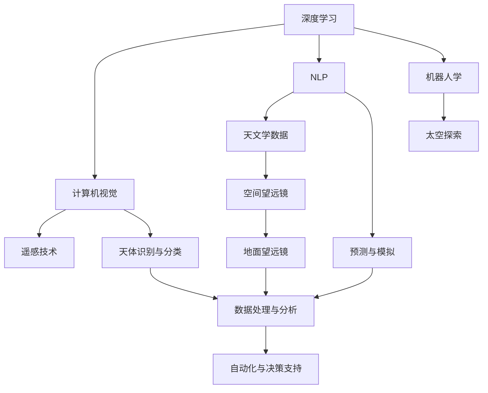

                 

# 人工智能在太空探索和天文学中的应用

## 1. 背景介绍

### 1.1 问题由来

人工智能（AI）在太空探索和天文学中的应用日益成为热点。随着计算能力的提升和数据量的爆炸式增长，科学家们开始探索如何利用AI技术来提升太空探索和天文学研究的能力。通过深度学习和机器学习，AI技术能够分析海量天文数据，识别行星、星系等天体，甚至可以预测宇宙事件，帮助人类更好地了解宇宙的奥秘。

### 1.2 问题核心关键点

AI在太空探索和天文学中应用的核心关键点包括：

- 数据处理与分析：AI可以处理和分析大量的天文数据，从空间望远镜收集的数据中提取有用的信息。
- 天体识别与分类：AI可以自动识别和分类天体，如行星、恒星、星系等。
- 预测与模拟：AI可以进行天体运动和宇宙事件的预测，提高预测的准确性。
- 自动化与决策支持：AI可以自动化地进行数据处理和决策支持，减轻人工负担。
- 机器人探索：AI可以控制机器人进行太空探索任务，提高探索效率和安全性。

## 2. 核心概念与联系

### 2.1 核心概念概述

为了更好地理解AI在太空探索和天文学中的应用，本节将介绍几个密切相关的核心概念：

- 深度学习（Deep Learning）：一种基于神经网络的机器学习技术，可以处理非线性数据，适用于复杂的分类和回归问题。
- 计算机视觉（Computer Vision）：研究如何使计算机理解和解释视觉数据，如图像和视频。
- 自然语言处理（Natural Language Processing, NLP）：研究如何让计算机理解和处理人类语言。
- 机器人学（Robotics）：研究如何使用机械装置模拟人类行为。
- 遥感技术（Remote Sensing）：使用传感器从远处获取信息，如卫星和空间望远镜。
- 天文学数据：包括来自空间望远镜、地面望远镜等收集的数据，如光谱、图像、光变曲线等。

这些核心概念之间存在着紧密的联系，共同构成了AI在太空探索和天文学中应用的基础。通过这些技术的结合，科学家们可以更高效地处理和分析天文数据，揭示宇宙的秘密。

### 2.2 核心概念原理和架构的 Mermaid 流程图



这个流程图展示了各个核心概念之间的联系。深度学习提供了处理复杂数据的能力，计算机视觉可以解释视觉数据，NLP可以理解自然语言，遥感技术可以获取天文数据，天文学数据可以来自不同的望远镜。这些数据经过深度学习处理后，可以进行天体识别与分类，预测与模拟，最终用于自动化与决策支持。机器人学结合太空探索，实现实际应用。

## 3. 核心算法原理 & 具体操作步骤

### 3.1 算法原理概述

AI在太空探索和天文学中的核心算法原理主要涉及深度学习和计算机视觉技术。具体而言，深度学习用于处理和分析大量天文数据，从中提取有用的信息；计算机视觉用于识别和分类天体，提高预测和模拟的准确性。以下是两种常见的AI应用场景及其算法原理：

- **天体识别与分类**：使用卷积神经网络（Convolutional Neural Network, CNN）对天文图像进行处理，识别和分类天体。
- **预测与模拟**：使用循环神经网络（Recurrent Neural Network, RNN）或变分自编码器（Variational Autoencoder, VAE）对天文现象进行预测和模拟。

### 3.2 算法步骤详解

#### 3.2.1 天体识别与分类

1. **数据收集**：从空间望远镜和地面望远镜收集天文图像，并将其存储在计算机中。
2. **数据预处理**：对图像进行去噪、归一化等预处理，以便于后续的深度学习处理。
3. **模型训练**：使用标注好的天文图像数据集，训练CNN模型。训练过程中，模型将学习到如何识别和分类天体。
4. **模型评估**：在测试集上评估模型的性能，如准确率、召回率、F1值等。
5. **模型部署**：将训练好的模型部署到实际应用中，用于天体识别和分类。

#### 3.2.2 预测与模拟

1. **数据收集**：收集历史的天文数据，如恒星的运动轨迹、行星的轨道等。
2. **数据预处理**：对数据进行清洗、归一化等预处理，以便于后续的深度学习处理。
3. **模型训练**：使用RNN或VAE模型，训练预测模型。训练过程中，模型将学习如何根据历史数据预测未来天体的运动轨迹。
4. **模型评估**：在测试集上评估模型的性能，如预测误差、拟合优度等。
5. **模型部署**：将训练好的模型部署到实际应用中，用于预测和模拟天文现象。

### 3.3 算法优缺点

AI在太空探索和天文学中应用的算法优点包括：

- **处理大数据**：深度学习可以处理和分析海量天文数据，提取有用的信息。
- **高精度**：通过优化算法和模型结构，AI可以提供高精度的天体识别和分类。
- **实时预测**：AI可以实时预测和模拟天文现象，提高预测的准确性。
- **自动化处理**：AI可以自动化地进行数据处理和决策支持，减轻人工负担。

然而，这些算法也存在一些缺点：

- **需要大量标注数据**：深度学习模型需要大量的标注数据进行训练，收集这些数据成本较高。
- **模型复杂度高**：深度学习模型结构复杂，训练和推理所需计算资源较多。
- **模型解释性差**：深度学习模型通常被视为“黑盒”，难以解释其内部工作机制。
- **依赖硬件资源**：AI应用需要高性能计算设备和大量的存储空间。

### 3.4 算法应用领域

AI在太空探索和天文学中的应用领域广泛，包括以下几个方面：

- **天体识别与分类**：用于识别和分类行星、恒星、星系等天体。
- **预测与模拟**：用于预测和模拟天体运动、宇宙事件等。
- **机器人控制**：用于控制空间探测器、月球车等机器人进行太空探索任务。
- **自动化数据处理**：用于自动化地处理和分析天文数据，如光谱、图像等。
- **决策支持**：用于辅助人类进行天文决策，如选择观测目标、规划探测任务等。

## 4. 数学模型和公式 & 详细讲解 & 举例说明

### 4.1 数学模型构建

在AI在太空探索和天文学中的应用中，数学模型主要涉及深度学习和计算机视觉技术。以下是一些常见的数学模型和公式：

- **卷积神经网络（CNN）**：用于天体识别与分类。
- **循环神经网络（RNN）**：用于预测与模拟。
- **变分自编码器（VAE）**：用于预测与模拟。

### 4.2 公式推导过程

#### 4.2.1 卷积神经网络（CNN）

CNN是一种广泛应用于图像处理的深度学习模型，其核心思想是通过卷积层和池化层提取图像特征，并通过全连接层进行分类。

假设输入图像的大小为 $H \times W \times C$，其中 $H$ 和 $W$ 分别为图像的高度和宽度，$C$ 为通道数。卷积层的核心公式为：

$$
y_{i,j,k} = \sum_{p=0}^{k-1}\sum_{q=0}^{k-1}\sum_{c=0}^{C-1}w_{p,q} \cdot x_{i+p,j+q,c}
$$

其中，$w_{p,q}$ 为卷积核，$x_{i,j,k}$ 为输入图像的像素值，$y_{i,j,k}$ 为卷积层的输出。

### 4.3 案例分析与讲解

#### 4.3.1 天体识别与分类

使用CNN对天文图像进行分类，具体步骤如下：

1. **数据预处理**：对天文图像进行去噪、归一化等预处理。
2. **模型训练**：使用标注好的天文图像数据集，训练CNN模型。
3. **模型评估**：在测试集上评估模型的性能，如准确率、召回率、F1值等。
4. **模型部署**：将训练好的模型部署到实际应用中，用于天体识别和分类。

## 5. 项目实践：代码实例和详细解释说明

### 5.1 开发环境搭建

在进行AI在太空探索和天文学中的应用项目实践时，需要搭建良好的开发环境。以下是一些建议：

1. **安装Python**：安装Python 3.x版本，建议使用Anaconda进行环境管理。
2. **安装深度学习框架**：安装TensorFlow、PyTorch等深度学习框架，用于模型训练和推理。
3. **安装计算机视觉库**：安装OpenCV等计算机视觉库，用于图像处理和分析。
4. **安装机器人控制库**：安装ROS（Robot Operating System）等机器人控制库，用于控制空间探测器、月球车等机器人。

### 5.2 源代码详细实现

以下是一个使用TensorFlow实现的卷积神经网络（CNN）用于天体识别与分类的代码示例：

```python
import tensorflow as tf
from tensorflow.keras.layers import Conv2D, MaxPooling2D, Flatten, Dense

# 定义CNN模型
model = tf.keras.Sequential([
    Conv2D(32, (3, 3), activation='relu', input_shape=(H, W, C)),
    MaxPooling2D((2, 2)),
    Conv2D(64, (3, 3), activation='relu'),
    MaxPooling2D((2, 2)),
    Flatten(),
    Dense(128, activation='relu'),
    Dense(num_classes, activation='softmax')
])

# 编译模型
model.compile(optimizer='adam', loss='categorical_crossentropy', metrics=['accuracy'])

# 训练模型
model.fit(x_train, y_train, epochs=num_epochs, batch_size=batch_size, validation_data=(x_test, y_test))

# 评估模型
model.evaluate(x_test, y_test)

# 部署模型
model.save('model.h5')
```

### 5.3 代码解读与分析

#### 5.3.1 数据预处理

在进行深度学习处理前，需要对天文图像进行预处理，如去噪、归一化等。以下是一个简单的图像预处理示例：

```python
import cv2
import numpy as np

# 加载图像
image = cv2.imread('image.jpg')

# 转换为灰度图像
gray = cv2.cvtColor(image, cv2.COLOR_BGR2GRAY)

# 去噪
denoised = cv2.fastNlMeansDenoising(gray, None, 10, 10, 7, 21)

# 归一化
normalized = denoised / 255.0

# 调整图像大小
resized = cv2.resize(normalized, (H, W))

# 转换为TensorFlow张量
tensor = tf.convert_to_tensor(resized, dtype=tf.float32)
```

#### 5.3.2 模型训练

在进行模型训练时，需要选择合适的优化器、损失函数和评价指标。以下是一个简单的模型训练示例：

```python
import tensorflow as tf
from tensorflow.keras.layers import Conv2D, MaxPooling2D, Flatten, Dense

# 定义CNN模型
model = tf.keras.Sequential([
    Conv2D(32, (3, 3), activation='relu', input_shape=(H, W, C)),
    MaxPooling2D((2, 2)),
    Conv2D(64, (3, 3), activation='relu'),
    MaxPooling2D((2, 2)),
    Flatten(),
    Dense(128, activation='relu'),
    Dense(num_classes, activation='softmax')
])

# 编译模型
model.compile(optimizer='adam', loss='categorical_crossentropy', metrics=['accuracy'])

# 训练模型
model.fit(x_train, y_train, epochs=num_epochs, batch_size=batch_size, validation_data=(x_test, y_test))

# 评估模型
model.evaluate(x_test, y_test)

# 部署模型
model.save('model.h5')
```

## 6. 实际应用场景

### 6.1 太空探索

AI在太空探索中的应用主要包括机器人控制和自动化数据处理。以下是一些具体的例子：

- **空间探测器控制**：使用机器人学和深度学习技术，控制空间探测器进行自动导航和目标识别。
- **图像分析**：使用计算机视觉技术，对空间探测器获取的图像进行分析和处理，提取有用的信息。
- **科学实验**：使用AI进行实验设计和数据分析，优化科学实验流程。

### 6.2 天文学研究

AI在天文学研究中的应用主要包括天体识别与分类、预测与模拟。以下是一些具体的例子：

- **行星探测**：使用AI进行行星探测，识别和分类行星，预测其运动轨迹。
- **恒星研究**：使用AI研究恒星的演化和物理特性，如恒星亮度、光谱等。
- **宇宙事件预测**：使用AI进行宇宙事件的预测，如超新星爆发、黑洞碰撞等。

### 6.3 未来应用展望

未来，AI在太空探索和天文学中的应用将更加广泛和深入。以下是一些可能的未来应用：

- **自动化数据处理**：AI将能够自动处理和分析更多的天文数据，提取更有用的信息。
- **自主探测**：AI控制的自主探测器将在更广阔的宇宙空间中进行探索，采集更多的数据。
- **多模态数据融合**：AI将能够融合来自不同观测器和探测器的数据，提高数据的质量和精度。
- **智能决策支持**：AI将能够辅助人类进行更智能的决策，优化太空探索和天文学研究的流程。

## 7. 工具和资源推荐

### 7.1 学习资源推荐

为了帮助开发者系统掌握AI在太空探索和天文学中的应用技术，这里推荐一些优质的学习资源：

1. **TensorFlow官方文档**：TensorFlow是深度学习的主流框架之一，提供了详细的文档和教程，适合初学者和进阶者。
2. **PyTorch官方文档**：PyTorch是深度学习的另一主流框架，提供丰富的教程和样例，适合深度学习研究和实践。
3. **OpenCV官方文档**：OpenCV是计算机视觉的主流库之一，提供了丰富的图像处理函数和教程，适合图像处理和分析。
4. **ROS官方文档**：ROS是机器人学的主流平台之一，提供了详细的文档和教程，适合机器人控制和自动化处理。
5. **天文数据集**：包括来自空间望远镜和地面望远镜的多种数据集，如Hubble Space Telescope和Kepler Space Telescope的数据。
6. **在线课程**：如Coursera、Udacity等平台上的深度学习和计算机视觉课程，适合系统学习。

### 7.2 开发工具推荐

为了提高AI在太空探索和天文学中的应用开发效率，以下是一些推荐的开发工具：

1. **Anaconda**：用于管理Python环境，支持多种深度学习框架和计算机视觉库的安装和部署。
2. **TensorFlow**：用于深度学习模型的训练和推理，提供了丰富的API和工具支持。
3. **PyTorch**：用于深度学习模型的训练和推理，提供了灵活的动态计算图和自动微分功能。
4. **OpenCV**：用于计算机视觉任务的图像处理和分析，提供了丰富的函数和工具支持。
5. **ROS**：用于机器人学和自动化处理，提供了丰富的库和工具支持。

### 7.3 相关论文推荐

AI在太空探索和天文学中的应用研究涉及多个领域，以下是一些推荐的论文：

1. **Deep Learning for Astronomy**：探讨深度学习在天文数据分析中的应用，提供了丰富的案例和实现方法。
2. **Computer Vision in Astronomy**：探讨计算机视觉在天文图像处理中的应用，提供了丰富的案例和实现方法。
3. **AI Control of Spacecraft**：探讨AI在空间探测器控制中的应用，提供了丰富的案例和实现方法。

## 8. 总结：未来发展趋势与挑战

### 8.1 研究成果总结

AI在太空探索和天文学中的应用已经取得了显著的成果，主要体现在以下方面：

- **自动化处理**：AI已经能够自动处理和分析天文数据，提取有用的信息。
- **天体识别与分类**：AI已经能够识别和分类多种天体，如行星、恒星、星系等。
- **预测与模拟**：AI已经能够预测和模拟多种天文现象，如行星运动、恒星演化等。

### 8.2 未来发展趋势

未来，AI在太空探索和天文学中的应用将呈现以下几个发展趋势：

1. **多模态数据融合**：AI将能够融合来自不同观测器和探测器的数据，提高数据的质量和精度。
2. **自主探测**：AI控制的自主探测器将在更广阔的宇宙空间中进行探索，采集更多的数据。
3. **智能决策支持**：AI将能够辅助人类进行更智能的决策，优化太空探索和天文学研究的流程。
4. **多学科融合**：AI将能够与天文学、物理学、计算机科学等多个学科进行融合，拓展研究领域。

### 8.3 面临的挑战

尽管AI在太空探索和天文学中的应用已经取得了显著的成果，但在迈向更加智能化、普适化应用的过程中，仍面临以下挑战：

1. **数据收集与标注**：收集高质量的天文数据和标注数据需要耗费大量人力和资源。
2. **模型复杂度**：深度学习模型结构复杂，训练和推理所需计算资源较多。
3. **模型可解释性**：深度学习模型通常被视为“黑盒”，难以解释其内部工作机制。
4. **硬件资源**：AI应用需要高性能计算设备和大量的存储空间。

### 8.4 研究展望

为了应对这些挑战，未来的研究需要在以下几个方面寻求新的突破：

1. **数据高效处理**：开发高效的数据处理和标注工具，降低数据收集和标注的成本。
2. **模型优化**：开发更加高效、轻量级的深度学习模型，降低计算资源消耗。
3. **模型可解释性**：开发可解释的AI模型，增强模型决策的透明性和可理解性。
4. **硬件优化**：开发优化硬件资源利用率的AI应用，提高计算效率和存储效率。

## 9. 附录：常见问题与解答

**Q1：如何选择合适的深度学习框架？**

A: 选择合适的深度学习框架需要考虑多个因素，如算力资源、开发效率、模型性能等。TensorFlow和PyTorch是目前最流行的深度学习框架，它们提供了丰富的API和工具支持，适合不同的应用场景。

**Q2：如何处理和分析大量的天文数据？**

A: 处理和分析大量的天文数据需要高效的数据处理工具和算法。可以使用TensorFlow和PyTorch等深度学习框架进行数据处理和分析，也可以使用OpenCV等计算机视觉库进行图像处理和分析。

**Q3：AI在太空探索和天文学中的应用有哪些？**

A: AI在太空探索和天文学中的应用包括：

- **机器人控制**：使用AI控制空间探测器、月球车等机器人进行太空探索任务。
- **图像分析**：使用计算机视觉技术，对空间探测器获取的图像进行分析和处理。
- **天体识别与分类**：使用深度学习模型识别和分类天体，如行星、恒星、星系等。
- **预测与模拟**：使用深度学习模型预测和模拟天文现象，如行星运动、恒星演化等。

**Q4：AI在太空探索和天文学中的应用有哪些未来发展方向？**

A: AI在太空探索和天文学中的应用未来发展方向包括：

- **多模态数据融合**：AI将能够融合来自不同观测器和探测器的数据，提高数据的质量和精度。
- **自主探测**：AI控制的自主探测器将在更广阔的宇宙空间中进行探索，采集更多的数据。
- **智能决策支持**：AI将能够辅助人类进行更智能的决策，优化太空探索和天文学研究的流程。
- **多学科融合**：AI将能够与天文学、物理学、计算机科学等多个学科进行融合，拓展研究领域。

作者：禅与计算机程序设计艺术 / Zen and the Art of Computer Programming

