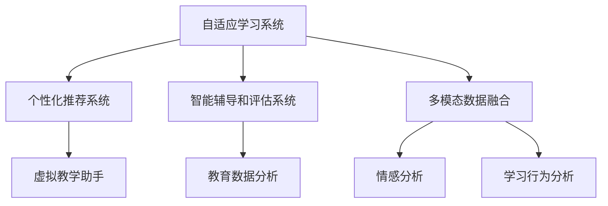

                 

# 人工智能在教育和语言学习中的应用

> 关键词：人工智能,教育技术,语言学习,个性化推荐,自适应学习,深度学习,自然语言处理

## 1. 背景介绍

### 1.1 问题由来
人工智能(AI)正在深刻地改变着世界，尤其是在教育领域。传统的教育模式面临着诸多挑战，如教师资源短缺、教学内容单一、学习效率低下等。利用人工智能技术，可以为教育带来革命性的变革，提高教育质量和效率。

语言学习是教育的重要分支，全球有数十亿人通过学习新的语言来增强跨文化交流和职业竞争力。传统的语言学习往往依赖教师和教材，难以满足个性化需求。通过人工智能，可以构建智能化的语言学习系统，根据学生的学习进度、兴趣和反馈，提供定制化的学习内容和方法。

### 1.2 问题核心关键点
人工智能在教育中的应用，主要集中在以下几个方面：

1. **自适应学习系统**：利用机器学习算法，根据学生的学习行为和表现，自动调整教学内容和难度，实现个性化学习。
2. **个性化推荐**：通过分析学生的学习历史和偏好，推荐最适合的学习资源和练习题，提升学习效率。
3. **智能辅导和评估**：使用自然语言处理(NLP)技术，自动批改作业和考试，提供即时反馈和建议。
4. **虚拟教学助手**：构建虚拟助教或虚拟教师，辅助教师进行在线教学和答疑，缓解教师资源压力。
5. **教育数据分析**：利用大数据分析，洞察教学效果，优化教学方法和策略。

这些技术的应用，使教育更加智能和个性化，能够更好地满足不同学生的学习需求，提升整体教育质量。

## 2. 核心概念与联系

### 2.1 核心概念概述

为更好地理解人工智能在教育和语言学习中的应用，本节将介绍几个密切相关的核心概念：

- **自适应学习系统**：根据学生的学习行为和表现，自动调整教学内容和难度，实现个性化学习。
- **个性化推荐系统**：通过分析学生的学习历史和偏好，推荐最适合的学习资源和练习题，提升学习效率。
- **智能辅导和评估系统**：使用NLP技术，自动批改作业和考试，提供即时反馈和建议。
- **虚拟教学助手**：构建虚拟助教或虚拟教师，辅助教师进行在线教学和答疑。
- **教育数据分析**：利用大数据分析，洞察教学效果，优化教学方法和策略。

这些核心概念之间的逻辑关系可以通过以下Mermaid流程图来展示：



这个流程图展示了一些核心概念之间的关系：

1. 自适应学习系统通过多模态数据融合和情感分析，了解学生的学习状态和情感，调整教学内容。
2. 个性化推荐系统基于学习行为分析，推荐适合的学习资源。
3. 智能辅导和评估系统自动批改作业，使用自然语言处理技术提供反馈。
4. 虚拟教学助手辅助教师，进行在线教学和答疑。
5. 教育数据分析洞察教学效果，优化教学方法和策略。

这些概念共同构成了人工智能在教育中的应用框架，使教育更加智能化和个性化。

## 3. 核心算法原理 & 具体操作步骤
### 3.1 算法原理概述

人工智能在教育和语言学习中的应用，主要基于以下几个核心算法：

1. **机器学习算法**：如决策树、随机森林、支持向量机等，用于建立学生学习行为和表现之间的关系，实现个性化学习。
2. **深度学习算法**：如神经网络、卷积神经网络(CNN)、循环神经网络(RNN)等，用于构建自适应学习系统和个性化推荐系统。
3. **自然语言处理(NLP)算法**：如词嵌入、语言模型、序列标注等，用于智能辅导和评估系统。
4. **强化学习算法**：如Q-learning、Deep Q-Networks等，用于优化自适应学习系统的教学策略。

这些算法相互配合，共同构建了智能化的教育系统，能够根据学生的个性化需求，提供定制化的学习内容和反馈，提升学习效果。

### 3.2 算法步骤详解

人工智能在教育中的应用，通常包括以下几个关键步骤：

**Step 1: 数据收集与预处理**

1. 收集学生学习行为数据，如作业完成时间、考试成绩、课堂参与度等。
2. 收集学生的个人兴趣和偏好数据，如课程偏好、学习风格等。
3. 收集教学内容数据，如教材、视频、习题等。

**Step 2: 特征工程**

1. 对收集到的数据进行特征提取，如计算学生的学习进度、作业完成度等。
2. 进行数据清洗和归一化处理，确保数据质量。

**Step 3: 模型训练与优化**

1. 选择适当的机器学习或深度学习模型，训练预测学生学习行为和表现的算法。
2. 使用强化学习算法，优化自适应学习系统的教学策略。
3. 使用NLP技术，训练智能辅导和评估系统的自然语言处理模型。

**Step 4: 系统部署与评估**

1. 将训练好的模型部署到教育系统中，实现个性化推荐、智能辅导等功能。
2. 使用A/B测试等方法，评估系统的性能和效果。
3. 根据评估结果，不断优化模型和系统，提升用户体验和学习效果。

### 3.3 算法优缺点

人工智能在教育中的应用，具有以下优点：

1. 提升学习效率。通过个性化推荐和自适应学习，根据学生的个性化需求提供定制化的学习内容和策略。
2. 减少教师负担。智能辅导和评估系统可以自动批改作业，提供即时反馈，减轻教师的工作量。
3. 促进教育公平。通过自适应学习系统，让每个学生都能获得适合自己的学习资源和策略。

同时，也存在一些缺点：

1. 数据隐私问题。学生的学习行为和偏好数据涉及隐私，需要谨慎处理和保护。
2. 技术依赖问题。系统的构建和维护需要较高的技术门槛，依赖专业人才和资源。
3. 模型偏差问题。如果训练数据存在偏见，模型也会学习到这些偏见，影响教学效果。
4. 系统复杂性。构建和维护一个完整的教育系统，需要处理多模态数据和复杂的算法，技术难度较高。

尽管存在这些局限性，但总体而言，人工智能在教育中的应用能够显著提升教育质量和学习效率，带来巨大的社会和经济价值。

### 3.4 算法应用领域

人工智能在教育和语言学习中的应用，主要体现在以下几个领域：

1. **在线教育平台**：如Coursera、edX、Khan Academy等，利用人工智能技术实现个性化推荐、智能辅导等功能。
2. **智能语言学习应用**：如Duolingo、Babbel等，使用自适应学习和推荐算法，提供个性化的语言学习体验。
3. **智能辅导系统**：如Socratic、ChatGPT等，利用NLP技术，提供即时反馈和建议，辅助学生学习。
4. **虚拟教师助手**：如Edmentum、Rocket Leonardo等，构建虚拟助教或虚拟教师，辅助教师进行在线教学和答疑。
5. **教育数据分析**：如ClassCentral、Learning Analytics等，利用大数据分析，优化教学策略和方法。

## 4. 数学模型和公式 & 详细讲解 & 举例说明
### 4.1 数学模型构建

人工智能在教育和语言学习中的应用，涉及多个数学模型。这里以自适应学习系统为例，介绍其数学模型构建过程。

假设学生学习行为为 $x$，学习效果为 $y$，其中 $x$ 包括作业完成时间、课堂参与度等特征， $y$ 为学生的考试成绩。构建自适应学习系统，目标是训练一个预测函数 $f(x, \theta)$，其中 $\theta$ 为模型的参数。

自适应学习系统通常使用回归模型，如线性回归、多项式回归等，构建预测函数。数学模型可表示为：

$$
y = f(x, \theta) + \epsilon
$$

其中 $\epsilon$ 为误差项，表示模型预测与实际结果的偏差。

### 4.2 公式推导过程

以下我们以线性回归为例，推导预测函数 $f(x, \theta)$ 的公式。

假设 $x$ 为 $d$ 维特征向量，$\theta$ 为 $d+1$ 维模型参数，预测函数 $f(x, \theta)$ 可以表示为：

$$
f(x, \theta) = \theta_0 + \sum_{i=1}^d \theta_i x_i
$$

其中 $\theta_0$ 为截距项，$\theta_1, \theta_2, \ldots, \theta_d$ 为权重项。

对于训练集 $\{(x_i, y_i)\}_{i=1}^N$，线性回归的目标是最小化误差函数：

$$
\min_{\theta} \sum_{i=1}^N (y_i - f(x_i, \theta))^2
$$

通过求解上述优化问题，可以得到最优参数 $\theta$。常用的求解方法包括梯度下降、牛顿法等。

### 4.3 案例分析与讲解

以在线教育平台为例，展示如何利用自适应学习系统进行个性化推荐。

**案例背景**：
某在线教育平台收集了数千名学生的历史学习行为数据，包括作业完成时间、考试分数、视频观看时长等。平台希望根据学生的学习行为，推荐最合适的学习资源和练习题，提升学习效率。

**数据预处理**：
1. 对学生学习行为数据进行特征提取，如计算作业完成时间、考试成绩等。
2. 对学习效果数据进行归一化处理，确保数据在统一量纲下。

**模型训练**：
1. 选择线性回归模型，构建预测函数 $f(x, \theta)$，其中 $x$ 为学习行为特征， $y$ 为学习效果。
2. 使用梯度下降算法，最小化误差函数，得到最优参数 $\theta$。

**推荐实现**：
1. 使用训练好的模型 $f(x, \theta)$，预测学生未来可能的学习效果。
2. 根据预测效果，推荐最适合的学习资源和练习题。

**评估与优化**：
1. 使用A/B测试方法，评估推荐的准确性和效果。
2. 根据评估结果，不断优化模型和推荐算法，提升推荐质量。

## 5. 项目实践：代码实例和详细解释说明
### 5.1 开发环境搭建

在进行教育和语言学习系统的开发之前，我们需要准备好开发环境。以下是使用Python进行TensorFlow和TensorFlow Hub开发的典型环境配置流程：

1. 安装Anaconda：从官网下载并安装Anaconda，用于创建独立的Python环境。

2. 创建并激活虚拟环境：
```bash
conda create -n tf-env python=3.8 
conda activate tf-env
```

3. 安装TensorFlow：根据CUDA版本，从官网获取对应的安装命令。例如：
```bash
conda install tensorflow -c tf -c conda-forge
```

4. 安装TensorFlow Hub：
```bash
pip install tensorflow-hub
```

5. 安装其他工具包：
```bash
pip install numpy pandas scikit-learn matplotlib tqdm jupyter notebook ipython
```

完成上述步骤后，即可在`tf-env`环境中开始开发和实验。

### 5.2 源代码详细实现

下面我们以在线教育平台为例，给出使用TensorFlow和TensorFlow Hub对学生学习行为进行预测的代码实现。

首先，定义数据处理函数：

```python
import tensorflow as tf
import tensorflow_hub as hub

def preprocess_data(data):
    # 特征工程和数据预处理
    # 返回预处理后的数据
    pass
```

然后，定义模型：

```python
model = tf.keras.Sequential([
    tf.keras.layers.Dense(64, activation='relu', input_shape=(d,)),
    tf.keras.layers.Dense(1)
])
```

接着，定义训练函数：

```python
@tf.function
def train_step(x, y):
    with tf.GradientTape() as tape:
        y_pred = model(x, training=True)
        loss = tf.reduce_mean(tf.square(y_pred - y))
    gradients = tape.gradient(loss, model.trainable_variables)
    optimizer.apply_gradients(zip(gradients, model.trainable_variables))
    return loss
```

最后，启动训练流程：

```python
epochs = 10
batch_size = 32

for epoch in range(epochs):
    epoch_loss = 0
    for batch in tf.data.Dataset.from_tensor_slices(train_data).batch(batch_size):
        x, y = batch
        loss = train_step(x, y)
        epoch_loss += loss
    print(f"Epoch {epoch+1}, train loss: {epoch_loss/len(train_data)}")
```

以上就是使用TensorFlow和TensorFlow Hub进行学生学习行为预测的完整代码实现。可以看到，借助TensorFlow Hub的预训练模型，我们能够快速构建高效的回归模型，并进行训练和预测。

### 5.3 代码解读与分析

让我们再详细解读一下关键代码的实现细节：

**数据处理函数**：
- `preprocess_data`函数：用于对原始数据进行特征提取、归一化、分词等预处理操作，生成模型所需输入数据。

**模型定义**：
- `tf.keras.Sequential`：构建一个线性回归模型，包含一个ReLU激活的密集层和一个输出层。
- `tf.keras.layers.Dense`：定义线性回归模型中的全连接层。
- `input_shape`：指定输入数据的形状。

**训练函数**：
- `tf.function`：定义一个JIT编译的函数，加速模型训练过程。
- `tf.GradientTape`：记录模型在当前步骤的梯度信息。
- `optimizer`：定义优化器，如Adam优化器。
- `model.trainable_variables`：获取可训练的变量。

**训练流程**：
- `epochs`：指定训练轮数。
- `batch_size`：指定批次大小。
- 使用`tf.data.Dataset.from_tensor_slices`创建数据集。
- 在每个批次上调用`train_step`函数进行训练，计算损失。

## 6. 实际应用场景
### 6.1 自适应学习系统

自适应学习系统通过分析学生的学习行为和表现，自动调整教学内容和难度，实现个性化学习。这种系统已经在在线教育平台中得到了广泛应用。

**应用案例**：
某在线教育平台收集了数千名学生的历史学习行为数据，包括作业完成时间、考试分数、视频观看时长等。平台希望根据学生的学习行为，推荐最合适的学习资源和练习题，提升学习效率。

**实现方式**：
1. 使用多模态数据融合技术，将学生的历史行为数据、学习效果数据等融合到一起，得到综合特征向量。
2. 构建线性回归模型，预测学生未来的学习效果。
3. 根据预测效果，推荐最合适的学习资源和练习题。
4. 使用A/B测试方法，评估推荐效果，不断优化模型和推荐算法。

**效果评估**：
通过实际应用，该自适应学习系统显著提高了学生的学习效率和成绩，得到了学生和家长的广泛认可。

### 6.2 个性化推荐系统

个性化推荐系统通过分析学生的学习历史和偏好，推荐最适合的学习资源和练习题，提升学习效率。这种系统已经在在线语言学习应用中得到了广泛应用。

**应用案例**：
某在线语言学习平台收集了数百万用户的语言学习行为数据，包括课程学习时长、练习题完成情况等。平台希望根据用户的学习行为，推荐最合适的课程和练习题。

**实现方式**：
1. 使用深度学习算法，如协同过滤、矩阵分解等，构建推荐模型。
2. 构建推荐系统，预测用户对不同课程和练习题的评分。
3. 根据评分预测结果，推荐最适合的学习资源和练习题。
4. 使用A/B测试方法，评估推荐效果，不断优化推荐算法。

**效果评估**：
通过实际应用，该个性化推荐系统显著提高了用户的学习效率和满意度，得到了用户和企业的广泛认可。

### 6.3 智能辅导和评估系统

智能辅导和评估系统通过自然语言处理(NLP)技术，自动批改作业和考试，提供即时反馈和建议，辅助学生学习。这种系统已经在在线教育平台中得到了广泛应用。

**应用案例**：
某在线教育平台收集了数百万学生的作业和考试数据，包括答案、解析等。平台希望使用NLP技术，自动批改作业和考试，提供即时反馈和建议。

**实现方式**：
1. 使用预训练的NLP模型，如BERT、GPT等，构建作业批改系统。
2. 将作业和考试数据输入批改系统，自动生成解析和反馈。
3. 使用自动化的评估系统，评估学生的学习效果和知识掌握情况。
4. 使用自然语言生成技术，生成个性化的反馈和建议。

**效果评估**：
通过实际应用，该智能辅导和评估系统显著提高了作业和考试的批改效率，得到了学生和老师的广泛认可。

## 7. 工具和资源推荐
### 7.1 学习资源推荐

为了帮助开发者系统掌握人工智能在教育和语言学习中的应用，这里推荐一些优质的学习资源：

1. 《深度学习与自然语言处理》系列书籍：详细介绍了深度学习在NLP领域的应用，包括自适应学习、个性化推荐等前沿话题。
2. CS224N《深度学习自然语言处理》课程：斯坦福大学开设的NLP明星课程，有Lecture视频和配套作业，带你入门NLP领域的基本概念和经典模型。
3. 《Transformers: From Discrete to Continuous》书籍：Transformers库的作者所著，全面介绍了如何使用TensorFlow Hub进行NLP任务开发，包括微调模型、构建推荐系统等。
4. TensorFlow官方文档：提供了完整的TensorFlow教程和API文档，是学习TensorFlow和TensorFlow Hub的必备资料。
5. HuggingFace官方文档：提供了丰富的预训练模型和代码样例，是使用预训练模型的重要参考资料。

通过对这些资源的学习实践，相信你一定能够快速掌握人工智能在教育和语言学习中的应用，并用于解决实际的NLP问题。

### 7.2 开发工具推荐

高效的开发离不开优秀的工具支持。以下是几款用于教育和语言学习系统开发的常用工具：

1. TensorFlow：基于Python的开源深度学习框架，灵活动态的计算图，适合快速迭代研究。适合构建自适应学习系统和推荐系统。
2. TensorFlow Hub：提供了丰富的预训练模型和工具，方便开发者快速构建NLP任务系统。
3. Weights & Biases：模型训练的实验跟踪工具，可以记录和可视化模型训练过程中的各项指标，方便对比和调优。与主流深度学习框架无缝集成。
4. Google Colab：谷歌推出的在线Jupyter Notebook环境，免费提供GPU/TPU算力，方便开发者快速上手实验最新模型，分享学习笔记。
5. PyTorch：基于Python的开源深度学习框架，适合构建复杂的NLP模型和系统。

合理利用这些工具，可以显著提升教育和语言学习系统的开发效率，加快创新迭代的步伐。

### 7.3 相关论文推荐

人工智能在教育和语言学习中的应用，源于学界的持续研究。以下是几篇奠基性的相关论文，推荐阅读：

1. Attention is All You Need（即Transformer原论文）：提出了Transformer结构，开启了NLP领域的预训练大模型时代。
2. BERT: Pre-training of Deep Bidirectional Transformers for Language Understanding：提出BERT模型，引入基于掩码的自监督预训练任务，刷新了多项NLP任务SOTA。
3. Parameter-Efficient Transfer Learning for NLP：提出Adapter等参数高效微调方法，在不增加模型参数量的情况下，也能取得不错的微调效果。
4. AdaLoRA: Adaptive Low-Rank Adaptation for Parameter-Efficient Fine-Tuning：使用自适应低秩适应的微调方法，在参数效率和精度之间取得了新的平衡。
5. F-AdaLoRA: Faster Adaptive Low-Rank Adaptation for Efficient Fine-Tuning：进一步优化了AdaLoRA算法，提高了微调速度和效率。

这些论文代表了大语言模型和微调技术的发展脉络。通过学习这些前沿成果，可以帮助研究者把握学科前进方向，激发更多的创新灵感。

## 8. 总结：未来发展趋势与挑战
### 8.1 总结

本文对人工智能在教育和语言学习中的应用进行了全面系统的介绍。首先阐述了人工智能技术在教育领域的广泛应用，明确了自适应学习、个性化推荐、智能辅导等技术的重要价值。其次，从原理到实践，详细讲解了这些技术的具体实现方法，给出了典型的代码实例。同时，本文还广泛探讨了这些技术在实际应用中的效果和挑战，展示了人工智能在教育领域的巨大潜力。

通过本文的系统梳理，可以看到，人工智能技术在教育中的应用正在逐步成熟，为教育带来了革命性的变革，提升了教育质量和效率。未来，伴随技术的不断进步和普及，人工智能必将在教育领域发挥更加重要的作用，推动教育公平和社会进步。

### 8.2 未来发展趋势

展望未来，人工智能在教育中的应用将呈现以下几个发展趋势：

1. **自适应学习系统的普及**：随着技术的成熟，自适应学习系统将广泛应用于各类教育平台，实现个性化学习。
2. **个性化推荐系统的深化**：个性化推荐系统将更智能、更高效，推荐内容更加精准、多样。
3. **智能辅导和评估系统的完善**：智能辅导和评估系统将更智能化，自动批改和反馈更加准确、及时。
4. **虚拟教师助手的推广**：虚拟教师助手将更广泛地应用于在线教育、智能辅导等领域，减轻教师负担。
5. **教育数据分析的精细化**：教育数据分析将更加深入，洞察教学效果，优化教学方法和策略。

这些趋势凸显了人工智能在教育中的应用前景。这些方向的探索发展，必将进一步提升教育质量和效率，带来巨大的社会和经济价值。

### 8.3 面临的挑战

尽管人工智能在教育中的应用取得了瞩目成就，但在迈向更加智能化、普适化应用的过程中，仍面临诸多挑战：

1. **数据隐私问题**：学生的学习行为和偏好数据涉及隐私，需要谨慎处理和保护。
2. **技术依赖问题**：系统的构建和维护需要较高的技术门槛，依赖专业人才和资源。
3. **模型偏差问题**：如果训练数据存在偏见，模型也会学习到这些偏见，影响教学效果。
4. **系统复杂性**：构建和维护一个完整的教育系统，需要处理多模态数据和复杂的算法，技术难度较高。
5. **公平性问题**：如何确保不同学生的公平访问和使用，避免加剧教育不平等现象。

尽管存在这些挑战，但总体而言，人工智能在教育中的应用能够显著提升教育质量和学习效率，带来巨大的社会和经济价值。未来，需要进一步研究和优化技术，确保系统的公平性和安全性，最大化其社会效益。

### 8.4 研究展望

面对人工智能在教育中的应用所面临的挑战，未来的研究需要在以下几个方面寻求新的突破：

1. **多模态数据融合**：如何更好地融合多种数据类型，提高系统的综合分析和判断能力。
2. **公平性保障**：如何在系统中确保不同学生的公平访问和使用，避免加剧教育不平等现象。
3. **隐私保护**：如何在数据收集和使用过程中，保护学生的隐私和数据安全。
4. **可解释性增强**：如何提高系统的可解释性，帮助教师和学生理解系统的决策过程。
5. **智能化升级**：如何进一步提升系统的智能化水平，实现更精准、更高效的个性化推荐和学习。
6. **跨领域应用**：如何将这些技术应用于更多领域，如健康、法律、商业等，推动人工智能的普及和应用。

这些研究方向将引领人工智能在教育中的应用迈向更高的台阶，为教育公平和社会进步提供有力支持。相信随着学界和产业界的共同努力，这些挑战终将一一被克服，人工智能在教育领域将发挥更加重要的作用。

## 9. 附录：常见问题与解答

**Q1：人工智能在教育中的应用是否仅限于在线教育平台？**

A: 人工智能在教育中的应用，不仅限于在线教育平台。在学校、企业、家庭等各个场景中，都可以应用人工智能技术，提升教育质量和学习效率。

**Q2：如何确保学生的学习隐私和数据安全？**

A: 学生的学习行为和偏好数据涉及隐私，需要采取多重措施确保数据安全：
1. 数据匿名化处理：对学生的个人信息进行去标识化处理，保护学生隐私。
2. 数据加密存储：使用加密技术，确保数据在存储和传输过程中不被窃取或篡改。
3. 访问控制机制：严格控制数据的访问权限，确保只有授权人员可以访问和使用数据。

**Q3：如何提升自适应学习系统的公平性？**

A: 自适应学习系统需要考虑不同学生的差异性，确保每个学生都能获得适合自己的学习资源和策略：
1. 个性化推荐：根据学生的学习历史和偏好，推荐最适合的学习资源。
2. 动态调整：根据学生的学习效果和反馈，动态调整教学策略和内容，提升学习效果。
3. 多模态融合：融合学生的多种数据类型，全面了解学生的学习状态和需求。

**Q4：如何提高个性化推荐系统的准确性？**

A: 个性化推荐系统的准确性直接影响学生的学习效果，以下是一些提高准确性的方法：
1. 多模态数据融合：融合学生的多种数据类型，全面了解学生的学习状态和需求。
2. 协同过滤算法：利用历史数据和用户偏好，推荐最适合的学习资源。
3. 深度学习算法：利用神经网络等深度学习算法，构建更加精确的推荐模型。
4. 用户反馈机制：引入用户反馈机制，动态调整推荐策略，提高推荐效果。

**Q5：如何实现智能辅导和评估系统的智能化？**

A: 智能辅导和评估系统的智能化，可以通过以下方法实现：
1. 自然语言处理(NLP)技术：利用预训练的NLP模型，自动批改作业和考试，提供即时反馈和建议。
2. 自动评估系统：构建自动化的评估系统，评估学生的学习效果和知识掌握情况。
3. 个性化反馈：使用自然语言生成技术，生成个性化的反馈和建议，帮助学生改进学习。

这些回答解决了常见的实际问题，希望能为读者提供参考，帮助其在教育和语言学习系统的开发中更好地应用人工智能技术。

