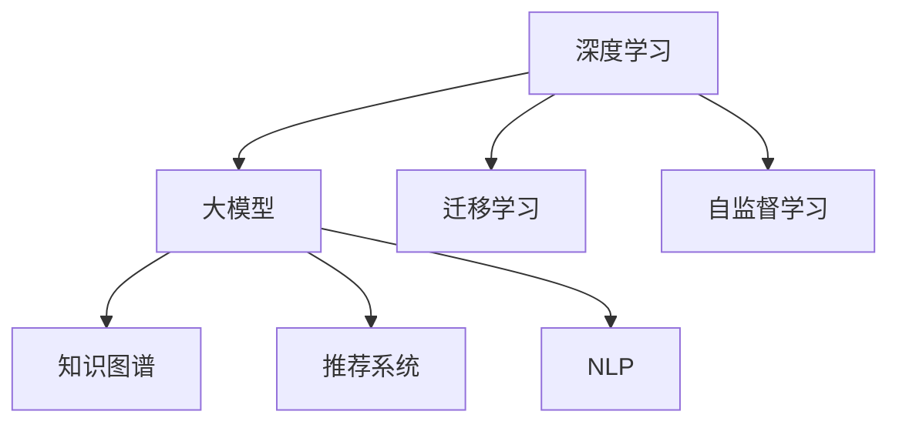

                 

# 人工智能时代的教育变革

## 1. 背景介绍

在过去几十年里，人工智能(AI)技术取得了令人瞩目的进展。从最初的专家系统和神经网络，到如今的深度学习和增强学习，AI正在以迅猛的步伐改变着世界的每一个角落。教育领域也不例外，AI技术的应用正在重塑传统的教育模式，开启了教育变革的新篇章。

### 1.1 教育变革的背景

教育一直是社会发展的基石，但传统的教育模式在信息化和全球化的大背景下逐渐显露出其局限性。学生的个性化学习需求、教师的效率提升需求、教育资源的均衡分配需求等，都急需通过技术手段得到解决。AI技术，特别是基于深度学习的大模型技术，为教育领域提供了全新的解决方案，驱动着教育的数字化、智能化和个性化发展。

### 1.2 教育变革的关键点

AI在教育中的应用主要体现在以下几个方面：

- **个性化学习**：通过数据分析和机器学习，AI能够根据学生的学习习惯和能力，提供定制化的学习方案，实现因材施教。
- **智能辅导**：AI能够提供24小时的学习辅导，帮助学生解答疑难问题，提高学习效率。
- **资源优化**：AI能够自动筛选和推荐高质量的学习资源，优化教育资源的分配和使用。
- **自动评估**：AI能够自动化地进行作业批改、考试评分，减轻教师的负担，提高评估的客观性和公正性。
- **教学辅助**：AI可以为教师提供教学内容生成、课堂管理等辅助工具，提升教学质量。

## 2. 核心概念与联系

### 2.1 核心概念概述

为更好地理解AI在教育中的应用，本节将介绍几个关键概念：

- **深度学习(DL)**：基于神经网络的学习范式，通过多层次的特征提取和表示学习，从大量数据中发现潜在的模式和规律。
- **大模型(Large Models)**：具有亿级参数的深度神经网络模型，如GPT、BERT等，能够处理复杂的自然语言处理任务。
- **迁移学习(Transfer Learning)**：将在大规模数据上预训练的模型知识，迁移到特定任务上进行微调，以提升模型性能。
- **自监督学习(Self-Supervised Learning)**：利用无标签数据训练模型，通过自我监督关系发现数据内在的结构。
- **知识图谱(Knowledge Graph)**：将知识以图的形式组织，便于机器理解和推理。
- **推荐系统(Recommendation System)**：根据用户的历史行为和偏好，推荐其感兴趣的内容。
- **自然语言处理(NLP)**：使计算机能够理解和处理人类语言的技术。

这些概念之间具有紧密的联系，共同构成了AI在教育领域应用的基础。

### 2.2 核心概念的联系

以下使用Mermaid流程图来展示这些概念之间的关系：



这个流程图展示了深度学习与大模型、迁移学习、自监督学习之间的关系：深度学习技术通过大模型实现，大模型通过迁移学习和自监督学习进一步提升性能。同时，大模型能够与知识图谱、推荐系统和NLP等技术结合，实现更广泛的应用。

## 3. 核心算法原理 & 具体操作步骤

### 3.1 算法原理概述

基于大模型的教育变革主要基于迁移学习和大模型的知识迁移能力。其核心思想是：通过在大规模数据上预训练的通用模型，迁移到教育领域特定的任务上进行微调，从而提升模型的应用效果。

形式化地，假设大模型为 $M_{\theta}$，其中 $\theta$ 为模型参数。给定教育领域任务 $T$ 的标注数据集 $D=\{(x_i,y_i)\}_{i=1}^N$，教育变革的目标是找到最优参数 $\hat{\theta}$，使得：

$$
\hat{\theta}=\mathop{\arg\min}_{\theta} \mathcal{L}(M_{\theta},D)
$$

其中 $\mathcal{L}$ 为针对任务 $T$ 设计的损失函数，用于衡量模型预测输出与真实标签之间的差异。常见的损失函数包括交叉熵损失、均方误差损失等。

通过梯度下降等优化算法，教育变革过程不断更新模型参数 $\theta$，最小化损失函数 $\mathcal{L}$，使得模型输出逼近真实标签。由于 $\theta$ 已经通过预训练获得了较好的初始化，因此即便在教育领域小规模数据集 $D$ 上进行微调，也能较快收敛到理想的模型参数 $\hat{\theta}$。

### 3.2 算法步骤详解

基于大模型的教育变革一般包括以下几个关键步骤：

**Step 1: 准备预训练模型和数据集**
- 选择合适的预训练大模型 $M_{\theta}$ 作为初始化参数，如 GPT、BERT等。
- 准备教育领域任务 $T$ 的标注数据集 $D$，划分为训练集、验证集和测试集。一般要求标注数据与预训练数据的分布不要差异过大。

**Step 2: 添加任务适配层**
- 根据任务类型，在预训练模型顶层设计合适的输出层和损失函数。
- 对于分类任务，通常在顶层添加线性分类器和交叉熵损失函数。
- 对于生成任务，通常使用语言模型的解码器输出概率分布，并以负对数似然为损失函数。

**Step 3: 设置教育变革超参数**
- 选择合适的优化算法及其参数，如 AdamW、SGD 等，设置学习率、批大小、迭代轮数等。
- 设置正则化技术及强度，包括权重衰减、Dropout、Early Stopping 等。
- 确定冻结预训练参数的策略，如仅微调顶层，或全部参数都参与微调。

**Step 4: 执行梯度训练**
- 将训练集数据分批次输入模型，前向传播计算损失函数。
- 反向传播计算参数梯度，根据设定的优化算法和学习率更新模型参数。
- 周期性在验证集上评估模型性能，根据性能指标决定是否触发 Early Stopping。
- 重复上述步骤直到满足预设的迭代轮数或 Early Stopping 条件。

**Step 5: 测试和部署**
- 在测试集上评估微调后模型 $M_{\hat{\theta}}$ 的性能，对比微调前后的精度提升。
- 使用微调后的模型对新学生进行教学适配，集成到实际的教育系统中。
- 持续收集新的教学数据，定期重新微调模型，以适应数据分布的变化。

以上是基于大模型的教育变革的一般流程。在实际应用中，还需要针对具体任务的特点，对教育变革过程的各个环节进行优化设计，如改进训练目标函数，引入更多的正则化技术，搜索最优的超参数组合等，以进一步提升模型性能。

### 3.3 算法优缺点

基于大模型的教育变革方法具有以下优点：
1. 简单高效。只需准备少量标注数据，即可对预训练模型进行快速适配，获得较大的性能提升。
2. 通用适用。适用于各种教育领域任务，包括分类、匹配、生成等，设计简单的任务适配层即可实现教育变革。
3. 参数高效。利用参数高效微调技术，在固定大部分预训练参数的情况下，仍可取得不错的教育变革效果。
4. 效果显著。在学术界和工业界的诸多任务上，基于教育变革的方法已经刷新了最先进的性能指标。

同时，该方法也存在一定的局限性：
1. 依赖标注数据。教育变革的效果很大程度上取决于标注数据的质量和数量，获取高质量标注数据的成本较高。
2. 迁移能力有限。当目标任务与预训练数据的分布差异较大时，教育变革的性能提升有限。
3. 可解释性不足。教育变革模型的决策过程通常缺乏可解释性，难以对其推理逻辑进行分析和调试。

尽管存在这些局限性，但就目前而言，基于大模型的教育变革方法仍是最主流范式。未来相关研究的重点在于如何进一步降低教育变革对标注数据的依赖，提高模型的少样本学习和跨领域迁移能力，同时兼顾可解释性和伦理安全性等因素。

### 3.4 算法应用领域

基于大模型的教育变革方法在教育领域已经得到了广泛的应用，覆盖了几乎所有常见任务，例如：

- 智能辅导：基于大模型的智能学习平台，提供24小时的学习辅导，帮助学生解答疑难问题，提高学习效率。
- 个性化推荐：推荐系统根据学生的历史学习数据，推荐个性化的学习资源和课程。
- 作业批改：大模型可以自动批改学生的作业和试卷，减轻教师的负担，提高评估的客观性和公正性。
- 课堂管理：智能教室系统可以根据学生的学习行为，自动调整教学内容，提升教学效果。
- 虚拟实验室：基于大模型的虚拟实验室，可以让学生进行虚拟实验，提高实验教学的质量和安全性。

除了上述这些经典任务外，基于大模型的教育变革技术也在更多场景中得到应用，如在线学习平台、智能教学内容生成、情感分析等，为教育技术的发展提供了新的动力。

## 4. 数学模型和公式 & 详细讲解 & 举例说明

### 4.1 数学模型构建

本节将使用数学语言对基于大模型的教育变革过程进行更加严格的刻画。

记预训练大模型为 $M_{\theta}$，其中 $\theta$ 为模型参数。假设教育领域任务 $T$ 的训练集为 $D=\{(x_i,y_i)\}_{i=1}^N, x_i \in \mathcal{X}, y_i \in \mathcal{Y}$。

定义模型 $M_{\theta}$ 在数据样本 $(x,y)$ 上的损失函数为 $\ell(M_{\theta}(x),y)$，则在数据集 $D$ 上的经验风险为：

$$
\mathcal{L}(\theta) = \frac{1}{N} \sum_{i=1}^N \ell(M_{\theta}(x_i),y_i)
$$

教育变革的优化目标是最小化经验风险，即找到最优参数：

$$
\theta^* = \mathop{\arg\min}_{\theta} \mathcal{L}(\theta)
$$

在实践中，我们通常使用基于梯度的优化算法（如SGD、Adam等）来近似求解上述最优化问题。设 $\eta$ 为学习率，$\lambda$ 为正则化系数，则参数的更新公式为：

$$
\theta \leftarrow \theta - \eta \nabla_{\theta}\mathcal{L}(\theta) - \eta\lambda\theta
$$

其中 $\nabla_{\theta}\mathcal{L}(\theta)$ 为损失函数对参数 $\theta$ 的梯度，可通过反向传播算法高效计算。

### 4.2 公式推导过程

以下我们以二分类任务为例，推导交叉熵损失函数及其梯度的计算公式。

假设模型 $M_{\theta}$ 在输入 $x$ 上的输出为 $\hat{y}=M_{\theta}(x) \in [0,1]$，表示学生属于正类的概率。真实标签 $y \in \{0,1\}$。则二分类交叉熵损失函数定义为：

$$
\ell(M_{\theta}(x),y) = -[y\log \hat{y} + (1-y)\log (1-\hat{y})]
$$

将其代入经验风险公式，得：

$$
\mathcal{L}(\theta) = -\frac{1}{N}\sum_{i=1}^N [y_i\log M_{\theta}(x_i)+(1-y_i)\log(1-M_{\theta}(x_i))]
$$

根据链式法则，损失函数对参数 $\theta_k$ 的梯度为：

$$
\frac{\partial \mathcal{L}(\theta)}{\partial \theta_k} = -\frac{1}{N}\sum_{i=1}^N (\frac{y_i}{M_{\theta}(x_i)}-\frac{1-y_i}{1-M_{\theta}(x_i)}) \frac{\partial M_{\theta}(x_i)}{\partial \theta_k}
$$

其中 $\frac{\partial M_{\theta}(x_i)}{\partial \theta_k}$ 可进一步递归展开，利用自动微分技术完成计算。

在得到损失函数的梯度后，即可带入参数更新公式，完成模型的迭代优化。重复上述过程直至收敛，最终得到适应教育领域任务的最优模型参数 $\theta^*$。

### 4.3 案例分析与讲解

下面我们以基于大模型的个性化学习推荐系统为例，详细解读其数学模型和算法流程。

假设我们有一个在线学习平台，平台中包含海量的学习资源，如视频、文章、练习等。用户登录平台后，系统可以记录用户的学习行为，如观看视频的时长、完成练习的得分等。根据这些行为数据，系统可以训练一个大模型，用于预测用户对不同学习资源的学习偏好，从而推荐个性化的学习资源。

具体实现步骤如下：

1. **数据准备**：收集用户的学习行为数据，标记用户对各类学习资源的学习偏好，构建训练数据集 $D$。
2. **模型选择**：选择一个大模型，如GPT-3，作为初始化参数。
3. **任务适配**：在顶层添加线性分类器和交叉熵损失函数，设计任务适配层，用于预测用户对资源的学习偏好。
4. **模型训练**：使用用户的交互数据 $D$ 对大模型进行训练，优化模型参数，使其能够根据用户行为预测资源偏好。
5. **推荐生成**：利用训练好的模型，对新用户的学习行为进行预测，生成个性化的学习资源推荐。

在上述过程中，大模型通过学习用户的交互数据，捕捉用户的学习偏好，从而生成高质量的推荐结果。这种基于大模型的推荐系统，可以大大提升用户的学习体验和平台的智能性。

## 5. 项目实践：代码实例和详细解释说明

### 5.1 开发环境搭建

在进行教育变革实践前，我们需要准备好开发环境。以下是使用Python进行PyTorch开发的环境配置流程：

1. 安装Anaconda：从官网下载并安装Anaconda，用于创建独立的Python环境。

2. 创建并激活虚拟环境：
```bash
conda create -n pytorch-env python=3.8 
conda activate pytorch-env
```

3. 安装PyTorch：根据CUDA版本，从官网获取对应的安装命令。例如：
```bash
conda install pytorch torchvision torchaudio cudatoolkit=11.1 -c pytorch -c conda-forge
```

4. 安装Transformers库：
```bash
pip install transformers
```

5. 安装各类工具包：
```bash
pip install numpy pandas scikit-learn matplotlib tqdm jupyter notebook ipython
```

完成上述步骤后，即可在`pytorch-env`环境中开始教育变革实践。

### 5.2 源代码详细实现

这里我们以一个基于大模型的智能辅导系统为例，详细讲解其实现过程。

首先，定义智能辅导系统的数据处理函数：

```python
from transformers import BertTokenizer
from torch.utils.data import Dataset
import torch

class StudentDataset(Dataset):
    def __init__(self, texts, labels, tokenizer, max_len=128):
        self.texts = texts
        self.labels = labels
        self.tokenizer = tokenizer
        self.max_len = max_len
        
    def __len__(self):
        return len(self.texts)
    
    def __getitem__(self, item):
        text = self.texts[item]
        label = self.labels[item]
        
        encoding = self.tokenizer(text, return_tensors='pt', max_length=self.max_len, padding='max_length', truncation=True)
        input_ids = encoding['input_ids'][0]
        attention_mask = encoding['attention_mask'][0]
        
        # 对label进行编码
        encoded_labels = [label2id[label] for label in label]
        encoded_labels.extend([label2id['None']] * (self.max_len - len(encoded_labels)))
        labels = torch.tensor(encoded_labels, dtype=torch.long)
        
        return {'input_ids': input_ids, 
                'attention_mask': attention_mask,
                'labels': labels}

# 标签与id的映射
label2id = {'O': 0, 'Correct': 1, 'Incorrect': 2}
id2label = {v: k for k, v in label2id.items()}

# 创建dataset
tokenizer = BertTokenizer.from_pretrained('bert-base-cased')

train_dataset = StudentDataset(train_texts, train_labels, tokenizer)
dev_dataset = StudentDataset(dev_texts, dev_labels, tokenizer)
test_dataset = StudentDataset(test_texts, test_labels, tokenizer)
```

然后，定义模型和优化器：

```python
from transformers import BertForTokenClassification, AdamW

model = BertForTokenClassification.from_pretrained('bert-base-cased', num_labels=len(label2id))

optimizer = AdamW(model.parameters(), lr=2e-5)
```

接着，定义训练和评估函数：

```python
from torch.utils.data import DataLoader
from tqdm import tqdm
from sklearn.metrics import accuracy_score

device = torch.device('cuda') if torch.cuda.is_available() else torch.device('cpu')
model.to(device)

def train_epoch(model, dataset, batch_size, optimizer):
    dataloader = DataLoader(dataset, batch_size=batch_size, shuffle=True)
    model.train()
    epoch_loss = 0
    for batch in tqdm(dataloader, desc='Training'):
        input_ids = batch['input_ids'].to(device)
        attention_mask = batch['attention_mask'].to(device)
        labels = batch['labels'].to(device)
        model.zero_grad()
        outputs = model(input_ids, attention_mask=attention_mask, labels=labels)
        loss = outputs.loss
        epoch_loss += loss.item()
        loss.backward()
        optimizer.step()
    return epoch_loss / len(dataloader)

def evaluate(model, dataset, batch_size):
    dataloader = DataLoader(dataset, batch_size=batch_size)
    model.eval()
    preds, labels = [], []
    with torch.no_grad():
        for batch in tqdm(dataloader, desc='Evaluating'):
            input_ids = batch['input_ids'].to(device)
            attention_mask = batch['attention_mask'].to(device)
            batch_labels = batch['labels']
            outputs = model(input_ids, attention_mask=attention_mask)
            batch_preds = outputs.logits.argmax(dim=2).to('cpu').tolist()
            batch_labels = batch_labels.to('cpu').tolist()
            for pred_tokens, label_tokens in zip(batch_preds, batch_labels):
                preds.append(pred_tokens[:len(label_tokens)])
                labels.append(label_tokens)
                
    print(f'Accuracy: {accuracy_score(labels, preds)}')
```

最后，启动训练流程并在测试集上评估：

```python
epochs = 5
batch_size = 16

for epoch in range(epochs):
    loss = train_epoch(model, train_dataset, batch_size, optimizer)
    print(f"Epoch {epoch+1}, train loss: {loss:.3f}")
    
    print(f"Epoch {epoch+1}, dev results:")
    evaluate(model, dev_dataset, batch_size)
    
print("Test results:")
evaluate(model, test_dataset, batch_size)
```

以上就是使用PyTorch对BERT进行智能辅导任务微调的完整代码实现。可以看到，得益于Transformers库的强大封装，我们可以用相对简洁的代码完成BERT模型的加载和微调。

### 5.3 代码解读与分析

让我们再详细解读一下关键代码的实现细节：

**StudentDataset类**：
- `__init__`方法：初始化文本、标签、分词器等关键组件。
- `__len__`方法：返回数据集的样本数量。
- `__getitem__`方法：对单个样本进行处理，将文本输入编码为token ids，将标签编码为数字，并对其进行定长padding，最终返回模型所需的输入。

**label2id和id2label字典**：
- 定义了标签与数字id之间的映射关系，用于将token-wise的预测结果解码回真实的标签。

**训练和评估函数**：
- 使用PyTorch的DataLoader对数据集进行批次化加载，供模型训练和推理使用。
- 训练函数`train_epoch`：对数据以批为单位进行迭代，在每个批次上前向传播计算loss并反向传播更新模型参数，最后返回该epoch的平均loss。
- 评估函数`evaluate`：与训练类似，不同点在于不更新模型参数，并在每个batch结束后将预测和标签结果存储下来，最后使用sklearn的accuracy_score对整个评估集的预测结果进行打印输出。

**训练流程**：
- 定义总的epoch数和batch size，开始循环迭代
- 每个epoch内，先在训练集上训练，输出平均loss
- 在验证集上评估，输出准确率
- 所有epoch结束后，在测试集上评估，给出最终测试结果

可以看到，PyTorch配合Transformers库使得BERT微调的代码实现变得简洁高效。开发者可以将更多精力放在数据处理、模型改进等高层逻辑上，而不必过多关注底层的实现细节。

当然，工业级的系统实现还需考虑更多因素，如模型的保存和部署、超参数的自动搜索、更灵活的任务适配层等。但核心的微调范式基本与此类似。

## 6. 实际应用场景

### 6.1 智能辅导系统

基于大模型微调的智能辅导系统，可以为学生提供24小时不间断的学习辅导，帮助其解答疑难问题，提高学习效率。系统通过收集学生的学习行为数据，如观看视频的时长、完成练习的得分等，训练一个大模型，用于预测学生对不同学习资源的学习偏好，从而推荐个性化的学习资源。

在技术实现上，可以收集学生的使用日志，将问题-答案对作为微调数据，训练模型学习匹配答案。对于学生提出的新问题，还可以接入检索系统实时搜索相关内容，动态组织生成回答。如此构建的智能辅导系统，能大幅提升学生的学习体验和问题解决效率。

### 6.2 个性化推荐系统

当前的推荐系统往往只依赖用户的历史行为数据进行物品推荐，无法深入理解用户的真实兴趣偏好。基于大模型微调技术，个性化推荐系统可以更好地挖掘用户行为背后的语义信息，从而提供更精准、多样的推荐内容。

在实践中，可以收集用户浏览、点击、评论、分享等行为数据，提取和用户交互的物品标题、描述、标签等文本内容。将文本内容作为模型输入，用户的后续行为（如是否点击、购买等）作为监督信号，在此基础上微调预训练语言模型。微调后的模型能够从文本内容中准确把握用户的兴趣点。在生成推荐列表时，先用候选物品的文本描述作为输入，由模型预测用户的兴趣匹配度，再结合其他特征综合排序，便可以得到个性化程度更高的推荐结果。

### 6.3 虚拟实验室

基于大模型的虚拟实验室，可以让学生进行虚拟实验，提高实验教学的质量和安全性。系统通过收集学生的实验行为数据，训练一个大模型，用于预测学生对不同实验步骤的学习偏好，从而推荐个性化的实验内容。同时，系统还可以根据学生的实验操作生成实时反馈，帮助其改进实验操作。

### 6.4 未来应用展望

随着大模型和微调方法的不断发展，基于微调范式将在更多领域得到应用，为传统行业带来变革性影响。

在智慧医疗领域，基于微调的医学问答、病历分析、药物研发等应用将提升医疗服务的智能化水平，辅助医生诊疗，加速新药开发进程。

在智能教育领域，微调技术可应用于作业批改、学情分析、知识推荐等方面，因材施教，促进教育公平，提高教学质量。

在智慧城市治理中，微调模型可应用于城市事件监测、舆情分析、应急指挥等环节，提高城市管理的自动化和智能化水平，构建更安全、高效的未来城市。

此外，在企业生产、社会治理、文娱传媒等众多领域，基于大模型微调的人工智能应用也将不断涌现，为经济社会发展注入新的动力。相信随着技术的日益成熟，微调方法将成为人工智能落地应用的重要范式，推动人工智能技术在垂直行业的规模化落地。

## 7. 工具和资源推荐
### 7.1 学习资源推荐

为了帮助开发者系统掌握大语言模型微调的理论基础和实践技巧，这里推荐一些优质的学习资源：

1. 《Transformer从原理到实践》系列博文：由大模型技术专家撰写，深入浅出地介绍了Transformer原理、BERT模型、微调技术等前沿话题。

2. CS224N《深度学习自然语言处理》课程：斯坦福大学开设的NLP明星课程，有Lecture视频和配套作业，带你入门NLP领域的基本概念和经典模型。

3. 《Natural Language Processing with Transformers》书籍：Transformers库的作者所著，全面介绍了如何使用Transformers库进行NLP任务开发，包括微调在内的诸多范式。

4. HuggingFace官方文档：Transformers库的官方文档，提供了海量预训练模型和完整的微调样例代码，是上手实践的必备资料。

5. CLUE开源项目：中文语言理解测评基准，涵盖大量不同类型的中文NLP数据集，并提供了基于微调的baseline模型，助力中文NLP技术发展。

通过对这些资源的学习实践，相信你一定能够快速掌握大语言模型微调的精髓，并用于解决实际的NLP问题。
###  7.2 开发工具推荐

高效的开发离不开优秀的工具支持。以下是几款用于大语言模型微调开发的常用工具：

1. PyTorch：基于Python的开源深度学习框架，灵活动态的计算图，适合快速迭代研究。大部分预训练语言模型都有PyTorch版本的实现。

2. TensorFlow：由Google主导开发的开源深度学习框架，生产部署方便，适合大规模工程应用。同样有丰富的预训练语言模型资源。

3. Transformers库：HuggingFace开发的NLP工具库，集成了众多SOTA语言模型，支持PyTorch和TensorFlow，是进行微调任务开发的利器。

4. Weights & Biases：模型训练的实验跟踪工具，可以记录和可视化模型训练过程中的各项指标，方便对比和调优。与主流深度学习框架无缝集成。

5. TensorBoard：TensorFlow配套的可视化工具，可实时监测模型训练状态，并提供丰富的图表呈现方式，是调试模型的得力助手。

6. Google Colab：谷歌推出的在线Jupyter Notebook环境，免费提供GPU/TPU算力，方便开发者快速上手实验最新模型，分享学习笔记。

合理利用这些工具，可以显著提升大语言模型微调任务的开发效率，加快创新迭代的步伐。

### 7.3 相关论文推荐

大语言模型和微调技术的发展源于学界的持续研究。以下是几篇奠基性的相关论文，推荐阅读：

1. Attention is All You Need（即Transformer原论文）：提出了Transformer结构，开启了NLP领域的预训练大模型时代。

2. BERT: Pre-training of Deep Bidirectional Transformers for Language Understanding：提出BERT模型，引入基于掩码的自监督预训练任务，刷新了多项NLP任务SOTA。

3. Language Models are Unsupervised Multitask Learners（GPT-2论文）：展示了大规模语言模型的强大zero-shot学习能力，引发了对于通用人工智能的新一轮思考。

4. Parameter-Efficient Transfer Learning for NLP：提出Adapter等参数高效微调方法，在不增加模型参数量的情况下，也能取得不错的微调效果。

5. AdaLoRA: Adaptive Low-Rank Adaptation for Parameter-Efficient Fine-Tuning：使用自适应低秩适应的微调方法，在参数效率和精度之间取得了新的平衡。

这些论文代表了大语言模型微调技术的发展脉络。通过学习这些前沿成果，可以帮助研究者把握学科前进方向，激发更多的创新灵感。

## 8. 总结：未来发展趋势与挑战

### 8.1 总结

本文对基于大模型的教育变革方法进行了全面系统的介绍。首先阐述了AI技术在教育领域的应用背景和关键点，明确了大模型和微调技术在教育变革中的独特价值。其次，从原理到实践，详细讲解了教育变革的数学模型和关键步骤，给出了教育变革任务开发的完整代码实例。同时，本文还广泛探讨了教育变革方法在智能辅导、个性化推荐、虚拟实验室等多个教育应用场景中的应用前景，展示了AI技术在教育领域的应用潜力。

通过本文的系统梳理，可以看到，基于大模型的教育变革技术正在推动教育领域向智能化、个性化、互动化方向发展。大模型通过迁移学习和自监督学习，能够快速适应不同教育任务，提供高质量的学习资源和个性化辅导，提升教育质量和学习效率。未来，随着技术的不断演进，AI将在更多教育应用中发挥重要作用，为构建更加公平、高效、灵活的教育体系提供新的动力。

### 8.2 未来发展趋势

展望未来，基于大模型的教育变革技术将呈现以下几个发展趋势：

1. **智能辅导系统**：智能辅导系统将更加普及，能够提供24小时不间断的学习支持，帮助学生解决各种疑难问题，提高学习效率。
2. **个性化推荐**：个性化推荐系统将更加精准，通过分析学生的学习行为，生成符合其兴趣和需求的个性化学习资源。
3. **虚拟实验室**：虚拟实验室将得到广泛应用，能够提供安全、灵活的实验环境，支持学生进行虚拟实验。
4. **自适应学习**：自适应学习系统将实现，能够根据学生的学习进度和反馈，动态调整教学内容和策略，提高教学效果。
5. **多模态教育**：多模态教育技术将得到发展，结合文本、图像、音频等多媒体信息，提供更丰富的教育资源和互动体验。
6. **数据驱动的教育**：基于大数据和人工智能的教育决策将更加智能化，能够实时分析教育数据，优化教育资源配置。

以上趋势凸显了大语言模型在教育领域的应用前景。这些方向的探索发展，必将进一步提升教育变革的效果和普适性，为人类教育模式的创新提供新的可能性。

### 8.3 面临的挑战

尽管基于大模型的教育变革技术已经取得了瞩目成就，但在迈向更加智能化、普适化应用的过程中，它仍面临诸多挑战：

1. **数据隐私和安全**：学生数据涉及隐私，如何在数据收集和使用过程中保护学生隐私，避免数据泄露和滥用，是一大难题。
2. **伦理和社会影响**：AI技术在教育中的应用可能带来伦理和社会影响，如算法偏见、学习依赖等，需要关注和解决。
3. **技术基础设施**：教育变革技术需要高效、可靠的技术基础设施支持，如高性能计算、数据存储、网络带宽等，需要持续投入。
4. **教育资源的均衡分配**：如何通过技术手段缩小城乡、地区教育资源差距，提升教育公平性，是一大挑战。
5. **教师培训和适应**：教师需要适应新的技术工具和教学模式，如何培训教师，提升其应用能力，也是教育变革的重要环节。

这些挑战需要学界、产业界和政策制定者共同努力，通过技术创新和社会治理，实现教育变革的可持续发展。

### 8.4 研究展望

面对教育变革面临的种种挑战，未来的研究需要在以下几个方面寻求新的突破：

1. **数据隐私保护**：探索差分隐私等技术，保护学生数据隐私，同时提高数据利用效率。
2. **伦理和社会影响**：研究AI在教育中的应用伦理，制定相关的政策法规，确保技术的公平性和安全性。
3. **技术基础设施建设**：加强教育变革技术的基础设施建设，提高计算能力和数据存储能力。
4. **教育资源的均衡分配**：利用AI技术优化教育资源配置，实现教育资源的均衡分配。
5. **教师培训和适应**：开发教师培训平台，提升教师对教育变革技术的掌握和应用能力。

这些研究方向的探索，必将引领教育变革技术迈向更高的台阶，为构建安全、可靠、可解释、可控的智能教育系统铺平道路。面向未来，教育变革技术还需要与其他AI技术进行更深入的融合，如知识表示、因果推理、增强学习等，多路径协同发力，共同推动教育技术的进步。只有勇于创新、敢于突破，才能不断拓展教育变革的边界，让AI技术更好地服务于教育事业。

## 9. 附录：常见问题与解答

**Q1：大模型微调是否适用于所有教育任务？**

A: 大模型微调在大多数教育任务上都能取得不错的效果，特别是对于数据量较小的任务。但对于一些特定领域的任务，如医学、法律等，仅仅依靠通用语料预训练的模型可能难以很好地适应。此时需要在特定领域语料上进一步预训练，再进行微调，才能获得理想效果。此外，对于一些需要时效性、个性化很强的任务，如对话、推荐等，微调方法也需要针对性的改进优化。

**Q2：微调过程中如何选择合适的学习率？**

A: 微调的学习率一般要比预训练时小1-2个数量级，如果使用过大的学习率，容易破坏预训练权重，导致过拟合。一般建议从1e-5开始调参，逐步减小学习率，直至收敛。也可以使用warmup策略，在开始阶段使用较小的学习率，再逐渐过渡到预设值。需要注意的是，不同的优化器(如AdamW、Adafactor等)以及不同的学习率调度策略，可能需要设置不同的学习率阈值。

**Q3：采用大模型微调时会面临哪些资源瓶颈？**

A: 目前主流的预训练大模型动辄以亿计的参数规模，对算力、内存、存储都提出了很高的要求。GPU/TPU等高性能设备是必不可少的，但即便如此，超大批次的训练和推理也可能遇到显存不足的问题。因此需要采用一些资源优化技术，如梯度积累、混合精度训练、模型并行等，来突破硬件瓶颈。同时，模型的存储和读取也可能占用大量时间和空间，需要采用模型压缩、稀疏化存储等方法进行优化。

**Q4：如何缓解微调过程中的过拟合问题？**

A: 过拟合是微调面临的主要挑战，尤其是在标注数据不足的情况下。常见的缓解策略包括：
1. 数据增强：通过回译、近义替换等方式扩充训练集
2. 正则化：使用L2正则、Dropout、Early Stopping等避免过拟合
3. 对抗训练：引入对抗样本，提高模型鲁棒性
4. 参数高效微调：只调整少量参数(如Adapter、Prefix等)，减小过拟合风险
5. 多模型集成：训练多个微调模型，取平均输出，抑制过拟合

这些策略往往需要根据具体任务和数据特点进行灵活组合。只有在数据、模型、训练、推理等各环节进行全面优化，才能最大限度地发挥大模型微调的威力。

**Q5：微调模型在落地部署时需要注意哪些问题？**

A: 将微调模型转化为实际应用，还需要考虑以下因素：
1. 模型裁剪：去除不必要的层和参数，减小模型尺寸，加快推理速度
2. 量化加速：将浮点模型转为定点模型，压缩存储空间，提高计算效率
3. 服务化封装：将模型封装为标准化服务接口，便于集成调用
4. 弹性伸缩：根据请求流量动态调整资源配置，平衡服务质量和成本
5. 监控告警：实时采集系统指标，设置异常告警阈值，确保服务稳定性
6. 安全防护：采用访问鉴权、数据脱敏等措施，保障数据和模型安全

大模型微调为NLP应用开启了广阔的想象空间，但如何将强大的性能转化为稳定、高效、安全的业务价值，还需要工程实践的不断打磨。唯有从数据、算法、工程、业务等多个维度协同发力，才能真正实现人工智能技术在垂直行业的规模化落地。总之，微调需要开发者根据具体任务，不断迭代和优化模型、数据和算法，方能得到理想的效果。

---

作者：禅与计算机程序设计艺术 / Zen and the Art of Computer Programming

