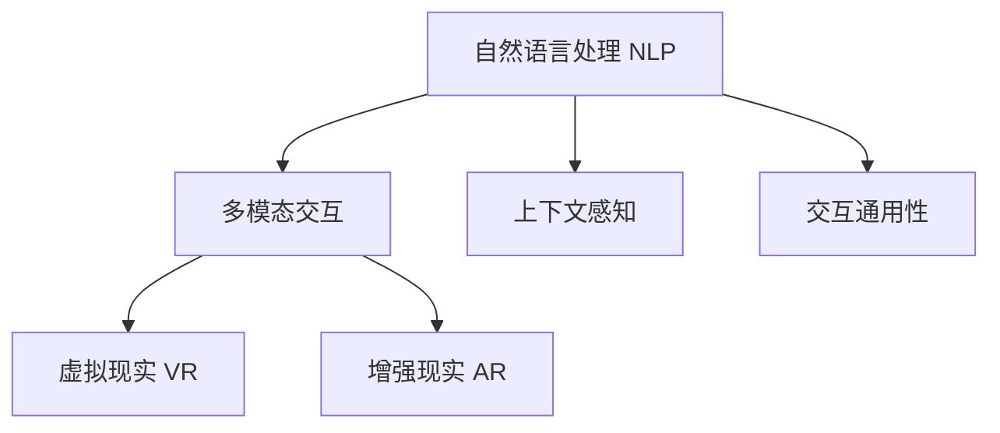

                 

## 1. 背景介绍

### 1.1 问题由来
随着计算技术的发展，人机交互的形态也经历了多次变革。从早期的命令驱动式（CLI）到图形用户界面（GUI），再到虚拟现实（VR）、增强现实（AR）、混合现实（MR），每一次变革都极大地提高了人与计算机之间的互动效率和用户体验。但这些技术尚未彻底解决交互的自然性和便捷性问题。如何构建高效便捷的人类计算平台，成为当前人机交互领域的一个重要研究热点。

### 1.2 问题核心关键点
- **自然语言交互**：使计算机能够理解和响应用户的自然语言指令，增强互动的自然性。
- **多模态融合**：整合视觉、听觉、触觉等多感官信息，构建更全面的交互体验。
- **上下文感知**：使系统能够理解和保留用户的历史交互行为，提供个性化服务。
- **交互通用性**：设计跨越不同领域、不同场景的通用交互框架，使系统具有更强的普适性。

### 1.3 问题研究意义
研究高效便捷的人机交互技术，对于提升计算平台的用户体验，促进计算技术的普及和应用，具有重要意义：

1. **提升用户体验**：改善交互的自然性和便捷性，使用户能够更高效、更愉悦地完成各种计算任务。
2. **促进计算普及**：降低计算技术的使用门槛，让更多人能够享受计算带来的便利。
3. **推动产业升级**：通过提升交互效率，加速各行各业的数字化转型。
4. **开拓技术前沿**：推动人机交互技术向更深层次和更广领域发展，形成新的技术优势和创新点。

## 2. 核心概念与联系

### 2.1 核心概念概述

为更好地理解高效便捷人机交互技术，本节将介绍几个关键概念及其联系：

- **自然语言处理（NLP）**：使计算机能够理解和生成自然语言，构建语言-语义映射，是人机交互的重要基础。
- **多模态交互**：整合视觉、听觉、触觉等多种感官信息，提供更加丰富和全面的交互体验。
- **上下文感知**：通过记录和分析用户的历史行为和上下文信息，提供个性化的交互服务。
- **交互通用性**：设计跨越不同领域和场景的交互框架，增强系统的适应性和可扩展性。
- **虚拟现实（VR）与增强现实（AR）**：通过虚拟环境和增强现实技术，提供沉浸式和互动式的人机交互体验。

这些概念之间的关系可以通过以下Mermaid流程图来展示：



这个流程图展示了你高效便捷人机交互技术的主要组成部分及其相互关系：

1. 自然语言处理是交互的基础，通过理解和生成自然语言，建立语言-语义映射。
2. 多模态交互通过整合多种感官信息，提供更全面和丰富的交互体验。
3. 上下文感知通过记录和分析用户行为，提供个性化的交互服务。
4. 交互通用性通过设计可扩展的交互框架，增强系统的适应性和可扩展性。
5. VR和AR技术通过提供沉浸式和互动式体验，进一步提升交互的自然性和便捷性。

## 3. 核心算法原理 & 具体操作步骤
### 3.1 算法原理概述

高效便捷的人机交互技术，其核心原理可以概括为以下几个方面：

1. **自然语言处理**：通过语义理解、句法分析、语义生成等技术，使计算机能够理解和生成自然语言。
2. **多模态融合**：通过视觉识别、声音识别、触觉感知等技术，整合多种感官信息，构建全面的交互体验。
3. **上下文感知**：通过记录用户的历史行为和上下文信息，理解用户意图，提供个性化服务。
4. **交互通用性**：设计通用的交互框架，使系统能够适应不同领域和场景。

这些技术可以分别用不同的方法实现，但在实际应用中，往往需要整合使用，才能构建高效便捷的交互系统。

### 3.2 算法步骤详解

高效便捷人机交互技术的具体实现，通常包括以下几个步骤：

**Step 1: 数据预处理**
- 收集用户交互数据，包括文本、语音、图像等。
- 对数据进行清洗和标注，构建训练数据集。
- 使用数据增强技术，如文本回译、语音噪声注入等，扩充数据集。

**Step 2: 构建交互模型**
- 选择合适的自然语言处理框架，如Hugging Face的Transformers库。
- 加载预训练模型，如BERT、GPT等，进行任务适配。
- 设计多模态融合模块，整合视觉、听觉、触觉等感官信息。
- 实现上下文感知模块，记录和分析用户历史行为和上下文信息。

**Step 3: 模型训练与优化**
- 在标注数据集上进行模型训练，最小化损失函数。
- 使用正则化技术，如L2正则、Dropout等，防止过拟合。
- 使用GPU或TPU等高性能设备，加速训练过程。
- 应用对抗训练技术，提高模型的鲁棒性。

**Step 4: 交互系统部署**
- 将训练好的模型部署到目标平台上，如移动设备、PC等。
- 集成用户界面，提供友好的人机交互界面。
- 实现实时交互功能，响应用户的即时需求。
- 提供多语言支持，支持不同语言和文化背景的用户。

**Step 5: 用户反馈与迭代改进**
- 收集用户反馈，评估交互系统的性能和用户体验。
- 根据用户反馈，不断迭代和优化交互模型。
- 引入AI算法，实现智能交互功能，如对话系统、推荐系统等。

### 3.3 算法优缺点

高效便捷人机交互技术具有以下优点：
1. **提升用户体验**：通过自然语言处理和多模态融合技术，提供更加自然和便捷的交互方式。
2. **跨领域适用**：通过上下文感知和交互通用性设计，使系统能够适应不同领域和场景。
3. **智能化程度高**：通过引入AI算法，实现智能交互功能，如对话系统、推荐系统等。

同时，该技术也存在一些局限性：
1. **依赖数据**：需要大量的标注数据进行模型训练，数据收集和标注成本较高。
2. **算法复杂**：涉及到自然语言处理、多模态融合、上下文感知等多个技术领域，算法实现复杂。
3. **性能要求高**：需要高性能计算设备和实时响应能力，硬件要求较高。
4. **安全性问题**：交互系统涉及用户隐私和数据安全，需要采取相应的安全措施。

尽管存在这些局限性，但高效便捷的人机交互技术在大数据、人工智能等技术的推动下，正逐步成为人机交互的主流范式。

### 3.4 算法应用领域

高效便捷人机交互技术已经在多个领域得到了广泛应用，包括：

- **智能家居**：通过语音助手和智能音箱，实现自然语言交互，控制家电和智能设备。
- **移动设备**：通过手势识别和面部识别，实现多模态交互，提高用户体验。
- **医疗健康**：通过语音输入和图像识别，记录和分析患者信息，提供个性化医疗服务。
- **教育培训**：通过自然语言处理和虚拟现实技术，提供互动式学习体验，提高教学效果。
- **企业办公**：通过智能会议系统和办公助手，提高办公效率，实现自动化办公。

## 4. 数学模型和公式 & 详细讲解
### 4.1 数学模型构建

为了更好地理解高效便捷人机交互技术，本节将使用数学语言对关键技术进行更详细的描述。

设用户交互数据为 $D=\{(x_i,y_i)\}_{i=1}^N$，其中 $x_i$ 为输入，$y_i$ 为输出。假设模型为 $M_{\theta}:\mathcal{X} \rightarrow \mathcal{Y}$，其中 $\theta$ 为模型参数。

定义模型在输入 $x_i$ 上的预测输出为 $M_{\theta}(x_i)$，损失函数为 $\ell(M_{\theta}(x_i),y_i)$。在数据集 $D$ 上的经验风险为：

$$
\mathcal{L}(\theta) = \frac{1}{N} \sum_{i=1}^N \ell(M_{\theta}(x_i),y_i)
$$

最小化损失函数 $\mathcal{L}(\theta)$，得到最优模型参数：

$$
\theta^* = \mathop{\arg\min}_{\theta} \mathcal{L}(\theta)
$$

在实际应用中，我们通常使用基于梯度的优化算法（如Adam、SGD等）来近似求解上述最优化问题。

### 4.2 公式推导过程

以下我们以自然语言处理为例，推导一个简单的交互模型。

设模型在输入 $x$ 上的预测输出为 $\hat{y}=M_{\theta}(x) \in [0,1]$，表示样本属于正类的概率。真实标签 $y \in \{0,1\}$。则二分类交叉熵损失函数定义为：

$$
\ell(M_{\theta}(x),y) = -[y\log \hat{y} + (1-y)\log (1-\hat{y})]
$$

将其代入经验风险公式，得：

$$
\mathcal{L}(\theta) = -\frac{1}{N}\sum_{i=1}^N [y_i\log M_{\theta}(x_i)+(1-y_i)\log(1-M_{\theta}(x_i))]
$$

根据链式法则，损失函数对参数 $\theta_k$ 的梯度为：

$$
\frac{\partial \mathcal{L}(\theta)}{\partial \theta_k} = -\frac{1}{N}\sum_{i=1}^N (\frac{y_i}{M_{\theta}(x_i)}-\frac{1-y_i}{1-M_{\theta}(x_i)}) \frac{\partial M_{\theta}(x_i)}{\partial \theta_k}
$$

其中 $\frac{\partial M_{\theta}(x_i)}{\partial \theta_k}$ 可进一步递归展开，利用自动微分技术完成计算。

在得到损失函数的梯度后，即可带入参数更新公式，完成模型的迭代优化。重复上述过程直至收敛，最终得到适应目标任务的模型参数 $\theta^*$。

## 5. 项目实践：代码实例和详细解释说明
### 5.1 开发环境搭建

在进行高效便捷人机交互技术实践前，我们需要准备好开发环境。以下是使用Python进行PyTorch开发的环境配置流程：

1. 安装Anaconda：从官网下载并安装Anaconda，用于创建独立的Python环境。

2. 创建并激活虚拟环境：
```bash
conda create -n pytorch-env python=3.8 
conda activate pytorch-env
```

3. 安装PyTorch：根据CUDA版本，从官网获取对应的安装命令。例如：
```bash
conda install pytorch torchvision torchaudio cudatoolkit=11.1 -c pytorch -c conda-forge
```

4. 安装各类工具包：
```bash
pip install numpy pandas scikit-learn matplotlib tqdm jupyter notebook ipython
```

完成上述步骤后，即可在`pytorch-env`环境中开始高效便捷人机交互技术的开发实践。

### 5.2 源代码详细实现

下面我以一个简单的自然语言交互系统为例，给出使用Transformers库进行交互模型训练的PyTorch代码实现。

首先，定义交互系统的数据处理函数：

```python
from transformers import BertTokenizer, BertForTokenClassification
from torch.utils.data import Dataset, DataLoader
import torch

class InteractionDataset(Dataset):
    def __init__(self, texts, labels, tokenizer):
        self.texts = texts
        self.labels = labels
        self.tokenizer = tokenizer
        
    def __len__(self):
        return len(self.texts)
    
    def __getitem__(self, item):
        text = self.texts[item]
        label = self.labels[item]
        
        encoding = self.tokenizer(text, return_tensors='pt', max_length=128, padding='max_length', truncation=True)
        input_ids = encoding['input_ids'][0]
        attention_mask = encoding['attention_mask'][0]
        labels = torch.tensor(label, dtype=torch.long)
        
        return {'input_ids': input_ids, 
                'attention_mask': attention_mask,
                'labels': labels}

tokenizer = BertTokenizer.from_pretrained('bert-base-cased')

train_dataset = InteractionDataset(train_texts, train_labels, tokenizer)
dev_dataset = InteractionDataset(dev_texts, dev_labels, tokenizer)
test_dataset = InteractionDataset(test_texts, test_labels, tokenizer)
```

然后，定义模型和优化器：

```python
from transformers import BertForTokenClassification, AdamW

model = BertForTokenClassification.from_pretrained('bert-base-cased', num_labels=2)

optimizer = AdamW(model.parameters(), lr=2e-5)
```

接着，定义训练和评估函数：

```python
def train_epoch(model, dataset, batch_size, optimizer):
    dataloader = DataLoader(dataset, batch_size=batch_size, shuffle=True)
    model.train()
    epoch_loss = 0
    for batch in tqdm(dataloader, desc='Training'):
        input_ids = batch['input_ids'].to(device)
        attention_mask = batch['attention_mask'].to(device)
        labels = batch['labels'].to(device)
        model.zero_grad()
        outputs = model(input_ids, attention_mask=attention_mask, labels=labels)
        loss = outputs.loss
        epoch_loss += loss.item()
        loss.backward()
        optimizer.step()
    return epoch_loss / len(dataloader)

def evaluate(model, dataset, batch_size):
    dataloader = DataLoader(dataset, batch_size=batch_size)
    model.eval()
    preds, labels = [], []
    with torch.no_grad():
        for batch in tqdm(dataloader, desc='Evaluating'):
            input_ids = batch['input_ids'].to(device)
            attention_mask = batch['attention_mask'].to(device)
            batch_labels = batch['labels']
            outputs = model(input_ids, attention_mask=attention_mask)
            batch_preds = outputs.logits.argmax(dim=2).to('cpu').tolist()
            batch_labels = batch_labels.to('cpu').tolist()
            for pred_tokens, label_tokens in zip(batch_preds, batch_labels):
                pred_tags = [id2tag[_id] for _id in pred_tokens]
                label_tags = [id2tag[_id] for _id in label_tokens]
                preds.append(pred_tags[:len(label_tokens)])
                labels.append(label_tags)
                
    print(classification_report(labels, preds))
```

最后，启动训练流程并在测试集上评估：

```python
epochs = 5
batch_size = 16

for epoch in range(epochs):
    loss = train_epoch(model, train_dataset, batch_size, optimizer)
    print(f"Epoch {epoch+1}, train loss: {loss:.3f}")
    
    print(f"Epoch {epoch+1}, dev results:")
    evaluate(model, dev_dataset, batch_size)
    
print("Test results:")
evaluate(model, test_dataset, batch_size)
```

以上就是使用PyTorch对BERT进行自然语言交互系统微调的完整代码实现。可以看到，得益于Transformers库的强大封装，我们可以用相对简洁的代码完成BERT模型的加载和交互系统微调。

### 5.3 代码解读与分析

让我们再详细解读一下关键代码的实现细节：

**InteractionDataset类**：
- `__init__`方法：初始化文本、标签、分词器等关键组件。
- `__len__`方法：返回数据集的样本数量。
- `__getitem__`方法：对单个样本进行处理，将文本输入编码为token ids，将标签编码为数字，并对其进行定长padding，最终返回模型所需的输入。

**tokenizer**：
- 定义了标签与数字id之间的映射，用于将token-wise的预测结果解码回真实的标签。

**训练和评估函数**：
- 使用PyTorch的DataLoader对数据集进行批次化加载，供模型训练和推理使用。
- 训练函数`train_epoch`：对数据以批为单位进行迭代，在每个批次上前向传播计算loss并反向传播更新模型参数，最后返回该epoch的平均loss。
- 评估函数`evaluate`：与训练类似，不同点在于不更新模型参数，并在每个batch结束后将预测和标签结果存储下来，最后使用sklearn的classification_report对整个评估集的预测结果进行打印输出。

**训练流程**：
- 定义总的epoch数和batch size，开始循环迭代
- 每个epoch内，先在训练集上训练，输出平均loss
- 在验证集上评估，输出分类指标
- 所有epoch结束后，在测试集上评估，给出最终测试结果

可以看到，PyTorch配合Transformers库使得BERT微调的代码实现变得简洁高效。开发者可以将更多精力放在数据处理、模型改进等高层逻辑上，而不必过多关注底层的实现细节。

当然，工业级的系统实现还需考虑更多因素，如模型的保存和部署、超参数的自动搜索、更灵活的任务适配层等。但核心的交互微调范式基本与此类似。

## 6. 实际应用场景
### 6.1 智能家居系统

高效便捷的人机交互技术在智能家居领域有着广泛的应用。通过语音助手和智能音箱，用户可以轻松地控制家电设备，实现语音交互。例如，用户可以通过语音指令打开电视、调节温度、查询天气等。

### 6.2 虚拟现实应用

虚拟现实（VR）技术结合高效便捷的人机交互技术，为用户提供沉浸式和互动式的交互体验。例如，在游戏和教育领域，用户可以通过头戴式设备进入虚拟环境，通过语音和手势与虚拟角色互动，进行游戏或学习。

### 6.3 智能办公系统

在企业办公场景中，高效便捷的人机交互技术可以大大提升办公效率。例如，智能会议系统可以通过语音输入和语音识别技术，帮助用户轻松记录会议内容、提醒会议议程等。智能办公助手可以通过自然语言处理技术，帮助用户完成日常事务，如日程安排、邮件处理等。

### 6.4 教育培训平台

在教育培训领域，高效便捷的人机交互技术可以提供互动式的学习体验。例如，智能学习系统可以通过语音输入和自然语言处理技术，帮助学生记录学习笔记、解答学习问题。虚拟现实技术还可以提供沉浸式学习环境，增强学习效果。

## 7. 工具和资源推荐
### 7.1 学习资源推荐

为了帮助开发者系统掌握高效便捷人机交互技术，这里推荐一些优质的学习资源：

1. 《自然语言处理入门》系列博文：由大模型技术专家撰写，系统介绍了自然语言处理的基本概念和核心算法。

2. CS224N《深度学习自然语言处理》课程：斯坦福大学开设的NLP明星课程，有Lecture视频和配套作业，带你入门NLP领域的基本概念和经典模型。

3. 《多模态人机交互》书籍：介绍多模态人机交互的基本原理和应用案例，涵盖视觉、听觉、触觉等多种感官信息的整合。

4. 《上下文感知交互设计》书籍：系统介绍上下文感知技术的设计和实现，包括上下文信息的记录、分析和应用。

5. Weights & Biases：模型训练的实验跟踪工具，可以记录和可视化模型训练过程中的各项指标，方便对比和调优。

6. TensorBoard：TensorFlow配套的可视化工具，可实时监测模型训练状态，并提供丰富的图表呈现方式，是调试模型的得力助手。

通过对这些资源的学习实践，相信你一定能够快速掌握高效便捷人机交互技术的精髓，并用于解决实际的交互问题。
###  7.2 开发工具推荐

高效的开发离不开优秀的工具支持。以下是几款用于高效便捷人机交互技术开发的常用工具：

1. PyTorch：基于Python的开源深度学习框架，灵活动态的计算图，适合快速迭代研究。大部分预训练语言模型都有PyTorch版本的实现。

2. TensorFlow：由Google主导开发的开源深度学习框架，生产部署方便，适合大规模工程应用。同样有丰富的预训练语言模型资源。

3. Transformers库：HuggingFace开发的NLP工具库，集成了众多SOTA语言模型，支持PyTorch和TensorFlow，是进行交互任务开发的利器。

4. Weights & Biases：模型训练的实验跟踪工具，可以记录和可视化模型训练过程中的各项指标，方便对比和调优。

5. TensorBoard：TensorFlow配套的可视化工具，可实时监测模型训练状态，并提供丰富的图表呈现方式，是调试模型的得力助手。

6. Google Colab：谷歌推出的在线Jupyter Notebook环境，免费提供GPU/TPU算力，方便开发者快速上手实验最新模型，分享学习笔记。

合理利用这些工具，可以显著提升高效便捷人机交互技术的开发效率，加快创新迭代的步伐。

### 7.3 相关论文推荐

高效便捷人机交互技术的发展源于学界的持续研究。以下是几篇奠基性的相关论文，推荐阅读：

1. Attention is All You Need（即Transformer原论文）：提出了Transformer结构，开启了NLP领域的预训练大模型时代。

2. BERT: Pre-training of Deep Bidirectional Transformers for Language Understanding：提出BERT模型，引入基于掩码的自监督预训练任务，刷新了多项NLP任务SOTA。

3. Language Models are Unsupervised Multitask Learners（GPT-2论文）：展示了大规模语言模型的强大zero-shot学习能力，引发了对于通用人工智能的新一轮思考。

4. Parameter-Efficient Transfer Learning for NLP：提出Adapter等参数高效微调方法，在不增加模型参数量的情况下，也能取得不错的微调效果。

5. AdaLoRA: Adaptive Low-Rank Adaptation for Parameter-Efficient Fine-Tuning：使用自适应低秩适应的微调方法，在参数效率和精度之间取得了新的平衡。

这些论文代表了大模型微调技术的发展脉络。通过学习这些前沿成果，可以帮助研究者把握学科前进方向，激发更多的创新灵感。

## 8. 总结：未来发展趋势与挑战

### 8.1 总结

本文对高效便捷的人机交互技术进行了全面系统的介绍。首先阐述了人机交互技术的背景和重要性，明确了交互技术在提升用户体验、推动计算普及、促进产业升级等方面的独特价值。其次，从原理到实践，详细讲解了高效便捷人机交互技术的数学模型和关键步骤，给出了交互系统开发的完整代码实例。同时，本文还广泛探讨了高效便捷人机交互技术在智能家居、虚拟现实、智能办公、教育培训等多个领域的应用前景，展示了技术的广泛适用性和强大潜力。此外，本文精选了交互技术的学习资源，力求为读者提供全方位的技术指引。

通过本文的系统梳理，可以看到，高效便捷的人机交互技术正在成为人机交互的主流范式，极大地提升了计算平台的用户体验，促进了计算技术的普及和应用。未来，伴随预训练语言模型和交互技术的持续演进，相信人机交互技术必将迎来新的发展高峰，深刻影响人类的生产生活方式。

### 8.2 未来发展趋势

展望未来，高效便捷人机交互技术将呈现以下几个发展趋势：

1. **自然语言处理技术的进步**：随着自然语言处理技术的不断发展，交互系统将能够更加自然和准确地理解用户的意图，提供更加流畅和精准的响应。

2. **多模态交互的普及**：通过视觉、听觉、触觉等多种感官信息的整合，交互系统将提供更加丰富和全面的交互体验。

3. **上下文感知的增强**：通过记录和分析用户的历史行为和上下文信息，交互系统将能够提供更加个性化的服务。

4. **交互通用性的提升**：设计跨越不同领域和场景的交互框架，使系统具有更强的适应性和可扩展性。

5. **智能交互的崛起**：引入AI算法，实现对话系统、推荐系统等智能交互功能，进一步提升系统的智能化程度。

6. **跨领域应用的多样化**：人机交互技术将广泛应用于医疗、教育、金融、智能家居等多个领域，带来深远的行业变革。

以上趋势凸显了高效便捷人机交互技术的广阔前景。这些方向的探索发展，必将进一步提升交互系统的性能和应用范围，为人类计算平台带来新的变革。

### 8.3 面临的挑战

尽管高效便捷人机交互技术已经取得了显著进展，但在迈向更加智能化、普适化应用的过程中，仍面临诸多挑战：

1. **数据依赖性**：交互系统需要大量的标注数据进行训练，数据收集和标注成本较高，且数据质量直接影响系统性能。

2. **算法复杂性**：交互系统涉及自然语言处理、多模态融合、上下文感知等多个技术领域，算法实现复杂，且不同技术之间需要深度整合。

3. **硬件要求高**：交互系统需要高性能计算设备和实时响应能力，硬件要求较高，且不同平台之间的适配性仍需改进。

4. **安全性问题**：交互系统涉及用户隐私和数据安全，需要采取相应的安全措施，防止数据泄露和滥用。

5. **鲁棒性不足**：交互系统面对新领域、新任务时，泛化性能往往大打折扣，需要进一步提高系统的鲁棒性和适应性。

6. **标准化问题**：目前人机交互技术尚未形成统一的标准和规范，不同平台和系统之间的互操作性有待提高。

尽管存在这些挑战，但随着技术的不断进步和应用场景的不断拓展，高效便捷的人机交互技术必将在未来取得更大的突破，成为人机交互的主流技术。

### 8.4 研究展望

面对高效便捷人机交互技术所面临的诸多挑战，未来的研究需要在以下几个方面寻求新的突破：

1. **跨领域应用的泛化**：通过引入跨领域知识的迁移学习，使交互系统能够更好地适应不同领域和场景。

2. **多模态交互的整合**：探索多种感官信息的深度融合，提供更加全面和丰富的交互体验。

3. **上下文感知的扩展**：设计更高效、更精确的上下文感知算法，提升系统的个性化服务能力。

4. **交互系统的标准化**：推动人机交互技术的标准化和规范化，提升不同系统之间的互操作性。

5. **隐私和安全保护**：引入隐私保护和数据安全技术，确保用户数据的安全性。

6. **鲁棒性增强**：研究鲁棒性优化算法，提升系统的泛化能力和适应性。

这些研究方向的探索，必将引领高效便捷人机交互技术的不断发展，推动人机交互技术迈向新的高度，为人类计算平台带来更广阔的发展空间。

## 9. 附录：常见问题与解答

**Q1：高效便捷人机交互技术是否适用于所有场景？**

A: 高效便捷的人机交互技术在大多数场景下都能取得不错的效果，特别是在涉及语音和文本的交互场景中。但对于一些需要高度精确控制的场景，如工业自动化、医疗手术等，交互系统的准确性和可靠性需要进一步提升。此外，对于一些需要即时响应的场景，如自动驾驶、实时监控等，交互系统的实时性和稳定性也需要重点考虑。

**Q2：高效便捷人机交互技术的主要挑战是什么？**

A: 高效便捷人机交互技术的主要挑战包括：

1. 数据依赖性：需要大量的标注数据进行模型训练，数据收集和标注成本较高。

2. 算法复杂性：涉及自然语言处理、多模态融合、上下文感知等多个技术领域，算法实现复杂。

3. 硬件要求高：需要高性能计算设备和实时响应能力，硬件要求较高。

4. 安全性问题：涉及用户隐私和数据安全，需要采取相应的安全措施。

5. 鲁棒性不足：交互系统面对新领域、新任务时，泛化性能往往大打折扣。

6. 标准化问题：目前人机交互技术尚未形成统一的标准和规范，不同平台和系统之间的互操作性有待提高。

尽管存在这些挑战，但随着技术的不断进步和应用场景的不断拓展，高效便捷的人机交互技术必将在未来取得更大的突破。

**Q3：如何提高高效便捷人机交互系统的安全性？**

A: 提高高效便捷人机交互系统的安全性，可以从以下几个方面入手：

1. 数据隐私保护：采用差分隐私、联邦学习等技术，保护用户隐私数据。

2. 安全机制设计：引入身份认证、权限控制等机制，防止未授权访问和恶意攻击。

3. 安全协议设计：使用SSL/TLS等安全协议，保障数据传输的安全性。

4. 异常检测与响应：设计异常检测和响应机制，及时发现和处理异常情况。

5. 用户教育与培训：对用户进行安全意识教育，提高用户的安全防范能力。

通过以上措施，可以有效提升高效便捷人机交互系统的安全性，保障用户数据的安全性。

**Q4：高效便捷人机交互技术在未来的应用前景如何？**

A: 高效便捷的人机交互技术在未来的应用前景非常广阔，涵盖以下几个方面：

1. 智能家居：通过语音助手和智能音箱，实现语音交互，提升家居设备的智能化水平。

2. 虚拟现实：结合VR技术，提供沉浸式和互动式的交互体验，应用于游戏、教育、培训等领域。

3. 智能办公：通过智能会议系统和办公助手，提高办公效率，实现自动化办公。

4. 医疗健康：通过语音输入和图像识别，记录和分析患者信息，提供个性化医疗服务。

5. 教育培训：通过自然语言处理和虚拟现实技术，提供互动式学习体验，提高教学效果。

6. 工业自动化：结合机器人和虚拟助手，实现人机协同工作，提升生产效率和安全性。

未来，随着技术的不断进步和应用场景的不断拓展，高效便捷的人机交互技术必将在更多领域得到应用，为人类计算平台带来新的变革。

---

作者：禅与计算机程序设计艺术 / Zen and the Art of Computer Programming

