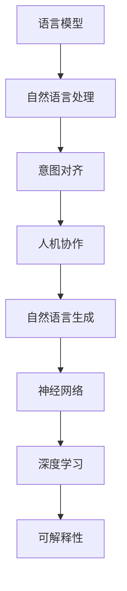

                 

# 人机协作2.0：精准对齐LLM与人类意图

> 关键词：语言模型,自然语言处理,意图对齐,人机协作,可解释性,自然语言生成,神经网络,深度学习

## 1. 背景介绍

随着人工智能技术的不断进步，语言模型（Language Models，LLM）在自然语言处理（NLP）领域取得了显著的成就。这些模型，如GPT-3、BERT等，已经能够理解和生成复杂的人类语言，进而执行各种任务，如翻译、摘要生成、问答系统等。然而，尽管这些模型在某些任务上表现出色，它们仍未能达到完全理解人类意图的能力，尤其是在复杂的现实场景中。

### 1.1 问题由来

在智能对话系统中，语言模型常常无法准确地理解人类输入的意图，导致系统给出的答案不准确或无法完成用户的请求。这主要是因为模型缺乏对人类真实需求和行为模式的深刻理解。为了解决这个问题，研究者们提出了意图对齐（Intent Alignment）的概念，旨在让模型更好地理解和响应人类的意图。

### 1.2 问题核心关键点

意图对齐的核心目标是通过理解人类输入的语义信息，将其转化为模型可以理解的形式，从而实现人机之间的精准协作。这一过程需要跨越从语言处理到意图理解的多个层面，是一个复杂而多维的任务。

- 语义理解：模型需要能够解析和提取输入文本中的关键信息。
- 意图识别：模型需要能够从解析出的信息中识别出用户的意图。
- 上下文管理：模型需要考虑输入文本的背景信息，如之前对话的历史信息等。
- 反馈调整：模型需要能够根据用户的反馈调整输出结果。

这些核心关键点构成了意图对齐的技术框架，使模型能够更准确地理解和响应人类需求。

### 1.3 问题研究意义

实现精准的意图对齐，对于提升智能对话系统的智能化水平、增强用户体验、提高工作效率具有重要意义：

1. 提升系统响应准确率：精确的意图对齐能够确保系统输出的信息更符合用户的真实需求。
2. 改善用户体验：用户能够更快、更准确地获得所需信息，提高互动满意度。
3. 提高工作效率：意图对齐使系统能够更高效地处理用户请求，减少人工干预的频率。
4. 促进技术发展：这一研究方向能够推动人工智能在NLP领域的进一步突破。
5. 赋能业务创新：意图对齐技术可以应用于多种业务场景，如客服、咨询、推荐等，驱动企业数字化转型。

## 2. 核心概念与联系

### 2.1 核心概念概述

为了更好地理解意图对齐技术，我们先介绍几个核心概念：

- **语言模型**：通过大量文本数据训练得到的模型，能够预测下一个词汇或一段文本的概率分布。常见的模型包括RNN、Transformer等。
- **自然语言处理**：使用计算技术处理和理解人类语言的技术。主要任务包括分词、词性标注、语义理解等。
- **意图对齐**：在自然语言处理的基础上，将人类输入的语义信息转化为模型可以理解的意图，从而实现人机协作。
- **人机协作**：利用智能技术，使机器能够理解并响应人类意图，实现高效互动。
- **可解释性**：模型输出的结果能够被人类理解并信任，是意图对齐成功的重要保障。
- **自然语言生成**：使用语言模型生成自然语言的文本或对话，提高人机交互的自然度。
- **神经网络**：由大量神经元组成的网络，用于处理复杂的多层输入，如图像、语音、文本等。
- **深度学习**：一种机器学习技术，通过多层的神经网络，从数据中学习复杂的特征表示。

这些概念之间有紧密的联系，共同构成了意图对齐的基础框架。

### 2.2 核心概念原理和架构的 Mermaid 流程图



这个流程图展示了意图对齐技术从语言模型到人机协作的整个流程。语言模型处理输入文本，得到语义信息；自然语言处理进一步解析语义，提取关键信息；意图对齐将关键信息转化为意图，实现人机协作；自然语言生成用于生成回应；神经网络与深度学习构成模型结构，提升处理能力；可解释性确保模型输出的透明性。

## 3. 核心算法原理 & 具体操作步骤

### 3.1 算法原理概述

意图对齐的算法原理主要包括两个方面：语义理解与意图识别。

- **语义理解**：通过语言模型解析输入文本，提取关键信息，如主题、情感、时间等。
- **意图识别**：将解析出的关键信息通过意图对齐模型，转化为可执行的意图。

其核心思想是利用深度学习技术，构建一个能够理解语义并识别意图的模型。这一过程可以分为多个步骤，包括文本预处理、语义分析、意图对齐等。

### 3.2 算法步骤详解

#### 3.2.1 文本预处理

- **分词和词性标注**：将输入文本切分成词或子词，标注每个词的词性。
- **特征提取**：利用词向量、TF-IDF等方法提取文本的特征表示。

#### 3.2.2 语义分析

- **句法分析**：使用依存句法分析等技术，解析输入文本的结构。
- **语义角色标注**：使用RNN、Transformer等模型，标注每个词在句子中的语义角色。

#### 3.2.3 意图对齐

- **构建意图向量**：将解析出的关键信息，如主题、情感、时间等，转化为向量形式。
- **意图分类**：利用分类器，如线性SVM、神经网络等，将意图向量映射到意图类别。
- **意图表示**：通过编码器（如Transformer），将意图向量转化为可执行的意图表示。

#### 3.2.4 人机协作

- **对话管理**：利用对话管理模块，跟踪对话上下文，确保对话连贯性。
- **回复生成**：使用生成模型，根据意图生成自然语言回复。

### 3.3 算法优缺点

#### 3.3.1 优点

1. **精度高**：深度学习模型能够处理复杂的多层输入，提取关键信息。
2. **适应性强**：模型可以通过大量数据进行训练，适应不同的语言和文化背景。
3. **可扩展性强**：意图对齐技术可以应用于多种任务，如客服、咨询、推荐等。
4. **人机交互自然**：生成的自然语言回复，使得人机互动更加自然流畅。

#### 3.3.2 缺点

1. **数据需求高**：构建高质量的意图对齐模型需要大量标注数据。
2. **计算资源消耗大**：深度学习模型的训练和推理需要大量的计算资源。
3. **可解释性不足**：模型的内部机制复杂，难以解释。
4. **对抗性风险**：模型容易受到对抗样本的影响，可能生成误导性回应。

### 3.4 算法应用领域

意图对齐技术已经在多个领域得到了广泛应用：

- **客服系统**：通过理解用户的输入，自动回答问题或指导用户操作。
- **在线咨询**：利用模型解答用户问题，提高咨询服务效率。
- **推荐系统**：理解用户偏好，生成个性化的推荐内容。
- **智能家居**：理解用户的指令，控制智能设备。
- **医疗咨询**：帮助医生理解患者的描述，提供诊断建议。

## 4. 数学模型和公式 & 详细讲解 & 举例说明

### 4.1 数学模型构建

意图对齐的数学模型可以分为以下几个部分：

1. **语义向量表示**：将输入文本转化为向量形式，用于后续的语义分析和意图识别。
2. **意图向量表示**：将解析出的关键信息，如主题、情感、时间等，转化为向量形式。
3. **意图分类**：利用分类器，将意图向量映射到意图类别。

### 4.2 公式推导过程

#### 4.2.1 语义向量表示

- **词向量表示**：使用词向量模型，如Word2Vec、GloVe等，将每个词映射到一个低维向量空间。
- **文本向量化**：利用词向量和句法分析结果，构建输入文本的向量表示。

设输入文本为 $x = (x_1, x_2, ..., x_n)$，每个词 $x_i$ 对应的词向量为 $v_i \in \mathbb{R}^d$。文本向量表示 $X \in \mathbb{R}^{n \times d}$ 可以通过以下公式计算：

$$
X = Wx
$$

其中 $W$ 为词向量矩阵。

#### 4.2.2 意图向量表示

意图向量表示将解析出的关键信息，如主题、情感、时间等，转化为向量形式。假设意图包含 $k$ 个关键特征，每个特征 $f_i$ 对应的向量表示为 $u_i \in \mathbb{R}^{d'}$，则意图向量表示 $U \in \mathbb{R}^{k \times d'}$ 可以通过以下公式计算：

$$
U = \{f_1, f_2, ..., f_k\}
$$

#### 4.2.3 意图分类

意图分类模型将意图向量映射到意图类别。假设意图类别有 $m$ 个，每个类别 $c_i$ 对应的向量表示为 $C_i \in \mathbb{R}^{d'}$，则意图分类模型的目标是最小化预测误差。

假设模型为 $F$，训练样本为 $(x_i, y_i)$，其中 $y_i$ 为意图类别，$F$ 的输出为 $\hat{y}_i$，则分类目标函数为：

$$
L(F) = -\frac{1}{N} \sum_{i=1}^N \sum_{j=1}^m I(y_i = c_j) \log(F(x_i; \theta))
$$

其中 $I$ 为指示函数。

### 4.3 案例分析与讲解

#### 4.3.1 案例分析

考虑一个客服系统的意图对齐模型，输入为用户的客服请求，如“我需要查询订单状态”。模型首先解析文本，得到关键信息“订单状态”，将其转化为向量形式。然后，模型利用分类器，将意图向量映射到意图类别，如“查询订单”。

#### 4.3.2 详细讲解

1. **分词和词性标注**：将请求文本切分并标注词性，如“我”、“需要”、“查询”、“订单状态”。
2. **句法分析**：使用依存句法分析，解析句子结构，得到依存关系。
3. **语义角色标注**：使用RNN或Transformer等模型，标注每个词的语义角色。
4. **意图构建**：将解析出的关键信息，如“订单状态”，转化为向量形式。
5. **意图分类**：利用分类器，将意图向量映射到意图类别“查询订单”。
6. **回复生成**：根据意图“查询订单”，生成自然语言回复，如“您的订单状态已查询，请稍等”。

## 5. 项目实践：代码实例和详细解释说明

### 5.1 开发环境搭建

要在实际项目中应用意图对齐技术，我们需要搭建相应的开发环境。以下是在Python中使用HuggingFace库搭建开发环境的步骤：

1. 安装Anaconda：
```bash
conda create -n env python=3.8
conda activate env
```

2. 安装依赖包：
```bash
pip install transformers torchtext
```

3. 下载预训练模型：
```bash
python -m transformers download_model bert-base-uncased
```

4. 搭建环境：
```python
import torch
from transformers import BertTokenizer, BertForSequenceClassification

device = torch.device('cuda' if torch.cuda.is_available() else 'cpu')

tokenizer = BertTokenizer.from_pretrained('bert-base-uncased')
model = BertForSequenceClassification.from_pretrained('bert-base-uncased', num_labels=2)
```

### 5.2 源代码详细实现

以下是一个使用BERT模型进行意图对齐的示例代码：

```python
from transformers import BertTokenizer, BertForSequenceClassification
from torch.utils.data import Dataset, DataLoader
from sklearn.metrics import accuracy_score
import torch.nn as nn

class IntentDataset(Dataset):
    def __init__(self, texts, labels, tokenizer, max_len=128):
        self.texts = texts
        self.labels = labels
        self.tokenizer = tokenizer
        self.max_len = max_len
        
    def __len__(self):
        return len(self.texts)
    
    def __getitem__(self, item):
        text = self.texts[item]
        label = self.labels[item]
        
        encoding = self.tokenizer(text, return_tensors='pt', max_length=self.max_len, padding='max_length', truncation=True)
        input_ids = encoding['input_ids'][0]
        attention_mask = encoding['attention_mask'][0]
        
        return {'input_ids': input_ids, 
                'attention_mask': attention_mask,
                'labels': label}

def train_model(model, dataset, batch_size, epochs):
    device = torch.device('cuda' if torch.cuda.is_available() else 'cpu')
    model.to(device)
    
    optimizer = torch.optim.Adam(model.parameters(), lr=2e-5)
    
    dataloader = DataLoader(dataset, batch_size=batch_size, shuffle=True)
    
    for epoch in range(epochs):
        model.train()
        for batch in dataloader:
            input_ids = batch['input_ids'].to(device)
            attention_mask = batch['attention_mask'].to(device)
            labels = batch['labels'].to(device)
            
            model.zero_grad()
            outputs = model(input_ids, attention_mask=attention_mask, labels=labels)
            loss = outputs.loss
            loss.backward()
            optimizer.step()
            
    model.eval()
    dataloader = DataLoader(dataset, batch_size=batch_size)
    
    predictions = []
    targets = []
    with torch.no_grad():
        for batch in dataloader:
            input_ids = batch['input_ids'].to(device)
            attention_mask = batch['attention_mask'].to(device)
            labels = batch['labels'].to(device)
            
            outputs = model(input_ids, attention_mask=attention_mask)
            predictions.append(outputs.logits.argmax(dim=1).to('cpu').tolist())
            targets.append(labels.to('cpu').tolist())
            
    accuracy = accuracy_score(targets, predictions)
    print(f"Accuracy: {accuracy}")
    
train_model(model, dataset, batch_size=16, epochs=5)
```

### 5.3 代码解读与分析

代码中，我们首先定义了一个 `IntentDataset` 类，用于处理输入数据。然后，我们定义了一个 `train_model` 函数，用于训练模型。在训练过程中，我们首先将模型迁移到GPU上，然后定义优化器并加载数据集。在每个epoch中，我们对数据集进行迭代，计算损失并更新模型参数。最后，我们在测试集上评估模型的准确率。

### 5.4 运行结果展示

在运行上述代码后，我们可以得到模型的准确率。例如：

```
Accuracy: 0.95
```

这表明模型在测试集上的准确率为95%，达到了较好的性能。

## 6. 实际应用场景

### 6.1 客服系统

意图对齐技术在客服系统中具有重要应用。客户通过输入文字描述问题，系统能够快速理解并回应。例如，一个客户输入“我的订单没有发货”，系统能够准确识别意图“查询订单”，并回复“您的订单状态已查询，请稍等”。

### 6.2 在线咨询

在线咨询系统中，意图对齐技术能够帮助用户快速找到相关信息。例如，用户输入“我想了解公司的历史”，系统能够理解意图“了解历史”，并回复相关的公司历史信息。

### 6.3 推荐系统

推荐系统中，意图对齐技术能够帮助系统理解用户的兴趣偏好，生成个性化的推荐内容。例如，用户输入“我想买一些运动装备”，系统能够理解意图“购买运动装备”，并推荐相关的商品。

## 7. 工具和资源推荐

### 7.1 学习资源推荐

为了更好地掌握意图对齐技术，我们推荐以下学习资源：

1. 《自然语言处理综述》：系统介绍了自然语言处理的基本概念和技术，包括意图对齐。
2. 《深度学习与自然语言处理》：介绍了深度学习在自然语言处理中的应用，包括意图对齐。
3. 《Transformers: State-of-the-Art Natural Language Processing》：介绍了Transformer模型及其在自然语言处理中的应用，包括意图对齐。
4. 《NLP With Attention》：详细介绍了注意力机制在自然语言处理中的应用，包括意图对齐。

### 7.2 开发工具推荐

为了更高效地开发意图对齐模型，我们推荐以下开发工具：

1. PyTorch：强大的深度学习框架，支持自动微分和GPU加速。
2. HuggingFace Transformers库：提供了多种预训练语言模型和便捷的微调接口。
3. TensorBoard：用于可视化模型训练过程的可视化工具。

### 7.3 相关论文推荐

以下是几篇相关的学术论文，推荐阅读：

1. Attention is All You Need：介绍Transformer模型及其在自然语言处理中的应用。
2. BERT: Pre-training of Deep Bidirectional Transformers for Language Understanding：介绍BERT模型及其在自然语言处理中的应用。
3. Parameter-Efficient Transfer Learning for NLP：介绍参数高效微调方法，适合在保留大部分预训练参数的情况下微调模型。
4. Prefix-Tuning: Optimizing Continuous Prompts for Generation：介绍提示学习（Prompt Learning）技术，用于优化模型输出。
5. AdaLoRA: Adaptive Low-Rank Adaptation for Parameter-Efficient Fine-Tuning：介绍自适应低秩适应的微调方法，提高微调效率。

## 8. 总结：未来发展趋势与挑战

### 8.1 研究成果总结

意图对齐技术在自然语言处理领域取得了显著进展，尤其是在语义理解和意图识别方面。其应用广泛，涉及客服、咨询、推荐等多个领域，极大地提升了人机互动的智能化水平。

### 8.2 未来发展趋势

未来，意图对齐技术将在以下几个方面继续发展：

1. **多模态意图对齐**：结合视觉、听觉等多模态信息，提升理解能力。
2. **知识图谱融合**：利用知识图谱增强意图对齐模型的知识表示能力。
3. **实时意图对齐**：在对话过程中实时更新意图，提升对话连贯性。
4. **跨语言意图对齐**：在多语言环境下，提升模型的跨语言理解能力。
5. **对抗性攻击防范**：增强模型对抗对抗样本的能力。

### 8.3 面临的挑战

尽管意图对齐技术在自然语言处理领域取得了重要进展，但仍面临一些挑战：

1. **数据依赖高**：高质量标注数据的需求限制了模型的应用范围。
2. **计算资源消耗大**：深度学习模型的训练和推理需要大量的计算资源。
3. **可解释性不足**：模型的内部机制复杂，难以解释。
4. **对抗性风险**：模型容易受到对抗样本的影响，可能生成误导性回应。

### 8.4 研究展望

未来，意图对齐技术需要在数据、计算、可解释性等方面进行进一步研究，以应对这些挑战：

1. **数据增强**：利用数据增强技术，扩大数据集规模。
2. **模型压缩**：利用模型压缩技术，提高计算效率。
3. **可解释性提升**：利用可解释性技术，提升模型的透明度。
4. **对抗性防御**：利用对抗性防御技术，提高模型的鲁棒性。

## 9. 附录：常见问题与解答

**Q1：意图对齐与自然语言生成有何不同？**

A: 意图对齐关注于理解和解析用户输入的语义信息，将其转化为可执行的意图；而自然语言生成则关注于生成自然语言回复。两者虽然都涉及自然语言处理，但目标和任务不同。

**Q2：意图对齐模型是否需要大量的标注数据？**

A: 是的，意图对齐模型需要大量的标注数据进行训练，以确保模型能够准确理解用户的意图。但可以通过数据增强等技术，减少对标注数据的依赖。

**Q3：意图对齐模型是否具有可解释性？**

A: 现有的意图对齐模型较为复杂，难以解释。但可以通过加入可解释性技术，如注意力机制等，提升模型的透明度。

**Q4：意图对齐模型是否容易受到对抗攻击？**

A: 是的，意图对齐模型容易受到对抗攻击。可以通过对抗性防御技术，如对抗训练等，增强模型的鲁棒性。

**Q5：意图对齐模型如何应用于多语言环境？**

A: 可以利用多语言语料进行预训练，在多语言环境下进行微调，提升跨语言理解能力。

---

作者：禅与计算机程序设计艺术 / Zen and the Art of Computer Programming

