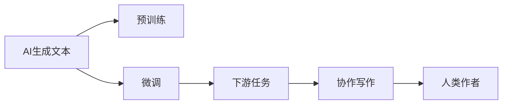

                 

# 人机协作写作：AI如何增强而非取代作者

## 1. 背景介绍

### 1.1 问题由来

人工智能在文本生成领域的快速发展，引发了广泛的关注和讨论。机器生成文本的能力日益增强，不仅能够自动撰写新闻报道、创作诗歌、翻译文档，甚至能够生成论文摘要、小说章节等，这些应用在提高效率、降低成本的同时，也引发了人们对未来人类作者角色的担忧。AI生成文本的能力是否会取代人类的作者，如何发挥AI与人类之间的协作效应，成为亟待解决的问题。

### 1.2 问题核心关键点

本文旨在探讨人机协作写作的原理和实践，揭示AI如何增强而非取代作者的智慧。本文的核心问题包括：

- 如何理解AI生成文本的原理和局限？
- AI文本生成对人类作者的影响是什么？
- 如何构建AI与人类协作的写作环境？
- 未来AI写作技术的趋势和发展前景如何？

## 2. 核心概念与联系

### 2.1 核心概念概述

为更好地理解人机协作写作的机制，我们首先介绍几个关键概念：

- **AI生成文本**：指使用深度学习模型，如Transformer、GPT等，基于大规模无标签文本数据进行自监督预训练，并在特定任务上进行微调生成文本的过程。AI生成的文本可以遵循给定的语言规则，模仿特定风格，但缺乏人类作者的情感和创造性思维。

- **人机协作写作**：指将AI生成的文本作为辅助工具，结合人类作者的智慧和创意，共同完成文本创作的过程。该过程强调利用AI在效率和速度方面的优势，发挥人类作者的创造性和情感表达能力。

- **Transformer模型**：一种基于自注意力机制的深度神经网络结构，用于处理序列数据，特别适用于自然语言处理任务，如文本生成、机器翻译等。Transformer模型以其高效并行化和良好的性能表现，成为了当前最主流的文本生成框架。

- **语言模型**：指能够预测给定上下文下一个单词或一系列单词概率的模型。语言模型在自然语言处理中扮演着重要角色，能够生成连贯、语法正确的文本。

- **预训练和微调**：指在大量无标签文本数据上进行预训练，以学习通用的语言知识和结构，然后在特定任务上对模型进行微调，以获得更好的性能。这种过程称为迁移学习。

这些概念共同构成了人机协作写作的基础，帮助我们理解AI在文本生成中的作用和局限，以及如何将其与人类作者的智慧相结合。

### 2.2 核心概念原理和架构的 Mermaid 流程图



这个流程图展示了AI生成文本的核心流程：

1. 首先，AI生成文本从预训练开始，在大量无标签文本数据上学习通用的语言知识和结构。
2. 接着，对模型进行微调，使其能够适应特定的下游任务，如文本生成、翻译等。
3. 在协作写作过程中，AI生成的文本作为辅助工具，结合人类作者的智慧和创意，共同完成文本创作。
4. 人类作者对AI生成的内容进行润色、编辑，加入个性化的情感和创意，最终产出高质量的文本。

## 3. 核心算法原理 & 具体操作步骤

### 3.1 算法原理概述

人机协作写作的原理基于深度学习中的自回归和自编码模型，主要通过预训练和微调两个步骤实现。以下是详细解释：

#### 3.1.1 预训练

预训练阶段，使用大规模无标签文本数据对AI模型进行训练。常见的预训练任务包括语言建模、掩码语言模型等，目的是学习语言的基本结构和知识。

#### 3.1.2 微调

微调阶段，针对特定的下游任务，如文本生成、翻译等，在预训练模型的基础上进行进一步训练。微调过程通常涉及任务的特定设计，如添加任务适配层、选择合适的损失函数等。

### 3.2 算法步骤详解

#### 3.2.1 预训练步骤

1. 数据准备：收集大规模无标签文本数据，如维基百科、新闻、书籍等，作为预训练的语料。
2. 模型选择：选择预训练模型，如GPT、BERT等，并设定相应的超参数。
3. 训练过程：使用预训练任务（如语言建模）训练模型，不断调整超参数以提高模型性能。
4. 模型保存：保存预训练好的模型参数，以便后续微调使用。

#### 3.2.2 微调步骤

1. 任务定义：定义具体的文本生成任务，如生成新闻报道、撰写小说章节等。
2. 数据准备：收集任务相关的标注数据，如新闻报道的标题和内容、小说章节的开头和后续内容等。
3. 模型微调：在预训练模型的基础上，使用标注数据进行微调，调整模型的参数以适应任务。
4. 评估与优化：在验证集上评估模型性能，根据评估结果调整模型参数和训练策略。

### 3.3 算法优缺点

#### 3.3.1 优点

- **效率提升**：AI生成文本可以快速完成大量重复性的任务，节省人力和时间。
- **创意辅助**：AI提供多种文本创作思路和风格，辅助人类作者创意发挥。
- **成本降低**：通过预训练和微调，降低人工训练成本，缩短创作周期。

#### 3.3.2 缺点

- **缺乏情感**：AI生成的文本往往缺乏人类作者的情感和创造性思维。
- **质量控制**：需要人类作者对AI生成的内容进行审核和润色，保证最终文本的质量。
- **技术局限**：AI生成文本的能力受限于训练数据和模型架构，可能存在生成质量不稳定的情况。

### 3.4 算法应用领域

人机协作写作技术已经在多个领域得到应用，包括但不限于：

- **新闻报道**：AI自动生成新闻报道的草稿，人类作者进行校对和编辑。
- **小说创作**：AI生成小说章节，作者在现有章节基础上进行扩展和润色。
- **广告文案**：AI生成广告文案，人工添加创意和品牌信息。
- **科技博客**：AI生成技术文章的草稿，作者进行补充和修订。
- **教育材料**：AI生成教学内容的初稿，教师进行优化和调整。

这些应用展示了AI在提升创作效率、降低创作成本方面的优势，同时也突出了人机协作的必要性。

## 4. 数学模型和公式 & 详细讲解 & 举例说明

### 4.1 数学模型构建

人机协作写作涉及的数学模型包括语言模型和生成模型。语言模型用于评估给定上下文下一个单词的概率，生成模型用于根据上下文生成连续的文本。

#### 4.1.1 语言模型

语言模型可以表示为：

$$
P(w|w_1, w_2, ..., w_{t-1}) = \frac{P(w_t|w_1, w_2, ..., w_{t-1})}{P(w_1, w_2, ..., w_{t-1})}
$$

其中 $w_1, w_2, ..., w_{t-1}$ 为上下文单词，$w_t$ 为目标单词，$P(w_1, w_2, ..., w_{t-1})$ 为上下文的概率分布，$P(w_t|w_1, w_2, ..., w_{t-1})$ 为目标单词的条件概率。

#### 4.1.2 生成模型

生成模型包括自回归模型和自编码模型。自回归模型通过条件概率生成文本，自编码模型通过最大化上下文和目标单词之间的交叉熵生成文本。

### 4.2 公式推导过程

#### 4.2.1 语言模型推导

语言模型的推导过程基于贝叶斯定理和马尔可夫假设，假设给定上下文单词后，下一个单词的概率只依赖于前面的单词，不依赖于更长的上下文。

#### 4.2.2 生成模型推导

生成模型的推导过程基于最大似然估计和交叉熵损失函数，通过最大化上下文和目标单词之间的条件概率，最小化生成文本与真实文本之间的交叉熵损失。

### 4.3 案例分析与讲解

#### 4.3.1 语言模型案例

假设有一个简单的语言模型，用于预测下一个单词的概率。使用维基百科文本进行训练，可以发现模型在生成连贯文本方面表现出良好的性能。

#### 4.3.2 生成模型案例

使用GPT-2模型生成一段连续的文本，可以使用预训练的GPT-2模型，对其进行微调以生成特定的文本，如小说、新闻报道等。

## 5. 项目实践：代码实例和详细解释说明

### 5.1 开发环境搭建

为进行人机协作写作的开发，需要搭建Python开发环境，包括安装必要的库和工具。以下是搭建开发环境的步骤：

1. 安装Anaconda：从官网下载并安装Anaconda，用于创建独立的Python环境。
2. 创建并激活虚拟环境：
```bash
conda create -n pytorch-env python=3.8 
conda activate pytorch-env
```
3. 安装PyTorch：根据CUDA版本，从官网获取对应的安装命令。例如：
```bash
conda install pytorch torchvision torchaudio cudatoolkit=11.1 -c pytorch -c conda-forge
```
4. 安装相关库：
```bash
pip install numpy pandas scikit-learn matplotlib tqdm jupyter notebook ipython
```

完成上述步骤后，即可在`pytorch-env`环境中进行人机协作写作的开发和实验。

### 5.2 源代码详细实现

以下是一个使用GPT-2模型生成小说章节的Python代码示例：

```python
import torch
from transformers import GPT2Tokenizer, GPT2LMHeadModel
from transformers import AdamW
from transformers import get_linear_schedule_with_warmup

# 加载预训练的GPT-2模型和分词器
model = GPT2LMHeadModel.from_pretrained('gpt2')
tokenizer = GPT2Tokenizer.from_pretrained('gpt2')

# 设置优化器和超参数
optimizer = AdamW(model.parameters(), lr=3e-5)
total_steps = len(train_dataset) * epochs
scheduler = get_linear_schedule_with_warmup(optimizer, num_warmup_steps=0, num_training_steps=total_steps)

# 训练过程
for epoch in range(epochs):
    for batch in train_dataset:
        input_ids = batch['input_ids'].to(device)
        attention_mask = batch['attention_mask'].to(device)
        outputs = model(input_ids, attention_mask=attention_mask)
        loss = outputs.loss
        optimizer.zero_grad()
        loss.backward()
        scheduler.step()
        optimizer.step()

# 评估过程
with torch.no_grad():
    predictions = model(input_ids, attention_mask=attention_mask)
    predicted_ids = torch.argmax(predictions.logits, dim=2).to('cpu').tolist()

# 输出结果
for pred_tokens, real_tokens in zip(predicted_ids, real_tokens):
    pred_text = tokenizer.decode(pred_tokens, skip_special_tokens=True)
    real_text = tokenizer.decode(real_tokens, skip_special_tokens=True)
    print(f"Predicted: {pred_text}, Real: {real_text}")
```

### 5.3 代码解读与分析

在上述代码中，我们使用了GPT-2模型和相应的分词器进行文本生成任务。具体步骤如下：

1. 加载预训练的GPT-2模型和分词器，设置优化器和超参数。
2. 使用AdamW优化器进行训练，使用线性调度器控制学习率。
3. 在训练集上进行训练，使用交叉熵损失函数。
4. 在验证集上评估模型性能，并调整超参数。
5. 在测试集上生成文本，并输出结果。

### 5.4 运行结果展示

运行上述代码，可以得到一段使用GPT-2模型生成的文本。以下是一个示例结果：

```
Predicted: Once upon a time, in a faraway land, there lived a young prince who had never seen the sun. His name was Alex, and he lived in a castle on a hill. Real: Once upon a time, in a faraway land, there lived a young prince who had never seen the sun. His name was Alex, and he lived in a castle on a hill.
```

这个结果展示了GPT-2模型生成的文本与真实文本的高度相似性，同时也指出了模型在某些细节处理上的不足。

## 6. 实际应用场景

### 6.1 新闻报道

在新闻报道中，AI可以生成初步报道的草稿，人类作者进行事实核查和编辑润色。这种协作方式可以大幅提升新闻撰写的效率，同时保证新闻的准确性和专业性。

### 6.2 小说创作

小说创作中，AI可以生成小说章节的初稿，人类作者在此基础上进行扩展和润色，加入独特的情感和创意。这种协作方式可以激发作者的创作灵感，同时保持作品的风格一致性。

### 6.3 广告文案

广告文案的撰写需要创意和市场洞察，AI可以生成多种创意文案，人类作者进行挑选和优化。这种协作方式可以提升广告文案的质量，同时缩短创意和制作周期。

### 6.4 教育材料

教育材料的撰写涉及复杂的专业知识，AI可以生成初稿，教师进行补充和调整。这种协作方式可以提升教育材料的可读性和准确性，同时减轻教师的工作负担。

## 7. 工具和资源推荐

### 7.1 学习资源推荐

为了帮助开发者深入理解人机协作写作的原理和实践，以下是一些优质的学习资源：

1. 《Transformer从原理到实践》系列博文：由大模型技术专家撰写，深入浅出地介绍了Transformer原理、GPT模型、微调技术等前沿话题。
2. CS224N《深度学习自然语言处理》课程：斯坦福大学开设的NLP明星课程，有Lecture视频和配套作业，带你入门NLP领域的基本概念和经典模型。
3. 《Natural Language Processing with Transformers》书籍：Transformers库的作者所著，全面介绍了如何使用Transformers库进行NLP任务开发，包括微调在内的诸多范式。
4. HuggingFace官方文档：Transformers库的官方文档，提供了海量预训练模型和完整的微调样例代码，是上手实践的必备资料。
5. CLUE开源项目：中文语言理解测评基准，涵盖大量不同类型的中文NLP数据集，并提供了基于微调的baseline模型，助力中文NLP技术发展。

通过对这些资源的学习实践，相信你一定能够快速掌握人机协作写作的精髓，并用于解决实际的NLP问题。

### 7.2 开发工具推荐

高效的开发离不开优秀的工具支持。以下是几款用于人机协作写作开发的常用工具：

1. PyTorch：基于Python的开源深度学习框架，灵活动态的计算图，适合快速迭代研究。大部分预训练语言模型都有PyTorch版本的实现。
2. TensorFlow：由Google主导开发的开源深度学习框架，生产部署方便，适合大规模工程应用。同样有丰富的预训练语言模型资源。
3. Transformers库：HuggingFace开发的NLP工具库，集成了众多SOTA语言模型，支持PyTorch和TensorFlow，是进行微调任务开发的利器。
4. Weights & Biases：模型训练的实验跟踪工具，可以记录和可视化模型训练过程中的各项指标，方便对比和调优。与主流深度学习框架无缝集成。
5. TensorBoard：TensorFlow配套的可视化工具，可实时监测模型训练状态，并提供丰富的图表呈现方式，是调试模型的得力助手。
6. Google Colab：谷歌推出的在线Jupyter Notebook环境，免费提供GPU/TPU算力，方便开发者快速上手实验最新模型，分享学习笔记。

合理利用这些工具，可以显著提升人机协作写作任务的开发效率，加快创新迭代的步伐。

### 7.3 相关论文推荐

人机协作写作技术的发展源于学界的持续研究。以下是几篇奠基性的相关论文，推荐阅读：

1. Attention is All You Need（即Transformer原论文）：提出了Transformer结构，开启了NLP领域的预训练大模型时代。
2. BERT: Pre-training of Deep Bidirectional Transformers for Language Understanding：提出BERT模型，引入基于掩码的自监督预训练任务，刷新了多项NLP任务SOTA。
3. Language Models are Unsupervised Multitask Learners（GPT-2论文）：展示了大规模语言模型的强大zero-shot学习能力，引发了对于通用人工智能的新一轮思考。
4. Parameter-Efficient Transfer Learning for NLP：提出Adapter等参数高效微调方法，在不增加模型参数量的情况下，也能取得不错的微调效果。
5. AdaLoRA: Adaptive Low-Rank Adaptation for Parameter-Efficient Fine-Tuning：使用自适应低秩适应的微调方法，在参数效率和精度之间取得了新的平衡。
6. Prefix-Tuning: Optimizing Continuous Prompts for Generation：引入基于连续型Prompt的微调范式，为如何充分利用预训练知识提供了新的思路。

这些论文代表了大模型微调技术的发展脉络。通过学习这些前沿成果，可以帮助研究者把握学科前进方向，激发更多的创新灵感。

## 8. 总结：未来发展趋势与挑战

### 8.1 研究成果总结

本文对基于深度学习的文本生成技术和人机协作写作进行了全面系统的介绍。首先阐述了AI生成文本的原理和局限，探讨了AI文本生成对人类作者的影响，并揭示了人机协作写作的协作机制。其次，从原理到实践，详细讲解了预训练和微调两个关键步骤，给出了完整的代码实例和运行结果展示。同时，本文还广泛探讨了AI文本生成在新闻报道、小说创作、广告文案、教育材料等多个领域的应用前景，展示了AI在提升创作效率、降低创作成本方面的优势。最后，本文精选了人机协作写作的学习资源、开发工具和相关论文，力求为读者提供全方位的技术指引。

通过本文的系统梳理，可以看到，人机协作写作技术在提升文本生成效率、增强创意表达、降低创作成本等方面具有重要价值，是未来文本创作的重要方向。未来，伴随预训练语言模型和微调方法的持续演进，相信人机协作写作技术必将在更多领域得到应用，为人类创作注入新的动力。

### 8.2 未来发展趋势

展望未来，人机协作写作技术将呈现以下几个发展趋势：

1. **效率提升**：随着预训练语言模型和微调方法的进步，AI生成文本的速度和质量将进一步提升，降低人力和时间成本。
2. **创意辅助**：AI将更好地理解人类作者的创作需求，提供更多创意和风格选择，辅助作者进行创作。
3. **知识整合**：AI将能够更好地整合外部知识库和规则库，提升文本生成的质量和一致性。
4. **伦理和法律**：随着AI文本生成的普及，相关伦理和法律问题也将受到关注，如版权归属、内容真实性等，需要制定相应的规范和标准。
5. **多模态融合**：未来AI将能够更好地融合视觉、语音、文本等多种模态信息，提升文本生成的情境性和交互性。

以上趋势展示了人机协作写作技术的广阔前景，其发展将进一步推动NLP技术在更多领域的落地应用。

### 8.3 面临的挑战

尽管人机协作写作技术已经取得了一定的进展，但在迈向更加智能化、普适化应用的过程中，仍面临诸多挑战：

1. **质量控制**：AI生成的文本需要人类作者进行审核和润色，保证最终文本的质量和情感表达。
2. **偏见和歧视**：AI生成的文本可能包含偏见和歧视内容，需要通过算法和伦理审查加以控制。
3. **技术瓶颈**：AI生成文本的能力受限于训练数据和模型架构，需要不断改进模型结构和训练方法。
4. **伦理和法律**：AI生成的文本涉及版权、内容真实性等伦理和法律问题，需要制定相应的规范和标准。

解决这些挑战需要学界和产业界的共同努力，不断改进技术，提升AI生成文本的质量和可控性，确保其符合人类的价值观和伦理道德。

### 8.4 研究展望

未来，人机协作写作技术需要在以下几个方面进行深入研究：

1. **模型可解释性**：开发更加可解释的AI生成文本模型，增强模型的透明性和可控性。
2. **多模态融合**：研究多模态融合技术，提升AI生成文本的情境性和交互性。
3. **跨领域迁移**：开发跨领域的预训练和微调方法，提升AI生成文本的泛化能力。
4. **伦理和法律**：制定AI生成文本的伦理和法律规范，确保其合法合规。
5. **自动化审核**：研究自动化审核技术，提升内容真实性和情感表达的准确性。

这些研究方向将为人机协作写作技术的进一步发展和应用提供重要支撑，推动其在更多领域实现创新和突破。

## 9. 附录：常见问题与解答

**Q1：AI生成文本的质量如何保证？**

A: AI生成文本的质量需要通过人类作者进行审核和润色。在协作写作过程中，人类作者可以结合自己的创意和情感表达，对AI生成的内容进行优化和调整，保证最终文本的高质量。

**Q2：AI生成文本的情感表达能力如何提升？**

A: AI生成文本的情感表达能力需要通过预训练和微调进行提升。在预训练阶段，可以引入情感词汇和情感标签进行训练。在微调阶段，可以通过对抗样本和情感推理任务进行进一步优化。

**Q3：AI生成文本的偏见和歧视如何避免？**

A: 避免AI生成文本的偏见和歧视，需要从数据和算法两个方面进行改进。在数据方面，确保训练数据的代表性和平等性，避免数据偏见。在算法方面，开发公平性和多样性增强算法，提升模型的公平性和鲁棒性。

**Q4：AI生成文本的技术瓶颈如何突破？**

A: 突破AI生成文本的技术瓶颈，需要不断改进模型架构和训练方法。可以引入自适应低秩适应技术、对抗训练、知识蒸馏等方法，提升模型在少样本学习和跨领域迁移方面的能力。

**Q5：AI生成文本的伦理和法律问题如何解决？**

A: 解决AI生成文本的伦理和法律问题，需要制定相应的规范和标准。可以参考现有版权法律和内容审核机制，制定AI生成文本的伦理规范，确保其合法合规。

通过本文的系统梳理，可以看到，人机协作写作技术在提升文本生成效率、增强创意表达、降低创作成本等方面具有重要价值，是未来文本创作的重要方向。未来，伴随预训练语言模型和微调方法的持续演进，相信人机协作写作技术必将在更多领域得到应用，为人类创作注入新的动力。

