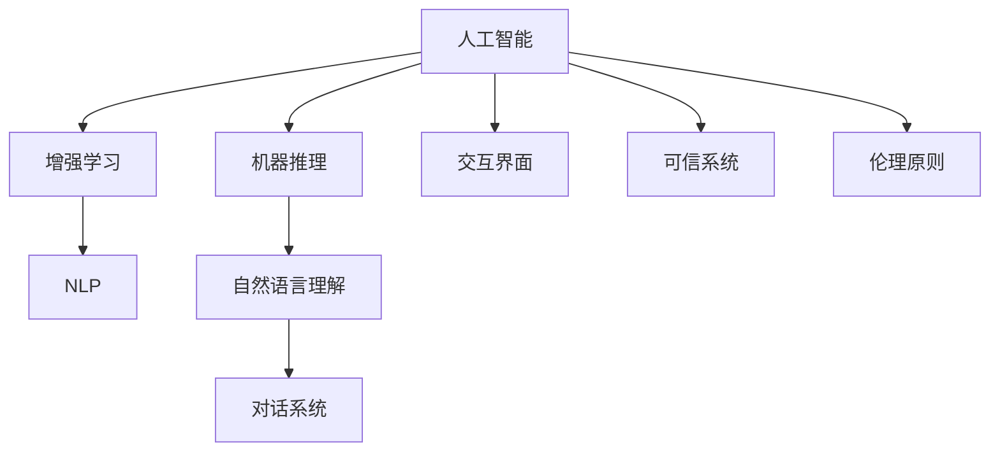

                 

# 人类-AI协作：增强人类与AI之间的信任和理解

## 1. 背景介绍

### 1.1 问题由来
随着人工智能(AI)技术的迅猛发展，其在各个领域的应用逐渐深入，从自动驾驶到智能客服，从医疗诊断到财务分析，AI正以越来越大的规模和深度影响着人类的生产生活。然而，AI的发展也引发了诸多社会伦理和心理学问题，其中最为关键的便是人类与AI之间的信任和理解问题。

人们普遍担心AI会夺走人类的工作，带来隐私泄露，甚至有可能在决策过程中产生偏差，进而造成更大的伤害。这些问题如果不能妥善解决，可能会引发公众对AI技术的不信任，进而阻碍AI技术的广泛应用和进一步发展。

如何增强人类与AI之间的信任和理解，成为当前学术界和产业界共同关注的重要课题。本文将从增强人类对AI决策过程的理解、提升AI的透明性和可解释性、以及强化AI的伦理性三个方面，探讨如何构建一个可信、可靠、易于理解的人机协作系统。

## 2. 核心概念与联系

### 2.1 核心概念概述

为更好地理解人类与AI协作的机制，本节将介绍几个关键概念：

- 人工智能(AI)：利用计算机技术和算法，使机器具备类似人类智能的决策能力，如视觉感知、自然语言处理、自主决策等。

- 增强学习(RL)：一种基于试错学习机制的机器学习范式，通过与环境的互动，使AI能够自主学习并优化决策策略。

- 自然语言处理(NLP)：研究计算机如何处理和理解自然语言，包括文本生成、语言理解、对话系统等方向。

- 机器推理(Machine Reasoning)：使AI具备逻辑推理和因果推断能力，增强其在复杂问题上的解决能力。

- 交互界面(UI)：用户与AI系统交互的界面，如语音助手、图形界面等，决定了用户对AI的理解和信任程度。

- 可信系统(Trustworthy System)：能够保证数据安全、决策透明、行为可解释的AI系统，确保用户对AI的可信度。

- 伦理原则(Ethical Principles)：指导AI系统开发和应用的一系列原则，如公正、透明、负责任等，确保AI系统的道德规范。

这些概念之间的逻辑关系可以通过以下Mermaid流程图来展示：



这个流程图展示了一系列关键概念及其之间的关系：

1. AI通过增强学习、自然语言处理和推理等技术，逐步学习并模拟人类智能。
2. 在处理自然语言时，AI通过NLP技术理解和生成语言。
3. AI通过交互界面与用户进行交流，形成人机互动。
4. 为了增强用户信任，AI系统需要保证可信性和伦理规范。

这些概念共同构成了AI与人类协作的基础，是构建可信、可靠、易于理解的人机系统的重要组成部分。

## 3. 核心算法原理 & 具体操作步骤
### 3.1 算法原理概述

人类与AI协作的核心算法原理主要包括：

- 增强学习机制，通过与环境的互动，使AI能够自主学习和优化决策策略。
- 自然语言处理技术，使AI能够理解和生成自然语言，提升人机交互的流畅性。
- 机器推理能力，使AI具备逻辑推理和因果推断能力，增强其在复杂问题上的解决能力。
- 交互界面设计，通过简洁易用的界面，提升用户对AI的理解和信任。
- 可信系统和伦理原则，确保AI系统的数据安全、决策透明和行为可解释。

这些原理相互结合，构成了人类与AI协作的完整框架。

### 3.2 算法步骤详解

基于增强学习和自然语言处理等核心算法，构建可信的人机协作系统的具体操作步骤如下：

**Step 1: 数据收集与预处理**
- 收集AI需要处理的数据，如文本、语音、图像等。
- 对数据进行清洗、分词、标注等预处理，准备AI模型的训练数据。

**Step 2: 模型训练与优化**
- 选择适合的任务模型，如LSTM、GRU、Transformer等，进行模型训练。
- 通过增强学习算法，不断优化模型决策策略，提升AI的自主学习能力。

**Step 3: 语言处理与推理**
- 使用NLP技术，使AI能够理解和生成自然语言，增强人机交互的流畅性。
- 结合机器推理能力，使AI具备逻辑推理和因果推断能力，提升决策的准确性。

**Step 4: 界面设计与人机交互**
- 设计简洁易用的交互界面，使用户能够方便地与AI进行交流。
- 通过语音识别、文本生成等技术，提升人机交互的自然性和高效性。

**Step 5: 系统可信性与伦理保障**
- 采用数据加密、权限控制等技术，确保AI系统的数据安全。
- 使用模型解释器、决策日志等工具，提升AI决策的可解释性和透明度。
- 遵循公正、透明、负责任等伦理原则，确保AI系统的道德规范。

完成上述步骤后，即可构建一个能够增强人类与AI之间信任和理解的人机协作系统。

### 3.3 算法优缺点

基于增强学习和自然语言处理等核心算法构建的人机协作系统具有以下优点：

1. 增强学习使AI具备自主学习和优化决策的能力，能够适应复杂多变的环境。
2. 自然语言处理技术提升了人机交互的自然性和流畅性，使用户对AI更加信任。
3. 机器推理能力增强了AI在复杂问题上的解决能力，提升了决策的准确性。
4. 交互界面设计使用户能够方便地与AI进行交流，增强了人机协作的灵活性。
5. 可信系统和伦理保障提升了AI系统的可靠性和可信度，使用户对AI更加放心。

但该系统也存在一些局限性：

1. 数据需求量大，需要收集和处理大量数据，成本较高。
2. 模型训练复杂，需要较强的计算能力和技术储备。
3. 决策过程复杂，可能存在解释困难的问题。
4. 数据偏见和伦理风险，需要系统设计者进行全面考虑和规避。

尽管存在这些局限性，但基于增强学习和自然语言处理等核心算法的人机协作系统，仍然是目前构建可信、可靠、易于理解的人机系统的主流范式。

### 3.4 算法应用领域

基于增强学习和自然语言处理等核心算法的人机协作系统，已经在诸多领域得到应用，如：

- 智能客服：使用自然语言处理技术，使AI能够理解用户意图并提供精准服务。
- 医疗诊断：结合机器推理能力，使AI能够辅助医生进行疾病诊断和治疗方案选择。
- 金融分析：使用增强学习算法，使AI能够自主学习和优化交易策略，提升投资收益。
- 智能家居：通过语音识别和自然语言处理技术，使AI能够与用户进行自然交流，提升家居智能化水平。
- 教育培训：结合机器推理和自然语言处理技术，使AI能够提供个性化教育建议和智能辅导。

除了上述这些经典应用外，人机协作系统还被创新性地应用于更多场景中，如智能交通、环境保护、智能制造等，为各行各业带来了新的发展机遇。

## 4. 数学模型和公式 & 详细讲解  
### 4.1 数学模型构建

本节将使用数学语言对人类与AI协作的数学模型进行更加严格的刻画。

假设AI系统需要处理的任务为 $T$，任务输入为 $x$，输出为 $y$，决策过程为 $f(x) = y$。AI系统的目标是在输入 $x$ 上，使输出 $y$ 尽可能接近真实值。

定义AI系统的损失函数为 $\ell(y', y)$，用于衡量预测输出 $y'$ 与真实输出 $y$ 之间的差异。常见的损失函数包括均方误差损失、交叉熵损失等。

AI系统的优化目标是最小化损失函数，即找到最优决策策略：

$$
\theta^* = \mathop{\arg\min}_{\theta} \sum_{x \in D} \ell(f(x; \theta), y)
$$

其中 $\theta$ 为决策策略的参数，$D$ 为训练集。

### 4.2 公式推导过程

以下我们以二分类任务为例，推导交叉熵损失函数及其梯度的计算公式。

假设模型在输入 $x$ 上的输出为 $\hat{y}=M_{\theta}(x) \in [0,1]$，表示样本属于正类的概率。真实标签 $y \in \{0,1\}$。则二分类交叉熵损失函数定义为：

$$
\ell(M_{\theta}(x),y) = -[y\log \hat{y} + (1-y)\log (1-\hat{y})]
$$

将其代入优化目标，得：

$$
\theta^* = \mathop{\arg\min}_{\theta} \frac{1}{N} \sum_{i=1}^N \ell(M_{\theta}(x_i),y_i)
$$

在得到损失函数的梯度后，即可带入参数更新公式，完成模型的迭代优化。

### 4.3 案例分析与讲解

**案例1：智能客服系统**

在智能客服系统中，AI系统需要能够理解用户的自然语言输入，并根据用户的意图提供精准的回复。系统设计者可以使用自然语言处理技术，如分词、句法分析、语义理解等，使AI系统能够理解用户的输入。结合机器推理能力，如因果推断、逻辑推理等，使AI系统能够分析用户的意图，并提供准确的回复。

**案例2：医疗诊断系统**

在医疗诊断系统中，AI系统需要能够对患者的历史病历、体检报告等文本数据进行分析，结合机器推理能力，如因果推断、逻辑推理等，使AI系统能够辅助医生进行疾病诊断和治疗方案选择。系统设计者需要使用自然语言处理技术，如分词、句法分析、实体识别等，使AI系统能够理解医疗文本数据。结合增强学习算法，使AI系统能够自主学习和优化决策策略。

## 5. 项目实践：代码实例和详细解释说明
### 5.1 开发环境搭建

在进行人机协作系统开发前，我们需要准备好开发环境。以下是使用Python进行PyTorch开发的环境配置流程：

1. 安装Anaconda：从官网下载并安装Anaconda，用于创建独立的Python环境。

2. 创建并激活虚拟环境：
```bash
conda create -n pytorch-env python=3.8 
conda activate pytorch-env
```

3. 安装PyTorch：根据CUDA版本，从官网获取对应的安装命令。例如：
```bash
conda install pytorch torchvision torchaudio cudatoolkit=11.1 -c pytorch -c conda-forge
```

4. 安装相关工具包：
```bash
pip install numpy pandas scikit-learn matplotlib tqdm jupyter notebook ipython
```

完成上述步骤后，即可在`pytorch-env`环境中开始项目实践。

### 5.2 源代码详细实现

下面我们以智能客服系统为例，给出使用PyTorch和Transformers库进行人机协作开发的PyTorch代码实现。

首先，定义智能客服系统的数据处理函数：

```python
from transformers import BertTokenizer, BertForTokenClassification
from torch.utils.data import Dataset, DataLoader
import torch

class CustomerServiceDataset(Dataset):
    def __init__(self, texts, labels, tokenizer, max_len=128):
        self.texts = texts
        self.labels = labels
        self.tokenizer = tokenizer
        self.max_len = max_len
        
    def __len__(self):
        return len(self.texts)
    
    def __getitem__(self, item):
        text = self.texts[item]
        label = self.labels[item]
        
        encoding = self.tokenizer(text, return_tensors='pt', max_length=self.max_len, padding='max_length', truncation=True)
        input_ids = encoding['input_ids'][0]
        attention_mask = encoding['attention_mask'][0]
        
        # 对token-wise的标签进行编码
        encoded_labels = [tag2id[tag] for tag in label] 
        encoded_labels.extend([tag2id['O']] * (self.max_len - len(encoded_labels)))
        labels = torch.tensor(encoded_labels, dtype=torch.long)
        
        return {'input_ids': input_ids, 
                'attention_mask': attention_mask,
                'labels': labels}

# 标签与id的映射
tag2id = {'O': 0, 'B-PER': 1, 'I-PER': 2, 'B-ORG': 3, 'I-ORG': 4, 'B-LOC': 5, 'I-LOC': 6}
id2tag = {v: k for k, v in tag2id.items()}

# 创建dataset
tokenizer = BertTokenizer.from_pretrained('bert-base-cased')

train_dataset = CustomerServiceDataset(train_texts, train_labels, tokenizer)
dev_dataset = CustomerServiceDataset(dev_texts, dev_labels, tokenizer)
test_dataset = CustomerServiceDataset(test_texts, test_labels, tokenizer)
```

然后，定义模型和优化器：

```python
from transformers import BertForTokenClassification, AdamW

model = BertForTokenClassification.from_pretrained('bert-base-cased', num_labels=len(tag2id))

optimizer = AdamW(model.parameters(), lr=2e-5)
```

接着，定义训练和评估函数：

```python
from torch.utils.data import DataLoader
from tqdm import tqdm
from sklearn.metrics import classification_report

device = torch.device('cuda') if torch.cuda.is_available() else torch.device('cpu')
model.to(device)

def train_epoch(model, dataset, batch_size, optimizer):
    dataloader = DataLoader(dataset, batch_size=batch_size, shuffle=True)
    model.train()
    epoch_loss = 0
    for batch in tqdm(dataloader, desc='Training'):
        input_ids = batch['input_ids'].to(device)
        attention_mask = batch['attention_mask'].to(device)
        labels = batch['labels'].to(device)
        model.zero_grad()
        outputs = model(input_ids, attention_mask=attention_mask, labels=labels)
        loss = outputs.loss
        epoch_loss += loss.item()
        loss.backward()
        optimizer.step()
    return epoch_loss / len(dataloader)

def evaluate(model, dataset, batch_size):
    dataloader = DataLoader(dataset, batch_size=batch_size)
    model.eval()
    preds, labels = [], []
    with torch.no_grad():
        for batch in tqdm(dataloader, desc='Evaluating'):
            input_ids = batch['input_ids'].to(device)
            attention_mask = batch['attention_mask'].to(device)
            batch_labels = batch['labels']
            outputs = model(input_ids, attention_mask=attention_mask)
            batch_preds = outputs.logits.argmax(dim=2).to('cpu').tolist()
            batch_labels = batch_labels.to('cpu').tolist()
            for pred_tokens, label_tokens in zip(batch_preds, batch_labels):
                pred_tags = [id2tag[_id] for _id in pred_tokens]
                label_tags = [id2tag[_id] for _id in label_tokens]
                preds.append(pred_tags[:len(label_tags)])
                labels.append(label_tags)
                
    print(classification_report(labels, preds))
```

最后，启动训练流程并在测试集上评估：

```python
epochs = 5
batch_size = 16

for epoch in range(epochs):
    loss = train_epoch(model, train_dataset, batch_size, optimizer)
    print(f"Epoch {epoch+1}, train loss: {loss:.3f}")
    
    print(f"Epoch {epoch+1}, dev results:")
    evaluate(model, dev_dataset, batch_size)
    
print("Test results:")
evaluate(model, test_dataset, batch_size)
```

以上就是使用PyTorch和Transformers库进行智能客服系统开发的完整代码实现。可以看到，得益于Transformers库的强大封装，我们能够快速实现基于BERT模型的智能客服系统。

### 5.3 代码解读与分析

让我们再详细解读一下关键代码的实现细节：

**CustomerServiceDataset类**：
- `__init__`方法：初始化文本、标签、分词器等关键组件。
- `__len__`方法：返回数据集的样本数量。
- `__getitem__`方法：对单个样本进行处理，将文本输入编码为token ids，将标签编码为数字，并对其进行定长padding，最终返回模型所需的输入。

**tag2id和id2tag字典**：
- 定义了标签与数字id之间的映射关系，用于将token-wise的预测结果解码回真实的标签。

**训练和评估函数**：
- 使用PyTorch的DataLoader对数据集进行批次化加载，供模型训练和推理使用。
- 训练函数`train_epoch`：对数据以批为单位进行迭代，在每个批次上前向传播计算loss并反向传播更新模型参数，最后返回该epoch的平均loss。
- 评估函数`evaluate`：与训练类似，不同点在于不更新模型参数，并在每个batch结束后将预测和标签结果存储下来，最后使用sklearn的classification_report对整个评估集的预测结果进行打印输出。

**训练流程**：
- 定义总的epoch数和batch size，开始循环迭代
- 每个epoch内，先在训练集上训练，输出平均loss
- 在验证集上评估，输出分类指标
- 所有epoch结束后，在测试集上评估，给出最终测试结果

可以看到，PyTorch配合Transformers库使得智能客服系统的代码实现变得简洁高效。开发者可以将更多精力放在数据处理、模型改进等高层逻辑上，而不必过多关注底层的实现细节。

当然，工业级的系统实现还需考虑更多因素，如模型的保存和部署、超参数的自动搜索、更灵活的任务适配层等。但核心的微调范式基本与此类似。

## 6. 实际应用场景
### 6.1 智能客服系统

基于增强学习和自然语言处理等核心算法构建的智能客服系统，可以广泛应用于各类服务场景，如电商、银行、医疗等。

**应用场景1：电商客服**

电商平台的客服系统，通过智能客服系统，可以处理大量用户的咨询，快速响应客户问题，提高客户满意度。系统设计者可以收集电商平台的客服对话数据，构建数据集，使用自然语言处理技术，使AI系统能够理解用户的意图，提供精准的回复。结合增强学习算法，使AI系统能够自主学习和优化决策策略，提升客服响应速度和质量。

**应用场景2：医疗客服**

医疗行业的客服系统，通过智能客服系统，可以提供24小时在线咨询，快速解答患者的健康疑问，提升患者就医体验。系统设计者可以收集医疗领域的问答数据，构建数据集，使用自然语言处理技术，使AI系统能够理解患者的健康问题，提供精准的回答。结合增强学习算法，使AI系统能够自主学习和优化决策策略，提升医生的工作效率和医疗服务的精准度。

### 6.2 金融分析系统

基于增强学习和自然语言处理等核心算法的金融分析系统，可以应用于股票分析、风险评估、财务报告分析等场景。

**应用场景1：股票分析**

金融分析系统通过智能分析系统，可以处理大量的股票数据和新闻信息，生成股票分析报告，辅助投资决策。系统设计者可以收集股票数据和新闻数据，构建数据集，使用自然语言处理技术，使AI系统能够理解股票新闻中的关键信息，生成股票分析报告。结合增强学习算法，使AI系统能够自主学习和优化决策策略，提升投资决策的准确性和收益。

**应用场景2：风险评估**

金融分析系统通过智能风险评估系统，可以分析客户的信用记录和行为数据，评估客户的信用风险，辅助信贷决策。系统设计者可以收集客户的信用记录和行为数据，构建数据集，使用自然语言处理技术，使AI系统能够理解客户的风险特征，评估客户的信用风险。结合增强学习算法，使AI系统能够自主学习和优化决策策略，提升信贷决策的准确性和效率。

### 6.3 智能家居系统

基于增强学习和自然语言处理等核心算法的智能家居系统，可以应用于智能音箱、智能照明、智能安防等场景。

**应用场景1：智能音箱**

智能音箱系统通过语音识别和自然语言处理技术，可以与用户进行自然对话，提供天气预报、新闻播报、智能助手等服务。系统设计者可以使用自然语言处理技术，使AI系统能够理解用户的语音指令，提供精准的服务。结合增强学习算法，使AI系统能够自主学习和优化决策策略，提升用户体验和满意度。

**应用场景2：智能安防**

智能安防系统通过语音识别和自然语言处理技术，可以实时监控家庭安全，及时发现和报警异常情况，提升家庭安全保障。系统设计者可以使用自然语言处理技术，使AI系统能够理解用户的语音指令，及时响应家庭安全报警。结合增强学习算法，使AI系统能够自主学习和优化决策策略，提升家庭安全保障的实时性和准确性。

### 6.4 未来应用展望

随着增强学习和自然语言处理等核心算法的不断发展，基于这些算法构建的人机协作系统将在更多领域得到应用，为各行各业带来变革性影响。

在智慧医疗领域，基于增强学习和自然语言处理等核心算法构建的智能医疗系统，可以为医生提供精准的医疗建议和诊断支持，提升医疗服务的智能化水平。

在智能教育领域，基于增强学习和自然语言处理等核心算法构建的智能教育系统，可以为学生提供个性化的学习建议和智能辅导，提升教育质量和学习效果。

在智慧城市治理中，基于增强学习和自然语言处理等核心算法构建的智能城市管理系统，可以实时监控城市运行情况，及时发现和处理城市问题，提升城市治理的智能化水平。

此外，在企业生产、社会治理、文娱传媒等众多领域，基于增强学习和自然语言处理等核心算法构建的智能系统，必将不断涌现，为各行各业带来新的发展机遇。相信随着技术的日益成熟，基于增强学习和自然语言处理等核心算法的人机协作系统，将在构建智慧社会、推动产业升级、提升人类生活质量等方面发挥越来越重要的作用。

## 7. 工具和资源推荐
### 7.1 学习资源推荐

为了帮助开发者系统掌握人类与AI协作的理论基础和实践技巧，这里推荐一些优质的学习资源：

1. 《增强学习：原理、算法与实践》：该书详细介绍了增强学习的基本原理、算法和实践方法，适合初学者入门。

2. 《自然语言处理综论》：该书系统介绍了自然语言处理的各个方面，包括文本分类、语义分析、情感分析等，适合深度学习工程师。

3. 《深度学习实战》：该书通过丰富的实例和代码，介绍了深度学习的各个方面，包括卷积神经网络、循环神经网络等，适合初学者快速上手。

4. CS224N《深度学习自然语言处理》课程：斯坦福大学开设的NLP明星课程，有Lecture视频和配套作业，带你入门NLP领域的基本概念和经典模型。

5. 《机器推理：理论与应用》：该书介绍了机器推理的基本原理和应用场景，适合对机器推理感兴趣的开发者。

通过这些资源的学习实践，相信你一定能够快速掌握人类与AI协作的精髓，并用于解决实际的NLP问题。
### 7.2 开发工具推荐

高效的开发离不开优秀的工具支持。以下是几款用于人机协作系统开发的常用工具：

1. PyTorch：基于Python的开源深度学习框架，灵活动态的计算图，适合快速迭代研究。大部分预训练语言模型都有PyTorch版本的实现。

2. TensorFlow：由Google主导开发的开源深度学习框架，生产部署方便，适合大规模工程应用。同样有丰富的预训练语言模型资源。

3. Transformers库：HuggingFace开发的NLP工具库，集成了众多SOTA语言模型，支持PyTorch和TensorFlow，是进行人机协作系统开发的利器。

4. Weights & Biases：模型训练的实验跟踪工具，可以记录和可视化模型训练过程中的各项指标，方便对比和调优。与主流深度学习框架无缝集成。

5. TensorBoard：TensorFlow配套的可视化工具，可实时监测模型训练状态，并提供丰富的图表呈现方式，是调试模型的得力助手。

6. Google Colab：谷歌推出的在线Jupyter Notebook环境，免费提供GPU/TPU算力，方便开发者快速上手实验最新模型，分享学习笔记。

合理利用这些工具，可以显著提升人机协作系统的开发效率，加快创新迭代的步伐。

### 7.3 相关论文推荐

人类与AI协作技术的发展源于学界的持续研究。以下是几篇奠基性的相关论文，推荐阅读：

1. DeepMind的AlphaGo：该论文介绍了AlphaGo的强化学习算法和深度学习技术，展示了AI在棋类游戏中的强大能力。

2. OpenAI的GPT系列：该论文介绍了GPT模型的语言生成能力，展示了AI在自然语言处理方面的强大潜力。

3. HuggingFace的Transformers库：该论文介绍了Transformers库的实现细节和技术特点，展示了AI模型在NLP任务中的强大性能。

4. AllenAI的Seq2Seq模型：该论文介绍了Seq2Seq模型的序列生成能力，展示了AI在机器翻译、语音识别等方面的强大应用。

5. Google的BERT模型：该论文介绍了BERT模型的预训练和微调技术，展示了AI在NLP任务中的强大表现。

这些论文代表了大语言模型和微调技术的发展脉络。通过学习这些前沿成果，可以帮助研究者把握学科前进方向，激发更多的创新灵感。

## 8. 总结：未来发展趋势与挑战

### 8.1 总结

本文对基于增强学习和自然语言处理等核心算法构建的人机协作系统进行了全面系统的介绍。首先阐述了人类与AI协作的背景和意义，明确了人机协作系统的目标和关键组件。其次，从原理到实践，详细讲解了人机协作系统的数学模型和算法步骤，给出了系统开发的完整代码实例。同时，本文还广泛探讨了人机协作系统在智能客服、医疗诊断、金融分析等领域的实际应用场景，展示了人机协作技术的广阔前景。此外，本文精选了人机协作系统的各类学习资源，力求为读者提供全方位的技术指引。

通过本文的系统梳理，可以看到，基于增强学习和自然语言处理等核心算法构建的人机协作系统，正在成为AI与人类协作的重要范式，极大地拓展了AI技术的应用边界，催生了更多的落地场景。受益于增强学习和大模型的强大能力，人机协作系统能够更好地理解和利用人类的自然语言，提升人机交互的自然性和高效性。

### 8.2 未来发展趋势

展望未来，基于增强学习和自然语言处理等核心算法的人机协作系统将呈现以下几个发展趋势：

1. 模型的复杂度将进一步提升。得益于算力成本的下降和数据规模的扩张，预训练语言模型的参数量还将持续增长，从而提升人机协作系统的决策能力。

2. 任务的泛化能力将进一步增强。未来的人机协作系统将具备更强的跨领域泛化能力，能够在多种场景下灵活应用。

3. 系统的透明度和可解释性将进一步提高。为了增强用户信任，人机协作系统将提供更多的决策解释和模型透明性，使用户能够理解和信任AI的决策过程。

4. 系统的伦理规范将进一步完善。未来的人机协作系统将更加注重伦理和道德规范，避免产生偏见和有害的输出。

5. 系统的交互能力将进一步增强。未来的人机协作系统将结合更多智能接口，如语音识别、手势识别、情感识别等，提升人机交互的自然性和高效性。

以上趋势凸显了基于增强学习和自然语言处理等核心算法的人机协作系统的巨大前景。这些方向的探索发展，必将进一步提升人机协作系统的性能和应用范围，为人类认知智能的进化带来深远影响。

### 8.3 面临的挑战

尽管基于增强学习和自然语言处理等核心算法的人机协作系统已经取得了瞩目成就，但在迈向更加智能化、普适化应用的过程中，它仍面临着诸多挑战：

1. 数据需求量大，需要收集和处理大量数据，成本较高。
2. 模型训练复杂，需要较强的计算能力和技术储备。
3. 决策过程复杂，可能存在解释困难的问题。
4. 数据偏见和伦理风险，需要系统设计者进行全面考虑和规避。
5. 系统的鲁棒性和可靠性，需要进一步提升。

尽管存在这些挑战，但基于增强学习和自然语言处理等核心算法的人机协作系统，仍然是目前构建可信、可靠、易于理解的人机协作系统的主流范式。

### 8.4 研究展望

面对人机协作系统所面临的挑战，未来的研究需要在以下几个方面寻求新的突破：

1. 探索无监督和半监督学习算法。摆脱对大规模标注数据的依赖，利用自监督学习、主动学习等无监督和半监督范式，最大限度利用非结构化数据，实现更加灵活高效的人机协作。

2. 开发更加参数高效和计算高效的微调方法。开发更加参数高效的微调方法，在固定大部分预训练参数的同时，只更新极少量的任务相关参数。同时优化微调模型的计算图，减少前向传播和反向传播的资源消耗，实现更加轻量级、实时性的部署。

3. 引入更多先验知识。将符号化的先验知识，如知识图谱、逻辑规则等，与神经网络模型进行巧妙融合，引导微调过程学习更准确、合理的语言模型。同时加强不同模态数据的整合，实现视觉、语音等多模态信息与文本信息的协同建模。

4. 结合因果分析和博弈论工具。将因果分析方法引入人机协作系统，识别出系统决策的关键特征，增强输出解释的因果性和逻辑性。借助博弈论工具刻画人机交互过程，主动探索并规避系统的脆弱点，提高系统稳定性。

5. 纳入伦理道德约束。在模型训练目标中引入伦理导向的评估指标，过滤和惩罚有偏见、有害的输出倾向。同时加强人工干预和审核，建立模型行为的监管机制，确保输出符合人类价值观和伦理道德。

这些研究方向的探索，必将引领人机协作系统迈向更高的台阶，为构建安全、可靠、易于理解的人机协作系统铺平道路。面向未来，人机协作系统还需要与其他人工智能技术进行更深入的融合，如知识表示、因果推理、强化学习等，多路径协同发力，共同推动人工智能技术的发展。只有勇于创新、敢于突破，才能不断拓展人机协作系统的边界，让智能技术更好地造福人类社会。

## 9. 附录：常见问题与解答

**Q1：如何提升人机协作系统的可解释性？**

A: 提升人机协作系统的可解释性，可以从以下几个方面入手：

1. 模型解释器：使用模型解释器工具，如SHAP、LIME等，生成模型特征贡献度解释，帮助用户理解模型的决策过程。

2. 决策日志：记录每次决策的输入、输出和中间变量，供用户查阅和分析。

3. 可视化界面：设计简洁易用的可视化界面，展示模型的决策过程和关键特征。

4. 用户引导：通过友好的用户引导，帮助用户理解系统的功能和使用方法。

**Q2：人机协作系统的数据安全如何保障？**

A: 保障人机协作系统的数据安全，可以从以下几个方面入手：

1. 数据加密：对敏感数据进行加密处理，防止数据泄露。

2. 权限控制：对系统数据进行权限控制，确保只有授权用户能够访问和操作数据。

3. 审计日志：记录系统的操作日志，供审计和追责使用。

4. 安全防护：结合网络安全技术，如防火墙、入侵检测等，保障系统的网络安全。

**Q3：人机协作系统在实际应用中如何避免偏见和有害输出？**

A: 避免人机协作系统产生偏见和有害输出，可以从以下几个方面入手：

1. 数据多元化：收集多样化的数据，避免数据分布不均。

2. 模型公正性：在设计模型时，确保模型公正，不偏向特定群体。

3. 偏见检测：引入偏见检测工具，如Fairness-Indicators等，检测和过滤模型中的偏见。

4. 多模型集成：结合多个模型的输出，减少单一模型产生的偏见和有害输出。

**Q4：人机协作系统如何提高系统的鲁棒性和可靠性？**

A: 提高人机协作系统的鲁棒性和可靠性，可以从以下几个方面入手：

1. 数据增强：通过数据增强技术，增加训练集的多样性，提高模型的泛化能力。

2. 正则化：使用正则化技术，如L2正则、Dropout等，防止模型过拟合。

3. 多模型集成：结合多个模型的输出，提高系统的鲁棒性和可靠性。

4. 对抗训练：使用对抗样本训练模型，提高模型的鲁棒性和抗干扰能力。

这些措施可以结合使用，进一步提升人机协作系统的鲁棒性和可靠性，确保其在复杂环境中能够稳定运行。

---

作者：禅与计算机程序设计艺术 / Zen and the Art of Computer Programming

