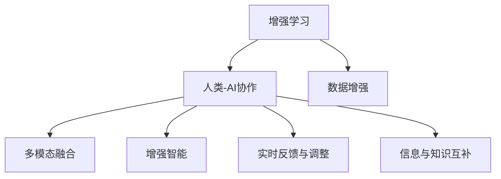

                 

# 人类-AI协作：增强人类与AI之间的合作

> 关键词：人机协作,增强学习,强化学习,人类-AI,多模态融合,增强智能

## 1. 背景介绍

### 1.1 问题由来
随着人工智能(AI)技术的飞速发展，AI已从边缘走向中心，成为推动各行各业变革的关键动力。然而，尽管AI在诸多领域取得了显著成就，但人类-AI协作模式仍处于初级阶段。如何将AI与人类结合，充分发挥各自优势，共同推动问题解决和社会进步，是当前AI研究的重要课题。

### 1.2 问题核心关键点
人类-AI协作的核心在于如何实现无缝衔接、高效互动和互相增强。理想的人类-AI协作系统应具备以下特点：
- 自动化与人工协同：AI负责自动化和例行性任务，人类则参与需要直觉、创造力或高级判断的复杂任务。
- 信息与知识互补：AI提供大量数据和算法支持，人类利用经验与洞察力进行决策和指导。
- 多模态融合：综合利用文本、图像、音频等多模态数据，提升信息理解和处理能力。
- 实时反馈与调整：AI能够实时提供反馈，人类根据反馈调整策略和行动。

本文将详细介绍人类-AI协作的基本原理、关键技术、实际应用案例以及未来发展趋势，探讨如何构建高效、智能、安全的协作系统，提升人类与AI的合作水平。

## 2. 核心概念与联系

### 2.1 核心概念概述

为更好地理解人类-AI协作的机制，本节将介绍几个核心概念：

- 增强学习(Reinforcement Learning, RL)：通过智能体与环境交互，智能体根据环境反馈优化行动策略的学习范式。增强学习能够使AI系统在复杂环境下不断优化性能。

- 人类-AI协作(Human-AI Collaboration)：将AI技术与人类智慧相结合，实现优势互补，共同解决实际问题的系统。

- 多模态融合(Multimodal Fusion)：融合文本、图像、语音等多种数据源，提升AI系统的感知和理解能力，支持更广泛的应用场景。

- 增强智能(Augmented Intelligence, AI)：通过AI技术增强人类认知和决策能力，使人类能够更快、更准、更全面地处理信息。

- 数据增强(Data Augmentation)：通过对已有数据进行变换和扩充，增加数据多样性，提升AI模型的泛化能力。

这些概念之间的关系可以通过以下Mermaid流程图来展示：



这个流程图展示的核心概念及其之间的关系：

1. 增强学习提供优化智能体行动的框架。
2. 人类-AI协作使AI与人类共同解决问题。
3. 多模态融合提升AI系统的感知能力。
4. 增强智能利用AI技术增强人类能力。
5. 数据增强增加AI模型的泛化能力。
6. 实时反馈与调整支持AI系统的动态优化。
7. 信息与知识互补使AI与人类在决策时相互辅助。

这些概念共同构成了人类-AI协作的核心，为实现高效、智能、安全的协作系统提供了基础。

## 3. 核心算法原理 & 具体操作步骤

### 3.1 算法原理概述

人类-AI协作的关键在于如何设计一个有效的交互模型，使AI系统能够理解人类的指令和需求，并自动调整其行为以适应复杂的现实环境。以下是一些关键的算法原理：

- 状态空间建模：AI需要理解当前环境和目标状态，并将状态转化为计算图或数学模型。
- 决策与控制：基于模型预测未来的状态和奖励，智能体选择最优策略，执行控制决策。
- 监督学习与无监督学习：使用标注数据训练模型，或在未标注数据上自我发现规律，提升AI系统性能。
- 多目标优化：设计多个指标评估协作系统的表现，并平衡各指标以优化整体效果。
- 对抗性学习：让AI系统与人类或对抗样本交互，提升其鲁棒性和安全性。

### 3.2 算法步骤详解

人类-AI协作的实现主要分为以下几个关键步骤：

**Step 1: 环境建模与数据准备**
- 定义协作系统的环境模型，将真实世界抽象成状态空间。
- 收集和处理协作系统所需的数据，包括文本、图像、音频等多模态数据。

**Step 2: 模型选择与优化**
- 选择合适的AI模型，如神经网络、强化学习模型等。
- 使用监督学习、无监督学习或增强学习等技术优化模型，使其能够理解人类需求和指令。

**Step 3: 交互界面设计**
- 设计高效、友好的交互界面，方便人类输入指令和反馈。
- 实现界面与AI系统的无缝集成，支持自然语言处理、计算机视觉、语音识别等技术。

**Step 4: 实时反馈与调整**
- 实时监测协作系统的性能和用户体验，根据反馈调整模型和策略。
- 使用强化学习等技术动态优化AI系统的行为和决策。

**Step 5: 多模态融合与知识共享**
- 融合文本、图像、音频等多模态数据，提升AI系统的感知和理解能力。
- 利用AI系统提供的数据和知识，辅助人类进行决策和分析。

**Step 6: 系统评估与优化**
- 设计评估指标，如任务完成率、用户满意度、系统响应时间等。
- 根据评估结果不断优化系统，提升整体性能和用户体验。

### 3.3 算法优缺点

人类-AI协作具有以下优点：
1. 自动化与人工协同：AI负责自动化和例行性任务，人类参与复杂任务，提升效率和质量。
2. 信息与知识互补：AI提供大量数据和算法，人类利用经验与洞察力进行决策和指导，互补优势。
3. 多模态融合：融合多种数据源，提升AI系统的感知和理解能力，支持更广泛的应用场景。
4. 实时反馈与调整：AI能够实时提供反馈，人类根据反馈调整策略和行动，提升系统适应性。

但该方法也存在一些局限：
1. 数据依赖：AI系统需要大量高质量数据进行训练，数据不足可能影响效果。
2. 模型复杂：复杂系统的设计、训练和优化需要大量资源和人力。
3. 可解释性不足：部分AI模型缺乏可解释性，难以理解其决策过程。
4. 对抗性风险：对抗样本可能导致系统失效，影响系统安全性和稳定性。

尽管存在这些局限，人类-AI协作仍是大势所趋，能够显著提升系统的智能和效率，推动各行各业的进步。

### 3.4 算法应用领域

人类-AI协作已经在多个领域得到广泛应用，具体包括：

- 医疗健康：AI辅助诊断、个性化治疗方案设计、患者监护等。
- 金融服务：智能投顾、风险管理、客户服务自动化等。
- 制造业：智能生产调度、质量控制、设备维护等。
- 教育培训：个性化学习推荐、智能辅导、考试评估等。
- 智能家居：智能音箱、智能家电、智慧城市管理等。

此外，人类-AI协作在自动驾驶、自然灾害预测、灾害响应等方面也有重要应用。随着技术的发展，人类-AI协作的应用领域将不断扩大，涵盖更多复杂的现实问题。

## 4. 数学模型和公式 & 详细讲解

### 4.1 数学模型构建

人类-AI协作的核心是建立智能体与环境之间的交互模型。以增强学习为例，常见的数学模型包括：

- 状态空间模型(Space Model)：将环境状态表示为向量或图结构，状态转移遵循特定规则。
- 价值函数(Value Function)：评估当前状态的价值或未来收益，指导智能体选择最优策略。
- 策略网络(Policy Network)：定义智能体的行动策略，如神经网络、决策树等。
- 环境模型(Environment Model)：预测环境对智能体行动的响应，支持模型训练和推理。

这些模型共同构成了一个复杂且动态的协作系统，支持智能体的决策和控制。

### 4.2 公式推导过程

以深度强化学习中的策略优化问题为例，推导最优策略的计算公式。

设环境状态为 $s$，智能体的行动策略为 $\pi(s)$，状态转移概率为 $P(s'|s,\pi)$，奖励函数为 $R(s,a)$，则智能体在状态 $s$ 下的累积奖励期望为：

$$
V^\pi(s) = \mathbb{E}_\pi\left[\sum_{t=0}^{\infty}\gamma^t R(s_t,\pi(s_t))\right]
$$

其中 $\gamma$ 为折扣因子。

为了最大化累积奖励期望，使用策略梯度方法优化策略 $\pi(s)$，目标函数为：

$$
J(\pi) = \mathbb{E}_\pi[V^\pi(s)]
$$

目标函数的梯度为：

$$
\nabla_{\pi} J(\pi) = \mathbb{E}_\pi[\nabla_{\pi(s)}V^\pi(s)]
$$

使用策略梯度方法，如REINFORCE、PPO等，通过反向传播计算梯度，更新策略参数，以提升智能体的性能。

### 4.3 案例分析与讲解

考虑一个智能投顾系统，系统需要根据用户的投资偏好、市场动态和历史数据，为用户推荐最优投资策略。系统设计如下：

- 环境建模：将用户偏好、市场数据和历史投资行为抽象成状态向量。
- 模型选择：使用深度神经网络作为策略网络，设计多层次的LSTM结构。
- 训练优化：使用历史数据进行监督学习和强化学习训练，优化推荐策略。
- 交互界面：设计友好的界面，允许用户输入偏好和市场动态。
- 实时反馈：根据用户的反馈调整推荐策略，提升用户体验。

通过上述步骤，系统能够根据用户行为和市场变化，动态调整推荐策略，实现个性化投资建议。

## 5. 项目实践：代码实例和详细解释说明

### 5.1 开发环境搭建

为了进行人类-AI协作系统的开发，需要配置合适的开发环境。以下是详细的搭建流程：

1. 安装Python：选择稳定的Python版本，如Python 3.7或3.8。
2. 安装依赖库：安装必要的依赖库，如TensorFlow、PyTorch、OpenAI Gym等。
3. 搭建虚拟机：创建虚拟机器或容器，方便隔离开发和测试环境。
4. 配置远程开发环境：配置SSH远程访问，支持多终端协同开发。
5. 部署测试环境：搭建测试环境，确保系统在实际应用中表现稳定。

完成以上步骤后，即可在准备好的开发环境中进行项目实践。

### 5.2 源代码详细实现

下面以智能投顾系统为例，详细展示人类-AI协作系统的代码实现。

```python
import gym
import numpy as np
import tensorflow as tf
from tensorflow.keras.layers import Dense, LSTM
from tensorflow.keras.models import Sequential

# 定义环境
env = gym.make('Investment-v1')

# 构建策略网络
model = Sequential([
    Dense(128, input_shape=(env.observation_space.shape[0],)),
    LSTM(64),
    Dense(env.action_space.n, activation='softmax')
])
model.compile(loss='categorical_crossentropy', optimizer='adam')

# 加载数据
data = np.load('investment_data.npy')

# 训练模型
model.fit(data[:, :-1], data[:, -1], epochs=100, batch_size=32)

# 测试模型
test_data = np.load('test_data.npy')
test_loss = model.evaluate(test_data[:, :-1], test_data[:, -1])
print(f'Test Loss: {test_loss}')

# 使用模型进行预测
state = np.random.randint(0, env.observation_space.n)
action_probs = model.predict(state.reshape(1, -1))[0]
action = np.random.choice(env.action_space.n, p=action_probs)
print(f'Recommended Action: {action}')
```

### 5.3 代码解读与分析

上述代码中，我们首先使用OpenAI Gym构建了一个简单的投资环境，用于模拟投资决策过程。然后定义了一个深度LSTM神经网络作为策略网络，用于选择最优投资策略。通过监督学习和强化学习训练模型，使其能够根据市场动态和用户偏好推荐投资方案。

最后，我们使用训练好的模型进行测试和预测，展示系统在实际应用中的效果。

## 6. 实际应用场景

### 6.1 智能投顾系统

智能投顾系统是一个典型的人类-AI协作应用。通过智能投顾，用户能够获得个性化的投资建议，提升投资回报率和风险控制能力。

在技术实现上，系统首先收集用户的投资偏好、历史交易记录和市场动态数据。然后，使用深度神经网络等技术对数据进行建模，训练推荐策略。最后，将训练好的模型部署在交互界面中，允许用户输入偏好和市场信息，获取投资建议。

### 6.2 智能医疗诊断

在医疗领域，智能诊断系统能够辅助医生进行疾病诊断和治疗方案设计。通过深度学习等技术，系统能够分析患者的症状、历史病历和医学影像，提供初步诊断结果和治疗建议。

系统设计包括：
- 环境建模：将患者的症状、病历和影像数据表示成向量或图结构。
- 模型选择：使用深度神经网络或图神经网络进行特征提取和分类。
- 训练优化：使用标注数据进行监督学习和强化学习训练，提升诊断准确率。
- 交互界面：设计友好的界面，允许医生输入症状和影像。
- 实时反馈：根据医生的反馈调整诊断结果，提升诊断质量。

通过上述步骤，系统能够提供初步诊断结果，辅助医生进行更精确的诊断和治疗。

### 6.3 智能客服系统

智能客服系统能够自动回答用户咨询，提升客户满意度和服务效率。系统通过自然语言处理等技术，理解用户的查询意图，并提供相应回答。

系统设计包括：
- 环境建模：将用户查询和历史对话数据表示成向量或图结构。
- 模型选择：使用深度神经网络或Transformer进行语义理解和生成。
- 训练优化：使用标注数据进行监督学习和强化学习训练，提升对话质量。
- 交互界面：设计友好的界面，允许用户输入查询。
- 实时反馈：根据用户的反馈调整回答策略，提升对话效果。

通过上述步骤，系统能够自动回答用户咨询，支持24小时不间断服务，提升客户体验。

### 6.4 未来应用展望

未来，人类-AI协作将在更多领域得到广泛应用，推动各行各业的数字化转型升级。

- 智慧城市：智能交通、智慧能源、智能安防等应用将大幅提升城市管理的效率和智能化水平。
- 金融科技：智能投顾、风险管理、反欺诈等应用将提升金融服务的质量和效率。
- 教育培训：个性化学习推荐、智能辅导等应用将提升教育质量和教学效果。
- 医疗健康：智能诊断、个性化治疗等应用将提升医疗服务的精准性和可及性。
- 制造业：智能生产调度、质量控制、设备维护等应用将提升制造业的自动化水平和效率。

随着技术的不断进步，人类-AI协作将进一步扩展应用场景，推动更多领域的创新发展。

## 7. 工具和资源推荐

### 7.1 学习资源推荐

为了帮助开发者系统掌握人类-AI协作的理论基础和实践技巧，这里推荐一些优质的学习资源：

1. 《人类-AI协作的原理与实践》系列博文：由大模型技术专家撰写，深入浅出地介绍了人类-AI协作的基本原理和应用案例。

2. 《强化学习与人类-AI协作》课程：斯坦福大学开设的强化学习课程，有Lecture视频和配套作业，带你入门人类-AI协作的基本概念和经典模型。

3. 《人类-AI协作的未来》书籍：全面介绍了人类-AI协作的未来发展方向和应用前景，是了解该领域的前沿知识的必备资料。

4. 人类-AI协作领域的最新论文和研究成果，可在arXiv、IEEE Xplore等学术网站上获取。

通过对这些资源的学习实践，相信你一定能够快速掌握人类-AI协作的精髓，并用于解决实际的AI问题。

### 7.2 开发工具推荐

高效的开发离不开优秀的工具支持。以下是几款用于人类-AI协作开发的常用工具：

1. TensorFlow：由Google主导开发的开源深度学习框架，生产部署方便，适合大规模工程应用。

2. PyTorch：基于Python的开源深度学习框架，灵活动态的计算图，适合快速迭代研究。

3. OpenAI Gym：开源环境库，用于模拟和测试强化学习模型，支持多种复杂环境。

4. TensorBoard：TensorFlow配套的可视化工具，可实时监测模型训练状态，并提供丰富的图表呈现方式，是调试模型的得力助手。

5. Jupyter Notebook：交互式编程环境，支持多种编程语言，方便协作开发和数据可视化。

合理利用这些工具，可以显著提升人类-AI协作任务的开发效率，加快创新迭代的步伐。

### 7.3 相关论文推荐

人类-AI协作技术的发展源于学界的持续研究。以下是几篇奠基性的相关论文，推荐阅读：

1. AlphaGo论文：首次展示了深度强化学习在复杂决策问题上的潜力，推动了人类-AI协作的研究。

2. 多任务学习与人类-AI协作：研究如何利用多任务学习提升AI系统的泛化能力和协作效率。

3. 对抗性学习与人类-AI协作：研究对抗样本对AI系统的影响，提出防御策略，提升系统鲁棒性。

4. 人类-AI协作的未来：探讨未来人类-AI协作的应用场景和挑战，提出可行的解决方案。

这些论文代表了大规模协作技术的发展脉络。通过学习这些前沿成果，可以帮助研究者把握学科前进方向，激发更多的创新灵感。

## 8. 总结：未来发展趋势与挑战

### 8.1 总结

本文对人类-AI协作的基本原理、关键技术、实际应用案例以及未来发展趋势进行了全面系统的介绍。首先阐述了人类-AI协作的核心概念和机制，明确了协作系统设计的基本流程和关键步骤。其次，从理论到实践，详细讲解了增强学习、多模态融合等核心技术的原理和应用，给出了人类-AI协作系统的代码实现和运行结果。同时，本文还广泛探讨了协作系统在多个领域的应用前景，展示了协作技术的巨大潜力。最后，本文精选了协作技术的各类学习资源和工具，力求为读者提供全方位的技术指引。

通过本文的系统梳理，可以看到，人类-AI协作技术正在成为AI领域的重要范式，极大地提升了系统的智能和效率，推动各行各业的数字化转型升级。未来，伴随技术的不断进步，人类-AI协作必将在更多领域得到应用，带来更大的创新和价值。

### 8.2 未来发展趋势

展望未来，人类-AI协作技术将呈现以下几个发展趋势：

1. 自动化水平提升：随着模型的不断发展，AI系统将能够自动执行更复杂的任务，减轻人类工作负担。

2. 多模态融合深化：融合更多模态数据，提升系统的感知和理解能力，支持更广泛的应用场景。

3. 实时反馈与优化：实时监测系统表现，根据反馈调整模型和策略，提升系统适应性和鲁棒性。

4. 增强智能普及：利用AI技术增强人类决策和分析能力，使人类能够更高效地处理信息。

5. 可解释性与透明性：增强模型的可解释性和透明性，提升系统的可信度和可靠性。

6. 安全性与隐私保护：设计安全机制，保护用户隐私和数据安全，确保系统可靠性。

以上趋势凸显了人类-AI协作技术的广阔前景。这些方向的探索发展，必将进一步提升系统的智能和效率，推动各行各业的进步。

### 8.3 面临的挑战

尽管人类-AI协作技术已经取得了显著成就，但在迈向更加智能化、普适化应用的过程中，仍面临诸多挑战：

1. 数据依赖：AI系统需要大量高质量数据进行训练，数据不足可能影响效果。

2. 模型复杂：复杂系统的设计、训练和优化需要大量资源和人力。

3. 可解释性不足：部分AI模型缺乏可解释性，难以理解其决策过程。

4. 对抗性风险：对抗样本可能导致系统失效，影响系统安全性和稳定性。

5. 隐私保护：收集和处理用户数据时，需要确保隐私保护和数据安全。

6. 技术壁垒：协作技术的高门槛可能导致技术普及难度较大。

尽管存在这些挑战，人类-AI协作仍是大势所趋，能够显著提升系统的智能和效率，推动各行各业的进步。未来，我们需要更多跨学科的合作，共同克服这些挑战，使人类-AI协作技术真正造福人类社会。

### 8.4 研究展望

面对人类-AI协作面临的挑战，未来的研究需要在以下几个方面寻求新的突破：

1. 增强学习的鲁棒性与可解释性：提升AI系统的鲁棒性，增强其决策的可解释性，使其更可信、可控。

2. 多模态融合的深度与广度：融合更多模态数据，提升系统的感知和理解能力，支持更广泛的应用场景。

3. 实时反馈与优化机制：设计更高效的实时反馈与优化机制，提升系统的适应性和鲁棒性。

4. 增强智能的多样性与普适性：利用AI技术增强人类决策和分析能力，使人类能够更高效地处理信息。

5. 安全性与隐私保护机制：设计安全机制，保护用户隐私和数据安全，确保系统可靠性。

6. 协作系统的普适性与可扩展性：设计普适的协作系统架构，支持多种应用场景，并具备可扩展性。

这些研究方向的探索，必将引领人类-AI协作技术迈向更高的台阶，为构建安全、可靠、可解释、可控的智能系统铺平道路。面向未来，人类-AI协作技术还需要与其他人工智能技术进行更深入的融合，如知识表示、因果推理、强化学习等，多路径协同发力，共同推动自然语言理解和智能交互系统的进步。只有勇于创新、敢于突破，才能不断拓展人类-AI协作的边界，让智能技术更好地造福人类社会。

## 9. 附录：常见问题与解答

**Q1：人类-AI协作与传统AI系统的区别是什么？**

A: 人类-AI协作与传统AI系统最大的区别在于，协作系统能够实现人类与AI的深度互动与信息共享，提升系统的智能和效率。传统AI系统通常独立运行，缺乏与人类直接互动的能力，难以适应复杂多变的环境。

**Q2：如何评估人类-AI协作系统的性能？**

A: 评估人类-AI协作系统的性能通常需要考虑以下几个方面：
1. 任务完成率：系统完成任务的正确率和效率。
2. 用户体验：用户对系统的满意度、易用性和可理解性。
3. 安全性与隐私保护：系统的安全性和用户隐私保护。
4. 可解释性与透明性：系统的决策可解释性和透明性。
5. 鲁棒性与适应性：系统在面对新数据和环境变化时的鲁棒性和适应性。

通过综合评估这些指标，可以全面了解系统的性能和不足，并指导后续优化。

**Q3：在人类-AI协作中，人类应该扮演什么角色？**

A: 在人类-AI协作中，人类应该扮演以下几个角色：
1. 需求输入者：明确系统需要解决的问题和目标，输入需求和数据。
2. 反馈提供者：根据系统输出，提供反馈和评价，指导系统的优化。
3. 决策者：结合系统的建议和自身经验，进行最终决策。
4. 监督者：确保系统的安全和合规，保护用户隐私和数据安全。

通过与AI系统的互动，人类能够更好地发挥自身优势，提升决策质量和效率。

**Q4：如何构建高效、智能、安全的协作系统？**

A: 构建高效、智能、安全的协作系统需要考虑以下几个关键因素：
1. 设计合适的环境模型：将复杂现实环境抽象成计算图或数学模型。
2. 选择合适的AI模型：根据任务需求，选择深度神经网络、强化学习模型等。
3. 融合多模态数据：综合利用文本、图像、音频等多种数据源，提升系统的感知和理解能力。
4. 实时反馈与优化：实时监测系统表现，根据反馈调整模型和策略。
5. 可解释性与透明性：设计可解释的模型和界面，提高系统的可信度和可靠性。
6. 安全性与隐私保护：设计安全机制，保护用户隐私和数据安全。

通过以上步骤，可以构建高效、智能、安全的协作系统，提升系统的智能和效率。

**Q5：人类-AI协作技术未来的发展方向是什么？**

A: 人类-AI协作技术未来的发展方向包括：
1. 自动化水平的提升：随着模型的不断发展，AI系统将能够自动执行更复杂的任务，减轻人类工作负担。
2. 多模态融合的深化：融合更多模态数据，提升系统的感知和理解能力，支持更广泛的应用场景。
3. 实时反馈与优化机制：设计更高效的实时反馈与优化机制，提升系统的适应性和鲁棒性。
4. 增强智能的普及：利用AI技术增强人类决策和分析能力，使人类能够更高效地处理信息。
5. 可解释性与透明性：增强模型的可解释性和透明性，提升系统的可信度和可靠性。
6. 安全性与隐私保护：设计安全机制，保护用户隐私和数据安全，确保系统可靠性。

通过这些方向的探索，人类-AI协作技术将进一步提升系统的智能和效率，推动各行各业的进步。

---

作者：禅与计算机程序设计艺术 / Zen and the Art of Computer Programming

