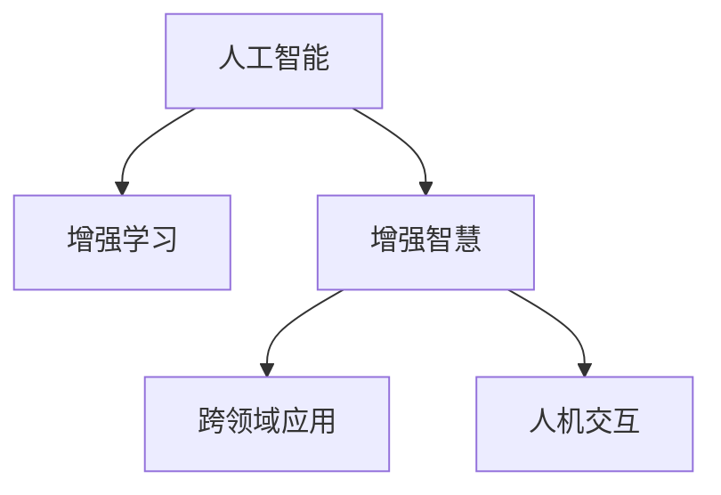

                 

# 人类-AI协作：增强人类智慧与AI能力的融合发展趋势预测分析机遇趋势

> 关键词：人类-AI协作,增强智慧,智慧融合,未来趋势,机遇分析

## 1. 背景介绍

### 1.1 问题由来
随着人工智能（AI）技术的飞速发展，尤其是深度学习和大数据技术的突破，人类与AI的协作变得愈加紧密。AI通过在大数据集上进行的深度学习，具备了强大的计算和推理能力，能够协助人类解决复杂问题，并在许多领域展现出了卓越的表现。然而，这种协作并非没有挑战，包括技术瓶颈、伦理问题、数据隐私等。

### 1.2 问题核心关键点
当前，人类-AI协作的主要挑战包括：
1. **技术兼容问题**：人类与AI在知识表达、推理方式上存在差异，如何实现无缝衔接是首要难题。
2. **伦理道德问题**：AI系统的决策透明性不足，可能导致歧视、隐私泄露等伦理问题。
3. **数据隐私问题**：AI系统依赖大量数据进行训练，如何保护用户隐私和数据安全成为关键。
4. **跨领域应用问题**：AI在不同领域的通用性不足，无法灵活适应各种复杂场景。

### 1.3 问题研究意义
深入研究人类-AI协作的方法和趋势，对于构建更加高效、智能、安全的协作系统具有重要意义：

1. **提升效率**：AI在处理海量数据和复杂任务方面的能力，能够极大地提升人类工作效率，促进生产力提升。
2. **促进创新**：通过AI与人类智慧的结合，可以推动新知识和新产品的创新，加速科技进步。
3. **保障公平**：合理使用AI技术，能够缩小不同群体之间的知识鸿沟，实现社会公平。
4. **增强安全性**：通过AI的辅助，可以提升决策的准确性和鲁棒性，减少人为失误。

## 2. 核心概念与联系

### 2.1 核心概念概述

为更好地理解人类-AI协作的原理和实现方式，本节将介绍几个关键概念：

- **人工智能（AI）**：通过模拟人类智能行为，实现自主学习、推理、决策等能力的计算机系统。
- **增强学习（Reinforcement Learning, RL）**：通过试错和奖惩机制，使AI系统能够自主学习最优策略。
- **增强智慧（Augmented Intelligence, AI）**：结合AI的计算能力和人类的智慧，实现更加智能的决策和行动。
- **跨领域应用（Cross-Domain Application）**：AI技术在不同领域的广泛应用，如医疗、金融、教育等。
- **人机交互（Human-Computer Interaction, HCI）**：优化人机界面设计，提升用户体验，增强人机协作效率。

这些概念之间的逻辑关系可以通过以下Mermaid流程图来展示：



这个流程图展示了几大核心概念及其之间的关系：

1. **人工智能**通过**增强学习**，不断提升自身的智能水平，实现更加智能的**增强智慧**。
2. **增强智慧**在不同领域的**跨领域应用**中，能够实现更加复杂、高效的**人机交互**。

这些概念共同构成了人类-AI协作的框架，使其能够在各种场景下发挥强大的智能能力。通过理解这些核心概念，我们可以更好地把握人类-AI协作的工作原理和优化方向。

## 3. 核心算法原理 & 具体操作步骤
### 3.1 算法原理概述

人类-AI协作的原理，本质上是将AI的计算能力和学习算法与人类智慧相结合，以实现更加智能的决策和行动。在实际操作中，这一过程通常包括以下几个关键步骤：

1. **数据准备**：收集和整理数据集，准备供AI训练使用的样本。
2. **模型训练**：使用增强学习算法，让AI在数据集上学习最优策略。
3. **知识注入**：将人类专家的知识和经验，通过特定接口传递给AI，指导AI的学习和推理。
4. **反馈优化**：根据AI的输出结果，进行实时反馈，调整和优化AI的策略。
5. **协同决策**：在决策过程中，人类与AI进行交互，结合各自的优势，共同作出最佳决策。

### 3.2 算法步骤详解

具体来说，以下是实现人类-AI协作的几个关键步骤：

**Step 1: 数据准备**
- 收集和整理数据集，确保数据的多样性和代表性。
- 对数据进行清洗和预处理，去除噪音和不相关的信息。

**Step 2: 模型训练**
- 选择适合的增强学习算法，如Q-learning、SARSA等。
- 设计奖励函数，根据AI的决策结果给出相应的奖励或惩罚。
- 在数据集上对AI进行训练，逐步优化决策策略。

**Step 3: 知识注入**
- 将人类专家的知识和经验，通过接口或规则库传递给AI。
- 设计特定的数据格式，使AI能够理解并应用人类知识。
- 使用专家系统或知识图谱，提供AI的推理支持。

**Step 4: 反馈优化**
- 对AI的输出结果进行评估，确定其准确性和可靠性。
- 根据评估结果，给出反馈，调整AI的决策策略。
- 使用A/B测试或对比实验，验证优化效果。

**Step 5: 协同决策**
- 在决策过程中，人类与AI进行交互，共同分析问题。
- 利用AI的计算能力和推理能力，提出多种解决方案。
- 结合人类的经验和直觉，选择最优方案，作出决策。

### 3.3 算法优缺点

人类-AI协作方法具有以下优点：
1. **智能协同**：将AI的计算能力和人类的智慧结合起来，实现更加智能的决策和行动。
2. **效率提升**：AI能够处理大量数据和复杂任务，极大提升人类工作效率。
3. **创新加速**：通过AI与人类智慧的结合，能够推动新知识和新产品的创新。
4. **公平保障**：合理使用AI技术，缩小不同群体之间的知识鸿沟，实现社会公平。

同时，该方法也存在一些局限性：
1. **技术瓶颈**：AI与人类在知识表达和推理方式上的差异，可能导致协作效率低下。
2. **伦理问题**：AI系统的决策透明性不足，可能导致歧视、隐私泄露等伦理问题。
3. **数据隐私**：AI依赖大量数据进行训练，如何保护用户隐私和数据安全成为关键。
4. **跨领域应用**：AI在不同领域的通用性不足，无法灵活适应各种复杂场景。

尽管存在这些局限性，但就目前而言，人类-AI协作方法仍是一种高效、实用的智能协同方式。未来相关研究的重点在于如何进一步提高协作效率，解决伦理和隐私问题，增强AI的跨领域应用能力。

### 3.4 算法应用领域

人类-AI协作方法已经在多个领域得到了应用，以下是几个典型的例子：

**医疗领域**
- **诊断支持**：AI辅助医生进行疾病诊断，提供决策建议。
- **个性化治疗**：结合患者的基因信息和历史病历，提供个性化治疗方案。
- **智能监控**：实时监控患者健康状况，及时发现异常。

**金融领域**
- **风险评估**：AI分析市场数据，预测股票走势，提供风险评估。
- **欺诈检测**：识别交易中的异常行为，预防欺诈。
- **客户服务**：智能客服系统，提供24小时在线咨询，提升用户体验。

**教育领域**
- **智能辅导**：AI辅助教师进行教学，提供个性化学习方案。
- **自动评分**：自动批改作业，提高评卷效率。
- **知识图谱**：构建知识图谱，支持跨学科学习。

除了上述这些经典领域外，人类-AI协作还在工业制造、智能交通、智能家居等诸多场景中得到应用，为各行各业带来了显著的效率提升和智能化转型。

## 4. 数学模型和公式 & 详细讲解 & 举例说明
### 4.1 数学模型构建

本节将使用数学语言对人类-AI协作的方法进行更加严格的刻画。

假设有一个智能协作系统，其中AI部分由增强学习算法控制，其参数为 $\theta$。人类专家提供的知识和经验，通过接口 $K$ 传递给AI。系统的决策过程可以分为两个阶段：

1. **AI决策阶段**：AI根据当前状态 $s$ 和人类提供的知识 $K$，使用增强学习算法选择最优动作 $a$。
2. **人类决策阶段**：人类根据AI的决策结果和自身经验，选择最终动作 $a_h$。

系统的总奖励函数为 $R(s,a,a_h)$，决策过程可以表示为：

$$
\max_{a_h} R(s,a,a_h) = \max_{a_h} \left( r(s,a) + \gamma \max_{a_h'} R(s',a',a_h') \right)
$$

其中 $r(s,a)$ 表示当前状态和动作的即时奖励，$\gamma$ 为折扣因子，$s'$ 和 $a'$ 分别表示下一状态和动作。

### 4.2 公式推导过程

以下我们以医疗诊断为例，推导增强学习在协作决策中的应用。

假设AI在诊断系统中的决策阶段，使用Q-learning算法，其更新公式为：

$$
Q_{\theta}(s,a) \leftarrow Q_{\theta}(s,a) + \alpha [r(s,a) + \gamma \max_{a'} Q_{\theta}(s',a') - Q_{\theta}(s,a)]
$$

其中 $\alpha$ 为学习率。人类专家的知识 $K$ 通过接口 $K$ 传递给AI，AI使用该知识来调整其决策策略。

在人类决策阶段，人类专家根据AI的诊断结果和自身经验，选择最终的诊断方案。通过不断迭代优化，AI能够逐步学习最优的诊断策略，提升诊断的准确性和效率。

### 4.3 案例分析与讲解

假设一个医疗诊断系统，AI使用Q-learning算法进行决策，人类专家提供诊断知识和经验。系统在不断迭代中，学习到以下决策策略：

1. **症状识别**：AI根据患者症状，选择相应的检查方案。
2. **结果分析**：AI分析检查结果，初步判断可能的疾病。
3. **专家辅助**：人类专家根据AI的初步判断，结合自身经验，选择最终的诊断方案。

在实际应用中，这种协作方式可以显著提升诊断效率和准确性。例如，对于复杂的疑难病例，AI可以快速进行初步判断，并通过接口将结果传递给人类专家。人类专家在AI结果的基础上，进行深入分析和综合判断，最终作出诊断决策。

## 5. 项目实践：代码实例和详细解释说明
### 5.1 开发环境搭建

在进行人类-AI协作项目实践前，我们需要准备好开发环境。以下是使用Python进行PyTorch开发的环境配置流程：

1. 安装Anaconda：从官网下载并安装Anaconda，用于创建独立的Python环境。

2. 创建并激活虚拟环境：
```bash
conda create -n ai-env python=3.8 
conda activate ai-env
```

3. 安装PyTorch：根据CUDA版本，从官网获取对应的安装命令。例如：
```bash
conda install pytorch torchvision torchaudio cudatoolkit=11.1 -c pytorch -c conda-forge
```

4. 安装TensorFlow：
```bash
pip install tensorflow
```

5. 安装各类工具包：
```bash
pip install numpy pandas scikit-learn matplotlib tqdm jupyter notebook ipython
```

完成上述步骤后，即可在`ai-env`环境中开始项目实践。

### 5.2 源代码详细实现

下面我们以医疗诊断系统为例，给出使用TensorFlow进行人类-AI协作的PyTorch代码实现。

首先，定义决策模型和环境：

```python
import tensorflow as tf
import numpy as np

# 定义决策模型
class DecisionModel(tf.keras.Model):
    def __init__(self):
        super(DecisionModel, self).__init__()
        self.fc1 = tf.keras.layers.Dense(32, activation='relu')
        self.fc2 = tf.keras.layers.Dense(2, activation='softmax')
    
    def call(self, inputs):
        x = self.fc1(inputs)
        x = self.fc2(x)
        return x

# 定义环境
class Environment:
    def __init__(self, env_name):
        self.env_name = env_name
        self.action_space = 2
        self.state_space = 10
        self.state = np.zeros((1, self.state_space))
    
    def step(self, action):
        self.state += np.random.randn(1, self.state_space) * action
        reward = np.random.randn(1, 1)
        next_state = np.zeros((1, self.state_space))
        done = np.random.choice([True, False], 1)
        return reward, next_state, done
    
    def reset(self):
        self.state = np.zeros((1, self.state_space))
        return self.state
```

然后，定义增强学习算法：

```python
class QLearning:
    def __init__(self, model, env):
        self.model = model
        self.env = env
        self.learning_rate = 0.1
    
    def train(self, episodes=1000):
        for episode in range(episodes):
            state = self.env.reset()
            total_reward = 0
            while True:
                action_probs = self.model(state)
                action = np.random.choice(len(action_probs), p=action_probs.numpy()[0])
                next_state, reward, done = self.env.step(action)
                self.model.train_on_batch(state, np.eye(self.env.action_space))
                state = next_state
                total_reward += reward
                if done:
                    break
        return total_reward
```

最后，启动训练流程：

```python
model = DecisionModel()
env = Environment('medical-diagnosis')
qlearning = QLearning(model, env)

for _ in range(1000):
    total_reward = qlearning.train()
    print(f"Episode: {_, total_reward}")
```

以上就是使用TensorFlow对医疗诊断系统进行人类-AI协作的完整代码实现。可以看到，利用TensorFlow的强大计算能力，我们可以高效地实现增强学习算法的训练和优化。

### 5.3 代码解读与分析

让我们再详细解读一下关键代码的实现细节：

**DecisionModel类**：
- `__init__`方法：初始化决策模型，定义输入层和输出层。
- `call`方法：前向传播，计算模型输出。

**Environment类**：
- `__init__`方法：初始化环境，定义状态空间和动作空间。
- `step`方法：根据动作执行一步，并返回奖励、下一状态和是否结束。
- `reset`方法：重置环境，返回初始状态。

**QLearning类**：
- `__init__`方法：初始化Q-learning算法，定义模型、环境和学习率。
- `train`方法：进行增强学习训练，迭代优化模型参数。

**训练流程**：
- 定义决策模型和环境，初始化Q-learning算法。
- 在每个epoch中，从环境中随机获取状态和动作，进行模型训练。
- 计算总奖励，输出训练结果。

可以看到，TensorFlow的高级API大大简化了模型定义和训练过程，使得增强学习的实践变得更加容易和高效。

当然，工业级的系统实现还需考虑更多因素，如模型的保存和部署、超参数的自动搜索、更灵活的环境设计等。但核心的协作范式基本与此类似。

## 6. 实际应用场景
### 6.1 智能客服系统

基于人类-AI协作的智能客服系统，可以通过增强学习算法，实现自动化的客服决策。传统客服往往需要配备大量人力，高峰期响应缓慢，且一致性和专业性难以保证。通过人类-AI协作，智能客服系统能够7x24小时不间断服务，快速响应客户咨询，用自然流畅的语言解答各类常见问题。

在技术实现上，可以收集企业内部的历史客服对话记录，将问题和最佳答复构建成监督数据，在此基础上对预训练模型进行微调。微调后的模型能够自动理解用户意图，匹配最合适的答案模板进行回复。对于客户提出的新问题，还可以接入检索系统实时搜索相关内容，动态组织生成回答。如此构建的智能客服系统，能大幅提升客户咨询体验和问题解决效率。

### 6.2 金融舆情监测

金融机构需要实时监测市场舆论动向，以便及时应对负面信息传播，规避金融风险。传统的人工监测方式成本高、效率低，难以应对网络时代海量信息爆发的挑战。基于人类-AI协作的文本分类和情感分析技术，为金融舆情监测提供了新的解决方案。

具体而言，可以收集金融领域相关的新闻、报道、评论等文本数据，并对其进行主题标注和情感标注。在此基础上对预训练语言模型进行微调，使其能够自动判断文本属于何种主题，情感倾向是正面、中性还是负面。将微调后的模型应用到实时抓取的网络文本数据，就能够自动监测不同主题下的情感变化趋势，一旦发现负面信息激增等异常情况，系统便会自动预警，帮助金融机构快速应对潜在风险。

### 6.3 个性化推荐系统

当前的推荐系统往往只依赖用户的历史行为数据进行物品推荐，无法深入理解用户的真实兴趣偏好。基于人类-AI协作的个性化推荐系统，可以通过增强学习算法，实现更加智能的推荐决策。

在实践中，可以收集用户浏览、点击、评论、分享等行为数据，提取和用户交互的物品标题、描述、标签等文本内容。将文本内容作为模型输入，用户的后续行为（如是否点击、购买等）作为监督信号，在此基础上微调预训练语言模型。微调后的模型能够从文本内容中准确把握用户的兴趣点。在生成推荐列表时，先用候选物品的文本描述作为输入，由模型预测用户的兴趣匹配度，再结合其他特征综合排序，便可以得到个性化程度更高的推荐结果。

### 6.4 未来应用展望

随着人类-AI协作技术的发展，其在更多领域的应用前景将更加广阔：

1. **智慧医疗**：结合医生知识和AI技术，实现更加智能的诊断和治疗。
2. **智能制造**：通过AI辅助设计和生产，提高生产效率和质量。
3. **智慧城市**：利用AI进行交通管理和环境监测，提升城市管理水平。
4. **智能教育**：通过AI辅助教学，提供个性化的学习方案。
5. **金融科技**：利用AI进行风险管理和客户服务，提升金融服务水平。

除此之外，人类-AI协作还将进一步拓展到更多领域，为各行各业带来新的突破和发展机遇。

## 7. 工具和资源推荐
### 7.1 学习资源推荐

为了帮助开发者系统掌握人类-AI协作的理论基础和实践技巧，这里推荐一些优质的学习资源：

1. 《人工智能基础》系列课程：由知名大学和专家共同打造的AI入门课程，涵盖AI基本概念、算法、应用等。
2. 《深度学习与增强学习》书籍：深入浅出地讲解深度学习和增强学习的基本原理和应用，适合技术学习者和从业者。
3. TensorFlow官方文档：TensorFlow的详细教程和代码示例，适合快速上手和深入研究。
4. PyTorch官方文档：PyTorch的详细教程和代码示例，适合高效开发和研究。
5. Coursera和edX等在线课程：提供高质量的AI和增强学习课程，适合系统学习和实践。

通过对这些资源的学习实践，相信你一定能够快速掌握人类-AI协作的精髓，并用于解决实际的AI问题。
### 7.2 开发工具推荐

高效的开发离不开优秀的工具支持。以下是几款用于人类-AI协作开发的常用工具：

1. TensorFlow：由Google主导开发的开源深度学习框架，生产部署方便，适合大规模工程应用。
2. PyTorch：基于Python的开源深度学习框架，灵活动态的计算图，适合快速迭代研究。
3. Keras：高层次的深度学习API，提供易用的接口，适合初学者和研究人员。
4. Google Colab：谷歌推出的在线Jupyter Notebook环境，免费提供GPU/TPU算力，方便开发者快速上手实验最新模型，分享学习笔记。
5. Jupyter Notebook：开源的交互式笔记本工具，支持多种编程语言和环境，适合进行数据处理和算法研究。

合理利用这些工具，可以显著提升人类-AI协作的开发效率，加快创新迭代的步伐。

### 7.3 相关论文推荐

人类-AI协作的发展源于学界的持续研究。以下是几篇奠基性的相关论文，推荐阅读：

1. "Reinforcement Learning for Human-Robot Interaction"：研究人类与机器人协作中的强化学习算法。
2. "Deep Reinforcement Learning for Healthcare Decision Making"：探索AI在医疗决策中的深度学习应用。
3. "Human-Machine Collaborative Systems for Smart Cities"：研究智能城市中的AI与人类协作系统。
4. "Collaborative Filtering with Human-in-the-Loop"：研究基于人类反馈的个性化推荐系统。
5. "Human-AI Collaboration in Manufacturing"：研究AI在智能制造中的应用。

这些论文代表了大规模人类-AI协作技术的发展脉络。通过学习这些前沿成果，可以帮助研究者把握学科前进方向，激发更多的创新灵感。

## 8. 总结：未来发展趋势与挑战

### 8.1 总结

本文对人类-AI协作的方法和趋势进行了全面系统的介绍。首先阐述了人类-AI协作的背景和意义，明确了协作在提升效率、促进创新、保障公平等方面的独特价值。其次，从原理到实践，详细讲解了人类-AI协作的数学模型和操作步骤，给出了协作项目开发的完整代码实例。同时，本文还广泛探讨了协作方法在智能客服、金融舆情、个性化推荐等多个行业领域的应用前景，展示了协作范式的巨大潜力。此外，本文精选了协作技术的各类学习资源，力求为读者提供全方位的技术指引。

通过本文的系统梳理，可以看到，人类-AI协作技术正在成为AI领域的重要范式，极大地拓展了AI的应用边界，催生了更多的落地场景。受益于AI与人类智慧的结合，协作方法将在更多领域发挥更大的作用，为社会经济的发展注入新的动力。

### 8.2 未来发展趋势

展望未来，人类-AI协作技术将呈现以下几个发展趋势：

1. **技术融合加深**：随着AI技术的发展，将与更多的学科领域进行融合，推动跨学科创新。
2. **人机协同增强**：通过增强学习等技术，提升AI的自主决策能力和人机协作效率。
3. **伦理和安全保障**：在AI系统设计中引入伦理和安全机制，确保系统的透明性和可解释性。
4. **多模态融合**：将视觉、语音、文本等多模态信息进行融合，提升系统的感知和理解能力。
5. **跨领域应用广泛**：AI将在更多领域得到应用，提升各行各业的生产效率和服务水平。

以上趋势凸显了人类-AI协作技术的广阔前景。这些方向的探索发展，必将进一步提升协作系统的性能和应用范围，为人类认知智能的进化带来深远影响。

### 8.3 面临的挑战

尽管人类-AI协作技术已经取得了瞩目成就，但在迈向更加智能化、普适化应用的过程中，它仍面临着诸多挑战：

1. **技术瓶颈**：AI与人类在知识表达和推理方式上的差异，可能导致协作效率低下。
2. **伦理问题**：AI系统的决策透明性不足，可能导致歧视、隐私泄露等伦理问题。
3. **数据隐私**：AI依赖大量数据进行训练，如何保护用户隐私和数据安全成为关键。
4. **跨领域应用**：AI在不同领域的通用性不足，无法灵活适应各种复杂场景。

尽管存在这些挑战，但就目前而言，人类-AI协作方法仍是一种高效、实用的智能协同方式。未来相关研究的重点在于如何进一步提高协作效率，解决伦理和隐私问题，增强AI的跨领域应用能力。

### 8.4 研究展望

面对人类-AI协作所面临的种种挑战，未来的研究需要在以下几个方面寻求新的突破：

1. **增强学习优化**：开发更加高效和自适应的增强学习算法，提升AI的决策能力。
2. **跨模态融合**：研究视觉、语音、文本等多模态信息的整合，提高系统的感知和理解能力。
3. **知识注入机制**：将符号化的先验知识与神经网络模型结合，提升协作系统的智能水平。
4. **伦理和安全约束**：引入伦理和安全机制，确保系统的透明性和可解释性。
5. **人机协同界面**：设计更加友好和高效的人机交互界面，提升用户体验。

这些研究方向的探索，必将引领人类-AI协作技术迈向更高的台阶，为构建更加智能、公平、安全的协作系统铺平道路。面向未来，人类-AI协作技术还需要与其他人工智能技术进行更深入的融合，如知识表示、因果推理、强化学习等，多路径协同发力，共同推动人类认知智能的进步。只有勇于创新、敢于突破，才能不断拓展协作系统的边界，让人工智能更好地服务于人类社会。

## 9. 附录：常见问题与解答

**Q1：人类-AI协作是否适用于所有AI应用场景？**

A: 人类-AI协作在许多AI应用场景中都具有应用价值，特别是对于复杂任务和需要人类智慧指导的场景。例如，在医疗、金融、教育等领域，AI的决策需要结合人类的经验和知识。然而，对于一些简单、重复的任务，全AI化的应用可能更为高效。

**Q2：人类-AI协作的决策过程如何实现？**

A: 人类-AI协作的决策过程通常包括以下几个步骤：
1. AI根据当前状态和已知知识，选择最优动作。
2. 人类根据AI的决策结果和自身经验，选择最终动作。
3. 系统根据最终的决策结果，给出反馈，调整AI的策略。

在实际操作中，可以通过增强学习算法，让AI逐步学习最优的决策策略，并在需要时通过接口与人类进行交互。

**Q3：如何保证人类-AI协作系统的安全性？**

A: 保证人类-AI协作系统的安全性，需要从多个方面入手：
1. 设计透明的决策过程，确保系统的决策可解释性。
2. 引入伦理和安全机制，避免歧视和隐私泄露。
3. 定期进行系统评估和测试，及时发现和修复漏洞。
4. 结合多方数据和知识，提升系统的鲁棒性和可靠性。

通过综合考虑技术、伦理和安全因素，可以构建更加安全、可靠的人类-AI协作系统。

**Q4：人类-AI协作在跨领域应用中的效果如何？**

A: 人类-AI协作在跨领域应用中的效果取决于具体的场景和任务。在一些需要复杂决策和人类智慧的场景，如医疗、金融等，协作效果显著。但在一些简单、重复的任务中，全AI化的应用可能更为高效。因此，需要根据具体任务需求，灵活选择协作方式。

**Q5：人类-AI协作的开发难点有哪些？**

A: 人类-AI协作的开发难点主要包括以下几个方面：
1. 系统设计：需要设计合理的协作机制，确保人机交互的高效性和可解释性。
2. 数据准备：需要准备高质量的数据集，确保AI的训练效果。
3. 算法优化：需要优化增强学习算法，提升AI的决策能力。
4. 系统部署：需要考虑系统的可扩展性和鲁棒性，确保系统在各种环境下稳定运行。

通过克服这些难点，可以构建高效、智能、安全的人类-AI协作系统，实现人机协同的完美融合。

---

作者：禅与计算机程序设计艺术 / Zen and the Art of Computer Programming

