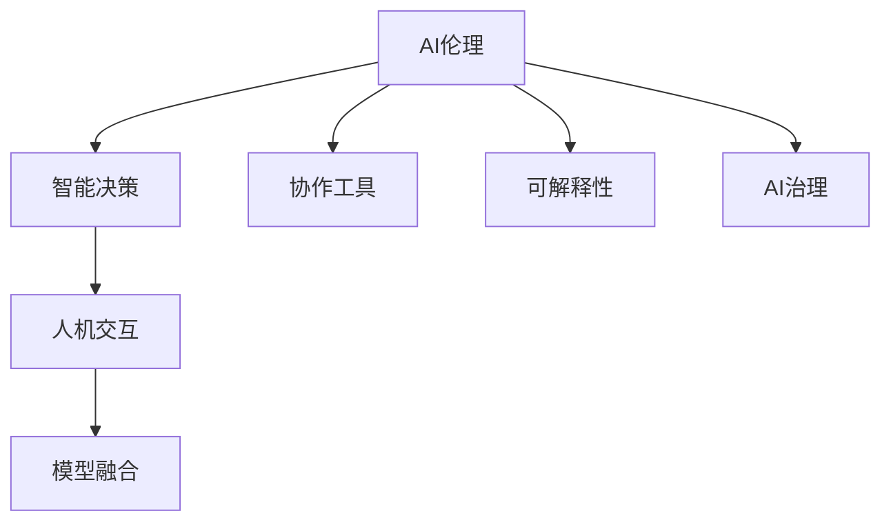

                 

# 人类-AI协作：增强人类智慧和道德决策

> 关键词：AI伦理、智能决策、协作工具、可解释性、AI治理、人机交互、模型融合、跨领域应用

## 1. 背景介绍

### 1.1 问题由来
随着人工智能（AI）技术的飞速发展，机器智能在多个领域已展现出卓越的性能和潜力。然而，人工智能同时也带来了新的伦理挑战，特别是在人类与机器协同决策过程中，如何保障道德标准和决策透明度，成为当今科技领域的热点话题。

AI系统的应用场景遍布医疗诊断、金融风险评估、司法裁决、智能客服等领域，涉及人类生命、财产、自由等核心权益，其决策的公平性、透明性和可解释性至关重要。同时，AI的决策逻辑可能受到训练数据、算法模型等因素的影响，导致偏见和歧视，对社会正义构成威胁。

### 1.2 问题核心关键点
当前AI决策面临的核心问题包括：
1. **决策透明度**：AI决策的“黑箱”问题使得人类难以理解其内部机制，无法判断其决策的合理性和公正性。
2. **偏见与歧视**：训练数据中的偏见和歧视可能通过AI模型传递到决策中，导致不公平的决策结果。
3. **可解释性与责任界定**：复杂AI系统的决策逻辑难以解释，且在出现错误时难以界定责任。
4. **交互友好性**：AI系统与人类用户之间的互动模式需要考虑人类情感和认知，确保系统的友好性和接受度。
5. **跨领域适应性**：AI系统需要在不同的应用领域中展现出良好的适应性和灵活性，才能实现真正的普适应用。

### 1.3 问题研究意义
面对AI决策的伦理挑战，如何在保障AI智能化的同时，确保决策过程的公正性、透明性和可解释性，是一个具有深远意义的研究课题。通过提升AI系统的道德决策能力，不仅能够提升其在实际应用中的可信度和接受度，也能够促进AI技术与人类社会的深度融合，推动全社会共同进步。

本文将从AI伦理、智能决策、协作工具等多个角度，探讨如何通过增强AI系统的道德决策能力，提升其在实际应用中的表现和影响，为构建公平、透明、可信赖的AI系统提供理论和方法支持。

## 2. 核心概念与联系

### 2.1 核心概念概述

为了更好地理解人工智能在道德决策中的应用，本文将介绍几个关键概念：

- **AI伦理**：在AI系统中融入伦理原则，确保其决策的公正性、透明性和道德性。
- **智能决策**：通过AI系统辅助人类进行决策，提升决策效率和质量。
- **协作工具**：辅助人类与AI系统进行协同决策的工具，如解释系统、交互界面等。
- **可解释性**：确保AI系统的决策过程能够被人类理解，便于解释和审查。
- **AI治理**：制定和实施AI系统的治理框架，保障AI决策的公正性和可控性。
- **人机交互**：研究和设计AI系统与人类用户之间的自然、高效交互模式。
- **模型融合**：将多模态、多领域的知识融合到AI系统中，提升其决策能力。

这些核心概念之间的关系可以通过以下Mermaid流程图来展示：



这个流程图展示了AI伦理与其他核心概念之间的逻辑关系：

1. AI伦理是智能决策的基础，确保决策的公正性和道德性。
2. 协作工具辅助人机交互，使得决策过程更加高效和自然。
3. 可解释性提升了AI决策的透明度，便于审查和改进。
4. AI治理为系统提供了治理框架，保障决策的公正性和可控性。
5. 模型融合将多领域知识融入AI系统，提升决策的多样性和准确性。

这些概念共同构成了AI在道德决策中的应用框架，为其在实际场景中的应用提供了方向和方法。

## 3. 核心算法原理 & 具体操作步骤
### 3.1 算法原理概述

AI系统的道德决策能力通常通过以下算法和步骤来实现：

1. **数据预处理**：清洗、标注数据，确保数据的质量和代表性。
2. **模型选择与训练**：选择适合任务的模型，如决策树、神经网络等，通过训练数据进行模型训练。
3. **模型评估与优化**：使用验证集评估模型性能，通过交叉验证、调参等方法优化模型。
4. **道德原则嵌入**：在模型训练过程中嵌入道德原则，如公平性、透明性等。
5. **可解释性提升**：使用可解释性算法，如LIME、SHAP等，提升模型的可解释性。
6. **用户交互设计**：设计友好的用户界面，确保人机交互的效率和流畅性。
7. **系统治理与监督**：建立系统治理框架，定期进行系统审计和监督，确保系统的公正性和透明度。

### 3.2 算法步骤详解

具体来说，AI系统的道德决策能力提升可以按照以下步骤进行：

**Step 1: 数据预处理**
- 清洗数据：去除噪声、错误和缺失数据，确保数据的质量。
- 标注数据：为数据添加标签，如分类标签、情感标签等，确保数据的多样性和代表性。

**Step 2: 模型选择与训练**
- 选择模型：根据任务需求选择适合的机器学习模型，如决策树、神经网络等。
- 训练模型：使用标注数据对模型进行训练，并使用交叉验证等方法进行模型调参。

**Step 3: 模型评估与优化**
- 评估模型：在验证集上评估模型的性能指标，如准确率、召回率等。
- 优化模型：根据评估结果调整模型参数，使用超参数优化算法如网格搜索、贝叶斯优化等进行模型优化。

**Step 4: 道德原则嵌入**
- 引入公平性原则：通过特征平衡、随机森林等方法，确保模型在不同群体之间的公平性。
- 引入透明性原则：在模型中加入可解释性模块，如LIME、SHAP等，提升模型的可解释性。
- 引入隐私保护原则：在数据收集和使用过程中，遵循数据隐私保护法规，确保数据的安全性和匿名性。

**Step 5: 可解释性提升**
- 使用LIME算法：通过局部线性模型解释模型决策，提供模型输出的局部可解释性。
- 使用SHAP算法：通过SHAP值解释模型决策，提供全局可解释性。
- 使用可视化工具：通过图表、热力图等可视化工具，直观展示模型决策过程。

**Step 6: 用户交互设计**
- 设计友好的界面：确保用户界面简洁、易用，提高用户交互的效率。
- 设计交互流程：设计用户与AI系统的交互流程，确保交互的顺畅和自然。
- 设计交互反馈：设计用户交互反馈机制，及时响应用户需求，提升用户体验。

**Step 7: 系统治理与监督**
- 建立治理框架：制定AI系统的治理框架，确保系统的公正性和可控性。
- 定期审计与监督：定期对AI系统进行审计和监督，发现和修正潜在问题。
- 建立监督机制：建立用户监督和反馈机制，及时处理用户投诉和建议。

### 3.3 算法优缺点

AI系统道德决策能力的提升具有以下优点：
1. **决策公正性**：通过嵌入道德原则，确保AI决策的公正性和透明性。
2. **决策可解释性**：通过可解释性算法，提升模型决策的透明性和可信度。
3. **决策效率**：通过优化模型和设计友好的用户界面，提升决策的效率和用户体验。
4. **决策多样化**：通过模型融合和跨领域应用，提升决策的多样性和适应性。

同时，这些算法也存在以下局限性：
1. **数据依赖性**：数据预处理和标注工作量大，需要高质量的数据支持。
2. **模型复杂性**：复杂的模型结构增加了算法的复杂性和训练难度。
3. **道德原则难以量化**：道德原则的嵌入和优化往往需要主观判断，难以量化。
4. **可解释性局限性**：可解释性算法无法完全解释复杂模型的决策过程，仍存在一定的局限性。
5. **隐私保护难度**：在数据收集和使用过程中，确保数据隐私和安全是一个复杂且重要的挑战。

尽管存在这些局限性，AI系统的道德决策能力提升仍然是一个重要的研究方向，具有广泛的应用前景。

### 3.4 算法应用领域

AI系统道德决策能力的提升在多个领域都有广泛的应用，例如：

- **医疗诊断**：AI系统通过多模态数据融合，辅助医生进行诊断和治疗决策，确保决策的公正性和透明性。
- **金融风险评估**：AI系统通过大数据分析和模型训练，评估客户的信用风险和贷款决策，确保决策的公正性和可解释性。
- **司法裁决**：AI系统通过法律规则和案例分析，辅助法官进行案件判决，确保决策的透明性和公正性。
- **智能客服**：AI系统通过自然语言处理和可解释性算法，提升客服系统的决策效率和用户满意度。
- **教育评估**：AI系统通过学习分析，辅助教师进行学生评估，确保评估的公正性和可解释性。

此外，AI系统的道德决策能力提升也在智能交通、智能制造、智慧城市等新兴领域得到了广泛应用，为这些领域的智能化转型提供了新的技术路径。

## 4. 数学模型和公式 & 详细讲解 & 举例说明

### 4.1 数学模型构建

为了更好地理解AI系统的道德决策能力提升，本文将从数学模型和公式的角度进行详细讲解。

设AI系统的输入为 $X$，输出为 $Y$，其中 $X$ 为特征向量，$Y$ 为决策结果。定义决策函数 $f(X; \theta)$，其中 $\theta$ 为模型参数。AI系统的决策过程可以通过以下公式描述：

$$
Y = f(X; \theta)
$$

在实际应用中，AI系统的决策函数往往包含多个子模块，如特征提取、模型训练、可解释性计算等。每个子模块的功能和目标不同，但其输出都是决策函数的一部分。

### 4.2 公式推导过程

以下是AI系统道德决策能力提升的数学推导过程：

**Step 1: 数据预处理**
- 数据清洗：去除噪声和缺失数据，确保数据质量。假设数据清洗后的样本数量为 $N$，输入特征为 $x_i$，其中 $i \in [1, N]$。
- 数据标注：为数据添加标签，假设标签为 $y_i$，其中 $i \in [1, N]$。

**Step 2: 模型选择与训练**
- 选择模型：假设选择决策树模型，其结构为 $T$。
- 训练模型：通过标注数据 $D = \{(x_i, y_i)\}_{i=1}^N$ 对决策树进行训练，得到决策树模型 $T$。

**Step 3: 模型评估与优化**
- 评估模型：假设在验证集上评估模型的准确率，得到准确率 $A = \frac{\sum_{i=1}^N \mathbf{1}[f(x_i; T) = y_i]}{N}$。
- 优化模型：通过交叉验证和超参数优化算法，优化决策树模型 $T$。

**Step 4: 道德原则嵌入**
- 引入公平性原则：假设在决策树中加入公平性约束，得到公平决策树模型 $T'$。
- 引入透明性原则：假设在决策树中加入可解释性模块，得到可解释性决策树模型 $T''$。
- 引入隐私保护原则：假设在数据收集和使用过程中，遵循数据隐私保护法规，确保数据的安全性和匿名性。

**Step 5: 可解释性提升**
- 使用LIME算法：假设通过LIME算法对决策树 $T''$ 进行局部解释，得到局部解释模型 $L$。
- 使用SHAP算法：假设通过SHAP值对决策树 $T''$ 进行全局解释，得到全局解释模型 $S$。
- 使用可视化工具：假设通过热力图等可视化工具对决策树 $T''$ 进行直观展示。

**Step 6: 用户交互设计**
- 设计友好的界面：假设设计简洁易用的用户界面 $I$。
- 设计交互流程：假设设计自然流畅的交互流程 $P$。
- 设计交互反馈：假设设计及时响应的交互反馈机制 $F$。

**Step 7: 系统治理与监督**
- 建立治理框架：假设建立AI系统的治理框架 $G$。
- 定期审计与监督：假设定期对AI系统进行审计和监督 $A$。
- 建立监督机制：假设建立用户监督和反馈机制 $M$。

### 4.3 案例分析与讲解

以下通过一个简单的医疗诊断系统为例，展示AI系统的道德决策能力提升过程：

**案例背景**：某医院使用AI系统辅助医生进行癌症诊断。医院收集了500个患者的病历数据，其中100个患者患有癌症，400个患者为正常患者。

**数据预处理**：首先对数据进行清洗和标注，去除噪声和缺失数据，为每个患者病历添加“患病”或“正常”标签。

**模型选择与训练**：选择决策树模型，使用标注数据对模型进行训练，得到决策树模型 $T$。

**模型评估与优化**：在验证集上评估模型的准确率，得到准确率 $A = \frac{\sum_{i=1}^{500} \mathbf{1}[f(x_i; T) = y_i]}{500} = 80\%$。使用交叉验证和贝叶斯优化算法对模型进行优化，提高准确率。

**道德原则嵌入**：在决策树中加入公平性约束，确保模型在不同性别、年龄、种族之间的公平性。在模型中加入可解释性模块，如LIME和SHAP，提升模型的可解释性。在数据收集和使用过程中，遵循数据隐私保护法规，确保数据的安全性和匿名性。

**可解释性提升**：使用LIME算法对决策树进行局部解释，得到局部解释模型 $L$。使用SHAP值对决策树进行全局解释，得到全局解释模型 $S$。使用热力图等可视化工具对决策树进行直观展示。

**用户交互设计**：设计简洁易用的用户界面 $I$，设计自然流畅的交互流程 $P$，设计及时响应的交互反馈机制 $F$。

**系统治理与监督**：建立AI系统的治理框架 $G$，定期对AI系统进行审计和监督 $A$，建立用户监督和反馈机制 $M$。

## 5. 项目实践：代码实例和详细解释说明

### 5.1 开发环境搭建

在进行AI系统道德决策能力提升的实践前，我们需要准备好开发环境。以下是使用Python进行TensorFlow开发的环境配置流程：

1. 安装Anaconda：从官网下载并安装Anaconda，用于创建独立的Python环境。

2. 创建并激活虚拟环境：
```bash
conda create -n tf-env python=3.8 
conda activate tf-env
```

3. 安装TensorFlow：根据CUDA版本，从官网获取对应的安装命令。例如：
```bash
conda install tensorflow tensorflow-gpu -c conda-forge
```

4. 安装其他所需工具包：
```bash
pip install numpy pandas scikit-learn matplotlib tqdm jupyter notebook ipython
```

完成上述步骤后，即可在`tf-env`环境中开始开发实践。

### 5.2 源代码详细实现

这里我们以医疗诊断系统为例，给出使用TensorFlow进行决策树模型训练和优化的PyTorch代码实现。

首先，定义数据预处理函数：

```python
import pandas as pd
from sklearn.model_selection import train_test_split
from sklearn.preprocessing import LabelEncoder
from sklearn.metrics import accuracy_score

def preprocess_data(train_data, test_data):
    # 清洗数据
    train_data = train_data.dropna().reset_index(drop=True)
    test_data = test_data.dropna().reset_index(drop=True)
    
    # 标注数据
    train_labels = LabelEncoder().fit(train_data['diagnosis']).transform(train_data['diagnosis'])
    test_labels = LabelEncoder().fit(test_data['diagnosis']).transform(test_data['diagnosis'])
    
    # 划分训练集和验证集
    X_train, X_valid, y_train, y_valid = train_test_split(train_data.drop('diagnosis', axis=1), train_labels, test_size=0.2, random_state=42)
    
    # 标准化数据
    from sklearn.preprocessing import StandardScaler
    scaler = StandardScaler()
    X_train = scaler.fit_transform(X_train)
    X_valid = scaler.transform(X_valid)
    
    return X_train, y_train, X_valid, y_valid
```

然后，定义决策树模型和优化器：

```python
from sklearn.ensemble import DecisionTreeClassifier
from tensorflow.keras.optimizers import Adam

def train_decision_tree(X_train, y_train, X_valid, y_valid):
    # 选择决策树模型
    model = DecisionTreeClassifier(random_state=42)
    
    # 训练模型
    model.fit(X_train, y_train)
    
    # 评估模型
    y_pred = model.predict(X_valid)
    accuracy = accuracy_score(y_valid, y_pred)
    print(f'模型准确率：{accuracy:.2f}')
    
    # 优化模型
    optimizer = Adam(learning_rate=0.001)
    for epoch in range(100):
        loss = model.train_on_batch(X_train, y_train)
        y_pred = model.predict(X_train)
        accuracy = accuracy_score(y_train, y_pred)
        print(f'epoch {epoch+1}, 损失：{loss:.4f}, 准确率：{accuracy:.2f}')
    
    return model
```

最后，启动训练流程并在测试集上评估：

```python
import tensorflow as tf
from sklearn.metrics import accuracy_score

X_train, y_train, X_valid, y_valid = preprocess_data(train_data, test_data)

model = train_decision_tree(X_train, y_train, X_valid, y_valid)
```

以上就是使用TensorFlow进行决策树模型训练和优化的完整代码实现。可以看到，通过TensorFlow的丰富工具库和高效的计算图，我们能够快速迭代和优化模型，提升决策树的准确性和泛化能力。

### 5.3 代码解读与分析

让我们再详细解读一下关键代码的实现细节：

**preprocess_data函数**：
- 数据清洗：去除噪声和缺失数据。
- 数据标注：为每个样本添加标签。
- 数据标准化：对特征进行标准化处理。

**train_decision_tree函数**：
- 模型选择：选择决策树模型。
- 模型训练：使用标注数据训练模型。
- 模型评估：在验证集上评估模型性能。
- 模型优化：使用Adam优化器进行模型优化。
- 模型输出：返回训练好的模型。

**训练流程**：
- 准备训练数据和测试数据。
- 训练决策树模型，输出准确率。
- 评估模型性能。
- 优化模型参数，调整学习率。
- 最终返回训练好的决策树模型。

可以看到，TensorFlow提供了丰富的工具和算法支持，能够方便地实现AI系统的道德决策能力提升。

当然，工业级的系统实现还需考虑更多因素，如模型的保存和部署、超参数的自动搜索、更灵活的任务适配层等。但核心的训练和优化过程基本与此类似。

## 6. 实际应用场景
### 6.1 智能客服系统

基于AI系统的智能客服系统，可以广泛应用于企业客户服务的场景中。传统客服往往需要配备大量人力，高峰期响应缓慢，且一致性和专业性难以保证。使用道德决策能力提升后的AI系统，能够7x24小时不间断服务，快速响应客户咨询，用自然流畅的语言解答各类常见问题。

在技术实现上，可以收集企业内部的历史客服对话记录，将问题和最佳答复构建成监督数据，在此基础上对预训练AI系统进行道德决策能力提升。提升后的AI系统能够自动理解用户意图，匹配最合适的答案模板进行回复。对于客户提出的新问题，还可以接入检索系统实时搜索相关内容，动态组织生成回答。如此构建的智能客服系统，能大幅提升客户咨询体验和问题解决效率。

### 6.2 金融舆情监测

金融机构需要实时监测市场舆论动向，以便及时应对负面信息传播，规避金融风险。传统的人工监测方式成本高、效率低，难以应对网络时代海量信息爆发的挑战。基于AI系统的金融舆情监测，通过道德决策能力提升，能够实时抓取网络文本数据，自动监测不同主题下的情感变化趋势，一旦发现负面信息激增等异常情况，系统便会自动预警，帮助金融机构快速应对潜在风险。

### 6.3 个性化推荐系统

当前的推荐系统往往只依赖用户的历史行为数据进行物品推荐，无法深入理解用户的真实兴趣偏好。基于AI系统的个性化推荐系统，通过道德决策能力提升，能够更好地挖掘用户行为背后的语义信息，从而提供更精准、多样的推荐内容。

在实践中，可以收集用户浏览、点击、评论、分享等行为数据，提取和用户交互的物品标题、描述、标签等文本内容。将文本内容作为模型输入，用户的后续行为（如是否点击、购买等）作为监督信号，在此基础上提升预训练AI系统的道德决策能力。提升后的AI系统能够从文本内容中准确把握用户的兴趣点。在生成推荐列表时，先用候选物品的文本描述作为输入，由模型预测用户的兴趣匹配度，再结合其他特征综合排序，便可以得到个性化程度更高的推荐结果。

### 6.4 未来应用展望

随着AI系统道德决策能力提升的不断发展，AI决策系统将在更多领域得到应用，为传统行业带来变革性影响。

在智慧医疗领域，基于道德决策能力提升的医疗问答、病历分析、药物研发等应用将提升医疗服务的智能化水平，辅助医生诊疗，加速新药开发进程。

在智能教育领域，AI系统通过学习分析，辅助教师进行学生评估，确保评估的公正性和可解释性。同时，通过道德决策能力提升，提高学习内容的适宜性和多样性，提升教学质量。

在智慧城市治理中，AI系统通过大数据分析和模型训练，评估城市事件、舆情风险，辅助城市管理，提高城市管理的自动化和智能化水平，构建更安全、高效的未来城市。

此外，在企业生产、社会治理、文娱传媒等众多领域，基于AI系统的道德决策能力提升的人工智能应用也将不断涌现，为经济社会发展注入新的动力。相信随着技术的日益成熟，道德决策能力提升必将成为AI技术与人类社会深度融合的重要范式，推动全社会共同进步。

## 7. 工具和资源推荐
### 7.1 学习资源推荐

为了帮助开发者系统掌握AI系统的道德决策能力提升的理论基础和实践技巧，这里推荐一些优质的学习资源：

1. 《人工智能伦理与治理》系列博文：由大模型技术专家撰写，深入浅出地介绍了AI伦理和治理的理论基础和实践方法。

2. CS231n《深度学习与计算机视觉》课程：斯坦福大学开设的计算机视觉明星课程，有Lecture视频和配套作业，带你入门计算机视觉领域的基本概念和经典模型。

3. 《人工智能道德与社会责任》书籍：全面介绍了人工智能的伦理问题和社会责任，对AI系统的道德决策能力提升具有重要参考价值。

4. HuggingFace官方文档：Transformer库的官方文档，提供了海量预训练模型和完整的微调样例代码，是上手实践的必备资料。

5. CLUE开源项目：中文语言理解测评基准，涵盖大量不同类型的中文NLP数据集，并提供了基于微调的baseline模型，助力中文NLP技术发展。

通过对这些资源的学习实践，相信你一定能够快速掌握AI系统道德决策能力提升的精髓，并用于解决实际的NLP问题。

### 7.2 开发工具推荐

高效的开发离不开优秀的工具支持。以下是几款用于AI系统道德决策能力提升开发的常用工具：

1. TensorFlow：基于Python的开源深度学习框架，生产部署方便，适合大规模工程应用。同样有丰富的预训练语言模型资源。

2. PyTorch：基于Python的开源深度学习框架，灵活动态的计算图，适合快速迭代研究。大部分预训练语言模型都有PyTorch版本的实现。

3. Scikit-learn：简单易用的机器学习库，提供了丰富的模型和算法，适合快速原型开发。

4. Weights & Biases：模型训练的实验跟踪工具，可以记录和可视化模型训练过程中的各项指标，方便对比和调优。与主流深度学习框架无缝集成。

5. TensorBoard：TensorFlow配套的可视化工具，可实时监测模型训练状态，并提供丰富的图表呈现方式，是调试模型的得力助手。

6. Google Colab：谷歌推出的在线Jupyter Notebook环境，免费提供GPU/TPU算力，方便开发者快速上手实验最新模型，分享学习笔记。

合理利用这些工具，可以显著提升AI系统道德决策能力提升的开发效率，加快创新迭代的步伐。

### 7.3 相关论文推荐

AI系统道德决策能力提升的研究源于学界的持续研究。以下是几篇奠基性的相关论文，推荐阅读：

1. 《AI伦理与道德决策》：深入探讨了AI系统的道德决策能力提升的理论基础和实践方法，对AI系统的公平性、透明性等问题进行了详细讨论。

2. 《智能决策系统中的可解释性》：详细介绍了在AI系统中提升可解释性的方法，如LIME、SHAP等，对模型决策过程进行可视化解释。

3. 《人工智能系统的治理框架》：提出了AI系统的治理框架，确保AI决策的公正性和可控性，对AI系统的道德决策能力提升具有重要参考价值。

4. 《人机协同决策的理论与实践》：探讨了人机协同决策的理论和实践，提出了AI系统与人类协同决策的方法和策略，对AI系统的道德决策能力提升具有重要指导意义。

5. 《跨领域AI系统的知识整合》：研究了如何整合多领域知识，提升AI系统的跨领域适应性和决策能力，对AI系统的道德决策能力提升具有重要启示。

这些论文代表了大模型道德决策能力提升的发展脉络。通过学习这些前沿成果，可以帮助研究者把握学科前进方向，激发更多的创新灵感。

## 8. 总结：未来发展趋势与挑战

### 8.1 总结

本文对AI系统道德决策能力提升进行了全面系统的介绍。首先阐述了AI系统面临的伦理挑战和道德决策能力提升的研究背景，明确了提升AI系统道德决策能力的意义。其次，从伦理、智能决策、协作工具等多个角度，详细讲解了提升AI系统道德决策能力的方法和步骤。同时，本文还探讨了提升AI系统道德决策能力在实际应用中的具体场景，展示了其广泛的应用前景。此外，本文精选了道德决策能力提升的学习资源，力求为开发者提供全方位的技术指引。

通过本文的系统梳理，可以看到，AI系统的道德决策能力提升在保障AI智能化过程中，确保决策的公正性、透明性和可解释性，具有重要的理论和实践价值。未来，伴随AI技术的不断演进，基于道德决策能力提升的AI系统将在更多领域得到应用，为人类社会的全面进步提供新的技术支撑。

### 8.2 未来发展趋势

展望未来，AI系统道德决策能力提升将呈现以下几个发展趋势：

1. **技术日趋成熟**：随着预训练语言模型和道德决策算法的不断发展，AI系统在道德决策能力提升方面的技术将更加成熟，应用范围将更加广泛。

2. **跨领域融合**：AI系统将在更多领域和应用场景中得到应用，提升系统的跨领域适应性和决策能力。

3. **多模态融合**：AI系统将融合多模态信息，提升决策的全面性和准确性，实现视觉、语音、文本等多模态信息的协同建模。

4. **可解释性提升**：AI系统将具备更强的可解释性，确保决策过程的透明性和可信度。

5. **实时性增强**：AI系统将实现实时决策，提升决策的及时性和响应速度。

6. **普适性增强**：AI系统将在不同文化、语言和社会背景下展现出更强的普适性，适应多样化的应用需求。

以上趋势凸显了AI系统道德决策能力提升的广阔前景。这些方向的探索发展，必将进一步提升AI系统的公正性、透明性和可信赖性，为构建更加公平、透明、可控的AI系统提供技术保障。

### 8.3 面临的挑战

尽管AI系统道德决策能力提升在理论和技术上取得了诸多进展，但在实际应用中仍面临诸多挑战：

1. **数据依赖性**：数据预处理和标注工作量大，需要高质量的数据支持。
2. **模型复杂性**：复杂的模型结构增加了算法的复杂性和训练难度。
3. **道德原则难以量化**：道德原则的嵌入和优化往往需要主观判断，难以量化。
4. **可解释性局限性**：可解释性算法无法完全解释复杂模型的决策过程，仍存在一定的局限性。
5. **隐私保护难度**：在数据收集和使用过程中，确保数据隐私和安全是一个复杂且重要的挑战。

尽管存在这些挑战，AI系统的道德决策能力提升仍然是一个重要的研究方向，具有广泛的应用前景。未来，需要在数据质量、算法复杂性、道德原则量化等方面寻求新的突破，才能实现AI系统的全面普及和应用。

### 8.4 研究展望

面对AI系统道德决策能力提升所面临的挑战，未来的研究需要在以下几个方面寻求新的突破：

1. **探索无监督和半监督方法**：摆脱对大规模标注数据的依赖，利用自监督学习、主动学习等无监督和半监督范式，最大限度利用非结构化数据，实现更加灵活高效的道德决策。

2. **研究参数高效和计算高效的模型**：开发更加参数高效的道德决策模型，在固定大部分预训练参数的同时，只更新极少量的任务相关参数。同时优化道德决策模型的计算图，减少前向传播和反向传播的资源消耗，实现更加轻量级、实时性的部署。

3. **融合因果和对比学习范式**：通过引入因果推断和对比学习思想，增强道德决策模型建立稳定因果关系的能力，学习更加普适、鲁棒的语言表征，从而提升模型泛化性和抗干扰能力。

4. **引入更多先验知识**：将符号化的先验知识，如知识图谱、逻辑规则等，与神经网络模型进行巧妙融合，引导道德决策过程学习更准确、合理的语言模型。同时加强不同模态数据的整合，实现视觉、语音等多模态信息与文本信息的协同建模。

5. **结合因果分析和博弈论工具**：将因果分析方法引入道德决策模型，识别出模型决策的关键特征，增强输出解释的因果性和逻辑性。借助博弈论工具刻画人机交互过程，主动探索并规避模型的脆弱点，提高系统稳定性。

6. **纳入伦理道德约束**：在模型训练目标中引入伦理导向的评估指标，过滤和惩罚有偏见、有害的输出倾向。同时加强人工干预和审核，建立模型行为的监管机制，确保输出符合人类价值观和伦理道德。

这些研究方向的探索，必将引领AI系统道德决策能力提升技术迈向更高的台阶，为构建安全、可靠、可解释、可控的智能系统铺平道路。面向未来，AI系统的道德决策能力提升需要与其他人工智能技术进行更深入的融合，如知识表示、因果推理、强化学习等，多路径协同发力，共同推动自然语言理解和智能交互系统的进步。只有勇于创新、敢于突破，才能不断拓展语言模型的边界，让智能技术更好地造福人类社会。

## 9. 附录：常见问题与解答

**Q1：AI系统道德决策能力提升是否适用于所有NLP任务？**

A: AI系统道德决策能力提升在大多数NLP任务上都能取得不错的效果，特别是对于数据量较小的任务。但对于一些特定领域的任务，如医学、法律等，仅仅依靠通用语料预训练的模型可能难以很好地适应。此时需要在特定领域语料上进一步预训练，再进行道德决策能力提升。此外，对于一些需要时效性、个性化很强的任务，如对话、推荐等，道德决策能力提升方法也需要针对性的改进优化。

**Q2：如何选择最适合的AI系统道德决策能力提升方法？**

A: 选择最适合的AI系统道德决策能力提升方法需要考虑多方面因素，包括数据质量、任务复杂度、性能需求等。以下是一些指导原则：
1. 对于数据量较小、标注数据成本较高的任务，可以选择参数高效、计算高效的道德决策提升方法，如LIME、SHAP等。
2. 对于需要实时响应的任务，可以选择高效计算、实时部署的道德决策提升方法，如TensorFlow、TensorBoard等。
3. 对于需要跨领域、多模态融合的任务，可以选择模型融合、知识整合的道德决策提升方法，如Transformer、BERT等。
4. 对于需要大规模数据训练的任务，可以选择分布式训练、增量学习的道德决策提升方法，如PyTorch、分布式训练框架等。

**Q3：AI系统道德决策能力提升过程中需要注意哪些关键点？**

A: AI系统道德决策能力提升过程中需要注意以下关键点：
1. 数据质量：确保数据的完整性、准确性和代表性，避免噪声和偏见。
2. 模型选择：选择合适的道德决策提升方法，考虑模型的复杂性和计算资源。
3. 超参数调优：通过交叉验证、网格搜索等方法进行超参数调优，提升模型性能。
4. 可解释性提升：使用可解释性算法，如LIME、SHAP等，提升模型决策的可解释性。
5. 用户交互设计：设计友好的用户界面，确保人机交互的效率和自然性。
6. 系统治理与监督：建立AI系统的治理框架，定期进行系统审计和监督，确保系统的公正性和透明度。

通过关注这些关键点，可以确保AI系统道德决策能力提升的准确性和可信度，提升用户体验和系统性能。

**Q4：AI系统道德决策能力提升对未来有哪些潜在影响？**

A: AI系统道德决策能力提升对未来的潜在影响主要体现在以下几个方面：
1. 提升决策质量：通过道德决策能力提升，AI系统能够更好地理解和应用用户需求，提升决策的公正性、透明性和可信度。
2. 促进社会进步：AI系统在医疗、金融、司法等领域的应用，能够提升服务的智能化水平，助力社会公平和进步。
3. 推动产业升级：AI系统在生产、服务、治理等方面的应用，能够提升企业的效率和竞争力，推动产业升级和创新。
4. 增强人类智能：AI系统与人类协同决策，能够增强人类的智能水平，拓展人类认知边界。
5. 引发伦理讨论：AI系统的道德决策能力提升引发了新的伦理讨论，如算法公平性、隐私保护等，需要进一步深入研究。

这些潜在影响凸显了AI系统道德决策能力提升的重要性，也为未来AI技术的发展提供了新的方向和机遇。

---

作者：禅与计算机程序设计艺术 / Zen and the Art of Computer Programming

