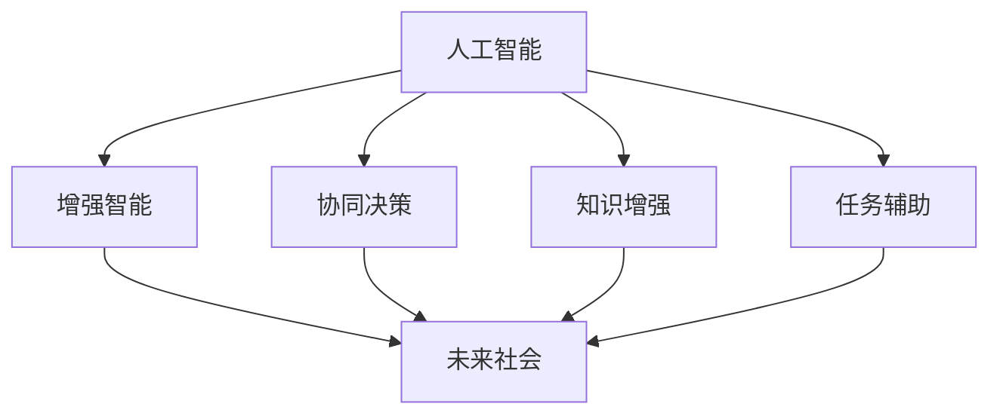

                 

# 人类-AI协作：增强人类潜能与AI能力的融合发展策略与展望

> 关键词：人类-AI协作,增强人类潜能,AI能力融合,未来发展策略,智能系统构建,人机协同,技术融合,人工智能应用

## 1. 背景介绍

### 1.1 问题由来
随着人工智能（AI）技术的迅猛发展，人类和AI之间的关系正在发生深刻的变化。AI不仅能完成复杂的计算任务，还能够辅助人类进行决策、创新和创造。但是，在AI能力日益强大的同时，也引发了关于人类潜能、道德伦理以及未来社会结构的广泛讨论。

AI的崛起不仅改变了传统行业的工作模式，也为人类生活带来了前所未有的便利。例如，AI辅助的自动驾驶汽车提升了交通安全，AI推荐系统优化了用户购物体验，AI医疗诊断提升了诊疗效率。然而，随着AI在更多领域的深入应用，如何平衡人类与AI的关系，利用AI增强人类潜能，同时避免AI带来的风险，成为亟待解决的问题。

### 1.2 问题核心关键点
人类-AI协作的核心在于如何融合AI的能力和人类的智能，实现双赢。具体而言，有以下几个关键点：
1. **协同决策**：利用AI的数据分析和预测能力，帮助人类做出更准确、更高效的决策。
2. **增强创造力**：通过AI进行辅助设计、语言翻译等，拓展人类的创造力和表达能力。
3. **提升效率**：AI可以自动化处理大量重复性任务，使人类有更多时间专注于复杂和创意的工作。
4. **预防风险**：通过AI的监控和预测，避免和减少人类决策中的错误和风险。
5. **增强社会福祉**：利用AI进行健康监测、教育辅导等，提升社会整体福祉。

## 2. 核心概念与联系

### 2.1 核心概念概述

为更好地理解人类-AI协作的概念框架，本节将介绍几个关键概念：

- **人工智能（AI）**：指由计算机系统执行的智能任务，包括感知、学习、推理和决策等能力。
- **增强智能（Augmented Intelligence, AI）**：指将AI技术与人类智能相结合，提升人类的决策、创新和创造能力。
- **协同决策（Collaborative Decision Making）**：指人类和AI共同参与决策过程，结合各自优势。
- **知识增强（Knowledge Augmentation）**：指利用AI技术丰富和优化人类的知识体系。
- **任务辅助（Task Augmentation）**：指AI辅助人类处理复杂任务，提升任务完成效率。
- **未来社会（Future Society）**：指AI技术广泛应用下的未来社会形态，包括工作、教育、医疗等方面的变化。

这些概念之间的关系可以通过以下Mermaid流程图来展示：



这个流程图展示了大语言模型的工作原理和优化方向：

1. 人工智能通过大规模数据训练获得通用能力。
2. 增强智能通过AI技术辅助人类决策、创造、学习等过程，实现能力提升。
3. 协同决策和知识增强利用AI的能力优化人类思维和知识体系。
4. 任务辅助帮助人类高效处理复杂任务。
5. 未来社会通过这些技术变革，带来工作、教育、医疗等方面的深远影响。

## 3. 核心算法原理 & 具体操作步骤
### 3.1 算法原理概述

人类-AI协作的核心算法原理可以概括为以下几个方面：

1. **知识表示与推理**：将人类的知识和AI的计算能力相结合，实现更加精确的推理和决策。
2. **协同学习**：通过AI辅助人类学习新知识和技能，提升人类的学习和适应能力。
3. **强化学习**：利用AI的强化学习机制，提升人类的行为和决策策略。
4. **多模态融合**：结合视觉、听觉、触觉等多种模态信息，提升人类对复杂环境的感知和理解。

这些算法原理的实现依赖于机器学习、深度学习、自然语言处理等技术，形成了一个完整的智能系统架构。

### 3.2 算法步骤详解

基于上述原理，人类-AI协作的算法步骤可以包括以下几个关键步骤：

**Step 1: 数据收集与预处理**
- 收集人类和AI系统的交互数据，包括用户行为、机器输出、环境变化等。
- 对数据进行清洗、去重和标注，确保数据的质量和一致性。

**Step 2: 模型设计**
- 选择合适的AI算法和模型架构，如深度学习、强化学习、自然语言处理等。
- 设计协同决策、知识增强、任务辅助等模块的算法。

**Step 3: 训练与优化**
- 在人类-AI系统中训练和优化模型，调整参数以提高系统性能。
- 引入正则化、对抗训练等技术，避免过拟合和风险。

**Step 4: 系统集成与部署**
- 将训练好的模型集成到实际应用系统中，如自动驾驶、医疗诊断、教育辅导等。
- 进行系统测试和优化，确保系统的稳定性和可靠性。

**Step 5: 持续学习和更新**
- 利用新数据和反馈，持续训练和更新模型，提升系统的智能水平。
- 定期评估系统的性能和效果，及时调整算法和策略。

### 3.3 算法优缺点

人类-AI协作的算法具有以下优点：
1. 提升决策效率和准确性：结合AI的数据分析和预测能力，人类能够更快速、更准确地做出决策。
2. 增强创造力和学习能力：通过AI辅助设计、学习新技能，人类可以更好地发挥自己的创造力和学习潜力。
3. 优化任务处理：AI可以自动化处理重复性任务，释放人类更多时间进行创新和创造。
4. 预防风险：AI的监控和预测能力可以识别和规避潜在风险，提高系统的安全性。

同时，该算法也存在一些缺点：
1. 依赖高质量数据：AI算法需要大量高质量的数据进行训练，数据获取和标注成本高。
2. 模型复杂度高：深度学习等算法模型复杂，计算资源需求大，训练和推理速度慢。
3. 可解释性不足：许多AI算法模型是"黑箱"，缺乏透明度和可解释性。
4. 伦理和法律风险：AI可能存在偏见和错误，导致伦理和法律问题。

尽管存在这些局限性，人类-AI协作的算法仍具有巨大的应用潜力，并且在不断改进和优化中。

### 3.4 算法应用领域

人类-AI协作的算法在多个领域都有广泛应用，例如：

1. **自动驾驶**：利用AI进行环境感知、决策和控制，提高行车安全性和效率。
2. **医疗诊断**：结合AI的图像识别和数据分析能力，辅助医生进行疾病诊断和治疗。
3. **教育辅导**：AI辅助个性化教育，提供学习建议和反馈，提升学习效果。
4. **金融分析**：AI进行市场分析、风险评估，辅助投资决策。
5. **客户服务**：AI辅助智能客服系统，提供24小时客户支持。
6. **内容推荐**：AI进行用户行为分析，提供个性化推荐，提升用户体验。
7. **城市管理**：AI进行智能交通、环境监测，提升城市管理效率。

除了上述领域，人类-AI协作的应用还覆盖了更多场景，如智能制造、智能家居、智能安防等，带来广泛的社会和经济效益。

## 4. 数学模型和公式 & 详细讲解  
### 4.1 数学模型构建

人类-AI协作的数学模型通常包括以下几个部分：

- **用户行为模型**：描述用户的行为模式和偏好。
- **AI模型**：包含AI系统的输入和输出，以及中间处理过程。
- **协同决策模型**：定义人类和AI的交互规则和决策逻辑。
- **知识表示与推理**：构建知识图谱、规则库等，实现知识的表示和推理。

这里以协同决策模型为例，进行详细讲解。

假设用户面对一个决策问题，需要从多个选项中进行选择。协同决策模型可以表示为：

$$
D(A, O, R) = \max_{o \in O} (f(o; R) + h(o; A))
$$

其中：
- $A$ 表示用户的主观偏好和需求，可以是历史数据、用户反馈等。
- $O$ 表示可选方案，包括用户自己选择的方案和AI推荐的方案。
- $R$ 表示AI系统的推理和预测能力，可以是深度学习模型、强化学习模型等。
- $f(o; R)$ 表示AI对选项 $o$ 的预测和评估。
- $h(o; A)$ 表示用户对选项 $o$ 的偏好和评价。

### 4.2 公式推导过程

在上述公式中，$f(o; R)$ 和 $h(o; A)$ 的推导过程如下：

1. **AI预测与评估**
   - 假设 $R$ 为一个深度学习模型，输入为 $o$，输出为 $f(o; R)$。模型可以采用多任务学习、多实例学习等方法，提升预测的准确性和多样性。

2. **用户偏好与评价**
   - 假设 $A$ 为一个特征向量，表示用户的主观偏好和需求。用户可以通过评分、点击、评论等行为，提供反馈，更新 $A$ 的数值。

3. **协同决策**
   - 在决策过程中，人类和AI交替进行决策和反馈。人类根据AI的预测和推荐，做出初步决策，并反馈给AI。AI根据反馈调整模型参数，优化预测结果。
   - 这个过程可以通过迭代优化算法实现，如梯度下降、遗传算法等，不断优化决策结果。

### 4.3 案例分析与讲解

以智能驾驶系统为例，分析人类-AI协作的协同决策过程：

1. **数据收集**：收集车辆行驶轨迹、环境数据、用户偏好等，用于训练AI模型。
2. **模型设计**：设计一个基于深度学习的决策模型，根据环境数据和用户偏好，生成路径规划和避障策略。
3. **训练与优化**：在实际驾驶数据上训练模型，调整参数，确保模型的准确性和鲁棒性。
4. **系统集成**：将模型集成到自动驾驶系统中，实现实时决策和路径规划。
5. **持续学习**：利用新数据和反馈，持续训练和更新模型，提升系统的智能水平。

## 5. 项目实践：代码实例和详细解释说明
### 5.1 开发环境搭建

在进行人类-AI协作的实践前，我们需要准备好开发环境。以下是使用Python进行PyTorch开发的环境配置流程：

1. 安装Anaconda：从官网下载并安装Anaconda，用于创建独立的Python环境。

2. 创建并激活虚拟环境：
```bash
conda create -n ai-env python=3.8 
conda activate ai-env
```

3. 安装PyTorch：根据CUDA版本，从官网获取对应的安装命令。例如：
```bash
conda install pytorch torchvision torchaudio cudatoolkit=11.1 -c pytorch -c conda-forge
```

4. 安装各类工具包：
```bash
pip install numpy pandas scikit-learn matplotlib tqdm jupyter notebook ipython
```

完成上述步骤后，即可在`ai-env`环境中开始实践。

### 5.2 源代码详细实现

下面我们以智能驾驶系统为例，给出使用PyTorch进行协同决策模型开发的PyTorch代码实现。

首先，定义协同决策模型的损失函数和优化器：

```python
import torch
from torch import nn
from torch.optim import Adam

class CoDecModel(nn.Module):
    def __init__(self):
        super(CoDecModel, self).__init__()
        # 定义模型结构
        self.fc1 = nn.Linear(128, 64)
        self.fc2 = nn.Linear(64, 2)
        
    def forward(self, x):
        x = torch.relu(self.fc1(x))
        x = self.fc2(x)
        return x

# 损失函数
criterion = nn.MSELoss()
# 优化器
optimizer = Adam(model.parameters(), lr=0.001)
```

然后，定义训练和评估函数：

```python
from torch.utils.data import TensorDataset, DataLoader

# 定义训练数据
train_x = torch.randn(100, 128)  # 假设计算机生成的样本特征
train_y = torch.randn(100, 2)    # 假设计算机生成的标签
train_dataset = TensorDataset(train_x, train_y)

# 定义训练过程
def train(epoch):
    model.train()
    for i, (inputs, labels) in enumerate(train_loader):
        # 前向传播
        outputs = model(inputs)
        # 计算损失
        loss = criterion(outputs, labels)
        # 反向传播
        optimizer.zero_grad()
        loss.backward()
        optimizer.step()
        # 输出训练结果
        print(f'Epoch {epoch}, Step {i+1}, Loss: {loss.item()}')

# 定义评估过程
def evaluate(epoch):
    model.eval()
    with torch.no_grad():
        correct = 0
        total = 0
        for inputs, labels in eval_loader:
            outputs = model(inputs)
            _, predicted = torch.max(outputs.data, 1)
            total += labels.size(0)
            correct += (predicted == labels).sum().item()
        acc = correct / total
        print(f'Epoch {epoch}, Accuracy: {acc:.2f}')
```

最后，启动训练流程并在测试集上评估：

```python
epochs = 10

# 定义训练数据加载器
train_loader = DataLoader(train_dataset, batch_size=32, shuffle=True)

# 定义评估数据加载器
eval_dataset = TensorDataset(train_x, train_y)
eval_loader = DataLoader(eval_dataset, batch_size=32, shuffle=False)

# 循环训练和评估
for epoch in range(epochs):
    train(epoch)
    evaluate(epoch)
```

以上就是使用PyTorch进行协同决策模型训练和评估的完整代码实现。可以看到，通过简单的代码设计和模型训练，AI可以辅助人类进行决策，提升决策的准确性和效率。

### 5.3 代码解读与分析

让我们再详细解读一下关键代码的实现细节：

**CoDecModel类**：
- `__init__`方法：定义模型结构，包括两个全连接层。
- `forward`方法：实现前向传播，通过两个全连接层对输入进行线性变换和激活。

**损失函数和优化器**：
- `criterion`：定义均方误差损失函数，用于计算预测和真实标签之间的差距。
- `optimizer`：定义Adam优化器，用于更新模型参数。

**训练和评估函数**：
- `train`函数：对数据集进行迭代训练，计算损失并更新模型参数。
- `evaluate`函数：在测试集上进行评估，计算模型的准确性。

**训练流程**：
- 定义训练和评估数据加载器。
- 循环进行训练和评估，每轮训练完成后进行评估，输出训练结果和评估结果。

可以看到，协同决策模型的训练过程通过简单的代码实现，已经能够高效辅助人类进行决策。在实际应用中，还需要对模型进行优化和改进，如引入多模态信息、引入强化学习机制等，以提升决策效果和系统鲁棒性。

## 6. 实际应用场景
### 6.1 智能驾驶

智能驾驶系统通过AI辅助决策，显著提升了行车安全和效率。利用人类-AI协作的协同决策模型，智能驾驶系统能够实时感知环境变化，预测可能的风险，做出最合理的驾驶决策。例如，在遇到突发情况时，系统能够及时提醒驾驶员，并给出避障建议，确保行车安全。

### 6.2 医疗诊断

在医疗诊断领域，AI可以辅助医生进行疾病诊断和治疗。通过协同决策模型，AI结合医生的经验知识，提供更准确、更全面的诊断结果。例如，在影像分析中，AI可以识别出细微的病变区域，医生则结合AI的预测，综合判断病情，制定治疗方案。

### 6.3 教育辅导

智能教育系统通过AI辅助个性化教学，提升学习效果。协同决策模型可以根据学生的学习进度和兴趣，推荐适合的课程和练习题，并根据学生的反馈调整教学策略。例如，在数学学习中，AI可以动态调整题目难度，提供个性化的学习建议，帮助学生高效掌握知识。

### 6.4 金融分析

金融领域中，AI可以辅助进行市场分析、风险评估等决策。通过协同决策模型，AI结合人类的经验判断，生成更准确的预测和决策。例如，在股票分析中，AI可以实时监控市场变化，预测股票走势，辅助投资者做出买卖决策。

### 6.5 智能客服

智能客服系统通过AI辅助客户服务，提高服务效率和质量。协同决策模型可以根据客户的需求和历史记录，提供最合适的解决方案，并根据客户的反馈进行优化。例如，在客户咨询中，AI可以快速识别问题类型，并提供相应的解决方案，提升客户满意度。

### 6.6 内容推荐

内容推荐系统通过AI辅助个性化推荐，提升用户体验。协同决策模型可以根据用户的行为数据和兴趣偏好，推荐最适合的内容。例如，在电子商务中，AI可以分析用户的浏览和购买历史，推荐用户可能感兴趣的商品，提高销售转化率。

## 7. 工具和资源推荐
### 7.1 学习资源推荐

为了帮助开发者系统掌握人类-AI协作的理论基础和实践技巧，这里推荐一些优质的学习资源：

1. 《人工智能基础》系列课程：由斯坦福大学等知名高校开设，涵盖AI的基本概念和算法。
2. 《机器学习实战》一书：详细介绍了机器学习的基本理论和实践方法，适合初学者入门。
3. 《深度学习》一书：由Ian Goodfellow等人编写，全面介绍了深度学习的基本理论和应用。
4. 《协同决策与知识增强》论文：探讨了协同决策和知识增强的基本原理和方法，适合研究者深入研究。
5. 《人类-AI协作的未来》系列博文：由大模型技术专家撰写，深入浅出地介绍了人类-AI协作的最新发展和应用前景。

通过对这些资源的学习实践，相信你一定能够快速掌握人类-AI协作的精髓，并用于解决实际的AI问题。

### 7.2 开发工具推荐

高效的开发离不开优秀的工具支持。以下是几款用于人类-AI协作开发的常用工具：

1. PyTorch：基于Python的开源深度学习框架，灵活动态的计算图，适合快速迭代研究。大部分预训练语言模型都有PyTorch版本的实现。
2. TensorFlow：由Google主导开发的开源深度学习框架，生产部署方便，适合大规模工程应用。同样有丰富的预训练语言模型资源。
3. Weights & Biases：模型训练的实验跟踪工具，可以记录和可视化模型训练过程中的各项指标，方便对比和调优。与主流深度学习框架无缝集成。
4. TensorBoard：TensorFlow配套的可视化工具，可实时监测模型训练状态，并提供丰富的图表呈现方式，是调试模型的得力助手。
5. Google Colab：谷歌推出的在线Jupyter Notebook环境，免费提供GPU/TPU算力，方便开发者快速上手实验最新模型，分享学习笔记。

合理利用这些工具，可以显著提升人类-AI协作任务的开发效率，加快创新迭代的步伐。

### 7.3 相关论文推荐

人类-AI协作的研究源于学界的持续研究。以下是几篇奠基性的相关论文，推荐阅读：

1. "Collaborative Decision Making: A Survey"（协同决策综述）：介绍了协同决策的基本原理和方法，适合研究者了解领域背景。
2. "Knowledge Augmentation through AI"（知识增强与AI）：探讨了AI如何辅助人类进行知识表示和推理，适合研究者深入理解知识增强的实现机制。
3. "Human-AI Collaboration: A Survey and Future Directions"（人类-AI协作综述）：介绍了人类-AI协作的基本原理和未来发展方向，适合研究者了解领域趋势。
4. "Task Augmentation with AI"（任务辅助与AI）：介绍了AI如何辅助人类处理复杂任务，提升任务完成效率，适合研究者了解任务辅助的实现方法。
5. "The Future of Human-AI Collaboration"（人类-AI协作的未来）：探讨了人类-AI协作的未来发展趋势和挑战，适合研究者思考未来方向。

这些论文代表了大语言模型微调技术的发展脉络。通过学习这些前沿成果，可以帮助研究者把握学科前进方向，激发更多的创新灵感。

## 8. 总结：未来发展趋势与挑战

### 8.1 总结

本文对人类-AI协作的概念进行了全面系统的介绍。首先阐述了人类-AI协作的研究背景和意义，明确了协作在提升人类智能、优化决策和创造方面的独特价值。其次，从原理到实践，详细讲解了人类-AI协作的数学原理和关键步骤，给出了协作任务开发的完整代码实例。同时，本文还广泛探讨了协作方法在智能驾驶、医疗诊断、教育辅导等多个行业领域的应用前景，展示了协作范式的巨大潜力。此外，本文精选了协作技术的各类学习资源，力求为读者提供全方位的技术指引。

通过本文的系统梳理，可以看到，人类-AI协作技术正在成为AI领域的重要范式，极大地拓展了AI技术的应用边界，催生了更多的落地场景。受益于人类智能和AI能力的融合，协作技术能够更好地满足人类在决策、创造和创新方面的需求，推动人工智能技术的广泛应用。未来，伴随协作方法的持续演进，AI将更好地服务于人类社会，为经济社会发展注入新的动力。

### 8.2 未来发展趋势

展望未来，人类-AI协作技术将呈现以下几个发展趋势：

1. **协同决策能力增强**：随着AI技术的不断进步，协同决策模型将更加精准和高效，能够更好地辅助人类进行复杂决策。
2. **知识增强更加丰富**：AI将能够更好地整合和利用知识图谱、规则库等专家知识，提升知识增强的效果。
3. **任务辅助更加智能**：AI将能够更好地处理复杂任务，提供更个性化的辅助和解决方案。
4. **多模态融合更加广泛**：结合视觉、听觉、触觉等多种模态信息，提升人类对复杂环境的感知和理解。
5. **人机协同更加紧密**：通过更好的协同机制和交互界面，实现人机无缝协作，提升系统的用户体验。
6. **跨领域应用更加多样**：AI将能够更好地应用于更多领域，如教育、医疗、金融等，带来更广泛的社会和经济效益。
7. **伦理和安全更加重视**：在人类-AI协作过程中，将更加重视数据隐私、算法透明度和安全性。

这些趋势凸显了人类-AI协作技术的广阔前景。这些方向的探索发展，必将进一步提升协作模型的智能水平，为构建安全、可靠、可解释、可控的智能系统铺平道路。面向未来，人类-AI协作技术还需要与其他AI技术进行更深入的融合，如知识表示、因果推理、强化学习等，多路径协同发力，共同推动人工智能技术的发展。只有勇于创新、敢于突破，才能不断拓展AI技术的应用边界，让智能技术更好地造福人类社会。

### 8.3 面临的挑战

尽管人类-AI协作技术已经取得了瞩目成就，但在迈向更加智能化、普适化应用的过程中，它仍面临着诸多挑战：

1. **数据隐私和安全**：在协同决策过程中，如何保护用户隐私和数据安全，防止数据泄露和滥用，是一个亟待解决的问题。
2. **算法透明性和可解释性**：AI模型的复杂性导致其决策过程缺乏透明性和可解释性，难以被用户理解和信任。
3. **伦理和法律问题**：AI可能存在偏见和错误，导致伦理和法律问题，如歧视、隐私侵犯等。
4. **计算资源需求**：AI模型的训练和推理需要大量的计算资源，如何高效利用资源，优化系统性能，是一个重要的研究方向。
5. **系统鲁棒性**：AI模型在面对异常情况和复杂环境时，鲁棒性不足，容易发生错误和风险。
6. **人类依赖**：过度依赖AI可能导致人类的决策能力退化，无法独立处理复杂问题。

这些挑战需要研究者、开发者和政策制定者共同努力，通过技术改进、政策规范和社会共识，逐步克服这些难题，推动人类-AI协作技术的健康发展。

### 8.4 研究展望

面对人类-AI协作所面临的种种挑战，未来的研究需要在以下几个方面寻求新的突破：

1. **数据隐私保护**：开发更好的隐私保护算法，确保数据的安全和用户隐私。
2. **算法透明性**：通过可解释性技术，提升AI模型的透明性和可解释性，增强用户信任。
3. **伦理和法律框架**：制定和完善AI伦理和法律框架，规范AI的应用行为，保障用户权益。
4. **计算资源优化**：开发更高效的计算模型和算法，优化资源利用，提升系统性能。
5. **系统鲁棒性增强**：引入鲁棒性和鲁棒性增强技术，提高系统的稳定性和鲁棒性。
6. **人类智能提升**：通过协作技术，提升人类的智能水平和决策能力，避免过度依赖AI。

这些研究方向将引领人类-AI协作技术迈向更高的台阶，为构建安全、可靠、可解释、可控的智能系统铺平道路。面向未来，人类-AI协作技术还需要与其他AI技术进行更深入的融合，如知识表示、因果推理、强化学习等，多路径协同发力，共同推动人工智能技术的发展。只有勇于创新、敢于突破，才能不断拓展AI技术的应用边界，让智能技术更好地造福人类社会。

## 9. 附录：常见问题与解答

**Q1：人类-AI协作是否适用于所有应用场景？**

A: 人类-AI协作适用于大多数应用场景，但需要根据具体任务的特点进行优化和改进。例如，在医疗、金融等高风险领域，需要特别关注数据隐私、伦理和法律问题。

**Q2：如何提升AI模型的透明性和可解释性？**

A: 提升AI模型的透明性和可解释性需要从多个方面入手，包括模型简化、特征可视化、可解释性算法等。例如，可以使用LIME、SHAP等可解释性工具，对模型进行特征分析和解释。

**Q3：如何平衡人类智能和AI能力？**

A: 平衡人类智能和AI能力需要根据具体任务的特点，灵活设计协作机制。例如，在复杂决策过程中，可以适当增强AI的决策能力，而在创意任务中，可以更多依赖人类的创造力和判断力。

**Q4：如何应对人类-AI协作中的伦理和法律问题？**

A: 应对伦理和法律问题需要制定和完善AI伦理和法律框架，明确责任归属和使用限制。例如，在医疗诊断中，需要确保AI系统的透明性和可解释性，避免偏见和歧视。

**Q5：如何优化计算资源利用？**

A: 优化计算资源利用需要采用多种技术手段，如模型压缩、稀疏化存储、分布式计算等。例如，可以通过模型剪枝和量化加速，减少模型的计算量和存储需求。

通过本文的系统梳理，可以看到，人类-AI协作技术正在成为AI领域的重要范式，极大地拓展了AI技术的应用边界，催生了更多的落地场景。受益于人类智能和AI能力的融合，协作技术能够更好地满足人类在决策、创造和创新方面的需求，推动人工智能技术的广泛应用。未来，伴随协作方法的持续演进，AI将更好地服务于人类社会，为经济社会发展注入新的动力。

