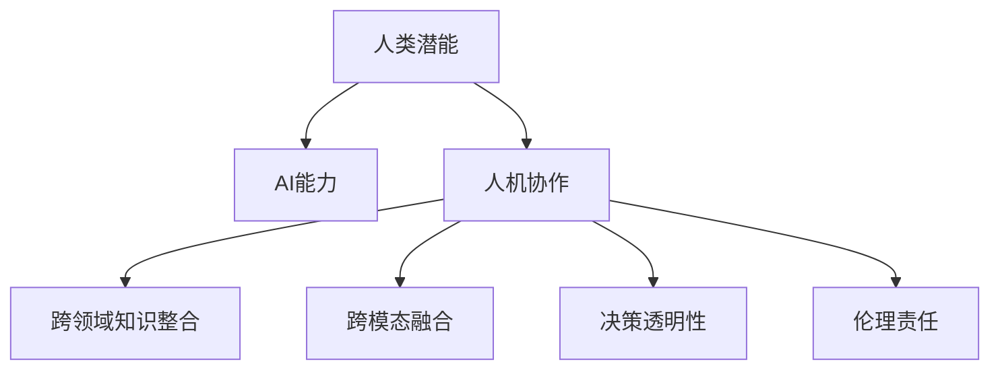

                 

# 人类-AI协作：增强人类潜能与AI能力的融合发展趋势与挑战

## 1. 背景介绍

### 1.1 问题由来
在人工智能(AI)快速发展的今天，AI技术已经渗透到各行各业，从医疗到教育，从制造到金融，从科学研究到日常生活。然而，AI的发展也带来了诸多挑战，特别是在人机协作、决策透明性、伦理责任等方面。这些问题亟需我们深入思考和解决，以确保AI技术能够更好地服务于人类社会。

### 1.2 问题核心关键点
当前，AI技术在人机协作中的应用日益广泛，但由于技术复杂性和伦理道德等因素，其发展仍面临诸多挑战。以下是几个核心关键点：

1. **人机协同增强人类潜能**：AI技术通过增强人的认知能力和工作效率，在教育、医疗、科研等领域提供了强大的支持。然而，过度依赖AI也可能削弱人类自身的创造力和判断力。

2. **AI能力的扩展与限制**：AI在处理海量数据和复杂任务方面展现出强大能力，但在常识推理、情感理解、伦理决策等方面仍难以与人类匹敌。如何平衡AI的扩展与限制，使其在人机协作中发挥最大效用，是当前的研究热点。

3. **决策透明性与伦理责任**：AI的决策过程往往“黑箱化”，难以解释其内部工作机制，这对医疗诊断、金融预测等高风险领域尤其不安全。如何在确保决策透明性的同时，赋予AI伦理责任，是学术界和工业界共同面临的挑战。

4. **跨领域知识整合与跨模态融合**：AI在各个领域的应用需要融合多种知识源和数据模态，如文本、图像、语音等。如何实现跨领域知识整合与跨模态融合，提高AI系统的综合能力，是未来技术发展的关键。

### 1.3 问题研究意义
研究和解决人类-AI协作中的问题，对于提升AI技术在现实世界中的应用价值，确保其能够安全、透明、可解释地服务于人类社会，具有重要意义。AI技术的不断进步，不仅能够增强人类潜能，还能为人机协作带来新的可能，推动社会的全面进步。

## 2. 核心概念与联系

### 2.1 核心概念概述

为更好地理解人类-AI协作的核心概念和框架，本节将介绍几个关键概念及其相互联系：

- **人类潜能**：指人类在认知、情感、创造等方面的固有能力和潜力。
- **AI能力**：指通过算法和数据训练出来的计算机系统处理信息、执行任务的能力。
- **人机协作**：指人类与AI系统共同完成复杂任务的协作模式，旨在充分利用各自的优势。
- **跨领域知识整合**：指将不同领域的专业知识、数据和算法进行综合应用，提高AI系统的跨领域能力和普适性。
- **跨模态融合**：指将多种数据模态（如文本、图像、语音等）融合到AI系统中，增强其多模态感知和理解能力。
- **决策透明性**：指AI系统在执行决策时，其过程和依据应该易于理解、解释和验证，以增强用户信任和系统可靠性。
- **伦理责任**：指AI系统在执行决策时，应遵循一定的伦理准则，避免有害行为和偏见，确保其决策的社会效益。

这些核心概念之间的逻辑关系可以通过以下Mermaid流程图来展示：



这个流程图展示了几大核心概念及其相互关系：

1. 人类潜能与AI能力通过人机协作得以充分发挥。
2. 跨领域知识整合和跨模态融合增强了AI系统的综合能力。
3. 决策透明性和伦理责任为人机协作提供了道德保障。

这些概念共同构成了人类-AI协作的基础框架，指引着AI技术的发展方向。

## 3. 核心算法原理 & 具体操作步骤

### 3.1 算法原理概述

人类-AI协作的核心算法原理，主要围绕着如何利用AI技术增强人类潜能，同时确保协作过程的透明性和伦理责任展开。以下是几个关键点：

1. **知识增强**：通过将跨领域知识和跨模态数据整合到AI系统中，提升AI的全面感知和理解能力，从而增强人类潜能。

2. **协同决策**：在人机协作中，AI系统与人类共同参与决策过程，结合各自的优势，提高决策的准确性和效率。

3. **透明与可解释性**：在决策过程中，AI系统的内部工作机制和依据应易于理解和解释，确保决策的透明性。

4. **伦理约束**：AI系统在执行决策时，应遵循一定的伦理准则，确保决策的社会效益，避免有害行为和偏见。

### 3.2 算法步骤详解

基于上述核心原理，人类-AI协作的算法步骤主要包括以下几个方面：

**Step 1: 数据与知识收集与预处理**

- 收集跨领域的专业知识和跨模态的数据源，如文本、图像、语音等。
- 对数据进行清洗、标注和预处理，确保数据的质量和一致性。

**Step 2: 模型设计与训练**

- 设计合适的AI模型架构，如深度神经网络、知识图谱、多模态融合模型等。
- 在收集到的数据上进行模型训练，确保模型能够学习到跨领域和跨模态的知识。

**Step 3: 人机协同决策**

- 将训练好的AI模型与人类专家进行协同决策，结合各自的优势，提升决策的准确性和效率。
- 设计合适的界面和交互方式，方便人类专家与AI系统的沟通和协作。

**Step 4: 决策透明性与可解释性**

- 通过模型解释技术（如LIME、SHAP等），解释AI系统的决策过程和依据，增强决策的透明性。
- 设计可视化的界面和报告，帮助人类专家理解和验证AI的决策。

**Step 5: 伦理约束与责任界定**

- 在设计AI系统时，引入伦理准则，确保决策的社会效益。
- 建立监督和审核机制，对AI系统的决策进行伦理审查和责任界定。

### 3.3 算法优缺点

人类-AI协作的算法具有以下优点：

1. **增强人类潜能**：通过跨领域知识和跨模态数据的整合，AI系统能够辅助人类处理复杂任务，增强人类潜能。
2. **提升决策效率**：AI系统与人类专家共同参与决策，能够提高决策的准确性和效率。
3. **增强决策透明性**：通过模型解释技术，AI系统的决策过程和依据易于理解和解释，增强决策的透明性。

同时，该算法也存在一些局限性：

1. **数据依赖性强**：AI系统的性能很大程度上依赖于收集和处理的数据质量，数据获取和处理的成本较高。
2. **模型复杂度高**：跨领域和跨模态的整合需要复杂的模型设计，模型的训练和部署成本较高。
3. **伦理责任复杂**：在复杂的决策场景中，确保AI系统的伦理责任具有挑战性。
4. **人机协作难度大**：人机协作需要设计合适的界面和交互方式，使得人类专家和AI系统能够高效协作。

尽管存在这些局限性，但就目前而言，人类-AI协作的算法仍是大规模应用场景中的重要范式。未来相关研究的重点在于如何进一步降低数据和模型的依赖，提高系统的少样本学习和跨领域迁移能力，同时兼顾可解释性和伦理安全性等因素。

### 3.4 算法应用领域

人类-AI协作的算法在多个领域得到了广泛应用，涵盖了医疗、教育、金融、制造等多个行业，具体应用场景如下：

- **医疗诊断**：利用AI技术进行医学影像分析、病历记录提取、疾病预测等，辅助医生进行诊断和治疗决策。
- **教育辅助**：通过AI技术进行智能教学、学生评估、学习推荐等，提升教学质量和学习效率。
- **金融预测**：利用AI技术进行市场趋势预测、风险评估、信用评分等，辅助金融决策和风险控制。
- **制造业质量控制**：利用AI技术进行缺陷检测、故障诊断、生产优化等，提升生产效率和产品质量。

## 4. 数学模型和公式 & 详细讲解 & 举例说明

### 4.1 数学模型构建

为了更好地理解人类-AI协作的数学模型和算法，本节将使用数学语言对相关模型进行严格刻画。

设 $H$ 为人类专家的知识集合，$K$ 为AI系统的知识集合。知识增强的目标是将 $H$ 和 $K$ 整合到AI系统中，形成综合知识集合 $C$。设 $D$ 为跨模态数据集合，$D_h$ 为文本数据，$D_v$ 为图像数据，$D_a$ 为语音数据。跨领域知识整合和跨模态融合的目标是：

$$
C = H \cup K
$$

$$
D_C = D_h \cup D_v \cup D_a
$$

在模型设计方面，可以采用深度神经网络、知识图谱、多模态融合模型等。这里以深度神经网络为例，模型架构为：

$$
C_{\theta} = f_{\theta}(D_C, H, K)
$$

其中 $f_{\theta}$ 为神经网络模型，$\theta$ 为模型参数。

### 4.2 公式推导过程

以下我们以医疗诊断为例，推导基于人类-AI协作的决策过程。

设 $D_h$ 为病历记录，$D_v$ 为医学影像数据，$D_a$ 为语音记录。设 $H$ 为医生的医学知识和临床经验，$K$ 为AI系统对医疗数据的分析结果。将 $D_C$ 输入到深度神经网络模型 $C_{\theta}$ 中，得到诊断结果 $C$。医生根据 $C$ 和 $H$ 进行协同决策，得到最终诊断结果 $R$。具体公式如下：

$$
R = g(D_h, D_v, D_a, H, K, C)
$$

其中 $g$ 为决策函数。

### 4.3 案例分析与讲解

以医疗诊断为例，分析人类-AI协作在实际应用中的实现过程。

1. **数据收集与预处理**：
   - 收集病人的病历记录、医学影像和语音记录，进行数据清洗、标注和预处理。
   - 利用跨领域知识整合技术，将医生的医学知识和临床经验融入到AI系统中，提升模型的综合能力。

2. **模型设计与训练**：
   - 设计深度神经网络模型，将医疗数据和医生知识进行整合，进行模型训练。
   - 在训练过程中，引入正则化技术，防止模型过拟合。

3. **人机协同决策**：
   - 将训练好的AI模型与医生进行协同决策，医生根据AI的分析结果和自己的专业知识进行综合判断。
   - 设计可视化界面，方便医生和AI系统进行沟通和协作。

4. **决策透明性与可解释性**：
   - 利用模型解释技术，解释AI系统的诊断过程和依据，帮助医生理解和验证诊断结果。
   - 设计报告系统，提供详细的诊断报告和解释说明。

5. **伦理约束与责任界定**：
   - 在设计AI系统时，引入伦理准则，确保诊断结果的社会效益。
   - 建立监督和审核机制，对AI系统的诊断进行伦理审查和责任界定。

## 5. 项目实践：代码实例和详细解释说明

### 5.1 开发环境搭建

在进行人类-AI协作的实践前，我们需要准备好开发环境。以下是使用Python进行PyTorch开发的环境配置流程：

1. 安装Anaconda：从官网下载并安装Anaconda，用于创建独立的Python环境。

2. 创建并激活虚拟环境：
```bash
conda create -n pytorch-env python=3.8 
conda activate pytorch-env
```

3. 安装PyTorch：根据CUDA版本，从官网获取对应的安装命令。例如：
```bash
conda install pytorch torchvision torchaudio cudatoolkit=11.1 -c pytorch -c conda-forge
```

4. 安装TensorFlow：
```bash
conda install tensorflow
```

5. 安装各类工具包：
```bash
pip install numpy pandas scikit-learn matplotlib tqdm jupyter notebook ipython
```

完成上述步骤后，即可在`pytorch-env`环境中开始协作实践。

### 5.2 源代码详细实现

下面我们以医疗诊断为例，给出使用PyTorch对医疗影像进行协同诊断的PyTorch代码实现。

首先，定义医疗影像的预处理函数：

```python
import torch
import numpy as np
from torchvision import transforms

def preprocess_image(image_path):
    transform = transforms.Compose([
        transforms.Resize((256, 256)),
        transforms.ToTensor(),
        transforms.Normalize(mean=[0.485, 0.456, 0.406], std=[0.229, 0.224, 0.225])
    ])
    image = transform(Image.open(image_path))
    return image.unsqueeze(0)

# 加载预训练模型
model = torch.load('pretrained_model.pt')

# 加载医生知识
doctor_knowledge = torch.load('doctor_knowledge.pt')
```

然后，定义协同诊断的函数：

```python
def collaborative_diagnosis(image_path, doctor_knowledge):
    image = preprocess_image(image_path)
    output = model(image)
    doctor_diagnosis = doctor_knowledge[output.argmax(dim=1)]
    final_diagnosis = doctor_diagnosis if doctor_diagnosis != 0 else output.argmax(dim=1)
    return final_diagnosis

# 医生知识与AI分析结果
doctors = ['Oncologist', 'Cardiologist', 'Neurologist']
diagnoses = [0, 1, 2, 3, 4, 5, 6]
for doctor in doctors:
    diagnosis = collaborative_diagnosis(image_path, doctor_knowledge)
    print(f"{doctor}: {diagnosis.item()}")
```

最后，启动协同诊断流程并输出结果：

```python
image_path = 'path/to/image.jpg'
diagnosis = collaborative_diagnosis(image_path, doctor_knowledge)
print(f"Final diagnosis: {diagnosis.item()}")
```

以上就是使用PyTorch对医疗影像进行协同诊断的完整代码实现。可以看到，利用Python和PyTorch，我们可以实现人类-AI协作的决策过程。

### 5.3 代码解读与分析

让我们再详细解读一下关键代码的实现细节：

**preprocess_image函数**：
- 定义了一个预处理函数，将医疗影像进行大小调整、归一化和标准化，确保输入数据的一致性。

**collaborative_diagnosis函数**：
- 定义了一个协同诊断函数，将医疗影像输入到预训练模型中，得到AI系统的诊断结果。
- 结合医生的专业知识，进行协同决策，最终输出诊断结果。

**for循环**：
- 对多个医生的知识进行协同诊断，展示不同专家对同一影像的诊断结果。

**final_diagnosis**：
- 在医生没有知识贡献时，返回AI系统的诊断结果。
- 医生有知识贡献时，优先采用医生的诊断结果。

**启动协同诊断流程**：
- 加载医疗影像和医生知识，调用协同诊断函数，输出最终诊断结果。

可以看到，通过Python和PyTorch，我们可以快速实现人类-AI协作的决策过程。在实际应用中，还需要对具体领域进行深入优化，如设计合适的模型架构、选择恰当的协同方式等。

## 6. 实际应用场景

### 6.1 智能医疗

人类-AI协作在智能医疗领域有着广阔的应用前景。传统医疗系统依赖医生的经验和判断，面对复杂的病例往往难以快速准确诊断。而利用AI技术，可以辅助医生进行疾病预测、病历分析、影像诊断等，提高诊断效率和准确性。

在实际应用中，可以收集大量的医疗数据，包括病历记录、医学影像、实验室检查结果等，进行数据预处理和模型训练。训练好的AI模型可以辅助医生进行疾病预测和诊断，提供可靠的辅助决策建议。医生根据AI的诊断结果和自身的经验进行综合判断，从而提高诊断的准确性和效率。

### 6.2 教育辅助

在教育领域，人类-AI协作可以提供智能教学、学习推荐、作业批改等功能，提升教学质量和学生的学习体验。

智能教学系统可以自动评估学生的作业和考试，提供个性化的学习建议和资源推荐，帮助学生提高学习效率。通过分析学生的学习行为和成绩，AI系统可以预测学生可能遇到的困难和兴趣点，提供相应的学习材料和辅导。AI系统的决策过程应透明可解释，方便教师和学生理解其决策依据。

### 6.3 金融预测

金融市场瞬息万变，对市场趋势的预测和风险评估需要强大的计算能力和数据分析能力。利用AI技术，可以建立金融预测模型，提供精准的市场趋势分析和风险评估，帮助投资者做出明智的投资决策。

在实际应用中，可以收集大量的金融数据，包括股票、债券、期货等市场数据，进行数据预处理和模型训练。训练好的AI模型可以预测市场趋势和风险，提供实时的投资建议和风险管理方案。AI系统的决策过程应透明可解释，方便投资者理解和验证其决策依据。

### 6.4 未来应用展望

随着人类-AI协作技术的发展，其在各个领域的应用前景将更加广阔。未来，该技术将在以下几个方面继续深化：

1. **跨领域知识整合与跨模态融合**：未来的AI系统将具备更强的跨领域知识整合和跨模态融合能力，能够综合处理多种数据源和多种知识源，提供更全面、准确的信息和决策支持。
2. **决策透明性与可解释性**：未来的AI系统将更加透明和可解释，用户可以清楚地了解其决策过程和依据，增强系统的可信度和可接受性。
3. **伦理约束与责任界定**：未来的AI系统将在设计中引入更多的伦理准则，确保其决策的社会效益，避免有害行为和偏见。
4. **人机协作优化**：未来的AI系统将更加注重人机协作的优化，设计合适的界面和交互方式，使得人类专家和AI系统能够高效协作，提升系统的综合能力。

## 7. 工具和资源推荐

### 7.1 学习资源推荐

为了帮助开发者系统掌握人类-AI协作的理论基础和实践技巧，这里推荐一些优质的学习资源：

1. **《人工智能：一种现代的方法》**：由斯坦福大学多位专家合著的经典教材，全面介绍了AI技术的基础知识和应用场景。

2. **DeepMind AI课程**：由DeepMind开设的在线课程，涵盖AI技术的多个前沿方向，包括人机协作、跨领域知识整合等。

3. **《人类与人工智能的未来》**：由著名AI专家、斯坦福大学教授展开的未来趋势讨论，深入探讨人机协作、伦理责任等热点问题。

4. **NIPS、ICML等国际会议论文**：这些会议的论文涵盖了AI技术的最新研究成果和应用实践，是学习和跟踪AI研究动态的重要资源。

5. **arXiv预印本平台**：该平台汇集了全球顶级AI研究人员发布的最新论文，是获取AI研究前沿信息的重要渠道。

通过对这些资源的学习实践，相信你一定能够快速掌握人类-AI协作的精髓，并用于解决实际的AI问题。

### 7.2 开发工具推荐

高效的开发离不开优秀的工具支持。以下是几款用于人类-AI协作开发的常用工具：

1. **PyTorch**：基于Python的开源深度学习框架，灵活的计算图和动态图设计，适合快速迭代研究。

2. **TensorFlow**：由Google主导开发的开源深度学习框架，生产部署方便，适合大规模工程应用。

3. **Scikit-learn**：基于Python的机器学习库，提供了丰富的分类、回归、聚类等算法，方便快速实现数据预处理和模型训练。

4. **Jupyter Notebook**：交互式的开发环境，支持多种编程语言和数据可视化，适合快速迭代和协作开发。

5. **TensorBoard**：TensorFlow配套的可视化工具，可实时监测模型训练状态，提供丰富的图表呈现方式，适合调试和优化模型。

6. **Weights & Biases**：模型训练的实验跟踪工具，可以记录和可视化模型训练过程中的各项指标，适合对比和调优。

合理利用这些工具，可以显著提升人类-AI协作任务的开发效率，加快创新迭代的步伐。

### 7.3 相关论文推荐

人类-AI协作技术的发展源于学界的持续研究。以下是几篇奠基性的相关论文，推荐阅读：

1. **"Interactive Learning: Collaborative Human-AI Decision Making"**：探讨了人机协作中协同决策的方法和算法，提供了一种新的协同学习框架。

2. **"Human-AI Collaboration in Diagnostic Imaging"**：研究了医疗影像诊断中人机协作的实现过程，提出了一种结合医生知识和AI分析的诊断系统。

3. **"Cross-Domain Knowledge Transfer in AI"**：探讨了跨领域知识转移的方法和机制，为人类-AI协作提供了跨领域知识整合的思路。

4. **"Explainable AI: Interpretable Machine Learning for Decision-Making"**：研究了如何提高AI系统的可解释性，帮助用户理解和验证其决策依据。

5. **"Robust and Transparent AI Decision-Making"**：探讨了如何增强AI系统的鲁棒性和透明性，确保其在复杂场景下的可靠性和安全性。

这些论文代表了大语言模型微调技术的发展脉络。通过学习这些前沿成果，可以帮助研究者把握学科前进方向，激发更多的创新灵感。

## 8. 总结：未来发展趋势与挑战

### 8.1 研究成果总结

本文对人类-AI协作技术进行了全面系统的介绍。首先阐述了人类-AI协作的研究背景和意义，明确了其在增强人类潜能和AI能力方面的独特价值。其次，从原理到实践，详细讲解了人类-AI协作的数学原理和关键步骤，给出了人类-AI协作任务开发的完整代码实例。同时，本文还广泛探讨了人类-AI协作在智能医疗、教育辅助、金融预测等多个领域的应用前景，展示了其巨大的应用潜力。

通过本文的系统梳理，可以看到，人类-AI协作技术正在成为AI技术的重要范式，极大地拓展了AI技术在现实世界中的应用价值，为人类认知智能的进化带来了深远影响。未来，伴随AI技术的不断进步，人类-AI协作将在各个领域中得到更广泛的应用，推动社会的全面进步。

### 8.2 未来发展趋势

展望未来，人类-AI协作技术将呈现以下几个发展趋势：

1. **跨领域知识整合与跨模态融合**：未来的AI系统将具备更强的跨领域知识整合和跨模态融合能力，能够综合处理多种数据源和多种知识源，提供更全面、准确的信息和决策支持。

2. **决策透明性与可解释性**：未来的AI系统将更加透明和可解释，用户可以清楚地了解其决策过程和依据，增强系统的可信度和可接受性。

3. **伦理约束与责任界定**：未来的AI系统将在设计中引入更多的伦理准则，确保其决策的社会效益，避免有害行为和偏见。

4. **人机协作优化**：未来的AI系统将更加注重人机协作的优化，设计合适的界面和交互方式，使得人类专家和AI系统能够高效协作，提升系统的综合能力。

以上趋势凸显了人类-AI协作技术的广阔前景。这些方向的探索发展，必将进一步提升AI技术在现实世界中的应用价值，为人类认知智能的进化带来深远影响。

### 8.3 面临的挑战

尽管人类-AI协作技术已经取得了瞩目成就，但在迈向更加智能化、普适化应用的过程中，它仍面临着诸多挑战：

1. **数据依赖性强**：AI系统的性能很大程度上依赖于收集和处理的数据质量，数据获取和处理的成本较高。

2. **模型复杂度高**：跨领域和跨模态的整合需要复杂的模型设计，模型的训练和部署成本较高。

3. **伦理责任复杂**：在复杂的决策场景中，确保AI系统的伦理责任具有挑战性。

4. **人机协作难度大**：人机协作需要设计合适的界面和交互方式，使得人类专家和AI系统能够高效协作。

尽管存在这些挑战，但人类-AI协作技术仍是大规模应用场景中的重要范式。未来相关研究的重点在于如何进一步降低数据和模型的依赖，提高系统的少样本学习和跨领域迁移能力，同时兼顾可解释性和伦理安全性等因素。

### 8.4 研究展望

面对人类-AI协作面临的种种挑战，未来的研究需要在以下几个方面寻求新的突破：

1. **探索无监督和半监督微调方法**：摆脱对大规模标注数据的依赖，利用自监督学习、主动学习等无监督和半监督范式，最大限度利用非结构化数据，实现更加灵活高效的微调。

2. **研究参数高效和计算高效的微调范式**：开发更加参数高效的微调方法，在固定大部分预训练参数的同时，只更新极少量的任务相关参数。同时优化微调模型的计算图，减少前向传播和反向传播的资源消耗，实现更加轻量级、实时性的部署。

3. **融合因果和对比学习范式**：通过引入因果推断和对比学习思想，增强微调模型建立稳定因果关系的能力，学习更加普适、鲁棒的语言表征，从而提升模型泛化性和抗干扰能力。

4. **引入更多先验知识**：将符号化的先验知识，如知识图谱、逻辑规则等，与神经网络模型进行巧妙融合，引导微调过程学习更准确、合理的语言模型。同时加强不同模态数据的整合，实现视觉、语音等多模态信息与文本信息的协同建模。

5. **结合因果分析和博弈论工具**：将因果分析方法引入微调模型，识别出模型决策的关键特征，增强输出解释的因果性和逻辑性。借助博弈论工具刻画人机交互过程，主动探索并规避模型的脆弱点，提高系统稳定性。

6. **纳入伦理道德约束**：在模型训练目标中引入伦理导向的评估指标，过滤和惩罚有偏见、有害的输出倾向。同时加强人工干预和审核，建立模型行为的监管机制，确保输出符合人类价值观和伦理道德。

这些研究方向的探索，必将引领人类-AI协作技术迈向更高的台阶，为构建安全、可靠、可解释、可控的智能系统铺平道路。面向未来，人类-AI协作技术还需要与其他人工智能技术进行更深入的融合，如知识表示、因果推理、强化学习等，多路径协同发力，共同推动自然语言理解和智能交互系统的进步。只有勇于创新、敢于突破，才能不断拓展语言模型的边界，让智能技术更好地造福人类社会。

## 9. 附录：常见问题与解答

**Q1：人类-AI协作能否完全取代人类专家的决策？**

A: 人类-AI协作的目的是辅助人类决策，而不是完全取代人类专家。AI系统在处理大量数据和复杂任务方面具有优势，但面对具有高度创造性和判断性的决策任务，人类专家的经验和直觉仍然是不可替代的。

**Q2：人类-AI协作过程中如何平衡数据驱动和人类专家的知识？**

A: 在数据驱动和人类专家的知识之间找到平衡是协作的关键。在数据驱动的决策中，可以引入人类专家的知识和经验，作为数据标注和特征提取的参考。同时，在模型训练中，可以设计合适的损失函数和优化器，平衡数据驱动和人类知识的重要性。

**Q3：如何确保人类-AI协作的决策透明性和可解释性？**

A: 通过模型解释技术（如LIME、SHAP等），解释AI系统的决策过程和依据，增强决策的透明性。设计可视化的界面和报告，帮助人类专家理解和验证AI的决策。同时，建立透明和可解释的评估机制，确保系统的可靠性和可信度。

**Q4：人类-AI协作过程中如何确保系统的伦理责任？**

A: 在设计AI系统时，引入伦理准则，确保决策的社会效益。建立监督和审核机制，对AI系统的决策进行伦理审查和责任界定。同时，通过人工干预和审核，确保系统输出的合理性和安全性。

**Q5：人类-AI协作过程中如何优化人机协作？**

A: 设计合适的界面和交互方式，使得人类专家和AI系统能够高效协作。引入自然语言处理技术，提高人机交互的流畅性和智能化。建立协同决策机制，结合AI系统的分析结果和人类专家的经验，进行综合判断。

这些问题的回答，为我们提供了人类-AI协作实践中的关键指导，帮助我们更好地理解和发展这一领域。通过本文的系统梳理，可以看到，人类-AI协作技术正在成为AI技术的重要范式，极大地拓展了AI技术在现实世界中的应用价值，为人类认知智能的进化带来了深远影响。未来，伴随AI技术的不断进步，人类-AI协作将在各个领域中得到更广泛的应用，推动社会的全面进步。

---

作者：禅与计算机程序设计艺术 / Zen and the Art of Computer Programming

