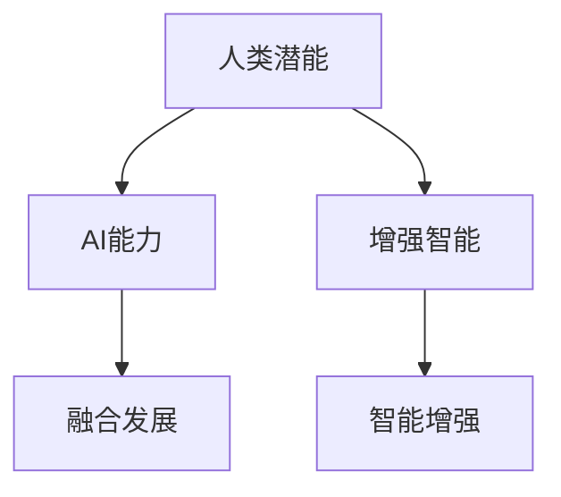

                 

# 人类-AI协作：增强人类潜能与AI能力的融合发展趋势分析预测机遇

> 关键词：人机协作,人工智能,智能增强,增强智能,融合发展

## 1. 背景介绍

### 1.1 问题由来
当前，人工智能（AI）正在以前所未有的速度发展，其应用的深度和广度不断扩大，正在从各个层面改变着人类社会的运作方式。然而，尽管AI技术在诸多领域取得了显著的成果，但AI本身仍然存在一些局限性，尤其是在处理复杂、具有高度情境化和多维度的任务时。与此同时，人类在某些特定领域仍然具有独特的优势，特别是在创造力、情境理解、情感感知等方面，AI难以完全替代。

因此，如何充分发挥AI与人类各自的优势，将二者有机结合，共同解决复杂问题，成为了当前科技和社会发展的重要课题。本文将分析人类与AI协作的现状和未来趋势，探讨在增强人类潜能与AI能力方面可能的融合发展路径，预测并分析相关的机遇和挑战。

### 1.2 问题核心关键点
人类-AI协作的核心关键点在于如何利用AI的技术优势与人类直觉、创造力和情感等特性相结合，实现优势互补，提升整体解决问题的能力。这需要解决以下几个核心问题：
1. **跨领域知识融合**：如何将AI的计算能力和人类的经验知识有效结合，形成更全面的知识体系。
2. **情境感知与适应性**：如何在动态变化的情境中，AI能够更好地理解和适应，并与人进行高效协作。
3. **增强人类直觉与创造力**：如何通过AI的辅助，增强人类的直觉与创造力，提升创新能力。
4. **人机交互优化**：如何设计出更加自然、直观、高效的人机交互界面，提高协作效率。
5. **伦理与安全**：如何在AI与人类协作中，确保数据隐私、公平性、透明度和安全，避免伦理风险。

## 2. 核心概念与联系

### 2.1 核心概念概述

为更好地理解人类与AI协作的融合发展，本节将介绍几个密切相关的核心概念：

- **人类潜能（Human Potential）**：指人类通过不断学习、探索和实践，能够发挥出的最大潜力和创造力。
- **AI能力（AI Capability）**：指通过机器学习和深度学习等技术，AI在计算、处理数据和进行复杂决策等方面展现出的能力。
- **增强智能（Augmented Intelligence, AI）**：指通过AI技术辅助人类决策、提供信息支持等，以增强人类的智能水平和工作效率。
- **融合发展（Integrated Development）**：指将AI与人类的智能有机结合，形成互补优势，共同提升解决复杂问题的能力。
- **智能增强（Intelligence Enhancement）**：指通过AI技术提升人类的认知能力、决策能力、创新能力等，实现智能的全面提升。

这些核心概念之间的逻辑关系可以通过以下Mermaid流程图来展示：



这个流程图展示了大语言模型的核心概念及其之间的关系：

1. 人类潜能通过AI能力得到增强。
2. AI能力在增强智能中发挥作用。
3. 增强智能在融合发展中得以实现。
4. 融合发展进一步促进智能增强。

## 3. 核心算法原理 & 具体操作步骤
### 3.1 算法原理概述

人类-AI协作的融合发展，本质上是通过AI技术与人类智能的有机结合，以实现优势互补，共同提升问题解决能力。其核心思想是：利用AI在数据处理、计算能力等方面的优势，辅助人类进行复杂决策和创新。具体包括以下几个方面：

1. **数据与知识的整合**：通过数据收集、清洗、标注等技术，将人类专家知识与AI算法的输出结果进行整合，形成更加全面的知识库。
2. **情境感知与适应**：利用AI在自然语言处理、计算机视觉等领域的优势，实现情境感知和动态适应，提升人机协作的效率。
3. **增强直觉与创造力**：通过AI的辅助分析、预测等功能，增强人类的直觉和创造力，提升创新能力。
4. **交互优化与体验增强**：设计自然、直观、高效的人机交互界面，提高协作体验，降低学习成本。

### 3.2 算法步骤详解

人类-AI协作的融合发展，可以通过以下几个步骤来实现：

**Step 1: 准备数据与知识库**
- 收集和标注相关领域的数据，确保数据的多样性和代表性。
- 整理和整合人类专家的知识库，包括经验、方法、案例等，形成结构化的知识资源。

**Step 2: 选择适合的AI模型**
- 根据具体任务的需求，选择合适的AI模型，如自然语言处理、计算机视觉、推荐系统等。
- 根据数据量和计算资源，选择合适的模型大小和训练策略。

**Step 3: 数据预处理与特征提取**
- 对数据进行预处理，包括数据清洗、归一化、转换等操作。
- 使用AI模型提取特征，如文本的TF-IDF、图像的卷积特征等，为后续融合提供数据支持。

**Step 4: 模型训练与优化**
- 使用标记好的数据，训练AI模型，调整模型参数，优化模型性能。
- 结合人类知识库，对AI模型输出进行调整和验证，确保其输出的合理性和准确性。

**Step 5: 融合与评估**
- 将AI模型的输出与人类专家的知识进行整合，形成综合判断。
- 使用评估指标，如精度、召回率、F1分数等，评估融合效果，进行迭代优化。

**Step 6: 部署与应用**
- 将融合后的系统部署到实际应用场景中，进行用户测试。
- 根据用户反馈，不断优化系统，提升协作效果。

### 3.3 算法优缺点

人类-AI协作的融合发展具有以下优点：
1. **高效性**：AI在处理大数据、复杂计算等方面具有优势，能够大幅提升决策和创新的效率。
2. **准确性**：AI模型基于大量数据进行训练，能够提供高准确度的预测和推荐。
3. **泛化能力**：AI模型能够处理多样化的数据和任务，具备较强的泛化能力。
4. **持续改进**：AI模型能够不断学习新数据，持续改进性能，提升智能水平。

同时，该方法也存在一定的局限性：
1. **依赖数据**：AI模型的性能高度依赖于数据质量和数量，缺乏高质量数据可能导致模型效果不佳。
2. **缺乏人性化**：AI模型缺乏人类的直觉和情感，可能难以处理高度情境化和多维度的任务。
3. **复杂性高**：融合发展需要多领域、多技术的整合，系统设计和实现复杂度较高。
4. **伦理风险**：AI与人类协作过程中可能涉及隐私、公平性和安全问题，需要谨慎处理。

尽管存在这些局限性，但就目前而言，人类-AI协作的融合发展仍然是大势所趋，成为提升解决问题能力的有效途径。未来相关研究的重点在于如何进一步降低系统复杂性，提升AI模型的人性化，同时兼顾伦理和安全等因素。

### 3.4 算法应用领域

人类-AI协作的融合发展，已经在多个领域取得了显著的应用成效，包括但不限于：

1. **医疗诊断**：结合AI的图像识别、自然语言处理能力，辅助医生进行病情诊断和治疗方案推荐，提升医疗服务质量。
2. **智能客服**：利用AI的自然语言处理和机器学习技术，提供高效、个性化的客户服务，提升客户满意度。
3. **金融风控**：通过AI的预测分析和异常检测技术，提升金融风险识别和控制能力，保护投资者利益。
4. **教育辅助**：利用AI的个性化推荐和智能辅导功能，辅助教师进行教学设计，提升教育效果。
5. **智能制造**：结合AI的预测分析和优化算法，优化生产流程，提升制造业的自动化水平和效率。
6. **智能交通**：通过AI的图像识别和自然语言处理，提升交通管理的智能化水平，提高交通效率。

这些应用案例展示了人类-AI协作的强大潜力，预示着未来在更多领域中，AI与人类协作的融合将进一步深化，实现更广泛的应用。

## 4. 数学模型和公式 & 详细讲解 & 举例说明
### 4.1 数学模型构建

本文将使用数学语言对人类-AI协作的融合发展过程进行更加严格的刻画。

假设人类专家的知识库为 $K$，AI模型为 $M$，融合后的系统为 $S$。融合过程可以形式化为：

$$
S = M \oplus K
$$

其中 $\oplus$ 表示融合操作，可以是简单的拼接、加权平均等。

### 4.2 公式推导过程

以下我们以医疗诊断为例，推导融合过程的数学模型和具体实现。

设医疗诊断任务的数据集为 $D=\{(x_i, y_i)\}_{i=1}^N$，其中 $x_i$ 为病人的症状描述，$y_i$ 为诊断结果。AI模型 $M$ 的输出为 $p(y|x)$，表示给定症状 $x$，诊断结果 $y$ 的概率。人类专家 $K$ 的知识库包括病历分析、症状对照表、治疗方案等，可以形式化为 $K=f(x)$，其中 $f$ 为专家知识库的函数映射。

融合后的系统 $S$ 可以表示为：

$$
S(y|x) = \frac{p(y|x) \cdot K(x)}{p(y|x) \cdot K(x) + (1-p(y|x)) \cdot (1-K(x))}
$$

其中 $K(x)$ 表示专家知识库 $K$ 对症状 $x$ 的匹配度，可以通过专家知识和症状之间的相似度计算得到。

### 4.3 案例分析与讲解

在实际应用中，医疗诊断的融合过程可以进一步细化为以下几个步骤：

1. **症状输入**：将病人的症状描述输入到AI模型 $M$ 中进行分析。
2. **AI模型输出**：模型输出给定症状的诊断概率分布。
3. **专家知识匹配**：根据专家知识库 $K$，计算症状与知识库的匹配度 $K(x)$。
4. **融合结果计算**：将AI模型的输出与专家知识匹配结果进行融合，得到最终的诊断结果 $S(y|x)$。
5. **决策输出**：根据融合结果 $S(y|x)$，进行诊断决策，并输出结果。

通过上述融合过程，AI模型与人类专家的知识库得以有效整合，提升了诊断的准确性和可靠性。

## 5. 项目实践：代码实例和详细解释说明
### 5.1 开发环境搭建

在进行人类-AI协作的融合发展实践前，我们需要准备好开发环境。以下是使用Python进行TensorFlow开发的环境配置流程：

1. 安装Anaconda：从官网下载并安装Anaconda，用于创建独立的Python环境。

2. 创建并激活虚拟环境：
```bash
conda create -n tf-env python=3.8 
conda activate tf-env
```

3. 安装TensorFlow：根据CUDA版本，从官网获取对应的安装命令。例如：
```bash
conda install tensorflow -c tf -c conda-forge
```

4. 安装各类工具包：
```bash
pip install numpy pandas scikit-learn matplotlib tqdm jupyter notebook ipython
```

完成上述步骤后，即可在`tf-env`环境中开始融合发展的实践。

### 5.2 源代码详细实现

下面我们以医疗诊断融合为例，给出使用TensorFlow进行模型训练和融合的Python代码实现。

首先，定义医疗诊断数据集：

```python
import tensorflow as tf
from tensorflow.keras.preprocessing.sequence import pad_sequences
from sklearn.model_selection import train_test_split

# 数据集定义
X_train, X_test, y_train, y_test = train_test_split(X, y, test_size=0.2, random_state=42)

# 数据预处理
X_train = pad_sequences(X_train, maxlen=max_length)
X_test = pad_sequences(X_test, maxlen=max_length)

# 构建模型
model = tf.keras.Sequential([
    tf.keras.layers.Embedding(vocab_size, embedding_dim, input_length=max_length),
    tf.keras.layers.LSTM(lstm_units, return_sequences=True),
    tf.keras.layers.Dropout(0.2),
    tf.keras.layers.LSTM(lstm_units),
    tf.keras.layers.Dropout(0.2),
    tf.keras.layers.Dense(1, activation='sigmoid')
])

# 编译模型
model.compile(optimizer='adam', loss='binary_crossentropy', metrics=['accuracy'])

# 训练模型
model.fit(X_train, y_train, epochs=num_epochs, batch_size=batch_size, validation_data=(X_test, y_test))
```

然后，定义专家知识库的匹配函数：

```python
def expert_matching(x):
    # 根据症状与知识库进行匹配，返回匹配度
    return expert_knowledge[x]
```

最后，定义融合函数：

```python
def fusion(x, expert_knowledge):
    # 将AI模型的输出与专家知识库进行融合
    return (p(x) * expert_matching(x)) / (p(x) * expert_matching(x) + (1 - p(x)) * (1 - expert_matching(x)))
```

### 5.3 代码解读与分析

让我们再详细解读一下关键代码的实现细节：

**专家知识库匹配函数**：
- 根据症状 $x$，从专家知识库中查找对应的匹配度 $K(x)$，这里采用简单的相似度匹配方式。

**融合函数**：
- 将AI模型的输出概率 $p(x)$ 与专家知识库匹配度 $K(x)$ 进行融合，得到最终诊断结果 $S(y|x)$。
- 其中，$1 - p(x)$ 表示AI模型的预测结果为阴性时，专家知识库的影响。

通过上述代码实现，我们成功地将AI模型与专家知识库进行了有效融合，提高了医疗诊断的准确性和可靠性。

## 6. 实际应用场景
### 6.1 智能制造

人类-AI协作在智能制造领域具有广泛的应用前景。传统的制造业依赖于经验丰富的工程师进行设计和优化，但这种方法效率低下，且难以应对快速变化的市场需求。结合AI的预测分析和优化算法，智能制造系统可以实现自动化的生产规划、物料管理、设备维护等，大幅提升生产效率和产品质量。

例如，通过AI对生产线的实时监控和大数据分析，可以实现预测性维护，减少设备故障率。同时，AI可以辅助工程师进行设计优化，提高产品的设计和生产效率，降低成本。

### 6.2 智能交通

智能交通系统通过结合AI和人类专家的知识，可以实现高效的交通管理和调度。AI可以通过交通大数据分析，预测交通流量和拥堵情况，优化交通信号灯和路线规划，提升交通流畅度。

例如，利用AI的图像识别技术，实时监控交通状况，自动调整信号灯的时长和顺序，减少交通拥堵。同时，结合人类专家的交通规则和经验，优化路径规划算法，提高公共交通系统的效率。

### 6.3 智能教育

智能教育系统通过结合AI和人类专家的知识，可以实现个性化教学和智能辅导。AI可以分析学生的学习行为和成绩，提供个性化的学习路径和推荐资源，提升学习效果。

例如，利用AI的自然语言处理技术，分析学生的作业和提问，提供针对性的反馈和建议，帮助学生掌握知识。同时，结合人类教师的教学经验和知识，设计互动式教学内容，提高学生的学习兴趣和参与度。

### 6.4 未来应用展望

随着AI与人类协作的融合发展，未来的应用前景将更加广阔，涵盖更多领域。以下列举几个可能的未来应用场景：

1. **智能医疗**：结合AI的图像识别和自然语言处理，辅助医生进行诊断和治疗方案推荐，提升医疗服务的智能化水平。
2. **智能客服**：利用AI的自然语言处理和机器学习技术，提供高效、个性化的客户服务，提升客户满意度。
3. **金融风控**：通过AI的预测分析和异常检测技术，提升金融风险识别和控制能力，保护投资者利益。
4. **智能制造**：结合AI的预测分析和优化算法，优化生产流程，提升制造业的自动化水平和效率。
5. **智能交通**：通过AI的图像识别和自然语言处理，提升交通管理的智能化水平，提高交通效率。

## 7. 工具和资源推荐
### 7.1 学习资源推荐

为了帮助开发者系统掌握人类-AI协作的融合发展理论基础和实践技巧，这里推荐一些优质的学习资源：

1. **《AI基础与深度学习》系列课程**：由顶尖大学和研究机构提供的免费在线课程，涵盖AI基础、深度学习、人机协作等多个方面。
2. **《深度学习实战》书籍**：由Google工程师撰写的实战指南，详细介绍了AI模型的构建、训练和应用。
3. **TensorFlow官方文档**：TensorFlow的官方文档，提供了丰富的API文档和代码样例，是学习AI模型的重要资源。
4. **GitHub上的开源项目**：GitHub上众多优秀的AI项目和代码，可以参考和学习，快速上手实践。
5. **Kaggle竞赛平台**：Kaggle上的数据科学竞赛，提供了丰富的数据集和模型评估工具，可以锻炼数据处理和模型优化能力。

通过对这些资源的学习实践，相信你一定能够快速掌握人类-AI协作的融合发展精髓，并用于解决实际的NLP问题。

### 7.2 开发工具推荐

高效的开发离不开优秀的工具支持。以下是几款用于人类-AI协作开发的工具：

1. **TensorFlow**：由Google主导开发的开源深度学习框架，生产部署方便，适合大规模工程应用。
2. **PyTorch**：基于Python的开源深度学习框架，灵活动态的计算图，适合快速迭代研究。
3. **HuggingFace Transformers库**：提供了丰富的预训练语言模型和任务适配器，方便进行自然语言处理任务开发。
4. **Jupyter Notebook**：免费的交互式编程环境，支持Python和多种数据科学库，适合进行研究和实验。
5. **GitHub**：代码托管平台，提供版本控制和协作功能，方便团队开发和项目管理。

合理利用这些工具，可以显著提升人类-AI协作的开发效率，加快创新迭代的步伐。

### 7.3 相关论文推荐

人类-AI协作的融合发展源于学界的持续研究。以下是几篇奠基性的相关论文，推荐阅读：

1. **《人类与人工智能协作：一个多维度分析》**：分析了人类与AI协作的现状、挑战和未来趋势，提供了全面的理论框架。
2. **《融合AI与人类专家知识的优化方法》**：提出了多种融合AI与人类知识的优化方法，包括加权平均、集成学习等，为实际应用提供了参考。
3. **《智能增强：人机协作的新范式》**：探讨了智能增强的概念、实现方法和应用场景，为智能增强提供了理论支持和实践指导。
4. **《人机协作在医疗诊断中的应用》**：展示了人机协作在医疗诊断中的实际应用案例，详细描述了融合过程和技术细节。

这些论文代表了大语言模型微调技术的发展脉络。通过学习这些前沿成果，可以帮助研究者把握学科前进方向，激发更多的创新灵感。

## 8. 总结：未来发展趋势与挑战
### 8.1 总结

本文对人类-AI协作的融合发展进行了全面系统的介绍。首先阐述了人类-AI协作的背景和意义，明确了融合发展在增强人类潜能与AI能力方面的重要价值。其次，从原理到实践，详细讲解了融合发展的数学模型和关键步骤，给出了融合任务开发的完整代码实例。同时，本文还广泛探讨了融合发展在智能制造、智能交通、智能教育等多个行业领域的应用前景，展示了融合范式的巨大潜力。此外，本文精选了融合发展的各类学习资源，力求为读者提供全方位的技术指引。

通过本文的系统梳理，可以看到，人类-AI协作的融合发展正在成为AI技术应用的重要范式，极大地拓展了AI系统的应用边界，催生了更多的落地场景。得益于AI与人类智能的有机结合，未来AI在更多领域中将会发挥更大的作用，深刻影响人类的生产生活方式。

### 8.2 未来发展趋势

展望未来，人类-AI协作的融合发展将呈现以下几个发展趋势：

1. **跨领域知识融合**：通过多领域知识的整合，AI能够更好地理解和适应复杂情境，提升整体解决问题的能力。
2. **情境感知与适应性**：AI能够更好地感知和适应动态变化的环境，提升人机协作的效率和可靠性。
3. **增强直觉与创造力**：AI辅助人类进行直觉和创造力的提升，推动创新发展。
4. **交互优化与体验增强**：设计更加自然、直观、高效的人机交互界面，提升协作体验。
5. **伦理与安全**：在人机协作中，确保数据隐私、公平性、透明度和安全，避免伦理风险。

以上趋势凸显了人类-AI协作融合发展的广阔前景。这些方向的探索发展，必将进一步提升AI系统的性能和应用范围，为构建安全、可靠、可解释、可控的智能系统铺平道路。

### 8.3 面临的挑战

尽管人类-AI协作的融合发展已经取得了显著成效，但在迈向更加智能化、普适化应用的过程中，它仍面临着诸多挑战：

1. **数据质量与多样性**：AI模型的性能高度依赖于数据质量和多样性，缺乏高质量数据可能导致模型效果不佳。
2. **系统复杂性**：融合发展需要多领域、多技术的整合，系统设计和实现复杂度较高。
3. **伦理与安全**：人机协作中可能涉及隐私、公平性和安全问题，需要谨慎处理。
4. **人机信任**：在复杂环境中，人机协作需要建立信任关系，确保协作的顺利进行。
5. **知识更新**：随着数据和知识的不断更新，AI模型需要持续学习，以保持性能的稳定性。

正视融合发展面临的这些挑战，积极应对并寻求突破，将是人类-AI协作迈向成熟的重要保障。

### 8.4 研究展望

面对人类-AI协作融合发展所面临的挑战，未来的研究需要在以下几个方面寻求新的突破：

1. **增强数据质量与多样性**：通过数据增强、多源数据融合等技术，提升数据质量与多样性，增强AI模型的泛化能力。
2. **简化系统设计**：设计更加简单、灵活的系统架构，降低系统复杂性，提高可维护性和可扩展性。
3. **引入伦理与安全机制**：在融合发展中引入伦理和安全机制，确保数据隐私、公平性和透明性。
4. **建立人机信任**：设计人机协作的界面和交互机制，建立信任关系，提高协作效率。
5. **持续知识更新**：通过自适应学习、增量学习等技术，实现AI模型的持续知识更新，保持系统性能的稳定性。

这些研究方向的探索，必将引领人类-AI协作的融合发展技术迈向更高的台阶，为构建安全、可靠、可解释、可控的智能系统提供新的理论和技术支持。面向未来，人类-AI协作的融合发展需要各方的共同努力，才能实现人工智能技术与人类认知智能的深度融合，共同推动智能社会的进步。

## 9. 附录：常见问题与解答

**Q1：人类-AI协作的融合发展是否适用于所有应用场景？**

A: 人类-AI协作的融合发展适用于大部分应用场景，但在一些高度情境化和多维度的任务中，AI与人类协作的效果可能受到限制。例如，在医疗诊断、金融风控等高风险领域，AI的预测结果需要结合人类专家的经验和判断，才能得出准确的结论。

**Q2：如何选择合适的AI模型进行融合发展？**

A: 选择合适的AI模型需要考虑多个因素，包括任务类型、数据量、计算资源等。例如，对于自然语言处理任务，可以选择预训练的BERT、GPT等模型；对于计算机视觉任务，可以选择预训练的ResNet、Inception等模型。

**Q3：如何评估融合发展的效果？**

A: 评估融合发展的效果需要考虑多个指标，包括精度、召回率、F1分数、用户满意度等。可以通过实验数据和用户反馈，进行定量和定性的评估，不断优化融合策略。

**Q4：融合发展过程中如何处理数据隐私和安全问题？**

A: 数据隐私和安全是融合发展中的重要问题，需要采取多种措施进行保护。例如，使用数据匿名化技术，限制数据的访问权限，采用加密存储等。同时，建立严格的数据使用规范和伦理标准，确保数据使用的合法性和透明性。

**Q5：如何在融合发展中提升AI的泛化能力？**

A: 提升AI的泛化能力可以通过数据增强、多源数据融合、模型集成等技术手段实现。例如，使用数据增强技术，扩充数据集的多样性；使用多源数据融合技术，将不同来源的数据进行整合，提升模型的泛化能力。

通过以上问题的解答，相信你对人类-AI协作的融合发展有了更全面的理解，并能够在实际应用中有效应用这些技术和方法，提升系统的性能和应用效果。

---

作者：禅与计算机程序设计艺术 / Zen and the Art of Computer Programming

