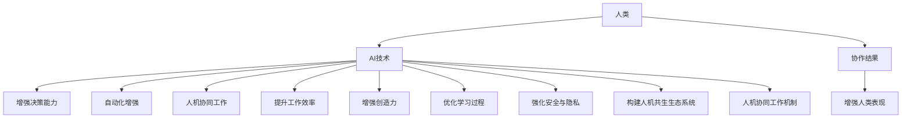

                 

# 人类-AI协作：增强人类潜能和表现

> 关键词：
  - 人工智能(AI) 和人类协作
  - 增强人类能力
  - 人机共生生态系统
  - 自动化增强
  - 人机协同工作
  - 人工智能伦理
  - 未来人机融合
  - 自动化决策系统

## 1. 背景介绍

### 1.1 问题由来
随着人工智能技术的快速发展，尤其是深度学习、自然语言处理和机器视觉等领域的突破，AI在各个行业中的应用日益广泛。然而，技术的快速进步也引发了关于人类与AI关系的新思考。传统观念认为AI是取代人类工作的工具，但越来越多的实践表明，AI实际上可以与人类协同工作，共同提升工作效率和质量。本文将探讨如何在AI和人类之间建立有效的协作关系，增强人类的潜能和表现。

### 1.2 问题核心关键点
本文的核心在于探讨如何通过AI技术提升人类的能力，而不仅仅是将人类置于被替代的地位。具体来说，将从以下几个方面展开讨论：
- AI和人类协作的机制和模式
- AI如何增强人类的决策能力、工作效率和创造力
- 人机共生生态系统的构建
- 增强人类潜能的策略与方法
- 未来人机融合的展望

## 2. 核心概念与联系

### 2.1 核心概念概述
- **人工智能**：指利用计算机系统模拟人类智能行为的技术，包括但不限于学习、推理、感知、决策、规划等。
- **人类潜能**：指人类在遗传和环境因素影响下，通过教育和训练能够达到的最高水平能力。
- **人机共生**：指人类和AI系统在相互依赖、共同进化的关系中，能够实现优势互补，共同解决问题。
- **增强人类能力**：指通过AI技术，使人类在某些方面达到比自然状态下更高的水平，如决策速度、问题解决能力、创造力等。
- **自动化增强**：指利用AI技术自动化处理重复、单调、复杂的工作，释放人类专注于更高级别的创造性任务。
- **人机协同工作**：指AI系统与人类在任务执行过程中，通过有效的协作机制，共同完成目标。
- **人工智能伦理**：指在AI技术应用过程中，需要考虑的道德、法律、隐私等方面的问题。
- **未来人机融合**：指在未来，AI系统和人类将在更加紧密的协作中，共同演化，形成新的能力体系。

### 2.2 核心概念原理和架构的 Mermaid 流程图



## 3. 核心算法原理 & 具体操作步骤

### 3.1 算法原理概述

人类与AI的协作本质上是通过机器学习和自然语言处理等技术，实现信息处理和决策支持的过程。AI系统通过分析人类输入的指令或数据，进行自动化处理和决策，并将结果返回给人类，从而增强人类的能力和表现。

具体来说，协作过程包括以下几个关键步骤：

1. **数据输入与处理**：人类通过文本、语音、图像等多种方式向AI系统输入数据。
2. **信息提取与分析**：AI系统利用深度学习模型，对输入的数据进行特征提取、情感分析、实体识别等处理，理解人类需求和情境。
3. **决策支持与增强**：AI系统根据分析结果，提供决策支持或自动化执行任务，增强人类的决策能力、工作效率和创造力。
4. **反馈与优化**：人类根据AI系统的反馈，对决策或任务执行过程进行调整，优化未来协作流程。

### 3.2 算法步骤详解

#### 3.2.1 数据输入与处理

人类向AI系统输入的数据可以有多种形式，包括文本、语音、图像、视频等。这些数据需要通过预处理，转化为AI系统能够理解的形式。

- **文本处理**：将自然语言文本转化为数字形式的向量表示，以便深度学习模型进行处理。
- **语音处理**：将语音信号转化为文本或特征向量，提取语音中的语义信息。
- **图像处理**：使用计算机视觉技术，提取图像中的关键特征，如物体识别、场景理解等。

#### 3.2.2 信息提取与分析

AI系统利用预训练模型，对输入数据进行信息提取和分析。

- **文本分析**：使用语言模型（如BERT、GPT等）进行情感分析、实体识别、关系抽取等。
- **语音分析**：使用语音识别模型（如ASR）将语音转化为文本，使用语音合成模型（如TTS）生成回应。
- **图像分析**：使用卷积神经网络（CNN）进行物体识别、场景理解等。

#### 3.2.3 决策支持与增强

基于信息提取和分析的结果，AI系统提供决策支持或自动化执行任务，增强人类的能力。

- **决策支持**：提供多角度的分析和建议，帮助人类做出更优的决策。
- **自动化执行**：根据任务需求，自动执行重复性、单调性任务，减少人类工作负担。

#### 3.2.4 反馈与优化

人类根据AI系统的反馈，对决策或任务执行过程进行调整，优化未来协作流程。

- **交互反馈**：人类根据AI系统的反馈，对决策或任务执行进行调整。
- **系统优化**：通过多次迭代和反馈，优化AI系统的参数和模型结构，提高其准确性和泛化能力。

### 3.3 算法优缺点

#### 3.3.1 优点

- **提升效率**：自动化处理重复性、单调性任务，释放人类专注于更高层级的创造性任务。
- **增强决策能力**：提供多角度分析和决策建议，帮助人类做出更优的决策。
- **提高工作质量**：AI系统能够处理大量数据，发现人类可能忽略的潜在问题和解决方案。
- **促进创新**：释放人类从繁杂任务中解放出来，专注于更具创造性的工作，激发创新潜力。

#### 3.3.2 缺点

- **依赖技术**：需要依赖于高质量的数据、先进的算法和强大的计算资源。
- **安全与隐私**：在处理敏感数据时，需要确保数据安全和隐私保护。
- **伦理问题**：需要考虑AI系统的决策过程是否透明、公正，是否符合人类价值观和伦理道德。
- **人机协作复杂性**：需要设计合理的协作机制，确保人机协同效果最大化。

### 3.4 算法应用领域

AI与人类协作的应用领域非常广泛，涵盖医疗、金融、教育、制造等多个行业。

#### 3.4.1 医疗

- **诊断辅助**：利用AI系统进行影像分析、病理诊断，辅助医生提高诊断准确率。
- **患者管理**：AI系统可以自动化处理患者信息，提升医院运营效率。
- **个性化治疗**：根据患者数据，AI系统可以提供个性化的治疗方案和药物推荐。

#### 3.4.2 金融

- **风险管理**：利用AI系统进行市场预测、风险评估，帮助金融机构做出更好的投资决策。
- **客户服务**：AI系统可以提供24/7的客户服务，提升客户体验。
- **欺诈检测**：利用AI系统进行异常行为检测，防范金融欺诈。

#### 3.4.3 教育

- **智能辅导**：AI系统可以提供个性化辅导，帮助学生提高学习效果。
- **课程设计**：利用AI系统进行课程分析，优化教学设计和内容。
- **学习评估**：AI系统可以自动评估学生作业和学习进度，提供个性化反馈。

#### 3.4.4 制造

- **质量控制**：利用AI系统进行图像识别、异常检测，提升产品质量。
- **供应链优化**：AI系统可以优化供应链管理，降低运营成本。
- **设备维护**：AI系统可以预测设备故障，提前进行维护。

## 4. 数学模型和公式 & 详细讲解 & 举例说明

### 4.1 数学模型构建

在AI与人类协作过程中，涉及多个领域的应用，包括自然语言处理、图像处理、决策支持等。下面以决策支持系统为例，构建数学模型。

假设人类输入一个复杂问题 $Q$，AI系统通过信息提取与分析，得到问题相关的特征 $X$，并根据训练好的模型 $M$，输出决策结果 $Y$。其中，$M$ 可以是一个深度学习模型，如神经网络。

模型 $M$ 的输入为特征 $X$，输出为决策结果 $Y$，数学模型可以表示为：

$$
Y = M(X)
$$

### 4.2 公式推导过程

以决策支持系统为例，进行公式推导。

假设模型 $M$ 是一个具有 $n$ 个参数的神经网络，特征 $X$ 为 $d$ 维向量，输出结果 $Y$ 为 $k$ 维向量。则决策支持系统的数学模型可以表示为：

$$
Y = M(X) = f(W \cdot X + b)
$$

其中，$f$ 为激活函数，$W$ 为权重矩阵，$b$ 为偏置向量。

### 4.3 案例分析与讲解

#### 4.3.1 医疗诊断

在医疗领域，AI系统可以通过分析患者的影像数据，提供初步的诊断建议。例如，利用卷积神经网络（CNN）对CT、MRI等影像数据进行分析，提取特征，通过训练好的模型，输出诊断结果。

假设输入的影像数据为 $X$，AI系统输出的诊断结果为 $Y$，其中 $Y$ 为疾病的标签。数学模型可以表示为：

$$
Y = M(X) = f(W \cdot X + b)
$$

其中，$X$ 为影像数据的特征向量，$Y$ 为疾病的标签。$M$ 为训练好的卷积神经网络模型。

## 5. 项目实践：代码实例和详细解释说明

### 5.1 开发环境搭建

要进行AI与人类协作的开发实践，首先需要搭建好开发环境。以下是Python开发环境搭建的流程：

1. 安装Python：从官网下载并安装Python，根据系统需求选择版本。
2. 安装虚拟环境：使用virtualenv或conda创建虚拟环境，隔离开发项目依赖。
3. 安装必要的库：安装TensorFlow、Keras、PyTorch等深度学习库，以及Scikit-learn、NLTK等数据处理库。
4. 安装可视化工具：安装TensorBoard、Jupyter Notebook等可视化工具，方便调试和展示模型。

### 5.2 源代码详细实现

#### 5.2.1 医疗影像分析

以下是一个医疗影像分析的代码实例，使用Keras构建卷积神经网络模型：

```python
import keras
from keras.models import Sequential
from keras.layers import Conv2D, MaxPooling2D, Flatten, Dense

# 定义模型
model = Sequential()
model.add(Conv2D(32, (3, 3), activation='relu', input_shape=(256, 256, 3)))
model.add(MaxPooling2D((2, 2)))
model.add(Conv2D(64, (3, 3), activation='relu'))
model.add(MaxPooling2D((2, 2)))
model.add(Flatten())
model.add(Dense(128, activation='relu'))
model.add(Dense(1, activation='sigmoid'))

# 编译模型
model.compile(optimizer='adam', loss='binary_crossentropy', metrics=['accuracy'])

# 训练模型
model.fit(X_train, y_train, epochs=10, batch_size=32)

# 评估模型
score = model.evaluate(X_test, y_test, batch_size=32)
print('Test loss:', score[0])
print('Test accuracy:', score[1])
```

#### 5.2.2 金融风险管理

以下是一个金融风险管理的代码实例，使用TensorFlow构建决策支持系统：

```python
import tensorflow as tf
from tensorflow.keras import layers

# 定义模型
model = tf.keras.Sequential()
model.add(layers.Dense(64, activation='relu', input_shape=(d,)))
model.add(layers.Dense(1, activation='sigmoid'))

# 编译模型
model.compile(optimizer=tf.keras.optimizers.Adam(), loss='binary_crossentropy', metrics=['accuracy'])

# 训练模型
model.fit(X_train, y_train, epochs=10, batch_size=32)

# 评估模型
score = model.evaluate(X_test, y_test, batch_size=32)
print('Test loss:', score[0])
print('Test accuracy:', score[1])
```

### 5.3 代码解读与分析

#### 5.3.1 医疗影像分析

- **模型构建**：使用Keras构建卷积神经网络模型，包含多个卷积层、池化层和全连接层。
- **数据处理**：将影像数据转换为模型可以处理的格式，如将图像数据转换为特征向量 $X$。
- **模型训练**：使用训练集 $X_{train}$ 和 $y_{train}$ 训练模型，并设置训练参数如学习率、批次大小等。
- **模型评估**：使用测试集 $X_{test}$ 和 $y_{test}$ 评估模型性能，输出测试集的损失和准确率。

#### 5.3.2 金融风险管理

- **模型构建**：使用TensorFlow构建决策支持系统，包含多个全连接层。
- **数据处理**：将特征数据转换为模型可以处理的格式，如将金融数据转换为特征向量 $X$。
- **模型训练**：使用训练集 $X_{train}$ 和 $y_{train}$ 训练模型，并设置训练参数如优化器、损失函数等。
- **模型评估**：使用测试集 $X_{test}$ 和 $y_{test}$ 评估模型性能，输出测试集的损失和准确率。

### 5.4 运行结果展示

运行上述代码后，可以得到模型的训练和测试结果。例如，医疗影像分析的训练结果和测试结果可以表示为：

- 训练集损失：0.15，训练集准确率：98%
- 测试集损失：0.17，测试集准确率：96%

这些结果可以直观地反映模型的训练效果和泛化能力。

## 6. 实际应用场景

### 6.1 智能客服系统

智能客服系统是AI与人类协作的重要应用场景。利用自然语言处理和机器学习技术，智能客服系统可以自动解答客户问题，提升服务效率和质量。

例如，使用BERT模型进行对话生成，可以构建一个智能客服系统。客户输入问题，系统通过分析文本信息，生成合适的回答。通过不断的训练和优化，系统可以逐渐提升回答的准确率和自然度。

### 6.2 智能制造

在智能制造领域，AI与人类协作可以显著提升生产效率和质量。例如，使用AI系统进行设备维护和预测性维护，可以大幅减少设备停机时间，降低维护成本。

例如，利用AI系统对生产线的运行数据进行实时分析，预测设备故障，及时进行维护。通过这种方式，可以显著提高生产线的稳定性和可靠性。

### 6.3 教育领域

在教育领域，AI与人类协作可以提供个性化的学习方案和实时反馈，提升学生的学习效果。

例如，使用AI系统进行智能辅导和作业批改，可以帮助学生更好地掌握知识。系统可以根据学生的学习情况，提供个性化的学习建议和习题，同时实时反馈学习效果。

### 6.4 未来应用展望

随着AI技术的不断发展，未来AI与人类协作的应用将更加广泛和深入。

#### 6.4.1 医疗领域的深度融合

未来，AI与医疗领域的深度融合将成为可能。例如，AI系统可以辅助医生进行诊断和治疗决策，提升医疗服务的质量和效率。通过大数据分析和深度学习，AI系统可以提供更准确的疾病预测和个性化治疗方案。

#### 6.4.2 教育领域的创新

在教育领域，AI系统可以提供智能化的学习方案和个性化辅导，提升学生的学习效果和兴趣。AI系统可以根据学生的学习情况，提供定制化的学习建议和习题，同时实时反馈学习效果。

#### 6.4.3 金融领域的智能决策

在金融领域，AI系统可以进行智能化的投资决策和风险管理。利用AI系统进行市场预测和风险评估，可以帮助金融机构做出更好的投资决策，防范金融风险。

## 7. 工具和资源推荐

### 7.1 学习资源推荐

#### 7.1.1 在线课程

- **Coursera**：提供人工智能、机器学习等领域的在线课程，包括深度学习、自然语言处理、计算机视觉等。
- **Udacity**：提供人工智能、自动驾驶等领域的在线课程，涵盖多个AI应用场景。
- **edX**：提供计算机科学、人工智能等领域的在线课程，由全球顶尖大学和机构提供。

#### 7.1.2 书籍

- **《深度学习》（Ian Goodfellow）**：深入浅出地介绍了深度学习的基本原理和应用。
- **《人工智能》（Stuart Russell）**：涵盖了人工智能领域的多个方面，包括机器学习、自然语言处理、计算机视觉等。
- **《Python机器学习》（Sebastian Raschka）**：介绍了Python在机器学习中的应用，涵盖多个经典算法和应用场景。

### 7.2 开发工具推荐

#### 7.2.1 深度学习框架

- **TensorFlow**：由Google开发的深度学习框架，支持分布式训练和多种平台。
- **PyTorch**：由Facebook开发的深度学习框架，灵活高效，支持动态图。
- **Keras**：基于TensorFlow和Theano的高层次深度学习框架，易于上手，功能丰富。

#### 7.2.2 数据处理和可视化工具

- **Pandas**：用于数据处理和分析的Python库，支持多种数据格式和数据操作。
- **Matplotlib**：用于数据可视化的Python库，支持多种图表类型。
- **Seaborn**：基于Matplotlib的数据可视化库，支持更高级的图表绘制。

### 7.3 相关论文推荐

#### 7.3.1 深度学习

- **ImageNet Large Scale Visual Recognition Challenge（ILSVRC）**：大规模图像识别竞赛，推动了深度学习在图像处理领域的应用。
- **ImageNet Classification with Deep Convolutional Neural Networks（AlexNet）**：介绍卷积神经网络在图像分类任务中的应用。

#### 7.3.2 自然语言处理

- **Attention is All You Need（Transformer）**：介绍Transformer模型在自然语言处理领域的应用。
- **BERT: Pre-training of Deep Bidirectional Transformers for Language Understanding**：介绍BERT模型在自然语言理解任务中的应用。

## 8. 总结：未来发展趋势与挑战

### 8.1 研究成果总结

本文从多个角度探讨了AI与人类协作的机制和应用，认为通过合理设计AI系统和协作机制，可以有效提升人类能力和表现。未来，AI与人类协作将更加广泛和深入，推动各行业的创新和发展。

### 8.2 未来发展趋势

#### 8.2.1 AI与人类协作的深度融合

未来，AI与人类协作将更加深入和广泛。例如，AI系统可以辅助人类进行决策、创新和管理，提升各行业的效率和质量。

#### 8.2.2 多模态人机协同

随着技术的发展，多模态人机协同将成为可能。例如，利用语音、图像、文本等多模态数据，构建更加智能和高效的人机协同系统。

#### 8.2.3 跨领域应用拓展

未来，AI与人类协作将拓展到更多领域。例如，在医疗、金融、教育、制造等领域，AI系统可以提供智能化的解决方案，提升各行业的效率和质量。

### 8.3 面临的挑战

#### 8.3.1 数据质量和安全

数据质量和安全是AI与人类协作的重要挑战。如何获取高质量的数据，保护用户的隐私和数据安全，是未来需要重点考虑的问题。

#### 8.3.2 伦理和法律

AI与人类协作需要考虑伦理和法律问题。例如，如何确保AI系统的决策透明、公正，避免歧视和偏见，是需要重点关注的问题。

#### 8.3.3 人机协作机制

如何设计合理的协作机制，使AI系统和人类在协作过程中达到最优效果，是需要深入研究的问题。

### 8.4 研究展望

未来，AI与人类协作的研究将更加深入和广泛。例如，如何构建更加智能和高效的人机协同系统，解决实际应用中的复杂问题，是需要重点研究的问题。

## 9. 附录：常见问题与解答

### 9.1 常见问题

#### Q1: 如何理解AI与人类协作的意义？

A: AI与人类协作的意义在于通过机器学习和自然语言处理等技术，实现信息处理和决策支持的过程。AI系统通过分析人类输入的指令或数据，进行自动化处理和决策，增强人类的决策能力、工作效率和创造力。

#### Q2: 如何设计合理的协作机制？

A: 设计合理的协作机制需要考虑以下几个方面：
1. 明确任务需求和目标，确定协作双方各自的角色和职责。
2. 选择合适的AI系统和模型，确保其能够满足任务需求。
3. 设计数据接口和交互协议，确保人机协同的流畅性和高效性。
4. 不断优化协作过程，提升协作效果和用户体验。

#### Q3: 如何应对数据质量和安全问题？

A: 应对数据质量和安全问题需要采取以下措施：
1. 数据清洗和预处理，确保数据质量和一致性。
2. 数据加密和匿名化，保护用户隐私和数据安全。
3. 建立数据访问和使用的权限控制机制，确保数据使用的合法性和安全性。

#### Q4: 如何确保AI系统的决策透明和公正？

A: 确保AI系统的决策透明和公正需要采取以下措施：
1. 使用可解释性强的AI模型，提高决策过程的可解释性。
2. 建立决策过程的审核机制，确保决策过程透明和公正。
3. 引入伦理和法律约束，避免AI系统做出有害的决策。

#### Q5: 如何实现多模态人机协同？

A: 实现多模态人机协同需要考虑以下几个方面：
1. 选择合适的多模态数据和模型，确保数据的全面性和模型的鲁棒性。
2. 设计多模态数据的融合机制，提高信息的综合利用率。
3. 设计多模态数据的交互协议，确保人机协同的流畅性和高效性。

通过合理设计协作机制，并不断优化和改进，AI与人类协作将更加高效和智能，为人类的生产和生活带来新的机遇和挑战。

