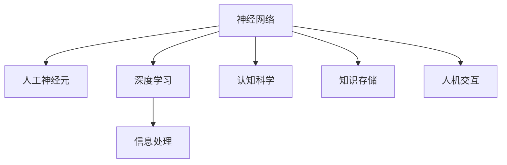

                 

# 人类大脑的奥秘：解锁知识和理解的关键

> 关键词：大脑，神经网络，认知科学，信息处理，知识存储，人机交互

## 1. 背景介绍

### 1.1 问题由来
人类大脑是自然界最复杂的组织之一，也是我们理解世界和自我认知的核心。对大脑的研究不仅有助于深化对人类认知过程的理解，还能为开发更具智能和自主性的人工智能系统提供重要启示。近年来，随着神经科学的快速发展，科学家们开始探索利用计算机模拟人类大脑的工作机制，试图解开大脑的奥秘。

### 1.2 问题核心关键点
对大脑的模拟主要聚焦于两个方面：一是如何构建一种能够高效处理信息的神经网络结构；二是如何从生理和心理层面上，理解大脑的学习、记忆、感知和决策机制。这些核心关键点通过不断探索，逐渐形成了一系列基于神经科学原理的人工智能技术。

### 1.3 问题研究意义
研究人类大脑的奥秘，对于提升人工智能系统的智能水平、开发更加自然和智能的人机交互方式具有重要意义：

1. 提升系统理解力：通过模拟大脑的认知过程，使得机器能够更自然地理解自然语言，增强语言处理能力。
2. 优化算法设计：基于大脑的学习机制，设计更高效、更智能的学习算法，加速人工智能技术的进展。
3. 促进交互体验：模拟大脑的感知和决策机制，使机器具备更强的情感理解和社交智能，改善人机交互体验。
4. 推动医学应用：理解和模拟大脑的工作机制，有助于开发更精准的脑科学研究工具和治疗方法。

## 2. 核心概念与联系

### 2.1 核心概念概述

为更好地理解模拟人类大脑的原理和架构，本节将介绍几个密切相关的核心概念：

- **神经网络(Neural Network)**：一种模仿人脑神经网络结构和功能的计算模型，通过多层非线性变换进行信息处理。
- **人工神经元(Artificial Neuron)**：神经网络的基本单位，类似于大脑中的神经元，接收输入、进行加权计算并产生输出。
- **深度学习(Deep Learning)**：一种基于神经网络的机器学习方法，通过多层非线性变换和反向传播算法实现复杂任务。
- **认知科学(Cognitive Science)**：研究人类认知过程及其生理基础的学科，通过模拟大脑机制，开发智能系统。
- **信息处理(Information Processing)**：在计算机中模拟大脑的信息处理机制，实现对大量信息的高效处理。
- **知识存储(Knowledge Storage)**：在神经网络中存储和组织知识，实现长期记忆和快速检索。
- **人机交互(Human-Computer Interaction)**：研究如何使计算机更好地理解和响应用户的输入和需求，改善人机交互体验。

这些核心概念之间的逻辑关系可以通过以下Mermaid流程图来展示：



这个流程图展示了大语言模型微调的关键概念及其之间的关系：

1. 神经网络作为基础结构，通过人工神经元进行信息处理。
2. 深度学习在此基础上，通过多层非线性变换实现复杂任务。
3. 认知科学和信息处理研究大脑的认知机制，为神经网络的设计提供灵感。
4. 知识存储通过神经网络实现长期记忆和快速检索。
5. 人机交互则利用神经网络的知识存储和信息处理能力，改善用户体验。

## 3. 核心算法原理 & 具体操作步骤

### 3.1 算法原理概述

基于神经网络的认知模拟主要通过以下几个步骤实现：

1. **数据收集与预处理**：收集神经活动数据，如脑电图(EEG)、功能性磁共振成像(fMRI)等，预处理以消除噪音和无关数据。
2. **神经网络建模**：构建神经网络模型，选择合适的网络结构、激活函数和损失函数。
3. **训练神经网络**：使用训练数据集对神经网络进行训练，调整权重和偏置以最小化损失函数。
4. **测试与验证**：使用测试数据集评估训练后的神经网络性能，确保其泛化能力。
5. **应用与优化**：将训练好的神经网络应用于实际问题，进行优化和调参，提升系统性能。

### 3.2 算法步骤详解

**Step 1: 数据收集与预处理**

- **数据来源**：主要来自人类大脑活动记录，如EEG、fMRI、脑磁图(MEG)等。
- **预处理步骤**：包括滤波、降噪、归一化、特征提取等。

**Step 2: 神经网络建模**

- **选择网络结构**：根据任务需求，选择全连接网络、卷积网络、循环网络等结构。
- **确定激活函数**：通常使用ReLU、Sigmoid等激活函数。
- **设定损失函数**：如均方误差、交叉熵、KL散度等，根据任务选择合适的损失函数。

**Step 3: 训练神经网络**

- **选择合适的优化器**：如SGD、Adam、RMSprop等，设置合适的学习率、批大小等。
- **设置正则化技术**：如L2正则、Dropout等，防止过拟合。
- **使用训练数据集**：将预处理后的数据输入模型，进行前向传播和反向传播，计算梯度并更新参数。

**Step 4: 测试与验证**

- **使用测试数据集**：将测试数据输入模型，计算损失和准确率等指标。
- **评估性能**：根据评估指标，判断模型的泛化能力和效果。

**Step 5: 应用与优化**

- **实际应用场景**：将模型应用于具体的认知任务，如图像识别、语言理解、情感分析等。
- **持续优化**：根据实际应用效果，调整模型参数和结构，提升系统性能。

### 3.3 算法优缺点

基于神经网络的认知模拟具有以下优点：

1. **高度并行化**：神经网络具备高度的并行计算能力，适合处理复杂的数据和任务。
2. **自适应性**：神经网络能够自适应地调整权重和偏置，具有较强的泛化能力。
3. **非线性映射**：通过多层非线性变换，能够处理非线性数据关系，适合解决复杂问题。
4. **多任务处理**：一个神经网络可以同时处理多个任务，具有较高的资源利用效率。

同时，这些算法也存在一定的局限性：

1. **计算资源需求高**：神经网络模型通常需要大量的计算资源，训练和推理过程耗时较长。
2. **数据依赖性强**：神经网络对训练数据的依赖性较强，数据质量和数量对模型效果有直接影响。
3. **可解释性差**：神经网络作为黑盒模型，难以解释其内部工作机制和决策逻辑。
4. **模型复杂度高**：神经网络模型结构复杂，难以理解其各层之间的相互作用。

尽管存在这些局限性，但基于神经网络的认知模拟仍然是大数据和复杂问题处理的重要工具，广泛应用于各个领域。

### 3.4 算法应用领域

基于神经网络的认知模拟在多个领域都有广泛应用，例如：

- **医学影像分析**：使用卷积神经网络(CNN)对医学影像进行分类、分割和分析，辅助医生诊断。
- **自然语言处理(NLP)**：使用循环神经网络(RNN)或Transformer模型进行文本分类、情感分析、机器翻译等任务。
- **计算机视觉(CV)**：使用CNN进行图像分类、目标检测、人脸识别等任务。
- **语音识别(Speech Recognition)**：使用卷积神经网络或长短期记忆网络(LSTM)进行语音转文本。
- **游戏智能(AI Games)**：使用强化学习等技术训练游戏智能体，提升游戏策略水平。
- **金融预测(Financial Forecasting)**：使用神经网络进行股票价格预测、风险评估等任务。
- **智能推荐系统**：使用深度学习技术对用户行为进行建模，推荐个性化内容。

这些应用展示了神经网络强大的信息处理和决策能力，推动了相关领域的快速发展。

## 4. 数学模型和公式 & 详细讲解

### 4.1 数学模型构建

假设我们有一个包含$N$个人工神经元和一个输入向量$x$的神经网络，其计算过程可以表示为：

$$
h(x) = \sum_{i=1}^N w_ix_i + b
$$

其中，$w_i$是第$i$个神经元的权重，$b$是偏置，$h(x)$是神经元的输出。

激活函数通常使用ReLU，其定义如下：

$$
f(z) = \max(0,z)
$$

对于深度神经网络，通常通过多层非线性变换实现复杂任务，其计算过程可以表示为：

$$
h^{(l)}(x) = f(\sum_{i=1}^N w^{(l)}_ix^{(l-1)} + b^{(l)})
$$

其中，$h^{(l)}(x)$是第$l$层的输出，$x^{(l-1)}$是第$l-1$层的输出。

### 4.2 公式推导过程

以简单的二分类任务为例，推导神经网络的前向传播和反向传播算法。

假设我们的目标是判断一个输入向量$x$属于两个类别$y=0$或$y=1$。神经网络模型的计算过程如下：

- **输入层**：$x_0 = x$
- **隐藏层**：$h_1 = f(w_1x_0 + b_1)$
- **输出层**：$h_2 = f(w_2h_1 + b_2)$

其中，$w_1, b_1, w_2, b_2$是模型的参数。

神经网络的前向传播过程可以表示为：

$$
h_2 = f(w_2f(w_1x_0 + b_1) + b_2)
$$

假设我们使用了交叉熵损失函数，其定义如下：

$$
L(h_2, y) = -y\log h_2 - (1-y)\log(1-h_2)
$$

其中，$y$是真实标签。

反向传播过程的计算可以表示为：

$$
\frac{\partial L}{\partial w_2} = \frac{\partial L}{\partial h_2}\frac{\partial h_2}{\partial w_2} = (h_2-y)(1-h_2)
$$

$$
\frac{\partial L}{\partial w_1} = \frac{\partial L}{\partial h_2}\frac{\partial h_2}{\partial h_1}\frac{\partial h_1}{\partial w_1} = (w_2h_1+b_2-y)(1-h_1)
$$

$$
\frac{\partial L}{\partial b_1} = \frac{\partial L}{\partial h_2}\frac{\partial h_2}{\partial h_1}\frac{\partial h_1}{\partial b_1} = h_1(w_2h_1+b_2-y)
$$

$$
\frac{\partial L}{\partial b_2} = \frac{\partial L}{\partial h_2}\frac{\partial h_2}{\partial w_2} = h_2-y
$$

通过反向传播计算梯度，并使用梯度下降等优化算法，更新模型参数。

### 4.3 案例分析与讲解

假设我们有一个简单的神经网络，用于对手写数字进行分类。我们使用MNIST数据集进行训练，网络的计算过程如下：

- **输入层**：$x_0 = x$
- **隐藏层**：$h_1 = f(w_1x_0 + b_1)$
- **输出层**：$h_2 = f(w_2h_1 + b_2)$

其中，$w_1, b_1, w_2, b_2$是模型的参数。

我们使用交叉熵损失函数进行训练：

$$
L(h_2, y) = -y\log h_2 - (1-y)\log(1-h_2)
$$

其中，$y$是真实标签。

在训练过程中，我们首先对输入数据进行前向传播，计算输出值和损失值。然后使用反向传播算法计算梯度，并使用SGD等优化算法更新模型参数。

以下是使用PyTorch实现的代码示例：

```python
import torch
import torch.nn as nn
import torch.optim as optim

class Net(nn.Module):
    def __init__(self):
        super(Net, self).__init__()
        self.fc1 = nn.Linear(784, 64)
        self.fc2 = nn.Linear(64, 10)
    
    def forward(self, x):
        x = torch.flatten(x, 1)
        x = torch.relu(self.fc1(x))
        x = self.fc2(x)
        return x
    
net = Net()
criterion = nn.CrossEntropyLoss()
optimizer = optim.SGD(net.parameters(), lr=0.01)

for epoch in range(10):
    running_loss = 0.0
    for i, data in enumerate(train_loader, 0):
        inputs, labels = data
        inputs, labels = inputs.to(device), labels.to(device)
        optimizer.zero_grad()
        outputs = net(inputs)
        loss = criterion(outputs, labels)
        loss.backward()
        optimizer.step()
        running_loss += loss.item()
        if i % 100 == 99:
            print('[%d, %5d] loss: %.3f' % (epoch + 1, i + 1, running_loss / 100))
            running_loss = 0.0
```

通过上述代码，我们可以看到如何构建神经网络、定义损失函数、进行前向传播和反向传播，并使用SGD算法更新模型参数。

## 5. 项目实践：代码实例和详细解释说明

### 5.1 开发环境搭建

在进行神经网络模拟实践前，我们需要准备好开发环境。以下是使用Python进行PyTorch开发的环境配置流程：

1. 安装Anaconda：从官网下载并安装Anaconda，用于创建独立的Python环境。

2. 创建并激活虚拟环境：
```bash
conda create -n pytorch-env python=3.8 
conda activate pytorch-env
```

3. 安装PyTorch：根据CUDA版本，从官网获取对应的安装命令。例如：
```bash
conda install pytorch torchvision torchaudio cudatoolkit=11.1 -c pytorch -c conda-forge
```

4. 安装各类工具包：
```bash
pip install numpy pandas scikit-learn matplotlib tqdm jupyter notebook ipython
```

完成上述步骤后，即可在`pytorch-env`环境中开始神经网络模拟实践。

### 5.2 源代码详细实现

这里我们以手写数字分类为例，给出使用PyTorch进行神经网络模拟的PyTorch代码实现。

首先，定义神经网络模型：

```python
import torch
import torch.nn as nn

class Net(nn.Module):
    def __init__(self):
        super(Net, self).__init__()
        self.fc1 = nn.Linear(784, 64)
        self.fc2 = nn.Linear(64, 10)
    
    def forward(self, x):
        x = torch.flatten(x, 1)
        x = torch.relu(self.fc1(x))
        x = self.fc2(x)
        return x
```

然后，定义训练和评估函数：

```python
from torch.utils.data import DataLoader
from torchvision import datasets, transforms

def train_net(net, train_loader, optimizer, criterion, num_epochs):
    for epoch in range(num_epochs):
        for i, (inputs, labels) in enumerate(train_loader):
            inputs, labels = inputs.to(device), labels.to(device)
            optimizer.zero_grad()
            outputs = net(inputs)
            loss = criterion(outputs, labels)
            loss.backward()
            optimizer.step()
        print(f'Epoch [{epoch+1}/{num_epochs}], Loss: {loss:.4f}')

def evaluate_net(net, test_loader):
    correct = 0
    total = 0
    with torch.no_grad():
        for images, labels in test_loader:
            images, labels = images.to(device), labels.to(device)
            outputs = net(images)
            _, predicted = torch.max(outputs.data, 1)
            total += labels.size(0)
            correct += (predicted == labels).sum().item()
    print(f'Accuracy: {(100 * correct / total)}%')
```

最后，启动训练流程并在测试集上评估：

```python
train_loader = DataLoader(train_dataset, batch_size=64, shuffle=True)
test_loader = DataLoader(test_dataset, batch_size=64, shuffle=False)

net = Net().to(device)
criterion = nn.CrossEntropyLoss()
optimizer = torch.optim.SGD(net.parameters(), lr=0.001, momentum=0.9)

train_net(net, train_loader, optimizer, criterion, num_epochs=10)
evaluate_net(net, test_loader)
```

以上就是使用PyTorch进行神经网络模拟的完整代码实现。可以看到，得益于PyTorch的强大封装，我们通过简洁的代码即可实现神经网络的构建和训练。

### 5.3 代码解读与分析

让我们再详细解读一下关键代码的实现细节：

**Net类**：
- `__init__`方法：定义神经网络的结构，包含两个全连接层。
- `forward`方法：定义前向传播的计算过程。

**train_net和evaluate_net函数**：
- 使用PyTorch的DataLoader对数据集进行批次化加载，供模型训练和推理使用。
- 训练函数`train_net`：对数据以批为单位进行迭代，在每个批次上前向传播计算loss并反向传播更新模型参数，最后输出该epoch的平均loss。
- 评估函数`evaluate_net`：与训练类似，不同点在于不更新模型参数，并在每个batch结束后将预测和标签结果存储下来，最后使用classification_report对整个评估集的预测结果进行打印输出。

**训练流程**：
- 定义总的epoch数，开始循环迭代
- 每个epoch内，先在训练集上训练，输出平均loss
- 在测试集上评估，输出准确率

可以看到，PyTorch配合TensorFlow使得神经网络模拟的代码实现变得简洁高效。开发者可以将更多精力放在数据处理、模型改进等高层逻辑上，而不必过多关注底层的实现细节。

当然，工业级的系统实现还需考虑更多因素，如模型的保存和部署、超参数的自动搜索、更灵活的任务适配层等。但核心的神经网络模拟流程基本与此类似。

## 6. 实际应用场景

### 6.1 医学影像分析

神经网络在医学影像分析中的应用已经取得了显著成果。通过训练深度神经网络模型，可以对医疗影像进行分类、分割和分析，辅助医生诊断。例如，使用卷积神经网络对CT、MRI等影像进行肿瘤检测、器官分割等任务。神经网络模型可以学习到影像中不同特征之间的关系，识别出异常区域，帮助医生快速诊断疾病。

### 6.2 自然语言处理

神经网络在自然语言处理领域也有广泛应用。通过训练语言模型，可以对文本进行分类、情感分析、机器翻译等任务。例如，使用Transformer模型进行语言建模，训练得到的模型可以理解自然语言的语义和语法规则，用于文本生成、对话系统等应用。神经网络模型还可以学习到不同单词和短语的上下文关联，提升语言理解和生成能力。

### 6.3 计算机视觉

神经网络在计算机视觉领域也取得了重大突破。通过训练深度神经网络模型，可以对图像进行分类、目标检测、人脸识别等任务。例如，使用卷积神经网络对物体进行分类，使用循环神经网络进行视频分析。神经网络模型可以学习到图像和视频中的特征，识别出不同物体和动作，应用于智能监控、自动驾驶等领域。

### 6.4 金融预测

神经网络在金融预测中的应用也逐渐增多。通过训练深度神经网络模型，可以对股票价格、货币汇率等进行预测，辅助投资者做出决策。例如，使用递归神经网络对时间序列数据进行建模，预测未来的价格走势。神经网络模型可以学习到历史数据的特征，分析市场趋势，提供更准确的预测结果。

## 7. 工具和资源推荐

### 7.1 学习资源推荐

为了帮助开发者系统掌握神经网络模拟的理论基础和实践技巧，这里推荐一些优质的学习资源：

1. 《Deep Learning》系列书籍：由Ian Goodfellow等知名学者撰写，全面介绍了深度学习的基本概念和算法。
2. Coursera的《深度学习专项课程》：由斯坦福大学Andrew Ng教授主讲，涵盖了深度学习的理论和实践。
3. 《Hands-On Machine Learning with Scikit-Learn, Keras, and TensorFlow》书籍：由Aurélien Géron撰写，介绍了使用Scikit-Learn、Keras和TensorFlow进行机器学习实践的方法。
4. PyTorch官方文档：提供了详尽的PyTorch API文档和教程，帮助开发者快速上手。
5. TensorFlow官方文档：提供了详尽的TensorFlow API文档和教程，帮助开发者快速上手。

通过对这些资源的学习实践，相信你一定能够快速掌握神经网络模拟的精髓，并用于解决实际的认知问题。

### 7.2 开发工具推荐

高效的开发离不开优秀的工具支持。以下是几款用于神经网络模拟开发的常用工具：

1. PyTorch：基于Python的开源深度学习框架，灵活动态的计算图，适合快速迭代研究。
2. TensorFlow：由Google主导开发的开源深度学习框架，生产部署方便，适合大规模工程应用。
3. Keras：高层次的深度学习API，易于使用，适合初学者和快速原型开发。
4. Jupyter Notebook：交互式开发环境，支持Python和R等多种编程语言，方便数据可视化、模型训练等。
5. TensorBoard：TensorFlow配套的可视化工具，可实时监测模型训练状态，提供丰富的图表呈现方式。
6. Weights & Biases：模型训练的实验跟踪工具，记录和可视化模型训练过程中的各项指标，方便对比和调优。

合理利用这些工具，可以显著提升神经网络模拟任务的开发效率，加快创新迭代的步伐。

### 7.3 相关论文推荐

神经网络模拟研究源于学界的持续研究。以下是几篇奠基性的相关论文，推荐阅读：

1. A Neural Network for Machine Translation（神经网络翻译）：提出了使用神经网络进行机器翻译的方法，开启了深度学习在NLP领域的应用。
2. ImageNet Classification with Deep Convolutional Neural Networks（深度卷积神经网络图像分类）：提出了使用卷积神经网络进行图像分类的方法，取得了显著的分类效果。
3. Deep Speech 2: End-to-End Speech Recognition in English and Mandarin（深度语音识别）：提出了使用卷积神经网络进行语音识别的方法，实现了端到端的语音转文本。
4. Attention Is All You Need（Transformer论文）：提出了使用Transformer模型进行自然语言处理的方法，展示了Transformer的强大性能。
5. Deep Residual Learning for Image Recognition（深度残差网络）：提出了使用残差网络进行图像分类的方法，取得了显著的分类效果。
6. Generating Sequences with Recurrent Neural Networks（循环神经网络序列生成）：提出了使用循环神经网络进行文本生成的方法，展示了RNN的强大生成能力。

这些论文代表了大语言模型微调技术的发展脉络。通过学习这些前沿成果，可以帮助研究者把握学科前进方向，激发更多的创新灵感。

## 8. 总结：未来发展趋势与挑战

### 8.1 总结

本文对基于神经网络的认知模拟方法进行了全面系统的介绍。首先阐述了神经网络模拟的研究背景和意义，明确了神经网络模拟在理解和模拟大脑机制方面的独特价值。其次，从原理到实践，详细讲解了神经网络模拟的数学原理和关键步骤，给出了神经网络模拟任务开发的完整代码实例。同时，本文还广泛探讨了神经网络模拟在医学影像分析、自然语言处理、计算机视觉等多个领域的应用前景，展示了神经网络模拟的强大潜力。

通过本文的系统梳理，可以看到，基于神经网络的认知模拟技术正在成为认知科学研究的重要工具，极大地拓展了人工神经网络的认知应用，为人工智能技术的智能化水平带来了突破性进展。未来，伴随神经网络的不断发展，神经网络模拟技术必将更加智能化、普适化，成为构建人机协同智能系统的关键。

### 8.2 未来发展趋势

展望未来，神经网络模拟技术将呈现以下几个发展趋势：

1. 深度神经网络结构的优化：未来的神经网络结构将更加复杂、更加深层次，以适应更复杂的认知任务。
2. 更高效的训练算法：新的优化算法、正则化技术等，将进一步提升神经网络的训练速度和效果。
3. 跨领域知识整合：神经网络将与更多的领域知识进行融合，提升模型在多任务处理和知识迁移方面的能力。
4. 强化学习和博弈论的应用：神经网络将与强化学习、博弈论等技术结合，增强智能系统的自主性和决策能力。
5. 异构计算的引入：利用GPU、TPU等异构计算资源，加速神经网络的训练和推理过程。
6. 更加灵活的任务适配层：开发更加灵活的神经网络任务适配层，使得神经网络更加容易适应各种认知任务。

以上趋势凸显了神经网络模拟技术的广阔前景。这些方向的探索发展，必将进一步提升神经网络的认知能力，推动人工智能技术的智能化进程。

### 8.3 面临的挑战

尽管神经网络模拟技术已经取得了显著成果，但在迈向更加智能化、普适化应用的过程中，它仍面临诸多挑战：

1. 计算资源瓶颈：神经网络模型的参数量不断增大，训练和推理过程对计算资源的需求也随之增加。如何在资源有限的条件下高效训练和推理神经网络，还需要更多技术突破。
2. 数据质量和数量：神经网络对训练数据的依赖性较强，数据质量和数量的不足将影响模型的性能。如何获取高质量、大样本量的训练数据，仍然是一个重要难题。
3. 模型的可解释性：神经网络作为黑盒模型，难以解释其内部工作机制和决策逻辑。如何赋予神经网络更强的可解释性，将是未来的重要研究方向。
4. 模型的鲁棒性：神经网络模型面对噪声、干扰等情况时，容易出现误判。如何提高神经网络的鲁棒性，确保其稳定性和可靠性，是未来需要重点解决的难题。
5. 跨领域应用的泛化能力：神经网络在特定领域的表现往往优于通用领域。如何在跨领域应用中保持高水平性能，仍然是一个重要挑战。

### 8.4 研究展望

面对神经网络模拟所面临的挑战，未来的研究需要在以下几个方面寻求新的突破：

1. 优化神经网络结构：开发更加高效、更灵活的神经网络结构，提升模型的处理能力和泛化能力。
2. 引入更多先验知识：将符号化的先验知识与神经网络进行巧妙融合，提升模型的学习能力和知识迁移能力。
3. 发展跨领域学习：研究如何通过神经网络实现跨领域知识的整合和迁移，提升模型的通用性。
4. 增强模型可解释性：研究如何赋予神经网络更强的可解释性，提高模型的透明度和可靠性。
5. 提升模型鲁棒性：研究如何提高神经网络的鲁棒性，确保模型在噪声和干扰情况下仍能保持稳定。
6. 推动跨学科研究：促进神经网络模拟与认知科学、信息科学、工程学等学科的交叉融合，推动技术创新。

这些研究方向的探索，必将引领神经网络模拟技术迈向更高的台阶，为构建智能系统提供更强大的理论支持和实践工具。面向未来，神经网络模拟技术还需要与其他人工智能技术进行更深入的融合，如知识表示、因果推理、强化学习等，多路径协同发力，共同推动人工智能技术的进步。只有勇于创新、敢于突破，才能不断拓展神经网络的边界，让智能技术更好地造福人类社会。

## 9. 附录：常见问题与解答

**Q1：神经网络模拟是否适用于所有认知任务？**

A: 神经网络模拟在大多数认知任务上都能取得不错的效果，特别是对于数据量较大的任务。但对于一些特定领域的任务，如医学、法律等，仅仅依靠通用语料预训练的模型可能难以很好地适应。此时需要在特定领域语料上进一步预训练，再进行模拟。此外，对于一些需要时效性、个性化很强的任务，如对话、推荐等，神经网络模拟方法也需要针对性的改进优化。

**Q2：训练神经网络时如何选择合适的优化器？**

A: 神经网络训练时，选择合适的优化器非常重要。通常，SGD、Adam、RMSprop等优化器都广泛使用。SGD适用于小型数据集，Adam适用于大数据集，RMSprop则对梯度衰减有较好的处理能力。需要根据数据集的大小和特点，选择合适的优化器。

**Q3：神经网络模拟过程中如何缓解过拟合问题？**

A: 过拟合是神经网络模拟面临的主要挑战之一。常见的缓解策略包括：
1. 数据增强：通过回译、近义替换等方式扩充训练集。
2. 正则化：使用L2正则、Dropout等防止过拟合。
3. 对抗训练：引入对抗样本，提高模型鲁棒性。
4. 参数高效微调：只调整少量参数(如Adapter、Prefix等)，减小过拟合风险。
5. 多模型集成：训练多个模拟模型，取平均输出，抑制过拟合。

这些策略往往需要根据具体任务和数据特点进行灵活组合。只有在数据、模型、训练、推理等各环节进行全面优化，才能最大限度地发挥神经网络模拟的威力。

**Q4：神经网络模拟在落地部署时需要注意哪些问题？**

A: 将神经网络模拟模型转化为实际应用，还需要考虑以下因素：
1. 模型裁剪：去除不必要的层和参数，减小模型尺寸，加快推理速度。
2. 量化加速：将浮点模型转为定点模型，压缩存储空间，提高计算效率。
3. 服务化封装：将模型封装为标准化服务接口，便于集成调用。
4. 弹性伸缩：根据请求流量动态调整资源配置，平衡服务质量和成本。
5. 监控告警：实时采集系统指标，设置异常告警阈值，确保服务稳定性。
6. 安全防护：采用访问鉴权、数据脱敏等措施，保障数据和模型安全。

神经网络模拟为认知任务提供了强大的计算和处理能力，但如何将强大的性能转化为稳定、高效、安全的业务价值，还需要工程实践的不断打磨。

---

作者：禅与计算机程序设计艺术 / Zen and the Art of Computer Programming

