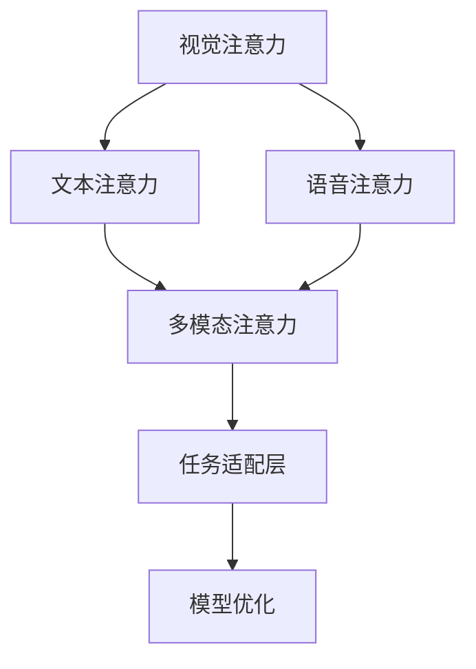

                 

# 人类注意力在AI时代的价值

## 1. 背景介绍

### 1.1 问题由来

随着人工智能（AI）技术的发展，机器学习模型在各个领域的应用越来越广泛，从自动驾驶到医疗诊断，从语音识别到自然语言处理，AI正逐步改变我们的生产生活方式。然而，尽管AI模型在复杂任务上取得了令人瞩目的成果，其处理复杂问题的能力仍然存在局限。究其根本，在于AI模型缺乏人类特有的注意力机制，无法在处理复杂问题时，精准地聚焦关键信息和细节。

### 1.2 问题核心关键点

人类注意力机制，是大脑对信息选择和处理的高级认知能力。在AI时代，通过模拟人类注意力机制，开发更加智能化、灵活的模型，将成为提升AI系统表现的关键。当前，人类注意力在AI领域的应用，主要集中在以下几个方面：

1. 视觉注意力：通过模拟人类视觉系统，让AI模型能够像人眼一样，选择关注场景中的关键区域，提取有用信息。
2. 文本注意力：将人类阅读时对文本的集中注意力机制引入模型，提升NLP任务中的语义理解能力。
3. 语音注意力：通过模拟人耳对语音信号的集中处理能力，使AI语音模型能够精准识别关键语音特征。
4. 多模态注意力：结合视觉、文本、语音等多种信息源，模拟人脑对多源信息的整合和协同处理。

### 1.3 问题研究意义

理解和应用人类注意力机制，不仅能够提升AI系统的处理效率和表现，还能够促进更加人性化、灵活的智能交互。人类注意力机制的引入，将为AI系统带来新的思考方式，进一步拓展其在实际应用中的潜力。研究人类注意力在AI时代的价值，对于推动人工智能技术的发展，构建更加智能、可控的人机交互系统，具有重要意义。

## 2. 核心概念与联系

### 2.1 核心概念概述

为更好地理解人类注意力在AI时代的应用，本节将介绍几个密切相关的核心概念：

- **视觉注意力机制**：指人类视觉系统对场景中的关键区域进行聚焦的过程，使大脑能够优先处理重要的视觉信息。在AI中，视觉注意力机制通过引入注意力模块，使模型能够自动识别和关注图像中的关键区域。
- **文本注意力机制**：模拟人类阅读时对文本段落的集中注意力，使AI模型能够更好地理解句法和语义信息。在NLP中，文本注意力通常通过Transformer模型中的自注意力机制实现。
- **语音注意力机制**：人类听觉系统在处理语音信号时，会自动聚焦关键语音特征，如音高、音色、节奏等。在AI语音模型中，语音注意力机制通过引入卷积、时序等模型，帮助模型更好地识别和理解语音信息。
- **多模态注意力机制**：结合视觉、文本、语音等多种信息源，模拟人类大脑对多源信息的整合和协同处理。在AI中，多模态注意力机制通过构建跨模态信息融合模型，使模型能够处理和理解多种信息源，提升系统的整体表现。

这些核心概念之间的逻辑关系可以通过以下Mermaid流程图来展示：



这个流程图展示了大语言模型中注意力机制的核心概念及其之间的关系：

1. 视觉注意力负责对图像关键区域进行聚焦，提供视觉信息的集中处理。
2. 文本注意力负责对文本段落进行集中处理，提取语义信息。
3. 语音注意力负责对语音信号进行集中处理，提取语音特征。
4. 多模态注意力负责整合多种信息源，协同处理。
5. 任务适配层将注意力机制与下游任务结合，优化模型表现。
6. 模型优化调整模型参数，提升整体性能。

## 3. 核心算法原理 & 具体操作步骤
### 3.1 算法原理概述

人类注意力在AI中的引入，主要基于两种机制：自注意力机制和任务驱动注意力机制。

**自注意力机制**：通过引入注意力模块，模型能够自动学习输入数据中各部分的相对重要性，从而对关键信息进行聚焦。自注意力机制的核心是注意力权重，用于计算输入序列中不同位置之间的注意力分布。

**任务驱动注意力机制**：指通过特定任务目标，对模型输入进行有目的地注意力分配。例如，在文本分类任务中，模型会自动将注意力分配到与分类结果更相关的词句上。

这些注意力机制通过与模型参数结合，使得AI系统能够更加智能地处理信息，提升模型的表现和效率。

### 3.2 算法步骤详解

人类注意力在AI中的应用，通常涉及以下几个关键步骤：

**Step 1: 准备数据集**

- 收集包含视觉、文本、语音等多种信息源的数据集，数据集应涵盖多个任务和场景，以便于模型进行多任务学习。
- 对数据集进行预处理，包括数据增强、归一化、标注等步骤。

**Step 2: 设计模型架构**

- 根据任务特点，设计合适的注意力机制。例如，在视觉任务中，可以使用卷积神经网络(CNN)或Transformer模型进行注意力计算。
- 将注意力机制与下游任务结合，设计任务适配层。例如，在文本分类任务中，使用全连接层或线性分类器进行分类。
- 定义模型的损失函数，如交叉熵、均方误差等。

**Step 3: 训练模型**

- 使用训练集进行模型训练，优化模型参数。在训练过程中，逐步调整注意力机制的权重，使其更好地适应任务需求。
- 使用验证集进行模型调参，确保模型泛化能力。

**Step 4: 测试和评估**

- 使用测试集评估模型性能，如精度、召回率、F1值等。
- 根据评估结果，调整模型参数和注意力机制的权重，进一步优化模型表现。

**Step 5: 应用和部署**

- 将训练好的模型应用到实际任务中，进行推理和预测。
- 集成到实际系统中，实现人机交互功能。

### 3.3 算法优缺点

人类注意力在AI中的应用，具有以下优点：

1. 提升模型处理复杂问题的能力。注意力机制使模型能够智能选择关键信息，提升模型的表现。
2. 提升模型的泛化能力。注意力机制使模型能够更好地处理新样本和不同场景，提升模型的鲁棒性。
3. 提高模型的可解释性。注意力权重提供了模型内部的决策依据，有助于解释模型行为。

同时，也存在一些缺点：

1. 计算复杂度高。注意力机制的计算复杂度较高，需要较大的计算资源。
2. 模型复杂度高。引入注意力机制后，模型的结构更加复杂，训练和推理时间更长。
3. 数据需求高。注意力机制需要高质量的数据集进行训练，数据收集和标注成本较高。

尽管存在这些缺点，人类注意力在AI中的应用，仍具有广阔的发展前景，能够为提升AI系统的表现和可解释性提供重要帮助。

### 3.4 算法应用领域

人类注意力在AI中的应用，已经在多个领域得到了广泛应用，例如：

- **自然语言处理(NLP)**：通过引入文本注意力机制，使NLP模型能够更好地理解文本语义，提升语义匹配、情感分析、机器翻译等任务的表现。
- **计算机视觉(CV)**：通过引入视觉注意力机制，使CV模型能够更好地识别图像中的关键区域，提升目标检测、图像分类、场景理解等任务的表现。
- **语音识别(ASR)**：通过引入语音注意力机制，使ASR模型能够更好地处理语音信号，提升语音识别、语音合成等任务的表现。
- **智能推荐系统**：通过引入多模态注意力机制，使推荐系统能够更好地处理用户的多源信息，提升个性化推荐效果。

## 4. 数学模型和公式 & 详细讲解 & 举例说明

### 4.1 数学模型构建

本节将使用数学语言对人类注意力在AI中的应用进行更加严格的刻画。

假设输入数据为 $x=(x_1,x_2,...,x_n)$，其中 $x_i$ 表示第 $i$ 个输入数据。人类注意力机制的目标是计算输入数据中各个部分的重要性权重 $w_i$，使得模型能够对关键信息进行聚焦。

定义注意力权重 $w_i$ 为：

$$
w_i = \frac{e^{\alpha(x_i)}}{\sum_{j=1}^{n} e^{\alpha(x_j)}}
$$

其中，$\alpha(x_i)$ 为注意力函数，用于计算输入数据中各个部分的注意力权重。常见的注意力函数包括点积注意力、注意力加权、多头注意力等。

### 4.2 公式推导过程

以点积注意力函数为例，其计算过程如下：

1. 首先，将输入数据 $x_i$ 表示为向量形式，即 $x_i=(x_{i1},x_{i2},...,x_{in})$。
2. 对于每个输入数据 $x_i$，计算其与所有其他输入数据 $x_j$ 的点积，得到 $s_i=\sum_{j=1}^{n} \alpha(x_i,x_j)$。
3. 将点积结果归一化，得到注意力权重 $w_i$。

具体推导过程如下：

$$
\begin{aligned}
w_i &= \frac{e^{\alpha(x_i)}}{\sum_{j=1}^{n} e^{\alpha(x_j)}} \\
&= \frac{e^{ax_i^Tb}}{\sum_{j=1}^{n} e^{a(x_j)^Tb}} \\
&= \frac{e^{\sum_{k=1}^{n} a_{ik}b_k}}{\sum_{j=1}^{n} e^{\sum_{k=1}^{n} a_{jk}b_k}}
\end{aligned}
$$

其中，$a$ 和 $b$ 为注意力函数参数，$a_{ik}$ 和 $b_k$ 分别表示第 $i$ 个输入数据和第 $k$ 个输入数据的特征向量。

### 4.3 案例分析与讲解

以机器翻译任务为例，说明如何利用注意力机制进行模型训练和推理。

假设源语言句子为 $s_1$，目标语言句子为 $s_2$，目标单词数为 $m$。

**训练过程**：

1. 将源语言句子 $s_1$ 和目标语言句子 $s_2$ 转换为向量形式 $x_1$ 和 $x_2$。
2. 计算输入数据 $x_1$ 和 $x_2$ 之间的注意力权重 $w_{ij}$。
3. 使用注意力权重进行加权平均，得到注意力向量 $v$。
4. 通过神经网络计算目标语言单词 $y_1, y_2, ..., y_m$。

**推理过程**：

1. 将源语言句子 $s_1$ 转换为向量形式 $x_1$。
2. 计算输入数据 $x_1$ 和已有翻译结果 $y_1, y_2, ..., y_{j-1}$ 之间的注意力权重 $w_{ij}$。
3. 使用注意力权重进行加权平均，得到注意力向量 $v$。
4. 通过神经网络计算下一个目标语言单词 $y_j$。

通过引入注意力机制，模型能够更加智能地处理多源信息，提升翻译精度和效率。

## 5. 项目实践：代码实例和详细解释说明

### 5.1 开发环境搭建

在进行注意力机制的应用实践前，我们需要准备好开发环境。以下是使用Python进行TensorFlow开发的环境配置流程：

1. 安装Anaconda：从官网下载并安装Anaconda，用于创建独立的Python环境。

2. 创建并激活虚拟环境：
```bash
conda create -n attention-env python=3.8 
conda activate attention-env
```

3. 安装TensorFlow：根据CUDA版本，从官网获取对应的安装命令。例如：
```bash
conda install tensorflow -c pytorch -c conda-forge
```

4. 安装相关库：
```bash
pip install numpy scipy matplotlib scikit-learn tflearn
```

完成上述步骤后，即可在`attention-env`环境中开始注意力机制的应用实践。

### 5.2 源代码详细实现

下面我们以机器翻译任务为例，给出使用TensorFlow实现注意力机制的PyTorch代码实现。

首先，定义机器翻译任务的输入和输出：

```python
import tensorflow as tf

class Sequence(tf.keras.layers.Layer):
    def __init__(self, vocab_size, max_len):
        super(Sequence, self).__init__()
        self.vocab_size = vocab_size
        self.max_len = max_len
        self.embedding = tf.keras.layers.Embedding(vocab_size, 256)
        self.gru = tf.keras.layers.GRU(256, return_sequences=True)
        self.dense = tf.keras.layers.Dense(vocab_size)

    def call(self, x):
        x = self.embedding(x)
        x = self.gru(x)
        x = self.dense(x)
        return x

class Attention(tf.keras.layers.Layer):
    def __init__(self, vocab_size, max_len):
        super(Attention, self).__init__()
        self.vocab_size = vocab_size
        self.max_len = max_len
        self.query = tf.keras.layers.Dense(256)
        self.value = tf.keras.layers.Dense(256)
        self.softmax = tf.keras.layers.Softmax()

    def call(self, q, v):
        q = self.query(q)
        v = self.value(v)
        alpha = tf.reduce_sum(q * v, axis=-1)
        return self.softmax(alpha)

    def compute_output_shape(self, input_shape):
        return (input_shape[0], input_shape[1], self.vocab_size)
```

然后，定义注意力机制的训练和推理函数：

```python
def train_step(model, data):
    inputs, targets = data
    with tf.GradientTape() as tape:
        outputs = model(inputs)
        loss = tf.keras.losses.sparse_categorical_crossentropy(targets, outputs, from_logits=True)
    gradients = tape.gradient(loss, model.trainable_variables)
    optimizer.apply_gradients(zip(gradients, model.trainable_variables))
    return loss

def inference(model, inputs):
    outputs = model(inputs)
    return tf.argmax(outputs, axis=-1)
```

最后，启动训练流程：

```python
model = tf.keras.Sequential([
    tf.keras.layers.Embedding(vocab_size, 256),
    Attention(vocab_size, max_len),
    tf.keras.layers.GRU(256, return_sequences=True),
    tf.keras.layers.Dense(vocab_size)
])

optimizer = tf.keras.optimizers.Adam(learning_rate=0.001)

for epoch in range(epochs):
    for data in train_dataset:
        loss = train_step(model, data)
        print(f"Epoch {epoch+1}, loss: {loss:.3f}")

print(f"Final loss: {loss:.3f}")
```

以上就是使用TensorFlow实现注意力机制的完整代码实现。可以看到，TensorFlow提供的高阶API使得注意力机制的实现变得相对简单。

### 5.3 代码解读与分析

让我们再详细解读一下关键代码的实现细节：

**Sequence类**：
- 定义了模型输入的序列处理层。
- 包括嵌入层、GRU层和全连接层，用于对输入序列进行编码和解码。

**Attention类**：
- 定义了注意力机制的计算过程。
- 包括查询层、值层和Softmax层，用于计算注意力权重。

**train_step函数**：
- 定义了模型在每个训练样本上的前向传播和反向传播过程。
- 使用梯度下降优化器更新模型参数。

**inference函数**：
- 定义了模型在推理时的输出计算过程。
- 返回概率最大的预测结果。

**训练流程**：
- 初始化模型和优化器。
- 循环迭代训练集中的每个样本，进行前向传播和反向传播。
- 输出每个epoch的平均损失。

## 6. 实际应用场景
### 6.1 智能推荐系统

智能推荐系统通过模拟人类注意力机制，能够更好地处理用户的多源信息，提升个性化推荐效果。在推荐系统中，用户的浏览记录、评分记录、兴趣爱好等信息源，可以被看作是一个多源信息序列，模型通过注意力机制，对关键信息进行聚焦，从而提升推荐效果。

具体实现上，可以采用Transformer模型，引入多头注意力机制，对用户的多源信息进行整合和处理。例如，在电商推荐中，可以通过注意力机制，对用户的浏览记录、评分记录、兴趣爱好等信息源进行整合，生成用户的兴趣向量，从而提升推荐的相关性和个性化程度。

### 6.2 医疗影像诊断

在医疗影像诊断中，注意力机制可以用于识别和聚焦影像中的关键区域，提升诊断的准确性和效率。例如，在肺部CT影像诊断中，注意力机制可以用于识别和聚焦病灶区域，从而提升病灶的检测和分割效果。

具体实现上，可以采用CNN模型，结合注意力机制，对影像进行特征提取和注意力计算。例如，在肺结节检测中，模型可以通过注意力机制，对影像中的关键区域进行聚焦，从而提升结节检测的准确性和效率。

### 6.3 智能客服系统

智能客服系统通过模拟人类注意力机制，能够更好地理解和处理用户的意图和需求，提升系统的响应速度和准确性。例如，在智能客服对话中，注意力机制可以用于识别和聚焦关键问题和答案，从而提升对话的流畅度和准确性。

具体实现上，可以采用Transformer模型，引入注意力机制，对对话历史进行编码和解码。例如，在智能客服系统中，模型可以通过注意力机制，对对话历史进行编码和解码，从而提升对用户意图的理解和对话生成效果。

## 7. 工具和资源推荐
### 7.1 学习资源推荐

为了帮助开发者系统掌握注意力机制的理论基础和实践技巧，这里推荐一些优质的学习资源：

1. 《深度学习》系列博文：由深度学习领域专家撰写，涵盖深度学习、卷积神经网络、注意力机制等前沿话题。

2. 《Transformer》系列博文：Transformer原论文作者撰写，深入浅出地介绍了Transformer模型及其在注意力机制中的应用。

3. 《自然语言处理》系列书籍：包括《NLP入门与实践》、《深度学习与自然语言处理》等经典书籍，系统介绍NLP领域的核心概念和技术。

4. TensorFlow官方文档：TensorFlow官方文档，提供丰富的API和代码示例，帮助开发者实现注意力机制。

5. HuggingFace官方文档：HuggingFace官方文档，提供丰富的预训练模型和微调样例代码，帮助开发者实现注意力机制。

通过对这些资源的学习实践，相信你一定能够快速掌握注意力机制的理论基础和实践技巧，并用于解决实际的NLP问题。

### 7.2 开发工具推荐

高效的开发离不开优秀的工具支持。以下是几款用于注意力机制开发的常用工具：

1. TensorFlow：基于Python的开源深度学习框架，支持高阶API和低阶API，适合各种规模的模型开发。

2. PyTorch：基于Python的开源深度学习框架，灵活的计算图设计，适合快速迭代研究。

3. HuggingFace Transformers库：HuggingFace开发的NLP工具库，集成了众多SOTA语言模型，支持多模态注意力机制的实现。

4. Keras：基于TensorFlow和Theano的高级神经网络API，简单易用，适合快速原型开发。

5. JAX：由Google开发的Python库，提供高效的自动微分和矩阵运算，适合高性能模型开发。

合理利用这些工具，可以显著提升注意力机制的应用开发效率，加快创新迭代的步伐。

### 7.3 相关论文推荐

注意力机制在AI中的应用，源于学界的持续研究。以下是几篇奠基性的相关论文，推荐阅读：

1. Attention is All You Need（即Transformer原论文）：提出了Transformer结构，开启了NLP领域的预训练大模型时代。

2. Transformer-XL: Attentions are all you need：提出Transformer-XL结构，引入相对位置编码，进一步提升Transformer模型的表现。

3. Self-Attention Generative Adversarial Networks（SAGAN）：提出SAGAN模型，结合生成对抗网络，生成高质量的图像内容。

4. Improving Language Understanding by Generative Pre-training：提出GPT模型，使用语言模型预训练，提升NLP任务的表现。

5. Attention is All you Need：提出Transformer结构，提升NLP任务的语义匹配、情感分析等表现。

这些论文代表了大语言模型注意力机制的发展脉络。通过学习这些前沿成果，可以帮助研究者把握学科前进方向，激发更多的创新灵感。

## 8. 总结：未来发展趋势与挑战

### 8.1 总结

本文对人类注意力在AI时代的应用进行了全面系统的介绍。首先阐述了注意力机制的研究背景和意义，明确了注意力机制在提升AI系统表现和可解释性方面的重要作用。其次，从原理到实践，详细讲解了注意力机制的数学原理和关键步骤，给出了注意力机制任务开发的完整代码实例。同时，本文还广泛探讨了注意力机制在智能推荐、医疗影像诊断、智能客服等领域的实际应用，展示了注意力机制的广泛应用前景。

通过本文的系统梳理，可以看到，人类注意力机制在AI时代具有广阔的应用前景，能够为AI系统带来新的思考方式，进一步拓展其在实际应用中的潜力。研究人类注意力在AI时代的价值，对于推动人工智能技术的发展，构建更加智能、可控的人机交互系统，具有重要意义。

### 8.2 未来发展趋势

展望未来，人类注意力机制在AI中的应用将呈现以下几个发展趋势：

1. 多模态注意力机制：结合视觉、文本、语音等多种信息源，模拟人脑对多源信息的整合和协同处理。
2. 自适应注意力机制：根据任务特点，自动调整注意力机制的权重，提升模型的泛化能力和鲁棒性。
3. 动态注意力机制：根据输入数据的变化，动态调整注意力机制的计算方式，提升模型的实时性。
4. 神经网络融合：将注意力机制与其他神经网络结构（如卷积神经网络、递归神经网络等）进行融合，提升模型的表现和灵活性。
5. 分布式训练：将注意力机制引入分布式训练框架，提升模型的训练效率和鲁棒性。

这些趋势凸显了注意力机制在AI领域的发展前景，能够为提升AI系统的表现和可解释性提供重要帮助。

### 8.3 面临的挑战

尽管人类注意力机制在AI中的应用已经取得了一定的进展，但在迈向更加智能化、普适化应用的过程中，仍面临诸多挑战：

1. 计算复杂度高：注意力机制的计算复杂度较高，需要较大的计算资源。
2. 模型复杂度高：引入注意力机制后，模型的结构更加复杂，训练和推理时间更长。
3. 数据需求高：注意力机制需要高质量的数据集进行训练，数据收集和标注成本较高。
4. 可解释性不足：注意力机制的内部工作机制不够透明，难以解释模型的决策依据。
5. 鲁棒性不足：注意力机制在面对复杂任务时，泛化性能和鲁棒性有待提升。

尽管存在这些挑战，但未来研究有望在以下方向取得突破：

1. 优化注意力计算：通过引入更高效的计算方法，如分布式计算、稀疏计算等，降低注意力机制的计算复杂度。
2. 引入先验知识：将符号化的先验知识，如知识图谱、逻辑规则等，与神经网络模型进行融合，提升模型的可解释性和鲁棒性。
3. 多任务学习：将注意力机制应用于多任务学习中，提升模型在多个任务上的表现。

这些研究方向的探索，将推动人类注意力机制在AI中的应用向更高的层次发展，为构建更加智能、可控的人机交互系统提供重要支撑。

### 8.4 研究展望

面向未来，人类注意力机制在AI中的应用，需要从多个方向进行深入研究：

1. 多模态注意力机制的实现：结合视觉、文本、语音等多种信息源，模拟人脑对多源信息的整合和协同处理，提升模型的表现和灵活性。

2. 自适应注意力机制的设计：根据任务特点，自动调整注意力机制的权重，提升模型的泛化能力和鲁棒性，增强模型在不同任务上的适应能力。

3. 动态注意力机制的应用：根据输入数据的变化，动态调整注意力机制的计算方式，提升模型的实时性和鲁棒性。

4. 注意力机制与多模态融合：将注意力机制与其他神经网络结构进行融合，提升模型的表现和灵活性，实现更加高效的多模态信息处理。

5. 分布式训练与优化：将注意力机制引入分布式训练框架，提升模型的训练效率和鲁棒性，适应大规模数据集和复杂模型的需求。

6. 数据增强与预处理：通过数据增强、预处理等技术，提升模型在多源信息融合中的表现，增强模型的泛化能力。

这些研究方向将进一步推动人类注意力机制在AI中的应用，为构建更加智能、可控的人机交互系统提供重要支撑。

## 9. 附录：常见问题与解答

**Q1：注意力机制在实际应用中如何与预训练模型结合？**

A: 注意力机制通常与预训练模型结合使用，通过对预训练模型进行微调，引入注意力机制，提升模型的表现。具体实现上，可以采用Transformer模型，结合注意力机制进行微调，如在机器翻译任务中，可以采用Transformer模型，结合多头注意力机制进行微调。

**Q2：注意力机制在实际应用中如何处理多源信息？**

A: 在实际应用中，多源信息的处理可以通过注意力机制进行。例如，在智能推荐系统中，可以将用户的浏览记录、评分记录、兴趣爱好等信息源，看作一个多源信息序列，模型通过注意力机制，对关键信息进行聚焦，从而提升推荐的相关性和个性化程度。

**Q3：注意力机制在实际应用中如何提升模型泛化能力？**

A: 在实际应用中，注意力机制可以通过引入先验知识、多任务学习等方式，提升模型的泛化能力和鲁棒性。例如，在医疗影像诊断中，可以通过引入知识图谱、逻辑规则等先验知识，与神经网络模型进行融合，提升模型的泛化能力和鲁棒性。

**Q4：注意力机制在实际应用中如何提升模型实时性？**

A: 在实际应用中，注意力机制可以通过引入动态注意力机制等方式，提升模型的实时性。例如，在智能客服系统中，可以通过引入动态注意力机制，根据对话历史动态调整注意力机制的计算方式，提升模型的实时性和鲁棒性。

**Q5：注意力机制在实际应用中如何提升模型可解释性？**

A: 在实际应用中，注意力机制可以通过引入可解释的注意力权重等方式，提升模型的可解释性。例如，在机器翻译任务中，可以通过引入可解释的注意力权重，解释模型对源语言和目标语言的关注点，提升模型的可解释性。

这些问题的解答，展示了注意力机制在实际应用中的多种实现方式和技巧，希望读者能够在实际应用中灵活运用，提升模型的表现和可解释性。

---

作者：禅与计算机程序设计艺术 / Zen and the Art of Computer Programming

