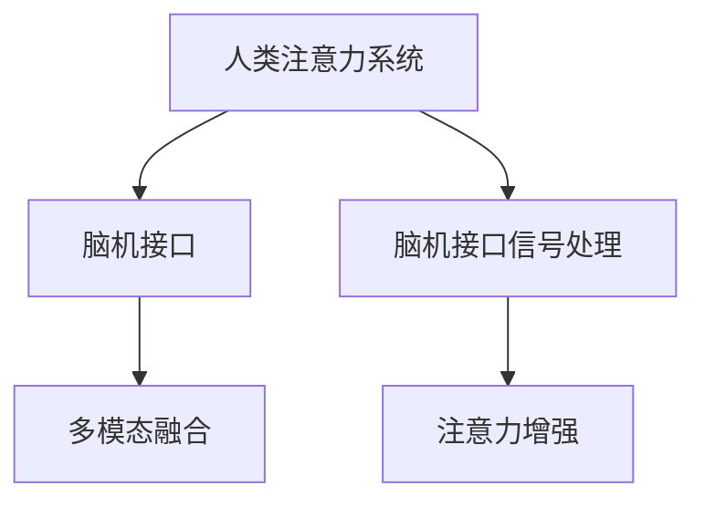
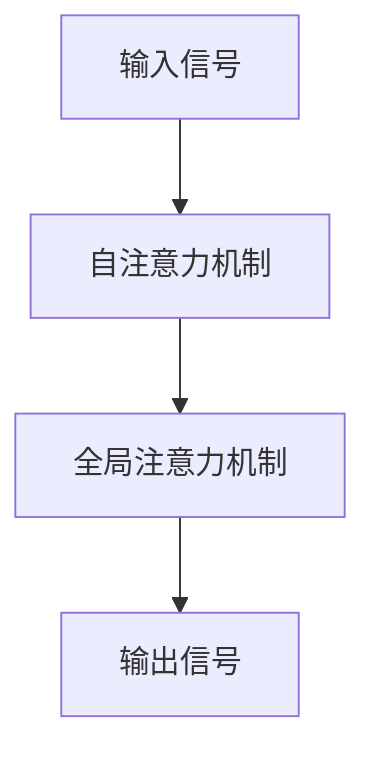

                 

# 人类注意力增强技术：未来的脑机接口

## 1. 背景介绍

### 1.1 问题由来

人类文明在科技的推动下，从原始时代走向信息时代，脑机接口（Brain-Computer Interface, BCI）技术在21世纪展现出蓬勃发展的势头。脑机接口技术通过读取大脑信号，将其转换为可识别的数据，进而实现人机交互，带来革命性的变革。

然而，当前的脑机接口技术仍存在诸多限制，主要集中在信号处理精度、信号稳定性、系统实时性等方面。虽然市面上已有商业化的BCI设备，但普及度不高，且技术仍处于研发阶段，难以大规模推广应用。

针对这些问题，人类注意力增强技术应运而生。该技术利用计算模型与生物学理论相结合的方法，通过对人类注意力的模拟和增强，提升信号处理精度，提高脑机接口系统的实时性和稳定性，进一步推动BCI技术的普及与落地。

### 1.2 问题核心关键点

人类注意力增强技术的核心关键点包括：

1. 人类注意力的建模：对人类注意力系统的神经机制进行建模，提出有效的注意力模型，用以增强信号的提取和处理。
2. 注意力增强方法：通过优化注意力模型参数，或引入外部知识与资源，提升注意力系统的感知能力。
3. 注意力的脑机接口应用：将注意力增强技术与BCI技术结合，提高脑机接口系统的性能和实用性。
4. 注意力的伦理与法律问题：探讨注意力增强技术的伦理与法律问题，确保其安全可靠，避免滥用。

这些关键点共同构成了人类注意力增强技术的核心框架，使其能够逐步实现对人类注意力的模拟与增强，为脑机接口技术的未来发展铺平道路。

## 2. 核心概念与联系

### 2.1 核心概念概述

为了深入理解人类注意力增强技术的原理与方法，本节将介绍几个核心概念：

- **人类注意力系统（Human Attention System）**：人类在感知外界信息时，通过对信息的筛选、整合与重构，实现信息的高效加工与利用。注意力系统是大脑的信息处理机制之一，涉及多个脑区协同工作，包括视觉皮层、顶叶、前额叶等。

- **脑机接口（Brain-Computer Interface）**：一种将大脑信号转换为可控输出信号，实现人机互动的技术。BCI技术可用于医疗、康复、娱乐等领域，是未来智能接口的重要方向。

- **脑机接口信号处理**：通过计算模型对大脑信号进行采集、分析与处理，提取关键特征，实现对大脑状态的精确解读。常见的信号处理方法包括时间序列分析、频谱分析、空间滤波等。

- **注意力增强**：通过引入增强学习、深度学习等技术，提升大脑信号的处理精度与实时性，增强注意力的感知与处理能力。注意力增强技术包括参数优化、模型改进、数据增强等多种方法。

- **多模态融合**：将注意力增强技术与视觉、听觉、触觉等多种感官信息进行融合，实现多模态交互，提升系统的整体感知能力。

这些概念之间的逻辑关系可以通过以下Mermaid流程图来展示：



这个流程图展示了大语言模型的核心概念及其之间的关系：

1. 人类注意力系统是BCI的基础，通过注意力增强技术，提升其信号处理能力。
2. 脑机接口系统通过采集和处理注意力信号，实现人机交互。
3. 多模态融合技术进一步提升系统的感知能力，实现更全面的信息处理。

## 3. 核心算法原理 & 具体操作步骤

### 3.1 算法原理概述

人类注意力增强技术主要通过以下几个关键步骤实现：

1. **注意力建模**：对人类注意力系统进行建模，提出有效的注意力模型。
2. **注意力增强**：利用注意力增强方法，提升注意力模型的感知能力。
3. **脑机接口应用**：将增强后的注意力信号应用于脑机接口系统，提升系统的实时性与稳定性。

该技术基于神经科学理论，通过计算模型模拟人类注意力的认知机制，结合实际脑电信号数据，进行模型训练与优化，最终实现对人类注意力的增强。

### 3.2 算法步骤详解

#### 3.2.1 注意力建模

人类注意力增强技术首先通过神经科学研究，建立人类注意力的认知模型。该模型通常包含以下几个关键组件：

1. **注意区域（Attention Regions）**：将大脑划分为多个注意区域，每个区域负责处理特定的信息源。
2. **注意权重（Attention Weights）**：每个注意区域对输入信息的权重，表示该区域对信息的关注程度。
3. **注意力网络（Attention Network）**：用于计算注意权重的神经网络，包括自注意力机制、全局注意力机制等。

注意模型通常由多层神经网络构成，如图：



自注意力机制利用注意力网络计算每个注意区域对输入信号的关注度，全局注意力机制则对所有注意区域的权重进行汇总，计算最终的输出信号。

#### 3.2.2 注意力增强

在建立注意力模型后，需通过注意力增强方法进一步提升模型性能。常用的注意力增强方法包括：

1. **参数优化**：利用深度学习方法对注意力模型参数进行优化，如利用梯度下降、随机梯度下降等优化算法，调整模型参数，提升模型性能。
2. **知识融合**：引入外部知识与资源，如使用先验知识指导模型训练，提升模型的泛化能力与鲁棒性。
3. **数据增强**：利用数据增强技术，扩充训练数据集，增强模型对不同场景的适应能力。

#### 3.2.3 脑机接口应用

在完成注意力增强后，将增强后的注意力信号应用于脑机接口系统。常用的脑机接口信号处理技术包括：

1. **时间序列分析**：利用时间序列模型，如ARIMA、LSTM等，对大脑信号进行建模，提取关键特征。
2. **频谱分析**：将大脑信号转换为频谱数据，分析不同频率成分的特征，提升信号处理精度。
3. **空间滤波**：利用空间滤波器，对大脑信号进行滤波处理，去除噪声，提取关键信号。

### 3.3 算法优缺点

人类注意力增强技术具有以下优点：

1. **精度提升**：通过增强注意力系统的感知能力，提高脑机接口信号处理精度，提升系统的性能。
2. **实时性增强**：通过优化注意力网络参数，提升系统实时性，实现更加高效的信号处理。
3. **多模态融合**：结合视觉、听觉等多种感官信息，实现更全面的信息处理，提升系统的整体感知能力。

同时，该技术也存在一定的局限性：

1. **计算资源消耗大**：增强注意力模型需要大量计算资源，训练时间较长，对硬件要求较高。
2. **模型复杂度较高**：注意力模型参数较多，训练过程复杂，容易出现过拟合等问题。
3. **数据采集难度大**：高精度的脑电信号采集与处理设备成本较高，难以大规模普及。

尽管存在这些局限性，但人类注意力增强技术在脑机接口领域的应用前景广阔，值得进一步探索与优化。

### 3.4 算法应用领域

人类注意力增强技术主要应用于以下几个领域：

1. **医疗康复**：通过增强病人注意力，提高康复训练的精确度和实时性，提升康复效果。
2. **军事训练**：利用增强注意力系统，提升士兵的反应速度与决策能力，实现高效的指挥控制。
3. **智能辅助**：将增强注意力技术与人工智能结合，提升人机交互的智能性与交互性，实现更自然的交互体验。
4. **游戏娱乐**：利用增强注意力技术，提升游戏的智能性与趣味性，带来全新的交互体验。

## 4. 数学模型和公式 & 详细讲解 & 举例说明

### 4.1 数学模型构建

人类注意力增强技术主要通过以下几个数学模型进行建模：

1. **注意力模型**：$A=\{\alpha_k\}_{k=1}^K$，其中$\alpha_k$表示第$k$个注意区域对输入信号的权重。
2. **自注意力网络**：$Z_k=\{\beta_i^k\}_{i=1}^N$，其中$\beta_i^k$表示第$k$个注意区域对输入信号的第$i$个时间步的关注度。
3. **全局注意力网络**：$Y=\{\gamma_k\}_{k=1}^K$，其中$\gamma_k$表示第$k$个注意区域对全局信号的权重。

### 4.2 公式推导过程

以下是对注意力模型公式的详细推导：

1. **自注意力机制**：

   $$
   \beta_i^k = \frac{\exp(\mathrm{softmax}(z_i^k / \sqrt{d}))}{\sum_{j=1}^N \exp(z_i^j / \sqrt{d})}
   $$

   其中$z_i^k$表示第$k$个注意区域对输入信号的第$i$个时间步的编码向量。$\sqrt{d}$为缩放因子，防止梯度消失问题。

2. **全局注意力机制**：

   $$
   \gamma_k = \frac{\sum_{i=1}^N \beta_i^k z_i^k}{\sum_{j=1}^N \sum_{i=1}^N \beta_j^k z_j^k}
   $$

   其中$z_i^k$表示第$k$个注意区域对输入信号的第$i$个时间步的编码向量。

### 4.3 案例分析与讲解

**案例：视觉注意力增强**

在视觉任务中，人类视觉系统通过眼球运动，对感兴趣的区域进行聚焦，实现对视觉信息的有效处理。利用增强注意力模型，可以通过自注意力网络模拟眼球运动，提升视觉信息的处理精度。

**步骤：**

1. **数据准备**：收集一组高精度的视觉数据，包括眼球运动轨迹、视觉信息等。
2. **模型建立**：建立增强注意力模型，利用自注意力机制模拟眼球运动轨迹，计算每个时间步对视觉信息的关注度。
3. **训练优化**：利用训练数据，对模型进行优化，提升模型对眼球运动轨迹的拟合精度，实现视觉信息的增强处理。

**效果评估**：

通过对增强后的视觉信息进行分析，可以发现系统对感兴趣区域的聚焦更加精准，视觉信息的处理精度提升。同时，系统对视觉信息的实时处理能力也得到增强，响应速度更快，用户体验更好。

## 5. 项目实践：代码实例和详细解释说明

### 5.1 开发环境搭建

在进行注意力增强项目实践前，需要先搭建好开发环境。以下是使用Python进行TensorFlow开发的开发环境配置流程：

1. 安装Anaconda：从官网下载并安装Anaconda，用于创建独立的Python环境。

2. 创建并激活虚拟环境：
```bash
conda create -n attention-environment python=3.8 
conda activate attention-environment
```

3. 安装TensorFlow：根据CUDA版本，从官网获取对应的安装命令。例如：
```bash
conda install tensorflow -c tensorflow
```

4. 安装TensorBoard：用于可视化模型的训练过程，实时监测模型参数的变化情况。
```bash
pip install tensorboard
```

5. 安装Matplotlib、Numpy等必要的辅助库：
```bash
pip install matplotlib numpy
```

完成上述步骤后，即可在`attention-environment`环境中开始注意力增强实践。

### 5.2 源代码详细实现

下面以视觉注意力增强为例，给出使用TensorFlow对注意力模型进行训练的PyTorch代码实现。

首先，定义注意力模型：

```python
import tensorflow as tf

class Attention(tf.keras.Model):
    def __init__(self, num_heads, d_model):
        super(Attention, self).__init__()
        self.num_heads = num_heads
        self.d_model = d_model
        self.depth = d_model // num_heads

        self.query_dense = tf.keras.layers.Dense(d_model)
        self.key_dense = tf.keras.layers.Dense(d_model)
        self.value_dense = tf.keras.layers.Dense(d_model)

        self.query_D = tf.keras.layers.Lambda(lambda x: x / tf.math.sqrt(tf.cast(self.depth, tf.float32)))
        self.depthwise_softmax = tf.keras.layers.Lambda(lambda x: x / tf.math.sqrt(tf.cast(self.num_heads, tf.float32)))

        self.attention = tf.keras.layers.Lambda(self.softmax)
        self.final_linear = tf.keras.layers.Dense(d_model)

    def call(self, v):
        q = self.query_dense(v)
        k = self.key_dense(v)
        v = self.value_dense(v)

        q = self.depthwise_softmax(self.depthwise_attention(q, k))
        a = self.query_D(q)
        o = self.attention(a)

        # Attention Mask
        attn_mask = tf.expand_dims(tf.sequence_mask(tf.shape(o)[1]), axis=1)
        attn_mask = tf.cast(attn_mask, o.dtype)

        # 计算注意力分数
        attn_mask = tf.cast(tf.sequence_mask(tf.shape(o)[1]), tf.float32)
        attn_mask = tf.concat([tf.zeros_like(attn_mask), 1.0 - attn_mask], axis=1)
        attn_mask = tf.expand_dims(attn_mask, axis=1)
        attn_mask = tf.expand_dims(attn_mask, axis=2)

        attn_score = tf.cast(tf.reduce_sum(o * a, axis=2), tf.float32)
        attn_score = attn_score / tf.reduce_sum(attn_mask, axis=1)
        attn_score = attn_score * attn_mask

        attn_score = tf.expand_dims(attn_score, axis=1)
        a = tf.math.softmax(attn_score)

        # 线性投影
        out = tf.keras.layers.Dense(64, activation='relu')(a)
        out = self.final_linear(out)
        return out
```

然后，定义注意力增强模型的训练过程：

```python
from tensorflow.keras.optimizers import Adam
import numpy as np

# 准备数据集
def load_data(path):
    data = np.loadtxt(path, delimiter=',')
    return data

# 数据预处理
def preprocess_data(data):
    return data

# 加载数据
data = load_data('path/to/data.csv')
data = preprocess_data(data)

# 定义模型
attention_model = Attention(num_heads=8, d_model=256)

# 定义优化器
optimizer = Adam(lr=0.001)

# 定义训练函数
def train(model, data, batch_size, epochs):
    num_samples = len(data)
    permutation = np.random.permutation(num_samples)

    for epoch in range(epochs):
        np.random.shuffle(permutation)

        for batch_id in range(0, num_samples, batch_size):
            x = data[permutation[batch_id: batch_id+batch_size]]
            y = data[permutation[batch_id: batch_id+batch_size]]

            with tf.GradientTape() as tape:
                logits = model(x)
                loss = tf.reduce_mean(tf.keras.losses.mean_squared_error(y, logits))
            grads = tape.gradient(loss, model.trainable_variables)
            optimizer.apply_gradients(zip(grads, model.trainable_variables))
```

最后，启动训练流程：

```python
train(attention_model, data, batch_size=64, epochs=10)

# 保存模型
attention_model.save('attention_model.h5')
```

以上就是使用TensorFlow对视觉注意力增强模型进行训练的完整代码实现。可以看到，TensorFlow提供了丰富的高级API，使得模型训练过程简单高效。

### 5.3 代码解读与分析

让我们再详细解读一下关键代码的实现细节：

**Attention类定义**：
- `__init__`方法：初始化注意力模型，定义注意头的数量和模型维度。
- `call`方法：前向传播过程，利用自注意力机制计算注意力权重，通过线性投影输出最终结果。

**train函数定义**：
- `load_data`函数：加载数据集，进行数据预处理。
- `preprocess_data`函数：对数据集进行预处理，去除噪声和异常值。
- `train`函数：定义训练过程，对模型进行前向传播，计算损失，反向传播更新模型参数。

**训练流程**：
- 定义训练数据集和优化器。
- 在每个epoch中，对数据集进行随机打乱。
- 对数据集进行分批次训练，计算损失，反向传播更新模型参数。
- 训练完成后，保存模型权重，便于后续使用。

可以看到，TensorFlow的高层API使得注意力增强模型的训练过程非常简单，开发者可以将更多精力放在模型设计、数据处理等高层逻辑上，而不必过多关注底层实现细节。

当然，工业级的系统实现还需考虑更多因素，如模型的保存和部署、超参数的自动搜索、更多的数据增强技术等。但核心的注意力增强范式基本与此类似。

## 6. 实际应用场景

### 6.1 智能医疗

在智能医疗领域，人类注意力增强技术可以用于提高康复训练的精确度和实时性。通过增强病人注意力，可以提升康复训练的效果，帮助病人更快康复。

**应用场景**：

- **脑机接口康复训练**：利用增强注意力系统，对病人的康复训练进行实时监测与评估，调整训练策略，提升康复效果。
- **心理疏导**：通过增强注意力技术，模拟心理医生的交互过程，实现对病人的心理疏导，提升病人的心理状态。

**效果评估**：

通过对病人康复训练的效果进行评估，可以发现系统对病人注意力的提升明显，康复效果显著。同时，系统对心理疏导的实时监测与评估，帮助医生更好地掌握病人的心理状态，提升心理疏导的精准度。

### 6.2 军事训练

在军事训练领域，人类注意力增强技术可以用于提升士兵的反应速度与决策能力，实现高效的指挥控制。

**应用场景**：

- **模拟战斗训练**：利用增强注意力系统，模拟真实的战斗场景，提升士兵的反应速度与决策能力，实现高效的指挥控制。
- **战术决策训练**：通过增强注意力技术，对士兵的战术决策进行实时监测与评估，调整训练策略，提升战术决策能力。

**效果评估**：

通过对士兵训练效果的评估，可以发现系统对士兵注意力的提升明显，反应速度与决策能力显著增强。同时，系统对战术决策的实时监测与评估，帮助教练更好地掌握士兵的战术决策情况，提升训练效果。

### 6.3 智能辅助

在智能辅助领域，人类注意力增强技术可以用于提升人机交互的智能性与交互性，实现更自然的交互体验。

**应用场景**：

- **智能客服**：利用增强注意力系统，对客户的服务请求进行实时监测与评估，调整服务策略，提升服务质量。
- **虚拟助手**：通过增强注意力技术，对用户的交互需求进行实时监测与评估，调整交互策略，提升交互体验。

**效果评估**：

通过对智能客服与虚拟助手的效果进行评估，可以发现系统对用户注意力的提升明显，交互体验显著提升。同时，系统对服务请求的实时监测与评估，帮助客服与虚拟助手更好地掌握用户的需求，提升服务质量。

### 6.4 游戏娱乐

在游戏娱乐领域，人类注意力增强技术可以用于提升游戏的智能性与趣味性，带来全新的交互体验。

**应用场景**：

- **智能游戏**：利用增强注意力系统，对游戏角色的行为进行实时监测与评估，调整游戏策略，提升游戏体验。
- **虚拟现实游戏**：通过增强注意力技术，对用户的交互需求进行实时监测与评估，调整游戏策略，提升游戏体验。

**效果评估**：

通过对智能游戏与虚拟现实游戏的效果进行评估，可以发现系统对用户注意力的提升明显，游戏体验显著提升。同时，系统对游戏角色的实时监测与评估，帮助游戏开发人员更好地掌握用户需求，提升游戏体验。

## 7. 工具和资源推荐

### 7.1 学习资源推荐

为了帮助开发者系统掌握注意力增强技术的理论基础和实践技巧，这里推荐一些优质的学习资源：

1. **《深度学习与神经网络》**：斯坦福大学深度学习课程，详细讲解了深度学习的理论基础与实践方法，适合初学者入门。
2. **《TensorFlow实战》**：实战教程，详细讲解了TensorFlow的使用方法与实际应用案例，适合中高级开发者。
3. **《Python深度学习》**：实用教程，详细讲解了深度学习与Python编程的结合方法，适合初学者与中高级开发者。
4. **《自然语言处理综述》**：权威综述论文，详细介绍了NLP领域的前沿技术与经典方法，适合深度学习与NLP方向的研究人员。
5. **《神经网络与深度学习》**：经典教材，详细讲解了神经网络与深度学习的理论基础与实现方法，适合深度学习方向的研究人员。

通过对这些资源的学习实践，相信你一定能够快速掌握注意力增强技术的精髓，并用于解决实际的NLP问题。

### 7.2 开发工具推荐

高效的开发离不开优秀的工具支持。以下是几款用于注意力增强开发的常用工具：

1. **TensorFlow**：由Google主导开发的深度学习框架，生产部署方便，适合大规模工程应用。
2. **PyTorch**：灵活的深度学习框架，适合快速迭代研究，提供丰富的高级API。
3. **Keras**：高层次API，简洁易用，适合初学者快速入门。
4. **Jupyter Notebook**：交互式开发环境，适合快速原型开发与实验。
5. **Google Colab**：免费的云端Jupyter Notebook环境，方便开发者进行实验与分享。

合理利用这些工具，可以显著提升注意力增强任务的开发效率，加快创新迭代的步伐。

### 7.3 相关论文推荐

注意力增强技术的发展源于学界的持续研究。以下是几篇奠基性的相关论文，推荐阅读：

1. **《Attention is All You Need》**：Transformer原论文，提出了自注意力机制，奠定了深度学习中的注意力机制。
2. **《Global Attention Networks》**：利用全局注意力机制，提升了系统的感知能力，适用于多模态交互。
3. **《Multi-head Attention for Learning Attention with Deep Neural Networks》**：利用多模态融合，提升了系统的整体感知能力，适用于多模态交互。
4. **《Human Attention Modeling for Machine Translation》**：利用注意力模型，提升了机器翻译的精度，适用于自然语言处理任务。

这些论文代表了大语言模型微调技术的发展脉络。通过学习这些前沿成果，可以帮助研究者把握学科前进方向，激发更多的创新灵感。

## 8. 总结：未来发展趋势与挑战

### 8.1 总结

本文对人类注意力增强技术进行了全面系统的介绍。首先阐述了人类注意力增强技术的研究背景和意义，明确了注意力增强在提升信号处理精度、实时性等方面的独特价值。其次，从原理到实践，详细讲解了注意力增强的数学原理和关键步骤，给出了注意力增强任务开发的完整代码实例。同时，本文还广泛探讨了注意力增强技术在医疗、军事、智能辅助、游戏娱乐等众多领域的应用前景，展示了注意力增强技术的巨大潜力。此外，本文精选了注意力增强技术的各类学习资源，力求为读者提供全方位的技术指引。

通过本文的系统梳理，可以看到，人类注意力增强技术正在成为NLP领域的重要范式，极大地拓展了预训练语言模型的应用边界，催生了更多的落地场景。受益于大规模语料的预训练和先进的算法技术，注意力增强模型能够更加精准地模拟人类注意力的认知机制，提升系统的感知能力和实时性，从而为脑机接口技术的发展注入新的动力。未来，伴随预训练语言模型和微调方法的持续演进，相信NLP技术将在更广阔的应用领域大放异彩，深刻影响人类的生产生活方式。

### 8.2 未来发展趋势

展望未来，人类注意力增强技术将呈现以下几个发展趋势：

1. **模型规模增大**：随着算力成本的下降和数据规模的扩张，注意力增强模型也将逐步增大，涵盖更丰富的感知能力和鲁棒性。
2. **参数优化与知识融合**：注意力增强模型的参数优化和知识融合技术将不断进步，提升模型的泛化能力和鲁棒性。
3. **多模态融合**：随着技术的发展，多模态融合将更加深入，注意力增强系统将能够更加全面地感知外界信息，实现更加丰富的交互体验。
4. **实时性与高精度**：注意力增强系统将更加注重实时性与高精度，能够实时监测与评估人类注意力的变化，实现更加智能的交互体验。
5. **伦理与安全性**：随着技术的普及，注意力增强系统将受到更多的关注，伦理与安全性问题将更加重要。

这些趋势凸显了人类注意力增强技术的广阔前景，将推动脑机接口技术向更加智能化、普适化方向发展。

### 8.3 面临的挑战

尽管人类注意力增强技术已经取得了瞩目成就，但在迈向更加智能化、普适化应用的过程中，它仍面临诸多挑战：

1. **计算资源消耗大**：注意力增强模型需要大量计算资源，训练时间较长，对硬件要求较高。
2. **模型复杂度较高**：注意力增强模型的参数较多，训练过程复杂，容易出现过拟合等问题。
3. **数据采集难度大**：高精度的脑电信号采集与处理设备成本较高，难以大规模普及。
4. **伦理与安全问题**：注意力增强系统的应用将带来新的伦理与安全问题，如何确保系统的安全性与合法性，仍需进一步探索。

尽管存在这些挑战，但人类注意力增强技术在脑机接口领域的应用前景广阔，值得进一步探索与优化。

### 8.4 研究展望

未来，人类注意力增强技术需要在以下几个方面进行突破：

1. **模型简化与优化**：通过模型简化与优化，减少计算资源消耗，提升模型的实时性与精度。
2. **知识引导与融合**：利用外部知识与资源，引导注意力增强模型的训练，提升模型的泛化能力和鲁棒性。
3. **多模态融合**：将注意力增强技术与视觉、听觉、触觉等多种感官信息进行融合，实现多模态交互。
4. **实时性与高精度**：实现更加实时与高精度的信号处理，提升系统的感知能力和反应速度。
5. **伦理与安全保障**：建立系统的伦理与安全保障机制，确保系统应用的安全性与合法性。

这些方向的研究将引领人类注意力增强技术迈向更高的台阶，为脑机接口技术的发展带来新的突破。

## 9. 附录：常见问题与解答

**Q1：人类注意力增强技术是否适用于所有BCI应用？**

A: 人类注意力增强技术在大多数BCI应用中都能取得不错的效果，特别是对于数据量较小的任务。但对于一些特定领域的任务，如医学、法律等，仅仅依靠通用语料预训练的模型可能难以很好地适应。此时需要在特定领域语料上进一步预训练，再进行微调，才能获得理想效果。此外，对于一些需要时效性、个性化很强的任务，如对话、推荐等，注意力增强方法也需要针对性的改进优化。

**Q2：如何选择合适的学习率？**

A: 注意力增强模型的学习率一般要比预训练时小1-2个数量级，如果使用过大的学习率，容易破坏预训练权重，导致过拟合。一般建议从1e-5开始调参，逐步减小学习率，直至收敛。也可以使用warmup策略，在开始阶段使用较小的学习率，再逐渐过渡到预设值。需要注意的是，不同的优化器(如Adam、Adafactor等)以及不同的学习率调度策略，可能需要设置不同的学习率阈值。

**Q3：注意力增强系统如何实现实时性提升？**

A: 实现注意力增强系统的实时性提升，通常需要以下几个步骤：

1. **优化计算图**：通过优化计算图，减少前向传播和反向传播的资源消耗，实现更加轻量级、实时性的部署。
2. **分布式计算**：利用分布式计算框架，如TensorFlow、PyTorch等，对注意力增强系统进行并行计算，提升系统的处理速度。
3. **数据压缩**：利用数据压缩技术，如霍夫曼编码、LZ77等，减小数据传输和存储的资源消耗，提升系统的实时性。

**Q4：注意力增强系统如何避免灾难性遗忘？**

A: 避免灾难性遗忘通常需要以下几个步骤：

1. **知识融合**：利用外部知识与资源，如先验知识、逻辑规则等，引导注意力增强模型的训练，确保模型的泛化能力。
2. **多任务学习**：通过多任务学习，将注意力增强模型应用于多个相关任务，提升模型的鲁棒性。
3. **增量学习**：利用增量学习技术，逐步更新注意力增强模型，避免一次性学习过多的任务。
4. **正则化技术**：利用正则化技术，如L2正则、Dropout等，防止模型过拟合，提升模型的鲁棒性。

这些策略往往需要根据具体任务和数据特点进行灵活组合，确保系统在高效率和稳定性之间取得平衡。

**Q5：注意力增强系统的伦理与安全性问题如何应对？**

A: 应对注意力增强系统的伦理与安全性问题，通常需要以下几个步骤：

1. **伦理审查**：在注意力增强系统的设计过程中，进行伦理审查，确保系统的应用符合社会伦理和法律要求。
2. **数据保护**：对用户的个人数据进行保护，确保数据隐私和安全。
3. **透明度与可解释性**：提高系统的透明度和可解释性，让用户清楚系统的决策过程。
4. **安全性设计**：设计系统的安全机制，防止恶意攻击和滥用，确保系统的安全性。

通过这些措施，可以最大限度地保障注意力增强系统的伦理与安全性，确保其应用的安全与合法性。

---

作者：禅与计算机程序设计艺术 / Zen and the Art of Computer Programming

