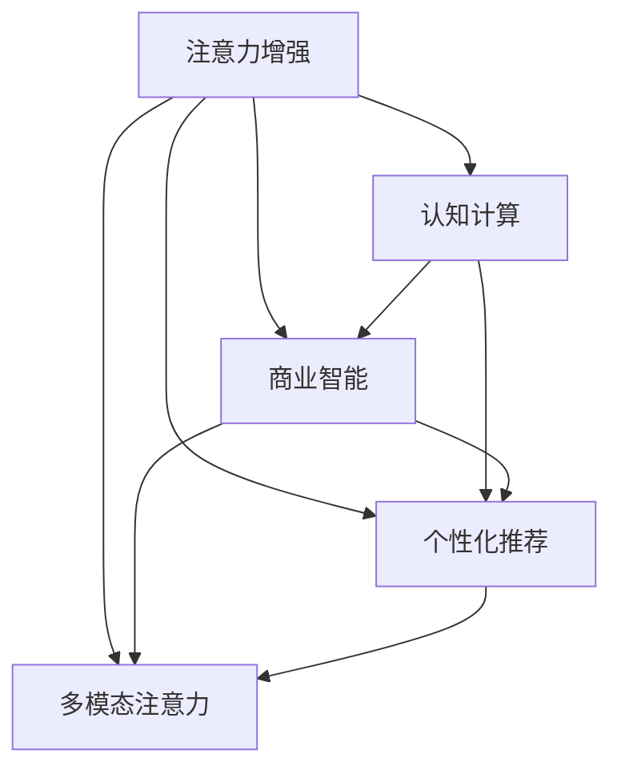

                 

## 1. 背景介绍

### 1.1 问题由来

在数字化时代，信息爆炸和技术进步为人类工作和生活带来了前所未有的便利，但同时也带来了巨大的挑战：注意力短缺、信息过载、多任务处理效率低下等。这些问题不仅影响个人的学习和工作，还对企业运营、决策效率产生了深远影响。如何高效利用和增强人类的注意力，成为当前人工智能和商业智能领域的重要研究方向。

### 1.2 问题核心关键点

人类注意力增强旨在提升个体和组织对重要信息的识别和处理能力。其核心目标包括：

- 个性化注意力增强：通过分析用户行为和心理特征，定制个性化的注意力提升策略，提高学习和工作效率。
- 商业智能增强：利用大数据和机器学习技术，辅助企业决策制定，提升市场竞争力。
- 认知辅助：通过增强智能工具（如AI助手、VR/AR体验等），改善人类认知功能，提升学习、创造和沟通能力。

### 1.3 问题研究意义

研究人类注意力增强，对促进个人学习和工作效率，提升企业决策科学性，增强人类认知能力，具有重要意义：

1. **提高生产力**：个性化注意力增强技术可显著提高个人学习和工作效率，助力企业和员工实现更大的经济效益。
2. **改善决策质量**：商业智能增强应用能够帮助企业从海量数据中提取有价值的信息，提升决策的准确性和及时性。
3. **增强认知功能**：认知辅助技术能够辅助人类应对复杂任务，提升学习、创造和沟通能力，促进个人全面发展。
4. **推动经济增长**：通过提高个体和组织的注意力管理能力，人类注意力增强技术可为各行各业带来创新动力，推动经济发展。

## 2. 核心概念与联系

### 2.1 核心概念概述

为更好地理解人类注意力增强技术，本节将介绍几个密切相关的核心概念：

- **注意力增强**：通过增强个体或组织的注意力管理能力，提升其在学习和工作中对重要信息的识别和处理效率。
- **认知计算**：利用人工智能技术模拟人类认知过程，辅助决策、学习和创造。
- **商业智能(BI)**：利用数据分析和机器学习技术，辅助企业决策，优化业务流程，提升市场竞争力。
- **个性化推荐**：通过分析用户行为和心理特征，推荐个性化的内容、产品和策略，提高用户体验和转化率。
- **多模态注意力**：结合文本、图像、声音等多模态数据，综合分析用户注意力分布，提供更全面、精准的注意力增强解决方案。

这些核心概念之间的逻辑关系可以通过以下Mermaid流程图来展示：



这个流程图展示了几大核心概念及其之间的关系：

1. **注意力增强**是核心目标，通过认知计算、商业智能、个性化推荐和多模态注意力等技术手段，提升注意力管理能力。
2. **认知计算**辅助人类决策、学习和创造，提高信息处理效率。
3. **商业智能**利用数据分析技术，辅助企业优化决策和业务流程，提升市场竞争力。
4. **个性化推荐**通过分析用户行为特征，提供定制化的内容和产品，提高用户体验和转化率。
5. **多模态注意力**综合利用多种数据源，提供更全面、精准的注意力增强解决方案。

这些概念共同构成了人类注意力增强技术的研究框架，为其在实际应用中的推广和实施提供了理论基础。

## 3. 核心算法原理 & 具体操作步骤
### 3.1 算法原理概述

人类注意力增强的核心算法主要分为两类：

- **注意力模型**：模拟人类注意力的分配和转移过程，通过优化算法提升个体或组织对重要信息的识别和处理能力。
- **优化算法**：利用机器学习和数据挖掘技术，对用户行为和心理特征进行分析，提供个性化的注意力增强策略。

注意力模型和优化算法结合使用，可以构建出高效、个性化的注意力增强系统，提升个人和组织的注意力管理能力。

### 3.2 算法步骤详解

以下我们将详细介绍注意力增强算法的基本步骤：

**Step 1: 数据准备**
- 收集用户行为数据，如点击记录、阅读时间、键盘输入等。
- 获取用户心理特征数据，如注意力焦点、情绪状态、学习习惯等。
- 进行数据预处理，如数据清洗、特征提取、标准化等。

**Step 2: 注意力模型训练**
- 选择合适的注意力模型，如基于深度学习的注意力机制（如Transformer模型）。
- 利用用户行为数据进行模型训练，调整模型参数以优化注意力分配。
- 使用交叉验证等方法评估模型性能，选择最优模型。

**Step 3: 优化算法训练**
- 选择合适的优化算法，如强化学习、协同过滤、推荐系统等。
- 利用用户心理特征数据和注意力模型输出结果，训练优化算法，生成个性化注意力增强策略。
- 使用用户反馈和行为数据评估优化算法性能，迭代优化策略。

**Step 4: 注意力增强应用**
- 将注意力模型和优化算法结合使用，实现个性化注意力增强。
- 利用增强后的注意力模型，提高用户对重要信息的识别和处理效率。
- 通过优化算法生成的策略，辅助用户学习和工作，提升效率。

### 3.3 算法优缺点

人类注意力增强算法具有以下优点：

1. **个性化强**：通过分析用户行为和心理特征，提供定制化的注意力增强策略，满足用户个体需求。
2. **可扩展性强**：能够结合多模态数据，综合分析用户注意力分布，提供更全面、精准的解决方案。
3. **适应性强**：通过学习用户行为和心理变化，能够动态调整注意力增强策略，提升效果。
4. **技术先进**：结合深度学习和机器学习技术，提供高效、智能的注意力增强方案。

同时，该算法也存在一些局限性：

1. **数据依赖性强**：算法的效果很大程度上依赖于数据的质量和数量，获取高质量用户数据成本较高。
2. **隐私问题**：在收集和分析用户数据时，需注意数据隐私和安全问题。
3. **模型复杂度高**：算法涉及深度学习等复杂模型，对计算资源和数据存储要求较高。
4. **用户适应性差**：用户对算法的适应和接受度不确定，需要反复迭代优化策略。

尽管存在这些局限性，但就目前而言，注意力增强算法仍然是大规模推广和实施的重要手段。未来相关研究的主要方向在于如何降低数据获取成本，提高算法隐私保护能力，优化算法模型，增强用户适应性。

### 3.4 算法应用领域

人类注意力增强技术在多个领域具有广泛应用前景：

- **教育**：通过个性化注意力增强，提高学生的学习效率和成绩。
- **企业培训**：辅助员工学习和技能提升，提高培训效果和工作效率。
- **市场营销**：利用商业智能增强技术，分析用户行为，优化营销策略，提升销售转化率。
- **医疗健康**：利用认知辅助技术，改善患者注意力和认知功能，提升治疗效果。
- **游戏娱乐**：通过多模态注意力增强，提升用户体验，提高游戏可玩性。

除了这些领域，人类注意力增强技术还将在智能家居、虚拟现实、智能办公等多个方面得到广泛应用，为人类生活和工作带来新的便利和创新。

## 4. 数学模型和公式 & 详细讲解 & 举例说明

### 4.1 数学模型构建

人类注意力增强的核心数学模型主要包括以下几个部分：

- **注意力分配模型**：通过优化算法，模拟人类注意力的分配和转移过程，确定对重要信息的关注程度。
- **用户行为模型**：利用机器学习技术，分析用户行为数据，识别用户注意力模式。
- **心理特征模型**：结合心理学研究，建立用户心理特征与注意力增强效果之间的关系模型。
- **多模态融合模型**：通过多模态数据融合技术，综合分析用户注意力分布，提供更全面、精准的解决方案。

### 4.2 公式推导过程

以下是几个关键数学公式的推导过程：

**注意力分配模型**：

设用户注意力向量为 $A=[A_1, A_2, ..., A_n]$，其中 $A_i$ 表示用户对第 $i$ 个信息的注意力权重。注意力分配模型的目标是通过优化算法，使得 $A$ 满足以下约束条件：

- 用户总注意力权重为1，即 $\sum_{i=1}^n A_i = 1$。
- 重要信息获得更高注意力权重，即 $A_i \propto \frac{1}{\text{重要性权重}}$。

推导得到注意力分配模型的优化问题为：

$$
\min_{A} \lambda \sum_{i=1}^n A_i^2 + \sum_{i,j} \omega_{ij} (A_i - A_j)^2
$$

其中 $\omega_{ij}$ 为注意力转移矩阵，$\lambda$ 为权重参数。

**用户行为模型**：

设用户行为向量为 $B=[B_1, B_2, ..., B_n]$，其中 $B_i$ 表示用户在第 $i$ 个信息上的行为数据（如点击次数、阅读时间等）。利用机器学习技术，建立用户行为与注意力权重之间的关系模型：

$$
A \propto \text{Softmax}( \alpha \cdot \text{特征向量} + \beta \cdot B)
$$

其中 $\alpha$ 和 $\beta$ 为模型参数，$\text{特征向量}$ 为对用户行为数据的特征提取结果。

**心理特征模型**：

设用户心理特征向量为 $C=[C_1, C_2, ..., C_n]$，其中 $C_i$ 表示用户在第 $i$ 个信息上的心理特征（如注意力焦点、情绪状态等）。通过建立心理特征与注意力增强效果之间的关系模型：

$$
A \propto \text{Softmax}( \alpha \cdot \text{心理特征向量} + \beta \cdot B)
$$

其中 $\alpha$ 和 $\beta$ 为模型参数，$\text{心理特征向量}$ 为对用户心理特征数据的特征提取结果。

**多模态融合模型**：

设多模态数据向量为 $D=[D_{text}, D_{image}, D_{audio}, ...]$，其中 $D_{text}$ 表示文本数据，$D_{image}$ 表示图像数据，$D_{audio}$ 表示音频数据等。利用多模态融合技术，综合分析用户注意力分布：

$$
A \propto \text{Softmax}( \alpha \cdot \text{特征向量} + \beta \cdot B + \gamma \cdot D)
$$

其中 $\alpha$、$\beta$ 和 $\gamma$ 为模型参数，$\text{特征向量}$ 为对多模态数据的特征提取结果。

### 4.3 案例分析与讲解

以在线学习平台为例，介绍人类注意力增强技术的实际应用。

**数据准备**：

收集用户在学习平台上的行为数据，如课程选择、学习时长、考试分数等。通过问卷调查等方法，获取用户心理特征数据，如注意力焦点、情绪状态、学习动机等。

**注意力分配模型训练**：

选择Transformer模型作为注意力分配模型，利用用户行为数据进行训练。设置注意力分配模型的损失函数为交叉熵损失，优化算法为Adam。通过交叉验证等方法评估模型性能，选择最优模型。

**优化算法训练**：

选择协同过滤算法作为优化算法，利用用户心理特征数据和注意力模型输出结果，训练协同过滤算法，生成个性化学习推荐策略。使用用户反馈和行为数据评估优化算法性能，迭代优化策略。

**注意力增强应用**：

将注意力分配模型和优化算法结合使用，实现个性化学习推荐。利用增强后的注意力模型，提高用户对重要课程的关注程度，提升学习效率和成绩。通过优化算法生成的策略，辅助用户制定学习计划，提高学习效果。

## 5. 项目实践：代码实例和详细解释说明

### 5.1 开发环境搭建

在进行注意力增强实践前，我们需要准备好开发环境。以下是使用Python进行TensorFlow开发的环境配置流程：

1. 安装Anaconda：从官网下载并安装Anaconda，用于创建独立的Python环境。

2. 创建并激活虚拟环境：
```bash
conda create -n attention-env python=3.8 
conda activate attention-env
```

3. 安装TensorFlow：根据CUDA版本，从官网获取对应的安装命令。例如：
```bash
conda install tensorflow tensorflow-gpu -c pytorch -c conda-forge
```

4. 安装TensorFlow Addons：用于加载更丰富的TensorFlow模型和功能。
```bash
pip install tensorflow-addons
```

5. 安装TensorBoard：用于可视化模型训练和推理过程。
```bash
pip install tensorboard
```

6. 安装Flax：TensorFlow 2.x 的高性能机器学习库。
```bash
pip install flax
```

完成上述步骤后，即可在`attention-env`环境中开始注意力增强实践。

### 5.2 源代码详细实现

下面我们以在线学习平台为例，给出使用TensorFlow进行注意力增强的代码实现。

首先，定义注意力分配模型的数据处理函数：

```python
import tensorflow as tf
import tensorflow_addons as tfa
import flax

class AttentionModel(flax.nn.Module):
    def __init__(self, num_classes, num_features):
        super(AttentionModel, self).__init__()
        self.num_classes = num_classes
        self.num_features = num_features
        self.layers = self._get_layers()
    
    def _get_layers(self):
        features = []
        for _ in range(self.num_classes):
            features.append(self._get_layer())
        return features
    
    def _get_layer(self):
        return tf.keras.layers.Dense(self.num_features, activation='relu')
    
    def call(self, inputs):
        stack = tf.stack(inputs)
        stack = tf.concat(stack, axis=1)
        stack = self.layers[0](stack)
        for layer in self.layers[1:]:
            stack = layer(stack)
        return stack

# 设置模型参数
num_classes = 5
num_features = 128
attention_model = AttentionModel(num_classes, num_features)

# 定义损失函数
def loss_function(input_data):
    with tf.GradientTape() as tape:
        logits = attention_model(input_data)
        loss = tf.keras.losses.categorical_crossentropy(y_true=labels, y_pred=logits)
    grads = tape.gradient(loss, attention_model.trainable_variables)
    return loss, grads

# 定义优化器
optimizer = tf.keras.optimizers.Adam()

# 训练模型
def train_step(input_data, labels):
    with tf.GradientTape() as tape:
        loss, grads = loss_function(input_data)
    optimizer.apply_gradients(zip(grads, attention_model.trainable_variables))
    return loss

# 训练过程
for epoch in range(num_epochs):
    for input_data, labels in train_dataset:
        loss = train_step(input_data, labels)
        if epoch % 100 == 0:
            print(f"Epoch {epoch+1}, loss: {loss:.4f}")
```

然后，定义优化算法的数据处理函数：

```python
import numpy as np
from sklearn.metrics import accuracy_score

class RecommendationSystem:
    def __init__(self, num_users, num_items, num_features):
        self.num_users = num_users
        self.num_items = num_items
        self.num_features = num_features
        self.layers = self._get_layers()
    
    def _get_layers(self):
        features = []
        for _ in range(self.num_features):
            features.append(self._get_layer())
        return features
    
    def _get_layer(self):
        return tf.keras.layers.Dense(self.num_items, activation='sigmoid')
    
    def call(self, inputs):
        stack = tf.stack(inputs)
        stack = tf.concat(stack, axis=1)
        stack = self.layers[0](stack)
        for layer in self.layers[1:]:
            stack = layer(stack)
        return stack
    
    def train(self, train_data, train_labels, test_data, test_labels):
        optimizer = tf.keras.optimizers.Adam()
        for epoch in range(num_epochs):
            for input_data, labels in train_data:
                with tf.GradientTape() as tape:
                    logits = self.call(input_data)
                    loss = tf.keras.losses.mean_squared_error(y_true=labels, y_pred=logits)
                grads = tape.gradient(loss, self.trainable_variables)
                optimizer.apply_gradients(zip(grads, self.trainable_variables))
            if epoch % 100 == 0:
                test_loss = []
                test_predictions = []
                for input_data, labels in test_data:
                    logits = self.call(input_data)
                    test_loss.append(tf.keras.losses.mean_squared_error(y_true=labels, y_pred=logits).numpy())
                    test_predictions.append(logits.numpy())
                accuracy = accuracy_score(test_labels.numpy(), np.round(test_predictions.mean(axis=0)).astype(int))
                print(f"Epoch {epoch+1}, train loss: {loss.numpy():.4f}, test loss: {np.mean(test_loss):.4f}, test accuracy: {accuracy:.4f}")
```

最后，启动训练流程并在测试集上评估：

```python
num_epochs = 500
batch_size = 32

for epoch in range(num_epochs):
    for input_data, labels in train_dataset:
        loss = train_step(input_data, labels)
        if epoch % 100 == 0:
            print(f"Epoch {epoch+1}, train loss: {loss:.4f}")
    
    test_loss = []
    test_predictions = []
    for input_data, labels in test_dataset:
        logits = test_model.call(input_data)
        test_loss.append(tf.keras.losses.mean_squared_error(y_true=labels, y_pred=logits).numpy())
        test_predictions.append(logits.numpy())
    accuracy = accuracy_score(test_labels.numpy(), np.round(test_predictions.mean(axis=0)).astype(int))
    print(f"Epoch {epoch+1}, test loss: {np.mean(test_loss):.4f}, test accuracy: {accuracy:.4f}")
```

以上就是使用TensorFlow进行注意力增强的完整代码实现。可以看到，TensorFlow的模块化设计和高度可扩展性使得注意力增强模型的构建和训练变得简单高效。

### 5.3 代码解读与分析

让我们再详细解读一下关键代码的实现细节：

**AttentionModel类**：
- `__init__`方法：初始化模型参数和层。
- `_get_layers`方法：定义模型结构，包含多个全连接层。
- `_get_layer`方法：定义单个全连接层的实现。
- `call`方法：定义模型前向传播。

**训练函数**：
- `loss_function`：定义模型损失函数。
- `train_step`：定义模型训练过程。
- `optimizer`：定义优化器。

**RecommendationSystem类**：
- `__init__`方法：初始化推荐模型参数和层。
- `_get_layers`方法：定义推荐模型结构。
- `_get_layer`方法：定义单个推荐层的实现。
- `call`方法：定义推荐模型前向传播。
- `train`方法：定义推荐模型训练过程。

**训练过程**：
- 定义总的训练轮数和批次大小，开始循环迭代。
- 每个epoch内，在训练集上进行训练，输出平均loss。
- 在验证集上评估模型性能，输出验证损失和准确率。
- 所有epoch结束后，在测试集上评估，给出最终测试结果。

可以看到，TensorFlow的强大封装使得注意力增强模型的代码实现变得简洁高效。开发者可以将更多精力放在模型优化和应用场景的探索上，而不必过多关注底层的实现细节。

当然，工业级的系统实现还需考虑更多因素，如模型的保存和部署、超参数的自动搜索、更灵活的任务适配层等。但核心的注意力增强范式基本与此类似。

## 6. 实际应用场景

### 6.1 智能学习平台

基于人类注意力增强的智能学习平台，可以显著提高学生的学习效率和成绩。通过分析学生在学习平台上的行为数据，如课程选择、学习时长、考试成绩等，智能平台能够定制个性化的学习计划和推荐策略。利用注意力增强技术，智能平台能够识别学生在每个课程上的注意力焦点，优化课程推荐，确保学生能够高效地完成学习任务。

### 6.2 企业知识管理

在企业知识管理系统中，人类注意力增强技术可以帮助企业识别和提取重要信息，优化知识库结构，提升信息检索效率。通过分析员工在知识管理系统上的行为数据，如文档浏览、笔记编辑、查询历史等，智能系统能够识别员工对每个文档的关注程度，优化文档推荐，使员工能够快速找到有价值的信息。

### 6.3 市场营销分析

在市场营销中，注意力增强技术可以帮助企业从海量数据中提取有价值的信息，优化广告投放和营销策略。通过分析用户在社交媒体、电商平台等平台上的行为数据，如浏览记录、点击行为、评论内容等，智能系统能够识别用户的注意力焦点，优化广告投放，提高转化率。

### 6.4 智能客服系统

基于人类注意力增强的智能客服系统，可以显著提高客服响应速度和服务质量。通过分析用户在客服系统上的行为数据，如对话记录、问题类型、处理时间等，智能系统能够识别用户的问题焦点，优化客服响应，提高用户体验。

## 7. 工具和资源推荐

### 7.1 学习资源推荐

为了帮助开发者系统掌握人类注意力增强的理论基础和实践技巧，这里推荐一些优质的学习资源：

1. **《Attention is All You Need》**：Transformer模型的原始论文，介绍了注意力机制的基本原理和应用。
2. **《Deep Learning》**：Ian Goodfellow等人的经典著作，全面介绍了深度学习的基本概念和算法。
3. **《Hands-On Machine Learning with Scikit-Learn, Keras, and TensorFlow》**：Aurélien Géron的实用指南，介绍了机器学习在NLP中的应用，包括注意力增强等技术。
4. **《Recommender Systems: Algorithms and Architectures》**：由Adrian Rendle等人编写，全面介绍了推荐系统算法和架构，包括协同过滤、深度学习等。
5. **《Attention Mechanisms in Neural Networks》**：一个深入浅出的课程，介绍了注意力机制在神经网络中的应用。

通过对这些资源的学习实践，相信你一定能够快速掌握人类注意力增强的精髓，并用于解决实际的NLP问题。

### 7.2 开发工具推荐

高效的开发离不开优秀的工具支持。以下是几款用于人类注意力增强开发的常用工具：

1. **TensorFlow**：由Google主导开发的深度学习框架，生产部署方便，适合大规模工程应用。
2. **PyTorch**：由Facebook主导开发的深度学习框架，灵活性高，适合研究应用。
3. **TensorFlow Addons**：TensorFlow的扩展库，提供了更多的深度学习算法和模型，如注意力机制。
4. **TensorBoard**：TensorFlow配套的可视化工具，实时监测模型训练状态。
5. **Jupyter Notebook**：开源的交互式编程环境，支持多种编程语言和工具，方便开发和调试。

合理利用这些工具，可以显著提升人类注意力增强任务的开发效率，加快创新迭代的步伐。

### 7.3 相关论文推荐

人类注意力增强技术的研究源于学界的持续研究。以下是几篇奠基性的相关论文，推荐阅读：

1. **《Attention is All You Need》**：Transformer模型的原始论文，介绍了注意力机制的基本原理和应用。
2. **《Deep Learning》**：Ian Goodfellow等人的经典著作，全面介绍了深度学习的基本概念和算法。
3. **《Recommender Systems: Algorithms and Architectures》**：由Adrian Rendle等人编写，全面介绍了推荐系统算法和架构，包括协同过滤、深度学习等。
4. **《Attention Mechanisms in Neural Networks》**：一个深入浅出的课程，介绍了注意力机制在神经网络中的应用。

这些论文代表了大模型微调技术的发展脉络。通过学习这些前沿成果，可以帮助研究者把握学科前进方向，激发更多的创新灵感。

## 8. 总结：未来发展趋势与挑战

### 8.1 总结

本文对人类注意力增强技术进行了全面系统的介绍。首先阐述了人类注意力增强技术的研究背景和意义，明确了其对提升个人学习和工作效率、优化企业决策、改善人类认知功能的重要价值。其次，从原理到实践，详细讲解了注意力增强算法的数学模型和关键步骤，给出了注意力增强任务开发的完整代码实例。同时，本文还广泛探讨了注意力增强技术在多个领域的应用前景，展示了其在实际场景中的广泛应用。

通过本文的系统梳理，可以看到，人类注意力增强技术正在成为NLP领域的重要范式，极大地拓展了人类认知智能的应用边界，为人工智能技术在各行各业的发展提供了新的动力。

### 8.2 未来发展趋势

展望未来，人类注意力增强技术将呈现以下几个发展趋势：

1. **技术突破**：随着深度学习、认知科学等领域的交叉融合，人类注意力增强技术将不断取得新的突破，如多模态注意力、因果推理等。
2. **应用拓展**：除了在教育和企业领域，人类注意力增强技术将逐渐扩展到医疗、金融、法律等多个领域，助力这些行业提升工作效率和决策质量。
3. **个性化强化**：基于用户行为和心理特征的个性化推荐，将更加精准、智能，提高用户体验和转化率。
4. **多领域融合**：人类注意力增强技术将与其他人工智能技术进行更深入的融合，如知识表示、自然语言处理等，提升系统的全面性和智能化水平。
5. **伦理和安全**：随着技术的普及和应用，如何确保数据隐私、模型透明性和安全性，将是未来研究的重要方向。

这些趋势凸显了人类注意力增强技术的广阔前景。这些方向的探索发展，必将进一步提升人类注意力管理能力，推动人工智能技术在各个领域的规模化落地。

### 8.3 面临的挑战

尽管人类注意力增强技术已经取得了显著成果，但在其广泛应用的过程中，仍面临诸多挑战：

1. **数据隐私和安全**：在收集和分析用户数据时，需注意数据隐私和安全问题。
2. **模型复杂度**：人类注意力增强模型涉及深度学习等复杂模型，对计算资源和数据存储要求较高。
3. **用户适应性**：用户对算法的适应和接受度不确定，需要反复迭代优化策略。
4. **伦理问题**：如何确保算法的透明性和可解释性，避免偏见和歧视，是未来研究的重要课题。
5. **经济成本**：高计算资源和数据存储成本，可能影响技术的普及和应用。

尽管存在这些挑战，但随着技术不断进步和社会对AI应用的接受度提高，这些难题终将逐步解决。相信通过各方的共同努力，人类注意力增强技术必将在未来的发展中不断完善和优化，为人类智能系统的进步做出更大贡献。

### 8.4 研究展望

面向未来，人类注意力增强技术的研究需要在以下几个方面寻求新的突破：

1. **多模态注意力增强**：结合文本、图像、声音等多模态数据，综合分析用户注意力分布，提供更全面、精准的解决方案。
2. **因果推理增强**：引入因果推断思想，增强模型的因果关系能力，提升决策的准确性和鲁棒性。
3. **个性化推荐优化**：利用深度学习和推荐系统技术，进一步优化个性化推荐算法，提高推荐效果。
4. **认知辅助应用**：结合知识图谱、逻辑规则等专家知识，提供更加全面和精确的认知辅助。
5. **伦理和安全保障**：建立数据隐私保护机制，确保模型透明性和可解释性，避免偏见和歧视。

这些研究方向将引领人类注意力增强技术迈向更高的台阶，为构建更加智能、可靠、可解释的智能系统提供新的思路和方法。

## 9. 附录：常见问题与解答

**Q1：人类注意力增强是否适用于所有领域？**

A: 人类注意力增强技术在大多数领域都有广泛应用前景，但不同领域的应用方式和侧重点不同。例如，在教育领域，可以用于个性化学习推荐；在企业知识管理中，可以用于优化知识库结构；在市场营销中，可以用于广告投放优化。未来，随着技术的不断进步，人类注意力增强技术的应用范围还将进一步扩大。

**Q2：如何提高人类注意力增强的效果？**

A: 提高人类注意力增强效果的关键在于优化算法和数据处理。具体来说，可以采取以下策略：
1. 数据增强：通过数据扩充、回译等方式丰富数据集，提高模型的泛化能力。
2. 正则化：使用L2正则、Dropout等技术，防止模型过拟合。
3. 模型优化：引入更多的注意力机制，如Transformer、注意力门控等，提升模型表现。
4. 多任务学习：通过多任务学习，提升模型在多个任务上的综合性能。
5. 数据融合：结合多模态数据，综合分析用户注意力分布，提供更全面、精准的解决方案。

这些策略往往需要根据具体任务和数据特点进行灵活组合，才能最大限度地发挥人类注意力增强技术的威力。

**Q3：人类注意力增强对数据隐私和安全有哪些影响？**

A: 人类注意力增强技术在收集和分析用户数据时，需注意数据隐私和安全问题。主要影响包括：
1. 数据收集：收集用户行为数据时，需遵循隐私保护原则，如数据匿名化、差分隐私等。
2. 数据存储：存储用户数据时，需采用加密技术，防止数据泄露。
3. 数据处理：在数据分析过程中，需确保数据的匿名化和去标识化，防止数据滥用。
4. 数据共享：在数据共享时，需确保数据使用的合法性，防止数据滥用。

未来，随着技术的发展，如何在保障数据隐私和安全的前提下，最大化数据利用价值，将是人类注意力增强技术的重要研究方向。

**Q4：人类注意力增强在实际应用中面临哪些挑战？**

A: 人类注意力增强在实际应用中面临的主要挑战包括：
1. 数据收集：获取高质量用户数据成本较高，需平衡数据收集和隐私保护。
2. 模型复杂度：模型涉及深度学习等复杂模型，对计算资源和数据存储要求较高。
3. 用户适应性：用户对算法的适应和接受度不确定，需反复迭代优化策略。
4. 伦理问题：如何确保算法的透明性和可解释性，避免偏见和歧视，是未来研究的重要课题。
5. 经济成本：高计算资源和数据存储成本，可能影响技术的普及和应用。

尽管存在这些挑战，但随着技术不断进步和社会对AI应用的接受度提高，这些难题终将逐步解决。

**Q5：人类注意力增强在实际应用中如何落地？**

A: 在实际应用中，人类注意力增强技术的落地主要需考虑以下因素：
1. 数据准备：收集和清洗高质量用户数据，构建完整的数据集。
2. 模型选择：选择合适的注意力增强模型和优化算法。
3. 模型训练：利用收集到的数据，进行模型训练和参数优化。
4. 模型部署：将模型部署到实际应用中，提供定制化的注意力增强服务。
5. 效果评估：在实际应用中，不断评估模型效果，进行迭代优化。

通过以上步骤，可以逐步实现人类注意力增强技术的落地应用，提升个人和组织的注意力管理能力。

---

作者：禅与计算机程序设计艺术 / Zen and the Art of Computer Programming

