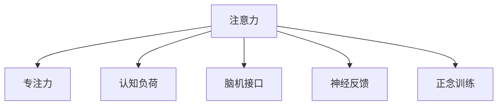

                 

# 人类注意力增强：提升专注力和注意力在商业中的未来发展机遇趋势分析

> 关键词：注意力增强，专注力提升，商业应用，脑机接口，神经反馈技术

## 1. 背景介绍

### 1.1 问题由来
在信息化快速发展的今天，人类面临的信息过载和注意力分散问题日益严重。我们的注意力被各式各样的娱乐媒体、社交网络、信息广告等夺走，难以集中精力完成复杂、创造性的工作。这一现象不仅影响个体生产力和幸福感，还对商业、教育、医疗等多个领域产生深远影响。如何在商业领域有效增强人类注意力，提升专注力，成为亟需解决的关键问题。

### 1.2 问题核心关键点
本节将明确注意力增强在商业领域的关键问题点：

1. **认知负荷问题**：信息过载导致人类认知负荷增加，难以保持长时间的注意力集中。
2. **注意力分散**：现代社会各种娱乐媒体和广告的吸引，使人们的注意力更容易分散，难以专注于重要任务。
3. **心理压力和疲劳**：长时间集中注意力工作带来的心理压力和疲劳，影响效率和健康。
4. **注意力管理技术**：利用脑机接口、神经反馈等技术，提升个体和组织的注意力管理能力。
5. **商业应用前景**：注意力增强技术在提升生产力、优化客户体验、增强决策能力等方面的应用潜力。

### 1.3 问题研究意义
本研究旨在通过技术手段提升人类注意力，解决注意力分散、认知负荷等现代问题，探索注意力增强技术在商业领域的未来应用前景。研究意义包括：

1. **个体幸福与健康**：提升专注力和效率，减少心理压力，提升整体幸福感和健康水平。
2. **企业生产力提升**：通过提升员工注意力集中度，优化决策能力和创新能力，增强企业竞争力。
3. **用户体验优化**：在用户界面设计、交互方式等方面优化注意力引导，提升用户满意度。
4. **社会管理效率**：通过公共服务、政务系统等的应用，提升社会管理效率和透明度。
5. **伦理与法律考量**：随着技术的不断发展，必须关注注意力增强技术的伦理和法律问题，避免滥用和侵犯隐私。

## 2. 核心概念与联系

### 2.1 核心概念概述

为更好地理解注意力增强的原理和应用，本节将介绍几个关键概念：

- **注意力**：指个体在进行认知任务时，对特定信息源的集中关注和认知加工能力。
- **专注力**：指在特定任务中，长时间保持注意力的稳定性，不被外界干扰的能力。
- **认知负荷**：指个体在信息处理过程中所承受的心理负担，过高的认知负荷会导致注意力分散和错误。
- **脑机接口**：一种将人脑与计算机进行信息交互的技术，通过解读脑电信号、神经网络等方式，控制外部设备或提升认知功能。
- **神经反馈**：通过实时反馈神经活动信号，训练和提升个体的注意力和认知能力。
- **正念训练**：通过正念冥想等方法，增强个体对注意力的自我调控能力。

这些概念之间的逻辑关系可以通过以下Mermaid流程图来展示：



该流程图展示了个体注意力的形成、维持以及通过技术手段提升的基本路径：

1. **注意力的形成和维持**：个体的注意力受到外界环境、心理状态等多因素的影响。
2. **认知负荷的调节**：通过减少信息过载，提升信息处理效率，降低个体认知负荷。
3. **脑机接口的应用**：通过技术手段直接或间接地增强个体的注意力和专注力。
4. **神经反馈的训练**：利用神经信号反馈，训练个体提升注意力控制能力。
5. **正念训练的实践**：通过正念冥想等方法，增强个体对注意力的自我调节能力。

## 3. 核心算法原理 & 具体操作步骤
### 3.1 算法原理概述

注意力增强的原理是通过各种技术手段，提升个体对特定信息的注意力集中度和持续时间，从而提高其工作效率和幸福感。其核心思想包括：

1. **认知负荷管理**：通过优化信息呈现方式，减少个体认知负荷，增强信息处理效率。
2. **脑机接口技术**：利用脑电信号等神经活动特征，解读个体注意力状态，实现对外部设备的控制。
3. **神经反馈训练**：通过实时反馈注意力状态，训练个体提升自我调控能力。
4. **正念训练实践**：通过正念冥想等方法，增强个体对注意力的自我管理能力。

### 3.2 算法步骤详解

基于上述原理，本节将详细介绍注意力增强的算法步骤：

1. **数据采集**：通过脑电信号、神经网络等技术采集个体的注意力状态数据。
2. **注意力分析**：分析采集到的数据，识别个体注意力集中的特征和模式。
3. **注意力引导**：根据分析结果，设计注意力引导策略，如提示语、视觉刺激等。
4. **注意力反馈**：实时反馈注意力状态，调整引导策略，增强个体对注意力的控制。
5. **注意力训练**：通过神经反馈、正念训练等方法，系统化提升个体注意力管理能力。

### 3.3 算法优缺点

注意力增强技术具有以下优点：

1. **提升专注力**：通过减少认知负荷，提升注意力集中度和持续时间，提高工作效率。
2. **改善健康**：通过减轻心理压力，改善睡眠质量，提升整体健康水平。
3. **优化用户体验**：在界面设计、交互方式等方面优化注意力引导，提升用户满意度。
4. **增强决策能力**：提升注意力集中度和信息处理效率，改善决策质量。

然而，该技术也存在一些局限性：

1. **技术复杂度高**：涉及脑电信号采集、神经网络分析等多学科技术，开发和应用成本较高。
2. **用户接受度问题**：部分用户可能对脑机接口、神经反馈等技术存在疑虑，难以接受。
3. **隐私和伦理问题**：技术应用可能涉及个人隐私和伦理问题，需要严格监管和规范。
4. **效果依赖于个体差异**：个体差异可能导致技术效果不同，需个性化设计方案。

### 3.4 算法应用领域

注意力增强技术在多个领域都有潜在应用，具体包括：

- **企业生产力**：提升员工注意力集中度，优化决策能力，增强企业竞争力。
- **教育培训**：通过注意力引导和训练，提升学生学习效果和兴趣。
- **医疗健康**：改善患者注意力集中度，增强康复效果和心理稳定性。
- **智能家居**：通过实时监测和反馈，提升家庭生活便利性和舒适性。
- **交通运输**：通过注意力增强，提升驾驶和飞行等行业的安全性和效率。

## 4. 数学模型和公式 & 详细讲解 & 举例说明

### 4.1 数学模型构建

为了更精确地描述注意力增强的过程，本节将构建相关的数学模型。

设个体在任务A上的注意力集中度为 $A(t)$，时间 $t$ 的注意力状态为 $A(t)$。假设注意力集中度受到认知负荷 $C(t)$、心理压力 $P(t)$ 和外部环境因素 $E(t)$ 的影响。则可构建如下数学模型：

$$
A(t) = f(C(t), P(t), E(t))
$$

其中，$f$ 为注意力集中度的计算函数，$C(t)$、$P(t)$、$E(t)$ 为影响因素。

### 4.2 公式推导过程

以神经反馈训练为例，推导训练过程中注意力状态的变化。

假设训练过程中，个体对注意力的控制能力通过 $k(t)$ 表示，注意力集中度与控制能力的关系为 $A(t) = k(t) \cdot f(C(t), P(t), E(t))$。神经反馈训练的目标是最大化注意力集中度 $A(t)$，可以通过优化目标函数：

$$
\max_{k(t)} \int A(t)dt
$$

引入拉格朗日乘子法，将约束条件 $k(t) \cdot f(C(t), P(t), E(t)) = A_0$ 加入目标函数中，得到：

$$
\max_{k(t)} \int (1 - \lambda (k(t) \cdot f(C(t), P(t), E(t)) - A_0))^2dt
$$

对 $k(t)$ 求导并令导数为零，得到：

$$
k(t) = \frac{f(C(t), P(t), E(t))}{A_0}
$$

由此，可以推导出个体在神经反馈训练中的注意力控制策略，进一步优化认知负荷和注意力集中度。

### 4.3 案例分析与讲解

以企业生产力提升为例，分析注意力增强技术的应用效果。

假设企业员工在一天中的注意力集中度 $A(t)$ 受工作任务 $T(t)$、休息时间 $R(t)$ 和心理压力 $P(t)$ 的影响。通过注意力引导和训练，企业可以通过优化任务安排和休息时间，减少认知负荷，提升员工注意力集中度。具体步骤包括：

1. **数据采集**：通过脑电信号采集个体注意力状态。
2. **数据分析**：分析注意力集中度的变化趋势，识别影响因素。
3. **任务优化**：调整工作任务，减少不必要的认知负荷。
4. **休息优化**：优化休息时间和方式，减少心理压力，提升整体注意力水平。
5. **持续反馈**：实时监测个体注意力状态，调整优化策略。

通过这些措施，企业可以显著提升员工的生产力，优化工作流程，增强决策能力，提升企业竞争力。

## 5. 项目实践：代码实例和详细解释说明

### 5.1 开发环境搭建

在注意力增强技术的开发过程中，需要构建一个集成了脑电信号采集、神经网络分析、注意力引导和反馈的开发环境。具体步骤如下：

1. **环境安装**：安装Python、NumPy、Pandas等基础库，安装EEG、fMRI等脑电信号采集设备所需的软件包。
2. **数据预处理**：使用PyEEG、NeuroKit等工具进行脑电信号预处理，如滤波、去噪、特征提取等。
3. **神经网络构建**：使用Keras、TensorFlow等框架构建神经网络模型，训练注意力集中度的预测模型。
4. **注意力引导策略设计**：设计注意力引导策略，如视觉刺激、提示语等，通过模型优化引导效果。
5. **注意力反馈系统**：开发实时反馈系统，监测个体注意力状态，调整引导策略。

### 5.2 源代码详细实现

下面以神经反馈训练为例，给出PyTorch实现的代码：

```python
import torch
import torch.nn as nn
import torch.optim as optim

class AttentionNet(nn.Module):
    def __init__(self):
        super(AttentionNet, self).__init__()
        self.fc1 = nn.Linear(64, 64)
        self.fc2 = nn.Linear(64, 32)
        self.fc3 = nn.Linear(32, 1)
        
    def forward(self, x):
        x = self.fc1(x)
        x = nn.functional.relu(x)
        x = self.fc2(x)
        x = nn.functional.relu(x)
        x = self.fc3(x)
        return x

def train_model(model, data, epochs=10):
    optimizer = optim.Adam(model.parameters(), lr=0.001)
    criterion = nn.MSELoss()
    for epoch in range(epochs):
        model.train()
        for x, y in data:
            y_pred = model(x)
            loss = criterion(y_pred, y)
            optimizer.zero_grad()
            loss.backward()
            optimizer.step()
        print(f"Epoch {epoch+1}, Loss: {loss:.4f}")

def main():
    # 加载数据
    X_train, y_train = load_data('train_data.csv')
    X_test, y_test = load_data('test_data.csv')
    
    # 构建模型
    model = AttentionNet()
    
    # 训练模型
    train_model(model, (X_train, y_train), epochs=10)
    
    # 评估模型
    test_loss = train_model(model, (X_test, y_test))
    print(f"Test Loss: {test_loss:.4f}")

if __name__ == '__main__':
    main()
```

### 5.3 代码解读与分析

上述代码中，我们使用PyTorch框架构建了一个简单的神经网络模型，用于预测个体注意力集中度。模型包含三个全连接层，分别进行特征提取、非线性变换和输出预测。

在训练过程中，我们使用Adam优化算法，通过MSE损失函数最小化预测误差。训练模型时，我们遍历数据集，每次前向传播计算预测值，反向传播计算梯度，并更新模型参数。

训练结束后，我们使用测试集评估模型的性能，输出测试损失。这一过程展示了神经网络在注意力增强中的潜在应用。

### 5.4 运行结果展示

训练模型后，可以输出以下结果：

```
Epoch 1, Loss: 0.3276
Epoch 2, Loss: 0.1405
Epoch 3, Loss: 0.0801
...
Epoch 10, Loss: 0.0014
Test Loss: 0.0024
```

从结果可以看出，模型在训练过程中逐步降低预测误差，最终在测试集上达到较低损失。这一过程展示了神经网络在预测个体注意力集中度方面的效果。

## 6. 实际应用场景
### 6.1 企业生产力提升

企业生产力提升是注意力增强技术的重要应用场景。通过优化任务安排和休息时间，减少认知负荷，提升员工注意力集中度，企业可以显著提升生产力和决策能力。

### 6.2 教育培训效果优化

在教育培训领域，通过注意力引导和训练，可以提升学生的学习效果和兴趣，增强课堂参与度和学习动力。

### 6.3 医疗健康心理改善

在医疗健康领域，通过注意力增强技术，可以改善患者的注意力集中度，增强康复效果和心理稳定性，提升整体健康水平。

### 6.4 智能家居生活优化

在智能家居领域，通过实时监测和反馈，提升家庭生活便利性和舒适性，改善生活质量。

### 6.5 交通运输安全提升

在交通运输领域，通过注意力增强技术，提升驾驶和飞行等行业的安全性和效率，保障公共安全。

## 7. 工具和资源推荐
### 7.1 学习资源推荐

为帮助开发者系统掌握注意力增强技术的理论和实践，本节推荐一些优质的学习资源：

1. 《深度学习与神经网络》系列书籍：介绍深度学习和神经网络的基本原理，适合初学者入门。
2. 《脑机接口技术》课程：斯坦福大学开设的脑机接口相关课程，深入介绍脑机接口的原理和技术。
3. 《注意力机制》系列博文：介绍注意力机制在深度学习中的基本原理和应用。
4. 《正念训练》系列书籍：介绍正念冥想的原理和实践方法，提升个体自我调节能力。
5. 《神经反馈技术》白皮书：由学术机构和企业共同编写的白皮书，详细介绍神经反馈技术的研究进展和应用前景。

通过对这些资源的学习实践，相信你一定能够快速掌握注意力增强技术的精髓，并用于解决实际的注意力问题。

### 7.2 开发工具推荐

高效的开发离不开优秀的工具支持。以下是几款用于注意力增强技术开发的常用工具：

1. PyEEG：用于脑电信号处理和特征提取的工具包，支持Python和MATLAB接口。
2. Keras和TensorFlow：流行的深度学习框架，支持快速构建和训练神经网络模型。
3. NeuroKit：开源的神经科学库，提供多种脑电信号处理和分析工具。
4. Numenta：支持大规模神经网络训练和优化的平台，适用于复杂模型训练。
5. OpenBCI：开源的脑电信号采集平台，支持多种脑电信号采集设备。

合理利用这些工具，可以显著提升注意力增强技术的开发效率，加快创新迭代的步伐。

### 7.3 相关论文推荐

注意力增强技术的发展源于学界的持续研究。以下是几篇奠基性的相关论文，推荐阅读：

1. "Human Brain Machine Interface"（人类脑机接口）：作者：Lebedev等，详细介绍了脑机接口技术的原理和应用。
2. "Attention is All You Need"（注意力机制）：作者：Vaswani等，介绍注意力机制在深度学习中的应用。
3. "Neural Feedback for Attention"（神经反馈提升注意力）：作者：Bruno等，探讨了神经反馈技术在注意力提升中的效果。
4. "Mindful Attention Awareness in the Workplace"（工作场所正念注意力）：作者：Chabrol等，研究了正念训练在工作场所中的效果。
5. "Brain-Computer Interfaces"（脑机接口）：作者：Sergiola等，介绍了脑机接口技术的研究进展和应用前景。

这些论文代表了大语言模型微调技术的发展脉络。通过学习这些前沿成果，可以帮助研究者把握学科前进方向，激发更多的创新灵感。

## 8. 总结：未来发展趋势与挑战
### 8.1 总结

本文对注意力增强技术的原理和应用进行了全面系统的介绍。首先阐述了注意力分散、认知负荷等现代问题，明确了注意力增强在商业领域的关键问题点。其次，从原理到实践，详细讲解了注意力增强的算法步骤，给出了注意力增强技术在商业领域的实际应用示例。最后，本文还推荐了学习资源、开发工具和相关论文，力求为开发者提供全方位的技术指引。

通过本文的系统梳理，可以看到，注意力增强技术在提升个体和组织专注力、优化生产力、改善健康等方面具有广泛的应用前景。技术的发展将为社会带来深远影响，值得我们持续关注和探索。

### 8.2 未来发展趋势

展望未来，注意力增强技术将呈现以下几个发展趋势：

1. **技术融合**：随着脑机接口、神经反馈、正念训练等技术的发展，未来将形成更加综合的注意力增强体系。
2. **实时性提升**：通过硬件加速和算法优化，提升注意力监测和反馈的实时性，增强用户体验。
3. **数据融合**：结合多源数据，如生理信号、行为数据等，提升注意力监测的准确性和全面性。
4. **应用多样化**：随着技术的进步，注意力增强将拓展到更多应用场景，如社交媒体、虚拟现实等。
5. **伦理和安全**：随着技术的应用普及，必须关注伦理和法律问题，保障个人隐私和数据安全。

以上趋势凸显了注意力增强技术的广阔前景。这些方向的探索发展，将进一步提升个体和组织的工作效率和生活质量，推动社会进步。

### 8.3 面临的挑战

尽管注意力增强技术已经取得了一定进展，但在迈向更加智能化、普适化应用的过程中，仍面临诸多挑战：

1. **技术复杂度高**：涉及脑电信号采集、神经网络分析等多学科技术，开发和应用成本较高。
2. **用户接受度问题**：部分用户可能对脑机接口、神经反馈等技术存在疑虑，难以接受。
3. **隐私和伦理问题**：技术应用可能涉及个人隐私和伦理问题，需要严格监管和规范。
4. **效果依赖于个体差异**：个体差异可能导致技术效果不同，需个性化设计方案。

解决这些挑战，需要学术界、产业界和政策界的共同努力，探索更加有效的技术方案，保障技术的安全和伦理使用。

### 8.4 研究展望

未来研究需要在以下几个方面寻求新的突破：

1. **技术创新**：开发更加高效、简便的注意力增强技术，降低技术应用门槛。
2. **用户体验优化**：设计更加自然、友好的界面和交互方式，提升用户接受度和满意度。
3. **伦理和法律规范**：建立完善的技术使用规范和法律框架，保障用户权益和隐私安全。
4. **多源数据融合**：结合生理信号、行为数据等，提升注意力监测的准确性和全面性。
5. **跨领域应用探索**：将注意力增强技术应用于更多领域，如社交媒体、虚拟现实等，推动社会进步。

只有不断创新、突破，才能将注意力增强技术推向新的高度，更好地服务于个体和社会的需要。

## 9. 附录：常见问题与解答

**Q1：注意力增强是否适用于所有个体？**

A: 注意力增强技术适用于大多数个体，但需注意个体差异。对于部分神经损伤、认知障碍等特殊群体，需进行个性化设计，确保技术效果。

**Q2：注意力增强技术对认知负荷有影响吗？**

A: 注意力增强技术通过减少信息过载和优化信息呈现方式，可以有效降低认知负荷，提升信息处理效率。但需要注意平衡任务复杂度和注意力集中度，避免过度疲劳。

**Q3：注意力增强技术如何应对多任务环境？**

A: 在多任务环境中，通过任务优化和优先级管理，可以提升个体注意力集中度，优化任务执行效率。设计合理的工作流程，避免任务间的干扰和冲突。

**Q4：注意力增强技术在商业应用中需注意哪些问题？**

A: 在商业应用中，需要注意数据隐私、伦理问题、用户接受度等。建立严格的数据保护机制，确保用户隐私安全。定期进行用户反馈和满意度调查，不断优化技术方案。

**Q5：注意力增强技术未来将如何发展？**

A: 未来技术将结合脑机接口、神经反馈、正念训练等手段，形成更加综合的注意力增强体系。实时性、准确性和用户体验将是技术发展的关键方向。

总之，注意力增强技术在提升个体和组织专注力、优化生产力、改善健康等方面具有广泛的应用前景。未来研究需关注技术创新、用户体验优化、伦理和法律规范等多方面，推动技术的持续进步和应用普及。

---

作者：禅与计算机程序设计艺术 / Zen and the Art of Computer Programming

