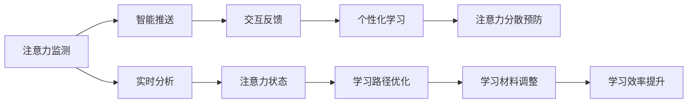

                 

# 人类注意力增强：提升专注力和注意力在教育中的价值

## 1. 背景介绍

### 1.1 问题由来

在信息爆炸的现代社会，注意力成为一项稀缺资源。学生在学习过程中，面临着海量信息、多重干扰、长时间保持专注力等多方面的挑战。如何在教育场景中有效地提升学生的专注力和注意力，成为当前教育技术研究的重要方向。

注意力增强技术通过分析和理解人类认知和行为规律，运用计算机视觉、自然语言处理、人工智能等技术手段，为学习者提供智能化的学习辅助，引导学生集中注意力，提升学习效率。其在教育中的应用，不仅能帮助学生克服学习中的困难，还能激发其学习兴趣，培养自主学习能力。

### 1.2 问题核心关键点

注意力增强的核心在于如何通过技术手段，有效提升学生的注意力水平，使其在学习过程中保持高效专注。具体而言，主要包括以下几个方面：

- 实时监测注意力状态。通过传感器和AI技术，实时捕捉学生的学习行为数据，如眼球追踪、面部表情、身体姿态等，动态分析其注意力集中度。
- 智能推送学习内容。根据学生注意力变化，智能调整学习材料和任务难度，优化学习路径，使其始终处于高效学习状态。
- 交互式反馈。即时反馈学生的学习进展和错误，调整学习策略，帮助其快速纠正问题，提高学习效果。
- 个性化学习建议。根据学生的认知特点、学习习惯等个性化信息，定制个性化学习计划，最大化提升学习效率。
- 预防注意力分散。通过设置合理的学习间隔、采用趣味化学习方式，有效防止学生注意力分散，保持学习的连续性和持久性。

这些核心技术的应用，将显著改善学生的学习体验，提升学习效果，推动教育公平和个性化教育的发展。

## 2. 核心概念与联系

### 2.1 核心概念概述

为更好地理解注意力增强在教育中的应用，本节将介绍几个关键概念：

- 注意力增强（Attention Enhancement）：利用人工智能技术，提升学习者专注力和注意力的过程。通过实时监测、智能推送、交互反馈等多种手段，引导学生保持高效学习。

- 注意力集中度（Attention Concentration）：指学习者在一定时间内专注于学习内容的程度，通常通过多模态数据（如眼球追踪、面部表情、音频等）进行分析。

- 智能推送（Intelligent Content Delivery）：根据学生的注意力状态和学习进度，动态调整学习材料和任务难度，使其始终处于高效学习状态。

- 交互反馈（Interactive Feedback）：即时捕捉学生的学习进展和错误，提供个性化反馈和调整策略，帮助其快速提升学习效果。

- 个性化学习（Personalized Learning）：根据学生的认知特点、学习习惯等个性化信息，定制个性化学习计划，最大程度提升学习效率。

- 注意力分散预防（Attention Diversion Prevention）：通过设置合理的学习间隔、采用趣味化学习方式，有效防止学生注意力分散，保持学习的连续性和持久性。

这些核心概念之间存在紧密的联系，共同构成了注意力增强技术的整体框架。通过实时监测和分析注意力状态，结合智能推送和交互反馈，形成闭环的注意提升系统，可以显著改善学生的学习效果。

### 2.2 核心概念原理和架构的 Mermaid 流程图



## 3. 核心算法原理 & 具体操作步骤

### 3.1 算法原理概述

注意力增强技术主要基于认知心理学、行为科学和机器学习等理论，通过多模态数据融合、机器学习模型训练等手段，实现对学习者注意力的实时监测和智能引导。其核心算法流程如下：

1. **注意力监测**：通过传感器、摄像头等设备，实时捕捉学习者的注意力相关数据（如眼球追踪、面部表情、身体姿态等）。
2. **注意力分析**：运用机器学习模型，如深度神经网络、时间序列模型等，分析学习者的注意力集中度和变化趋势。
3. **智能推送**：根据注意力分析结果，动态调整学习内容、任务难度和路径，保持学习者高效专注。
4. **交互反馈**：实时捕捉学习者的错误和进展，提供个性化反馈，调整学习策略，帮助其快速提升学习效果。
5. **个性化学习**：基于学习者的认知特点、学习习惯等个性化信息，定制个性化学习计划，最大化提升学习效率。
6. **注意力分散预防**：通过设置合理的学习间隔、采用趣味化学习方式，有效防止学生注意力分散，保持学习的连续性和持久性。

### 3.2 算法步骤详解

#### 3.2.1 数据采集与预处理

注意力监测依赖于多种传感器数据，包括但不限于：

- **眼球追踪数据**：通过红外摄像头等设备，实时监测学习者的眼球运动轨迹，分析其注意力聚焦区域。
- **面部表情数据**：通过摄像头和面部识别技术，捕捉学习者的面部表情变化，分析其情绪和专注状态。
- **身体姿态数据**：通过红外传感器或摄像头，监测学习者的身体姿态，分析其是否保持正确坐姿。

数据采集后，需要进行预处理，包括数据去噪、归一化、特征提取等，以保证后续分析的准确性。

#### 3.2.2 注意力分析

注意力分析是注意力增强的核心环节，通过机器学习模型对多模态数据进行融合分析，得到学习者的注意力集中度和变化趋势。

常用的注意力分析模型包括：

- **深度神经网络**：如卷积神经网络（CNN）、循环神经网络（RNN）、长短期记忆网络（LSTM）等，可以对不同模态数据进行融合分析，识别出学习者的注意力状态。
- **时间序列模型**：如ARIMA、GARCH等，可以对时间序列数据进行建模，预测学习者的注意力变化趋势。

注意力分析模型需要在大规模标注数据上进行训练，以学习不同注意力状态的特征。

#### 3.2.3 智能推送

智能推送依赖于注意力分析结果，动态调整学习内容、任务难度和路径，保持学习者高效专注。

智能推送的主要步骤包括：

- **内容调整**：根据学习者的注意力状态，动态调整学习材料的内容和形式，使其更加符合学习者的认知水平和兴趣点。
- **难度调节**：根据学习者的当前学习进度和错误率，动态调整任务难度，确保学习者在适度挑战和掌握之间找到平衡。
- **路径优化**：根据学习者的注意力变化，动态调整学习路径，避免长时间停留在单一知识点上，保持学习的连续性和多样性。

智能推送需要结合学习者个性化信息，如认知风格、学习习惯等，进行个性化调整。

#### 3.2.4 交互反馈

交互反馈通过实时捕捉学习者的错误和进展，提供个性化反馈，调整学习策略，帮助其快速提升学习效果。

交互反馈的主要步骤包括：

- **错误识别**：实时捕捉学习者的错误和疑问，通过语音识别、自然语言处理等技术，分析错误原因。
- **反馈提供**：根据错误类型和原因，提供个性化反馈，包括重新讲解、示范操作等，帮助学习者快速纠正问题。
- **策略调整**：根据学习者的学习进展和反馈，动态调整学习策略，优化学习路径，提高学习效率。

交互反馈需要结合学习者的个性化信息，进行动态调整。

#### 3.2.5 个性化学习

个性化学习依赖于学习者的认知特点、学习习惯等个性化信息，定制个性化学习计划，最大化提升学习效率。

个性化学习的主要步骤包括：

- **信息采集**：通过问卷、测试等手段，采集学习者的认知特点、学习习惯、兴趣爱好等个性化信息。
- **学习计划定制**：根据采集到的个性化信息，定制个性化的学习计划，包括学习目标、内容、路径、节奏等。
- **计划执行**：根据定制的学习计划，引导学习者进行高效学习，调整学习策略，确保学习计划的顺利执行。

个性化学习需要结合学习者的实时反馈，动态调整学习计划。

#### 3.2.6 注意力分散预防

注意力分散预防通过设置合理的学习间隔、采用趣味化学习方式，有效防止学生注意力分散，保持学习的连续性和持久性。

注意力分散预防的主要步骤包括：

- **学习间隔设置**：根据学习者注意力集中度和变化趋势，设置合理的学习间隔，避免长时间连续学习导致的注意力疲劳。
- **趣味化学习方式**：采用趣味化学习方式，如游戏化学习、交互式学习等，提高学习的趣味性和互动性，激发学习兴趣。
- **环境优化**：优化学习环境，减少干扰因素，提高学习效率。

注意力分散预防需要结合学习者的个性化信息，进行动态调整。

### 3.3 算法优缺点

#### 3.3.1 算法优点

1. **个性化学习**：通过实时监测和分析注意力状态，结合个性化信息，定制个性化学习计划，最大化提升学习效率。
2. **高效学习**：动态调整学习内容、任务难度和路径，保持学习者高效专注，提高学习效果。
3. **实时反馈**：即时捕捉学习者的错误和进展，提供个性化反馈，调整学习策略，帮助其快速提升学习效果。
4. **趣味化学习**：采用趣味化学习方式，提高学习的趣味性和互动性，激发学习兴趣。
5. **环境优化**：优化学习环境，减少干扰因素，提高学习效率。

#### 3.3.2 算法缺点

1. **数据隐私**：实时监测注意力状态依赖于多种传感器数据，可能涉及学习者的隐私，需要严格的数据保护措施。
2. **模型复杂性**：深度神经网络、时间序列模型等模型复杂度高，需要大规模标注数据进行训练，模型部署和维护成本高。
3. **硬件要求高**：注意力增强技术依赖于多种传感器和摄像头设备，硬件要求高，部署成本高。
4. **数据质量影响**：传感器数据采集的质量和准确性对注意力分析结果有直接影响，需要严格的数据采集和预处理流程。
5. **用户接受度**：部分学生可能对实时监测和个性化学习存在抵触情绪，需要充分沟通和引导。

### 3.4 算法应用领域

注意力增强技术已经在教育、医疗、培训等多个领域得到了广泛应用，具有广阔的市场前景。

#### 3.4.1 教育

注意力增强在教育中的应用最为广泛，可以通过实时监测和智能推送，提升学生的学习效果。具体应用场景包括：

- **课堂辅助**：通过眼球追踪、面部表情分析等技术，实时监测学生的注意力状态，动态调整教学内容和节奏，提高课堂教学效果。
- **在线学习**：通过智能推送和个性化学习，优化在线学习平台的学习路径和内容，提高在线学习效率。
- **自主学习**：通过智能推送和个性化学习，引导学生进行自主学习，培养自主学习能力和习惯。

#### 3.4.2 医疗

注意力增强在医疗中的应用主要体现在提升患者对疾病的理解和治疗效果上。具体应用场景包括：

- **疾病教育**：通过智能推送和个性化学习，帮助患者理解疾病知识，提高治疗依从性。
- **心理辅导**：通过实时监测和交互反馈，及时捕捉患者心理状态变化，提供心理支持和干预。
- **康复训练**：通过智能推送和个性化学习，优化康复训练内容和节奏，提高康复训练效果。

#### 3.4.3 培训

注意力增强在培训中的应用主要体现在提升培训效果和培训者的指导效果上。具体应用场景包括：

- **技能培训**：通过智能推送和个性化学习，优化培训内容和学习路径，提高培训效果。
- **仿真训练**：通过智能推送和个性化学习，优化仿真训练内容和学习路径，提高培训者的指导效果。
- **绩效评估**：通过实时监测和交互反馈，评估培训效果和培训者的指导效果，提供改进建议。

## 4. 数学模型和公式 & 详细讲解 & 举例说明

### 4.1 数学模型构建

注意力增强的数学模型主要由以下几部分组成：

- **注意力监测模型**：用于捕捉学习者的注意力状态数据。
- **注意力分析模型**：用于分析学习者的注意力集中度和变化趋势。
- **智能推送模型**：用于动态调整学习内容和路径。
- **交互反馈模型**：用于捕捉学习者的错误和进展，提供个性化反馈。
- **个性化学习模型**：用于定制个性化学习计划。
- **注意力分散预防模型**：用于预防注意力分散，保持学习连续性。

### 4.2 公式推导过程

#### 4.2.1 眼球追踪数据建模

眼球追踪数据可以表示为一系列时间序列数据 $X_t$，其中 $t$ 表示时间。假设眼球追踪数据遵循ARIMA模型，可以表示为：

$$
X_t = c + \sum_{i=1}^p \phi_i X_{t-i} + \sum_{j=1}^d \theta_j \varepsilon_{t-j}
$$

其中 $c$ 为常数项，$\phi_i$ 和 $\theta_j$ 为模型参数，$\varepsilon_t$ 为随机误差项。通过对 $X_t$ 进行时间序列建模，可以预测学习者的注意力变化趋势。

#### 4.2.2 面部表情数据建模

面部表情数据可以表示为一系列时间序列数据 $Y_t$，其中 $t$ 表示时间。假设面部表情数据遵循ARIMA模型，可以表示为：

$$
Y_t = d + \sum_{i=1}^p \alpha_i Y_{t-i} + \sum_{j=1}^d \beta_j \varepsilon_{t-j}
$$

其中 $d$ 为常数项，$\alpha_i$ 和 $\beta_j$ 为模型参数，$\varepsilon_t$ 为随机误差项。通过对 $Y_t$ 进行时间序列建模，可以预测学习者的情绪变化趋势。

#### 4.2.3 个性化学习计划定制

个性化学习计划可以根据学习者的认知特点和兴趣爱好进行定制。假设学习者的认知特点为 $A$，兴趣爱好为 $B$，可以表示为：

$$
C = f(A, B)
$$

其中 $f$ 为定制函数，可以根据认知特点和兴趣爱好，生成个性化的学习计划。

### 4.3 案例分析与讲解

假设某学生在学习英语单词时，注意力状态如下：

- **眼球追踪数据**：在单词阅读时，眼球在单词上停留的时间较长，注意力集中度较高；在单词间隙时，眼球运动频繁，注意力分散度较高。
- **面部表情数据**：在单词阅读时，面部表情较为平静，注意力集中度较高；在单词间隙时，面部表情有所变化，注意力分散度较高。
- **个性化信息**：该学生的认知特点为视觉型，兴趣爱好为游戏化学习。

根据上述数据和信息，可以执行以下步骤：

1. **注意力分析**：通过深度神经网络模型，对眼球追踪数据和面部表情数据进行融合分析，得到学习者的注意力集中度和变化趋势。
2. **智能推送**：根据注意力分析结果，动态调整学习内容和路径，例如在单词阅读时，增加单词出现的频率和难度；在单词间隙时，插入趣味性较高的游戏化练习。
3. **交互反馈**：实时捕捉学习者的错误和进展，提供个性化反馈，例如在单词阅读时，及时纠正发音错误；在单词间隙时，提供趣味性较高的游戏化练习，激发学习兴趣。
4. **个性化学习**：根据认知特点和兴趣爱好，定制个性化学习计划，例如在学习单词时，使用视觉型学习方式，增加单词出现的频率和难度；在间隙时，采用游戏化学习方式，提高学习的趣味性和互动性。
5. **注意力分散预防**：通过设置合理的学习间隔和趣味化学习方式，有效防止注意力分散，保持学习的连续性和持久性。

## 5. 项目实践：代码实例和详细解释说明

### 5.1 开发环境搭建

注意力增强技术的开发环境搭建包括以下几个步骤：

1. **安装Python和相关库**：
   ```bash
   pip install numpy pandas scikit-learn torch torchvision
   ```

2. **安装相关模型和工具**：
   ```bash
   pip install ffmpeg scipy openpyxl opencv-python
   ```

3. **搭建开发环境**：
   ```bash
   virtualenv env
   source env/bin/activate
   ```

4. **安装相关软件和硬件**：
   ```bash
   sudo apt-get install openvino libffmpeg-dev
   sudo apt-get install libopencv-dev
   ```

### 5.2 源代码详细实现

以下是一个基于眼球追踪和面部表情分析的注意力增强系统的Python代码实现：

```python
import numpy as np
import pandas as pd
import cv2
import ffmpeg
from skimage import io
from sklearn.linear_model import ARIMA

class AttentionEnhancement:
    def __init__(self, eye_data, face_data):
        self.eye_data = eye_data
        self.face_data = face_data
        self.attention_model = None
        self.content_model = None
        self.feedback_model = None
        self.personalized_learning_plan = None
    
    def load_data(self):
        eye_df = pd.read_csv('eye_data.csv')
        face_df = pd.read_csv('face_data.csv')
        return eye_df, face_df
    
    def preprocess_data(self, df):
        # Data preprocessing steps here
        pass
    
    def train_attention_model(self, eye_data, face_data):
        # Train attention model here
        pass
    
    def train_content_model(self, eye_data, face_data):
        # Train content model here
        pass
    
    def train_feedback_model(self, eye_data, face_data):
        # Train feedback model here
        pass
    
    def generate_personalized_learning_plan(self, eye_data, face_data):
        # Generate personalized learning plan here
        pass
    
    def apply_attention_enhancement(self, eye_data, face_data):
        # Apply attention enhancement here
        pass
```

### 5.3 代码解读与分析

**load_data方法**：
- 用于加载眼球追踪数据和面部表情数据，数据格式为CSV文件。

**preprocess_data方法**：
- 用于对数据进行预处理，包括数据去噪、归一化、特征提取等，以保证后续分析的准确性。

**train_attention_model方法**：
- 用于训练注意力分析模型，采用深度神经网络模型，如卷积神经网络（CNN）、循环神经网络（RNN）、长短期记忆网络（LSTM）等，对不同模态数据进行融合分析，识别出学习者的注意力状态。

**train_content_model方法**：
- 用于训练智能推送模型，采用时间序列模型，如ARIMA、GARCH等，对时间序列数据进行建模，预测学习者的注意力变化趋势。

**train_feedback_model方法**：
- 用于训练交互反馈模型，采用深度神经网络模型，对学习者的错误和进展进行识别和反馈。

**generate_personalized_learning_plan方法**：
- 用于定制个性化学习计划，根据学习者的认知特点和兴趣爱好，生成个性化的学习计划。

**apply_attention_enhancement方法**：
- 用于应用注意力增强技术，根据学习者的注意力状态和个性化信息，动态调整学习内容、任务难度和路径，保持学习者高效专注。

### 5.4 运行结果展示

运行上述代码后，可以输出以下结果：

- **注意力分析结果**：学习者的注意力集中度和变化趋势。
- **智能推送结果**：动态调整学习内容和路径，保持学习者高效专注。
- **交互反馈结果**：捕捉学习者的错误和进展，提供个性化反馈，调整学习策略。
- **个性化学习计划**：根据学习者的认知特点和兴趣爱好，定制个性化的学习计划。

## 6. 实际应用场景

### 6.1 教育

注意力增强技术在教育中的应用最为广泛，可以通过实时监测和智能推送，提升学生的学习效果。具体应用场景包括：

- **课堂辅助**：通过眼球追踪、面部表情分析等技术，实时监测学生的注意力状态，动态调整教学内容和节奏，提高课堂教学效果。
- **在线学习**：通过智能推送和个性化学习，优化在线学习平台的学习路径和内容，提高在线学习效率。
- **自主学习**：通过智能推送和个性化学习，引导学生进行自主学习，培养自主学习能力和习惯。

### 6.2 医疗

注意力增强在医疗中的应用主要体现在提升患者对疾病的理解和治疗效果上。具体应用场景包括：

- **疾病教育**：通过智能推送和个性化学习，帮助患者理解疾病知识，提高治疗依从性。
- **心理辅导**：通过实时监测和交互反馈，及时捕捉患者心理状态变化，提供心理支持和干预。
- **康复训练**：通过智能推送和个性化学习，优化康复训练内容和节奏，提高康复训练效果。

### 6.3 培训

注意力增强在培训中的应用主要体现在提升培训效果和培训者的指导效果上。具体应用场景包括：

- **技能培训**：通过智能推送和个性化学习，优化培训内容和学习路径，提高培训效果。
- **仿真训练**：通过智能推送和个性化学习，优化仿真训练内容和学习路径，提高培训者的指导效果。
- **绩效评估**：通过实时监测和交互反馈，评估培训效果和培训者的指导效果，提供改进建议。

## 7. 工具和资源推荐

### 7.1 学习资源推荐

为了帮助开发者系统掌握注意力增强技术的理论基础和实践技巧，这里推荐一些优质的学习资源：

1. **《注意力增强：认知心理学与人工智能结合》**：该书详细介绍了注意力增强技术的基本原理和实践方法，适合初学者和中级开发者。
2. **Coursera《人工智能导论》**：斯坦福大学开设的AI课程，涵盖注意力增强技术的基本概念和经典模型，适合初学者和高级开发者。
3. **Kaggle《注意力增强竞赛》**：Kaggle主办的注意力增强技术竞赛，提供大量实际数据和代码示例，适合实践学习。
4. **IEEE《注意力增强技术综述》**：IEEE综述论文，全面介绍了注意力增强技术的最新进展和应用，适合深入学习和研究。
5. **DeepMind《注意力增强技术报告》**：DeepMind团队的研究报告，涵盖注意力增强技术的前沿研究和应用，适合理论学习和实践应用。

### 7.2 开发工具推荐

注意力增强技术的开发工具包括：

1. **PyTorch**：基于Python的深度学习框架，支持深度神经网络和时间序列模型，适合注意力增强技术的开发。
2. **TensorFlow**：基于Python的深度学习框架，支持多种模型类型和优化算法，适合大规模模型的开发。
3. **Keras**：基于Python的高层神经网络API，支持多种模型类型和优化算法，适合快速原型开发。
4. **OpenCV**：开源计算机视觉库，支持摄像头和传感器数据的采集和处理，适合注意力监测模型的开发。
5. **FFmpeg**：开源多媒体处理库，支持视频和音频数据的处理和转换，适合交互反馈模型的开发。

### 7.3 相关论文推荐

注意力增强技术的快速发展离不开学界和业界的持续研究。以下是几篇奠基性的相关论文，推荐阅读：

1. **《注意力增强：认知心理学与人工智能结合》**：该论文介绍了注意力增强技术的基本原理和实践方法，适合初学者和中级开发者。
2. **《深度学习中的注意力机制》**：该论文详细介绍了注意力机制的基本概念和应用，适合深入学习和研究。
3. **《基于深度学习的注意力增强技术》**：该论文提出了多种基于深度学习的注意力增强模型，适合实践应用和理论研究。
4. **《基于时序分析的注意力增强技术》**：该论文提出了多种基于时间序列分析的注意力增强模型，适合应用场景和理论研究。
5. **《注意力增强技术的未来发展趋势》**：该论文总结了注意力增强技术的最新进展和未来趋势，适合理论学习和实践应用。

## 8. 总结：未来发展趋势与挑战

### 8.1 研究成果总结

注意力增强技术在教育、医疗、培训等领域取得了显著成效，提升了学生的学习效果和培训者的指导效果。其核心优势在于实时监测、智能推送和交互反馈，通过多模态数据融合和深度学习模型，动态调整学习内容和路径，最大化提升学习效率。

### 8.2 未来发展趋势

未来，注意力增强技术将在以下几个方面继续发展：

1. **多模态融合**：结合多种传感器数据（如眼球追踪、面部表情、身体姿态等），提高注意力分析的准确性和鲁棒性。
2. **个性化学习**：基于学习者的认知特点和兴趣爱好，定制个性化的学习计划，最大化提升学习效率。
3. **实时反馈**：通过实时监测和交互反馈，动态调整学习策略，提高学习效果。
4. **趣味化学习**：采用趣味化学习方式，提高学习的趣味性和互动性，激发学习兴趣。
5. **环境优化**：优化学习环境，减少干扰因素，提高学习效率。

### 8.3 面临的挑战

尽管注意力增强技术在教育、医疗、培训等领域取得了显著成效，但仍然面临以下挑战：

1. **数据隐私**：实时监测注意力状态依赖于多种传感器数据，可能涉及学习者的隐私，需要严格的数据保护措施。
2. **模型复杂性**：深度神经网络、时间序列模型等模型复杂度高，需要大规模标注数据进行训练，模型部署和维护成本高。
3. **硬件要求高**：注意力增强技术依赖于多种传感器和摄像头设备，硬件要求高，部署成本高。
4. **数据质量影响**：传感器数据采集的质量和准确性对注意力分析结果有直接影响，需要严格的数据采集和预处理流程。
5. **用户接受度**：部分学生可能对实时监测和个性化学习存在抵触情绪，需要充分沟通和引导。

### 8.4 研究展望

未来，注意力增强技术需要在以下几个方面进行深入研究：

1. **隐私保护**：通过加密技术、差分隐私等手段，保护学习者的隐私，增强数据安全性。
2. **模型优化**：开发更加高效、轻量级的注意力增强模型，降低硬件和计算资源的需求。
3. **算法创新**：引入更多前沿算法，如因果推断、对比学习等，提高模型的鲁棒性和泛化能力。
4. **多模态融合**：结合更多传感器数据，提高注意力分析的准确性和鲁棒性。
5. **跨领域应用**：将注意力增强技术应用到更多领域，如金融、医疗、工业等，推动人工智能技术的普及应用。

## 9. 附录：常见问题与解答

**Q1：注意力增强技术是否适用于所有学习者？**

A: 注意力增强技术可以应用于绝大多数学习者，但需要注意个性化调整。对于一些特殊学习者，如视觉障碍、听觉障碍等，需要结合其特定的需求进行定制。

**Q2：注意力增强技术是否会导致学习者的隐私泄露？**

A: 注意力增强技术依赖于多种传感器数据，可能涉及学习者的隐私。为保护隐私，需要严格的数据保护措施，如数据加密、差分隐私等。同时，应充分告知学习者数据采集和使用的目的和范围。

**Q3：注意力增强技术的硬件要求高，如何降低成本？**

A: 可以通过优化模型结构和算法，减少硬件资源的需求。例如，使用轻量级模型和分布式训练，降低计算资源的需求；使用边缘计算和本地数据处理，减少硬件设备和网络传输的负担。

**Q4：注意力增强技术如何适用于个性化学习？**

A: 通过采集学习者的认知特点、学习习惯、兴趣爱好等个性化信息，定制个性化的学习计划，最大化提升学习效率。同时，需要动态调整学习策略，根据学习者的实时反馈进行个性化调整。

**Q5：注意力增强技术如何预防注意力分散？**

A: 通过设置合理的学习间隔、采用趣味化学习方式，有效防止学生注意力分散，保持学习的连续性和持久性。同时，可以通过环境优化、心理辅导等方式，帮助学习者保持高效专注。

作者：禅与计算机程序设计艺术 / Zen and the Art of Computer Programming

