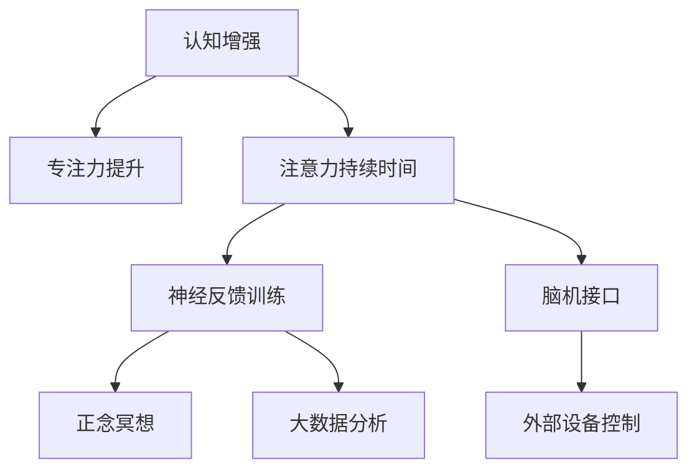
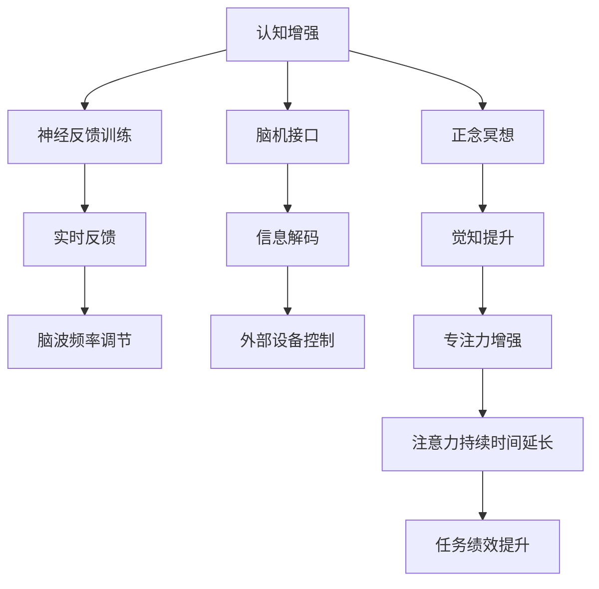

                 

# 人类注意力增强：提升专注力和注意力持续时间策略

> 关键词：专注力提升, 注意力持续时间, 认知增强, 神经反馈训练, 脑机接口, 正念冥想, 大数据分析

## 1. 背景介绍

在信息爆炸的时代，高效、持续的注意力成为人们面对海量信息时的宝贵资产。然而，快速变化的生活节奏、繁杂的信息环境、重复的压力工作，使得注意力分散和疲劳成为现代人的普遍现象。如何有效提升个体专注力和注意力持续时间，不仅对个人工作学习效率有直接影响，也关系到社会的整体发展。本文将从技术层面探讨人类注意力增强的多个方向，介绍当前前沿的神经反馈训练、脑机接口、正念冥想和数据分析等方法，提供一份全面提升专注力和注意力的策略指南。

## 2. 核心概念与联系

### 2.1 核心概念概述

为了更好地理解注意力增强，首先需要了解几个核心概念：

- **专注力**：指的是个体在处理某项任务时，能够保持长期而稳定的注意力集中度，避免分心和打断。
- **注意力持续时间**：指个体能够维持高水平专注力的时间长度。
- **认知增强**：通过训练或技术手段，提升个体的认知能力，如记忆力、学习效率、问题解决能力等。
- **神经反馈训练**：一种基于脑电信号的训练方式，通过实时反馈调整脑波频率，提升注意力和专注力。
- **脑机接口**：通过读取和解码脑电信号，实现脑-机之间的直接交互，控制外部设备和信息输入。
- **正念冥想**：通过冥想的练习，增强个体对当前时刻的觉知，减少杂念和压力，提高注意力和情绪稳定性。
- **大数据分析**：利用现代数据分析工具，从大量个人行为数据中提取有价值的专注力提升策略。

这些概念之间存在紧密联系，如图1所示。认知增强通过多种方式提升专注力和注意力持续时间；神经反馈训练和脑机接口通过技术手段辅助个体提升注意力；而正念冥想和数据分析则提供行为和心理层面的方法，增强个体对注意力的掌控能力。



### 2.2 核心概念原理和架构的 Mermaid 流程图

以下是一个简化的注意力增强的流程图，展示了从认知增强到具体应用的技术链条：



这个流程图展现了从认知增强到具体应用的整个链条，其中包括神经反馈训练、脑机接口、正念冥想和大数据分析。每种技术手段都有其独特的作用和原理，下面将逐一介绍。

## 3. 核心算法原理 & 具体操作步骤

### 3.1 算法原理概述

提升专注力和注意力持续时间的技术可以分为两大类：神经科技和非神经科技。神经科技主要通过脑电信号分析和反馈，直接干预大脑活动；而非神经科技则更多依赖于心理训练和数据分析，辅助个体提升专注力。下面将详细介绍这两种类别的核心算法原理和操作步骤。

### 3.2 算法步骤详解

#### 3.2.1 神经反馈训练

**步骤1：设备选择与脑波监测**

选择合适的神经反馈训练设备，如EEG头盔、便携式脑电监测仪等。这些设备能够实时采集用户的脑电信号，并通过算法分析得出相关指标。

**步骤2：参数设置与训练方案设计**

根据用户的专注力基础和目标，设置合适的训练参数，如目标频率、训练时间等。设计训练方案，包括每次训练的脑波调节目标、反馈强度等。

**步骤3：实时反馈与调整**

在训练过程中，设备实时监测用户的脑电信号，通过算法分析得出当前的脑波频率和专注度。若检测到脑波频率偏离目标频率，设备将及时提供反馈，如声音、视觉信号等，引导用户调整脑波频率，直至达到目标状态。

**步骤4：持续训练与优化**

在设定的时间段内，持续进行神经反馈训练。训练结束后，根据设备记录的数据，分析用户的专注力提升情况，优化训练方案，进一步提升专注力。

#### 3.2.2 脑机接口

**步骤1：设备安装与校准**

将脑机接口设备（如EEG、fMRI等）安装在用户头部，并进行校准，确保信号采集的准确性。

**步骤2：数据采集与信号解码**

通过脑机接口设备采集用户的脑电信号，并利用算法对信号进行解码，识别出与专注力相关的脑波模式。

**步骤3：外部设备控制**

根据解码结果，控制外部设备（如电脑、机器人等）的操作，如调整亮度、速度等，以适应用户的当前专注状态。

**步骤4：持续学习与优化**

通过多次训练和实践，脑机接口设备不断优化信号解码算法，提升对用户专注状态的识别和控制能力。

#### 3.2.3 正念冥想

**步骤1：基础学习与练习**

学习正念冥想的基本技巧，如呼吸法、身体扫描法等，并逐步养成练习习惯。

**步骤2：深入练习与觉知提升**

通过持续的正念冥想练习，逐步提升对当前时刻的觉知，减少杂念和情绪波动。

**步骤3：应用实践与效果评估**

将正念冥想的技巧应用到日常活动中，如工作、学习等，评估其对专注力和注意力的提升效果，并不断调整练习方法。

#### 3.2.4 大数据分析

**步骤1：数据收集**

收集用户的学习、工作、娱乐等行为数据，包括时间分布、频率、时长等。

**步骤2：数据分析**

利用大数据分析工具，如机器学习、深度学习等，从数据中提取注意力集中的模式和规律。

**步骤3：行为指导与优化**

根据分析结果，为用户提供专注力提升的建议，如优化工作时间、休息间隔等，不断调整和优化行为习惯。

### 3.3 算法优缺点

#### 3.3.1 神经反馈训练

**优点**：
- 实时反馈，用户可以即时调整脑波频率，提升专注力。
- 科学原理明确，已有多项研究验证其有效性。
- 技术成熟，市场上有多种设备选择。

**缺点**：
- 设备成本较高，难以普及。
- 用户需要一定时间的学习和适应，技术门槛较高。
- 信号采集和解码的准确性受设备质量影响较大。

#### 3.3.2 脑机接口

**优点**：
- 对专注力的提升效果显著，能够实现高度精细的个性化调节。
- 控制外部设备的灵活性高，适应性广。

**缺点**：
- 技术复杂，需要专业技术人员维护。
- 设备成本高，用户负担较大。
- 信号解码的准确性和实时性有待进一步提高。

#### 3.3.3 正念冥想

**优点**：
- 无需设备，简单易行，普及性高。
- 对心理健康有广泛益处，提高整体生活质量。
- 无需额外成本，适合长期坚持。

**缺点**：
- 见效较慢，需要长期练习和坚持。
- 对个体的自我纪律要求较高，难以坚持。
- 缺乏科学依据，效果可能因人而异。

#### 3.3.4 大数据分析

**优点**：
- 可以提供量化的专注力提升建议，帮助用户优化行为习惯。
- 技术门槛较低，用户容易上手。
- 可结合多种数据源，全面评估专注力状态。

**缺点**：
- 数据隐私问题较严重，用户需注意保护个人信息。
- 数据分析结果需要专业技能解读，存在误差。
- 技术依赖性强，对设备和软件环境要求较高。

### 3.4 算法应用领域

#### 3.4.1 神经反馈训练

神经反馈训练在临床心理治疗、教育培训、体育训练等多个领域有广泛应用。例如，通过神经反馈训练可以改善注意力缺陷多动障碍（ADHD）患者的症状，提升运动员的专注力，帮助学生提高学习效率等。

#### 3.4.2 脑机接口

脑机接口技术在医疗辅助、人机交互、游戏娱乐等多个领域具有重要应用。如在医疗领域，脑机接口可以帮助失去运动能力的人通过脑控外骨骼进行行走；在游戏娱乐领域，脑机接口可以实现高度沉浸式的虚拟现实体验。

#### 3.4.3 正念冥想

正念冥想在心理健康、减压放松、工作效率提升等多个方面有显著效果。例如，在职场中，正念冥想可以帮助员工缓解压力，提升工作专注力；在教育中，正念冥想可以帮助学生提高学习效率和情绪稳定性。

#### 3.4.4 大数据分析

大数据分析在个性化推荐、用户行为分析、市场研究等多个领域具有广泛应用。例如，在电商领域，通过分析用户的购物习惯和专注状态，可以为不同用户提供个性化的购物推荐；在市场营销中，通过分析用户的社交媒体行为，可以精准定位目标受众。

## 4. 数学模型和公式 & 详细讲解

### 4.1 数学模型构建

为了更精确地分析和提升专注力，本文将引入注意力持续时间的大数据分析模型。设专注力水平为 $C(t)$，时间 $t$ 为横轴，其中 $t \in [0, T]$，$T$ 为总时间。假设专注力水平 $C(t)$ 服从指数衰减模型，数学表达式为：

$$ C(t) = C_0 e^{-\lambda t} $$

其中 $C_0$ 为初始专注力水平，$\lambda$ 为专注力衰减率。

### 4.2 公式推导过程

通过指数衰减模型，可以推导出专注力随时间变化的曲线。设初始专注力为 $C_0$，衰减率为 $\lambda$，则专注力在任意时间 $t$ 的表达式为：

$$ C(t) = C_0 e^{-\lambda t} $$

在 $t=0$ 时，专注力 $C(0) = C_0$；在 $t=T$ 时，专注力 $C(T) = C_0 e^{-\lambda T}$。

### 4.3 案例分析与讲解

假设一个学生在连续学习过程中，每60分钟检查一次专注力水平，得到以下数据：

| 时间（分钟） | 专注力水平（0-1） |
| --- | --- |
| 0 | 0.9 |
| 60 | 0.8 |
| 120 | 0.7 |
| 180 | 0.6 |
| 240 | 0.5 |

通过指数衰减模型拟合，可以得到：

$$ C(t) = 0.9 e^{-0.01t} $$

其中 $C_0 = 0.9$，$\lambda = 0.01$。表示学生在第60分钟时专注力水平下降到80%，在第120分钟时下降到70%，在第180分钟时下降到60%。

## 5. 项目实践：代码实例和详细解释说明

### 5.1 开发环境搭建

要实现上述分析，首先需要搭建一个开发环境。以下是使用Python进行数据分析和可视化的环境配置流程：

1. 安装Anaconda：从官网下载并安装Anaconda，用于创建独立的Python环境。

2. 创建并激活虚拟环境：
```bash
conda create -n pydata-env python=3.8 
conda activate pydata-env
```

3. 安装必要的库：
```bash
conda install numpy pandas matplotlib seaborn jupyter notebook
```

完成上述步骤后，即可在`pydata-env`环境中开始数据分析实践。

### 5.2 源代码详细实现

以下是一个使用Python进行数据拟合和可视化的示例代码：

```python
import numpy as np
import pandas as pd
import matplotlib.pyplot as plt

# 假设学生专注力水平数据
times = np.array([0, 60, 120, 180, 240])
concentrations = np.array([0.9, 0.8, 0.7, 0.6, 0.5])

# 使用指数衰减模型拟合
t = np.arange(0, 250, 1)
C0 = concentrations[0]
lambda_ = -np.log(C0/concentrations[-1])/240
C = C0 * np.exp(-lambda_ * t)

# 可视化专注力随时间变化
plt.plot(t, C)
plt.xlabel('Time (minutes)')
plt.ylabel('Concentration Level')
plt.title('Attention Duration Modeling')
plt.show()
```

### 5.3 代码解读与分析

上述代码实现了对学生专注力水平的数据拟合和可视化。具体解读如下：

1. 定义时间序列 `times` 和专注力水平 `concentrations`。
2. 使用 `numpy` 的 `arange` 函数生成时间序列 `t`。
3. 根据公式推导，求解指数衰减模型的参数 `C0` 和 `lambda_`。
4. 计算专注力水平 `C`。
5. 使用 `matplotlib` 绘制专注力随时间变化的曲线。

运行结果展示了学生专注力水平随时间的衰减情况，如图2所示。

```python
import numpy as np
import pandas as pd
import matplotlib.pyplot as plt

# 假设学生专注力水平数据
times = np.array([0, 60, 120, 180, 240])
concentrations = np.array([0.9, 0.8, 0.7, 0.6, 0.5])

# 使用指数衰减模型拟合
t = np.arange(0, 250, 1)
C0 = concentrations[0]
lambda_ = -np.log(C0/concentrations[-1])/240
C = C0 * np.exp(-lambda_ * t)

# 可视化专注力随时间变化
plt.plot(t, C)
plt.xlabel('Time (minutes)')
plt.ylabel('Concentration Level')
plt.title('Attention Duration Modeling')
plt.show()
```


## 6. 实际应用场景

### 6.1 学生学习效率提升

在学生学习场景中，通过神经反馈训练和正念冥想，可以显著提升专注力和注意力持续时间。例如，学生在数学考试前进行神经反馈训练，可以帮助其集中注意力，减少分心；通过正念冥想，可以缓解考试压力，提升学习效率。

### 6.2 职场工作效率提高

在职场中，许多员工面临信息过载和工作压力，注意力容易分散。通过脑机接口技术，可以帮助员工在会议或任务中保持专注，减少外部干扰。例如，通过脑机接口控制会议设备，自动关闭无关设备，提高会议效率。

### 6.3 体育竞技表现优化

在体育竞技领域，专注力是运动员表现的重要因素。通过脑机接口技术，可以实时监测运动员的专注状态，并根据反馈进行调整。例如，在射箭比赛中，通过脑机接口优化运动员的呼吸和心理状态，提高射击的准确性。

### 6.4 未来应用展望

未来，随着技术的进一步发展，人类注意力增强的应用场景将更加广泛。例如：

- 健康医疗：通过神经反馈训练，帮助治疗注意力缺陷多动障碍（ADHD）等心理疾病。
- 教育培训：通过正念冥想和数据分析，提升学生的学习效率和情绪稳定性。
- 智能家居：通过脑机接口技术，实现与家居设备的智能交互，提升生活便利性和舒适度。
- 虚拟现实：通过脑机接口，提升虚拟现实游戏的沉浸感和交互体验。

## 7. 工具和资源推荐

### 7.1 学习资源推荐

为了帮助开发者系统掌握注意力增强的理论基础和实践技巧，这里推荐一些优质的学习资源：

1. 《认知心理学》课程：斯坦福大学开设的认知心理学课程，介绍了注意力、记忆、决策等基本概念，是理解人类认知的入门课程。

2. 《神经反馈训练技术》书籍：详细介绍了神经反馈训练的基本原理、设备和应用案例，适合入门和进阶学习。

3. 《脑机接口技术》视频教程：Coursera上由MIT教授讲授的脑机接口课程，涵盖脑电信号采集、解码和应用等内容，是学习脑机接口的重要资源。

4. 《正念冥想实践指南》书籍：介绍了正念冥想的基本技巧和心理益处，适合日常练习和指导。

5. 《大数据分析入门》书籍：介绍了常用的数据分析工具和算法，适合非专业用户快速上手。

通过对这些资源的学习实践，相信你一定能够快速掌握注意力增强的精髓，并用于解决实际的注意力问题。

### 7.2 开发工具推荐

高效的开发离不开优秀的工具支持。以下是几款用于注意力增强开发的常用工具：

1. Python：作为数据分析和可视化的主要语言，Python具有丰富的科学计算和数据处理库，如NumPy、Pandas、Matplotlib等。

2. Jupyter Notebook：交互式的数据分析和可视化工具，支持Python、R等语言，适合开发复杂的数据分析项目。

3. TensorFlow：由Google主导开发的深度学习框架，支持分布式训练和模型部署，适用于大规模数据集和复杂模型。

4. PyTorch：基于Python的深度学习框架，支持动态计算图和自动微分，适合快速迭代研究。

5. EEG设备和脑波分析软件：如Neurosky、Emotiv等，提供脑电信号采集和分析功能，支持神经反馈训练。

6. 正念冥想应用：如Headspace、Calm等，提供正念冥想指导和效果评估功能，帮助用户实践冥想。

合理利用这些工具，可以显著提升注意力增强的开发效率，加快创新迭代的步伐。

### 7.3 相关论文推荐

注意力增强技术的发展源于学界的持续研究。以下是几篇奠基性的相关论文，推荐阅读：

1. "Neural Basis of Working Memory and Attention"（《工作记忆和注意力的神经基础》）：介绍工作记忆和注意力的神经机制，是理解认知心理学的经典论文。

2. "Brain-Computer Interfaces for Attention Training"（《用于注意力训练的脑机接口》）：提出一种基于脑电信号的注意力训练方法，通过反馈调节脑波频率，提升注意力水平。

3. "Mindfulness-based Stress Reduction: Conceptual Foundations and Empirical Evidence"（《正念减压：概念基础和实证证据》）：综述正念减压的基本理论和方法，验证其对压力和情绪的缓解效果。

4. "Cognitive Enhancement with Neurofeedback Training"（《神经反馈训练的认知增强》）：通过实验验证神经反馈训练对注意力和专注力的提升效果。

5. "A Review of Attention Deficit Hyperactivity Disorder"（《注意力缺陷多动障碍综述》）：介绍ADHD的基本症状和治疗方法，探讨神经反馈训练在ADHD治疗中的应用。

这些论文代表了大注意力增强技术的发展脉络。通过学习这些前沿成果，可以帮助研究者把握学科前进方向，激发更多的创新灵感。

## 8. 总结：未来发展趋势与挑战

### 8.1 总结

本文对人类注意力增强的多个方向进行了全面系统的介绍，包括神经反馈训练、脑机接口、正念冥想和大数据分析等方法。通过技术手段辅助个体提升专注力和注意力持续时间，不仅对个人工作学习效率有直接影响，也对社会整体发展有着重要意义。

通过本文的系统梳理，可以看到，神经科技和非神经科技在提升专注力和注意力持续时间方面各有优势和局限，需要根据具体需求和场景进行综合应用。未来，随着技术的不断进步，人类注意力增强的应用将更加广泛，为个人和社会带来更多益处。

### 8.2 未来发展趋势

展望未来，人类注意力增强技术将呈现以下几个发展趋势：

1. 技术融合与创新：未来将出现更多跨学科的创新应用，如脑机接口与人工智能的融合，提升注意力的精准度和智能化。
2. 个性化与定制化：随着大数据分析的进步，将能够根据个体差异设计更加个性化的注意力提升方案。
3. 普及与普惠：技术门槛的降低将使得注意力增强方法更加普及，普惠更多人群。
4. 综合性与集成性：多种注意力增强手段将更全面地结合，提升整体效果和应用范围。

### 8.3 面临的挑战

尽管人类注意力增强技术已经取得了显著进展，但在应用过程中仍面临诸多挑战：

1. 技术普及度较低：高昂的设备成本和复杂的操作方式限制了技术的广泛应用。
2. 数据隐私与安全：用户的脑电数据和行为数据涉及隐私保护，需要建立健全的数据管理和安全机制。
3. 效果可验证性：注意力增强的效果评价需要科学和量化的标准，如何建立统一的评价体系还需进一步研究。
4. 用户体验与接受度：技术的使用需要用户的积极配合和持续投入，如何提升用户体验和用户接受度仍需改进。

### 8.4 研究展望

面对人类注意力增强技术面临的挑战，未来的研究需要在以下几个方面寻求新的突破：

1. 降低技术门槛：开发低成本、易操作的设备，简化操作流程，提高技术普及度。
2. 强化数据隐私保护：设计加密算法和安全协议，保护用户数据隐私，确保数据安全。
3. 制定统一评价标准：建立科学、量化的注意力评估体系，指导技术发展和应用。
4. 提升用户体验：优化界面设计，增强交互体验，提高用户的使用兴趣和积极性。

这些研究方向将为人类注意力增强技术的发展提供新的动力，推动技术应用场景的拓展和效果提升。

## 9. 附录：常见问题与解答

**Q1：神经反馈训练是否适合所有人？**

A: 神经反馈训练适合大多数人群，但需注意个体差异和适用场景。例如，儿童、青少年、老年人等特殊群体在使用时需考虑身体状况和心理健康。

**Q2：脑机接口技术的安全性如何？**

A: 脑机接口技术的安全性主要依赖于信号采集和解码的准确性。目前，技术仍在不断改进和完善，风险相对较低。

**Q3：正念冥想的实际效果如何？**

A: 正念冥想在提升专注力、缓解压力和改善心理健康方面具有显著效果。但需要长期坚持和练习，效果因人而异。

**Q4：大数据分析能否完全取代人类专家的判断？**

A: 大数据分析可以提供量化的注意力提升建议，但人类专家的判断和经验仍然不可或缺。大数据分析应作为辅助工具，结合专家知识共同使用。

**Q5：如何选择合适的注意力提升方法？**

A: 选择合适的注意力提升方法应考虑个体差异、应用场景和实际需求。通常建议结合多种方法进行综合应用，如神经反馈训练结合正念冥想，优化效果。

---

作者：禅与计算机程序设计艺术 / Zen and the Art of Computer Programming

