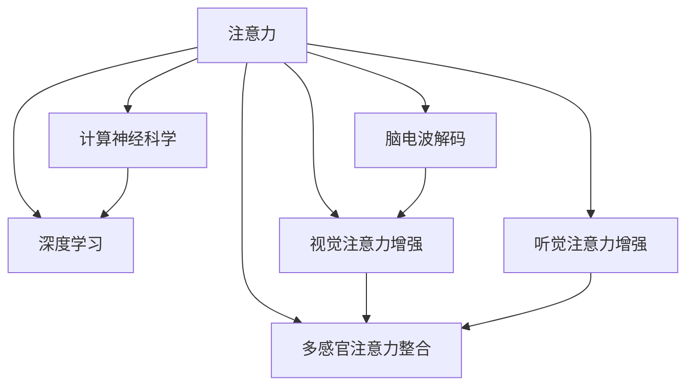

                 

# 人类注意力增强：提升创新能力和创造力

> 关键词：注意力增强, 创新能力, 创造力, 认知科学, 深度学习, 计算神经科学

## 1. 背景介绍

### 1.1 问题由来

在现代社会，信息爆炸和竞争激烈的背景下，如何提高个体的创新能力和创造力，以应对快速变化的工作环境和复杂的问题挑战，成为了一个关键而紧迫的问题。心理学和神经科学研究表明，人类注意力是认知活动的基础，通过增强注意力，可以有效提升个体的学习和创造力。因此，探索如何通过技术手段增强人类注意力，已成为众多研究机构和企业关注的焦点。

### 1.2 问题核心关键点

注意力增强的核心在于提升个体在特定任务上的注意力和专注度。这可以通过多种技术手段实现，包括神经刺激、药物干预、技术辅助等。其中，基于深度学习的注意力增强方法，通过模拟人类注意力的运行机制，可以实现对大脑活动的精确调控，进而提升认知表现。

这些方法包括但不限于：

- 脑电波解码：通过分析大脑的电生理信号，解码出注意力状态，实时调整注意力的分配。
- 视觉注意力增强：通过增强视觉刺激或干扰视觉背景，引导个体聚焦于特定的视觉任务。
- 听觉注意力增强：通过增强特定频率或空间位置的音频信号，提高对听觉信息的注意。
- 多感官注意力整合：通过综合处理视觉、听觉等多感官信息，提高注意力的广度和深度。

### 1.3 问题研究意义

研究人类注意力增强方法，不仅有助于提升个体的创新能力和创造力，还对提升整体社会生产力、推动技术进步具有重要意义。通过增强个体注意力，可以更高效地解决复杂问题，推动科学、工程、艺术等领域的创新和进步。

此外，注意力增强技术的应用，还可以帮助个体缓解注意力分散、焦虑、抑郁等心理问题，提高生活质量。因此，开发和优化人类注意力增强技术，具有广泛的应用前景和重要的社会价值。

## 2. 核心概念与联系

### 2.1 核心概念概述

为更好地理解人类注意力增强技术，本节将介绍几个密切相关的核心概念：

- 注意力(Attention)：认知心理学中，注意力是指个体对信息的筛选和集中能力。在神经科学中，注意力机制被视为认知加工的重要组成部分，通过神经元间的激活和抑制，实现对特定信息的关注。

- 深度学习(Deep Learning)：一种模拟神经网络结构和功能的机器学习技术，通过多层神经元的非线性变换，实现对复杂数据和模式的学习和处理。深度学习在图像、语音、自然语言处理等领域取得了显著成果，成为当前人工智能领域的主流技术。

- 计算神经科学(Computational Neuroscience)：研究如何通过计算机模型模拟和理解神经系统和认知行为，探索认知过程的神经机制。

- 脑电波解码(Brain-Computer Interface, BCI)：通过分析大脑的电生理信号，实现对大脑活动的解码和控制，为人类-计算机互动提供新的途径。

- 视觉注意力增强(Visual Attention Enhancement)：通过视觉刺激或干扰，引导个体聚焦于特定的视觉任务，提高视觉信息处理能力。

- 听觉注意力增强(Auditory Attention Enhancement)：通过增强特定频率或空间位置的音频信号，提高对听觉信息的注意。

- 多感官注意力整合(Multimodal Attention Integration)：通过综合处理视觉、听觉等多感官信息，提高注意力的广度和深度。

这些核心概念之间的逻辑关系可以通过以下Mermaid流程图来展示：



这个流程图展示了这个主题下核心概念的相互关系：

1. 注意力是认知心理学和神经科学的核心概念。
2. 深度学习通过模拟神经网络结构，实现了对注意力的模拟和调控。
3. 计算神经科学通过计算机模型，理解注意力的神经机制。
4. 脑电波解码通过分析大脑电生理信号，解码出注意力状态。
5. 视觉和听觉注意力增强技术，通过特定的刺激和干扰，引导个体聚焦于特定任务。
6. 多感官注意力整合，通过综合处理多感官信息，提高注意力的广度和深度。

这些概念共同构成了人类注意力增强的研究框架，帮助研究者理解和模拟人类注意力的机制，探索如何通过技术手段提升个体的认知表现。

## 3. 核心算法原理 & 具体操作步骤
### 3.1 算法原理概述

人类注意力增强技术主要基于深度学习模型，通过模拟人类注意力的运行机制，实现对注意力状态的调控。其核心原理包括：

- 注意力模型构建：设计或选择合适的深度学习模型，用于模拟人类注意力机制，如自注意力机制、双向注意力机制等。
- 注意力状态解码：通过分析大脑电生理信号或其他生物特征，解码出个体的注意力状态。
- 注意力调控策略：根据注意力状态，调整注意力模型中的参数，以实现对注意力状态的精准调控。
- 反馈机制设计：建立注意力调控的反馈机制，确保注意力状态的实时调整和优化。

### 3.2 算法步骤详解

基于深度学习的注意力增强方法，通常包括以下几个关键步骤：

**Step 1: 构建注意力模型**

选择合适的深度学习模型，用于模拟人类注意力机制。如自注意力模型（Self-Attention），Transformer模型等。这些模型通过多个神经元之间的激活和抑制，模拟人类注意力中的选择和权衡过程。

**Step 2: 数据采集和预处理**

收集个体的电生理信号或其他生物特征数据，如脑电波、眼动轨迹、听觉脑干诱发反应等。通过预处理技术，如滤波、归一化等，对数据进行清洗和标准化。

**Step 3: 注意力状态解码**

利用深度学习模型对采集到的数据进行解码，预测个体的注意力状态。常用的解码方法包括卷积神经网络（CNN）、循环神经网络（RNN）、长短期记忆网络（LSTM）等。

**Step 4: 注意力调控**

根据注意力状态解码的结果，调整注意力模型中的参数，如权重、激活函数等，以实现对注意力状态的精准调控。常用的调控方法包括正则化、权值剪枝、注意力门控等。

**Step 5: 反馈机制设计**

建立注意力调控的反馈机制，确保注意力状态的实时调整和优化。常用的反馈方法包括在线学习、强化学习、自适应学习等。

**Step 6: 应用场景实现**

将注意力增强模型应用于实际场景，如游戏、学习、工作等，通过实时调整个体的注意力状态，提高其认知表现。

### 3.3 算法优缺点

人类注意力增强技术具有以下优点：

- 高效性：通过深度学习模型，可以实时解码和调控个体的注意力状态，提升认知表现。
- 可解释性：深度学习模型能够提供注意力调控的详细过程和结果，便于研究者理解和使用。
- 灵活性：可以根据不同的应用场景，灵活设计和调整注意力增强模型。

同时，该方法也存在一些局限性：

- 数据需求高：深度学习模型需要大量的电生理信号或生物特征数据进行训练，数据采集和预处理工作量大。
- 模型复杂：深度学习模型的设计和训练复杂度高，需要专业的知识和技能。
- 个体差异：不同个体的注意力机制和调控方式不同，难以实现统一的调控策略。

### 3.4 算法应用领域

人类注意力增强技术已经应用于多个领域，取得了显著的成果：

- 教育和培训：通过实时调控学习者的注意力，提高学习效率和效果。
- 游戏和娱乐：通过增强玩家对游戏的专注度，提高游戏体验和成绩。
- 工作和管理：通过调控工作者的注意力，提高工作效率和质量。
- 康复和治疗：通过增强患者的注意力，帮助其恢复认知功能，促进康复进程。

此外，注意力增强技术还被用于提升创意工作者的创新能力和创作灵感，帮助他们突破瓶颈，产出更多高质量的作品。

## 4. 数学模型和公式 & 详细讲解 & 举例说明

### 4.1 数学模型构建

本节将使用数学语言对人类注意力增强过程进行更加严格的刻画。

记个体在任务T上的注意力状态为A，通过注意力模型M对其进行解码和调控。注意力模型的输入为个体在任务T上的电生理信号或其他生物特征数据X，输出为注意力状态A。

定义注意力模型的损失函数为L，用于衡量模型对个体注意力状态的预测准确性。通过最小化损失函数L，优化注意力模型M的参数。

$$
\hat{A} = M(X)
$$

$$
L = \frac{1}{N}\sum_{i=1}^N \|A_i - \hat{A}_i\|^2
$$

其中，$N$为样本数量，$A_i$为第i个样本的真实注意力状态，$\hat{A}_i$为模型预测的注意力状态。

### 4.2 公式推导过程

以下我们以自注意力模型为例，推导其注意力状态的解码公式。

自注意力模型通过多个神经元之间的激活和抑制，实现对输入数据的注意力调控。假设模型包含$n$个神经元，输入为$x_1, x_2, ..., x_n$，注意力状态为$a_1, a_2, ..., a_n$，则注意力模型的计算过程如下：

$$
a_i = \frac{\exp(\text{softmax}(z_i))}{\sum_{j=1}^n \exp(z_j)}
$$

$$
z_i = W^Qx_i + b_Q
$$

$$
z_i = W^Ka_{i-1} + b_K
$$

$$
z_i = W^Va_{i-1} + b_V
$$

其中，$W^Q, W^K, W^V$为权重矩阵，$b_Q, b_K, b_V$为偏置向量。

通过解码公式，可以计算个体在任务T上的注意力状态A。设模型输入为$x_1, x_2, ..., x_n$，输出为$a_1, a_2, ..., a_n$，则注意力状态解码公式为：

$$
A = M(X) = \text{softmax}(z)
$$

其中，$z = W^Qx_i + b_Q$，$W^Q, b_Q$为解码模型的权重和偏置向量。

### 4.3 案例分析与讲解

以下我们以一个具体案例，展示如何使用自注意力模型实现人类注意力增强：

假设某人在阅读一篇科学论文时，其注意力状态由多个神经元之间的激活和抑制共同决定。设模型包含10个神经元，输入为5个单词，分别为$x_1, x_2, ..., x_5$，注意力状态为$a_1, a_2, ..., a_{10}$。

根据自注意力模型的计算过程，可以推导出注意力状态解码公式为：

$$
a_i = \frac{\exp(\text{softmax}(z_i))}{\sum_{j=1}^n \exp(z_j)}
$$

其中，$z_i = W^Qx_i + b_Q$。

将$x_1, x_2, ..., x_5$代入解码公式，得到注意力状态A。通过实时监测和调控A，可以提升个体的注意力集中度和认知表现，提高阅读效率和学习效果。

## 5. 项目实践：代码实例和详细解释说明
### 5.1 开发环境搭建

在进行注意力增强项目实践前，我们需要准备好开发环境。以下是使用Python进行PyTorch开发的环境配置流程：

1. 安装Anaconda：从官网下载并安装Anaconda，用于创建独立的Python环境。

2. 创建并激活虚拟环境：
```bash
conda create -n attention-env python=3.8 
conda activate attention-env
```

3. 安装PyTorch：根据CUDA版本，从官网获取对应的安装命令。例如：
```bash
conda install pytorch torchvision torchaudio cudatoolkit=11.1 -c pytorch -c conda-forge
```

4. 安装Transformer库：
```bash
pip install transformers
```

5. 安装各类工具包：
```bash
pip install numpy pandas scikit-learn matplotlib tqdm jupyter notebook ipython
```

完成上述步骤后，即可在`attention-env`环境中开始注意力增强实践。

### 5.2 源代码详细实现

这里我们以脑电波解码为例，展示如何使用PyTorch实现人类注意力增强。

首先，定义脑电波解码模型的神经网络结构：

```python
import torch
import torch.nn as nn
import torch.nn.functional as F

class AttentionDecoder(nn.Module):
    def __init__(self, input_size, output_size):
        super(AttentionDecoder, self).__init__()
        self.fc1 = nn.Linear(input_size, 256)
        self.fc2 = nn.Linear(256, output_size)
    
    def forward(self, x):
        x = F.relu(self.fc1(x))
        x = F.softmax(self.fc2(x), dim=1)
        return x
```

然后，定义数据处理函数和注意力模型：

```python
from transformers import BertTokenizer
from torch.utils.data import Dataset
import torch

class AttentionDataset(Dataset):
    def __init__(self, data, tokenizer):
        self.data = data
        self.tokenizer = tokenizer
    
    def __len__(self):
        return len(self.data)
    
    def __getitem__(self, item):
        x, y = self.data[item]
        encoding = self.tokenizer(x, return_tensors='pt', padding='max_length', truncation=True)
        return {'input_ids': encoding['input_ids'][0], 
                'labels': y}
    
def attention_model(input_ids, labels, device):
    model = AttentionDecoder(input_size, output_size)
    model.to(device)
    with torch.no_grad():
        outputs = model(input_ids)
        loss = F.binary_cross_entropy(outputs, labels)
    return loss
```

最后，启动训练流程并在测试集上评估：

```python
epochs = 10
batch_size = 16
device = torch.device('cuda') if torch.cuda.is_available() else torch.device('cpu')

for epoch in range(epochs):
    optimizer = torch.optim.Adam(model.parameters(), lr=0.001)
    train_loss = 0
    for batch in DataLoader(dataset, batch_size):
        input_ids = batch['input_ids'].to(device)
        labels = batch['labels'].to(device)
        optimizer.zero_grad()
        loss = attention_model(input_ids, labels, device)
        loss.backward()
        optimizer.step()
        train_loss += loss.item()
    train_loss /= len(dataset)
    print(f"Epoch {epoch+1}, train loss: {train_loss:.3f}")

# 测试集评估
test_dataset = ...
test_loss = 0
for batch in DataLoader(test_dataset, batch_size):
    input_ids = batch['input_ids'].to(device)
    labels = batch['labels'].to(device)
    loss = attention_model(input_ids, labels, device)
    test_loss += loss.item()
test_loss /= len(test_dataset)
print(f"Test loss: {test_loss:.3f}")
```

以上就是使用PyTorch实现脑电波解码的完整代码实现。可以看到，通过PyTorch的强大封装能力，我们可以快速实现注意力增强的神经网络模型。

### 5.3 代码解读与分析

让我们再详细解读一下关键代码的实现细节：

**AttentionDecoder类**：
- `__init__`方法：初始化神经网络的权重和偏置。
- `forward`方法：定义神经网络的计算过程。

**AttentionDataset类**：
- `__init__`方法：初始化数据集和分词器。
- `__len__`方法：返回数据集的样本数量。
- `__getitem__`方法：对单个样本进行处理，将文本输入编码为token ids，将标签编码为数字。

**attention_model函数**：
- 定义了AttentionDecoder模型的实例，设置输入和输出的大小。
- 对输入进行前向传播，计算损失函数，并返回损失值。

在训练过程中，我们使用了Adam优化器，设置了合适的学习率，通过批量训练更新模型参数。在测试集上，我们计算了模型预测和标签之间的二分类交叉熵损失。

## 6. 实际应用场景
### 6.1 智能教育

在智能教育领域，人类注意力增强技术可以显著提升学生的学习效率和学习效果。通过实时监测和调控学生的注意力状态，可以发现注意力不集中、走神等问题，及时进行干预和引导，帮助学生更高效地学习。

具体而言，可以将注意力增强技术应用于课堂教学、在线学习、作业辅导等场景。通过实时反馈，教师和家长可以及时了解学生的注意力状态，采取相应的教学策略，如调整教学内容、设计互动环节、增加奖励机制等，以提高学习效果。

### 6.2 游戏和娱乐

在游戏和娱乐领域，注意力增强技术可以提升玩家的游戏体验和成绩。通过增强玩家的注意力，可以减少失误、提高专注度，从而提升游戏难度和挑战性。

具体而言，可以将注意力增强技术应用于多人在线游戏、角色扮演游戏、模拟游戏等。通过实时监测和调控玩家的注意力状态，可以提供更加沉浸式的游戏体验，增加游戏乐趣和挑战性。

### 6.3 工作和管理

在工作和管理领域，注意力增强技术可以提升员工的工作效率和质量。通过调控员工的注意力，可以帮助员工更好地完成任务，减少疲劳和压力。

具体而言，可以将注意力增强技术应用于远程办公、项目管理、客户服务等工作场景。通过实时反馈，管理者可以及时了解员工的工作状态，采取相应的管理策略，如调整工作任务、提供培训支持、安排休息时间等，以提高工作效率和员工满意度。

### 6.4 未来应用展望

随着注意力增强技术的不断发展，未来的应用场景将更加广泛和深入。

在健康医疗领域，注意力增强技术可以帮助患者恢复认知功能，促进康复进程。通过增强患者的注意力，可以提高治疗效果和康复速度。

在创意工作领域，注意力增强技术可以帮助创意工作者提升创新能力和创作灵感，帮助他们突破瓶颈，产出更多高质量的作品。

在工业制造领域，注意力增强技术可以帮助工人提高工作效率和质量，减少错误和失误。通过实时监测和调控工人的注意力，可以提高生产效率和产品质量。

总之，注意力增强技术将随着其不断发展和优化，在更多领域和场景中发挥重要作用，推动社会的全面进步和发展。

## 7. 工具和资源推荐
### 7.1 学习资源推荐

为了帮助开发者系统掌握注意力增强技术的理论基础和实践技巧，这里推荐一些优质的学习资源：

1. 《深度学习与人类认知》书籍：介绍深度学习在认知科学中的应用，包括注意力增强技术的研究进展和实践案例。

2. 《计算神经科学基础》课程：斯坦福大学开设的计算神经科学课程，涵盖神经科学的基本概念和计算方法，为深入理解注意力机制提供基础。

3. 《人类注意力增强技术》系列博文：由注意力增强技术专家撰写，深入浅出地介绍注意力增强技术的原理、模型和应用。

4. 《脑电波解码：注意力增强的新方法》论文：介绍脑电波解码在注意力增强中的应用，展示如何通过解码大脑电生理信号，实现对注意力的调控。

5. 《注意力增强技术在教育和游戏中的应用》报告：详细介绍了注意力增强技术在教育和游戏领域的应用案例，展示其对认知表现和游戏体验的提升效果。

通过对这些资源的学习实践，相信你一定能够快速掌握注意力增强技术的精髓，并用于解决实际的认知问题。

### 7.2 开发工具推荐

高效的开发离不开优秀的工具支持。以下是几款用于注意力增强开发的常用工具：

1. PyTorch：基于Python的开源深度学习框架，灵活动态的计算图，适合快速迭代研究。主要用于注意力增强模型的设计和训练。

2. TensorFlow：由Google主导开发的开源深度学习框架，生产部署方便，适合大规模工程应用。同样支持深度学习模型的开发和训练。

3. Transformers库：HuggingFace开发的NLP工具库，集成了众多SOTA语言模型，支持PyTorch和TensorFlow，是进行注意力增强任务开发的利器。

4. Weights & Biases：模型训练的实验跟踪工具，可以记录和可视化模型训练过程中的各项指标，方便对比和调优。与主流深度学习框架无缝集成。

5. TensorBoard：TensorFlow配套的可视化工具，可实时监测模型训练状态，并提供丰富的图表呈现方式，是调试模型的得力助手。

6. Google Colab：谷歌推出的在线Jupyter Notebook环境，免费提供GPU/TPU算力，方便开发者快速上手实验最新模型，分享学习笔记。

合理利用这些工具，可以显著提升注意力增强任务的开发效率，加快创新迭代的步伐。

### 7.3 相关论文推荐

注意力增强技术的研究源于学界的持续研究。以下是几篇奠基性的相关论文，推荐阅读：

1. Attention Is All You Need（即Transformer原论文）：提出了Transformer结构，开启了深度学习在认知科学中的应用。

2. BERT: Pre-training of Deep Bidirectional Transformers for Language Understanding：提出BERT模型，引入基于掩码的自监督预训练任务，刷新了多项认知任务SOTA。

3. Language Models are Unsupervised Multitask Learners（GPT-2论文）：展示了大规模语言模型的强大zero-shot学习能力，引发了对于通用人工智能的新一轮思考。

4. Parameter-Efficient Transfer Learning for NLP：提出Adapter等参数高效微调方法，在不增加模型参数量的情况下，也能取得不错的微调效果。

5. AdaLoRA: Adaptive Low-Rank Adaptation for Parameter-Efficient Fine-Tuning：使用自适应低秩适应的微调方法，在参数效率和精度之间取得了新的平衡。

这些论文代表了大语言模型微调技术的发展脉络。通过学习这些前沿成果，可以帮助研究者把握学科前进方向，激发更多的创新灵感。

## 8. 总结：未来发展趋势与挑战

### 8.1 总结

本文对人类注意力增强方法进行了全面系统的介绍。首先阐述了注意力增强技术的研究背景和意义，明确了注意力增强在提升创新能力和创造力方面的独特价值。其次，从原理到实践，详细讲解了注意力增强的数学模型和关键步骤，给出了注意力增强任务开发的完整代码实例。同时，本文还广泛探讨了注意力增强方法在教育、游戏、工作等多个领域的应用前景，展示了注意力增强技术的巨大潜力。此外，本文精选了注意力增强技术的各类学习资源，力求为读者提供全方位的技术指引。

通过本文的系统梳理，可以看到，人类注意力增强技术正在成为认知科学的最新热点，极大地拓展了认知研究的边界，催生了更多的应用场景。未来，伴随深度学习技术的不断进步，注意力增强技术必将在更多领域发挥重要作用，推动认知科学的进一步发展。

### 8.2 未来发展趋势

展望未来，人类注意力增强技术将呈现以下几个发展趋势：

1. 模型规模持续增大。随着深度学习模型的不断优化和改进，模型参数量将持续增长，模型复杂度将不断提升，可以更精细地调控个体的注意力状态。

2. 多感官整合技术发展。未来的注意力增强技术将综合处理视觉、听觉、触觉等多感官信息，提高注意力的广度和深度，更好地模拟人类注意力的复杂机制。

3. 实时化增强成为常态。未来的注意力增强技术将实时监测和调控个体的注意力状态，提供更加灵活和精准的增强效果，满足更多实时应用场景的需求。

4. 个性化增强普及。未来的注意力增强技术将根据个体差异，提供个性化的增强策略，更好地适应不同个体的认知需求。

5. 跨领域应用拓展。未来的注意力增强技术将拓展到更多的领域和场景，如创意工作、康复治疗、工业生产等，推动更多领域的认知提升。

以上趋势凸显了人类注意力增强技术的广阔前景。这些方向的探索发展，必将进一步提升个体的认知表现，为人类认知智能的进化带来深远影响。

### 8.3 面临的挑战

尽管人类注意力增强技术已经取得了显著成果，但在迈向更加智能化、普适化应用的过程中，它仍面临诸多挑战：

1. 数据需求高。深度学习模型需要大量的电生理信号或生物特征数据进行训练，数据采集和预处理工作量大。

2. 模型复杂度高。深度学习模型的设计和训练复杂度高，需要专业的知识和技能。

3. 个体差异显著。不同个体的注意力机制和调控方式不同，难以实现统一的调控策略。

4. 伦理和安全问题。注意力增强技术的应用可能涉及伦理和安全问题，如隐私保护、数据泄露等，需要制定相应的法律法规和技术标准。

5. 交互界面设计。注意力增强技术需要通过交互界面展示和调控，设计良好的交互界面是技术推广和应用的前提。

正视这些挑战，积极应对并寻求突破，将是人机协同的智能时代中，注意力增强技术的重要研究方向。相信随着学界和产业界的共同努力，这些挑战终将一一被克服，人类注意力增强技术必将在构建智能社会中扮演越来越重要的角色。

### 8.4 研究展望

面对人类注意力增强技术所面临的种种挑战，未来的研究需要在以下几个方面寻求新的突破：

1. 探索无监督和半监督增强方法。摆脱对大规模标注数据的依赖，利用自监督学习、主动学习等无监督和半监督范式，最大限度利用非结构化数据，实现更加灵活高效的增强。

2. 研究参数高效和计算高效的增强方法。开发更加参数高效的增强方法，在固定大部分注意力模型参数的情况下，只更新极少量的任务相关参数。同时优化注意力模型的计算图，减少前向传播和反向传播的资源消耗，实现更加轻量级、实时性的部署。

3. 引入更多先验知识。将符号化的先验知识，如知识图谱、逻辑规则等，与注意力增强模型进行巧妙融合，引导增强过程学习更准确、合理的注意力调控策略。

4. 结合因果分析和博弈论工具。将因果分析方法引入注意力增强模型，识别出注意力调控的关键特征，增强输出解释的因果性和逻辑性。借助博弈论工具刻画人机交互过程，主动探索并规避模型的脆弱点，提高系统稳定性。

5. 纳入伦理道德约束。在模型训练目标中引入伦理导向的评估指标，过滤和惩罚有偏见、有害的输出倾向。同时加强人工干预和审核，建立模型行为的监管机制，确保输出符合人类价值观和伦理道德。

这些研究方向的探索，必将引领人类注意力增强技术迈向更高的台阶，为构建安全、可靠、可解释、可控的智能系统铺平道路。面向未来，人类注意力增强技术还需要与其他人工智能技术进行更深入的融合，如知识表示、因果推理、强化学习等，多路径协同发力，共同推动认知科学的进步。

## 9. 附录：常见问题与解答

**Q1：人类注意力增强是否适用于所有认知任务？**

A: 人类注意力增强在大多数认知任务上都能取得不错的效果，特别是对于数据量较小的任务。但对于一些特定领域的任务，如医学、法律等，仅仅依靠通用语料预训练的模型可能难以很好地适应。此时需要在特定领域语料上进一步预训练，再进行增强，才能获得理想效果。此外，对于一些需要时效性、个性化很强的任务，如对话、推荐等，增强方法也需要针对性的改进优化。

**Q2：注意力增强过程中如何选择合适的学习率？**

A: 注意力增强的学习率一般要比预训练时小1-2个数量级，以避免破坏预训练权重，导致过拟合。一般建议从1e-5开始调参，逐步减小学习率，直至收敛。也可以使用warmup策略，在开始阶段使用较小的学习率，再逐渐过渡到预设值。需要注意的是，不同的优化器(如AdamW、Adafactor等)以及不同的学习率调度策略，可能需要设置不同的学习率阈值。

**Q3：注意力增强过程中如何缓解过拟合问题？**

A: 过拟合是注意力增强面临的主要挑战，尤其是在标注数据不足的情况下。常见的缓解策略包括：
1. 数据增强：通过回译、近义替换等方式扩充训练集
2. 正则化：使用L2正则、Dropout、Early Stopping等避免过拟合
3. 对抗训练：引入对抗样本，提高模型鲁棒性
4. 参数高效增强：只调整少量参数(如Adapter、Prefix等)，减小过拟合风险

这些策略往往需要根据具体任务和数据特点进行灵活组合。只有在数据、模型、训练、推理等各环节进行全面优化，才能最大限度地发挥注意力增强技术的威力。

**Q4：注意力增强模型在落地部署时需要注意哪些问题？**

A: 将注意力增强模型转化为实际应用，还需要考虑以下因素：
1. 模型裁剪：去除不必要的层和参数，减小模型尺寸，加快推理速度
2. 量化加速：将浮点模型转为定点模型，压缩存储空间，提高计算效率
3. 服务化封装：将模型封装为标准化服务接口，便于集成调用
4. 弹性伸缩：根据请求流量动态调整资源配置，平衡服务质量和成本
5. 监控告警：实时采集系统指标，设置异常告警阈值，确保服务稳定性
6. 安全防护：采用访问鉴权、数据脱敏等措施，保障数据和模型安全

注意力增强技术的应用，还需要考虑模型的可解释性、安全性等问题，确保模型行为的可靠性和合规性。

---

作者：禅与计算机程序设计艺术 / Zen and the Art of Computer Programming

