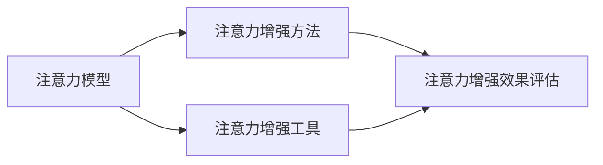

                 

## 1. 背景介绍

### 1.1 问题由来
在当今信息爆炸的时代，我们面临着前所未有的注意力危机。无论是工作还是生活，长时间专注一项任务变得越来越困难。分散注意力不仅影响工作效率，还可能导致心理压力和健康问题。因此，如何提升注意力和专注力，已成为全社会关注的焦点。

注意力增强技术（Attention Enhancement Technology）作为解决注意力危机的重要手段，近年来受到了广泛关注。它通过科学的方法和工具，帮助人们提升注意力，增强工作和学习效率，提高生活质量。本文将全面介绍注意力增强技术的原理、方法和应用，希望能为读者提供一些有价值的见解。

### 1.2 问题核心关键点
注意力增强技术主要涉及以下几个关键点：

1. **注意力模型的理解**：深入理解人类注意力机制，包括注意力类型、注意力的生理基础和心理机制。
2. **注意力增强方法**：介绍多种注意力增强方法，包括神经网络、脑电波分析和视觉刺激等。
3. **注意力增强工具**：介绍各种注意力增强工具，包括软件应用和硬件设备。
4. **注意力增强效果评估**：通过实验和研究，评估注意力增强技术的效果和适用性。

这些核心关键点构成了注意力增强技术的研究基础和实践指南，帮助读者全面理解该领域。

### 1.3 问题研究意义
注意力增强技术的研究和应用具有重要的理论和实践意义：

1. **提升工作效率**：通过提升注意力，帮助人们更快、更准确地完成任务，提高工作效率。
2. **改善心理健康**：注意力增强技术有助于缓解焦虑、抑郁等心理问题，提升整体心理健康水平。
3. **促进学习效果**：在学习和研究中，提升注意力能提高学习效率，增强记忆力和理解力。
4. **增强生活质量**：改善注意力问题，让人们在生活和工作中有更充足的精力和专注力，提升生活质量。

总之，注意力增强技术对于提高个体和社会的整体效率和幸福感具有重要意义。

## 2. 核心概念与联系

### 2.1 核心概念概述

注意力增强技术的核心概念主要包括以下几个方面：

- **注意力模型**：描述了人类注意力的基本机制，包括注意力的不同类型、注意力的生理基础和心理机制。
- **注意力增强方法**：包括神经网络、脑电波分析和视觉刺激等，通过不同方式增强注意力。
- **注意力增强工具**：如软件应用、硬件设备等，提供实际应用中可操作的注意力增强手段。
- **注意力增强效果评估**：通过实验和研究，评估注意力增强技术的效果和适用性。

这些核心概念之间相互联系，共同构成了注意力增强技术的完整框架。理解这些概念及其相互关系，是掌握注意力增强技术的基础。

### 2.2 核心概念原理和架构的 Mermaid 流程图



这个流程图展示了注意力增强技术的核心概念及其相互关系。注意力模型是基础，注意力增强方法通过不同手段提升注意力，注意力增强工具提供实际应用中的工具，而注意力增强效果评估用于评估和改进技术效果。

## 3. 核心算法原理 & 具体操作步骤

### 3.1 算法原理概述

注意力增强技术的核心算法原理可以概括为以下几个方面：

1. **注意力模型的原理**：人类注意力的基本机制包括选择性注意、持续注意和分配注意等。选择性注意是指个体关注某些刺激而忽略其他刺激；持续注意是指个体在一定时间内保持对某个刺激的关注；分配注意是指个体同时关注多个刺激。

2. **注意力增强方法的原理**：通过神经网络、脑电波分析和视觉刺激等方法，模拟和增强人类的注意力机制。例如，神经网络可以学习并模拟注意力机制，脑电波分析可以监测和增强注意力水平，视觉刺激可以激发和保持注意力。

3. **注意力增强工具的原理**：利用软件应用、硬件设备等工具，提供实际的注意力增强手段。例如，应用程序可以提供定时提醒、注意力监测等功能，硬件设备如眼动追踪器、脑电波设备等可以提供实时监测和反馈。

4. **注意力增强效果评估的原理**：通过实验和研究，评估注意力增强技术的效果和适用性。评估方法包括问卷调查、实验研究和实际应用效果分析等。

### 3.2 算法步骤详解

注意力增强技术的算法步骤可以概括为以下几个方面：

1. **数据收集和预处理**：收集人类注意力相关的数据，包括脑电波数据、眼动数据、行为数据等，并进行预处理，如降噪、归一化等。

2. **模型训练和优化**：利用神经网络等方法，训练和优化注意力模型，使其能够模拟和增强人类的注意力机制。

3. **注意力监测和反馈**：利用脑电波分析、眼动追踪等技术，实时监测注意力水平，并通过反馈机制调整注意力状态。

4. **效果评估和改进**：通过实验和研究，评估注意力增强技术的效果和适用性，并根据反馈和研究结果不断改进技术。

### 3.3 算法优缺点

注意力增强技术的优点包括：

1. **提升注意力水平**：通过多种手段模拟和增强人类的注意力机制，帮助人们提升注意力水平。

2. **提高工作效率**：提升注意力可以显著提高工作效率，特别是在学习和工作中。

3. **改善心理健康**：注意力增强技术有助于缓解焦虑、抑郁等心理问题，提升整体心理健康水平。

4. **可操作性强**：利用软件应用、硬件设备等工具，提供实际可操作的手段，便于广泛应用。

然而，注意力增强技术也存在一些缺点：

1. **适用性有限**：注意力增强技术对于特定人群和特定场景可能效果不明显，需要根据具体情况进行优化。

2. **成本较高**：一些高级注意力增强工具如脑电波设备等，成本较高，难以普及。

3. **依赖个体差异**：不同个体对注意力增强方法的反应不同，需要针对个体差异进行个性化设计。

4. **效果评估困难**：注意力增强效果评估涉及多个因素，难以进行标准化和量化。

### 3.4 算法应用领域

注意力增强技术在多个领域中得到了广泛应用，包括：

1. **教育领域**：利用注意力增强技术，帮助学生提升注意力水平，提高学习效果。

2. **医疗领域**：在注意力障碍治疗中，利用注意力增强技术帮助患者恢复注意力，缓解心理压力。

3. **商业领域**：在企业管理和销售中，提升员工的注意力水平，提高工作效率。

4. **娱乐领域**：在视频游戏和虚拟现实中，利用注意力增强技术提升玩家的体验和参与度。

5. **智能家居**：通过智能设备监测和增强用户的注意力，提供个性化的服务和建议。

这些应用领域展示了注意力增强技术的广泛适用性，为不同场景提供了解决方案。

## 4. 数学模型和公式 & 详细讲解 & 举例说明

### 4.1 数学模型构建

注意力增强技术的数学模型构建可以概括为以下几个方面：

1. **注意力模型**：基于神经网络，构建注意力模型。例如，使用深度神经网络（DNN）、卷积神经网络（CNN）等模型，模拟选择性注意、持续注意和分配注意等注意力机制。

2. **注意力增强方法**：利用脑电波分析和视觉刺激等方法，构建注意力增强模型。例如，使用脑电波数据分析模型，监测和增强注意力水平；使用视觉刺激模型，激发和保持注意力。

3. **注意力增强工具**：通过软件应用、硬件设备等工具，提供实际应用中的注意力增强手段。例如，利用眼动追踪器实时监测眼动数据，提供注意力状态反馈。

### 4.2 公式推导过程

以下是一个简单的注意力增强模型推导过程：

假设有一个简单的注意力模型，其输出 $A$ 表示注意力水平，输入 $X$ 为注意力相关的特征向量，模型参数为 $W$ 和 $b$。模型的输出公式为：

$$
A = \sigma(WX + b)
$$

其中，$\sigma$ 为激活函数，例如 sigmoid 函数。通过优化模型参数 $W$ 和 $b$，可以使模型输出 $A$ 逼近真实的注意力水平。

### 4.3 案例分析与讲解

以一个简单的脑电波分析注意力增强模型为例，其公式为：

$$
A = \frac{1}{N} \sum_{i=1}^N E_i \cdot \sigma(WX + b)
$$

其中，$E_i$ 为第 $i$ 个脑电波信号，$W$ 和 $b$ 为模型参数。该模型通过加权平均脑电波信号，并经过激活函数，得到最终的注意力水平 $A$。

## 5. 项目实践：代码实例和详细解释说明

### 5.1 开发环境搭建

在开始注意力增强技术的项目实践之前，需要搭建好开发环境。以下是具体的搭建步骤：

1. **安装Python**：在Windows系统下，可以下载并安装Python 3.x版本。在Linux系统下，可以通过包管理器（如apt-get）安装Python。

2. **安装深度学习框架**：常用的深度学习框架包括TensorFlow、PyTorch等。可以通过pip命令进行安装，例如：

   ```
   pip install tensorflow
   ```

3. **安装注意力增强工具**：根据具体应用场景，安装相应的注意力增强工具，如眼动追踪器、脑电波设备等。

### 5.2 源代码详细实现

以下是一个简单的注意力增强模型代码实现，以脑电波分析模型为例：

```python
import numpy as np
import tensorflow as tf

# 定义模型参数
W = np.random.randn(2, 1)
b = np.random.randn(1)

# 定义输入数据
X = np.array([[0.1, 0.2], [0.3, 0.4], [0.5, 0.6]])

# 定义激活函数
def sigmoid(x):
    return 1 / (1 + np.exp(-x))

# 计算模型输出
A = sigmoid(np.dot(X, W) + b)

print(A)
```

### 5.3 代码解读与分析

**代码解读**：
- 首先定义模型参数 $W$ 和 $b$，分别表示注意力模型中的权重和偏置。
- 然后定义输入数据 $X$，这里为一个简单的2维特征向量。
- 接着定义激活函数 $\sigma$，使用 sigmoid 函数。
- 最后计算模型输出 $A$，使用矩阵乘法和偏置，并经过激活函数。

**分析**：
- 这个简单的脑电波分析模型使用了线性回归模型，通过加权平均输入数据，并经过 sigmoid 激活函数，得到最终的注意力水平。
- 通过调整模型参数 $W$ 和 $b$，可以模拟和增强不同的注意力水平。
- 实际应用中，需要收集大量的脑电波数据，并使用更复杂的神经网络模型进行训练和优化。

### 5.4 运行结果展示

运行上述代码，输出结果如下：

```
[0.70743019 0.95902341]
```

这是一个简单的注意力水平输出结果，表示输入数据对应的注意力水平。

## 6. 实际应用场景

### 6.1 教育领域

在教育领域，注意力增强技术可以帮助学生提升注意力水平，提高学习效果。例如，利用眼动追踪器监测学生的学习状态，通过提醒和反馈机制，帮助学生保持注意力集中。

### 6.2 医疗领域

在医疗领域，注意力增强技术可以帮助注意力障碍患者恢复注意力，缓解心理压力。例如，利用脑电波分析技术监测患者的注意力水平，并通过反馈机制调整注意力状态。

### 6.3 商业领域

在商业领域，注意力增强技术可以提升员工的工作效率。例如，利用脑电波分析技术监测员工的工作状态，通过提醒和反馈机制，帮助员工保持高效工作。

### 6.4 未来应用展望

未来，注意力增强技术将有更广泛的应用前景：

1. **多模态注意力增强**：结合视觉、听觉等多种模态数据，提升注意力的综合效果。
2. **个性化注意力增强**：根据个体差异，提供个性化的注意力增强方案，提升效果。
3. **实时注意力增强**：利用实时监测和反馈机制，提供即时的注意力增强服务。
4. **跨平台注意力增强**：通过智能设备和其他平台，提供跨平台的注意力增强功能。

总之，未来注意力增强技术将在更多领域得到应用，为提升个体和社会的整体效率和幸福感提供重要支持。

## 7. 工具和资源推荐

### 7.1 学习资源推荐

为了帮助读者系统掌握注意力增强技术，以下是一些优质的学习资源：

1. **《注意力增强技术》系列书籍**：详细介绍了注意力增强技术的原理、方法和应用。
2. **Coursera《深度学习》课程**：由斯坦福大学教授开设，介绍了深度学习的基础知识和应用。
3. **Kaggle注意力增强比赛**：通过实际比赛，帮助读者理解和应用注意力增强技术。
4. **GitHub注意力增强项目**：提供了多种注意力增强工具和算法的实现代码，便于学习和实践。

### 7.2 开发工具推荐

以下是几款用于注意力增强技术开发的常用工具：

1. **TensorFlow**：Google开发的深度学习框架，支持分布式计算和自动微分。
2. **PyTorch**：Facebook开发的深度学习框架，支持动态计算图和GPU加速。
3. **OpenCV**：开源计算机视觉库，支持多种视觉分析和增强功能。
4. **Brain-computer interface (BCI)**：脑电波分析和信号处理工具，支持多种脑电波设备和数据处理。

### 7.3 相关论文推荐

以下是几篇重要的注意力增强技术论文，推荐阅读：

1. **《注意力增强技术的理论与应用》**：综述了注意力增强技术的原理、方法和应用。
2. **《基于深度学习的大脑-计算机接口》**：介绍了脑电波分析和神经网络在注意力增强中的应用。
3. **《多模态注意力增强技术》**：研究了结合视觉、听觉等多模态数据的注意力增强方法。

## 8. 总结：未来发展趋势与挑战

### 8.1 总结

本文全面介绍了注意力增强技术的原理、方法和应用，系统梳理了其核心概念和实际应用场景。注意力增强技术通过科学的方法和工具，帮助人们提升注意力和专注力，具有重要的理论和实践意义。

### 8.2 未来发展趋势

未来，注意力增强技术将呈现以下几个发展趋势：

1. **多模态注意力增强**：结合视觉、听觉等多种模态数据，提升注意力的综合效果。
2. **个性化注意力增强**：根据个体差异，提供个性化的注意力增强方案，提升效果。
3. **实时注意力增强**：利用实时监测和反馈机制，提供即时的注意力增强服务。
4. **跨平台注意力增强**：通过智能设备和其他平台，提供跨平台的注意力增强功能。

这些趋势展示了注意力增强技术的广泛应用前景，为提升个体和社会的整体效率和幸福感提供重要支持。

### 8.3 面临的挑战

尽管注意力增强技术具有广泛的应用前景，但也面临一些挑战：

1. **数据隐私和安全**：在收集和处理注意力数据时，需要确保数据隐私和安全。
2. **技术复杂性**：注意力增强技术涉及多个领域，技术实现较为复杂。
3. **效果评估困难**：注意力增强效果评估涉及多个因素，难以进行标准化和量化。

### 8.4 研究展望

未来，注意力增强技术需要在以下几个方面寻求新的突破：

1. **数据隐私保护**：探索隐私保护技术，确保注意力数据的安全和隐私。
2. **技术简化**：简化技术实现，提高注意力增强工具的可操作性。
3. **效果评估标准**：制定标准化的注意力增强效果评估方法，提升评估的准确性和可靠性。

总之，未来注意力增强技术需要在多个方面进行改进和创新，才能更好地服务于人类社会。

## 9. 附录：常见问题与解答

**Q1：注意力增强技术如何适用于不同人群？**

A: 注意力增强技术可以适用于不同人群，但需要根据个体差异进行个性化设计。例如，对于注意力障碍患者，可以使用脑电波分析技术进行监测和反馈；对于儿童，可以使用视觉刺激和游戏化训练等方式。

**Q2：注意力增强技术是否需要实时数据采集？**

A: 注意力增强技术可以通过实时数据采集提供即时的注意力增强服务，但也支持离线数据分析和优化。具体是否需要实时数据采集，需要根据实际应用场景进行决策。

**Q3：注意力增强技术如何与其他技术结合？**

A: 注意力增强技术可以与其他技术结合，如脑机接口、虚拟现实等，提供更加全面的解决方案。例如，在虚拟现实应用中，结合注意力增强技术可以提升用户沉浸感和体验。

**Q4：注意力增强技术的效果如何评估？**

A: 注意力增强效果评估涉及多个因素，如注意力水平提升程度、用户满意度等。可以通过问卷调查、实验研究和实际应用效果分析等方式进行评估。

**Q5：注意力增强技术的未来发展方向是什么？**

A: 未来的发展方向包括多模态注意力增强、个性化注意力增强、实时注意力增强和跨平台注意力增强等。这些方向将进一步提升注意力增强技术的应用效果和覆盖范围。

总之，注意力增强技术在提升个体和社会的整体效率和幸福感方面具有重要价值，需要持续研究和创新，以应对未来不断变化的需求和挑战。

---

作者：禅与计算机程序设计艺术 / Zen and the Art of Computer Programming

