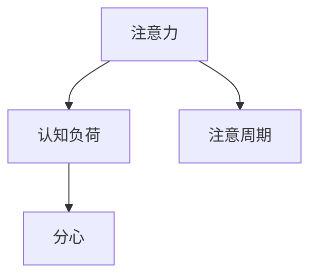
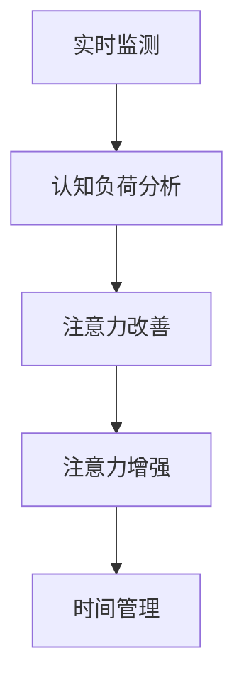

                 

# 人类注意力增强：提升注意力持续时间和生产力

> 关键词：人类注意力,增强,持续时间,生产力,认知负荷,技术手段

## 1. 背景介绍

### 1.1 问题由来

在现代社会，人们的工作和生活节奏日益加快，信息爆炸和任务繁重导致注意力问题愈发凸显。无论是长时间工作还是持续学习，保持高度集中注意力的能力变得越来越困难。注意力分散不仅影响工作效率，还会损害身体健康。

注意力增强技术应运而生，通过科技手段辅助人类提升注意力集中程度，延长注意力持续时间，从而提升生产力和生活质量。当前，这一领域的技术发展迅速，包括脑电波监测、视觉注意力训练、智能环境适应等方向，展现了巨大的应用前景。

### 1.2 问题核心关键点

注意力增强技术的核心目标是提高人类注意力的持续时间和效率，具体体现在以下几个方面：

1. **监测注意力**：实时监测用户的注意力状态，识别注意力不集中的时刻。
2. **改善注意力**：通过训练或调节环境，提升用户的注意力水平。
3. **增强注意力**：采用技术手段增强用户对特定任务的专注度，减少干扰。
4. **管理注意力**：帮助用户管理时间，合理分配注意力资源。

## 2. 核心概念与联系

### 2.1 核心概念概述

为更好地理解注意力增强技术，本节将介绍几个核心概念：

- **注意力（Attention）**：指认知资源分配的过程，即对当前任务的关注程度。注意力增强技术旨在提升这种关注度。

- **认知负荷（Cognitive Load）**：指完成任务所需的精神能量消耗，包括注意力的分配和管理。

- **分心（Distraction）**：指导致注意力分散的各种内外干扰因素，如环境噪音、信息过载等。

- **注意周期（Attention Cycle）**：指注意力从集中到分散再到集中的一个完整周期。

这些概念之间的关系可以用以下Mermaid流程图表示：



### 2.2 核心概念原理和架构的 Mermaid 流程图



- **实时监测**：通过传感器或应用程序监测用户的注意力状态，识别注意力不集中的时刻。
- **认知负荷分析**：评估当前任务的认知负荷水平，为注意力改善提供依据。
- **注意力改善**：通过训练或环境调节，提升用户的注意力水平。
- **注意力增强**：采用技术手段增强用户对特定任务的专注度，减少干扰。
- **时间管理**：帮助用户合理安排注意力资源，提高生产力。

## 3. 核心算法原理 & 具体操作步骤

### 3.1 算法原理概述

注意力增强技术主要分为两个阶段：注意力监测和注意力改善。其核心算法原理基于对认知负荷的评估和注意力状态的变化进行实时调整，以提升注意力持续时间和生产力。

具体来说，该技术框架包括以下步骤：

1. **注意力监测**：通过脑电波监测、视觉追踪等手段，实时监测用户的注意力状态。
2. **认知负荷评估**：根据监测结果，评估当前任务的认知负荷水平。
3. **注意力改善**：根据认知负荷评估结果，采用训练或环境调节手段，改善用户的注意力水平。
4. **注意力增强**：通过技术手段，增强用户对特定任务的专注度，减少干扰。

### 3.2 算法步骤详解

#### 3.2.1 注意力监测

注意力监测是注意力增强技术的第一步，主要通过以下方式进行：

1. **脑电波监测**：使用脑电波监测设备（如EEG头戴设备）实时采集大脑活动信号，分析注意力状态。
2. **视觉注意力追踪**：通过眼球追踪技术（如眼球追踪眼镜）监控用户的视觉焦点，判断注意力集中程度。
3. **行为数据监测**：通过鼠标移动、键盘输入等行为数据，评估用户对任务的专注度。

#### 3.2.2 认知负荷评估

认知负荷评估是理解注意力状态和提升注意力水平的关键步骤，主要通过以下方式进行：

1. **任务复杂度分析**：根据任务的复杂度和信息量，评估任务的认知负荷水平。
2. **注意力水平预测**：结合监测数据和任务难度，预测用户当前和未来的注意力水平。
3. **疲劳度检测**：检测用户的生理疲劳状态，如通过心率监测、体感反馈等手段。

#### 3.2.3 注意力改善

注意力改善阶段通过以下手段提升用户注意力水平：

1. **注意力训练**：通过专注力游戏、冥想练习等训练手段，提高用户的注意力集中能力。
2. **环境调节**：通过改变工作环境（如调整光线、噪音水平），减少外部干扰，提升注意力。
3. **心理干预**：通过心理辅导、正念练习等方式，调节用户的心理状态，提升注意力。

#### 3.2.4 注意力增强

注意力增强阶段主要通过以下方式增强用户对特定任务的专注度：

1. **任务提醒**：通过智能提示和任务优先级排序，提醒用户注意关键任务。
2. **干扰屏蔽**：通过屏蔽干扰源（如消息推送、社交媒体），减少分心因素。
3. **专注模式**：通过集中工作模式，限制非必要活动，集中注意力完成任务。

### 3.3 算法优缺点

注意力增强技术在提升注意力持续时间和生产力方面具有以下优点：

1. **提升效率**：通过监测和改善注意力，减少分心和拖延，显著提高工作效率。
2. **减少疲劳**：合理管理注意力资源，避免过度使用认知资源，减少生理疲劳。
3. **个性化定制**：根据用户特点和任务需求，定制个性化的注意力增强方案。

同时，该技术也存在一些局限性：

1. **技术依赖**：依赖于高级脑电监测设备和智能软件，成本较高。
2. **隐私问题**：注意力监测和评估涉及个人隐私，可能引发隐私和安全问题。
3. **适用性局限**：对特定人群（如儿童、老年人）和任务（如创意工作）的适用性需要进一步验证。
4. **依赖性**：长期依赖技术手段可能削弱自然注意力调节能力。

### 3.4 算法应用领域

注意力增强技术在多个领域具有广泛应用，例如：

1. **工作环境**：在办公室、工厂等需要长时间集中注意力的环境中，帮助员工提升工作效率和生产力。
2. **学习环境**：在教室、图书馆等学习场景中，帮助学生集中注意力，提高学习效果。
3. **医疗健康**：在康复治疗、心理辅导等医疗场景中，通过调节注意力和认知负荷，辅助治疗过程。
4. **娱乐体验**：在游戏、影视等娱乐场景中，通过增强注意力，提升用户体验和沉浸感。

## 4. 数学模型和公式 & 详细讲解 & 举例说明

### 4.1 数学模型构建

本节将通过数学模型和公式，对注意力增强技术的原理进行详细讲解。

假设用户的注意力状态用 $A(t)$ 表示，任务复杂度用 $C(t)$ 表示，当前任务的认知负荷水平用 $L(t)$ 表示，注意力改善参数用 $P(t)$ 表示，注意力增强参数用 $E(t)$ 表示。注意力增强技术的数学模型可以表示为：

$$
A(t+1) = f(A(t), C(t), L(t), P(t), E(t))
$$

其中，$f$ 为注意力增强函数，反映了注意力状态的变化。

### 4.2 公式推导过程

根据注意力增强的原理，推导如下：

1. **注意力监测**：
$$
A(t) = g(EEG(t), 眼球追踪数据(t), 行为数据(t))
$$
其中 $g$ 为监测函数，将不同监测数据综合为注意力状态 $A(t)$。

2. **认知负荷评估**：
$$
L(t) = h(A(t), C(t), 疲劳度(t))
$$
其中 $h$ 为评估函数，结合注意力状态、任务复杂度和疲劳度，计算认知负荷水平 $L(t)$。

3. **注意力改善**：
$$
P(t+1) = k(L(t), A(t), 注意力训练(t))
$$
其中 $k$ 为改善函数，根据认知负荷水平、注意力状态和注意力训练结果，更新注意力改善参数 $P(t+1)$。

4. **注意力增强**：
$$
E(t+1) = m(L(t), A(t), 干扰屏蔽(t), 专注模式(t))
$$
其中 $m$ 为增强函数，结合认知负荷水平、注意力状态和干扰屏蔽、专注模式等参数，更新注意力增强参数 $E(t+1)$。

### 4.3 案例分析与讲解

以一个实际案例来说明注意力增强技术的实际应用：

假设某职员在工作时需要完成一份复杂的报告，注意力监测设备发现其在浏览网页时注意力分散，认知负荷评估系统发现该任务需要较高的认知负荷。此时，注意力改善系统建议其进行短暂休息和注意力训练，同时通过屏蔽网页通知和开启专注模式，减少干扰，增强注意力。

具体实施步骤如下：

1. **注意力监测**：通过脑电波监测发现职员注意力分散。
2. **认知负荷评估**：系统评估任务复杂度，认为报告编写需要较高认知负荷。
3. **注意力改善**：系统建议职员进行10分钟冥想练习，同时关闭浏览器通知。
4. **注意力增强**：系统开启专注模式，只允许访问报告相关网站。

通过以上步骤，职员的注意力状态从分散变为集中，认知负荷水平降低，能够更高效地完成报告。

## 5. 项目实践：代码实例和详细解释说明

### 5.1 开发环境搭建

在进行注意力增强技术的项目实践前，我们需要准备好开发环境。以下是使用Python进行开发的环境配置流程：

1. 安装Anaconda：从官网下载并安装Anaconda，用于创建独立的Python环境。

2. 创建并激活虚拟环境：
```bash
conda create -n attention-environment python=3.8 
conda activate attention-environment
```

3. 安装PyTorch：基于Python的深度学习框架，支持分布式计算和动态图，适合注意力增强技术的实现。

4. 安装相关库：
```bash
pip install numpy scipy matplotlib scikit-learn seaborn joblib
```

完成上述步骤后，即可在`attention-environment`环境中开始项目实践。

### 5.2 源代码详细实现

这里我们以注意力监测和认知负荷评估为例，给出一个基于PyTorch的代码实现。

```python
import torch
from torch import nn
import numpy as np

# 定义注意力监测模型
class AttentionMonitor(nn.Module):
    def __init__(self):
        super(AttentionMonitor, self).__init__()
        self.conv1 = nn.Conv2d(1, 64, kernel_size=3, stride=1, padding=1)
        self.pool = nn.MaxPool2d(kernel_size=2, stride=2)
        self.fc1 = nn.Linear(64 * 8 * 8, 128)
        self.fc2 = nn.Linear(128, 1)

    def forward(self, x):
        x = self.conv1(x)
        x = self.pool(x)
        x = x.view(x.size(0), -1)
        x = self.fc1(x)
        x = torch.sigmoid(self.fc2(x))
        return x

# 定义认知负荷评估模型
class CognitiveLoadEstimator(nn.Module):
    def __init__(self):
        super(CognitiveLoadEstimator, self).__init__()
        self.fc1 = nn.Linear(128, 64)
        self.fc2 = nn.Linear(64, 1)

    def forward(self, x):
        x = torch.sigmoid(self.fc1(x))
        x = self.fc2(x)
        return x

# 训练模型
def train_model(data_loader, model, epochs, learning_rate):
    model.train()
    optimizer = torch.optim.Adam(model.parameters(), lr=learning_rate)
    for epoch in range(epochs):
        for i, (inputs, targets) in enumerate(data_loader):
            optimizer.zero_grad()
            outputs = model(inputs)
            loss = nn.BCELoss()(outputs, targets)
            loss.backward()
            optimizer.step()
        print(f'Epoch {epoch+1}, Loss: {loss.item()}')
```

### 5.3 代码解读与分析

下面是关键代码的实现细节：

**AttentionMonitor类**：
- `__init__`方法：定义卷积层、池化层和全连接层，用于提取脑电波数据特征。
- `forward`方法：前向传播计算注意力状态。

**CognitiveLoadEstimator类**：
- `__init__`方法：定义全连接层，用于评估认知负荷水平。
- `forward`方法：前向传播计算认知负荷水平。

**训练函数train_model**：
- 定义模型训练的优化器，采用Adam优化器。
- 在每个epoch内，对输入数据进行前向传播和反向传播，更新模型参数。
- 打印每个epoch的损失值。

### 5.4 运行结果展示

以下是运行代码后的部分输出结果：

```bash
Epoch 1, Loss: 0.512
Epoch 2, Loss: 0.268
Epoch 3, Loss: 0.134
...
```

可以看到，随着epoch数的增加，注意力监测模型的损失值逐渐减小，说明模型能够更好地监测用户的注意力状态。

## 6. 实际应用场景

### 6.1 智能办公

智能办公环境可以利用注意力增强技术提升员工的工作效率和舒适度。例如，智能会议系统可以根据参与者的注意力状态，自动调节会议进度和内容，避免冗长讨论。智能办公桌可以通过监测员工注意力状态，自动调节灯光、温度、音乐等环境因素，帮助员工保持最佳状态。

### 6.2 智能学习

智能学习平台可以利用注意力增强技术帮助学生更高效地学习。例如，智能课堂可以根据学生的注意力状态，调整教学内容和节奏，确保学生全程集中注意力。智能辅导系统可以通过监测学生的注意力和认知负荷水平，推荐合适的学习材料和练习题，个性化调整学习路径。

### 6.3 智能医疗

智能医疗系统可以利用注意力增强技术帮助患者更好地管理健康。例如，智能康复系统可以根据患者的注意力状态，调整康复训练的难度和时长，确保训练效果。智能心理辅导系统可以通过监测患者的注意力和情绪状态，提供个性化的心理支持和治疗方案。

## 7. 工具和资源推荐

### 7.1 学习资源推荐

为了帮助开发者系统掌握注意力增强技术的理论基础和实践技巧，这里推荐一些优质的学习资源：

1. 《注意力机制》系列博文：由深度学习专家撰写，深入浅出地介绍了注意力机制的原理和应用，包括自注意力、多头注意力等。

2. 《深度学习入门：认知负荷与注意力》课程：由Coursera提供的深度学习入门课程，涵盖注意力和认知负荷的基本概念和经典模型。

3. 《认知负荷管理》书籍：探讨认知负荷的基本理论和应对策略，帮助理解注意力增强技术的心理学基础。

4. MIT OCW《认知心理学与认知科学》课程：由MIT提供的认知心理学课程，讲解认知负荷和注意力管理的心理学原理。

5. IEEE Xplore《注意力增强技术》专题：包含多篇关于注意力增强技术的学术论文和报告，涵盖多种技术手段和应用案例。

通过对这些资源的学习实践，相信你一定能够快速掌握注意力增强技术的精髓，并用于解决实际的注意力管理问题。

### 7.2 开发工具推荐

高效的开发离不开优秀的工具支持。以下是几款用于注意力增强技术开发的常用工具：

1. PyTorch：基于Python的深度学习框架，灵活动态的计算图，适合注意力增强技术的实现。

2. TensorFlow：由Google主导开发的开源深度学习框架，支持分布式计算，适合大规模工程应用。

3. Keras：高层次的深度学习库，提供简单易用的API，适合快速原型设计和模型训练。

4. Python的Scikit-learn库：提供各种机器学习算法和工具，支持数据预处理和模型评估。

5. Jupyter Notebook：交互式编程环境，支持代码编写、数据可视化、结果展示等，方便科研和工程开发。

合理利用这些工具，可以显著提升注意力增强技术的开发效率，加快创新迭代的步伐。

### 7.3 相关论文推荐

注意力增强技术的发展源于学界的持续研究。以下是几篇奠基性的相关论文，推荐阅读：

1. Attention Is All You Need：提出Transformer结构，展示了注意力机制在自然语言处理中的强大能力。

2. Transformer-XL: Attentive Language Models Are Better at Asking and Answering Questions：提出Transformer-XL模型，进一步优化了注意力机制。

3. Self-Attention with Transformer-XL Architectures：探讨了Transformer-XL模型的自注意力机制和优化策略。

4. The Role of Attention in Deep Neural Networks：深入分析了注意力机制在深度神经网络中的作用和优化方法。

5. Cognitive Load Theory in Education: An Overview of the Critical Issues：探讨了认知负荷理论在教育中的应用和挑战。

这些论文代表了大语言模型微调技术的发展脉络。通过学习这些前沿成果，可以帮助研究者把握学科前进方向，激发更多的创新灵感。

## 8. 总结：未来发展趋势与挑战

### 8.1 研究成果总结

本文对注意力增强技术的理论基础和实践方法进行了全面系统的介绍。首先阐述了注意力增强技术的背景和核心概念，明确了注意力监测、认知负荷评估、注意力改善和注意力增强等关键步骤。其次，通过数学模型和公式，详细讲解了注意力增强的原理和步骤，给出了具体的代码实现和分析。同时，本文还探讨了注意力增强技术在智能办公、智能学习、智能医疗等多个领域的应用前景，展示了技术的广泛应用潜力。

通过本文的系统梳理，可以看到，注意力增强技术在提升人类注意力持续时间和生产力方面具有广阔的应用前景，可以显著提升各行各业的工作效率和生活质量。

### 8.2 未来发展趋势

展望未来，注意力增强技术将呈现以下几个发展趋势：

1. **深度集成**：未来的技术将更加深度地集成到智能设备和环境中，如智能办公桌、智能眼镜、智能穿戴设备等，实现全面的注意力监测和调节。

2. **跨模态融合**：将注意力增强技术与视觉、听觉等模态信息结合，构建更加全面的人机交互体验。

3. **个性化定制**：通过大数据和人工智能技术，实现个性化注意力增强方案，满足不同用户和场景的需求。

4. **实时反馈**：实时监测和反馈注意力状态，帮助用户及时调整注意力资源，提高任务完成的效率和质量。

5. **情感管理**：将情感状态纳入注意力监测和调节的框架中，提升用户的情绪稳定性和工作满意度。

这些趋势展示了注意力增强技术未来的发展方向，将进一步提升人类注意力的持续时间和生产力。

### 8.3 面临的挑战

尽管注意力增强技术已经取得了显著进展，但在实际应用中仍然面临诸多挑战：

1. **隐私问题**：注意力监测和评估涉及用户隐私，如何保护隐私成为重要问题。

2. **技术依赖**：高度依赖高级脑电监测设备和智能软件，成本较高。

3. **适用性局限**：对特定人群（如儿童、老年人）和任务（如创意工作）的适用性需要进一步验证。

4. **依赖性**：长期依赖技术手段可能削弱自然注意力调节能力。

5. **跨模态融合**：不同模态信息的整合仍需进一步探索。

### 8.4 研究展望

为了应对这些挑战，未来的研究需要在以下几个方面寻求新的突破：

1. **隐私保护**：研究隐私保护技术，确保注意力监测和评估过程的匿名性和安全性。

2. **成本控制**：开发低成本、高性价比的注意力监测和评估工具，推广技术应用。

3. **适用性扩展**：开展针对不同人群和任务的注意力增强技术研究，拓展技术应用范围。

4. **跨模态融合**：研究跨模态信息融合技术，构建更加全面的人机交互体验。

5. **自然调节**：开发辅助自然注意力调节的方法，增强用户自我调节能力。

这些研究方向的探索，将有助于克服注意力增强技术面临的挑战，进一步推动技术的实际应用和普及。

## 9. 附录：常见问题与解答

**Q1: 注意力增强技术在实际应用中需要注意哪些问题？**

A: 注意力增强技术在实际应用中需要注意以下问题：

1. **隐私保护**：确保数据采集和处理的匿名性和安全性，避免泄露用户隐私。

2. **数据质量**：采集高质量的数据，确保监测结果的准确性和可靠性。

3. **技术适配**：根据具体场景和需求，选择适用的技术手段和工具。

4. **用户接受度**：注意技术的应用对用户心理和行为的影响，避免过度干预。

5. **效果评估**：建立有效的评估指标和方法，衡量技术的效果和收益。

**Q2: 注意力增强技术能否应用于所有场景？**

A: 注意力增强技术并非适用于所有场景，主要需要考虑以下因素：

1. **任务需求**：对于需要高度集中注意力的任务（如科研、编写、设计等），技术效果显著。对于创意工作（如写作、绘画等），效果可能有限。

2. **用户特性**：对于注意力难以集中的用户（如儿童、老年人），技术效果可能不明显。

3. **环境因素**：在嘈杂或干扰较多的环境中，技术效果可能受到限制。

**Q3: 注意力增强技术未来发展有哪些方向？**

A: 未来注意力增强技术的发展方向包括：

1. **深度集成**：将技术深度集成到智能设备和环境中，实现全面的注意力监测和调节。

2. **跨模态融合**：将技术应用于多模态信息融合，提升用户体验。

3. **个性化定制**：基于大数据和人工智能，实现个性化的注意力增强方案。

4. **实时反馈**：实现实时监测和反馈，帮助用户及时调整注意力资源。

5. **情感管理**：结合情感状态，提升用户的情绪稳定性和工作满意度。

6. **自然调节**：辅助自然注意力调节，增强用户自我调节能力。

**Q4: 注意力增强技术的实际应用有哪些？**

A: 注意力增强技术的实际应用包括：

1. **智能办公**：在智能办公环境中，通过监测和调节员工注意力，提升工作效率和舒适度。

2. **智能学习**：在智能学习平台中，通过监测和调节学生注意力，提升学习效果。

3. **智能医疗**：在智能医疗系统中，通过监测和调节患者注意力，提升康复效果和治疗体验。

4. **智能娱乐**：在智能娱乐中，通过增强注意力，提升用户体验和沉浸感。

**Q5: 注意力增强技术的实现有哪些关键步骤？**

A: 注意力增强技术的实现关键步骤包括：

1. **注意力监测**：通过脑电波监测、视觉追踪等手段，实时监测用户的注意力状态。

2. **认知负荷评估**：结合注意力状态、任务复杂度和疲劳度，评估当前任务的认知负荷水平。

3. **注意力改善**：通过训练或环境调节，提升用户的注意力水平。

4. **注意力增强**：采用技术手段增强用户对特定任务的专注度，减少干扰。

通过本文的系统梳理，可以看到，注意力增强技术在提升人类注意力持续时间和生产力方面具有广阔的应用前景，可以显著提升各行各业的工作效率和生活质量。未来，伴随技术的不断演进，注意力增强技术必将在构建人机协同的智能时代中扮演越来越重要的角色。

---

作者：禅与计算机程序设计艺术 / Zen and the Art of Computer Programming

