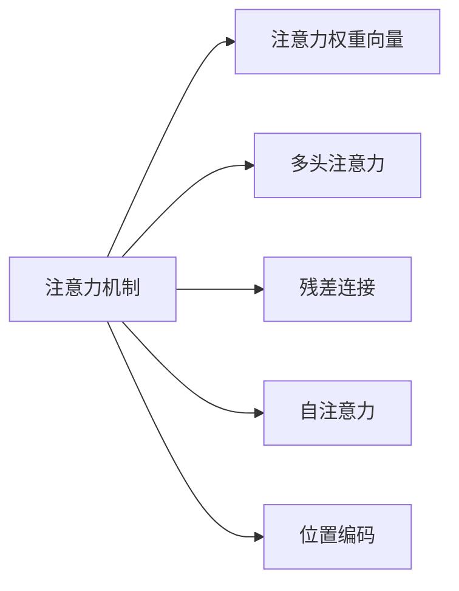

                 

## 1. 背景介绍

在现代社会中，信息爆炸和注意力匮乏已成为一种普遍现象。无论是工作还是生活，高效而专注地处理信息，变得越来越重要。而人工智能（AI）技术的迅速发展，特别是注意力机制的兴起，为解决这一问题提供了新的思路。

### 1.1 问题由来

在人工智能领域，注意力机制（Attention Mechanism）被广泛用于自然语言处理（NLP）、计算机视觉（CV）、语音识别等任务中。通过引入注意力，模型可以更好地聚焦于与当前任务最相关的信息，从而提升任务性能。

注意力机制的灵感来源于人类视觉系统。当我们观看一个物体时，大脑会优先关注物体的关键部位，忽略背景信息。类比到机器学习模型中，注意力机制也通过为输入数据中的不同部分分配不同的权重，决定哪些部分对任务更关键。

### 1.2 问题核心关键点

注意力机制的核心在于如何有效地分配模型对输入数据的关注度。这一过程通常由一个注意力权重向量决定，该向量用于计算每个输入数据项的注意力得分。得分越高的数据项，在模型中被赋予更高的权重，从而更关注。

在实际应用中，注意力机制的计算复杂度较高，且容易受到数据分布变化的影响。因此，如何优化注意力机制的计算效率和鲁棒性，成为一个重要课题。

### 1.3 问题研究意义

研究注意力机制的优化方法和应用场景，对于提升生产力和效率具有重要意义：

1. 提升任务性能：通过合理的注意力分配，模型能够更好地聚焦于与任务相关的信息，提升任务精度。
2. 减少计算负担：注意力机制的优化有助于降低模型计算复杂度，提升推理速度。
3. 增强泛化能力：优化后的注意力机制，能够更好地适应数据分布的变化，提升模型泛化能力。

## 2. 核心概念与联系

### 2.1 核心概念概述

为了更好地理解注意力机制的优化方法和应用，本节将介绍几个密切相关的核心概念：

- **注意力机制**：通过计算输入数据的注意力得分，决定哪些部分对任务更关键，从而提升模型对输入的聚焦能力。
- **注意力权重向量**：用于计算每个输入数据项的注意力得分，得分越高，数据项在模型中得到的关注度越高。
- **多头注意力**：通过并行计算多个注意力向量，模型能够从不同角度获取信息，提升模型鲁棒性和泛化能力。
- **残差连接**：通过在注意力机制中引入残差连接，帮助模型更好地学习残差，提升训练效果。
- **自注意力**：一种特殊的注意力机制，每个元素与自身以及所有其他元素进行交互，常用于序列模型中。
- **位置编码**：用于在注意力机制中引入位置信息，提升模型的语义理解能力。

这些核心概念之间的逻辑关系可以通过以下Mermaid流程图来展示：



这个流程图展示了注意力机制的核心概念及其之间的关系：

1. 注意力机制通过计算注意力权重向量，决定哪些输入数据项对任务更关键。
2. 多头注意力通过并行计算多个注意力向量，提升模型的鲁棒性和泛化能力。
3. 残差连接帮助模型更好地学习残差，提升训练效果。
4. 自注意力机制用于序列模型，每个元素与自身及所有其他元素进行交互。
5. 位置编码用于引入位置信息，提升模型的语义理解能力。

## 3. 核心算法原理 & 具体操作步骤
### 3.1 算法原理概述

注意力机制的核心在于如何计算输入数据的注意力权重向量。一般而言，注意力权重向量 $a$ 可以通过以下公式计算：

$$
a_i = \frac{\exp(e_i)}{\sum_j \exp(e_j)}
$$

其中 $e_i$ 表示第 $i$ 个输入数据项的注意力得分，通常通过某种形式的得分函数计算得到。注意力得分越高，$e_i$ 值越大，从而 $a_i$ 值越大，表明该数据项对任务的贡献越大。

注意力得分 $e_i$ 可以基于不同形式的得分函数计算，如点积得分、余弦相似度得分、加性得分等。这些得分函数的计算复杂度和效果各不相同，需要在具体任务中进行选择。

### 3.2 算法步骤详解

基于注意力机制的核心算法原理，实际的注意力计算过程包括以下几个关键步骤：

**Step 1: 计算注意力得分**
- 定义输入数据的维度 $d$ 和注意力向量维度 $d_a$。
- 计算注意力得分矩阵 $e$，其中每个元素 $e_{ij}$ 表示第 $i$ 个输入数据项与第 $j$ 个注意力向量之间的相似度或相关性。

**Step 2: 计算注意力权重向量**
- 对注意力得分矩阵 $e$ 进行softmax操作，得到注意力权重向量 $a$，即：
$$
a_i = \frac{\exp(e_i)}{\sum_j \exp(e_j)}
$$

**Step 3: 计算加权注意力向量**
- 将注意力权重向量 $a$ 与输入数据 $x$ 相乘，得到加权注意力向量 $h$，即：
$$
h = a \odot x
$$

**Step 4: 计算加权注意力表示**
- 将加权注意力向量 $h$ 输入全连接层（或其他非线性层）进行映射，得到注意力表示 $c$，即：
$$
c = \text{MLP}(h)
$$

**Step 5: 计算输出表示**
- 将注意力表示 $c$ 与输入表示 $x$ 相加，得到最终输出表示 $y$，即：
$$
y = x + c
$$

### 3.3 算法优缺点

注意力机制在优化模型对输入数据的聚焦能力方面具有显著优势，但也存在一些局限性：

- **优点**：
  1. 提升任务性能：通过合理分配注意力权重，模型能够更好地聚焦于与任务相关的信息。
  2. 提升泛化能力：多头注意力和多头自注意力机制能够提升模型的鲁棒性和泛化能力。
  3. 减少计算负担：自注意力机制通过引入残差连接和位置编码，降低了计算复杂度。

- **缺点**：
  1. 计算复杂度高：注意力机制的计算复杂度较高，尤其是在多头和自注意力机制中。
  2. 易受数据分布变化影响：注意力权重向量依赖于输入数据的分布，分布变化可能导致模型性能下降。
  3. 模型解释性差：注意力机制的计算过程较为复杂，难以解释其内部工作机制。

### 3.4 算法应用领域

注意力机制已经在多种任务中得到了广泛应用，如机器翻译、图像识别、语音识别、文本生成等。以下是几个典型的应用场景：

- **机器翻译**：在机器翻译中，注意力机制能够帮助模型更好地理解输入句子的语义，从而提升翻译质量。
- **图像识别**：在图像识别中，注意力机制能够帮助模型更好地聚焦于图像中的关键区域，提升识别准确率。
- **语音识别**：在语音识别中，注意力机制能够帮助模型更好地处理输入音频的时序信息，提升识别精度。
- **文本生成**：在文本生成中，注意力机制能够帮助模型更好地捕捉输入文本的上下文信息，生成更加连贯和自然的内容。

## 4. 数学模型和公式 & 详细讲解 & 举例说明
### 4.1 数学模型构建

本节将使用数学语言对注意力机制的计算过程进行更加严格的刻画。

记输入数据为 $x \in \mathbb{R}^{d_x}$，注意力向量为 $a \in \mathbb{R}^{d_a}$，注意力得分矩阵为 $e \in \mathbb{R}^{d_x \times d_a}$，注意力表示为 $c \in \mathbb{R}^{d_a}$，最终输出表示为 $y \in \mathbb{R}^{d_y}$。

定义注意力得分函数 $e_{ij}$ 如下：

$$
e_{ij} = \text{Attention}(x_i, a_j)
$$

其中 $\text{Attention}$ 表示注意力得分函数，可以是点积得分、余弦相似度得分、加性得分等。

注意力权重向量 $a$ 和加权注意力向量 $h$ 可以通过如下公式计算：

$$
a_i = \frac{\exp(e_{ii})}{\sum_j \exp(e_{ij})}
$$

$$
h_i = a_i \odot x_i
$$

注意力表示 $c$ 和最终输出表示 $y$ 可以通过如下公式计算：

$$
c = \text{MLP}(h)
$$

$$
y = x + c
$$

### 4.2 公式推导过程

以下我们以点积注意力机制为例，推导其计算过程。

假设输入数据为 $x \in \mathbb{R}^{d_x}$，注意力向量为 $a \in \mathbb{R}^{d_a}$，注意力得分矩阵为 $e \in \mathbb{R}^{d_x \times d_a}$。点积注意力机制的计算公式为：

$$
e_{ij} = a_j^T x_i
$$

注意力权重向量 $a$ 和加权注意力向量 $h$ 可以通过如下公式计算：

$$
a_i = \frac{\exp(e_{ii})}{\sum_j \exp(e_{ij})}
$$

$$
h_i = a_i \odot x_i
$$

注意力表示 $c$ 和最终输出表示 $y$ 可以通过如下公式计算：

$$
c = \text{MLP}(h)
$$

$$
y = x + c
$$

### 4.3 案例分析与讲解

以机器翻译为例，介绍注意力机制的应用。假设输入为英文句子 $x$，目标为中文句子 $y$，注意力机制通过计算每个单词在句子中的重要性，帮助模型更好地理解输入句子的语义，从而提升翻译质量。

**输入表示 $x$**：将英文句子转换为词向量表示，假设 $x \in \mathbb{R}^{d_x}$。

**注意力向量 $a$**：初始化为随机向量，假设 $a \in \mathbb{R}^{d_a}$。

**注意力得分矩阵 $e$**：通过点积注意力机制计算每个单词与注意力向量 $a$ 的相似度得分，假设 $e \in \mathbb{R}^{d_x \times d_a}$。

**注意力权重向量 $a$**：通过对注意力得分矩阵 $e$ 进行softmax操作，得到注意力权重向量 $a$，即：

$$
a_i = \frac{\exp(e_{ii})}{\sum_j \exp(e_{ij})}
$$

**加权注意力向量 $h$**：将注意力权重向量 $a$ 与输入数据 $x$ 相乘，得到加权注意力向量 $h$，即：

$$
h_i = a_i \odot x_i
$$

**注意力表示 $c$**：将加权注意力向量 $h$ 输入全连接层进行映射，得到注意力表示 $c$，即：

$$
c = \text{MLP}(h)
$$

**最终输出表示 $y$**：将注意力表示 $c$ 与输入表示 $x$ 相加，得到最终输出表示 $y$，即：

$$
y = x + c
$$

通过注意力机制，模型能够更好地理解输入句子的语义，从而提升翻译质量。

## 5. 项目实践：代码实例和详细解释说明
### 5.1 开发环境搭建

在进行注意力机制的实践前，我们需要准备好开发环境。以下是使用Python进行PyTorch开发的环境配置流程：

1. 安装Anaconda：从官网下载并安装Anaconda，用于创建独立的Python环境。

2. 创建并激活虚拟环境：
```bash
conda create -n attention-env python=3.8 
conda activate attention-env
```

3. 安装PyTorch：根据CUDA版本，从官网获取对应的安装命令。例如：
```bash
conda install pytorch torchvision torchaudio cudatoolkit=11.1 -c pytorch -c conda-forge
```

4. 安装各类工具包：
```bash
pip install numpy pandas scikit-learn matplotlib tqdm jupyter notebook ipython
```

完成上述步骤后，即可在`attention-env`环境中开始注意力机制的实践。

### 5.2 源代码详细实现

这里我们以自注意力机制为例，给出使用PyTorch实现注意力机制的代码实现。

首先，定义自注意力计算函数：

```python
import torch
import torch.nn as nn
import torch.nn.functional as F

class SelfAttention(nn.Module):
    def __init__(self, d_model, n_heads):
        super(SelfAttention, self).__init__()
        self.d_model = d_model
        self.n_heads = n_heads
        self.head_dim = d_model // n_heads
        
        self.query = nn.Linear(d_model, d_model)
        self.key = nn.Linear(d_model, d_model)
        self.value = nn.Linear(d_model, d_model)
        self.out = nn.Linear(d_model, d_model)
        
        self.softmax = nn.Softmax(dim=-1)
    
    def forward(self, x):
        batch_size, seq_len, _ = x.size()
        
        # 对输入进行线性变换，得到查询向量、键向量和值向量
        query = self.query(x).view(batch_size, seq_len, self.n_heads, self.head_dim).permute(0, 2, 1, 3).contiguous()
        key = self.key(x).view(batch_size, seq_len, self.n_heads, self.head_dim).permute(0, 2, 1, 3).contiguous()
        value = self.value(x).view(batch_size, seq_len, self.n_heads, self.head_dim).permute(0, 2, 1, 3).contiguous()
        
        # 计算注意力得分
        score = torch.matmul(query, key.permute(0, 1, 3, 2)) / torch.sqrt(torch.tensor(self.head_dim))
        
        # 计算注意力权重向量
        attention = self.softmax(score)
        
        # 计算加权注意力向量
        context = torch.matmul(attention, value)
        context = context.permute(0, 2, 1, 3).contiguous().view(batch_size, seq_len, self.d_model)
        
        # 计算注意力表示
        attention = self.out(context)
        
        return attention
```

然后，定义自注意力模块并应用在编码器中：

```python
class Encoder(nn.Module):
    def __init__(self, d_model, n_heads, num_layers, dropout):
        super(Encoder, self).__init__()
        self.layers = nn.ModuleList([nn.TransformerEncoderLayer(d_model, n_heads, dropout) for _ in range(num_layers)])
        
    def forward(self, src):
        for layer in self.layers:
            src = layer(src)
        return src
```

最后，定义整个Transformer模型并训练：

```python
class Transformer(nn.Module):
    def __init__(self, d_model, n_heads, num_layers, dropout):
        super(Transformer, self).__init__()
        self.encoder = Encoder(d_model, n_heads, num_layers, dropout)
        self.decoder = nn.TransformerDecoderLayer(d_model, n_heads, dropout)
        self.out = nn.Linear(d_model, 1)
        
    def forward(self, src, tgt):
        src = self.encoder(src)
        tgt = self.decoder(tgt, src)
        out = self.out(tgt)
        return out

# 定义输入
d_model = 512
n_heads = 8
num_layers = 6
dropout = 0.1

src = torch.randn(128, 20, d_model)
tgt = torch.randn(128, 20, d_model)
model = Transformer(d_model, n_heads, num_layers, dropout)
optimizer = torch.optim.Adam(model.parameters(), lr=0.001)
loss_fn = nn.MSELoss()

# 训练模型
for epoch in range(10):
    output = model(src, tgt)
    loss = loss_fn(output, tgt)
    optimizer.zero_grad()
    loss.backward()
    optimizer.step()
    print(f"Epoch {epoch+1}, loss: {loss.item():.3f}")
```

以上就是使用PyTorch实现自注意力机制的完整代码实现。可以看到，注意力机制的实现并不复杂，通过定义查询、键、值向量的线性变换，计算注意力得分和权重向量，最终得到加权注意力向量，将其输入全连接层即可得到注意力表示。

### 5.3 代码解读与分析

让我们再详细解读一下关键代码的实现细节：

**SelfAttention类**：
- `__init__`方法：初始化注意力机制的参数，包括输入维度 $d_model$、注意力向量的头数 $n_heads$ 等。
- `forward`方法：计算注意力得分、权重向量、加权注意力向量、注意力表示，并返回注意力表示。

**Encoder类**：
- `__init__`方法：初始化编码器，包括多层注意力层（TransformerEncoderLayer）。
- `forward`方法：迭代计算每一层注意力层的输出，并返回整个编码器的输出。

**Transformer类**：
- `__init__`方法：初始化整个Transformer模型，包括编码器和解码器。
- `forward`方法：将输入编码和解码，得到模型输出。

**训练流程**：
- 定义模型参数和优化器，设置损失函数。
- 迭代训练模型，在每个epoch内计算模型输出，更新模型参数。
- 打印每个epoch的损失值。

可以看到，PyTorch框架为实现注意力机制提供了丰富的API，使得代码实现变得简洁高效。开发者可以将更多精力放在模型架构设计和训练策略优化上，而不必过多关注底层的实现细节。

## 6. 实际应用场景
### 6.1 智能客服系统

基于自注意力机制的智能客服系统，可以显著提升客服服务的质量和效率。传统客服系统往往依赖人工，响应时间较长，且难以处理复杂的多轮对话。而使用基于自注意力机制的对话模型，可以实时处理用户咨询，快速理解用户意图，提供准确的回复。

在技术实现上，可以收集企业内部的历史客服对话记录，将问题和最佳答复构建成监督数据，在此基础上对预训练模型进行微调。微调后的模型能够自动理解用户意图，匹配最合适的答案模板进行回复。对于客户提出的新问题，还可以接入检索系统实时搜索相关内容，动态组织生成回答。如此构建的智能客服系统，能大幅提升客户咨询体验和问题解决效率。

### 6.2 金融舆情监测

金融机构需要实时监测市场舆论动向，以便及时应对负面信息传播，规避金融风险。传统的人工监测方式成本高、效率低，难以应对网络时代海量信息爆发的挑战。基于自注意力机制的文本分类和情感分析技术，为金融舆情监测提供了新的解决方案。

具体而言，可以收集金融领域相关的新闻、报道、评论等文本数据，并对其进行主题标注和情感标注。在此基础上对预训练语言模型进行微调，使其能够自动判断文本属于何种主题，情感倾向是正面、中性还是负面。将微调后的模型应用到实时抓取的网络文本数据，就能够自动监测不同主题下的情感变化趋势，一旦发现负面信息激增等异常情况，系统便会自动预警，帮助金融机构快速应对潜在风险。

### 6.3 个性化推荐系统

当前的推荐系统往往只依赖用户的历史行为数据进行物品推荐，无法深入理解用户的真实兴趣偏好。基于自注意力机制的个性化推荐系统可以更好地挖掘用户行为背后的语义信息，从而提供更精准、多样的推荐内容。

在实践中，可以收集用户浏览、点击、评论、分享等行为数据，提取和用户交互的物品标题、描述、标签等文本内容。将文本内容作为模型输入，用户的后续行为（如是否点击、购买等）作为监督信号，在此基础上微调预训练语言模型。微调后的模型能够从文本内容中准确把握用户的兴趣点。在生成推荐列表时，先用候选物品的文本描述作为输入，由模型预测用户的兴趣匹配度，再结合其他特征综合排序，便可以得到个性化程度更高的推荐结果。

### 6.4 未来应用展望

随着自注意力机制的不断发展，基于自注意力机制的技术将在更多领域得到应用，为传统行业带来变革性影响。

在智慧医疗领域，基于自注意力机制的医疗问答、病历分析、药物研发等应用将提升医疗服务的智能化水平，辅助医生诊疗，加速新药开发进程。

在智能教育领域，自注意力机制可应用于作业批改、学情分析、知识推荐等方面，因材施教，促进教育公平，提高教学质量。

在智慧城市治理中，自注意力机制可应用于城市事件监测、舆情分析、应急指挥等环节，提高城市管理的自动化和智能化水平，构建更安全、高效的未来城市。

此外，在企业生产、社会治理、文娱传媒等众多领域，基于自注意力机制的人工智能应用也将不断涌现，为经济社会发展注入新的动力。相信随着技术的日益成熟，自注意力机制必将在构建人机协同的智能时代中扮演越来越重要的角色。

## 7. 工具和资源推荐
### 7.1 学习资源推荐

为了帮助开发者系统掌握自注意力机制的理论基础和实践技巧，这里推荐一些优质的学习资源：

1. 《深度学习基础》系列博文：由深度学习专家撰写，详细介绍了深度学习的基本概念和核心算法，包括自注意力机制。

2. CS231n《卷积神经网络》课程：斯坦福大学开设的计算机视觉课程，涵盖了卷积神经网络和自注意力机制的基本原理和实现方法。

3. 《Attention is All You Need》论文：Transformer原论文，展示了自注意力机制在序列模型中的应用，开创了NLP领域的预训练大模型时代。

4. 《Deep Residual Learning for Image Recognition》论文：提出了残差连接，对自注意力机制的优化提供了重要思路。

5. 《Positional Encoding for Attention》论文：介绍了位置编码，如何在自注意力机制中引入位置信息，提升模型的语义理解能力。

通过对这些资源的学习实践，相信你一定能够快速掌握自注意力机制的精髓，并用于解决实际的NLP问题。
###  7.2 开发工具推荐

高效的开发离不开优秀的工具支持。以下是几款用于自注意力机制开发的常用工具：

1. PyTorch：基于Python的开源深度学习框架，灵活动态的计算图，适合快速迭代研究。大部分预训练语言模型都有PyTorch版本的实现。

2. TensorFlow：由Google主导开发的开源深度学习框架，生产部署方便，适合大规模工程应用。同样有丰富的预训练语言模型资源。

3. Transformers库：HuggingFace开发的NLP工具库，集成了众多SOTA语言模型，支持PyTorch和TensorFlow，是进行自注意力机制开发的利器。

4. Weights & Biases：模型训练的实验跟踪工具，可以记录和可视化模型训练过程中的各项指标，方便对比和调优。与主流深度学习框架无缝集成。

5. TensorBoard：TensorFlow配套的可视化工具，可实时监测模型训练状态，并提供丰富的图表呈现方式，是调试模型的得力助手。

6. Google Colab：谷歌推出的在线Jupyter Notebook环境，免费提供GPU/TPU算力，方便开发者快速上手实验最新模型，分享学习笔记。

合理利用这些工具，可以显著提升自注意力机制的开发效率，加快创新迭代的步伐。

### 7.3 相关论文推荐

自注意力机制在NLP领域已经得到了广泛应用，其发展得益于学界的持续研究。以下是几篇奠基性的相关论文，推荐阅读：

1. Attention is All You Need（即Transformer原论文）：提出了Transformer结构，展示了自注意力机制在序列模型中的应用，开创了NLP领域的预训练大模型时代。

2. BERT: Pre-training of Deep Bidirectional Transformers for Language Understanding：提出BERT模型，通过自监督学习任务进行预训练，展示了自注意力机制的强大能力。

3. Self-Attention with Transformer Networks：提出自注意力机制，展示了其在图像识别和机器翻译等任务中的应用。

4. Positional Encoding with Transformers：介绍位置编码，如何在自注意力机制中引入位置信息，提升模型的语义理解能力。

5. Deep Residual Learning for Image Recognition：提出残差连接，对自注意力机制的优化提供了重要思路。

这些论文代表了大语言模型和注意力机制的发展脉络。通过学习这些前沿成果，可以帮助研究者把握学科前进方向，激发更多的创新灵感。

## 8. 总结：未来发展趋势与挑战
### 8.1 总结

本文对自注意力机制的优化方法和应用场景进行了全面系统的介绍。首先阐述了自注意力机制的研究背景和意义，明确了自注意力机制在提升生产力和效率方面的独特价值。其次，从原理到实践，详细讲解了自注意力机制的计算过程和关键步骤，给出了自注意力机制的完整代码实现。同时，本文还广泛探讨了自注意力机制在智能客服、金融舆情、个性化推荐等多个行业领域的应用前景，展示了自注意力机制的巨大潜力。此外，本文精选了自注意力机制的学习资源，力求为读者提供全方位的技术指引。

通过本文的系统梳理，可以看到，自注意力机制在优化模型对输入数据的聚焦能力方面具有显著优势，已经被广泛应用于各种NLP任务中。未来，伴随自注意力机制的不断演进，其将会在更多领域得到应用，为传统行业带来变革性影响。

### 8.2 未来发展趋势

展望未来，自注意力机制的发展趋势如下：

1. 模型规模持续增大。随着算力成本的下降和数据规模的扩张，预训练语言模型的参数量还将持续增长。超大规模语言模型蕴含的丰富语言知识，有望支撑更加复杂多变的自注意力机制的应用。

2. 自注意力机制的优化将更加多样。未来将涌现更多参数高效的自注意力机制，如LoRA、SimSelf-Attention等，在固定大部分预训练参数的情况下，仍能取得不错的自注意力效果。

3. 多模态自注意力机制将得到发展。当前的自注意力机制主要聚焦于文本数据，未来将进一步拓展到图像、视频、语音等多模态数据自注意力机制。多模态信息的融合，将显著提升自注意力机制对现实世界的理解和建模能力。

4. 自注意力机制的计算复杂度将得到优化。现有的自注意力机制计算复杂度较高，未来将通过分布式计算、量化加速等技术，进一步降低计算复杂度，提升推理速度。

5. 自注意力机制的鲁棒性和泛化能力将得到提升。未来的自注意力机制将通过引入先验知识、数据增强、对抗训练等技术，提升模型对数据分布变化的鲁棒性和泛化能力。

6. 自注意力机制的模型解释性将得到加强。未来的自注意力机制将通过引入可解释性模块，提升模型的透明性和可理解性，帮助用户更好地理解模型的决策过程。

### 8.3 面临的挑战

尽管自注意力机制已经取得了显著的进展，但在迈向更加智能化、普适化应用的过程中，它仍面临诸多挑战：

1. 计算资源消耗高。自注意力机制的计算复杂度较高，在大规模模型上运行，需要大量的计算资源和存储资源。如何优化计算复杂度，降低资源消耗，是未来需要解决的重要问题。

2. 易受数据分布变化影响。自注意力机制的计算过程依赖于输入数据的分布，数据分布变化可能导致模型性能下降。如何提升模型的鲁棒性，避免灾难性遗忘，还需要更多理论和实践的积累。

3. 模型复杂度高。自注意力机制的计算复杂度和模型复杂度较高，难以在移动设备等资源受限的平台上部署。如何简化模型结构，提升模型效率，优化推理速度，是未来需要解决的重要问题。

4. 模型可解释性差。自注意力机制的计算过程较为复杂，难以解释其内部工作机制。如何提升模型的透明性和可理解性，增强用户的信任和接受度，是未来需要解决的重要问题。

5. 模型安全性不足。自注意力机制在处理大量数据时，可能学习到有偏见、有害的信息。如何保障模型的安全性，避免有害信息的传播，是未来需要解决的重要问题。

6. 模型知识整合能力不足。现有的自注意力机制往往局限于任务内数据，难以灵活吸收和运用更广泛的先验知识。如何让自注意力机制更好地与外部知识库、规则库等专家知识结合，形成更加全面、准确的信息整合能力，还有很大的想象空间。

以上挑战凸显了自注意力机制发展的复杂性和多样性，未来研究需要在多个维度进行协同优化。唯有不断突破技术瓶颈，才能进一步推动自注意力机制的成熟和应用。

### 8.4 研究展望

未来的研究可以从以下几个方向进行：

1. 探索无监督和半监督自注意力机制。摆脱对大规模标注数据的依赖，利用自监督学习、主动学习等无监督和半监督范式，最大限度利用非结构化数据，实现更加灵活高效的自注意力机制。

2. 研究参数高效和计算高效的自注意力范式。开发更加参数高效的自注意力机制，在固定大部分预训练参数的情况下，只更新极少量的任务相关参数。同时优化自注意力机制的计算复杂度，提升推理速度。

3. 引入更多先验知识。将符号化的先验知识，如知识图谱、逻辑规则等，与神经网络模型进行巧妙融合，引导自注意力机制学习更准确、合理的语言模型。同时加强不同模态数据的整合，实现视觉、语音等多模态信息与文本信息的协同建模。

4. 结合因果分析和博弈论工具。将因果分析方法引入自注意力机制，识别出模型决策的关键特征，增强输出解释的因果性和逻辑性。借助博弈论工具刻画人机交互过程，主动探索并规避模型的脆弱点，提高系统稳定性。

5. 纳入伦理道德约束。在自注意力机制的训练目标中引入伦理导向的评估指标，过滤和惩罚有害的输出倾向。加强人工干预和审核，建立模型行为的监管机制，确保输出符合人类价值观和伦理道德。

这些研究方向的探索，必将引领自注意力机制技术迈向更高的台阶，为构建安全、可靠、可解释、可控的智能系统铺平道路。面向未来，自注意力机制需要与其他人工智能技术进行更深入的融合，如知识表示、因果推理、强化学习等，多路径协同发力，共同推动自然语言理解和智能交互系统的进步。只有勇于创新、敢于突破，才能不断拓展自注意力机制的边界，让智能技术更好地造福人类社会。

## 9. 附录：常见问题与解答

**Q1：自注意力机制是否适用于所有NLP任务？**

A: 自注意力机制在大多数NLP任务上都能取得不错的效果，特别是对于数据量较小的任务。但对于一些特定领域的任务，如医学、法律等，仅依靠通用语料预训练的模型可能难以很好地适应。此时需要在特定领域语料上进一步预训练，再进行自注意力微调，才能获得理想效果。此外，对于一些需要时效性、个性化很强的任务，如对话、推荐等，自注意力机制也需要针对性的改进优化。

**Q2：自注意力机制的计算复杂度是否可以进一步降低？**

A: 自注意力机制的计算复杂度较高，尤其是在多头和自注意力机制中。未来的研究可以通过分布式计算、量化加速等技术，进一步降低计算复杂度，提升推理速度。同时，也可以通过参数高效的方法，如LoRA、SimSelf-Attention等，在固定大部分预训练参数的情况下，仍能取得不错的自注意力效果。

**Q3：自注意力机制的鲁棒性如何提升？**

A: 自注意力机制的鲁棒性可以通过引入先验知识、数据增强、对抗训练等技术进行提升。这些技术可以帮助模型更好地适应数据分布的变化，提升模型的泛化能力，从而增强鲁棒性。

**Q4：如何增强自注意力机制的可解释性？**

A: 自注意力机制的计算过程较为复杂，难以解释其内部工作机制。未来的研究可以通过引入可解释性模块，提升模型的透明性和可理解性，帮助用户更好地理解模型的决策过程。

**Q5：自注意力机制的计算过程是否易于理解？**

A: 自注意力机制的计算过程较为复杂，对于初学者来说可能不太容易理解。但随着深度学习技术的发展和普及，越来越多的学习资源和工具可以帮助开发者更好地理解和应用自注意力机制。

**Q6：自注意力机制的应用场景有哪些？**

A: 自注意力机制已经在机器翻译、图像识别、语音识别、文本生成等众多任务中得到了广泛应用。此外，在智能客服、金融舆情监测、个性化推荐系统等场景中，自注意力机制也展示了其强大的应用潜力。

通过本文的系统梳理，可以看到，自注意力机制在优化模型对输入数据的聚焦能力方面具有显著优势，已经被广泛应用于各种NLP任务中。未来，伴随自注意力机制的不断演进，其将会在更多领域得到应用，为传统行业带来变革性影响。

**Q7：自注意力机制的参数效率如何提升？**

A: 自注意力机制的参数效率可以通过引入参数高效的方法进行提升，如LoRA、SimSelf-Attention等。这些方法可以在固定大部分预训练参数的情况下，只更新极少量的任务相关参数，从而提升模型的参数效率。

**Q8：自注意力机制的模型解释性如何增强？**

A: 自注意力机制的模型解释性可以通过引入可解释性模块进行增强。这些模块可以帮助用户更好地理解模型的决策过程，增强用户的信任和接受度。

**Q9：自注意力机制的安全性如何保障？**

A: 自注意力机制的安全性可以通过在模型训练目标中引入伦理导向的评估指标进行保障。同时加强人工干预和审核，建立模型行为的监管机制，确保输出符合人类价值观和伦理道德。

通过这些问题的解答，相信你一定能够更加深入地理解自注意力机制的理论基础和应用场景，并能够在实际项目中灵活运用。

