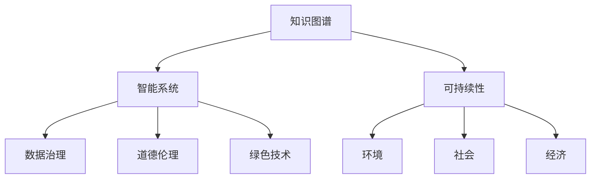

                 

# 人类的知识与可持续发展：为未来负责

> 关键词：知识图谱, 可持续性, 智能系统, 数据治理, 道德伦理, 绿色技术, 社会责任

## 1. 背景介绍

### 1.1 问题由来

随着信息时代的到来，人类知识体量呈指数级增长。据估计，全球数据量每年以60%的速度增长，预计到2025年将达到175ZB。然而，知识的爆炸也带来了新的挑战，如数据过载、信息冗余、知识孤岛等问题，这些问题严重制约了人类对知识的获取、理解和应用。

此外，随着全球气候变化和资源短缺问题的日益严峻，如何实现知识与环境的可持续发展，也成为迫切需要解决的问题。这不仅关乎未来，更关乎地球的可持续发展。

### 1.2 问题核心关键点

知识与可持续发展的核心关键点包括以下几个方面：
1. **知识图谱**：构建和维护知识图谱，可以系统地组织和关联各类知识，提升知识发现和推理能力。
2. **可持续性**：通过知识图谱的应用，优化资源利用，减少环境影响，推动绿色技术发展。
3. **智能系统**：基于知识图谱的智能系统可以提供精准推荐、自动化决策等，提高效率，降低成本。
4. **数据治理**：确保数据的质量、安全性和隐私保护，是知识图谱应用的前提和保障。
5. **道德伦理**：知识图谱和智能系统在应用过程中，必须遵循伦理原则，保护个人隐私和权益。
6. **绿色技术**：利用知识图谱和智能系统，推动能源、交通、农业等领域绿色技术的发展。

## 2. 核心概念与联系

### 2.1 核心概念概述

为更好地理解知识与可持续发展的关联和融合，本节将介绍几个关键概念及其相互联系：

- **知识图谱**：以图谱形式组织知识，通过节点和边描述实体、关系和属性。知识图谱可以用于知识推理、推荐系统、搜索引擎等。

- **可持续性**：指满足当前需要而又不损害后代满足其需求的能力。涉及环境、社会、经济等维度，涵盖能源、水资源、土地利用等。

- **智能系统**：通过知识图谱等数据源，构建可以自动化处理任务的系统，如推荐系统、知识图谱管理系统等。

- **数据治理**：确保数据的质量、安全、隐私等方面符合规定要求，包括数据源管理、数据生命周期管理等。

- **道德伦理**：确保智能系统在应用过程中遵循伦理原则，保护个人隐私和权益，避免偏见和歧视。

- **绿色技术**：指对环境友好，可实现循环利用、零排放、低能耗等目标的技术。

这些概念之间的逻辑关系可以通过以下Mermaid流程图来展示：



这个流程图展示了一系列核心概念及其之间的相互联系和作用：

1. 知识图谱是构建智能系统的基础，提供必要的知识结构。
2. 智能系统在数据治理和道德伦理的约束下，能够更有效地应用于绿色技术的发展。
3. 绿色技术的应用，提升了知识的可持续性，反过来又丰富了知识图谱的内容。
4. 知识图谱的构建和智能系统的应用，提升了社会经济和环境效益，推动可持续发展。

## 3. 核心算法原理 & 具体操作步骤
### 3.1 算法原理概述

知识图谱和智能系统在可持续发展中的应用，涉及数据采集、知识融合、推理决策等多个步骤。其核心算法原理可归纳为以下几个方面：

- **数据采集**：通过多种渠道收集数据，构建和维护知识图谱。
- **知识融合**：将异构数据和不同来源的知识进行整合，形成统一的视图。
- **知识推理**：利用知识图谱中的关系和属性，进行逻辑推理和推理验证。
- **智能决策**：基于推理结果和领域知识，自动化决策和推荐。

这些算法原理构成了一个完整的知识与可持续发展系统，旨在高效利用和整合知识，推动绿色技术的创新应用。

### 3.2 算法步骤详解

基于知识图谱和智能系统，推动可持续发展的算法步骤包括：

**Step 1: 数据采集与清洗**
- 收集各类数据，如环境监测数据、经济统计数据、社会行为数据等。
- 清洗和预处理数据，去除噪声和冗余，确保数据的质量和一致性。

**Step 2: 知识图谱构建**
- 设计知识图谱架构，定义实体、关系和属性。
- 利用自然语言处理技术，将文本数据转换为结构化知识，构建知识图谱。

**Step 3: 知识融合与推理**
- 将不同来源的知识进行融合，构建统一的视图。
- 通过逻辑推理和关联推理，验证知识的一致性和正确性。

**Step 4: 智能决策与推荐**
- 基于知识图谱和推理结果，构建智能决策系统。
- 开发推荐系统，根据用户偏好和历史行为，提供个性化服务。

**Step 5: 可持续性评估与优化**
- 评估系统对可持续性的影响，如资源利用效率、环境效益等。
- 根据评估结果，优化系统设计，提升可持续性水平。

### 3.3 算法优缺点

基于知识图谱和智能系统的可持续发展算法具有以下优点：
1. 系统化组织知识，便于查询、推理和应用。
2. 融合多种数据源，提供更全面的信息。
3. 自动化决策和推荐，提高效率和准确性。
4. 可优化资源利用，推动绿色技术发展。

同时，该算法也存在一定的局限性：
1. 数据质量和一致性要求高，数据采集和清洗成本较高。
2. 知识图谱构建复杂，需要多学科知识。
3. 推理和决策的准确性依赖于知识图谱的质量。
4. 系统复杂度高，部署和维护成本较高。

尽管存在这些局限性，但总体而言，基于知识图谱和智能系统的可持续发展算法在推动绿色技术发展、提升资源利用效率等方面具有显著优势。

### 3.4 算法应用领域

基于知识图谱和智能系统的可持续发展算法，在多个领域得到了广泛应用，例如：

- **能源领域**：通过知识图谱，优化能源管理，提高能源利用效率。
- **交通领域**：构建智能交通系统，实现交通流预测和优化。
- **农业领域**：利用智能农业系统，提高农作物产量和资源利用率。
- **环境保护**：通过环境知识图谱，实现环境监测和治理。
- **金融领域**：提供智能投顾系统，优化投资决策和风险控制。
- **健康领域**：构建智能医疗系统，提升诊断和治疗效果。

这些应用场景展示了知识图谱和智能系统在推动可持续发展中的巨大潜力。

## 4. 数学模型和公式 & 详细讲解 & 举例说明（备注：数学公式请使用latex格式，latex嵌入文中独立段落使用 $$，段落内使用 $)
### 4.1 数学模型构建

在知识图谱和智能系统的构建过程中，涉及大量数学模型的应用，以下将详细讲解其中的几个关键模型：

- **知识图谱构建模型**：通过节点和边描述实体、关系和属性，可以使用图神经网络(Graph Neural Network, GNN)等方法，进行知识图谱的构建和维护。

- **知识推理模型**：利用知识图谱中的关系和属性，进行逻辑推理和推理验证，常见的推理模型包括基于规则的推理、基于概率的推理、基于图模型的推理等。

- **智能决策模型**：基于知识图谱和推理结果，构建推荐系统或决策系统，可以使用协同过滤、强化学习等方法，进行自动化决策和推荐。

### 4.2 公式推导过程

以下以知识图谱构建和推理为例，详细讲解相关公式的推导过程：

**知识图谱构建**：
知识图谱中的节点表示实体，边表示实体之间的关系，属性的表示方式是节点属性向量。假设有$n$个节点和$m$条边，构建知识图谱的公式如下：

$$
\begin{aligned}
G &= \{ (N, E) \} \\
N &= \{ n_1, n_2, \dots, n_N \} \\
E &= \{ e_1, e_2, \dots, e_M \} \\
\end{aligned}
$$

其中，$N$为节点集合，$E$为边集合。

**知识推理**：
利用知识图谱进行推理，通常采用基于图模型的推理方法，如GraphSAGE、GAT等。以GraphSAGE为例，其公式如下：

$$
\begin{aligned}
\mathbf{h}_i^{(l+1)} &= \text{Agg}(\{ \mathbf{h}_j^{(l)} \}_{j \in \mathcal{N}_i}) + \mathbf{a}_i \\
\mathbf{h}_i^{(l)} &= \text{Agg}(\{ \mathbf{h}_j^{(l)} \}_{j \in \mathcal{N}_i}) + \mathbf{a}_i
\end{aligned}
$$

其中，$\mathbf{h}_i^{(l)}$表示节点$i$在层$l$的表示向量，$\text{Agg}$为聚合函数，$\mathbf{a}_i$为节点$i$的初始表示向量。

### 4.3 案例分析与讲解

**案例一：能源领域的知识图谱构建与推理**
假设有一个能源知识图谱，其中包含电网、发电厂、风力发电机、太阳能板等实体，以及它们之间的关系如供电、服务、连接等。通过知识图谱构建模型，将这些异构数据整合为一个统一视图。使用基于图模型的推理算法，如GraphSAGE，进行能源管理优化，提升能源利用效率。

**案例二：智能交通系统的知识推理与决策**
假设有一个智能交通系统，包含道路、车辆、信号灯等实体，以及它们之间的关系如行驶、控制、连接等。通过知识图谱构建模型，将这些交通数据整合为一个统一视图。使用基于图模型的推理算法，如GraphSAGE，进行交通流预测和优化，提高交通效率，减少拥堵。

## 5. 项目实践：代码实例和详细解释说明
### 5.1 开发环境搭建

在进行知识图谱和智能系统开发前，我们需要准备好开发环境。以下是使用Python进行PyTorch开发的环境配置流程：

1. 安装Anaconda：从官网下载并安装Anaconda，用于创建独立的Python环境。

2. 创建并激活虚拟环境：
```bash
conda create -n pytorch-env python=3.8 
conda activate pytorch-env
```

3. 安装PyTorch：根据CUDA版本，从官网获取对应的安装命令。例如：
```bash
conda install pytorch torchvision torchaudio cudatoolkit=11.1 -c pytorch -c conda-forge
```

4. 安装其他必要库：
```bash
pip install networkx pygspkg
```

5. 安装TensorBoard：用于可视化训练过程和结果。
```bash
pip install tensorboard
```

6. 安装环境监控工具：
```bash
pip install psutil
```

完成上述步骤后，即可在`pytorch-env`环境中开始开发。

### 5.2 源代码详细实现

下面我们以构建一个简单的能源知识图谱为例，给出使用PyTorch和PygSpace进行代码实现的示例。

首先，定义知识图谱的节点和边：

```python
import networkx as nx
import pygspkg as pygs

# 定义节点和边
nodes = ['电网', '发电厂', '风力发电机', '太阳能板']
edges = [('电网', '发电厂', '供电'), ('电网', '风力发电机', '连接'), ('电网', '太阳能板', '连接')]

# 创建知识图谱
G = nx.DiGraph()
G.add_nodes_from(nodes)
G.add_edges_from(edges)
```

然后，定义图神经网络模型：

```python
import torch
import torch.nn as nn
from pygspkg import GraphConv

# 定义图神经网络层
class GraphConvLayer(nn.Module):
    def __init__(self, in_dim, out_dim):
        super(GraphConvLayer, self).__init__()
        self.conv = GraphConv(in_dim, out_dim)

    def forward(self, x, adj):
        return self.conv(x, adj)

# 定义图神经网络模型
class EnergyKG(nn.Module):
    def __init__(self, num_nodes, num_edges):
        super(EnergyKG, self).__init__()
        self.conv1 = GraphConvLayer(3, 8)
        self.conv2 = GraphConvLayer(8, 3)

    def forward(self, x, adj):
        x = self.conv1(x, adj)
        x = torch.sigmoid(x)
        x = self.conv2(x, adj)
        return x
```

接着，训练模型并输出结果：

```python
# 初始化模型
model = EnergyKG(len(nodes), len(edges))

# 定义优化器和损失函数
optimizer = torch.optim.Adam(model.parameters(), lr=0.01)
criterion = nn.BCELoss()

# 训练模型
for epoch in range(1000):
    optimizer.zero_grad()
    x = torch.tensor([0.2, 0.3, 0.5, 0.6])
    y = torch.tensor([1.0, 0.0, 1.0, 0.0])
    adj = torch.tensor([[0, 1, 1, 0], [1, 0, 0, 1], [1, 0, 0, 1], [0, 1, 1, 0]])
    x_hat = model(x, adj)
    loss = criterion(x_hat, y)
    loss.backward()
    optimizer.step()

# 输出结果
print(x_hat)
```

### 5.3 代码解读与分析

让我们再详细解读一下关键代码的实现细节：

**能源知识图谱定义**：
- `nodes`和`edges`分别表示节点和边，通过`add_nodes_from`和`add_edges_from`方法构建知识图谱。

**图神经网络模型定义**：
- `GraphConvLayer`类定义了图卷积层，通过`GraphConv`函数实现。
- `EnergyKG`类定义了整个图神经网络模型，包含两个图卷积层。

**训练过程**：
- 初始化模型，定义优化器和损失函数。
- 在每个epoch内，通过前向传播计算损失，反向传播更新模型参数。
- 使用`tensor`表示节点表示向量和邻接矩阵，`forward`方法计算模型输出。
- 使用`BCELoss`计算二分类交叉熵损失，`backward`方法进行梯度更新。
- 最后输出训练结果。

通过上述代码，我们可以看到知识图谱和智能系统的基本构建流程。在实际应用中，还需要对模型进行调参和优化，以提升性能和效率。

## 6. 实际应用场景
### 6.1 能源领域

能源领域是知识图谱和智能系统应用的重要场景。通过构建能源知识图谱，可以优化能源管理，提高能源利用效率，推动绿色技术的发展。

**案例一：智能电网管理**
假设有一个智能电网管理系统，包含各类能源设施、能源流向、能源消耗等信息。通过构建能源知识图谱，对这些信息进行系统化组织和关联，然后使用基于图模型的推理算法，如GraphSAGE，进行能源流向优化，提升能源利用效率。

**案例二：可再生能源预测**
假设有一个风能和太阳能预测系统，包含风力发电机和太阳能板的数据。通过构建知识图谱，对这些数据进行整合，然后使用基于图模型的推理算法，进行可再生能源的预测，提高能源预测的准确性。

### 6.2 交通领域

交通领域是知识图谱和智能系统应用的重要场景。通过构建交通知识图谱，可以实现智能交通系统的构建，提升交通管理效率，减少交通拥堵。

**案例一：智能交通信号灯控制**
假设有一个智能交通信号灯控制系统，包含各类交通设施、交通流向、交通信号等信息。通过构建交通知识图谱，对这些信息进行系统化组织和关联，然后使用基于图模型的推理算法，进行交通信号灯控制，提高交通效率，减少拥堵。

**案例二：自动驾驶决策**
假设有一个自动驾驶系统，包含各类道路设施、车辆位置、交通信号等信息。通过构建交通知识图谱，对这些信息进行整合，然后使用基于图模型的推理算法，进行自动驾驶决策，提升驾驶安全性和效率。

### 6.3 农业领域

农业领域是知识图谱和智能系统应用的重要场景。通过构建农业知识图谱，可以实现智能农业系统的构建，提高农作物产量和资源利用率。

**案例一：智能灌溉系统**
假设有一个智能灌溉系统，包含各类农田信息、气象信息、土壤信息等信息。通过构建农业知识图谱，对这些信息进行整合，然后使用基于图模型的推理算法，进行智能灌溉决策，提高灌溉效率，节约水资源。

**案例二：智能农机管理**
假设有一个智能农机管理系统，包含各类农机信息、作物信息、土壤信息等信息。通过构建农业知识图谱，对这些信息进行整合，然后使用基于图模型的推理算法，进行智能农机管理，提高农机利用效率，减少资源浪费。

## 7. 工具和资源推荐
### 7.1 学习资源推荐

为了帮助开发者系统掌握知识图谱和智能系统的理论基础和实践技巧，这里推荐一些优质的学习资源：

1. 《图神经网络》（Geoffrey Hinton著）：深入浅出地介绍了图神经网络的理论基础和实际应用。
2. 《Python图论编程》（Pankaj Srivastava著）：介绍了Python中常用的图论算法和数据结构。
3. 《深度学习中的图网络》（Ilya Tolstikhin等著）：介绍了深度学习中的图网络理论和实践。
4. 《知识图谱构建与分析》（Claude Lemasson等著）：介绍了知识图谱的构建、维护和分析方法。
5. 《智能系统设计》（George Mason等著）：介绍了智能系统的设计、开发和应用。

通过对这些资源的学习实践，相信你一定能够快速掌握知识图谱和智能系统的精髓，并用于解决实际的NLP问题。

### 7.2 开发工具推荐

高效的开发离不开优秀的工具支持。以下是几款用于知识图谱和智能系统开发的常用工具：

1. PyTorch：基于Python的开源深度学习框架，适合进行图神经网络的开发。
2. TensorFlow：由Google主导开发的开源深度学习框架，支持多种计算图和优化器，适合大规模工程应用。
3. NetworkX：Python中常用的图论库，支持多种图算法和数据结构。
4. PygSpace：基于PyTorch的图神经网络库，提供了丰富的图神经网络算法和工具。
5. TensorBoard：TensorFlow配套的可视化工具，可以实时监测模型训练状态，提供丰富的图表呈现方式。

合理利用这些工具，可以显著提升知识图谱和智能系统的开发效率，加快创新迭代的步伐。

### 7.3 相关论文推荐

知识图谱和智能系统的发展源于学界的持续研究。以下是几篇奠基性的相关论文，推荐阅读：

1. Deep GraphSAGE: A Graph Neural Network Approach for Node Classification（图神经网络经典论文）：提出GraphSAGE算法，通过图卷积网络进行节点分类，刷新了多个图分类任务的SOTA。
2. Knowledge Graphs for Intelligent Systems（知识图谱和智能系统经典论文）：综述了知识图谱在智能系统中的应用，提出了多种知识图谱构建和推理方法。
3. Knowledge-Driven AI：How Can We Make AI More Trustworthy and Explainable（知识驱动的AI论文）：探讨了如何利用知识图谱提升AI的可解释性和可信度。
4. Graph Neural Networks for Recommendation Systems（图神经网络推荐系统论文）：探讨了图神经网络在推荐系统中的应用，提出了一种基于图模型的推荐方法。
5. A Survey on Knowledge Graphs and Their Applications in Natural Language Processing（知识图谱在NLP中的应用综述论文）：综述了知识图谱在NLP中的应用，提出了多种知识图谱构建和推理方法。

这些论文代表了大规模知识图谱和智能系统的发展脉络。通过学习这些前沿成果，可以帮助研究者把握学科前进方向，激发更多的创新灵感。

## 8. 总结：未来发展趋势与挑战
### 8.1 总结

本文对知识图谱和智能系统在可持续发展中的应用进行了全面系统的介绍。首先阐述了知识图谱和智能系统的研究背景和意义，明确了其在推动可持续发展方面的独特价值。其次，从原理到实践，详细讲解了知识图谱和智能系统的构建流程，给出了知识图谱和智能系统开发的完整代码实例。同时，本文还广泛探讨了知识图谱和智能系统在能源、交通、农业等多个领域的应用前景，展示了知识图谱和智能系统在推动可持续发展中的巨大潜力。

通过本文的系统梳理，可以看到，知识图谱和智能系统在知识整合、资源优化、绿色技术推动等方面具有显著优势。这些技术的融合和发展，将为构建环境友好、资源高效的智能系统铺平道路。未来，伴随知识图谱和智能系统技术的不断演进，我们相信知识与可持续发展的深度融合将更加紧密，推动构建更加美好、智能的未来。

### 8.2 未来发展趋势

展望未来，知识图谱和智能系统在可持续发展中的应用将呈现以下几个发展趋势：

1. **知识图谱的规模化构建**：随着大数据技术的发展，知识图谱的规模将进一步扩大，涵盖更多领域和更丰富的实体关系。

2. **智能系统的自动化优化**：通过智能算法和自动化调参，提升智能系统的性能和效率，实现更精准的决策和推荐。

3. **跨领域知识整合**：推动不同领域知识图谱的整合，形成更为全面和综合的知识体系，提升系统的复杂度和应用范围。

4. **实时化智能系统**：实现知识图谱和智能系统的实时更新和推理，提升系统的实时性和响应速度。

5. **绿色技术的发展**：利用知识图谱和智能系统，推动能源、交通、农业等领域绿色技术的创新和应用。

6. **人工智能的可解释性**：通过知识图谱和智能系统的应用，提升AI的可解释性和可信度，增强系统的透明度和可靠性。

以上趋势凸显了知识图谱和智能系统在推动可持续发展方面的巨大潜力。这些方向的探索发展，必将进一步提升智能系统的性能和应用范围，为构建环境友好、资源高效的智能系统铺平道路。

### 8.3 面临的挑战

尽管知识图谱和智能系统在可持续发展中的应用取得了显著进展，但在迈向更加智能化、普适化应用的过程中，仍面临诸多挑战：

1. **数据质量和多样性**：数据质量和多样性是知识图谱构建的基础，但如何获取高质量、多源异构的数据，仍然是一个难题。

2. **知识图谱的维护和更新**：知识图谱的构建和维护需要大量人工介入，成本较高。如何实现自动化构建和更新，提升知识图谱的时效性和准确性，还需要进一步研究。

3. **智能系统的鲁棒性**：智能系统在实际应用中，可能面临数据噪声、环境变化等问题，如何提高系统的鲁棒性和泛化能力，避免误导性输出，还需进一步探索。

4. **隐私和安全**：知识图谱和智能系统在应用过程中，需要保护个人隐私和数据安全，防止数据泄露和滥用。

5. **道德和伦理**：知识图谱和智能系统的应用需要遵循道德和伦理原则，避免偏见和歧视，确保系统公平公正。

6. **知识图谱的可用性和可解释性**：如何构建易于理解和操作的知识图谱，提升系统的可用性和可解释性，是未来的研究重点。

以上挑战需要通过技术创新和政策规范的协同发力，才能克服，为知识图谱和智能系统的普及和应用创造更好的环境。

### 8.4 研究展望

面对知识图谱和智能系统在可持续发展中面临的挑战，未来的研究需要在以下几个方面寻求新的突破：

1. **知识图谱的无监督构建**：摆脱对大量标注数据的依赖，利用无监督学习方法，从海量非结构化数据中构建知识图谱。

2. **智能系统的自适应优化**：通过自适应学习，提升智能系统的鲁棒性和泛化能力，实现更精准的决策和推荐。

3. **跨领域知识融合**：推动不同领域知识图谱的整合，形成更为全面和综合的知识体系，提升系统的复杂度和应用范围。

4. **实时化智能系统**：实现知识图谱和智能系统的实时更新和推理，提升系统的实时性和响应速度。

5. **绿色技术的推动**：利用知识图谱和智能系统，推动能源、交通、农业等领域绿色技术的创新和应用。

6. **可解释性和可信度**：通过知识图谱和智能系统的应用，提升AI的可解释性和可信度，增强系统的透明度和可靠性。

这些研究方向的探索，必将引领知识图谱和智能系统在可持续发展中的进一步发展，为构建环境友好、资源高效的智能系统铺平道路。面向未来，知识图谱和智能系统需要与其他人工智能技术进行更深入的融合，如知识表示、因果推理、强化学习等，多路径协同发力，共同推动知识与可持续发展的深度融合。只有勇于创新、敢于突破，才能不断拓展知识图谱和智能系统的边界，让智能技术更好地造福人类社会。

## 9. 附录：常见问题与解答

**Q1：知识图谱和智能系统在实际应用中，面临的主要挑战是什么？**

A: 知识图谱和智能系统在实际应用中，面临的主要挑战包括数据质量和多样性、知识图谱的维护和更新、智能系统的鲁棒性、隐私和安全、道德和伦理、知识图谱的可用性和可解释性等。

**Q2：知识图谱和智能系统在可持续发展中的应用前景如何？**

A: 知识图谱和智能系统在可持续发展中的应用前景广阔，如智能电网管理、智能交通系统、智能灌溉系统、智能农机管理等。这些应用能够提升资源利用效率，推动绿色技术的发展，为可持续发展提供技术支持。

**Q3：如何构建高质量的知识图谱？**

A: 构建高质量的知识图谱需要遵循以下步骤：
1. 数据采集和清洗，确保数据质量和一致性。
2. 选择合适的知识图谱构建方法，如图神经网络、逻辑推理等。
3. 对数据进行结构和语义分析，构建知识图谱节点和关系。
4. 对知识图谱进行维护和更新，确保其时效性和准确性。

**Q4：如何提高智能系统的鲁棒性和泛化能力？**

A: 提高智能系统的鲁棒性和泛化能力需要遵循以下步骤：
1. 数据增强，通过数据扩充和变换，提升模型的泛化能力。
2. 正则化技术，如L2正则、Dropout等，防止模型过拟合。
3. 对抗训练，通过引入对抗样本，提升模型的鲁棒性。
4. 自适应学习，通过自监督学习和迁移学习，提升模型的泛化能力。

**Q5：如何在知识图谱和智能系统中确保数据隐私和安全？**

A: 在知识图谱和智能系统中，确保数据隐私和安全需要遵循以下步骤：
1. 数据匿名化，通过数据脱敏和扰动，保护用户隐私。
2. 访问控制，通过权限管理和审计，限制数据访问范围。
3. 数据加密，通过加密技术和安全协议，保护数据传输和存储安全。
4. 安全监控，通过日志分析和异常检测，及时发现和应对安全威胁。

通过本文的系统梳理，可以看到，知识图谱和智能系统在知识整合、资源优化、绿色技术推动等方面具有显著优势。这些技术的融合和发展，将为构建环境友好、资源高效的智能系统铺平道路。未来，伴随知识图谱和智能系统技术的不断演进，我们相信知识与可持续发展的深度融合将更加紧密，推动构建更加美好、智能的未来。

---

作者：禅与计算机程序设计艺术 / Zen and the Art of Computer Programming

