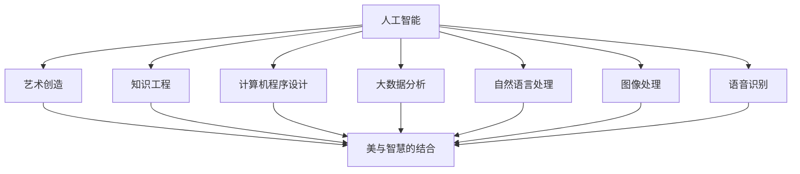

                 

# 人类的知识与艺术：美与智慧的结合

> 关键词：人工智能,计算机程序设计,知识工程,艺术创造,美与智慧的结合

## 1. 背景介绍

### 1.1 问题由来

在计算机技术飞速发展的今天，人工智能(AI)已经成为引领科技前沿的重要领域。从基础的机器学习到复杂的深度学习，再到目前备受瞩目的大模型，AI正在一步步跨越技术和伦理的边界，向更加智能化、自主化、个性化方向迈进。而在这个过程中，将人类的知识与艺术完美结合，不仅有助于提升AI系统的表现力，还能使其更好地服务于人类的生活和工作。

### 1.2 问题核心关键点

计算机程序设计的核心在于处理数据和实现逻辑，而知识工程则强调利用人工智能技术来提升知识获取、处理、应用的能力。艺术创造是人类表达情感、展现想象力、塑造美感的高级形式，它涉及感性认知、审美判断、情感表达等多个维度。将人工智能与艺术相结合，意味着在理解和处理数据的同时，还需要对美与智慧进行更深刻的思考和实现。

当前，AI与艺术结合的应用场景包括但不限于：自动作曲、图像生成、艺术作品分析、情感识别等。这些应用不仅展现了AI的强大能力，也为艺术的创作、传播、欣赏带来了新的可能。然而，要真正实现美与智慧的结合，还需要深入理解AI和艺术的本质，并在此基础上进行创新和实践。

### 1.3 问题研究意义

研究计算机程序设计在艺术创作中的作用，探讨如何通过AI技术实现美与智慧的结合，对于提升人工智能系统的表现力、拓展其应用场景、丰富人类文化生活具有重要意义：

1. **提升表现力**：AI在艺术创作中的应用，可以突破传统艺术的创作局限，实现更复杂、更个性化、更具创意的作品。
2. **拓展应用场景**：将AI技术应用于艺术领域，可以开辟更多新应用，如艺术作品的自动生成、风格迁移、艺术创作辅助等。
3. **丰富文化生活**：AI与艺术的结合，有助于提升大众的审美水平和艺术修养，推动文化艺术的发展。
4. **促进科技与艺术融合**：AI在艺术中的应用，可以促进科技与艺术的深度融合，推动新一轮技术革命。
5. **带来新视角**：AI和艺术结合，可以提供新的创作和欣赏视角，为人类文化多样性带来新的维度。

## 2. 核心概念与联系

### 2.1 核心概念概述

为了更好地理解AI与艺术结合的原理和实践，本节将介绍几个关键概念：

- **人工智能**：指通过算法和计算处理数据，以实现智能行为的计算机系统。AI涵盖了从机器学习到深度学习，再到当前热门的大模型的不同阶段。
- **计算机程序设计**：指通过编写、调试和测试代码，实现特定功能的过程。程序设计强调逻辑清晰、结构紧凑、可维护性高。
- **知识工程**：指通过知识获取、知识表示、知识推理等技术，实现对知识的获取、处理和应用。知识工程旨在构建能够理解人类语言和知识的知识系统。
- **艺术创造**：指通过创作活动，表达情感、展现想象力、塑造美感的过程。艺术创作涉及感性认知、审美判断、情感表达等多个维度。
- **美与智慧的结合**：指在艺术创作中，将计算机程序设计的逻辑与艺术创造的感性相结合，实现更具创意、更具智慧的艺术作品。

这些概念之间的联系可以通过以下Mermaid流程图来展示：



这个流程图展示了人工智能、计算机程序设计、知识工程、艺术创造以及美与智慧结合之间的关系：

1. 人工智能和计算机程序设计是技术基础，知识工程将AI与知识结合，艺术创造则关注情感与美的表达。
2. 大数据分析和自然语言处理是AI的重要工具，帮助从海量数据中获取知识和理解语言。
3. 图像处理和语音识别是AI在视觉和听觉领域的拓展，进一步丰富了艺术创作的表现形式。

## 3. 核心算法原理 & 具体操作步骤
### 3.1 算法原理概述

AI与艺术结合的核心在于如何通过计算和算法，实现艺术创作中的逻辑和感性。这涉及到以下几个方面：

- **数据处理**：AI需要处理大量的图像、音频、文本等数据，以获取创作所需的信息。
- **逻辑推理**：通过算法实现对数据的逻辑处理和分析，找出其中的规律和模式。
- **情感表达**：AI需要具备情感识别和表达能力，以创作出具有情感共鸣的作品。
- **创意生成**：AI需要具备生成创意的能力，能够自主创作出新颖、独特的艺术作品。

### 3.2 算法步骤详解

基于上述原理，AI与艺术结合的算法步骤主要包括：

1. **数据获取**：从互联网、艺术作品库、用户创作等渠道获取艺术创作所需的数据。
2. **预处理**：对获取的数据进行清洗、标注、转换等处理，以便后续分析使用。
3. **模型训练**：利用计算机程序设计的技术，训练AI模型，使其具备处理数据、逻辑推理、情感表达和创意生成的能力。
4. **创作过程**：使用训练好的AI模型，结合用户的输入和已有的数据，自动生成艺术作品。
5. **反馈优化**：根据用户的反馈和评价，不断优化AI模型的性能，提升创作质量。

### 3.3 算法优缺点

AI与艺术结合的算法具有以下优点：

- **效率高**：AI可以自动处理大量数据，快速生成艺术作品，提升创作效率。
- **多样化**：AI能够创作出传统艺术难以实现的多样化、个性化作品。
- **持续优化**：AI能够根据用户的反馈不断优化，提升创作质量。

同时，也存在一些缺点：

- **缺乏人情味**：AI创作的艺术作品可能缺乏人类情感的深度和复杂性。
- **创新受限**：AI的创作能力受限于已有数据和模型的理解，可能难以突破现有的艺术形式。
- **伦理争议**：AI生成的艺术作品可能引发版权、抄袭等伦理问题。
- **技术依赖**：AI创作依赖于技术和算法，需要持续投入资源进行研发和优化。

### 3.4 算法应用领域

AI与艺术结合的算法已经广泛应用于多个领域，例如：

- **自动作曲**：利用AI生成音乐作品，如Google Magenta、AIVA等。
- **图像生成**：利用GAN、VQ-VAE等生成艺术图像，如DeepArt、Artbreeder等。
- **艺术作品分析**：利用图像识别、情感分析等技术，分析艺术作品的风格、情感等特征，如Kaggle上的艺术作品分析竞赛。
- **艺术创作辅助**：利用AI提供创作灵感、风格迁移、色彩搭配等辅助工具，如Adobe Sensei、Prisma等。
- **虚拟现实艺术**：利用AI生成的虚拟艺术作品，结合虚拟现实技术，提供沉浸式体验，如Tilt Brush、The Next Rembrandt等。

## 4. 数学模型和公式 & 详细讲解 & 举例说明

### 4.1 数学模型构建

为了更好地理解AI与艺术结合的算法，本节将通过数学语言进行更加严格的刻画。

设艺术作品为 $A=\{a_i\}_{i=1}^N$，其中 $a_i$ 表示作品的第 $i$ 个特征（如颜色、形状、风格等）。设目标创作的作品为 $A'$，目标创作的特征为 $a_i'$。AI的目标是通过对艺术作品 $A$ 进行处理，生成与 $A'$ 相似的创作作品 $A'$。

### 4.2 公式推导过程

以图像生成为例，AI生成艺术图像的过程可以分解为以下几个步骤：

1. **数据编码**：将艺术作品 $A$ 编码为向量 $\mathbf{x}$。
2. **风格迁移**：对向量 $\mathbf{x}$ 进行风格迁移，得到风格迁移后的向量 $\mathbf{x'}$。
3. **生成图像**：将向量 $\mathbf{x'}$ 解码为图像 $A'$。

其中，风格迁移可以表示为：

$$
\mathbf{x'} = f(\mathbf{x}, \theta)
$$

其中 $f$ 表示风格迁移函数，$\theta$ 表示风格迁移网络的参数。生成图像的过程可以表示为：

$$
\mathbf{y} = g(\mathbf{x'}, \phi)
$$

其中 $g$ 表示图像生成函数，$\phi$ 表示图像生成网络的参数。

### 4.3 案例分析与讲解

以Google Magenta为例，其自动作曲的算法主要包括以下几个步骤：

1. **数据采集**：收集大量的音乐数据，包括古典、流行、爵士等不同类型的音乐作品。
2. **特征提取**：从音乐作品中提取旋律、节奏、和声等特征，编码为向量。
3. **模型训练**：使用循环神经网络（RNN）或卷积神经网络（CNN）等模型，训练生成音乐作品的算法。
4. **音乐生成**：根据用户的输入指令或随机生成的种子，使用训练好的模型生成新的音乐作品。
5. **优化调整**：根据用户的反馈，不断优化模型参数，提升音乐创作的质量。

## 5. 项目实践：代码实例和详细解释说明

### 5.1 开发环境搭建

在进行AI与艺术结合的实践前，我们需要准备好开发环境。以下是使用Python进行TensorFlow开发的环境配置流程：

1. 安装Anaconda：从官网下载并安装Anaconda，用于创建独立的Python环境。
2. 创建并激活虚拟环境：
```bash
conda create -n tensorflow-env python=3.8 
conda activate tensorflow-env
```
3. 安装TensorFlow：根据CUDA版本，从官网获取对应的安装命令。例如：
```bash
conda install tensorflow==2.6 -c tf -c conda-forge
```
4. 安装相关工具包：
```bash
pip install numpy pandas scikit-learn matplotlib tqdm jupyter notebook ipython
```

完成上述步骤后，即可在`tensorflow-env`环境中开始项目实践。

### 5.2 源代码详细实现

这里我们以GAN生成艺术图像为例，给出使用TensorFlow实现图像生成的代码实现。

```python
import tensorflow as tf
from tensorflow.keras import layers

# 定义生成器
def make_generator_model():
    model = tf.keras.Sequential()
    model.add(layers.Dense(7*7*256, use_bias=False, input_shape=(100,)))
    model.add(layers.BatchNormalization())
    model.add(layers.LeakyReLU())

    model.add(layers.Reshape((7, 7, 256)))
    assert model.output_shape == (None, 7, 7, 256)  # Note: None is the batch dimension

    model.add(layers.Conv2DTranspose(128, (5, 5), strides=(1, 1), padding='same', use_bias=False))
    assert model.output_shape == (None, 7, 7, 128)
    model.add(layers.BatchNormalization())
    model.add(layers.LeakyReLU())

    model.add(layers.Conv2DTranspose(64, (5, 5), strides=(2, 2), padding='same', use_bias=False))
    assert model.output_shape == (None, 14, 14, 64)
    model.add(layers.BatchNormalization())
    model.add(layers.LeakyReLU())

    model.add(layers.Conv2DTranspose(1, (5, 5), strides=(2, 2), padding='same', use_bias=False, activation='tanh'))
    assert model.output_shape == (None, 28, 28, 1)

    return model

# 定义判别器
def make_discriminator_model():
    model = tf.keras.Sequential()
    model.add(layers.Conv2D(64, (5, 5), strides=(2, 2), padding='same',
                           input_shape=[28, 28, 1]))
    model.add(layers.LeakyReLU())
    model.add(layers.Dropout(0.3))

    model.add(layers.Conv2D(128, (5, 5), strides=(2, 2), padding='same'))
    model.add(layers.LeakyReLU())
    model.add(layers.Dropout(0.3))

    model.add(layers.Flatten())
    model.add(layers.Dense(1))

    return model

# 定义损失函数
cross_entropy = tf.keras.losses.BinaryCrossentropy(from_logits=True)

def discriminator_loss(real_output, fake_output):
    real_loss = cross_entropy(tf.ones_like(real_output), real_output)
    fake_loss = cross_entropy(tf.zeros_like(fake_output), fake_output)
    total_loss = real_loss + fake_loss
    return total_loss

def generator_loss(fake_output):
    return cross_entropy(tf.ones_like(fake_output), fake_output)

# 定义优化器
generator_optimizer = tf.keras.optimizers.Adam(1e-4)
discriminator_optimizer = tf.keras.optimizers.Adam(1e-4)

# 定义模型
generator = make_generator_model()
discriminator = make_discriminator_model()

# 训练过程
def train_step(images):
    noise = tf.random.normal([BATCH_SIZE, 100])

    with tf.GradientTape() as gen_tape, tf.GradientTape() as disc_tape:
        generated_images = generator(noise, training=True)

        real_output = discriminator(images, training=True)
        fake_output = discriminator(generated_images, training=True)

        gen_loss = generator_loss(fake_output)
        disc_loss = discriminator_loss(real_output, fake_output)

    gradients_of_generator = gen_tape.gradient(gen_loss, generator.trainable_variables)
    gradients_of_discriminator = disc_tape.gradient(disc_loss, discriminator.trainable_variables)

    generator_optimizer.apply_gradients(zip(gradients_of_generator, generator.trainable_variables))
    discriminator_optimizer.apply_gradients(zip(gradients_of_discriminator, discriminator.trainable_variables))
```

### 5.3 代码解读与分析

让我们再详细解读一下关键代码的实现细节：

- **make_generator_model函数**：定义生成器的网络结构。
- **make_discriminator_model函数**：定义判别器的网络结构。
- **discriminator_loss函数**：定义判别器的损失函数，使用二分类交叉熵损失。
- **generator_loss函数**：定义生成器的损失函数，使用二分类交叉熵损失。
- **train_step函数**：定义训练过程，包含生成器和判别器的前向传播和反向传播。

**图像生成过程**：

1. **生成器**：从随机噪声开始，逐步生成图像。
2. **判别器**：对真实图像和生成图像进行分类，判断其真实性。
3. **优化器**：根据损失函数的梯度，调整生成器和判别器的参数。

## 6. 实际应用场景

### 6.1 自动作曲

在自动作曲方面，AI可以通过学习音乐作品的结构、风格和情感特征，自动生成新的音乐作品。例如，Google Magenta项目通过分析大量的音乐作品，训练生成新音乐的模型，并支持用户通过输入不同的创意种子，生成风格各异的音乐作品。

### 6.2 图像生成

AI在图像生成方面也有广泛应用。GAN等模型能够学习大量的图像数据，生成风格多样、分辨率高、细节丰富的图像作品。例如，DeepArt项目利用GAN技术，将用户上传的图片转换成艺术风格的作品，提供丰富的艺术创作体验。

### 6.3 艺术作品分析

AI在艺术作品分析方面也有重要应用。通过对艺术作品进行图像识别、情感分析等技术处理，AI可以自动识别出作品的风格、情感倾向、创作年代等信息，帮助艺术家和爱好者更好地欣赏和理解艺术作品。例如，Kaggle上的艺术作品分析竞赛，要求参赛者利用机器学习模型，对艺术作品进行分类、风格识别等任务。

### 6.4 未来应用展望

随着AI与艺术结合的不断深入，未来的应用场景将更加多样，可能包括：

- **虚拟现实艺术**：结合虚拟现实技术，提供沉浸式的艺术体验，如Tilt Brush、The Next Rembrandt等项目。
- **情感驱动的艺术创作**：通过分析用户情感，生成具有情感共鸣的艺术作品，如情绪驱动的音乐生成、情感驱动的图像生成等。
- **跨文化艺术创作**：利用AI对不同文化背景的艺术作品进行分析和理解，生成具有跨文化特色的艺术作品，促进文化交流和理解。
- **艺术作品修复和再创造**：利用AI技术对损坏的艺术作品进行修复，或通过分析和理解，再创造全新的艺术作品，如Ner殷渊斗的“图灵像”项目。

## 7. 工具和资源推荐

### 7.1 学习资源推荐

为了帮助开发者系统掌握AI与艺术结合的理论基础和实践技巧，这里推荐一些优质的学习资源：

1. **《TensorFlow从入门到精通》系列博文**：由TensorFlow官方和社区专家撰写，介绍了TensorFlow的基本用法和深度学习应用。
2. **《深度学习》课程**：斯坦福大学开设的深度学习课程，有Lecture视频和配套作业，帮助初学者系统入门深度学习。
3. **《艺术与技术》书籍**：全面介绍了AI在艺术领域的应用，涵盖了音乐、绘画、影视等多个领域。
4. **Google Magenta项目**：由Google主导的自动作曲和音乐生成项目，提供了丰富的代码和文档，适合学习自动作曲和音乐生成。
5. **DeepArt项目**：利用GAN生成艺术图像的项目，提供了详细的实现文档和示例代码，适合学习图像生成。

通过对这些资源的学习实践，相信你一定能够快速掌握AI与艺术结合的精髓，并用于解决实际的AI与艺术结合问题。

### 7.2 开发工具推荐

高效的开发离不开优秀的工具支持。以下是几款用于AI与艺术结合开发的常用工具：

1. **TensorFlow**：由Google主导开发的深度学习框架，提供了丰富的API和工具，适合各种规模的深度学习项目。
2. **PyTorch**：由Facebook开发的深度学习框架，提供了灵活的动态计算图和强大的GPU支持，适合研究和实验性项目。
3. **Keras**：基于TensorFlow和Theano等框架的高层API，提供了简单易用的API，适合初学者和快速原型开发。
4. **Jupyter Notebook**：基于IPython的交互式编程环境，支持Python、R、Scala等多种语言，适合数据科学和机器学习项目。
5. **GitHub**：全球最大的代码托管平台，支持版本控制、协作开发、代码共享等功能，适合团队协作开发。

合理利用这些工具，可以显著提升AI与艺术结合项目的开发效率，加快创新迭代的步伐。

### 7.3 相关论文推荐

AI与艺术结合的研究源于学界的持续研究。以下是几篇奠基性的相关论文，推荐阅读：

1. **Generative Adversarial Nets**（GAN论文）：提出GAN模型，利用生成器和判别器相互博弈，生成高保真度的图像。
2. **Auto-Encoding Variational Bayes**（VAE论文）：提出VAE模型，利用变分推断技术，生成具有连续性、多样性的图像。
3. **Art and Computational Creativity**：总结了AI在艺术创作中的应用，探讨了计算创造力的未来发展方向。
4. **Art by Computer**：介绍了AI在音乐、绘画、雕塑等多个领域的艺术创作应用，提供了丰富的案例和分析。
5. **DeepArt for Everyone**：描述了DeepArt项目的技术实现和应用效果，展示了AI在图像生成方面的巨大潜力。

这些论文代表了大模型微调技术的发展脉络。通过学习这些前沿成果，可以帮助研究者把握学科前进方向，激发更多的创新灵感。

## 8. 总结：未来发展趋势与挑战

### 8.1 总结

本文对AI与艺术结合的方法进行了全面系统的介绍。首先阐述了AI和艺术结合的研究背景和意义，明确了AI在艺术创作中的独特价值。其次，从原理到实践，详细讲解了AI与艺术结合的数学原理和关键步骤，给出了AI与艺术结合任务开发的完整代码实例。同时，本文还广泛探讨了AI与艺术结合在音乐、图像、分析等多个领域的应用前景，展示了AI与艺术结合的广阔前景。

通过本文的系统梳理，可以看到，AI与艺术结合的技术正在成为AI应用的重要范式，极大地拓展了AI系统的表现力，催生了更多的落地场景。未来，伴随AI技术的不断发展，AI与艺术的结合必将带来更多的创新和突破，为人类文化的多样性带来新的维度。

### 8.2 未来发展趋势

展望未来，AI与艺术结合技术将呈现以下几个发展趋势：

1. **数据驱动的艺术创作**：随着数据量的不断增加，AI将能够创作出更加多样、更加复杂的艺术作品。
2. **交互式艺术创作**：通过AI技术，用户可以实时参与到艺术创作过程中，生成具有个性化和互动性的艺术作品。
3. **跨领域艺术创作**：AI与多领域技术的结合，将生成更多具有跨学科特色的艺术作品，推动艺术创作的多样化发展。
4. **个性化艺术创作**：AI能够根据用户的喜好和需求，生成个性化的艺术作品，提升用户体验。
5. **艺术教育的智能化**：AI将能够辅助艺术教育，提供个性化指导和反馈，提升艺术学习的效率和质量。

### 8.3 面临的挑战

尽管AI与艺术结合技术已经取得了瞩目成就，但在迈向更加智能化、普适化应用的过程中，它仍面临着诸多挑战：

1. **数据瓶颈**：创作艺术作品需要大量的高质量数据，数据获取和标注的难度较大，可能会限制AI的创作能力。
2. **技术局限**：现有技术在处理复杂、高难度艺术创作时，可能存在一定的局限性，无法实现某些特定的艺术形式。
3. **伦理问题**：AI创作的艺术作品可能引发版权、知识产权等伦理问题，需要合理解决。
4. **人类情感的表达**：AI难以完全理解和表达人类的情感，可能创作出缺乏情感共鸣的作品。
5. **用户交互**：AI创作的艺术作品可能缺乏与用户的互动，无法实现真正的“交互式艺术”。
6. **人工智能的局限性**：AI在处理复杂、高难度艺术创作时，可能存在一定的局限性，无法实现某些特定的艺术形式。

### 8.4 研究展望

面对AI与艺术结合所面临的挑战，未来的研究需要在以下几个方面寻求新的突破：

1. **数据增强**：通过数据增强技术，生成更多的训练数据，提升AI的创作能力。
2. **模型优化**：优化AI模型的结构和算法，提升其在复杂、高难度艺术创作中的应用能力。
3. **伦理框架**：建立合理的伦理框架，解决AI创作的艺术作品的版权、知识产权等问题。
4. **情感理解**：研究如何通过深度学习技术，增强AI对人类情感的理解和表达能力，创作出更具情感共鸣的作品。
5. **用户交互**：开发更加智能化的交互系统，提升用户的艺术创作体验。

## 9. 附录：常见问题与解答

**Q1：AI创作艺术作品是否具有版权？**

A: AI创作的艺术作品，在法律上可能会面临版权归属的问题。一般情况下，如果AI创作是基于人类已有作品的数据训练和生成，则该作品的版权属于原作品的创作者。然而，如果AI创作是基于原创数据和算法生成的全新作品，则该作品的版权可能属于算法开发者或使用者。

**Q2：AI与艺术结合的算法如何处理复杂情感？**

A: AI处理复杂情感的能力取决于其数据和模型的理解深度。为了增强AI对情感的理解和表达能力，可以通过数据增强、情感标注等方法，提升AI在情感识别和生成方面的能力。同时，结合心理学、社会学等领域的知识，引导AI创作出更具情感共鸣的作品。

**Q3：如何确保AI创作的艺术作品具有创造性？**

A: 确保AI创作的艺术作品具有创造性，需要不断优化AI模型，增强其对不同艺术形式和创作风格的理解能力。同时，可以通过人工干预和审查，确保AI创作的艺术作品具有独创性和创新性。

**Q4：AI创作的艺术作品如何融入文化传承？**

A: AI创作的艺术作品可以通过结合传统文化元素、符号、故事等，融入文化传承。同时，通过分析和学习传统艺术作品，AI能够更好地理解和学习文化背景，创作出更具文化特色的艺术作品。

**Q5：AI与艺术结合的算法如何适应多文化背景？**

A: AI与艺术结合的算法需要考虑多文化背景下的数据和风格差异。通过跨文化数据集和多语言标注，AI能够更好地适应不同文化背景下的艺术创作需求。同时，结合跨文化的研究和理解，引导AI创作出具有文化包容性的艺术作品。

总之，AI与艺术结合的技术将为人类艺术创作带来新的可能和突破。通过不断的技术创新和优化，相信AI将能够创作出更多富有创意和美感的艺术作品，推动人类文化的多样性和发展。

---

作者：禅与计算机程序设计艺术 / Zen and the Art of Computer Programming

