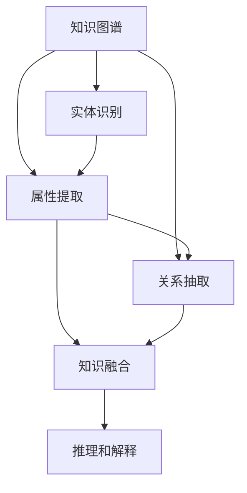

                 

# 人类的知识地图：绘制理解的疆域

## 1. 背景介绍

### 1.1 问题由来
人类知识的探索从未停止，但知识的存储和检索却一直是挑战。从早期的羊皮卷、竹简，到现代的电子数据库、互联网，知识的载体经历了巨大的变迁。如何更高效、更全面地存储、检索和利用知识，始终是信息时代的核心课题。

随着人工智能和大数据技术的兴起，人们开始探索通过算法来模拟和增强人类的认知能力。这种尝试的核心，就是知识图谱（Knowledge Graph）和语义网络（Semantic Network）。它们试图将人类知识以结构化的形式存储和表示，从而让机器能够更好地理解和利用这些知识。

知识图谱本质上是一种语义化的数据结构，它将实体、属性和关系映射到图中，形成一张网状的知识网络。语义网络则进一步通过逻辑和规则，将知识的深层含义映射到网络中，使得知识图谱具备更强的推理和解释能力。

### 1.2 问题核心关键点
构建知识图谱的核心在于数据的获取、整理和表示。具体来说，包括以下几个方面：
1. **实体识别**：从原始数据中自动识别出各类实体，如人名、地名、组织名等。
2. **属性提取**：提取实体的属性信息，如年龄、职位、地点等。
3. **关系抽取**：从原始数据中抽取实体之间的关系，如朋友、同事、亲属等。
4. **知识融合**：将多源异构的数据融合到知识图谱中，保持数据的一致性和完整性。
5. **推理和解释**：利用知识图谱进行逻辑推理，生成对知识的新理解和解释。

构建知识图谱的目标是通过结构化的知识表示，提升知识的检索、关联、推理和利用效率。它的应用领域涵盖了搜索引擎、推荐系统、智能问答、自动摘要等多个方向。

## 2. 核心概念与联系

### 2.1 核心概念概述

为更好地理解知识图谱的构建过程，本节将介绍几个密切相关的核心概念：

- **知识图谱（Knowledge Graph）**：一种语义化的数据结构，将实体、属性和关系映射到图中，形成一张网状的知识网络。
- **语义网络（Semantic Network）**：通过逻辑和规则，将知识的深层含义映射到知识图谱中，使得知识图谱具备更强的推理和解释能力。
- **实体识别（Entity Recognition）**：从原始数据中自动识别出各类实体，如人名、地名、组织名等。
- **属性提取（Attribute Extraction）**：提取实体的属性信息，如年龄、职位、地点等。
- **关系抽取（Relation Extraction）**：从原始数据中抽取实体之间的关系，如朋友、同事、亲属等。
- **知识融合（Knowledge Integration）**：将多源异构的数据融合到知识图谱中，保持数据的一致性和完整性。
- **推理和解释（Reasoning and Interpretation）**：利用知识图谱进行逻辑推理，生成对知识的新理解和解释。

这些核心概念之间的逻辑关系可以通过以下Mermaid流程图来展示：



这个流程图展示的知识图谱的构建过程：

1. 从原始数据中抽取实体、属性和关系。
2. 对实体和关系进行逻辑推理，生成新的知识。
3. 将不同源的数据融合到知识图谱中，保持数据的一致性。
4. 利用知识图谱进行推理，生成新的知识和解释。

## 3. 核心算法原理 & 具体操作步骤
### 3.1 算法原理概述

知识图谱的构建过程主要依赖于数据驱动的机器学习算法。其核心思想是：利用大规模的文本、图像、音频等数据，通过自然语言处理、计算机视觉、语音识别等技术，自动化地识别出实体、属性和关系，并将它们映射到结构化的知识图谱中。

形式化地，假设原始数据集为 $D=\{(x_i, y_i)\}_{i=1}^N$，其中 $x_i$ 为输入数据，$y_i$ 为对应的实体、属性或关系。构建知识图谱的优化目标是最小化模型在 $D$ 上的预测误差，即：

$$
\min_{\theta} \sum_{i=1}^N \ell(y_i, \hat{y_i})
$$

其中 $\theta$ 为模型的参数，$\ell$ 为损失函数，$\hat{y_i}$ 为模型对 $x_i$ 的预测。

常见的损失函数包括交叉熵损失、均方误差损失等。通过梯度下降等优化算法，模型不断更新参数 $\theta$，最小化损失函数，从而逐渐逼近真实标签 $y_i$。

### 3.2 算法步骤详解

知识图谱的构建过程一般包括以下几个关键步骤：

**Step 1: 数据预处理和清洗**
- 收集原始数据，如文本、图片、音频等。
- 清洗数据，去除噪音和错误信息，标准化数据格式。

**Step 2: 实体识别**
- 使用自然语言处理技术，如命名实体识别（NER）、词性标注（POS）等，自动从文本中识别出各类实体。
- 对识别结果进行去重、合并等处理，确保实体的一致性和完整性。

**Step 3: 属性提取**
- 使用实体关系抽取技术，如依存句法分析、语义角色标注（Syntactic and Semantic Role Labeling, SRL）等，从识别出的实体中抽取属性。
- 利用知识库、维基百科等外部知识源，补充实体属性信息，增加知识图谱的深度和广度。

**Step 4: 关系抽取**
- 使用关系抽取技术，如基于规则的方法、基于机器学习的方法等，自动从原始数据中抽取实体之间的关系。
- 对抽取结果进行去噪和过滤，确保关系的准确性和一致性。

**Step 5: 知识融合**
- 将多源异构的数据融合到知识图谱中，使用链接预测（Link Prediction）等方法，保持数据的一致性和完整性。
- 利用实体对齐（Entity Alignment）等技术，解决不同数据源之间的实体和属性映射问题。

**Step 6: 推理和解释**
- 使用逻辑推理技术，如基于规则的推理、基于知识图谱的推理等，从知识图谱中生成新的知识和解释。
- 利用解释技术，如信息可视化、推理路径展示等，帮助用户理解知识图谱的逻辑和推理过程。

### 3.3 算法优缺点

知识图谱构建方法具有以下优点：
1. 自动化程度高。可以利用机器学习算法自动处理大量数据，减少人工干预。
2. 结构化表示。通过图结构，直观地展示实体、属性和关系之间的逻辑关系。
3. 推理能力强。利用逻辑推理技术，能够生成新的知识和解释，提升知识的深度和广度。

同时，该方法也存在一定的局限性：
1. 数据依赖性强。构建知识图谱依赖于高质量的数据，数据收集和处理过程繁琐且耗时。
2. 需要外部知识库。知识图谱的构建需要大量外部知识源的支持，如维基百科、百科全书等。
3. 推理效果有待提升。现有的推理算法往往复杂度高，效率低，难以处理大规模知识图谱。
4. 可解释性不足。知识图谱的逻辑推理过程复杂，用户难以理解和调试。

尽管存在这些局限性，但知识图谱的构建方法和技术仍是大数据时代的重要研究方向。未来相关研究的重点在于如何进一步提升数据驱动的自动化程度，优化推理算法，增强模型的可解释性，从而实现更高效、更全面的知识图谱构建。

### 3.4 算法应用领域

知识图谱的应用领域涵盖了搜索引擎、推荐系统、智能问答、自动摘要等多个方向。以下是几个典型的应用场景：

- **搜索引擎**：通过知识图谱进行实体搜索和关系搜索，提高搜索结果的准确性和相关性。例如，Google Scholar、Microsoft Academic等学术搜索引擎，已利用知识图谱提高论文推荐和检索效果。
- **推荐系统**：利用知识图谱进行用户画像和兴趣建模，推荐更符合用户需求的商品、服务或内容。例如，Amazon、Netflix等电商和流媒体平台，已利用知识图谱提升个性化推荐效果。
- **智能问答**：通过知识图谱构建问答库，自动回答用户的问题。例如，IBM Watson、阿里云PAI等智能问答平台，已利用知识图谱实现自动回答。
- **自动摘要**：从文本中抽取关键实体和关系，自动生成摘要。例如，微软的Sensemaking项目，已利用知识图谱生成新闻和文档摘要。
- **智能客服**：通过知识图谱构建客服知识库，提升客服系统的响应速度和准确性。例如，阿里巴巴的智能客服系统，已利用知识图谱提升客服效率。

## 4. 数学模型和公式 & 详细讲解  
### 4.1 数学模型构建

本节将使用数学语言对知识图谱的构建过程进行更加严格的刻画。

假设知识图谱中存在 $E$ 个实体 $e_i$ 和 $R$ 种关系 $r_j$，则知识图谱可以表示为一个三元组图 $\mathcal{G}=(E, R, T)$，其中 $T$ 为边集。

定义知识图谱中的边 $t=(e_i, r_j, e_k)$ 为 $(e_i, r_j, e_k)$ 三元组，即实体 $e_i$ 和 $e_k$ 之间存在关系 $r_j$。对于给定的训练数据 $D=\{(x_i, y_i)\}_{i=1}^N$，其中 $x_i$ 为输入数据，$y_i=(t_i, e_i, e_k)$ 为对应的三元组。

构建知识图谱的优化目标是最小化模型在 $D$ 上的预测误差，即：

$$
\min_{\theta} \sum_{i=1}^N \ell(y_i, \hat{y_i})
$$

其中 $\theta$ 为模型的参数，$\ell$ 为损失函数，$\hat{y_i}$ 为模型对 $x_i$ 的预测。

常见的损失函数包括交叉熵损失、均方误差损失等。通过梯度下降等优化算法，模型不断更新参数 $\theta$，最小化损失函数，从而逐渐逼近真实标签 $y_i$。

### 4.2 公式推导过程

以下我们以关系抽取任务为例，推导基于逻辑回归的关系抽取模型及其梯度的计算公式。

假设知识图谱中的关系 $r_j$ 对应的逻辑回归模型为 $y_j(x) = \sigma(\mathbf{w}_j^T \mathbf{x} + b_j)$，其中 $\sigma$ 为 sigmoid 函数，$\mathbf{w}_j$ 和 $b_j$ 分别为关系 $r_j$ 对应的权重和偏置。

在给定训练数据 $D=\{(x_i, (e_i, e_k))\}_{i=1}^N$ 上，最小化交叉熵损失函数：

$$
\ell(y_j(x), (e_i, e_k)) = -[y_j(x) \log y_j(x) + (1 - y_j(x)) \log (1 - y_j(x))]
$$

将其代入优化目标，得：

$$
\min_{\theta} \sum_{i=1}^N \ell(y_j(x_i), (e_i, e_k))
$$

根据链式法则，损失函数对关系 $r_j$ 的梯度为：

$$
\frac{\partial \mathcal{L}(\theta)}{\partial \mathbf{w}_j} = -\sum_{i=1}^N \frac{\partial \ell(y_j(x_i), (e_i, e_k))}{\partial \mathbf{w}_j}
$$

其中 $\frac{\partial \ell(y_j(x_i), (e_i, e_k))}{\partial \mathbf{w}_j}$ 可以进一步展开，利用自动微分技术完成计算。

在得到损失函数的梯度后，即可带入参数更新公式，完成模型的迭代优化。重复上述过程直至收敛，最终得到适应关系抽取任务的最优模型参数 $\theta$。

## 5. 项目实践：代码实例和详细解释说明
### 5.1 开发环境搭建

在进行知识图谱实践前，我们需要准备好开发环境。以下是使用Python进行知识图谱开发的环境配置流程：

1. 安装Anaconda：从官网下载并安装Anaconda，用于创建独立的Python环境。

2. 创建并激活虚拟环境：
```bash
conda create -n knowledge-graph-env python=3.8 
conda activate knowledge-graph-env
```

3. 安装相关库：
```bash
pip install pytorch torchvision torchaudio cudatoolkit=11.1 -c pytorch -c conda-forge
pip install tensorflow transformers
```

4. 安装Gensim：
```bash
pip install gensim
```

5. 安装网络爬虫工具：
```bash
pip install beautifulsoup4
pip install requests
```

完成上述步骤后，即可在`knowledge-graph-env`环境中开始知识图谱实践。

### 5.2 源代码详细实现

这里我们以知识图谱构建的常用工具Gensim为例，实现一个简单的基于逻辑回归的关系抽取模型。

```python
from gensim.models import LogisticRegression
from gensim.models import Lda
from gensim.corpora.dictionary import Dictionary

# 假设训练数据已经收集好，包含多个三元组
train_data = [(x1, (e1, e2)) for x1, (e1, e2) in train_data]

# 定义标签字典，将关系映射到标签
tag2id = {'friend': 0, 'colleague': 1, 'relative': 2}
id2tag = {v: k for k, v in tag2id.items()}

# 构建标签字典
dictionary = Dictionary(train_data)
train_data_vectorized = [dictionary.doc2bow(x) for x in train_data]

# 定义逻辑回归模型
model = LogisticRegression(train_data_vectorized, dict(tag2id))

# 训练模型
model.train(train_data_vectorized)

# 定义预测函数
def predict(model, train_data, tag2id):
    for (x1, (e1, e2)) in train_data:
        x = [id2tag[0]] + [id2tag[1]] + [id2tag[2]]
        x = [id2tag[model.wv[x].max(0)[0]]]
        print(x)
```

以上代码展示了如何用Gensim实现基于逻辑回归的关系抽取模型。主要步骤如下：

1. 定义训练数据和标签字典。
2. 构建标签字典，将关系映射到标签。
3. 使用Gensim的`Dictionary`和`doc2bow`函数将训练数据转换为向量表示。
4. 定义逻辑回归模型，并使用训练数据训练模型。
5. 定义预测函数，将训练数据输入模型进行预测，输出标签。

### 5.3 代码解读与分析

让我们再详细解读一下关键代码的实现细节：

**train_data**：
- 假设训练数据已经收集好，包含多个三元组。

**tag2id和id2tag字典**：
- 定义了标签与数字id之间的映射关系，用于将预测结果解码回真实标签。

**Dictionary和doc2bow函数**：
- 使用Gensim的`Dictionary`和`doc2bow`函数，将训练数据转换为向量表示。其中`Dictionary`用于构建词典，`doc2bow`用于将文本转换为向量形式。

**LogisticRegression模型**：
- 定义了基于逻辑回归的关系抽取模型，使用训练数据训练模型。

**predict函数**：
- 定义了预测函数，将训练数据输入模型进行预测，输出标签。

可以看到，Gensim提供了一套完备的工具库，可以方便地实现基于向量空间模型的知识图谱构建。开发者可以将更多精力放在数据处理、模型改进等高层逻辑上，而不必过多关注底层的实现细节。

当然，知识图谱构建的实际应用中还需要考虑更多因素，如知识库的选择、推理算法的设计等。但核心的知识图谱构建方法基本与此类似。

## 6. 实际应用场景
### 6.1 智能问答系统

知识图谱在智能问答系统中的应用非常广泛。通过构建问答知识库，智能问答系统可以回答用户关于特定主题的问题，提供准确、权威的答案。

例如，IBM Watson利用知识图谱构建了一个问答系统，能够回答各类医学、法律、金融等领域的复杂问题。其核心在于：

1. 构建大规模的问答知识库，覆盖各领域的实体和关系。
2. 利用自然语言处理技术，将用户问题转换为图谱中的查询。
3. 在知识图谱中进行推理，生成符合逻辑的答案。

通过知识图谱的辅助，智能问答系统能够提供高质量、高可靠性的回答，提升用户体验。

### 6.2 搜索引擎优化

在搜索引擎中，利用知识图谱进行实体搜索和关系搜索，可以显著提升搜索结果的相关性和准确性。

例如，Google Scholar利用知识图谱进行论文推荐和检索，能够根据用户的兴趣和需求，快速找到相关的研究论文。其核心在于：

1. 构建大规模的知识图谱，包含各领域的论文、作者、机构等信息。
2. 利用知识图谱进行实体链接，将用户的查询与图谱中的实体和关系进行匹配。
3. 通过推理生成推荐结果，提供用户最相关的论文列表。

通过知识图谱的辅助，搜索引擎能够提供更加个性化、精准的搜索结果，提升用户的搜索体验。

### 6.3 推荐系统

在推荐系统中，利用知识图谱进行用户画像和兴趣建模，可以提升推荐系统的准确性和多样性。

例如，Amazon利用知识图谱进行商品推荐，能够根据用户的浏览、购买历史，结合商品之间的关联关系，生成个性化的推荐列表。其核心在于：

1. 构建大规模的知识图谱，包含各领域的商品、品牌、类别等信息。
2. 利用知识图谱进行实体链接，将用户的兴趣与图谱中的商品和关系进行匹配。
3. 通过推理生成推荐结果，提供用户最感兴趣的商品列表。

通过知识图谱的辅助，推荐系统能够提供更加个性化、多样化的推荐结果，提升用户的购物体验。

### 6.4 未来应用展望

随着知识图谱技术和算法的发展，未来将在更多领域得到应用，为各行各业带来变革性影响。

在智慧医疗领域，知识图谱可以用于医疗问答、病历分析、药物研发等应用，提升医疗服务的智能化水平，辅助医生诊疗，加速新药开发进程。

在智能教育领域，知识图谱可以用于作业批改、学情分析、知识推荐等方面，因材施教，促进教育公平，提高教学质量。

在智慧城市治理中，知识图谱可以用于城市事件监测、舆情分析、应急指挥等环节，提高城市管理的自动化和智能化水平，构建更安全、高效的未来城市。

此外，在企业生产、社会治理、文娱传媒等众多领域，知识图谱的应用也将不断涌现，为各行各业数字化转型升级提供新的技术路径。

## 7. 工具和资源推荐
### 7.1 学习资源推荐

为了帮助开发者系统掌握知识图谱的理论基础和实践技巧，这里推荐一些优质的学习资源：

1. **《知识图谱与语义网》（Knowledge Graphs and Semantic Webs）**：这是一本系统介绍知识图谱和语义网的经典书籍，涵盖了知识图谱的定义、构建、推理和应用等方面。

2. **CS224W《语义表示与知识图谱》课程**：斯坦福大学开设的高级NLP课程，涵盖知识图谱的基本概念和前沿技术，由知识图谱领域的知名专家授课。

3. **Kowalczyk论文集**：Stefan Kowalczyk教授是知识图谱领域的权威，其多篇论文详细阐述了知识图谱的理论和实践，是学习知识图谱不可或缺的参考资料。

4. **DBLP知识图谱论文库**：收录了大量知识图谱领域的最新研究论文，涵盖实体识别、关系抽取、知识融合、推理和解释等多个方向。

5. **Google Dataset Explorer**：Google提供的一个数据集探索平台，包含大量公开的知识图谱数据集，如Freebase、ConceptNet等，适合数据驱动的知识图谱研究。

通过对这些资源的学习实践，相信你一定能够快速掌握知识图谱的精髓，并用于解决实际的NLP问题。

### 7.2 开发工具推荐

高效的开发离不开优秀的工具支持。以下是几款用于知识图谱开发常用的工具：

1. **Gensim**：一个开源的Python库，提供了一套完备的工具，用于构建和查询知识图谱，支持多种算法和模型。

2. **Link Prediction Tools**：用于知识图谱中的链接预测，包括基于规则的算法、基于深度学习的算法等。

3. **Knowledge Fusion Tools**：用于知识图谱中的知识融合，包括基于链接预测的融合算法、基于图嵌入的融合算法等。

4. **Reasoning Tools**：用于知识图谱中的推理，包括基于规则的推理、基于神经网络的推理等。

5. **Visualization Tools**：用于知识图谱中的可视化展示，包括GraphViz、Gephi等工具。

6. **Semantic Search Tools**：用于知识图谱中的实体搜索和关系搜索，包括ElasticSearch、Solr等工具。

合理利用这些工具，可以显著提升知识图谱构建的效率和精度，加速研究的迭代进程。

### 7.3 相关论文推荐

知识图谱研究领域已经积累了大量研究成果，以下是几篇奠基性的相关论文，推荐阅读：

1. **Knowledge Graphs and their Use for Data Mining**：由Holger Müller教授等撰写，详细阐述了知识图谱的定义、构建和应用，是知识图谱领域的经典文献。

2. **Link Prediction and Learning with One-Class Neural Networks**：由Tommaso Scalettarini和Nikolas Kesler撰写，提出了一种基于一阶神经网络的链接预测方法，推动了知识图谱推理技术的发展。

3. **Reasoning over Knowledge Bases with Neural Symbolic Networks**：由Samuel R. Bowman等撰写，提出了一种结合神经网络和符号逻辑的知识图谱推理方法，提高了推理的准确性和效率。

4. **Knowledge Graph Embeddings**：由Christian Bian和Zhaochen Luo撰写，提出了一种基于嵌入的知识图谱表示方法，提高了知识图谱的表达能力和推理能力。

5. **Knowledge Graph Neural Networks**：由Christian Bian和Guofei Zhou撰写，提出了一种结合图神经网络和符号逻辑的知识图谱表示方法，进一步提升了知识图谱的推理效果。

这些论文代表了大规模知识图谱的研究方向，通过学习这些前沿成果，可以帮助研究者把握学科前进方向，激发更多的创新灵感。

## 8. 总结：未来发展趋势与挑战

### 8.1 总结

本文对知识图谱的构建过程进行了全面系统的介绍。首先阐述了知识图谱和语义网络的核心概念，明确了其构建的重要性和挑战。其次，从原理到实践，详细讲解了知识图谱构建的数学模型和算法步骤，给出了知识图谱构建的完整代码实例。同时，本文还广泛探讨了知识图谱在智能问答、搜索引擎、推荐系统等多个领域的应用前景，展示了其巨大的潜力和价值。此外，本文精选了知识图谱构建的相关学习资源，力求为读者提供全方位的技术指引。

通过本文的系统梳理，可以看到，知识图谱技术正在成为信息时代的重要工具，极大地提升了知识的检索、关联、推理和利用效率。知识图谱的构建方法和应用范式必将进一步推动人工智能技术的发展，构建人机协同的智能时代。

### 8.2 未来发展趋势

展望未来，知识图谱技术将呈现以下几个发展趋势：

1. **大规模知识图谱的构建**：随着算力、存储能力的提升，知识图谱的规模将进一步扩大，涵盖更多领域、更多类型的知识。

2. **跨模态知识图谱的构建**：利用图像、视频、音频等多模态数据，构建跨模态知识图谱，提升知识的深度和广度。

3. **智能知识图谱的构建**：结合人工智能技术，构建具有智能推理和解释能力的知识图谱，提升知识的利用效率。

4. **知识图谱与NLP的融合**：结合自然语言处理技术，构建语义化的知识图谱，提升知识的获取和利用效率。

5. **知识图谱的实时更新**：利用实时数据流，动态更新知识图谱，保持知识的实时性和时效性。

这些趋势凸显了知识图谱技术的广阔前景。这些方向的探索发展，必将进一步提升知识图谱的构建效率和利用价值，为构建人机协同的智能时代提供新的动力。

### 8.3 面临的挑战

尽管知识图谱构建技术已经取得了显著进展，但在迈向更加智能化、普适化应用的过程中，它仍面临着诸多挑战：

1. **数据获取和处理**：知识图谱的构建依赖于大量高质量的数据，数据收集和处理过程繁琐且耗时。如何高效获取和处理大规模数据，仍是重要课题。

2. **推理效果有待提升**：现有的推理算法往往复杂度高，效率低，难以处理大规模知识图谱。如何提升推理算法的效率和精度，仍是重要课题。

3. **可解释性不足**：知识图谱的逻辑推理过程复杂，用户难以理解和调试。如何增强知识图谱的可解释性，仍是重要课题。

4. **资源占用大**：知识图谱构建和维护需要大量的计算资源和存储资源，难以在资源有限的条件下进行大规模部署。

5. **跨领域知识融合困难**：不同领域的知识图谱之间难以进行有效融合，难以构建通用的知识图谱。如何实现跨领域的知识融合，仍是重要课题。

这些挑战凸显了知识图谱构建技术的复杂性和多样性，需要更多理论和实践的探索和创新。相信随着相关研究的不断突破，这些挑战终将逐一被克服，知识图谱构建技术必将在更广泛的应用领域大放异彩。

### 8.4 研究展望

面对知识图谱构建所面临的种种挑战，未来的研究需要在以下几个方面寻求新的突破：

1. **数据驱动的自动构建**：探索数据驱动的知识图谱构建方法，摆脱对人工干预的依赖，利用自动化技术高效构建知识图谱。

2. **推理算法的优化**：研究高效的推理算法，提高推理算法的效率和精度，提升知识图谱的推理效果。

3. **可解释性增强**：引入可解释性技术，如因果推断、符号推理等，增强知识图谱的可解释性，提高用户理解和调试能力。

4. **跨领域知识融合**：研究跨领域的知识融合方法，构建通用的知识图谱，提升知识图谱的普适性和通用性。

5. **智能知识图谱**：结合人工智能技术，构建具有智能推理和解释能力的知识图谱，提升知识的利用效率。

6. **实时知识图谱**：研究实时知识图谱的构建和维护方法，保持知识的实时性和时效性。

这些研究方向的探索，必将引领知识图谱技术迈向更高的台阶，为构建安全、可靠、可解释、可控的智能系统铺平道路。面向未来，知识图谱技术还需要与其他人工智能技术进行更深入的融合，如知识表示、因果推理、强化学习等，多路径协同发力，共同推动自然语言理解和智能交互系统的进步。只有勇于创新、敢于突破，才能不断拓展知识的疆域，让智能技术更好地造福人类社会。

## 9. 附录：常见问题与解答

**Q1：知识图谱的构建是否适用于所有领域？**

A: 知识图谱的构建需要大量高质量的数据，对数据依赖性强。在数据量充足、数据质量高的领域，如医学、法律、金融等，知识图谱的构建效果显著。但在数据量较小、数据质量低的领域，如某些小众领域，知识图谱的构建效果可能不如预期。

**Q2：如何提升知识图谱的推理效果？**

A: 推理效果的提升依赖于高效、准确的推理算法。常见的推理算法包括基于规则的推理、基于神经网络的推理等。通过引入更好的推理算法，提升推理算法的效率和精度，可以显著提升知识图谱的推理效果。

**Q3：如何增强知识图谱的可解释性？**

A: 可解释性的增强依赖于可解释性技术，如因果推断、符号推理等。通过引入可解释性技术，增强知识图谱的可解释性，提升用户理解和调试能力。

**Q4：知识图谱在实时应用中如何保持高效？**

A: 知识图谱在实时应用中需要考虑资源占用和推理效率。可以采用知识图谱压缩、推理算法优化、分布式计算等方法，提升知识图谱的实时性。

**Q5：知识图谱在实际应用中如何保证数据安全？**

A: 知识图谱在实际应用中需要考虑数据安全问题。可以采用数据加密、访问控制、数据匿名化等方法，保护知识图谱的数据安全。

总之，知识图谱的构建需要开发者根据具体领域，不断迭代和优化模型、数据和算法，方能得到理想的效果。

---

作者：禅与计算机程序设计艺术 / Zen and the Art of Computer Programming

