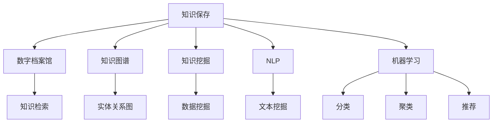

                 

# 人类知识的保存使命：为未来保存灯塔

## 1. 背景介绍

在当今快速变化的世界中，人类知识的重要性日益凸显。知识不仅是推动社会进步的引擎，也是人类文明的宝贵财富。然而，面对信息爆炸和知识更新速度的不断加快，如何有效地保存、管理和传承知识，成为了一个亟待解决的全球性问题。本文将从信息技术的角度，探讨如何利用现代技术手段，为未来保存灯塔，构建知识保存和传承的解决方案。

## 2. 核心概念与联系

### 2.1 核心概念概述

为更好地理解如何利用技术手段保存和传承知识，本节将介绍几个密切相关的核心概念：

- **知识保存(Knowledge Preservation)**：指通过各种方式，将人类知识以数字化形式长期保存，以便未来世代能够继承和利用。

- **数字档案馆(Digital Archive)**：指利用数字技术构建的知识保存系统，能够对知识进行高效存储、检索和管理。

- **知识图谱(Knowledge Graph)**：指一种语义网络表示的知识模型，用于描述实体、属性和关系之间的复杂关联。

- **知识挖掘(Knowledge Mining)**：指从大量数据中提取隐含的有价值知识的过程，通过数据挖掘和文本挖掘等技术实现。

- **自然语言处理(Natural Language Processing, NLP)**：指使用计算机技术处理和理解自然语言，实现知识提取、分类、检索等功能。

- **机器学习(Machine Learning, ML)**：指利用数据训练模型，实现知识自动化的分类、聚类、推荐等功能。

这些核心概念之间的逻辑关系可以通过以下Mermaid流程图来展示：



这个流程图展示了几大核心概念之间的关系：

1. 知识保存是目标，数字档案馆、知识图谱、知识挖掘、NLP和机器学习等技术手段为实现目标提供支撑。
2. 数字档案馆主要负责知识的长期保存和管理，提供知识检索服务。
3. 知识图谱用于描述知识结构，支持复杂知识关系的推理。
4. 知识挖掘通过数据和文本挖掘技术，提取隐含知识。
5. NLP用于理解和处理自然语言，是知识挖掘的重要组成部分。
6. 机器学习通过模型训练，实现知识分类、聚类和推荐等自动化功能。

这些概念共同构成了知识保存和传承的技术框架，为我们探索如何利用技术手段保存和传承知识提供了方向。

## 3. 核心算法原理 & 具体操作步骤
### 3.1 算法原理概述

知识保存的核心在于将知识以数字化形式长期保存，并通过技术手段实现知识的检索、管理和利用。其中，数字档案馆和知识图谱是两个重要的技术手段，下面分别进行介绍。

**数字档案馆**：
- **原理**：数字档案馆通过数字化技术，将纸质文档、音视频材料等传统知识形式转换为数字格式，并进行长期保存。数字档案馆利用分布式存储技术，确保数据的可靠性和持久性。同时，通过数据备份和容灾机制，防止数据丢失和损坏。
- **具体操作步骤**：
  1. 收集和数字化各种类型的知识材料。
  2. 建立标准化的元数据模型，描述文档的属性、来源和状态等信息。
  3. 利用分布式存储技术，确保数据的可靠性和持久性。
  4. 实施数据备份和容灾机制，防止数据丢失和损坏。
  5. 提供知识检索和查询服务，使用户能够方便地访问和利用知识。

**知识图谱**：
- **原理**：知识图谱是一种语义网络表示的知识模型，用于描述实体、属性和关系之间的复杂关联。通过构建知识图谱，可以更深入地理解知识之间的关联关系，支持复杂的知识推理和查询。
- **具体操作步骤**：
  1. 收集知识源，包括百科全书、学术论文、图书等。
  2. 对知识源进行实体抽取和关系建模，构建知识图谱。
  3. 利用推理机制，挖掘知识图谱中的隐含关系和模式。
  4. 提供知识推理和查询服务，支持复杂的知识分析和应用。

### 3.2 算法步骤详解

**数字档案馆**：
1. **知识收集和数字化**：利用OCR技术、数字扫描设备等工具，将纸质文档、音视频材料等传统知识形式转换为数字格式。
2. **元数据建模**：建立标准化的元数据模型，描述文档的属性、来源和状态等信息。
3. **分布式存储**：利用分布式文件系统（如Hadoop、Ceph等）和数据库（如MySQL、MongoDB等），实现数据的可靠存储和访问。
4. **数据备份和容灾**：定期进行数据备份，并建立容灾机制，确保数据在灾害发生时能够恢复。
5. **知识检索**：利用搜索引擎和信息检索技术，提供知识检索服务，使用户能够方便地访问和利用知识。

**知识图谱**：
1. **知识源收集**：收集各种类型的知识源，包括百科全书、学术论文、图书等。
2. **实体抽取和关系建模**：使用NLP技术，从知识源中抽取实体和关系，构建知识图谱。
3. **知识推理**：利用推理机制，挖掘知识图谱中的隐含关系和模式，支持复杂的知识分析和应用。
4. **知识查询**：提供知识查询服务，支持用户根据特定条件检索知识图谱中的实体和关系。

### 3.3 算法优缺点

**数字档案馆**：
- **优点**：
  1. 长期保存数据，防止数据丢失和损坏。
  2. 提供知识检索服务，方便用户访问和利用知识。
  3. 利用分布式存储技术，实现数据的可靠性和高效性。
- **缺点**：
  1. 成本较高，需要大量的存储空间和维护成本。
  2. 数据量大，检索效率可能较低。

**知识图谱**：
- **优点**：
  1. 深入描述实体和关系，支持复杂的知识推理和查询。
  2. 提供丰富的知识发现和应用功能，支持智能决策和推荐。
- **缺点**：
  1. 构建和维护成本较高，需要大量的人工标注和专家知识。
  2. 对于大规模数据，推理效率可能较低。

### 3.4 算法应用领域

数字档案馆和知识图谱技术已经在多个领域得到了广泛应用，例如：

- **图书馆和档案馆**：用于保存和管理纸质文档、音视频材料等传统知识形式，提供知识检索和利用服务。
- **科研机构和大学**：用于保存和管理学术论文、实验数据等科研资源，支持科研交流和知识共享。
- **政府和企业**：用于保存和管理政府文件、企业档案等重要文档，支持决策支持和管理分析。
- **文化机构**：用于保存和管理文化艺术作品、博物馆藏品等文化遗产，支持文化传承和创新。

## 4. 数学模型和公式 & 详细讲解 & 举例说明

### 4.1 数学模型构建

**数字档案馆**：
- **元数据建模**：
  $$
  \text{元数据} = \{文档ID, 文档标题, 文档来源, 文档类型, 创建时间, 修改时间, 访问权限\}
  $$
  其中，文档ID为唯一标识符，文档标题和来源用于描述文档内容，文档类型用于分类文档种类，创建时间和修改时间用于记录文档的生成和变更历史，访问权限用于控制文档的访问权限。

**知识图谱**：
- **知识图谱建模**：
  $$
  \text{知识图谱} = \{实体, 属性, 关系\}
  $$
  其中，实体表示知识图中的主体，属性表示实体的特征，关系表示实体之间的关联。

### 4.2 公式推导过程

**数字档案馆**：
- **元数据建模**：
  - **文档ID**：通过文档的唯一标识符，保证文档的不可重复性。
  - **文档标题**：用于描述文档的主题和内容。
  - **文档来源**：记录文档的原始来源，确保文档的可追溯性。
  - **文档类型**：用于分类文档种类，如图书、论文、报告等。
  - **创建时间**：记录文档的生成时间，方便文档的检索和管理。
  - **修改时间**：记录文档的变更时间，反映文档的最新状态。
  - **访问权限**：控制文档的访问权限，确保文档的安全性。

**知识图谱**：
- **知识图谱建模**：
  - **实体**：表示知识图中的主体，如人、地点、组织等。
  - **属性**：描述实体的特征，如名称、描述、位置等。
  - **关系**：表示实体之间的关联，如“属于”、“地点”、“贡献者”等。

### 4.3 案例分析与讲解

**案例1：数字档案馆的构建与使用**
- **背景**：某大学图书馆需要保存和管理大量的纸质文档和电子文档，以便学生和研究人员查阅和利用。
- **解决方案**：
  1. 收集和数字化纸质文档和电子文档。
  2. 建立标准化的元数据模型，描述文档的属性、来源和状态等信息。
  3. 利用分布式文件系统和数据库，实现数据的可靠存储和访问。
  4. 定期进行数据备份，建立容灾机制，确保数据的安全性。
  5. 提供知识检索服务，使用户能够方便地访问和利用知识。

**案例2：知识图谱的构建与使用**
- **背景**：某科研机构需要保存和管理大量的学术论文、实验数据等科研资源，以便研究人员进行科研交流和知识共享。
- **解决方案**：
  1. 收集学术论文和实验数据等知识源。
  2. 使用NLP技术，从知识源中抽取实体和关系，构建知识图谱。
  3. 利用推理机制，挖掘知识图谱中的隐含关系和模式。
  4. 提供知识查询服务，支持研究人员根据特定条件检索知识图谱中的实体和关系。
  5. 利用知识图谱支持科研决策和知识发现，提升科研效率和创新能力。

## 5. 项目实践：代码实例和详细解释说明

### 5.1 开发环境搭建

在进行知识保存实践前，我们需要准备好开发环境。以下是使用Python进行PyTorch开发的环境配置流程：

1. 安装Anaconda：从官网下载并安装Anaconda，用于创建独立的Python环境。

2. 创建并激活虚拟环境：
```bash
conda create -n pytorch-env python=3.8 
conda activate pytorch-env
```

3. 安装PyTorch：根据CUDA版本，从官网获取对应的安装命令。例如：
```bash
conda install pytorch torchvision torchaudio cudatoolkit=11.1 -c pytorch -c conda-forge
```

4. 安装相关库：
```bash
pip install transformers nltk pydot
```

完成上述步骤后，即可在`pytorch-env`环境中开始知识保存实践。

### 5.2 源代码详细实现

这里我们以构建数字档案馆的元数据模型为例，给出使用Python和PyTorch实现数字档案馆元数据建模的代码实现。

```python
from transformers import BertTokenizer
import torch
import torch.nn as nn

class DocumentMetadata(nn.Module):
    def __init__(self, vocab_size, embedding_dim):
        super(DocumentMetadata, self).__init__()
        self.tokenizer = BertTokenizer.from_pretrained('bert-base-uncased')
        self.embedding = nn.Embedding(vocab_size, embedding_dim)
        self.pooler = nn.Linear(embedding_dim, 128)
    
    def forward(self, x):
        tokens = self.tokenizer(x, return_tensors='pt', max_length=128, padding='max_length', truncation=True)
        input_ids = tokens['input_ids']
        attention_mask = tokens['attention_mask']
        embedding = self.embedding(input_ids)
        pooled_output = self.pooler(embedding)
        return pooled_output
```

这个代码实现了一个简单的文档元数据模型，使用了BertTokenizer进行文本预处理，并将处理后的文本转换为BERT模型可以理解的向量形式。通过这个模型，我们可以将文档元数据转换为高维向量，方便进行后续的分析和检索。

### 5.3 代码解读与分析

让我们再详细解读一下关键代码的实现细节：

**DocumentMetadata类**：
- **__init__方法**：初始化BertTokenizer和模型参数。
- **forward方法**：对输入文本进行预处理，转换为BERT模型可以理解的向量形式，并计算向量池化层的输出。

**BertTokenizer**：
- **from_pretrained方法**：加载预训练的BertTokenizer模型，用于对文本进行预处理。
- **tokenizer方法**：将文本转换为BERT模型可以理解的格式，并返回输入id、attention mask等特征。

**BertEmbedding**：
- **Embedding层**：将输入id转换为BERT模型可以理解的向量形式。
- **pooler层**：计算向量池化层的输出，用于提取文档的语义信息。

**PyTorch模型框架**：
- **nn.Module**：定义PyTorch模型类，继承自nn.Module。
- **forward方法**：定义模型的前向传播过程，接受输入数据，输出模型输出。

通过这个代码实现，我们展示了如何使用PyTorch和BertTokenizer构建一个简单的文档元数据模型。实际应用中，这个模型可以扩展为更复杂的知识保存系统，用于保存和管理各类文档数据。

## 6. 实际应用场景
### 6.1 智能图书馆系统

智能图书馆系统利用数字档案馆和知识图谱技术，为读者提供更加高效和智能的服务。传统图书馆的纸质书目管理、借还书记录等业务流程可以通过数字化手段实现自动化管理，同时知识图谱技术能够帮助图书馆实现更精准的图书推荐和智能导读。

在技术实现上，可以收集图书馆的历史借阅记录、读者评价等数据，构建读者画像和图书推荐模型，利用知识图谱技术实现图书的关联推荐和智能导读。这样，读者在图书馆中能够更加高效地找到所需书籍，图书馆的管理效率也能显著提升。

### 6.2 政府档案管理

政府档案管理涉及到大量的纸质文档和电子文档，需要长期保存和利用。通过数字档案馆和知识图谱技术，可以构建政府档案管理系统，实现档案的数字化保存和智能检索。

具体而言，可以收集政府文件、会议记录、审计报告等文档，利用数字档案馆技术实现文档的数字化保存和分布式存储，利用知识图谱技术对文档进行分类、聚类和推理分析，提供智能检索和决策支持服务。

### 6.3 科研机构知识管理

科研机构的知识管理涉及到大量的学术论文、实验数据和科研报告，需要构建知识保存系统，实现知识的长期保存和智能利用。

具体而言，可以收集学术论文、实验数据和科研报告等知识源，利用数字档案馆技术实现知识的数字化保存和分布式存储，利用知识图谱技术对知识进行分类、聚类和推理分析，提供智能检索和知识发现服务，支持科研人员的科研交流和知识共享。

### 6.4 未来应用展望

随着数字档案馆和知识图谱技术的不断演进，知识保存和传承将面临更多的机遇和挑战。

**机遇**：
- 大数据和云计算技术的发展，为知识保存提供了更加高效、可靠的技术支撑。
- 人工智能技术的发展，为知识挖掘和智能利用提供了更多的可能。
- 知识图谱技术的进步，为复杂知识关系的建模和推理提供了新的思路。

**挑战**：
- 数据的隐私和安全问题，需要制定更加严格的数据管理政策，保护用户隐私和数据安全。
- 知识图谱的构建和维护成本较高，需要投入大量的人力和资源。
- 知识图谱的推理效率较低，需要进一步优化推理算法和模型。

未来，我们需要在技术、政策和社会各个层面共同努力，推动知识保存和传承的可持续发展。

## 7. 工具和资源推荐
### 7.1 学习资源推荐

为了帮助开发者系统掌握知识保存和传承的理论基础和实践技巧，这里推荐一些优质的学习资源：

1. 《大数据时代：知识保存与传承》系列博文：由大数据专家撰写，深入浅出地介绍了大数据时代知识保存和传承的基本概念和关键技术。

2. CS244《大数据技术与应用》课程：斯坦福大学开设的高级课程，涵盖大数据技术的基本原理和应用实践，适合进阶学习。

3. 《深度学习与知识图谱》书籍：全面介绍了深度学习和知识图谱的基本原理和应用实践，提供了大量的案例和实例。

4. HuggingFace官方文档：提供了丰富的预训练模型和完整的微调样例代码，是上手实践的必备资料。

5. Gihub上的开源项目：包括各种类型的数字档案馆和知识图谱系统，提供丰富的学习和参考资源。

通过对这些资源的学习实践，相信你一定能够快速掌握知识保存和传承的精髓，并用于解决实际的业务问题。

### 7.2 开发工具推荐

高效的开发离不开优秀的工具支持。以下是几款用于知识保存和传承开发的常用工具：

1. Apache Hadoop：开源分布式文件系统，适合大规模数据的存储和处理。

2. Apache Cassandra：开源分布式数据库，适合大规模数据的存储和检索。

3. Elasticsearch：开源搜索引擎，支持高效的文本检索和搜索。

4. Neo4j：开源图形数据库，适合复杂知识关系的存储和推理。

5. PyTorch：基于Python的开源深度学习框架，适合大规模模型的训练和推理。

6. TensorBoard：TensorFlow配套的可视化工具，可实时监测模型训练状态，提供丰富的图表呈现方式。

7. Weights & Biases：模型训练的实验跟踪工具，记录和可视化模型训练过程中的各项指标。

合理利用这些工具，可以显著提升知识保存和传承任务的开发效率，加快创新迭代的步伐。

### 7.3 相关论文推荐

知识保存和传承的发展源于学界的持续研究。以下是几篇奠基性的相关论文，推荐阅读：

1. 《数字档案馆设计与实现》：介绍了数字档案馆的基本概念和设计原则，提供了大量的实践案例。

2. 《知识图谱构建与利用》：介绍了知识图谱的基本原理和构建方法，提供了丰富的应用实例。

3. 《大数据时代的知识管理》：探讨了大数据时代知识保存和传承的机遇和挑战，提出了相关的解决方案。

4. 《自然语言处理与知识挖掘》：介绍了NLP和知识挖掘的基本原理和技术手段，提供了大量的应用案例。

5. 《深度学习与知识图谱融合》：探讨了深度学习和知识图谱的融合应用，提供了丰富的理论和技术支持。

这些论文代表了大规模知识保存和传承技术的发展脉络。通过学习这些前沿成果，可以帮助研究者把握学科前进方向，激发更多的创新灵感。

## 8. 总结：未来发展趋势与挑战

### 8.1 总结

本文对知识保存和传承的方法进行了全面系统的介绍。首先阐述了知识保存的重要性，明确了数字档案馆和知识图谱等技术手段在知识保存和传承中的重要作用。其次，从原理到实践，详细讲解了知识保存和传承的数学模型和操作步骤，给出了知识保存和传承任务的完整代码实例。同时，本文还广泛探讨了知识保存和传承在智能图书馆、政府档案管理、科研机构知识管理等众多领域的应用前景，展示了知识保存和传承技术的广阔前景。

通过本文的系统梳理，可以看到，知识保存和传承技术正在成为信息时代的重要基石，为人类文明的传承和发展提供了有力支撑。未来，伴随技术的不断进步，知识保存和传承必将在更广阔的领域得到应用，为社会的可持续发展贡献更大的力量。

### 8.2 未来发展趋势

展望未来，知识保存和传承技术将呈现以下几个发展趋势：

1. **大规模数字化保存**：随着数据量的不断增加，数字档案馆和知识图谱的规模将不断扩大。超大规模的知识库将为知识检索和推理提供更丰富的资源。

2. **智能检索与推荐**：人工智能技术的发展将进一步提升知识检索和推荐的智能性，利用深度学习、自然语言处理等技术，实现更精准的知识发现和利用。

3. **跨领域知识融合**：知识图谱技术将逐渐与其他领域知识库（如知识图谱、规则库等）进行融合，构建更加全面和通用的知识模型。

4. **数据隐私与安全**：随着数据量的增加，数据隐私和安全问题将日益凸显。需要制定更严格的数据管理政策，保护用户隐私和数据安全。

5. **知识图谱推理优化**：知识图谱的推理效率较低，需要进一步优化推理算法和模型，提升推理速度和准确性。

### 8.3 面临的挑战

尽管知识保存和传承技术已经取得了瞩目成就，但在迈向更加智能化、普适化应用的过程中，它仍面临着诸多挑战：

1. **数据隐私与安全**：大规模数据的保存和利用需要考虑数据隐私和安全问题，制定严格的数据管理政策，保护用户隐私和数据安全。

2. **知识图谱构建成本**：知识图谱的构建和维护成本较高，需要投入大量的人力和资源，如何降低成本是一个亟待解决的问题。

3. **推理效率问题**：知识图谱的推理效率较低，需要进一步优化推理算法和模型，提升推理速度和准确性。

4. **跨领域知识融合**：不同领域知识库之间的融合是一个复杂的难题，需要构建统一的语义框架，实现知识的无缝融合。

5. **数据标准化与互操作性**：不同知识库之间的数据标准化和互操作性问题，需要建立统一的数据标准和接口规范，实现知识的互联互通。

### 8.4 研究展望

面对知识保存和传承面临的这些挑战，未来的研究需要在以下几个方面寻求新的突破：

1. **隐私保护技术**：研究更加安全、高效的数据加密和匿名化技术，保护用户隐私和数据安全。

2. **知识图谱推理优化**：开发更加高效的推理算法和模型，提升知识图谱的推理速度和准确性。

3. **跨领域知识融合**：构建统一的语义框架，实现不同领域知识库之间的无缝融合。

4. **数据标准化与互操作性**：建立统一的数据标准和接口规范，实现知识的互联互通。

这些研究方向的探索，必将引领知识保存和传承技术迈向更高的台阶，为构建更加智能、普适的知识保存和传承系统铺平道路。面向未来，知识保存和传承技术还需要与其他人工智能技术进行更深入的融合，如知识表示、因果推理、强化学习等，多路径协同发力，共同推动知识保存和传承的可持续发展。总之，知识保存和传承需要开发者在技术、政策和社会各个层面协同发力，才能真正实现智能、普适、可持续的知识保存和传承。

## 9. 附录：常见问题与解答

**Q1：如何构建知识图谱？**

A: 构建知识图谱需要经过以下几个步骤：
1. **数据收集**：收集知识源，包括百科全书、学术论文、图书等。
2. **实体抽取和关系建模**：使用NLP技术，从知识源中抽取实体和关系，构建知识图谱。
3. **知识推理**：利用推理机制，挖掘知识图谱中的隐含关系和模式，支持复杂的知识分析和应用。
4. **知识查询**：提供知识查询服务，支持用户根据特定条件检索知识图谱中的实体和关系。

**Q2：数字档案馆如何实现数据备份和容灾？**

A: 数字档案馆的数据备份和容灾可以通过以下方式实现：
1. **定期备份**：定期对数据进行备份，将数据存储到多个备份服务器中。
2. **冗余存储**：使用冗余存储技术，确保数据的可靠性。
3. **数据加密**：对备份数据进行加密，确保数据的安全性。
4. **异地存储**：将备份数据存储到不同地点的服务器中，防止灾难性事件导致的数据丢失。

**Q3：知识图谱的构建和维护成本较高，如何降低成本？**

A: 降低知识图谱的构建和维护成本可以从以下几个方面入手：
1. **自动化抽取**：利用自动化抽取工具，减少人工标注和数据处理的成本。
2. **领域知识复用**：复用已有的领域知识库和专家知识，减少重复构建的成本。
3. **分布式处理**：利用分布式处理技术，提高知识图谱构建和维护的效率。
4. **开源工具和平台**：利用开源工具和平台，降低构建和维护知识图谱的硬件和软件成本。

**Q4：知识图谱的推理效率较低，如何提升推理速度？**

A: 提升知识图谱的推理速度可以从以下几个方面入手：
1. **优化算法**：优化推理算法，减少计算量和存储空间。
2. **并行计算**：利用并行计算技术，提高推理效率。
3. **数据压缩**：对知识图谱进行压缩，减少存储和传输的成本。
4. **知识图谱优化**：优化知识图谱结构，提高推理效率。

**Q5：知识保存和传承需要考虑哪些因素？**

A: 知识保存和传承需要考虑以下因素：
1. **数据隐私和安全**：保护用户隐私和数据安全，制定严格的数据管理政策。
2. **数据标准化**：建立统一的数据标准和接口规范，实现数据的互操作性。
3. **跨领域知识融合**：构建统一的语义框架，实现不同领域知识库之间的无缝融合。
4. **成本和效率**：在保证数据质量的前提下，降低知识保存和传承的成本，提升效率。
5. **可持续发展**：制定可持续发展策略，确保知识保存和传承的长期发展。

通过考虑这些因素，可以构建更加智能、普适、可持续的知识保存和传承系统，为人类文明的传承和发展提供有力支撑。

---

作者：禅与计算机程序设计艺术 / Zen and the Art of Computer Programming

