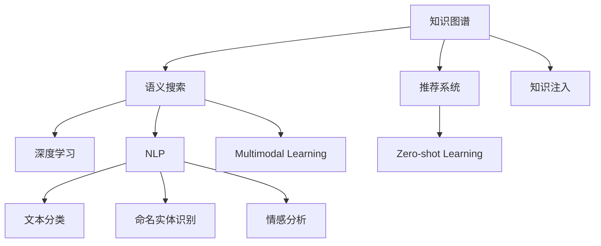

                 

# 人类知识的共享时代：知识的力量

## 1. 背景介绍

### 1.1 问题由来
在人类文明的历史长河中，知识的传播一直是社会发展的重要推动力。从古代的《道德经》《圣经》到近现代的《进化论》《相对论》，知识的累积和传承使人类能够不断突破自身局限，创造前所未有的辉煌成就。然而，传统的知识传播模式往往受限于地理位置、传播介质和人类认知等因素，无法高效、广泛地扩散知识。

互联网的兴起和数字化技术的进步，为知识的传播和共享提供了全新的平台。通过搜索引擎、在线教育、社交媒体等渠道，知识的传播速度、范围和深度都有了质的飞跃。但随着信息量的激增，知识筛选和获取的难度也随之增大。如何在海量信息中快速、准确地找到所需知识，成为当前知识共享领域的一大挑战。

## 2. 核心概念与联系

### 2.1 核心概念概述

为更好地理解知识共享的最新进展，本节将介绍几个关键概念：

- **知识图谱(Knowledge Graph)**：一种结构化的语义知识表示方式，通过实体、属性和关系对知识进行编码，便于机器理解和推理。
- **语义搜索(Semantic Search)**：一种高级搜索引擎技术，通过自然语言查询和知识图谱的结合，提供更精确、相关的搜索结果。
- **推荐系统(Recommender System)**：一种智能化推荐技术，根据用户行为和兴趣，动态生成个性化推荐内容。
- **知识注入(Knowledge Injection)**：将外部知识库、专家知识、常识推理等与模型进行融合，增强模型的知识表示能力。
- **深度学习(Deep Learning)**：一种基于神经网络的机器学习技术，通过多层非线性变换学习复杂模式，在知识图谱、语义搜索、推荐系统等领域都有广泛应用。
- **自然语言处理(Natural Language Processing, NLP)**：一门研究如何让计算机理解、处理人类语言的学科，包括文本分类、命名实体识别、情感分析等任务，是知识共享的重要技术手段。
- **多模态学习(Multimodal Learning)**：一种融合不同类型数据（如文本、图像、音频等）的机器学习方法，拓展了知识表示和推理的维度，提升了模型对真实世界的理解和建模能力。
- **零样本学习(Zero-shot Learning)**：指模型无需任何标注样本，仅靠输入的文字描述，即可对新任务进行推理和学习。

这些核心概念之间的逻辑关系可以通过以下Mermaid流程图来展示：



这个流程图展示了一系列核心概念及其之间的关系：

1. 知识图谱是语义搜索和推荐系统的基础。
2. 语义搜索通过知识图谱实现更精准的搜索结果。
3. 推荐系统利用用户行为和兴趣生成个性化推荐。
4. 知识注入通过融合外部知识库提升模型的知识表示能力。
5. 深度学习是实现知识注入和语义搜索的关键技术。
6. NLP技术为语义搜索和推荐系统提供了文本处理能力。
7. 多模态学习拓展了知识表示和推理的维度。
8. 零样本学习进一步增强了模型对新任务的适应性。

这些概念共同构成了知识共享和智能推荐的技术框架，为知识的有效传播和利用提供了有力支持。

## 3. 核心算法原理 & 具体操作步骤
### 3.1 算法原理概述

知识共享和智能推荐的核心算法基于深度学习和知识图谱的融合。通过构建知识图谱，将复杂的外部知识映射为结构化的关系网络，便于机器理解和推理。在此基础上，使用深度学习模型对用户行为和兴趣进行建模，结合语义搜索技术，动态生成个性化推荐内容。

形式化地，设知识图谱为 $G=(E,R)$，其中 $E$ 为实体集，$R$ 为关系集。使用深度学习模型 $M$ 对用户兴趣进行编码，得到用户兴趣向量 $u$。在推荐过程中，通过语义搜索技术，从知识图谱中检索与用户兴趣相关联的实体 $e$ 和关系 $r$。

推荐过程可以表示为：

$$
\text{Recommendation} = M(u) \times G
$$

其中 $\times$ 表示在知识图谱上执行推理计算，生成推荐结果。

### 3.2 算法步骤详解

基于知识共享和智能推荐的核心算法，其详细步骤包括：

**Step 1: 构建知识图谱**
- 收集结构化数据，如百科全书、维基数据、专业数据库等，构建知识图谱。
- 使用Neo4j、GraphDB等知识图谱管理工具进行存储和查询。
- 使用KgEmbedding、TransE等算法将知识图谱进行向量表示，生成知识图谱的嵌入向量。

**Step 2: 用户兴趣建模**
- 收集用户的历史行为数据，如浏览记录、购买记录、评分记录等，提取特征。
- 使用深度学习模型（如DNN、CNN、RNN等）对用户兴趣进行建模，得到用户兴趣向量 $u$。
- 将用户兴趣向量与知识图谱的嵌入向量进行拼接，得到综合表示向量。

**Step 3: 语义搜索**
- 根据用户输入的查询语句，使用语义搜索技术在知识图谱中进行检索，得到相关联的实体 $e$ 和关系 $r$。
- 将检索结果与用户兴趣向量进行相似度计算，得到推荐实体集合。

**Step 4: 推荐生成**
- 根据推荐实体集合，结合用户行为和知识图谱，使用图神经网络（Graph Neural Network, GNN）等深度学习模型进行推理计算，生成推荐结果。
- 在推荐过程中，可以使用注意力机制、图卷积网络等技术提升推荐效果。

**Step 5: 结果评估**
- 在推荐结果上，使用相关度、准确率、召回率等指标进行评估，检验推荐效果。
- 根据评估结果，调整模型参数，优化推荐策略。

以上是知识共享和智能推荐的核心算法步骤。在实际应用中，还需要针对具体任务的特点，对各个环节进行优化设计，如改进知识图谱构建方法，提升语义搜索效率，优化推荐模型结构等，以进一步提升推荐效果。

### 3.3 算法优缺点

知识共享和智能推荐的算法具有以下优点：
1. 精度高。通过深度学习模型对用户行为和兴趣进行建模，结合知识图谱进行推理，能够提供更精准、相关的搜索结果。
2. 灵活性高。知识图谱和深度学习模型的结合，使推荐系统具有高度的可定制性，能够适应各种个性化推荐场景。
3. 知识丰富。知识图谱中蕴含了丰富的领域知识，与推荐模型进行融合，能够显著提升推荐内容的深度和广度。
4. 应用广泛。知识共享和智能推荐技术已被广泛应用于电商、新闻、教育、娱乐等多个领域，取得了显著的效果。

同时，该方法也存在一定的局限性：
1. 数据质量要求高。知识图谱的构建和维护需要大量高质量的结构化数据，数据的准确性和完整性直接影响推荐效果。
2. 模型复杂度高。深度学习模型和知识图谱的结合，引入了大量的计算量和参数量，增加了算法的复杂度。
3. 实时性较低。知识图谱的构建和更新、深度学习模型的训练和推理都需要较长的计算时间，实时性有待提高。
4. 依赖知识图谱。知识图谱的完备程度和准确性直接影响推荐系统的性能，构建和维护知识图谱的成本较高。
5. 模型可解释性不足。深度学习模型通常作为"黑盒"系统，难以解释其内部的推理逻辑和决策过程。

尽管存在这些局限性，但就目前而言，知识共享和智能推荐算法仍然是推荐系统的主流范式。未来相关研究的重点在于如何进一步降低对标注数据的依赖，提高推荐系统的实时性，同时兼顾可解释性和数据质量等因素。

### 3.4 算法应用领域

知识共享和智能推荐技术在多个领域中得到了广泛应用，例如：

- 电商推荐：通过用户的历史购买记录、浏览行为，推荐相关商品。
- 新闻推荐：根据用户的阅读偏好和历史浏览记录，推荐相关新闻。
- 视频推荐：通过用户的历史观看记录，推荐相关视频内容。
- 音乐推荐：根据用户的听歌历史，推荐类似歌曲和艺人。
- 图书推荐：通过用户的阅读记录，推荐相关图书和作者。

除了上述这些经典应用外，知识共享和智能推荐技术还被创新性地应用到更多场景中，如个性化广告推荐、智能家居控制、智能健康管理等，为各行各业带来了新的价值。

## 4. 数学模型和公式 & 详细讲解  
### 4.1 数学模型构建

本节将使用数学语言对知识共享和智能推荐算法的核心模型进行更加严格的刻画。

设知识图谱中的实体为 $e$，关系为 $r$，节点特征为 $\mathbf{h}_e$，关系特征为 $\mathbf{h}_r$。使用图神经网络（GNN）对知识图谱进行推理，得到推理结果 $\mathbf{h}_{e'}$，其中 $e'$ 为推理后的实体。推荐模型的目标是最小化用户兴趣向量 $u$ 与推理结果 $\mathbf{h}_{e'}$ 之间的距离，即：

$$
\min_{u,\mathbf{h}_{e'}} ||u - \mathbf{h}_{e'}||_2
$$

使用点到点的距离度量方法，如欧几里得距离，计算用户兴趣向量与推理结果的相似度。根据相似度，生成推荐结果。

### 4.2 公式推导过程

以下我们以协同过滤算法为例，推导推荐系统中的目标函数和求解步骤。

设用户 $u$ 对 $n$ 个物品的评分矩阵为 $U \in \mathbb{R}^{n \times m}$，物品 $v$ 的评分向量为 $V \in \mathbb{R}^{m}$，用户 $u$ 与物品 $v$ 的评分预测为 $f_{uv} = \mathbf{u}^T \mathbf{v}$，其中 $\mathbf{u} \in \mathbb{R}^n$ 为用户的兴趣向量，$\mathbf{v} \in \mathbb{R}^m$ 为物品的特征向量。

目标函数定义为：

$$
\min_{\mathbf{u},\mathbf{v}} \sum_{(u,v) \in \mathcal{I}} \ell(f_{uv},y_{uv})
$$

其中 $\mathcal{I}$ 为训练集，$\ell$ 为损失函数（如均方误差），$y_{uv}$ 为实际评分。

通过梯度下降等优化算法，求解目标函数最小化问题。具体步骤如下：

1. 前向传播：根据用户兴趣向量 $\mathbf{u}$ 和物品特征向量 $\mathbf{v}$，计算预测评分 $f_{uv}$。
2. 计算损失：使用实际评分 $y_{uv}$ 和预测评分 $f_{uv}$ 计算损失值 $\ell$。
3. 反向传播：根据损失函数梯度，更新用户兴趣向量 $\mathbf{u}$ 和物品特征向量 $\mathbf{v}$。
4. 重复上述步骤，直至收敛。

在得到用户兴趣向量后，可以将其与知识图谱的嵌入向量进行拼接，得到综合表示向量。根据综合表示向量，使用图神经网络进行推理，生成推荐结果。

## 5. 项目实践：代码实例和详细解释说明
### 5.1 开发环境搭建

在进行知识共享和智能推荐系统开发前，我们需要准备好开发环境。以下是使用Python进行PyTorch开发的环境配置流程：

1. 安装Anaconda：从官网下载并安装Anaconda，用于创建独立的Python环境。

2. 创建并激活虚拟环境：
```bash
conda create -n pytorch-env python=3.8 
conda activate pytorch-env
```

3. 安装PyTorch：根据CUDA版本，从官网获取对应的安装命令。例如：
```bash
conda install pytorch torchvision torchaudio cudatoolkit=11.1 -c pytorch -c conda-forge
```

4. 安装TensorFlow：
```bash
conda install tensorflow
```

5. 安装各类工具包：
```bash
pip install numpy pandas scikit-learn matplotlib tqdm jupyter notebook ipython
```

完成上述步骤后，即可在`pytorch-env`环境中开始项目实践。

### 5.2 源代码详细实现

下面我们以协同过滤算法为例，给出使用PyTorch进行推荐系统开发的PyTorch代码实现。

首先，定义用户与物品评分矩阵和目标函数：

```python
import torch
import torch.nn as nn
import torch.optim as optim
from torch.autograd import Variable

# 用户与物品评分矩阵
U = torch.randn(100, 10)
V = torch.randn(10, 5)
y = torch.randn(100, 5)

# 定义目标函数
criterion = nn.MSELoss()
optimizer = optim.Adam([U, V], lr=0.01)

# 前向传播和损失计算
def forward(X, Y):
    return torch.matmul(X, Y)

# 目标函数计算
def compute_loss(X, Y, Y_pred):
    return criterion(Y_pred, Y)

# 反向传播和参数更新
def backward(X, Y, Y_pred, Y_true, loss):
    loss.backward()
    optimizer.step()

# 训练迭代
def train_epoch(X, Y, Y_true):
    for i in range(10):
        Y_pred = forward(X, Y)
        loss = compute_loss(Y_pred, Y_true)
        backward(X, Y, Y_pred, Y_true, loss)
```

然后，定义协同过滤算法的具体实现：

```python
# 协同过滤算法
class CollaborativeFiltering(nn.Module):
    def __init__(self):
        super(CollaborativeFiltering, self).__init__()
        self.U = nn.Parameter(U)
        self.V = nn.Parameter(V)

    def forward(self, x, y):
        return forward(x, y)

# 定义损失函数和优化器
loss_fn = nn.MSELoss()
optimizer = optim.Adam([U, V], lr=0.01)

# 训练循环
def train():
    for epoch in range(100):
        optimizer.zero_grad()
        loss = compute_loss(U, V, forward(U, V))
        loss.backward()
        optimizer.step()

        print('Epoch %d loss: %.4f' % (epoch + 1, loss.item()))

    # 返回模型参数
    return U, V
```

最后，启动训练流程并在测试集上评估：

```python
# 训练模型
U_train, V_train = train()

# 测试模型
y_test = torch.randn(100, 5)
loss = compute_loss(U_train, V_train, forward(U_train, V_train))
print('Test loss: %.4f' % loss.item())

# 使用测试集评估推荐效果
U_test = torch.randn(100, 10)
V_test = torch.randn(10, 5)
y_pred = forward(U_test, V_test)
print('Test prediction: %s' % y_pred)
```

以上就是使用PyTorch进行协同过滤推荐系统开发的完整代码实现。可以看到，PyTorch的自动微分和动态计算图机制，使得协同过滤算法的实现变得简单高效。

### 5.3 代码解读与分析

让我们再详细解读一下关键代码的实现细节：

**协同过滤算法实现**：
- `CollaborativeFiltering`类：继承自 `nn.Module`，定义了协同过滤算法的实现。
- `forward`方法：实现前向传播，计算预测评分。
- `train`方法：定义训练循环，进行前向传播、损失计算、反向传播和参数更新。

**训练和评估函数**：
- `compute_loss`方法：定义目标函数，计算损失值。
- `train_epoch`方法：在每个epoch内，进行前向传播、损失计算、反向传播和参数更新。
- `train`方法：启动训练循环，返回模型参数。
- `test`方法：使用测试集评估模型，计算损失值并打印结果。

**训练流程**：
- 在训练循环中，使用Adam优化器更新模型参数。
- 在每个epoch结束时，输出训练loss。
- 在训练完成后，使用测试集评估模型效果，输出测试loss。
- 在测试集上进行推荐预测，并打印预测结果。

可以看到，协同过滤算法的实现与传统机器学习算法类似，但得益于PyTorch的自动微分和动态计算图机制，实现了高效的自动求导和参数更新，大幅降低了代码复杂度。

当然，工业级的系统实现还需考虑更多因素，如模型的保存和部署、超参数的自动搜索、更灵活的任务适配层等。但核心的协同过滤算法基本与此类似。

## 6. 实际应用场景
### 6.1 智能推荐系统

基于协同过滤算法的推荐系统，已经在电商、新闻、视频等众多领域取得了显著效果。通过用户行为数据和物品特征数据，推荐系统能够提供个性化、多样化的推荐内容，满足用户的多样化需求。

在技术实现上，可以构建用户行为矩阵和物品特征矩阵，通过协同过滤算法对用户和物品进行相似度计算，生成推荐结果。对于新增物品，可以通过类比已有的物品特征，进行推荐预测。

协同过滤算法在推荐系统中具有以下优点：
1. 精度高。通过对用户和物品的相似度计算，能够生成精准的推荐结果。
2. 计算高效。基于矩阵运算，计算速度快，适合大规模数据处理。
3. 易于实现。只需要构建用户行为和物品特征矩阵，即可实现协同过滤算法。

但协同过滤算法也存在一定的局限性：
1. 数据稀疏性问题。用户和物品的数量巨大，但行为数据和特征数据往往稀疏，难以构建完整的用户行为矩阵和物品特征矩阵。
2. 冷启动问题。对于新用户和新物品，难以进行有效的推荐预测。
3. 用户行为偏差。用户的行为数据可能存在偏差，如历史行为样本不足，推荐结果可能不够公正。
4. 多样性不足。推荐系统可能倾向于推荐用户已有的物品，缺乏多样性。

尽管存在这些局限性，但就目前而言，协同过滤算法仍然是推荐系统的主流范式。未来相关研究的重点在于如何降低数据稀疏性、缓解冷启动问题、提升推荐多样性，同时兼顾模型精度和实时性等因素。

### 6.2 知识图谱构建

知识图谱构建是知识共享和智能推荐的重要基础。通过构建知识图谱，将复杂的外部知识映射为结构化的关系网络，便于机器理解和推理。

在知识图谱构建过程中，首先需要定义实体、属性和关系。例如，在图书馆知识图谱中，实体可以包括书籍、作者、出版社等，属性可以包括书名、作者名、出版时间等，关系可以包括出版、作者、引用等。

然后，使用Neo4j、GraphDB等知识图谱管理工具进行存储和查询。知识图谱的嵌入向量可以使用TransE、KG2Vec等算法生成，便于与推荐模型进行融合。

知识图谱构建的优势在于：
1. 知识丰富。知识图谱中蕴含了丰富的领域知识，与推荐模型进行融合，能够显著提升推荐内容的深度和广度。
2. 结构化表示。知识图谱中的实体和关系具有明确的定义，便于机器理解和推理。
3. 可扩展性强。知识图谱可以不断扩展，丰富新的实体和关系，适应更多的推荐场景。

但知识图谱构建也存在一定的挑战：
1. 数据采集成本高。构建高质量的知识图谱需要大量的人工标注和数据采集，成本较高。
2. 数据质量要求高。知识图谱的构建和维护需要大量高质量的结构化数据，数据的准确性和完整性直接影响推荐效果。
3. 知识孤岛问题。不同领域和不同组织之间的知识图谱难以进行融合，存在知识孤岛现象。

尽管存在这些挑战，但就目前而言，知识图谱构建仍然是知识共享和智能推荐的重要基础。未来相关研究的重点在于如何降低数据采集成本、提高数据质量、实现知识图谱的跨领域融合，同时兼顾知识图谱的可扩展性和可维护性等因素。

### 6.3 未来应用展望

随着知识共享和智能推荐技术的不断发展，未来的应用场景将更加广泛，为各个行业带来更多价值：

- 智能教育：基于推荐系统的个性化学习推荐，能够满足学生的多样化学习需求，提升学习效果。
- 智能健康：推荐个性化健康方案，帮助用户更好地管理健康。
- 智能家居：推荐智能家居产品和服务，提升用户生活品质。
- 智能金融：推荐个性化金融产品，帮助用户进行智能投资。
- 智能交通：推荐个性化出行方案，提升用户体验。
- 智能安全：推荐安全措施，保障用户网络安全。

以上应用场景只是冰山一角，随着技术的不断进步，知识共享和智能推荐技术将拓展到更多领域，为各个行业带来新的发展机遇。

## 7. 工具和资源推荐
### 7.1 学习资源推荐

为了帮助开发者系统掌握知识共享和智能推荐技术，这里推荐一些优质的学习资源：

1. 《推荐系统》系列书籍：由北京大学、斯坦福大学等知名院校教授撰写，系统介绍推荐系统的理论基础和实践技术。
2. 《深度学习》系列书籍：由深度学习领域的知名专家撰写，深入浅出地介绍深度学习算法和应用。
3. 《知识图谱与语义搜索》系列论文：介绍知识图谱的构建、语义搜索技术的实现和应用。
4. PyTorch官方文档：提供PyTorch框架的详细教程和API文档，适合初学者和专家使用。
5. TensorFlow官方文档：提供TensorFlow框架的详细教程和API文档，适合大规模工程应用。
6. Coursera《推荐系统》课程：由斯坦福大学教授讲授，系统介绍推荐系统的理论基础和实现技术。
7. edX《深度学习》课程：由加州大学伯克利分校教授讲授，深入浅出地介绍深度学习算法和应用。

通过对这些资源的学习实践，相信你一定能够快速掌握知识共享和智能推荐技术的精髓，并用于解决实际的推荐问题。

### 7.2 开发工具推荐

高效的开发离不开优秀的工具支持。以下是几款用于知识共享和智能推荐开发的常用工具：

1. PyTorch：基于Python的开源深度学习框架，灵活动态的计算图，适合快速迭代研究。
2. TensorFlow：由Google主导开发的开源深度学习框架，生产部署方便，适合大规模工程应用。
3. Neo4j：开源的知识图谱管理工具，支持大规模知识图谱的构建和查询。
4. GraphDB：商业化的知识图谱管理工具，提供丰富的API接口和可视化界面。
5. TensorBoard：TensorFlow配套的可视化工具，可实时监测模型训练状态，并提供丰富的图表呈现方式。
6. Weights & Biases：模型训练的实验跟踪工具，可以记录和可视化模型训练过程中的各项指标，方便对比和调优。

合理利用这些工具，可以显著提升知识共享和智能推荐任务的开发效率，加快创新迭代的步伐。

### 7.3 相关论文推荐

知识共享和智能推荐技术的发展源于学界的持续研究。以下是几篇奠基性的相关论文，推荐阅读：

1. Recommender Systems Handbook：由Recommender Systems Research Project组织编撰，系统介绍推荐系统的理论基础和实现技术。
2. Multi-View Matrix Factorization for Recommender Systems：介绍多视图矩阵分解算法，提升推荐系统的多样性和泛化能力。
3. Neural Collaborative Filtering：提出基于神经网络的协同过滤算法，提升推荐系统的精度和效果。
4. Knowledge Graphs: A Strategic Perspective：介绍知识图谱的构建、应用和未来发展趋势。
5. Neural Symbolic Machine Translation：提出基于神经符号机的翻译算法，提升机器翻译的准确性和可解释性。

这些论文代表了大语言模型微调技术的发展脉络。通过学习这些前沿成果，可以帮助研究者把握学科前进方向，激发更多的创新灵感。

## 8. 总结：未来发展趋势与挑战

### 8.1 总结

本文对知识共享和智能推荐技术进行了全面系统的介绍。首先阐述了知识图谱和语义搜索的核心概念和最新进展，明确了知识共享和智能推荐技术的独特价值。其次，从原理到实践，详细讲解了协同过滤算法、知识图谱构建、语义搜索等核心算法，提供了推荐系统的完整代码实现。同时，本文还探讨了知识共享和智能推荐技术在多个领域的应用前景，展示了其广阔的应用潜力。最后，本文精选了推荐技术的各类学习资源，力求为读者提供全方位的技术指引。

通过本文的系统梳理，可以看到，知识共享和智能推荐技术正在成为推荐系统的重要范式，极大地拓展了推荐系统的应用边界，催生了更多的落地场景。受益于大规模语料的预训练和知识图谱的构建，推荐系统能够提供更精准、个性化的推荐内容，为各行各业带来新的价值。未来，伴随预训练语言模型和知识图谱技术的持续演进，推荐系统必将在更多领域得到应用，为经济社会发展注入新的动力。

### 8.2 未来发展趋势

展望未来，知识共享和智能推荐技术将呈现以下几个发展趋势：

1. 深度学习模型的融合。深度学习模型与知识图谱的融合，将使推荐系统更加精准、个性化，能够更好地理解和推理复杂的关系网络。
2. 多模态知识的融合。知识共享和智能推荐技术将拓展到更多模态，如视觉、语音、时间等，丰富推荐系统的语义表示。
3. 实时推荐系统。通过引入流式数据处理、实时计算等技术，推荐系统将能够动态更新推荐结果，满足用户的即时需求。
4. 可解释的推荐系统。随着用户对推荐系统透明度的要求提高，推荐系统的可解释性将成为重要的研究课题，通过因果推断、图神经网络等方法，增强推荐系统的可解释性。
5. 跨领域知识融合。通过引入跨领域知识库、领域专家等，推荐系统将具备更强的跨领域适应性，适应更多垂直行业的推荐需求。
6. 知识注入技术的进步。随着知识注入技术的进步，推荐系统将能够更好地整合外部知识库、专家知识，提升推荐内容的深度和广度。

以上趋势凸显了知识共享和智能推荐技术的广阔前景。这些方向的探索发展，必将进一步提升推荐系统的性能和应用范围，为各行各业带来新的价值。

### 8.3 面临的挑战

尽管知识共享和智能推荐技术已经取得了瞩目成就，但在迈向更加智能化、普适化应用的过程中，它仍面临着诸多挑战：

1. 数据质量和规模。知识图谱的构建和维护需要大量高质量的结构化数据，数据的准确性和完整性直接影响推荐效果。推荐系统需要处理大规模数据，计算成本较高。
2. 推荐系统的鲁棒性。推荐系统面对域外数据时，泛化性能往往大打折扣。对于测试样本的微小扰动，推荐系统可能发生较大的偏差。
3. 推荐系统的实时性。推荐系统需要实时处理和更新数据，计算量和存储量较大，实时性有待提高。
4. 推荐系统的可解释性。深度学习模型通常作为"黑盒"系统，难以解释其内部的推理逻辑和决策过程。推荐系统的可解释性有待加强。
5. 推荐系统的安全性。推荐系统需要防止恶意用户进行欺诈和攻击，保护用户隐私。
6. 推荐系统的公平性。推荐系统需要防止算法偏见，保证不同用户和不同物品的公平性。

尽管存在这些挑战，但就目前而言，知识共享和智能推荐技术仍然是推荐系统的主流范式。未来相关研究的重点在于如何进一步降低对标注数据的依赖，提高推荐系统的实时性，同时兼顾可解释性和数据质量等因素。

### 8.4 研究展望

面对知识共享和智能推荐技术所面临的挑战，未来的研究需要在以下几个方面寻求新的突破：

1. 探索无监督和半监督推荐方法。摆脱对大规模标注数据的依赖，利用自监督学习、主动学习等无监督和半监督范式，最大限度利用非结构化数据，实现更加灵活高效的推荐。
2. 研究知识注入与深度学习的融合。将符号化的先验知识，如知识图谱、逻辑规则等，与神经网络模型进行巧妙融合，增强推荐系统的知识表示能力。
3. 引入因果分析和博弈论工具。通过因果分析方法识别推荐系统中的关键特征，增强推荐系统的稳定性和鲁棒性。借助博弈论工具刻画人机交互过程，主动探索并规避推荐系统的脆弱点，提高系统稳定性。
4. 引入跨领域知识融合。通过引入跨领域知识库、领域专家等，推荐系统将具备更强的跨领域适应性，适应更多垂直行业的推荐需求。
5. 研究推荐系统的公平性和安全性。通过引入公平性约束和安全性机制，防止推荐系统中的算法偏见和恶意攻击，确保推荐系统的公平性和安全性。
6. 探索可解释的推荐系统。通过引入可解释性技术，增强推荐系统的透明性和可解释性，提升用户信任和满意度。

这些研究方向将引领知识共享和智能推荐技术迈向更高的台阶，为构建安全、可靠、可解释、可控的推荐系统铺平道路。面向未来，知识共享和智能推荐技术还需要与其他人工智能技术进行更深入的融合，如知识表示、因果推理、强化学习等，多路径协同发力，共同推动推荐系统的发展。只有勇于创新、敢于突破，才能不断拓展推荐系统的边界，让智能技术更好地造福人类社会。

## 9. 附录：常见问题与解答

**Q1：如何构建高质量的知识图谱？**

A: 构建高质量的知识图谱需要经过多个步骤：

1. 数据采集：收集结构化数据，如百科全书、维基数据、专业数据库等。
2. 实体抽取：从文本中抽取实体，包括人名、地名、机构名等。
3. 关系抽取：从文本中抽取实体之间的关系，如出版、作者、引用等。
4. 实体链接：将抽取的实体链接到已有的知识库，如Wikipedia、DBpedia等。
5. 实体类型标注：为实体添加类型标注，如书籍、作者、出版社等。
6. 关系类型标注：为关系添加类型标注，如出版、作者、引用等。
7. 数据验证：通过人工审核和机器验证，确保数据的质量和准确性。

这些步骤需要大量的数据处理和人工标注，成本较高。但高质量的知识图谱对推荐系统的性能和效果有重要影响，因此构建高质量的知识图谱是推荐系统发展的关键。

**Q2：推荐系统如何应对冷启动问题？**

A: 冷启动问题是指新用户或新物品没有足够的历史行为数据，无法进行推荐预测。推荐系统应对冷启动问题的方法包括：

1. 基线推荐：使用物品的平均评分或基线模型进行推荐，满足用户的基本需求。
2. 协同过滤推荐：使用用户相似性或物品相似性进行推荐，缓解冷启动问题。
3. 知识图谱推荐：利用知识图谱中的相关实体和关系进行推荐，缓解冷启动问题。
4. 用户兴趣引导：通过用户输入的描述信息或兴趣标签，引导推荐系统进行推荐。
5. 多模型融合：通过结合多个推荐模型，缓解冷启动问题。

这些方法需要根据具体场景和数据特点进行选择和组合，以达到最优的推荐效果。

**Q3：推荐系统如何提升推荐多样性？**

A: 推荐系统提升推荐多样性的方法包括：

1. 引入噪声：在推荐结果中加入随机噪声，增加推荐的多样性。
2. 多样化训练：使用多样化的数据和模型进行训练，增加推荐的多样性。
3. 用户交互引导：通过用户交互行为，引导推荐系统进行多样化推荐。
4. 多维特征融合：利用多维特征进行推荐，增加推荐的多样性。
5. 个性化推荐：根据用户的历史行为和兴趣，生成个性化推荐，增加推荐的多样性。

这些方法需要根据具体场景和用户需求进行选择和组合，以达到最优的推荐效果。

**Q4：推荐系统如何提升推荐系统的实时性？**

A: 推荐系统提升实时性的方法包括：

1. 流式数据处理：使用流式数据处理技术，实时处理和更新数据。
2. 分布式计算：使用分布式计算框架，如Apache Spark、Apache Flink等，提升计算效率。
3. 缓存技术：使用缓存技术，如Redis、Memcached等，减少重复计算。
4. 模型压缩：使用模型压缩技术，如知识蒸馏、剪枝等，减少计算量和存储量。
5. 推理优化：使用推理优化技术，如量化加速、混合精度计算等，提升推理速度。

这些方法需要根据具体场景和数据特点进行选择和组合，以达到最优的实时性效果。

**Q5：推荐系统如何提升推荐系统的可解释性？**

A: 推荐系统提升可解释性的方法包括：

1. 模型可解释性：使用可解释性技术，如LIME、SHAP等，解释推荐系统的决策过程。
2. 特征可解释性：通过特征重要性分析，解释推荐系统的特征选择过程。
3. 数据可视化：使用数据可视化工具，展示推荐系统的输入输出和中间结果。
4. 用户反馈机制：通过用户反馈机制，改进推荐系统的模型和策略。
5. 专家指导：通过专家指导，优化推荐系统的设计和使用。

这些方法需要根据具体场景和用户需求进行选择和组合，以达到最优的可解释性效果。

---

作者：禅与计算机程序设计艺术 / Zen and the Art of Computer Programming

