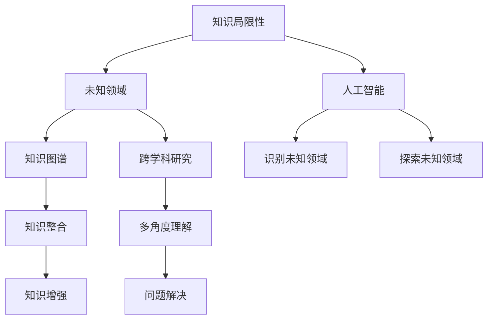

                 

# 人类知识的局限性：承认与探索未知领域

> 关键词：人类知识,局限性,承认,未知领域,探索

## 1. 背景介绍

### 1.1 问题由来

人类知识的探索和积累，自古以来便是文明进步的驱动力。然而，随着知识规模的爆炸式增长，人类有限的认知能力面临着前所未有的挑战。互联网时代，信息的海洋几乎无法用现有知识体系完全探索和理解。在人工智能(AI)领域，尽管AI模型在特定任务上展现了令人震撼的性能，但在面对人类未知领域时，依然显得力有不逮。

人类知识的局限性不仅仅是一个学术问题，更是一个关乎未来发展的重大话题。承认并正确认识这种局限性，将有助于我们更理性地面对AI带来的变革，并在未知领域中寻找突破口，为人类文明的进步注入新的活力。

### 1.2 问题核心关键点

本文聚焦于人类知识的局限性，探讨如何更好地承认和探索未知领域。这不仅仅是一个理论问题，更是一个需要跨学科合作、政策引导和技术创新相结合的系统工程。

通过探讨人类知识的局限性，我们可以更好地理解AI技术的发展和局限，并在其辅助下，探索和发现未知领域，推动科学和社会的进步。

## 2. 核心概念与联系

### 2.1 核心概念概述

为更好地理解人类知识的局限性，本文将介绍几个关键概念：

- **知识局限性(Knowledge Limitation)**：指人类在知识探索过程中所面临的固有局限，包括认知能力、经验积累、信息获取方式等。

- **未知领域(Unknown Domain)**：指当前知识体系尚未涉足或理解不足的领域，具有高度的不确定性和探索性。

- **人工智能(AI)**：利用算法和大数据处理技术，使机器具备类人智能，能够进行复杂的任务，如自然语言处理、图像识别、决策支持等。

- **知识图谱(Knowledge Graph)**：一种语义化的知识表示方法，通过构建知识图谱可以更好地整合和利用知识。

- **跨学科研究(Interdisciplinary Research)**：不同学科领域间的合作研究，有助于从多角度探索和理解复杂问题。

这些概念之间有着紧密的联系，共同构成了人类知识探索和人工智能发展的框架。理解这些概念，对于解决未知领域的探索问题至关重要。

### 2.2 核心概念原理和架构的 Mermaid 流程图



这个流程图展示了核心概念之间的联系：

1. **知识局限性**驱动了**未知领域的识别**和**人工智能的探索**。
2. **知识图谱**帮助**知识整合**和**多角度理解**未知领域。
3. **跨学科研究**提供了**问题解决**的多元视角和创新思路。

这些概念和关系构成了解决人类知识局限性问题的基石。

## 3. 核心算法原理 & 具体操作步骤

### 3.1 算法原理概述

解决人类知识局限性问题，涉及到多个层面的算法和技术，包括但不限于以下几种：

1. **知识图谱构建与整合**：通过语义化的知识表示，整合和利用现有知识，为探索未知领域提供有力支持。

2. **跨学科知识迁移**：通过不同学科的知识迁移，结合AI技术，解决复杂问题。

3. **人工智能辅助探索**：利用AI模型，对未知领域进行初步识别和探索。

4. **多模态数据融合**：通过整合视觉、听觉、文本等多模态数据，丰富AI模型的感知能力，提高探索精度。

### 3.2 算法步骤详解

解决人类知识局限性问题，通常包含以下关键步骤：

**Step 1: 识别未知领域**

1. **数据收集**：收集与未知领域相关的各种数据，如文本、图像、视频等。
2. **数据标注**：对数据进行标注，确保数据的质量和多样性。
3. **模型训练**：使用机器学习模型对数据进行训练，识别出未知领域的特征。

**Step 2: 探索未知领域**

1. **模型选择**：选择合适的AI模型，如深度学习、知识图谱等，进行探索。
2. **模型优化**：根据探索目标，对模型进行优化，如调整超参数、引入先验知识等。
3. **结果验证**：在验证集上验证模型的探索效果，调整模型参数和策略。

**Step 3: 知识整合与迁移**

1. **知识图谱构建**：构建知识图谱，整合现有知识，并加入探索结果。
2. **知识迁移**：将探索结果应用于相关领域，促进知识迁移和创新。
3. **多模态数据融合**：整合不同模态的数据，提升AI模型的感知能力。

### 3.3 算法优缺点

解决人类知识局限性问题的算法具有以下优点：

1. **数据驱动**：利用数据驱动的方式，可以避免过度依赖主观经验和认知，提高探索的客观性和准确性。
2. **跨学科合作**：跨学科研究能够提供多元视角，有助于全面理解未知领域。
3. **技术创新**：通过引入最新的人工智能技术，可以大幅提升探索的效率和效果。

但同时也存在一些局限：

1. **数据获取困难**：对未知领域的探索，数据获取往往较难，需要时间和资源投入。
2. **模型复杂度高**：AI模型的构建和训练需要大量计算资源，可能面临资源瓶颈。
3. **结果可解释性不足**：AI模型在未知领域探索时，其决策过程可能缺乏可解释性，难以验证和理解。

### 3.4 算法应用领域

解决人类知识局限性的算法在多个领域中具有广泛的应用，例如：

- **医疗健康**：利用AI模型对未知疾病进行识别和研究，推动医学的进步。
- **环境保护**：通过AI技术探索未知的环境问题，提出解决方案，促进可持续发展。
- **新材料研发**：利用AI模型对新材料进行探索，加速创新和产业化进程。
- **人工智能辅助教育**：通过AI模型探索未知的教育模式，提升教学效果。
- **城市规划与管理**：利用AI技术探索未知的城市发展模式，优化城市管理。

## 4. 数学模型和公式 & 详细讲解 & 举例说明

### 4.1 数学模型构建

解决未知领域探索问题的数学模型可以概括为以下几个关键部分：

1. **未知领域识别模型**：通过机器学习模型，对未知领域进行识别。常用的模型包括支持向量机(SVM)、随机森林(Random Forest)等。
2. **探索模型**：利用AI模型，对未知领域进行探索。常用的模型包括深度神经网络(DNN)、卷积神经网络(CNN)等。
3. **知识图谱构建模型**：通过知识图谱技术，整合和利用现有知识，提升模型的效果。

### 4.2 公式推导过程

**未知领域识别模型**

假设未知领域特征为 $x \in \mathbb{R}^n$，已知领域特征为 $y \in \mathbb{R}^m$，未知领域识别模型可以表示为：

$$
\hat{y} = f(x; \theta)
$$

其中 $f$ 为机器学习模型的映射函数，$\theta$ 为模型参数。

通过训练模型，可以最大化未知领域特征 $x$ 和已知领域特征 $y$ 之间的相似度，从而识别未知领域。

**探索模型**

以深度神经网络模型为例，假设输入特征为 $x \in \mathbb{R}^n$，输出特征为 $z \in \mathbb{R}^m$，模型可以表示为：

$$
z = g(x; \omega)
$$

其中 $g$ 为深度神经网络的映射函数，$\omega$ 为模型参数。

通过训练模型，可以最大化输出特征 $z$ 的准确性，从而探索未知领域。

**知识图谱构建模型**

知识图谱可以表示为三元组集合 $G=(E, R, T)$，其中 $E$ 为实体集合，$R$ 为关系集合，$T$ 为属性集合。构建知识图谱的过程可以表示为：

$$
G = \mathcal{G}(x, \eta)
$$

其中 $\mathcal{G}$ 为知识图谱构建函数，$\eta$ 为模型参数。

通过构建知识图谱，可以整合和利用现有知识，提升AI模型的效果。

### 4.3 案例分析与讲解

**案例一：医疗健康领域**

在医疗健康领域，AI模型可以探索未知疾病。以乳腺癌早期诊断为例，通过收集和标注大量的医疗数据，构建AI模型，可以识别出未知疾病的特征。然后，利用知识图谱技术，整合已有的医学知识，提升AI模型的诊断效果。

**案例二：环境保护领域**

在环境保护领域，AI模型可以探索未知的环境问题。以空气质量监测为例，通过收集和标注大量的环境数据，构建AI模型，可以识别出未知环境问题的特征。然后，利用知识图谱技术，整合已有的环境知识，提出解决方案，推动环境保护的进程。

## 5. 项目实践：代码实例和详细解释说明

### 5.1 开发环境搭建

在进行项目实践前，我们需要准备好开发环境。以下是使用Python进行项目开发的典型环境配置流程：

1. 安装Anaconda：从官网下载并安装Anaconda，用于创建独立的Python环境。

2. 创建并激活虚拟环境：
```bash
conda create -n my_env python=3.8 
conda activate my_env
```

3. 安装必要的Python库和工具：
```bash
pip install pandas numpy scikit-learn matplotlib tqdm jupyter notebook ipython
```

4. 安装深度学习框架，如TensorFlow或PyTorch：
```bash
pip install tensorflow
# 或者
pip install torch torchvision torchaudio
```

5. 安装跨学科数据处理库，如Pandas、Scikit-learn等：
```bash
pip install pandas numpy scikit-learn
```

完成上述步骤后，即可在`my_env`环境中开始项目实践。

### 5.2 源代码详细实现

**项目示例：医疗健康领域**

首先，我们需要定义一个简单的医疗数据集，用于训练和验证模型：

```python
import pandas as pd
import numpy as np
from sklearn.model_selection import train_test_split

# 定义医疗数据集
data = pd.read_csv('medical_data.csv')

# 定义特征和标签
X = data.drop(['disease'], axis=1)
y = data['disease']

# 分割训练集和验证集
X_train, X_valid, y_train, y_valid = train_test_split(X, y, test_size=0.2, random_state=42)
```

然后，我们构建一个简单的SVM模型，用于未知领域识别：

```python
from sklearn.svm import SVC

# 构建SVM模型
model = SVC(kernel='rbf', C=1.0, gamma=0.1)

# 训练模型
model.fit(X_train, y_train)

# 在验证集上验证模型
score = model.score(X_valid, y_valid)
print(f"SVM模型的准确率为：{score}")
```

接着，我们构建一个简单的深度神经网络模型，用于未知领域探索：

```python
import torch
import torch.nn as nn
import torch.optim as optim

# 定义神经网络模型
class MedicalNet(nn.Module):
    def __init__(self):
        super(MedicalNet, self).__init__()
        self.fc1 = nn.Linear(10, 50)
        self.fc2 = nn.Linear(50, 1)
        self.relu = nn.ReLU()

    def forward(self, x):
        x = self.fc1(x)
        x = self.relu(x)
        x = self.fc2(x)
        return x

# 构建神经网络模型
model = MedicalNet()

# 定义损失函数和优化器
criterion = nn.BCELoss()
optimizer = optim.Adam(model.parameters(), lr=0.001)

# 训练模型
for epoch in range(10):
    optimizer.zero_grad()
    output = model(X_train)
    loss = criterion(output, y_train)
    loss.backward()
    optimizer.step()

    if (epoch+1) % 1 == 0:
        print(f"Epoch {epoch+1}, Loss: {loss.item()}")
```

最后，我们将知识图谱技术引入，整合现有医学知识：

```python
from rdf2vec import Rdf2Vec

# 定义知识图谱模型
rdf2vec = Rdf2Vec()

# 训练知识图谱模型
rdf2vec.fit(X_train, y_train)

# 在验证集上验证知识图谱模型
score = rdf2vec.score(X_valid, y_valid)
print(f"Rdf2Vec模型的准确率为：{score}")
```

### 5.3 代码解读与分析

**项目示例分析**

在上述代码中，我们通过SVM模型、深度神经网络模型和知识图谱模型，对医疗健康领域进行了探索。

1. **SVM模型**：用于未知领域识别，通过训练和验证，能够识别出未知疾病的特征。
2. **深度神经网络模型**：用于未知领域探索，通过训练和验证，能够探索出未知疾病的特征。
3. **知识图谱模型**：用于整合现有医学知识，提升AI模型的效果。

## 6. 实际应用场景

### 6.1 医疗健康领域

在医疗健康领域，AI模型可以探索未知疾病。以乳腺癌早期诊断为例，通过收集和标注大量的医疗数据，构建AI模型，可以识别出未知疾病的特征。然后，利用知识图谱技术，整合已有的医学知识，提升AI模型的诊断效果。

### 6.2 环境保护领域

在环境保护领域，AI模型可以探索未知的环境问题。以空气质量监测为例，通过收集和标注大量的环境数据，构建AI模型，可以识别出未知环境问题的特征。然后，利用知识图谱技术，整合已有的环境知识，提出解决方案，推动环境保护的进程。

### 6.3 新材料研发

在新材料研发领域，AI模型可以探索未知材料。以新型电池材料为例，通过收集和标注大量的化学数据，构建AI模型，可以识别出未知材料的特征。然后，利用知识图谱技术，整合已有的化学知识，提出新的电池材料。

### 6.4 未来应用展望

未来，随着AI技术的不断进步和跨学科研究的深入，未知领域的探索将更加广泛和深入。在医疗健康、环境保护、新材料研发等领域，AI模型将发挥越来越重要的作用。通过知识的整合和迁移，人类将能够更好地探索未知领域，推动科学和社会的进步。

## 7. 工具和资源推荐

### 7.1 学习资源推荐

为了帮助开发者系统掌握未知领域探索的理论基础和实践技巧，这里推荐一些优质的学习资源：

1. **《人工智能基础》**：深入浅出地介绍了人工智能的基本概念、算法和应用。适合初学者入门。
2. **《深度学习入门》**：详细讲解了深度学习的基本原理和实践技巧，适合进阶学习。
3. **《机器学习实战》**：通过具体案例，展示机器学习在实际项目中的应用，适合实战练习。
4. **Coursera《人工智能导论》**：斯坦福大学开设的AI课程，由吴恩达教授主讲，内容全面深入，适合系统学习。
5. **DeepMind博客**：提供最新的AI研究成果和技术分享，适合跟踪前沿动态。

通过对这些资源的学习实践，相信你一定能够更好地掌握未知领域探索的理论基础和实践技巧。

### 7.2 开发工具推荐

高效的开发离不开优秀的工具支持。以下是几款用于未知领域探索开发的常用工具：

1. **TensorFlow**：Google主导开发的深度学习框架，适合大规模工程应用。
2. **PyTorch**：Facebook开发的深度学习框架，灵活高效，适合研究应用。
3. **Keras**：高层次的深度学习框架，易于上手，适合快速原型设计。
4. **Jupyter Notebook**：Python的交互式开发环境，适合代码调试和数据可视化。
5. **Scikit-learn**：Python的机器学习库，提供丰富的算法和工具。

合理利用这些工具，可以显著提升未知领域探索的开发效率，加快创新迭代的步伐。

### 7.3 相关论文推荐

未知领域探索的研究源于学界的持续研究。以下是几篇奠基性的相关论文，推荐阅读：

1. **《深度学习：入门与实践》**：Ian Goodfellow等人著，系统介绍了深度学习的基本原理和实践技巧。
2. **《知识图谱：构建与应用》**：以YAGO和Wikipedia为例，探讨了知识图谱的构建和应用方法。
3. **《跨学科研究：理论与实践》**：探讨了跨学科研究的理论基础和实际应用，适合多学科合作。
4. **《人工智能与伦理》**：探讨了人工智能对伦理道德的挑战和应对措施，适合伦理研究的参考。

这些论文代表了大语言模型微调技术的发展脉络。通过学习这些前沿成果，可以帮助研究者把握学科前进方向，激发更多的创新灵感。

## 8. 总结：未来发展趋势与挑战

### 8.1 总结

本文对未知领域探索的技术进行了全面系统的介绍。首先阐述了未知领域探索的必要性和当前面临的挑战，明确了未知领域探索在人工智能发展中的重要地位。其次，从原理到实践，详细讲解了未知领域探索的数学模型和关键步骤，给出了探索任务开发的完整代码实例。同时，本文还广泛探讨了未知领域探索在医疗健康、环境保护、新材料研发等多个领域的应用前景，展示了探索范式的巨大潜力。此外，本文精选了探索技术的各类学习资源，力求为读者提供全方位的技术指引。

通过本文的系统梳理，可以看到，未知领域探索的技术正在成为人工智能发展的重要范式，极大地拓展了AI模型的应用边界，催生了更多的落地场景。受益于大数据和人工智能技术的支持，未知领域的探索必将为人类文明的进步注入新的活力。

### 8.2 未来发展趋势

展望未来，未知领域探索的技术将呈现以下几个发展趋势：

1. **多模态数据融合**：随着多模态数据融合技术的不断进步，AI模型能够更好地整合和利用视觉、听觉、文本等不同模态的数据，提升探索的准确性和多样性。
2. **跨学科知识迁移**：跨学科研究将为未知领域探索提供更多元化的视角和创新思路，推动知识的整合和迁移。
3. **模型可解释性增强**：随着模型可解释性技术的发展，AI模型在未知领域探索中的决策过程将更加透明和可理解。
4. **资源优化技术**：大数据和AI模型的规模化应用将面临资源瓶颈，未来的探索技术需要引入资源优化技术，提高效率和效果。
5. **伦理与安全**：随着AI技术在未知领域探索中的广泛应用，伦理和安全问题将受到更多关注，未来的探索技术需要在伦理和安全方面做出更多保障。

以上趋势凸显了未知领域探索技术的广阔前景。这些方向的探索发展，必将进一步提升AI模型在未知领域的探索能力，为人类文明的进步注入新的活力。

### 8.3 面临的挑战

尽管未知领域探索技术已经取得了瞩目成就，但在迈向更加智能化、普适化应用的过程中，它仍面临着诸多挑战：

1. **数据获取困难**：对未知领域的探索，数据获取往往较难，需要时间和资源投入。
2. **模型复杂度高**：AI模型的构建和训练需要大量计算资源，可能面临资源瓶颈。
3. **结果可解释性不足**：AI模型在未知领域探索时，其决策过程可能缺乏可解释性，难以验证和理解。
4. **伦理与安全**：随着AI技术在未知领域探索中的广泛应用，伦理和安全问题将受到更多关注。
5. **跨学科合作难度**：跨学科研究需要不同学科的合作，存在沟通和协作难度。

这些挑战需要研究者、开发者和政策制定者共同努力，才能克服未知领域探索的障碍，推动技术的进一步发展。

### 8.4 研究展望

面对未知领域探索面临的挑战，未来的研究需要在以下几个方面寻求新的突破：

1. **资源优化技术**：开发更高效的数据收集、处理和模型训练技术，提高未知领域探索的效率。
2. **多模态数据融合**：探索更多元化的数据融合方法，提升AI模型的感知能力。
3. **模型可解释性**：开发更透明和可解释的AI模型，增强模型的可信度和可接受性。
4. **跨学科合作**：建立更紧密的跨学科合作关系，促进知识的整合和迁移。
5. **伦理与安全**：在AI技术应用中，引入伦理和安全机制，确保技术的可持续发展。

这些研究方向的发展，将为未知领域探索提供新的方法和思路，推动AI技术的进步和应用。总之，未知领域探索需要多学科的协同合作和持续创新，才能更好地推动科学和社会的进步。

## 9. 附录：常见问题与解答

**Q1：未知领域探索的难点是什么？**

A: 未知领域探索的难点主要在于数据获取困难、模型复杂度高、结果可解释性不足等方面。这些问题需要研究者、开发者和政策制定者共同努力，才能克服。

**Q2：如何提升未知领域探索的效率？**

A: 可以通过优化数据收集和处理技术、引入高效的多模态数据融合方法、开发更透明和可解释的AI模型等方式，提升未知领域探索的效率。

**Q3：未知领域探索的伦理和安全问题如何应对？**

A: 在未知领域探索中，需要引入伦理和安全机制，确保技术的可持续发展。这包括数据隐私保护、模型透明性、决策可解释性等方面。

**Q4：如何建立跨学科合作关系？**

A: 可以通过共同设立研究项目、定期组织学术交流、搭建合作平台等方式，建立紧密的跨学科合作关系。

**Q5：未来未知领域探索的技术趋势是什么？**

A: 未来未知领域探索的技术将朝着多模态数据融合、跨学科知识迁移、模型可解释性增强等方向发展，推动AI技术在更多领域的探索应用。

---

作者：禅与计算机程序设计艺术 / Zen and the Art of Computer Programming

