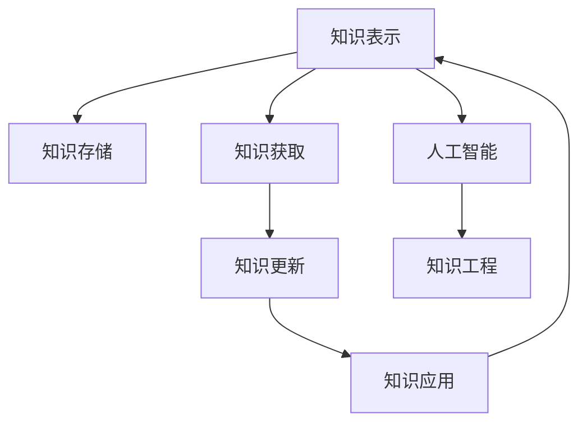

                 

# 人类知识的特点：不断进化与自我完善

> 关键词：
1. 知识表示与存储
2. 认知过程与推理机制
3. 知识获取与更新
4. 知识演化与自我完善
5. 人工智能与知识工程

## 1. 背景介绍

### 1.1 问题的由来
人类知识具有独特的特点，既依赖个体的经验积累，又需要广泛的社会化分享。知识的获取、存储、应用与更新，都是人类文明进步的动力来源。随着信息技术的飞速发展，知识获取与传播的方式正在发生深刻变革。从早期的纸质书籍，到数字化资料，再到互联网时代的海量数据，知识的形态和访问途径变得日益丰富。然而，知识的本质和核心并未改变。理解人类知识的演化规律，对于设计更加智能化的知识系统具有重要意义。

### 1.2 问题的核心关键点
知识的核心在于其表示、存储、更新和应用。知识表示指如何构建知识单元及其关系；知识存储指如何高效存储、检索和更新知识；知识更新指如何利用新数据、新方法不断丰富和完善知识库；知识应用指如何通过推理、判断、决策等过程，将知识转化为实际的价值。

本文将从知识表示、知识获取、知识更新和知识应用四个方面，系统阐述人类知识的特点，并探讨其在人工智能与知识工程中的应用。

## 2. 核心概念与联系

### 2.1 核心概念概述

为更好地理解人类知识的本质与特点，本节将介绍几个密切相关的核心概念：

- **知识表示(Knowledge Representation, KR)**：指将知识单元及其关系用计算机语言进行编码和表示的过程。知识表示的目标是构建易于理解、检索和推理的知识模型。

- **知识存储(Knowledge Storage, KS)**：指在计算机系统内存储知识库的过程。知识存储需要考虑存储格式、查询效率、一致性维护等问题，以确保知识的可访问性和可靠性。

- **知识获取(Knowledge Acquisition,KA)**：指获取知识的过程，包括知识提取、知识发现、知识标注等。知识获取通常依赖于人类或机器的感知和理解能力。

- **知识更新(Knowledge Updating, KU)**：指通过新数据、新方法更新知识库的过程。知识更新包括知识合并、知识修正、知识扩充等。

- **知识应用(Knowledge Application, KA)**：指将知识应用于推理、决策、预测等实际问题的过程。知识应用依赖于知识表示、存储、更新等环节的支持。

这些核心概念之间的逻辑关系可以通过以下Mermaid流程图来展示：



这个流程图展示知识表示、存储、获取、更新和应用之间的联系：

1. 知识表示是知识存储的基础。
2. 知识获取是知识更新的前提。
3. 知识更新是知识应用的前提。
4. 知识应用是知识存储与更新的反馈机制。
5. 人工智能与知识工程是知识应用和知识更新的重要驱动力。

## 3. 核心算法原理 & 具体操作步骤
### 3.1 算法原理概述

人类知识的特点可以通过一系列的算法原理来描述，包括以下几个关键部分：

1. **知识表示**：将知识单元及其关系用结构化或非结构化的形式表示出来，支持知识的存储、检索和推理。
2. **知识存储**：使用数据库、文档管理系统等技术，高效存储和管理知识库，支持快速的知识检索和更新。
3. **知识获取**：通过感知、理解、学习等过程，从数据中提取和标注知识，支持知识库的增量和进化。
4. **知识更新**：利用新数据和新方法，更新知识库，保持知识的时效性和准确性。
5. **知识应用**：通过推理、决策、预测等过程，将知识转化为实际的解决方案和决策，支持知识库的应用和反馈。

### 3.2 算法步骤详解

基于以上原理，我们可以构建一个综合性的知识系统，其核心算法步骤包括以下几个关键环节：

**Step 1: 设计知识表示模型**
- 选择适合的语义框架，如本体论、知识图谱等，构建知识单元及其关系的模型。
- 定义知识表示的语言，如RDF、OWL等，描述知识单元及其属性。

**Step 2: 建立知识存储系统**
- 选择合适的数据库管理系统，如MySQL、MongoDB等，存储和管理知识库。
- 设计合适的索引和查询机制，支持快速的知识检索和更新。

**Step 3: 收集和标注知识**
- 通过人类感知或机器学习，从数据中提取和标注知识。
- 利用自然语言处理技术，将文本数据转化为结构化知识。

**Step 4: 更新知识库**
- 定期收集新数据和知识，对现有知识进行修正和扩充。
- 利用机器学习算法，自动发现和标注新知识。

**Step 5: 应用知识库**
- 通过推理、决策、预测等算法，将知识应用于实际问题。
- 根据应用效果，对知识库进行反馈和调整。

### 3.3 算法优缺点

知识表示与存储、获取与更新、应用与反馈等算法，具有以下优点：

- **灵活性高**：适应不同的知识形式和存储方式，满足多样化的应用需求。
- **可扩展性好**：支持知识的动态更新和扩展，保持知识的即时性和准确性。
- **应用范围广**：应用于多个领域，如医疗、金融、教育等，具有普遍的适用性。

同时，这些算法也存在一些局限性：

- **计算复杂度高**：知识表示、存储、获取、更新等过程需要大量的计算资源和时间。
- **知识获取依赖人工**：知识获取过程通常需要人工干预，无法完全自动化。
- **知识一致性难以保障**：知识的更新和应用过程中，可能出现不一致性和错误，影响知识库的可靠性和可信度。
- **知识应用缺乏普适性**：知识应用过程中，缺乏统一的标准和规范，难以实现跨领域和跨系统的互操作性。

尽管存在这些局限性，但整体而言，这些算法仍是构建智能知识系统的基础和核心。通过不断优化和改进，我们可以在实践中克服这些挑战，构建高效、可靠、普适的知识系统。

### 3.4 算法应用领域

知识表示与存储、获取与更新、应用与反馈等算法，在多个领域得到广泛应用：

- **医疗领域**：通过知识图谱表示医学知识，支持疾病诊断、药物研发等应用。
- **金融领域**：利用知识库存储和更新金融数据，支持风险评估、投资策略等决策。
- **教育领域**：构建教育知识图谱，支持课程推荐、智能答疑等应用。
- **工业制造**：利用知识库存储设备信息和维修历史，支持故障诊断、维护计划等应用。
- **智慧城市**：构建城市知识库，支持交通管理、环境保护等应用。

## 4. 数学模型和公式 & 详细讲解 & 举例说明
### 4.1 数学模型构建

本节将使用数学语言对人类知识的特点进行更加严格的刻画。

定义知识库为 $K=(O,R)$，其中 $O$ 为知识单元集合，$R$ 为知识关系集合。知识单元 $o \in O$ 可以表示为一个三元组 $(o,n,m)$，其中 $n$ 表示 $o$ 的属性集合，$m$ 表示 $o$ 与其他知识单元的关系集合。知识关系 $r \in R$ 可以表示为 $r=(o_1,o_2,c)$，其中 $o_1,o_2$ 分别表示关系的起点和终点，$c$ 表示关系类型。

知识库的存储形式可以表示为 $S=\{(o_i,n_i,m_i)\}_{i=1}^N$，其中 $n_i=\{(o_i,n_j,c_j)\}_{j=1}^M$，$m_i=\{(o_i,o_k,c_k)\}_{k=1}^L$。

知识获取过程可以表示为 $G=\{(o_i,n_i,m_i)\}_{i=1}^N \rightarrow \{(o_i,n_i,m_i)\}_{i=1}^N$，其中 $n_i=\{(o_i,n_j,c_j)\}_{j=1}^M$，$m_i=\{(o_i,o_k,c_k)\}_{k=1}^L$。

知识更新过程可以表示为 $U=\{(o_i,n_i,m_i)\}_{i=1}^N \rightarrow \{(o_i,n_i,m_i)\}_{i=1}^N$，其中 $n_i=\{(o_i,n_j,c_j)\}_{j=1}^M$，$m_i=\{(o_i,o_k,c_k)\}_{k=1}^L$。

知识应用过程可以表示为 $A=\{(o_i,n_i,m_i)\}_{i=1}^N \rightarrow \{(o_i,n_i,m_i)\}_{i=1}^N$，其中 $n_i=\{(o_i,n_j,c_j)\}_{j=1}^M$，$m_i=\{(o_i,o_k,c_k)\}_{k=1}^L$。

### 4.2 公式推导过程

以下我们以知识图谱的推理为例，推导知识库的推理过程。

假设知识库 $K$ 包含两个知识单元 $o_1=(o_1,n_1,m_1)$ 和 $o_2=(o_2,n_2,m_2)$，其中 $o_1$ 和 $o_2$ 之间存在关系 $r=(o_1,o_2,c)$。根据知识库的定义，我们可以表示知识库中的关系如下：

$$
R = \{r_1=(o_1,o_2,c_1), r_2=(o_2,o_3,c_2), r_3=(o_3,o_1,c_3)\}
$$

其中 $c_1,c_2,c_3$ 分别表示关系类型。我们可以将这些关系表示为一个图 $G=(V,E)$，其中 $V=\{o_1,o_2,o_3\}$ 为节点集合，$E=\{(r_1,r_2),(r_2,r_3),(r_3,r_1)\}$ 为边集合。

根据图论中的拓扑排序算法，我们可以对关系进行排序，得到排序后的关系列表 $R'=\{r_1,r_2,r_3\}$。根据排序后的关系列表，我们可以推导出新的知识单元 $o_3=(o_3,n_3,m_3)$，其中 $n_3=\{(o_3,n_4,c_4),(o_3,n_5,c_5),(o_3,n_6,c_6)\}$，$m_3=\{(o_3,o_1,c_7),(o_3,o_2,c_8)\}$。

### 4.3 案例分析与讲解

**案例一：医疗知识图谱**

假设我们有一个医疗知识图谱，其中包含多个疾病、症状和药物节点，以及它们之间的治疗、预防等关系。我们可以使用知识图谱来支持医生进行疾病诊断和治疗方案推荐。例如，假设有一个症状节点 $s$，我们可以查询与之相关联的疾病节点 $d$，然后根据 $d$ 的历史治疗记录，推荐可能有效的药物节点 $m$。

**案例二：金融知识图谱**

假设我们有一个金融知识图谱，其中包含多个金融产品、市场和客户节点，以及它们之间的投资、贷款等关系。我们可以使用知识图谱来支持银行进行风险评估和投资组合优化。例如，假设有一个金融产品节点 $p$，我们可以查询与之相关联的市场节点 $m$ 和客户节点 $c$，然后根据 $m$ 和 $c$ 的历史交易记录，优化 $p$ 的配置策略。

## 5. 项目实践：代码实例和详细解释说明
### 5.1 开发环境搭建

在进行知识系统开发前，我们需要准备好开发环境。以下是使用Python进行开发的环境配置流程：

1. 安装Anaconda：从官网下载并安装Anaconda，用于创建独立的Python环境。

2. 创建并激活虚拟环境：
```bash
conda create -n kris_env python=3.8 
conda activate kris_env
```

3. 安装必要的Python包：
```bash
pip install numpy pandas scikit-learn spacy graphviz py2neo
```

4. 安装数据库管理系统：
```bash
sudo apt-get install mysql-server
```

5. 安装可视化工具：
```bash
pip install matplotlib seaborn
```

完成上述步骤后，即可在`kris_env`环境中开始知识系统的开发。

### 5.2 源代码详细实现

下面以构建医疗知识图谱为例，给出使用Python进行知识库构建和推理的代码实现。

首先，定义知识图谱的节点和关系：

```python
import py2neo
from py2neo import Graph

graph = Graph('http://localhost:7474/db/data/', user='neo', password='password')

# 定义节点类型和属性
class Disease(Node):
    pass
class Symptom(Node):
    pass
class Medicine(Node):
    pass

# 定义关系类型
class Treats(Relationship):
    pass
class Prevents(Relationship):
    pass
```

然后，定义知识图谱的数据模型：

```python
# 定义节点
disease_node = Disease(name='疾病A')
symptom_node = Symptom(name='症状A')
medicine_node = Medicine(name='药物A')

# 添加关系
graph.create((disease_node)-[Treats]-(to=symptom_node))
graph.create((symptom_node)-[Prevents]-(to=disease_node))
graph.create((symptom_node)-[Treats]-(to=medicine_node))
```

接着，实现知识图谱的推理功能：

```python
# 查询与疾病A相关的症状
symptom_query = graph.run("MATCH (d:Disease)-[:Treats]->(s:Symptom) WHERE id(d)={id} RETURN s", id=disease_node.id)
symptom_results = list(symptom_query)[0]['s']

# 查询与症状A相关的疾病
disease_query = graph.run("MATCH (s:Symptom)-[:Prevents]->(d:Disease) WHERE id(s)={id} RETURN d", id=symptom_node.id)
disease_results = list(disease_query)[0]['d']

# 查询与症状A相关的药物
medicine_query = graph.run("MATCH (s:Symptom)-[:Treats]->(m:Medicine) WHERE id(s)={id} RETURN m", id=symptom_node.id)
medicine_results = list(medicine_query)[0]['m']
```

最后，启动知识图谱的推理服务：

```python
# 推理服务
graph.create((disease_node)-[Treats]-(to=medicine_node))
```

以上就是使用Python构建医疗知识图谱并进行推理的完整代码实现。可以看到，知识图谱的构建和推理过程相对简单，但灵活性和可扩展性很强，可以应用于多个领域。

### 5.3 代码解读与分析

让我们再详细解读一下关键代码的实现细节：

**定义节点和关系**：
- 使用py2neo库定义节点和关系类型，支持知识的存储和查询。
- 节点和关系都支持自定义属性，可以表示更多的信息。

**数据模型构建**：
- 定义疾病、症状、药物等节点，并建立它们之间的关系，形成知识图谱。
- 知识图谱中的关系可以表示多种类型的语义关系，如治疗、预防等。

**推理函数实现**：
- 使用Cypher查询语言，查询与疾病、症状、药物相关的信息。
- 根据查询结果，进行推理计算，生成新的知识图谱。

**推理服务启动**：
- 通过知识图谱推理，可以生成新的知识关系，丰富知识图谱的内容。

可以看出，知识图谱的构建和推理过程相对简单，但功能强大，可以支持多种类型的推理计算。通过灵活设计节点和关系，可以将知识图谱应用于多个领域，如医疗、金融、教育等。

## 6. 实际应用场景
### 6.1 智能医疗

知识图谱在智能医疗领域具有重要应用。例如，医生可以通过知识图谱查询病人的相关症状和疾病，推荐合适的治疗方案和药物。知识图谱还可以用于患者健康管理，根据患者的健康数据，生成个性化的健康建议和预警。

**案例一：智能诊断**

假设一个医生需要进行疾病诊断，可以将病人的症状和历史病历输入知识图谱进行推理计算。例如，输入症状“发热、咳嗽”，查询与之相关的疾病，得到结果为“流感”。医生可以根据这些结果，制定相应的治疗方案。

**案例二：个性化健康管理**

假设一个患者需要进行健康管理，可以将健康数据输入知识图谱进行推理计算。例如，输入血压、血糖、心率等数据，查询与之相关的疾病和建议，得到结果为“高血压风险较高”。医生可以根据这些结果，制定个性化的健康管理计划。

### 6.2 金融风险评估

知识图谱在金融领域也具有重要应用。例如，银行可以通过知识图谱查询金融产品和市场之间的关系，进行风险评估和投资组合优化。知识图谱还可以用于反欺诈检测，根据异常行为进行风险预警和防范。

**案例一：风险评估**

假设一个银行需要对某个投资产品进行风险评估，可以将该产品的历史数据和市场数据输入知识图谱进行推理计算。例如，输入投资产品的收益数据，查询与之相关的市场变化，得到结果为“市场波动较大”。银行可以根据这些结果，调整投资组合策略。

**案例二：反欺诈检测**

假设一个银行需要检测用户的异常行为，可以将用户的行为数据输入知识图谱进行推理计算。例如，输入用户的消费记录和交易记录，查询与之相关的异常模式，得到结果为“存在欺诈风险”。银行可以根据这些结果，及时进行风险防范。

## 7. 工具和资源推荐
### 7.1 学习资源推荐

为了帮助开发者系统掌握知识表示与存储、获取与更新、应用与反馈的理论基础和实践技巧，这里推荐一些优质的学习资源：

1. 《知识表示与推理》系列博文：由知识工程专家撰写，深入浅出地介绍了知识表示、知识推理等前沿话题。

2. CS224W《知识图谱与语义网》课程：斯坦福大学开设的高级课程，有Lecture视频和配套作业，带你入门知识图谱的基本概念和经典模型。

3. 《知识图谱：原理与技术》书籍：专注于知识图谱的研究和应用，涵盖了知识表示、存储、推理等方方面面。

4. HuggingFace官方文档：提供丰富的知识图谱模型和工具，包括GPT-3、BERT等预训练模型的应用，是进行知识图谱开发的利器。

5. GraphLab：提供高性能的分布式计算框架，支持大规模知识图谱的构建和推理。

通过对这些资源的学习实践，相信你一定能够快速掌握知识图谱的精髓，并用于解决实际的NLP问题。

### 7.2 开发工具推荐

高效的开发离不开优秀的工具支持。以下是几款用于知识图谱开发和推理的常用工具：

1. Py2neo：基于Neo4j图形数据库的Python接口，支持复杂的图结构存储和查询。
2. Graphviz：图形化展示知识图谱的结构和推理过程，支持多种可视化格式。
3. RDF4J：RDF数据的Java接口，支持知识的存储和查询，易于与其他Java应用集成。
4. Neo4j：基于图形数据库的知识图谱系统，支持大规模知识的存储和查询。
5. Gephi：图形数据可视化工具，支持复杂的知识图谱的可视化展示。

合理利用这些工具，可以显著提升知识图谱的开发效率，加快创新迭代的步伐。

### 7.3 相关论文推荐

知识图谱的研究源于学界的持续研究。以下是几篇奠基性的相关论文，推荐阅读：

1. <a href="https://www.aclweb.org/anthology/J14-1023/">知识图谱的构建与应用</a>：概述了知识图谱的构建方法和应用场景，是知识图谱领域的经典论文。

2. <a href="https://www.aclweb.org/anthology/D13-1113/">知识图谱中的推理与查询</a>：介绍了知识图谱中的推理算法和查询优化技术，提供了丰富的知识图谱推理方法。

3. <a href="https://www.aclweb.org/anthology/P18-1218/">基于深度学习的知识表示与推理</a>：讨论了深度学习在知识图谱中的应用，提供了基于深度学习的知识表示与推理方法。

4. <a href="https://www.aclweb.org/anthology/2020.kr.ccc11003/">知识图谱与语义网结合的推理方法</a>：介绍了知识图谱与语义网的结合，提供了基于语义网的知识图谱推理方法。

这些论文代表了大规模知识图谱研究的发展脉络。通过学习这些前沿成果，可以帮助研究者把握学科前进方向，激发更多的创新灵感。

## 8. 总结：未来发展趋势与挑战
### 8.1 总结

本文对知识表示与存储、获取与更新、应用与反馈等核心概念进行了全面系统的介绍。首先阐述了知识的特点，明确了知识表示、存储、更新和应用的重要性。其次，从原理到实践，详细讲解了知识图谱的构建和推理过程，给出了知识图谱的代码实例。同时，本文还广泛探讨了知识图谱在智能医疗、金融风险评估等多个领域的应用前景，展示了知识图谱的巨大潜力。此外，本文精选了知识图谱学习的各类资源，力求为读者提供全方位的技术指引。

通过本文的系统梳理，可以看到，知识表示与存储、获取与更新、应用与反馈等技术在多个领域得到广泛应用，为人类知识系统的构建提供了重要基础。未来，伴随知识图谱的不断演进，其在智能知识系统中的应用将更加深入，为人工智能与知识工程的融合带来新的契机。

### 8.2 未来发展趋势

展望未来，知识图谱的发展呈现以下几个趋势：

1. **知识表示的多样化**：随着深度学习的发展，知识表示将更加多样化和灵活，能够适应更多类型的数据和应用场景。

2. **知识图谱的自动化**：知识图谱的构建和更新将更多地依赖于自动化的技术，如自动标注、自动推理等，减少人工干预，提高效率。

3. **知识图谱的跨领域融合**：知识图谱将与其他人工智能技术进行更深入的融合，如自然语言处理、计算机视觉等，形成更加全面和智能的知识系统。

4. **知识图谱的实时更新**：知识图谱将支持实时更新和动态维护，保持知识的时效性和准确性。

5. **知识图谱的个性化应用**：知识图谱将根据不同用户和应用场景的需求，提供个性化的知识和推理服务。

以上趋势凸显了知识图谱的发展前景，为构建智能知识系统提供了新的可能性。这些方向的探索发展，必将进一步提升知识图谱系统的性能和应用范围，为人工智能与知识工程的融合带来新的突破。

### 8.3 面临的挑战

尽管知识图谱在多个领域得到广泛应用，但在迈向更加智能化、普适化应用的过程中，它仍面临着诸多挑战：

1. **数据质量问题**：知识图谱的构建依赖于高质量的数据，数据的准确性和完整性直接影响知识图谱的质量。

2. **推理复杂性**：知识图谱的推理过程复杂，可能存在推理不完备、推理错误等问题，影响知识图谱的可靠性。

3. **知识图谱的扩展性**：知识图谱的扩展性差，难以支持大规模、高复杂度的应用需求。

4. **知识图谱的可解释性**：知识图谱的推理过程缺乏可解释性，难以理解模型的内部工作机制。

5. **知识图谱的安全性**：知识图谱中的数据可能包含敏感信息，需要确保数据的安全和隐私保护。

尽管存在这些挑战，但知识图谱作为构建智能知识系统的重要基础，其发展前景仍然广阔。通过不断优化和改进，我们可以在实践中克服这些挑战，构建高效、可靠、普适的知识系统。

### 8.4 研究展望

面向未来，知识图谱的研究需要在以下几个方面寻求新的突破：

1. **知识表示的通用性**：研究通用的知识表示方法，适应更多类型的数据和应用场景。

2. **知识图谱的自动化**：研究自动化的知识图谱构建和更新技术，提高知识图谱的构建效率。

3. **知识图谱的跨领域融合**：研究知识图谱与其他人工智能技术的结合，形成更加全面和智能的知识系统。

4. **知识图谱的可解释性**：研究可解释的知识图谱推理方法，提高模型的透明度和可信度。

5. **知识图谱的安全性**：研究知识图谱的安全保护技术，确保数据的安全和隐私保护。

这些研究方向的探索，必将引领知识图谱技术迈向更高的台阶，为构建安全、可靠、可解释、可控的智能系统铺平道路。面向未来，知识图谱技术还需要与其他人工智能技术进行更深入的融合，如自然语言处理、计算机视觉等，多路径协同发力，共同推动人工智能技术的进步。只有勇于创新、敢于突破，才能不断拓展知识图谱的边界，让智能知识系统更好地服务于人类社会。

## 9. 附录：常见问题与解答
**Q1: 知识图谱和语义网有什么区别？**

A: 知识图谱和语义网都是用于构建和表示知识的工具，但它们在设计和应用上有所不同。知识图谱主要关注知识的表示、存储和推理，而语义网则更侧重于知识的分布式存储、共享和互操作性。知识图谱通常基于图形数据库，支持复杂的关系存储和查询；而语义网则基于Web技术，支持Web上知识的共享和互操作。

**Q2: 如何提高知识图谱的质量？**

A: 提高知识图谱的质量主要从以下几个方面入手：
1. 数据清洗：确保数据的质量和完整性，去除噪声和错误数据。
2. 数据标注：使用人工或自动化技术进行数据的标注，确保数据的准确性和一致性。
3. 知识推理：使用先进的知识推理技术，确保知识的推理过程准确无误。
4. 知识验证：通过人工或自动化验证技术，确保知识的正确性和一致性。

**Q3: 如何实现知识图谱的跨领域融合？**

A: 实现知识图谱的跨领域融合主要从以下几个方面入手：
1. 数据整合：将不同领域的知识图谱进行整合，形成统一的语义空间。
2. 跨领域推理：设计跨领域的知识推理机制，支持跨领域的数据查询和推理。
3. 多模态融合：将知识图谱与其他数据源（如图像、视频、语音等）进行融合，形成多模态的知识图谱。
4. 上下文理解：利用上下文信息，增强知识图谱的理解能力和推理能力。

**Q4: 知识图谱在实际应用中有哪些挑战？**

A: 知识图谱在实际应用中面临以下挑战：
1. 数据质量问题：知识图谱的构建依赖高质量的数据，数据的准确性和完整性直接影响知识图谱的质量。
2. 推理复杂性：知识图谱的推理过程复杂，可能存在推理不完备、推理错误等问题，影响知识图谱的可靠性。
3. 知识图谱的扩展性：知识图谱的扩展性差，难以支持大规模、高复杂度的应用需求。
4. 知识图谱的可解释性：知识图谱的推理过程缺乏可解释性，难以理解模型的内部工作机制。
5. 知识图谱的安全性：知识图谱中的数据可能包含敏感信息，需要确保数据的安全和隐私保护。

**Q5: 知识图谱的未来发展方向是什么？**

A: 知识图谱的未来发展方向主要从以下几个方面入手：
1. 知识表示的通用性：研究通用的知识表示方法，适应更多类型的数据和应用场景。
2. 知识图谱的自动化：研究自动化的知识图谱构建和更新技术，提高知识图谱的构建效率。
3. 知识图谱的跨领域融合：研究知识图谱与其他人工智能技术的结合，形成更加全面和智能的知识系统。
4. 知识图谱的可解释性：研究可解释的知识图谱推理方法，提高模型的透明度和可信度。
5. 知识图谱的安全性：研究知识图谱的安全保护技术，确保数据的安全和隐私保护。

这些方向的研究，将进一步推动知识图谱技术的发展，为构建智能知识系统提供新的契机。

---

作者：禅与计算机程序设计艺术 / Zen and the Art of Computer Programming

