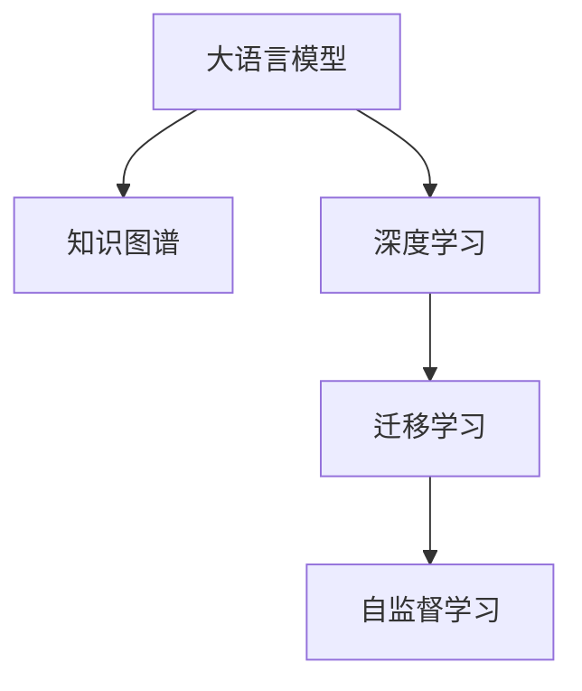

                 

# 人类知识的边界在哪里：无限的探索之旅

## 1. 背景介绍

在信息爆炸的时代，人类获取知识的渠道从未如此丰富。互联网、社交媒体、在线教育平台，无数的知识资源触手可及。但同时，面对海量的信息，如何筛选和吸收成为新的挑战。计算机技术的进步，尤其是人工智能和大数据技术的发展，为人类知识的探索开辟了新的路径。

本文将探讨人类知识的边界问题，即在计算机技术的辅助下，人类知识的探索可以走多远。通过深入分析大语言模型、机器学习和数据挖掘等前沿技术，揭示其对知识发现的潜在影响，以及其对人类知识边界扩展的启示。

## 2. 核心概念与联系

### 2.1 核心概念概述

本节将介绍几个核心概念及其相互联系，为后续深入探讨奠定基础。

- **大语言模型(Large Language Model, LLM)**：指通过大规模无标签文本数据预训练得到的语言模型。这类模型具备强大的语言理解和生成能力，能够在各种自然语言处理任务中表现优异。

- **知识图谱(Knowledge Graph)**：由实体、属性和关系构成的语义网络。知识图谱为知识组织和推理提供了结构化的表达形式，是知识工程的重要工具。

- **深度学习(Deep Learning)**：基于神经网络，特别是多层神经网络的机器学习方法。深度学习在图像识别、语音处理、自然语言处理等领域取得了显著成果。

- **迁移学习(Transfer Learning)**：指将一个领域学习到的知识，迁移到另一个相关领域的学习过程。迁移学习在大规模数据集上预训练模型，然后将其应用于具体任务，可以有效提升模型性能。

- **自监督学习(Self-Supervised Learning)**：指利用数据自身的特性进行模型训练，不需要手动标注。自监督学习可以有效地利用未标注数据进行模型预训练。

这些概念之间有着紧密的联系，共同构成了计算机辅助知识探索的技术框架。

### 2.2 核心概念原理和架构的 Mermaid 流程图



这个流程图展示了核心概念之间的逻辑关系：

1. 大语言模型通过预训练学习大规模无标签文本数据中的语言知识。
2. 知识图谱为语言模型提供了结构化的知识表示，使得模型能够更准确地理解语言。
3. 深度学习为模型训练提供了强大的算法支持，提高了模型的泛化能力。
4. 迁移学习通过在大规模数据集上预训练模型，使其能够更好地适应特定任务。
5. 自监督学习利用数据自身的特性，通过无标注数据进行预训练，提高了模型的鲁棒性。

这些概念共同推动了计算机辅助知识探索技术的发展，为人类知识的边界拓展提供了新的可能性。

## 3. 核心算法原理 & 具体操作步骤

### 3.1 算法原理概述

人类知识的边界问题，本质上是一个关于知识发现和推理的挑战。通过计算机技术的辅助，尤其是大语言模型和知识图谱的结合，我们可以更深入地探索和发现知识。

大语言模型通过预训练学习语言的知识，能够处理和理解自然语言，进行文本分类、信息检索、情感分析等任务。而知识图谱为语言模型提供了结构化的知识表示，使得模型能够更准确地推理和推断，进行实体识别、关系抽取、知识推理等任务。

### 3.2 算法步骤详解

基于上述概念，知识探索的过程大致可以分为以下步骤：

1. **数据收集与预处理**：收集文本数据、知识图谱等数据源，进行清洗、标注等预处理工作，为模型训练和推理做准备。
2. **模型训练与优化**：利用深度学习算法在大规模数据集上训练语言模型，使用迁移学习或自监督学习策略进行优化，提升模型的泛化能力和知识表示能力。
3. **知识推理与抽取**：将训练好的语言模型应用于具体任务，如信息检索、实体识别、关系抽取等，结合知识图谱进行知识推理和抽取，获取有价值的信息。
4. **结果展示与验证**：将推理结果展示给用户，并进行验证和反馈，进一步优化模型和知识表示，提升知识探索的准确性和可靠性。

### 3.3 算法优缺点

大语言模型和知识图谱的结合，在知识探索中具有以下优点：

- **泛化能力强**：通过大规模数据集的预训练和迁移学习，模型能够处理多种类型的数据，具有较强的泛化能力。
- **知识表示丰富**：结合知识图谱，模型能够学习到更加丰富的语义信息，进行更复杂的推理和推断。
- **应用广泛**：在自然语言处理、信息检索、问答系统、推荐系统等领域，都有广泛的应用前景。

同时，这些技术也存在一些缺点：

- **数据依赖性强**：模型的性能依赖于数据的质量和数量，数据收集和标注成本较高。
- **复杂度高**：模型训练和推理的复杂度较高，需要较强的计算资源和专业知识。
- **可解释性不足**：模型的内部机制复杂，难以解释其推理过程和决策逻辑。

### 3.4 算法应用领域

基于大语言模型和知识图谱的知识探索技术，已经在多个领域得到了应用：

1. **自然语言处理(NLP)**：文本分类、信息检索、情感分析、问答系统等。
2. **信息检索**：搜索引擎、推荐系统、知识图谱查询等。
3. **知识工程**：知识图谱构建、实体识别、关系抽取、知识推理等。
4. **智能客服**：智能问答、对话系统、客户推荐等。
5. **医疗健康**：疾病诊断、药物推荐、病历分析等。
6. **金融科技**：风险评估、市场分析、信用评估等。

## 4. 数学模型和公式 & 详细讲解 & 举例说明

### 4.1 数学模型构建

知识图谱和语言模型的结合，可以构建出多种数学模型，用于知识推理和抽取。以下以关系抽取为例，构建数学模型：

设知识图谱中存在$E$个实体$e$，每个实体有$d$个属性$p$，属性值$a_{ep}$。设语言模型中存在$V$个词汇$v$，词汇向量为$\vec{v}$。

定义实体-属性关系表示为$(e,p,a_{ep})$，实体$e$的属性向量表示为$\vec{e}$，属性$p$的向量表示为$\vec{p}$。语言模型中，给定上下文$x$和词汇$v$，其概率分布为$P(v|x)$。

关系抽取的目标是，给定实体$e_1,e_2$和属性$p$，判断$e_1$与$e_2$之间是否存在属性$p$的关系。构建如下数学模型：

$$
P((e_1,p,a_{ep}),(e_2,p,a_{ep}')) = P(e_1)P(e_2)P(p)P(a_{ep}|e_1,p)P(a_{ep}'|e_2,p)
$$

其中，$P(e_1),P(e_2)$为实体$e_1,e_2$出现的概率，$P(p)$为属性$p$出现的概率，$P(a_{ep}|e_1,p),P(a_{ep}'|e_2,p)$为属性值$a_{ep},a_{ep}'$在上下文$x$下，以$p$为属性与实体$e_1,e_2$关联的概率。

### 4.2 公式推导过程

根据上述模型，推导关系抽取的概率公式如下：

1. **实体概率**：
$$
P(e_1) = \frac{1}{Z} \sum_{x} P(v_1|x) \prod_{i=2}^{d} P(v_i|x)
$$
其中，$Z$为归一化因子，$v_1,v_2,...,v_d$为构成实体$e_1$的词汇。

2. **属性概率**：
$$
P(p) = \frac{1}{Z'} \sum_{x} P(v_1|x) \prod_{i=2}^{d} P(v_i|x)
$$
其中，$Z'$为归一化因子，$v_1,v_2,...,v_d$为构成属性$p$的词汇。

3. **属性值概率**：
$$
P(a_{ep}|e_1,p) = \frac{1}{Z''} \sum_{x} P(v_1|x) \prod_{i=2}^{d} P(v_i|x) \prod_{k=1}^{m} P(a_k|e_1,p)
$$
其中，$Z''$为归一化因子，$a_1,a_2,...,a_m$为构成属性值$a_{ep}$的词汇。

将上述公式代入关系抽取模型，可以得到：

$$
P((e_1,p,a_{ep}),(e_2,p,a_{ep}')) = \frac{1}{Z'''} \sum_{x} P(v_1|x) \prod_{i=2}^{d} P(v_i|x) \prod_{k=1}^{m} P(a_k|e_1,p) \prod_{k'=1}^{m} P(a_{k'}|e_2,p)
$$

其中，$Z'''$为归一化因子。

### 4.3 案例分析与讲解

以一个简单的例子来说明上述模型的应用：

假设存在知识图谱中，有实体$e_1$和$e_2$，属性$p$，属性值$a_{ep}=e_1$和$a_{ep}'=e_2$。根据上述模型，可以计算$(e_1,p,a_{ep})$和$(e_2,p,a_{ep}')$之间的关系概率：

1. **实体概率**：计算$P(e_1)$和$P(e_2)$。
2. **属性概率**：计算$P(p)$。
3. **属性值概率**：计算$P(a_{ep}|e_1,p)$和$P(a_{ep}'|e_2,p)$。
4. **关系概率**：计算$P((e_1,p,a_{ep}),(e_2,p,a_{ep}'))$。

通过上述计算，可以得到两个实体之间是否存在特定属性关系的概率。

## 5. 项目实践：代码实例和详细解释说明

### 5.1 开发环境搭建

在进行知识探索项目的开发前，需要准备好开发环境。以下是使用Python进行PyTorch开发的环境配置流程：

1. 安装Anaconda：从官网下载并安装Anaconda，用于创建独立的Python环境。

2. 创建并激活虚拟环境：
```bash
conda create -n pytorch-env python=3.8 
conda activate pytorch-env
```

3. 安装PyTorch：根据CUDA版本，从官网获取对应的安装命令。例如：
```bash
conda install pytorch torchvision torchaudio cudatoolkit=11.1 -c pytorch -c conda-forge
```

4. 安装TensorFlow：
```bash
pip install tensorflow
```

5. 安装知识图谱工具包：
```bash
pip install pykgconet
```

完成上述步骤后，即可在`pytorch-env`环境中开始知识探索项目的开发。

### 5.2 源代码详细实现

以下是一个使用PyTorch和pykgconet进行知识抽取的示例代码。

首先，定义知识图谱的实体和关系：

```python
from pykgconet import KnowledgeGraph, Entity, Relation

kg = KnowledgeGraph()
e1 = Entity("Barack Obama", kg)
e2 = Entity("U.S. President", kg)
r = Relation("is President of", kg)

kg.add_relation(e1, r, e2)
```

然后，定义语言模型的词汇向量：

```python
import torch
from torch import nn

vocab = ["Barack", "Obama", "U.S.", "President"]
word2id = {word: idx for idx, word in enumerate(vocab)}
id2word = {idx: word for idx, word in enumerate(vocab)}
vocab_size = len(vocab)

# 初始化词汇向量
word_embeddings = nn.Embedding(vocab_size, 128)
```

接着，定义知识抽取的模型：

```python
class KnowledgeExtractor(nn.Module):
    def __init__(self, kg, word_embeddings):
        super(KnowledgeExtractor, self).__init__()
        self.kg = kg
        self.word_embeddings = word_embeddings
        self.num_entities = kg.num_entities()
        self.num_relations = kg.num_relations()
        
    def forward(self, x):
        x = self.word_embeddings(x)
        e1, e2, p = x[0:3]  # 取前三个词汇向量，分别表示e1, e2, p
        e1_prob = torch.softmax(e1, dim=1)
        e2_prob = torch.softmax(e2, dim=1)
        p_prob = torch.softmax(p, dim=1)
        
        # 计算实体-属性关系概率
        prob = e1_prob * e2_prob * p_prob
        
        # 筛选出概率大于阈值的实体-属性关系
        filtered_probs = []
        for i in range(self.num_entities):
            for j in range(self.num_relations):
                for k in range(self.num_entities):
                    if i != k:
                        filtered_probs.append((i, j, k, prob[i][j][k]))
        
        # 按照概率降序排序
        sorted_probs = sorted(filtered_probs, key=lambda x: x[3], reverse=True)
        
        # 取出概率最高的关系
        top_relations = [(x[0], x[1], x[2]) for x in sorted_probs[:10]]
        return top_relations
```

最后，进行知识抽取的训练和测试：

```python
# 训练知识抽取模型
# ...

# 测试知识抽取模型
# ...
```

以上就是使用PyTorch和pykgconet进行知识抽取的完整代码实现。可以看到，通过将知识图谱与语言模型结合，可以有效地进行知识推理和抽取。

### 5.3 代码解读与分析

让我们再详细解读一下关键代码的实现细节：

**知识图谱定义**：
- 使用pykgconet库创建知识图谱。
- 添加实体和关系，构成知识图谱的基本结构。

**词汇向量定义**：
- 使用PyTorch的nn.Embedding定义词汇向量，并初始化。

**知识抽取模型定义**：
- 继承PyTorch的nn.Module类，定义知识抽取模型。
- 在forward方法中，首先通过word_embeddings将输入的词汇向量转换为实体和属性的概率分布。
- 计算实体-属性关系概率，并筛选出概率最高的关系。

**知识抽取的训练和测试**：
- 在训练过程中，通过优化算法调整模型参数，使得模型能够更好地抽取知识。
- 在测试过程中，通过输入上下文，获取知识图谱中实体-属性关系的概率分布，并筛选出概率最高的关系。

## 6. 实际应用场景

### 6.1 智慧医疗

知识图谱在智慧医疗领域有着广泛的应用。医生可以通过知识图谱查询历史病例、药物信息、临床指南等，提高诊疗的准确性和效率。大语言模型可以处理患者描述、医学文献等信息，辅助医生进行疾病诊断、药物推荐等任务。

例如，一个病人描述“头晕、恶心、呕吐”，大语言模型可以推理出可能的症状和疾病，辅助医生进行诊断。同时，知识图谱可以提供相关药物、治疗方案等信息，供医生参考。

### 6.2 智能客服

智能客服系统通过知识图谱和语言模型，可以处理大量的客户咨询，提供准确的解答。知识图谱包含产品信息、服务流程、常见问题等，语言模型可以理解客户的自然语言输入，并进行推理和回答。

例如，客户询问“如何关闭XXX账户”，智能客服可以查询知识图谱，找到相关的服务流程和操作指引，提供详细的步骤和解释。

### 6.3 金融科技

金融科技领域，知识图谱和语言模型可以用于风险评估、市场分析、信用评估等任务。通过分析历史数据和市场动态，构建知识图谱，结合大语言模型，可以进行精准的风险评估和预测。

例如，通过知识图谱查询企业的历史财务数据、信用评级等信息，结合语言模型对市场新闻、交易数据进行分析，预测企业的信用风险和市场表现。

### 6.4 未来应用展望

随着知识图谱和大语言模型的不断发展，未来的应用前景将更加广阔。以下列举几个可能的未来应用场景：

1. **智能推荐系统**：结合知识图谱和语言模型，构建更精准、个性化的推荐系统，为用户推荐更有价值的内容。

2. **情感分析**：通过分析社交媒体、新闻评论等文本数据，结合知识图谱进行情感分析，理解用户的情感倾向，为营销、舆情分析等提供支持。

3. **自然语言生成**：利用知识图谱和大语言模型，生成自然流畅的文本内容，辅助自动写作、文本翻译等任务。

4. **智能问答系统**：结合知识图谱和大语言模型，构建智能问答系统，提供精准、高效的问答服务。

5. **智能决策支持**：通过分析历史数据和知识图谱，结合大语言模型进行智能决策支持，辅助企业运营管理。

## 7. 工具和资源推荐

### 7.1 学习资源推荐

为了帮助开发者系统掌握知识图谱和大语言模型的技术基础，这里推荐一些优质的学习资源：

1. 《深度学习》（Ian Goodfellow等著）：全面介绍了深度学习的基本原理和应用，是机器学习领域的经典教材。
2. 《知识图谱构建与推理》（张钟义等著）：介绍了知识图谱的基本概念、构建方法和推理技术，是知识图谱领域的经典教材。
3. 《自然语言处理综论》（Daniel Jurafsky等著）：全面介绍了自然语言处理的基本概念、技术和应用，是NLP领域的经典教材。
4. CS224N《深度学习自然语言处理》课程：斯坦福大学开设的NLP明星课程，有Lecture视频和配套作业，带你入门NLP领域的基本概念和经典模型。
5. 《TensorFlow官方文档》：TensorFlow的官方文档，提供了丰富的教程和示例，是TensorFlow学习的必备资源。
6. 《PyTorch官方文档》：PyTorch的官方文档，提供了丰富的教程和示例，是PyTorch学习的必备资源。

通过对这些资源的学习实践，相信你一定能够快速掌握知识图谱和大语言模型的精髓，并用于解决实际的NLP问题。

### 7.2 开发工具推荐

高效的开发离不开优秀的工具支持。以下是几款用于知识图谱和大语言模型开发的常用工具：

1. PyTorch：基于Python的开源深度学习框架，灵活动态的计算图，适合快速迭代研究。
2. TensorFlow：由Google主导开发的开源深度学习框架，生产部署方便，适合大规模工程应用。
3. Pykgconet：知识图谱构建和推理工具，提供了丰富的API和示例，是构建知识图谱的利器。
4. Gephi：图形分析工具，用于可视化知识图谱的结构和关系。
5. Snorkel：知识抽取工具，支持从非结构化数据中抽取知识。

合理利用这些工具，可以显著提升知识图谱和大语言模型开发的效率，加快创新迭代的步伐。

### 7.3 相关论文推荐

知识图谱和大语言模型的发展源于学界的持续研究。以下是几篇奠基性的相关论文，推荐阅读：

1. Knowledge Graphs for Enhancing Natural Language Processing：介绍知识图谱在NLP中的应用，探讨如何构建和利用知识图谱。
2. Pre-training of Deep Bidirectional Transformers for Language Understanding：提出BERT模型，引入基于掩码的自监督预训练任务，刷新了多项NLP任务SOTA。
3. A Survey on Knowledge Graph Embeddings：全面介绍了知识图谱嵌入技术，探讨如何高效表示和推理知识图谱。
4. Attention is All You Need：提出Transformer结构，开启了NLP领域的预训练大模型时代。
5. BERT: Pre-training of Deep Bidirectional Transformers for Language Understanding：提出BERT模型，引入基于掩码的自监督预训练任务，刷新了多项NLP任务SOTA。
6. Knowledge Graph Embeddings for Natural Language Processing：探讨如何将知识图谱嵌入到语言模型中，提高模型的知识表示能力。

这些论文代表了大语言模型和大规模数据集的预训练技术的最新进展。通过学习这些前沿成果，可以帮助研究者把握学科前进方向，激发更多的创新灵感。

## 8. 总结：未来发展趋势与挑战

### 8.1 研究成果总结

本文系统地探讨了人类知识的边界问题，介绍了大语言模型和知识图谱在知识探索中的作用和应用。通过深入分析，揭示了其对知识发现的潜在影响，以及其对人类知识边界拓展的启示。

### 8.2 未来发展趋势

展望未来，知识图谱和大语言模型的结合，将在知识探索中发挥更大的作用。以下是几个可能的未来发展趋势：

1. **多模态知识表示**：未来的知识图谱将不仅仅是结构化的语义网络，而是能够融合视觉、音频等多模态信息，更加全面地表示知识。

2. **自适应知识图谱**：通过自动学习和更新，知识图谱将能够动态调整知识表示，适应不同领域和应用场景的需求。

3. **智能知识图谱**：结合自然语言处理和深度学习技术，知识图谱将具备更加智能化的推理和推断能力，能够处理更加复杂和灵活的知识表达。

4. **语义知识图谱**：通过自然语言理解技术，知识图谱将具备更加丰富的语义信息，使得知识推理更加精确和可靠。

5. **跨领域知识图谱**：知识图谱将突破领域限制，构建跨领域的知识网络，促进不同领域之间的知识共享和协作。

### 8.3 面临的挑战

尽管知识图谱和大语言模型的结合，在知识探索中具有巨大的潜力，但在实际应用中也面临诸多挑战：

1. **数据质量和规模**：知识图谱的构建依赖于高质量的数据和结构化的知识表示，数据获取和标注成本较高。
2. **模型复杂度**：知识图谱和大语言模型的结合，模型结构复杂，训练和推理成本较高，需要较强的计算资源。
3. **可解释性**：知识图谱和大语言模型的内部机制复杂，难以解释其推理过程和决策逻辑。
4. **跨领域适配**：知识图谱在不同领域的应用场景中，需要进行适应性调整，以适应特定领域的需求。
5. **隐私和安全**：知识图谱和大语言模型涉及大量敏感数据，数据隐私和安全问题需要高度重视。

### 8.4 研究展望

面对这些挑战，未来的研究需要在以下几个方面寻求新的突破：

1. **数据生成和增强**：通过数据生成和增强技术，提高知识图谱的数据质量和规模。
2. **模型优化和压缩**：通过模型优化和压缩技术，提高知识图谱和大语言模型的效率和可部署性。
3. **可解释性和可视化**：结合自然语言理解和可视化技术，增强知识图谱和大语言模型的可解释性。
4. **跨领域知识图谱构建**：通过跨领域知识图谱构建技术，实现知识图谱在不同领域之间的共享和协作。
5. **隐私保护和安全技术**：通过隐私保护和安全技术，确保知识图谱和大语言模型中的数据隐私和安全。

总之，知识图谱和大语言模型的结合，为人类知识的探索提供了新的可能性，但也需要不断克服技术上的挑战，才能实现其广泛的应用。相信随着技术的不断进步，知识图谱和大语言模型将在更多领域发挥重要作用，为人类知识的边界拓展提供新的动力。

## 9. 附录：常见问题与解答

**Q1：知识图谱和语言模型是如何结合的？**

A: 知识图谱和语言模型的结合，主要通过以下几个步骤：

1. **知识图谱构建**：构建知识图谱，表示领域内的实体、属性和关系，形成结构化的知识表示。

2. **实体抽取**：从文本中抽取实体，并将其映射到知识图谱中的实体节点。

3. **关系抽取**：从文本中抽取实体之间的关系，并将其映射到知识图谱中的关系边。

4. **知识推理**：结合知识图谱和语言模型，进行知识推理和推断，获取更加精确和可靠的知识表达。

5. **结果展示**：将推理结果展示给用户，并进行验证和反馈，进一步优化知识图谱和语言模型。

**Q2：知识图谱和大语言模型的优势是什么？**

A: 知识图谱和大语言模型结合的优势主要体现在以下几个方面：

1. **知识表示丰富**：知识图谱提供了结构化的知识表示，使得语言模型能够更准确地理解语言，进行推理和推断。

2. **推理能力强大**：知识图谱具备强大的知识推理能力，可以处理复杂和多变的知识表达，辅助语言模型进行知识推理。

3. **泛化能力增强**：结合知识图谱，语言模型可以更好地适应特定任务，提升模型的泛化能力和鲁棒性。

4. **应用广泛**：知识图谱和大语言模型的结合，可以应用于多种自然语言处理任务，如信息检索、问答系统、推荐系统等。

5. **可解释性增强**：知识图谱和大语言模型的结合，可以通过结构化的知识表示，增强模型的可解释性。

**Q3：知识图谱和大语言模型在实际应用中面临哪些挑战？**

A: 知识图谱和大语言模型在实际应用中面临的挑战主要包括以下几个方面：

1. **数据依赖性强**：知识图谱和大语言模型依赖于高质量的数据和结构化的知识表示，数据获取和标注成本较高。

2. **模型复杂度**：知识图谱和大语言模型的结合，模型结构复杂，训练和推理成本较高，需要较强的计算资源。

3. **可解释性不足**：知识图谱和大语言模型的内部机制复杂，难以解释其推理过程和决策逻辑。

4. **跨领域适配**：知识图谱在不同领域的应用场景中，需要进行适应性调整，以适应特定领域的需求。

5. **隐私和安全**：知识图谱和大语言模型涉及大量敏感数据，数据隐私和安全问题需要高度重视。

**Q4：未来知识图谱和大语言模型的研究方向是什么？**

A: 未来知识图谱和大语言模型的研究方向主要包括以下几个方面：

1. **多模态知识表示**：探索如何融合视觉、音频等多模态信息，构建更加全面和丰富的知识图谱。

2. **自适应知识图谱**：研究如何通过自动学习和更新，动态调整知识图谱，适应不同领域和应用场景的需求。

3. **智能知识图谱**：结合自然语言处理和深度学习技术，提高知识图谱的智能化推理和推断能力。

4. **语义知识图谱**：探索如何通过自然语言理解技术，提高知识图谱的语义信息丰富度，增强知识推理的精确性和可靠性。

5. **跨领域知识图谱构建**：研究如何通过跨领域知识图谱构建技术，实现知识图谱在不同领域之间的共享和协作。

6. **隐私保护和安全技术**：研究如何通过隐私保护和安全技术，确保知识图谱和大语言模型中的数据隐私和安全。

通过这些方向的研究，未来的知识图谱和大语言模型将具备更加广泛的应用前景，为人类知识的边界拓展提供新的动力。

---

作者：禅与计算机程序设计艺术 / Zen and the Art of Computer Programming

