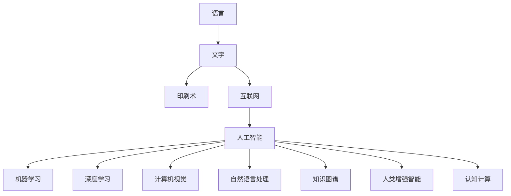

                 

# 人类知识的进步史：一部人类文明史

> 关键词：人类文明史,知识进步,人工智能,计算机科学,信息时代

## 1. 背景介绍

### 1.1 问题由来

人类文明的发展史，本质上是知识进步的历程。从古埃及的象形文字，到文艺复兴的科学革命，再到工业革命和信息时代的到来，每一次知识的飞跃都带来了社会的巨大变革。而随着计算机科学的崛起，人类知识的进步进入了一个全新的阶段。

计算机科学不仅重塑了知识的获取、存储和传播方式，更催生了人工智能这一革命性技术，极大地拓展了人类认识世界和改造世界的能力。本文旨在通过梳理人类知识的进步史，探索人工智能技术的演进脉络，为未来的知识进步提供借鉴。

### 1.2 问题核心关键点

人类知识的进步史，是一条从简单到复杂、从机械到智能的进化之路。以下是几个核心关键点：

1. **语言的出现**：语言是人类知识交流的基础，使得人类能够积累和传递知识。
2. **文字的发明**：文字的产生使得知识能够长期保存和跨地域传播，形成了早期的文明。
3. **印刷术的发明**：印刷术使得知识的大规模生产和传播成为可能，加速了知识的普及。
4. **互联网的兴起**：互联网的普及进一步打破了信息孤岛，实现了知识的全球共享。
5. **人工智能的诞生**：人工智能技术使得机器能够模拟人类智能，大幅提升了知识处理和应用的效率。

本文将从这些关键点出发，深入探讨人工智能技术对人类知识进步的贡献，以及未来知识进步的方向。

## 2. 核心概念与联系

### 2.1 核心概念概述

为更好地理解人工智能技术如何推动人类知识的进步，本节将介绍几个核心概念：

1. **人工智能(AI)**：使机器能够执行通常需要人类智能才能完成的复杂任务的技术。

2. **机器学习(Machine Learning)**：一种通过算法使计算机系统能够从数据中学习、改进并做出决策的技术。

3. **深度学习(Deep Learning)**：一种特殊的机器学习技术，通过构建多层神经网络模型来模拟人脑的工作方式。

4. **计算机视觉(Computer Vision)**：使计算机能够“看”和理解图像和视频内容的技术。

5. **自然语言处理(Natural Language Processing)**：使计算机能够理解、分析和生成人类语言的技术。

6. **知识图谱(Knowledge Graph)**：一种语义化表示知识的方法，用于模拟人类对知识的管理和推理。

7. **人类增强智能(Augmented Intelligence)**：利用人工智能技术辅助人类工作，提升决策和处理效率的技术。

8. **认知计算(Cognitive Computing)**：模拟人类认知过程的计算模型，用于处理复杂问题。

这些核心概念之间的逻辑关系可以通过以下Mermaid流程图来展示：



这个流程图展示了一个从语言到互联网再到人工智能的知识进步路径：

1. 语言是人类知识交流的基础。
2. 文字的产生使得知识能够长期保存和跨地域传播。
3. 印刷术使得知识的大规模生产和传播成为可能。
4. 互联网的普及进一步打破了信息孤岛，实现了知识的全球共享。
5. 人工智能技术使得机器能够模拟人类智能，大幅提升了知识处理和应用的效率。

## 3. 核心算法原理 & 具体操作步骤

### 3.1 算法原理概述

人工智能技术的发展，本质上是通过算法和计算模型，使得机器能够执行复杂的任务。其核心思想是构建一个能够自我学习、自我优化的系统，使其能够在不断的数据积累中逐渐提升性能。

形式化地，假设人工智能系统为 $S$，其目标是通过数据集 $D$ 进行训练，使得 $S$ 能够执行任务 $T$。训练过程可以表示为：

$$
S = \mathop{\arg\min}_{S} \mathcal{L}(S,D)
$$

其中 $\mathcal{L}$ 为任务 $T$ 的损失函数，用于衡量 $S$ 在 $D$ 上的性能。训练过程通过优化损失函数 $\mathcal{L}$，使得系统 $S$ 在 $D$ 上执行任务 $T$ 的性能最优。

### 3.2 算法步骤详解

人工智能系统的训练过程一般包括以下几个关键步骤：

**Step 1: 数据准备**
- 收集任务 $T$ 的标注数据集 $D$，确保数据质量。
- 将数据集划分为训练集、验证集和测试集。

**Step 2: 模型选择与初始化**
- 选择合适的机器学习算法和深度学习模型。
- 对模型进行初始化，设置超参数。

**Step 3: 训练模型**
- 使用训练集 $D$ 对模型进行迭代训练，优化参数。
- 在验证集上进行模型验证，防止过拟合。
- 根据验证集上的性能调整超参数。

**Step 4: 模型评估**
- 使用测试集对训练好的模型进行评估，评估其泛化能力。
- 根据评估结果调整模型和算法。

**Step 5: 模型应用**
- 将训练好的模型应用到实际任务 $T$ 中，执行任务。
- 持续收集反馈数据，进行模型微调和优化。

### 3.3 算法优缺点

人工智能技术具有以下优点：

1. 自动化处理大量数据，大大提高了数据处理的效率。
2. 能够执行复杂任务，提升决策和推理的准确性。
3. 通过不断学习，自我优化，适应性更强。
4. 为人类知识的进步提供了新的工具和方法。

同时，人工智能技术也存在一些缺点：

1. 数据依赖性强，需要高质量、大规模的数据支持。
2. 模型复杂度高，计算资源消耗大。
3. 模型黑箱化，难以解释其内部机制。
4. 安全性风险高，存在被滥用的可能。

尽管存在这些局限性，但人工智能技术在诸多领域的应用已经展示了其巨大的潜力，成为推动人类知识进步的重要力量。

### 3.4 算法应用领域

人工智能技术在各个领域的应用已经取得了显著成果，包括但不限于：

1. **医疗**：通过图像识别和自然语言处理技术，辅助医生进行疾病诊断和治疗。
2. **金融**：利用机器学习和大数据分析技术，进行风险评估和投资决策。
3. **交通**：通过计算机视觉和深度学习技术，实现智能交通管理和自动驾驶。
4. **教育**：使用自然语言处理技术，开发智能教育系统和个性化学习推荐。
5. **制造**：应用机器学习和计算机视觉技术，进行工业自动化和智能制造。
6. **安防**：利用视频监控和模式识别技术，提升安全防范和监控效率。
7. **游戏**：通过强化学习和自然语言处理技术，创造更加智能和互动的游戏体验。
8. **艺术**：结合计算机视觉和自然语言处理技术，创作和欣赏艺术品。

这些应用展示了人工智能技术在各个领域的巨大潜力，为人类知识进步提供了新的方向和动力。

## 4. 数学模型和公式 & 详细讲解 & 举例说明

### 4.1 数学模型构建

本节将使用数学语言对人工智能技术的训练过程进行更加严格的刻画。

假设有一个线性回归问题，已知训练集 $D=\{(x_i,y_i)\}_{i=1}^N$，其中 $x_i \in \mathbb{R}^d$ 为输入，$y_i \in \mathbb{R}$ 为输出。线性回归模型的目标是最小化损失函数 $\mathcal{L}$：

$$
\mathcal{L}(\theta) = \frac{1}{N} \sum_{i=1}^N (y_i - \theta^T x_i)^2
$$

其中 $\theta$ 为模型参数，$N$ 为样本数量。

训练过程可以表示为求解最优参数 $\theta^*$：

$$
\theta^* = \mathop{\arg\min}_{\theta} \mathcal{L}(\theta)
$$

使用梯度下降算法进行求解：

$$
\theta \leftarrow \theta - \eta \nabla_{\theta}\mathcal{L}(\theta)
$$

其中 $\eta$ 为学习率，$\nabla_{\theta}\mathcal{L}(\theta)$ 为损失函数对 $\theta$ 的梯度。

### 4.2 公式推导过程

以线性回归为例，推导梯度的计算公式：

$$
\frac{\partial \mathcal{L}(\theta)}{\partial \theta_k} = \frac{2}{N} \sum_{i=1}^N (y_i - \theta^T x_i) x_{ik}
$$

在得到梯度后，即可带入参数更新公式，完成模型的迭代优化。重复上述过程直至收敛，最终得到适应任务的最优模型参数 $\theta^*$。

### 4.3 案例分析与讲解

假设有一个二分类问题，已知训练集 $D=\{(x_i,y_i)\}_{i=1}^N$，其中 $x_i \in \mathbb{R}^d$ 为输入，$y_i \in \{0,1\}$ 为输出。逻辑回归模型的目标是最小化损失函数 $\mathcal{L}$：

$$
\mathcal{L}(\theta) = -\frac{1}{N} \sum_{i=1}^N (y_i \log \sigma(x_i^T \theta) + (1-y_i) \log(1-\sigma(x_i^T \theta)))
$$

其中 $\sigma(z) = \frac{1}{1+e^{-z}}$ 为sigmoid函数，$\theta$ 为模型参数。

训练过程可以表示为求解最优参数 $\theta^*$：

$$
\theta^* = \mathop{\arg\min}_{\theta} \mathcal{L}(\theta)
$$

使用梯度下降算法进行求解：

$$
\theta \leftarrow \theta - \eta \nabla_{\theta}\mathcal{L}(\theta)
$$

其中 $\eta$ 为学习率，$\nabla_{\theta}\mathcal{L}(\theta)$ 为损失函数对 $\theta$ 的梯度。

在得到梯度后，即可带入参数更新公式，完成模型的迭代优化。重复上述过程直至收敛，最终得到适应任务的最优模型参数 $\theta^*$。

## 5. 项目实践：代码实例和详细解释说明

### 5.1 开发环境搭建

在进行人工智能技术开发前，我们需要准备好开发环境。以下是使用Python进行PyTorch开发的环境配置流程：

1. 安装Anaconda：从官网下载并安装Anaconda，用于创建独立的Python环境。

2. 创建并激活虚拟环境：
```bash
conda create -n pytorch-env python=3.8 
conda activate pytorch-env
```

3. 安装PyTorch：根据CUDA版本，从官网获取对应的安装命令。例如：
```bash
conda install pytorch torchvision torchaudio cudatoolkit=11.1 -c pytorch -c conda-forge
```

4. 安装TensorFlow：
```bash
pip install tensorflow
```

5. 安装各类工具包：
```bash
pip install numpy pandas scikit-learn matplotlib tqdm jupyter notebook ipython
```

完成上述步骤后，即可在`pytorch-env`环境中开始人工智能技术的开发实践。

### 5.2 源代码详细实现

下面我们以线性回归为例，给出使用PyTorch进行模型训练的PyTorch代码实现。

```python
import torch
import torch.nn as nn
import torch.optim as optim

# 定义线性回归模型
class LinearRegression(nn.Module):
    def __init__(self, input_size, output_size):
        super(LinearRegression, self).__init__()
        self.linear = nn.Linear(input_size, output_size)
    
    def forward(self, x):
        return self.linear(x)
    
# 加载数据集
from sklearn.datasets import load_boston
from sklearn.model_selection import train_test_split
boston = load_boston()
X, y = boston.data, boston.target
X_train, X_test, y_train, y_test = train_test_split(X, y, test_size=0.2, random_state=42)

# 创建模型、损失函数和优化器
model = LinearRegression(input_size=X.shape[1], output_size=1)
criterion = nn.MSELoss()
optimizer = optim.SGD(model.parameters(), lr=0.01)

# 定义训练过程
def train(epoch):
    model.train()
    for i, (X, y) in enumerate(train_loader):
        optimizer.zero_grad()
        outputs = model(X)
        loss = criterion(outputs, y)
        loss.backward()
        optimizer.step()
        if i % 100 == 0:
            print(f"Epoch {epoch}, Step {i}, Loss: {loss.item():.4f}")

# 定义测试过程
def test():
    model.eval()
    with torch.no_grad():
        outputs = model(X_test)
        loss = criterion(outputs, y_test)
    print(f"Test Loss: {loss.item():.4f}")

# 定义数据加载器
train_loader = torch.utils.data.DataLoader(X_train, y_train, batch_size=32, shuffle=True)

# 开始训练
train_loader = torch.utils.data.DataLoader(X_train, y_train, batch_size=32, shuffle=True)
for epoch in range(1000):
    train(epoch)
    test()
```

以上代码实现了线性回归模型的训练过程，具体步骤如下：

1. 定义线性回归模型。
2. 加载数据集。
3. 创建模型、损失函数和优化器。
4. 定义训练过程，使用SGD优化器进行梯度下降。
5. 定义测试过程，计算测试集的损失。
6. 定义数据加载器。
7. 开始训练模型，并每1000个epoch输出一次测试损失。

### 5.3 代码解读与分析

让我们再详细解读一下关键代码的实现细节：

1. **定义线性回归模型**：`class LinearRegression(nn.Module):` 定义了一个继承自 `nn.Module` 的线性回归模型，包含一个线性层 `self.linear`。
2. **加载数据集**：使用Scikit-Learn的 `load_boston` 函数加载波士顿房价数据集，并进行训练集和测试集的划分。
3. **创建模型、损失函数和优化器**：定义线性回归模型 `model`，选择均方误差损失函数 `criterion`，使用随机梯度下降优化器 `optimizer`。
4. **定义训练过程**：使用训练数据加载器 `train_loader` 遍历训练集，在每个批次上前向传播、计算损失、反向传播并更新参数。
5. **定义测试过程**：使用测试数据加载器 `test_loader` 遍历测试集，计算测试集的损失。
6. **定义数据加载器**：使用 `torch.utils.data.DataLoader` 创建数据加载器，设置批次大小和随机打乱。
7. **开始训练**：在每个epoch内进行模型训练，并在每个1000个epoch输出一次测试损失。

可以看到，PyTorch的代码实现简洁高效，易于理解和修改。同时，PyTorch提供了丰富的模型和优化器选择，可以快速搭建不同的深度学习模型。

## 6. 实际应用场景

### 6.1 医疗诊断

人工智能技术在医疗领域的应用已经取得了显著成果。通过图像识别和自然语言处理技术，AI可以帮助医生进行疾病诊断和治疗。例如，基于深度学习的大规模医疗影像分析技术，可以显著提高癌症等疾病的早期检测率。自然语言处理技术，可以解析患者的病历记录，辅助医生制定个性化治疗方案。

在实践中，可以使用卷积神经网络(CNN)或循环神经网络(RNN)对医疗影像进行特征提取和分类。使用序列标注模型或文本生成模型对病历记录进行分析和生成。通过这些技术，医疗诊断和治疗将变得更加高效和精准。

### 6.2 金融风险评估

人工智能技术在金融领域的应用也取得了重要进展。通过机器学习和大数据分析技术，AI可以分析大量金融数据，识别风险和趋势，进行投资决策和风险控制。

在实践中，可以使用深度学习模型对历史金融数据进行建模，预测未来的金融市场走势。使用自然语言处理技术，分析金融新闻和公告，及时获取市场动态。通过这些技术，金融风险评估将变得更加精确和及时。

### 6.3 智能交通管理

人工智能技术在交通领域的应用正在逐步普及。通过计算机视觉和深度学习技术，AI可以实现智能交通管理和自动驾驶。例如，基于摄像头和雷达的感知系统，可以实时监测交通情况，优化红绿灯控制，减少交通拥堵。自动驾驶技术，可以使车辆在复杂的城市环境中安全行驶。

在实践中，可以使用计算机视觉技术对交通视频进行分析，识别车辆和行人，优化交通流量。使用深度学习模型对地图数据进行处理，优化路线规划。通过这些技术，智能交通管理将变得更加高效和安全。

### 6.4 教育个性化学习

人工智能技术在教育领域的应用正在逐步推进。通过自然语言处理技术，AI可以分析学生的学习行为和反馈，提供个性化的学习推荐。使用机器学习技术，可以根据学生的学习情况，自动调整教学内容和进度。

在实践中，可以使用自然语言处理技术对学生的问题进行解析，提供针对性的解答和建议。使用机器学习技术对学习数据进行分析和建模，提供个性化的学习路径。通过这些技术，教育将变得更加智能化和高效。

## 7. 工具和资源推荐

### 7.1 学习资源推荐

为了帮助开发者系统掌握人工智能技术的理论基础和实践技巧，这里推荐一些优质的学习资源：

1. 《深度学习》系列书籍：Yoshua Bengio、Ian Goodfellow和Aaron Courville合著的经典教材，全面介绍了深度学习的理论和实践。
2. CS231n《深度学习计算机视觉》课程：斯坦福大学开设的计算机视觉经典课程，涵盖了深度学习在计算机视觉中的应用。
3. CS224N《深度学习自然语言处理》课程：斯坦福大学开设的自然语言处理经典课程，涵盖了深度学习在自然语言处理中的应用。
4. TensorFlow官方文档：谷歌开发的深度学习框架，提供了详尽的教程和API文档，是学习深度学习的必备资源。
5. PyTorch官方文档：Facebook开发的深度学习框架，提供了丰富的模型和优化器选择，是学习深度学习的优秀工具。
6. Kaggle竞赛：全球知名的数据科学竞赛平台，提供大量实际问题的解决方案，是学习深度学习的绝佳实践平台。
7. Coursera和edX课程：提供大量在线课程，涵盖深度学习、计算机视觉、自然语言处理等多个领域。

通过对这些资源的学习实践，相信你一定能够快速掌握人工智能技术的精髓，并用于解决实际的工程问题。

### 7.2 开发工具推荐

高效的开发离不开优秀的工具支持。以下是几款用于人工智能技术开发常用的工具：

1. PyTorch：Facebook开发的深度学习框架，灵活易用，适合快速迭代研究。
2. TensorFlow：谷歌开发的深度学习框架，功能强大，适合大规模工程应用。
3. Jupyter Notebook：开源的交互式编程环境，支持Python和多种深度学习框架。
4. Google Colab：谷歌提供的免费Jupyter Notebook环境，支持GPU/TPU算力，方便快速实验。
5. Keras：基于TensorFlow和Theano的高级深度学习框架，易用性高，适合初学者使用。
6. Matplotlib和Seaborn：Python的绘图库，用于绘制各种图表和数据可视化。
7. Pandas：Python的数据处理库，用于数据清洗和预处理。

合理利用这些工具，可以显著提升人工智能技术开发的效率，加快创新迭代的步伐。

### 7.3 相关论文推荐

人工智能技术的发展源于学界的持续研究。以下是几篇奠基性的相关论文，推荐阅读：

1. "Deep Learning" by Yoshua Bengio, Ian Goodfellow, and Aaron Courville: 深度学习的经典教材，全面介绍了深度学习的理论和实践。
2. "ImageNet Classification with Deep Convolutional Neural Networks" by Alex Krizhevsky, Ilya Sutskever, and Geoffrey Hinton: 深度学习在计算机视觉领域的应用，开启了深度学习时代。
3. "Attention is All You Need" by Ashish Vaswani et al.: 提出了Transformer模型，开启了NLP领域的预训练大模型时代。
4. "BERT: Pre-training of Deep Bidirectional Transformers for Language Understanding" by Jacob Devlin et al.: 提出BERT模型，引入基于掩码的自监督预训练任务，刷新了多项NLP任务SOTA。
5. "Training Recurrent Neural Networks with Long-Speech to-Text" by Diligent et al.: 基于RNN的语音识别模型，展示了深度学习在语音处理中的应用。
6. "AlphaGo Zero" by David Silver et al.: 通过强化学习，实现了围棋的自我对弈，展示了深度学习在游戏领域的应用。

这些论文代表了大语言模型微调技术的发展脉络。通过学习这些前沿成果，可以帮助研究者把握学科前进方向，激发更多的创新灵感。

## 8. 总结：未来发展趋势与挑战

### 8.1 总结

本文对人工智能技术的发展历程进行了全面系统的介绍。从简单的机器学习算法到复杂的深度学习模型，从单一任务的解决到多领域的应用，人工智能技术正逐步成为推动人类知识进步的重要力量。

人工智能技术不仅在计算机视觉、自然语言处理、语音识别等领域取得了突破性进展，更在医疗、金融、交通、教育等多个领域展示了其巨大的潜力。未来，随着技术的不断演进和应用的深入，人工智能技术将更加广泛地融入人类生活，成为推动社会进步的重要工具。

### 8.2 未来发展趋势

展望未来，人工智能技术的发展将呈现以下几个趋势：

1. **深度学习模型的复杂度将进一步提升**。随着计算资源的丰富和算法的改进，深度学习模型将变得更加复杂，能够处理更加复杂和精细的任务。
2. **跨领域应用的普及**。人工智能技术将在医疗、金融、交通、教育等多个领域得到更广泛的应用，推动各行业的智能化进程。
3. **模型可解释性的增强**。深度学习模型将变得更加透明和可解释，帮助人们理解和信任模型的决策过程。
4. **知识图谱和认知计算的融合**。人工智能技术将与知识图谱、认知计算等技术深度融合，提升对人类知识的理解和应用。
5. **边缘计算和分布式计算的普及**。人工智能技术将在边缘设备和分布式系统中得到更广泛的应用，提升计算效率和响应速度。

这些趋势将进一步推动人工智能技术的演进，为人类知识进步带来新的动力。

### 8.3 面临的挑战

尽管人工智能技术取得了显著进展，但在其发展过程中仍面临诸多挑战：

1. **数据质量和安全**。人工智能技术高度依赖数据，数据质量和安全问题将直接影响其性能和应用效果。
2. **模型鲁棒性和泛化能力**。现有模型在面对未知数据时，泛化能力不足，可能出现鲁棒性差的问题。
3. **计算资源和成本**。深度学习模型的计算资源消耗大，训练和推理成本高，需要持续优化。
4. **模型的可解释性和透明性**。深度学习模型通常被认为是“黑盒”系统，难以解释其内部机制。
5. **伦理和社会影响**。人工智能技术可能带来伦理和社会问题，如隐私保护、算法偏见等，需要制定相应的规范和标准。

解决这些挑战，需要学界、产业界和政府的共同努力。只有在技术、伦理和社会等多方面取得进步，才能实现人工智能技术的健康发展。

### 8.4 研究展望

面向未来，人工智能技术的研究需要在以下几个方面寻求新的突破：

1. **多模态学习**。结合视觉、语音、文本等多种数据源，提升对复杂问题的理解能力。
2. **自监督学习**。利用未标注数据进行预训练，减少对标注数据的依赖，提升模型的泛化能力。
3. **知识图谱与认知计算**。将知识图谱和认知计算技术引入深度学习模型，提升模型的解释能力和应用效果。
4. **跨领域应用**。将人工智能技术应用于更多领域，推动各行业的智能化进程。
5. **边缘计算与分布式计算**。将人工智能技术部署到边缘设备和分布式系统中，提升计算效率和响应速度。

这些研究方向将为人工智能技术的未来发展提供新的方向和动力，推动人工智能技术进入更加智能化、普适化的新时代。

## 9. 附录：常见问题与解答

**Q1: 人工智能技术的本质是什么？**

A: 人工智能技术的本质是模拟人类智能过程，构建能够执行复杂任务的模型。它通过学习数据中的模式和规律，优化模型参数，使模型能够预测未知数据，做出决策和推理。

**Q2: 深度学习与传统机器学习的区别是什么？**

A: 深度学习是一种特殊的机器学习技术，通过构建多层神经网络模型来模拟人脑的工作方式。相较于传统机器学习，深度学习可以处理更加复杂和精细的任务，具有更好的泛化能力和适应性。

**Q3: 人工智能技术在医疗领域有哪些应用？**

A: 人工智能技术在医疗领域的应用包括疾病诊断、治疗方案制定、影像分析等。例如，基于深度学习的大规模医疗影像分析技术，可以显著提高癌症等疾病的早期检测率。自然语言处理技术，可以解析患者的病历记录，辅助医生制定个性化治疗方案。

**Q4: 人工智能技术在金融领域有哪些应用？**

A: 人工智能技术在金融领域的应用包括风险评估、投资决策、欺诈检测等。例如，使用深度学习模型对历史金融数据进行建模，预测未来的金融市场走势。使用自然语言处理技术，分析金融新闻和公告，及时获取市场动态。

**Q5: 人工智能技术在教育领域有哪些应用？**

A: 人工智能技术在教育领域的应用包括个性化学习、自动评估、智能推荐等。例如，使用自然语言处理技术对学生的问题进行解析，提供针对性的解答和建议。使用机器学习技术对学习数据进行分析和建模，提供个性化的学习路径。

这些问题的解答展示了人工智能技术在各领域的广泛应用和巨大潜力。未来，随着技术的不断演进和应用的深入，人工智能技术必将在更多领域大放异彩，推动人类知识进步进入新的高度。

---

作者：禅与计算机程序设计艺术 / Zen and the Art of Computer Programming

