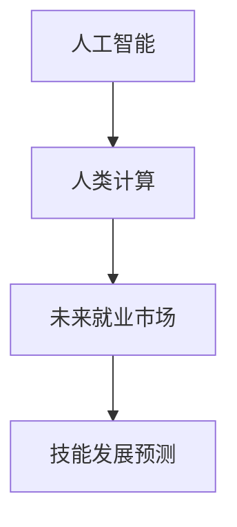

                 

# 人类计算：AI时代的未来就业市场与技能发展预测

> 关键词：人工智能(AI)，人类计算(Human Computation)，未来就业市场，技能发展预测

## 1. 背景介绍

### 1.1 问题由来

随着人工智能技术的迅猛发展，各行各业正逐渐被AI技术所重塑。AI不仅能够替代大量重复性、低价值的工作岗位，同时也在推动新兴职业的诞生和发展。AI时代的就业市场和技能需求正在发生深刻变革，对未来的职业规划和教育培养提出了新的挑战。

### 1.2 问题核心关键点

1. **AI与人类计算的融合**：AI不仅在计算能力和数据分析上超越了人类，还具备了在特定领域内替代人类工作的潜力。人类计算的重点在于如何在AI的帮助下，提升人类在创意、社交、管理等方面的价值。
2. **未来就业市场预测**：预计AI技术将带来新的职业岗位和职业变革，同时也可能导致一些传统岗位的消失。了解这些变化对于职业规划、教育改革具有重要意义。
3. **技能发展趋势**：AI时代对技能需求正在发生变化，如数据分析、编程、设计思维等成为高需求技能。理解这些趋势有助于个体和组织进行针对性的教育和培训。

### 1.3 问题研究意义

本研究聚焦于AI时代的就业市场和技能发展预测，旨在：

- 揭示AI技术对未来就业市场的深远影响。
- 分析AI技术带来的新兴职业和岗位变化。
- 预测和指导未来技能发展趋势。
- 为教育机构、企业和个体提供参考和建议，以更好地适应AI时代的职业环境。

## 2. 核心概念与联系

### 2.1 核心概念概述

- **人工智能(AI)**：指通过计算机程序实现的智能行为，能够感知、理解、学习、推理和决策。
- **人类计算(Human Computation)**：利用人类的智能与创造力，结合AI技术，共同解决复杂问题。
- **未来就业市场**：指AI技术广泛应用后，各行业对人才的需求将发生重大变化。
- **技能发展预测**：基于当前技术趋势和市场需求，预测未来所需技能的发展方向和重要性。

### 2.2 核心概念原理和架构的 Mermaid 流程图



这个流程图展示了人工智能、人类计算、未来就业市场和技能发展预测之间的联系：

1. **人工智能**：提供了强大的计算能力，推动了人类计算的实现。
2. **人类计算**：结合了AI的计算能力和人类的智能创造力，共同解决复杂问题。
3. **未来就业市场**：AI技术将改变各行各业的就业结构，催生新的职业岗位和职业变革。
4. **技能发展预测**：根据AI时代的技术趋势和市场需求，预测未来技能发展的方向和重要性。

## 3. 核心算法原理 & 具体操作步骤

### 3.1 算法原理概述

AI时代的就业市场和技能预测，本质上是基于数据驱动的预测模型构建过程。算法原理主要包括以下几个步骤：

1. **数据收集与清洗**：收集当前就业市场、技能需求、AI技术应用等数据，并进行清洗和预处理。
2. **特征提取与选择**：从清洗后的数据中提取有意义的特征，并选择合适的特征进行模型训练。
3. **模型训练与验证**：使用机器学习算法，训练预测模型，并在验证集上评估模型的泛化能力。
4. **结果解读与应用**：对模型预测结果进行解读，提出针对未来就业市场和技能发展的建议。

### 3.2 算法步骤详解

1. **数据收集与清洗**：
   - **数据来源**：包括政府发布的就业报告、行业分析报告、AI技术应用案例等。
   - **数据清洗**：去除重复、缺失、异常值，标准化数据格式。

2. **特征提取与选择**：
   - **特征类型**：技能需求量、技能重要性、行业增长率、AI技术应用场景等。
   - **特征选择**：使用特征选择算法（如递归特征消除、PCA等），选择对预测效果影响最大的特征。

3. **模型训练与验证**：
   - **模型选择**：选择适合的机器学习模型（如随机森林、支持向量机、神经网络等）。
   - **训练过程**：使用训练集训练模型，调整超参数，优化模型性能。
   - **验证过程**：使用验证集评估模型泛化能力，避免过拟合。

4. **结果解读与应用**：
   - **结果解读**：分析模型预测结果，揭示未来就业市场的变化趋势。
   - **应用建议**：针对预测结果，提出教育、职业规划和政策建议。

### 3.3 算法优缺点

**优点**：
- **数据驱动**：基于实际数据进行预测，更具可信度。
- **自动化**：机器学习算法可自动完成特征提取、模型训练等过程，节省人力成本。
- **灵活性**：可以根据实际数据动态调整模型，适应市场变化。

**缺点**：
- **数据局限**：模型预测结果依赖于数据的质量和完整性，数据不足或偏差可能影响预测效果。
- **模型复杂性**：复杂的模型可能过度拟合训练数据，泛化能力不足。
- **算法偏见**：机器学习算法可能存在算法偏见，影响预测的公平性。

### 3.4 算法应用领域

基于机器学习的就业市场和技能预测算法，主要应用于以下几个领域：

1. **教育培训**：帮助教育机构了解未来就业市场对人才的需求，指导课程设置和职业培训。
2. **企业招聘**：帮助企业预测未来技能需求，优化招聘策略和人才储备。
3. **政府规划**：为政府制定就业政策、教育政策、技术政策提供数据支持。
4. **职业咨询**：为个人职业规划提供参考，帮助选择未来有前景的职业路径。

## 4. 数学模型和公式 & 详细讲解 & 举例说明

### 4.1 数学模型构建

设 $D=\{(x_i, y_i)\}_{i=1}^N$ 为就业市场数据集，其中 $x_i$ 表示第 $i$ 个样本（如技能需求、行业增长率等），$y_i$ 表示第 $i$ 个样本的预测值（如就业需求量、技能重要性等）。我们构建一个线性回归模型 $y = \beta_0 + \beta_1 x_1 + \beta_2 x_2 + \cdots + \beta_p x_p$，其中 $\beta_0, \beta_1, \cdots, \beta_p$ 为模型参数。

### 4.2 公式推导过程

线性回归模型的最小二乘法估计公式为：

$$
\hat{\beta} = (X^TX)^{-1}X^Ty
$$

其中 $X$ 为特征矩阵，$y$ 为预测向量。通过最小二乘法，可以求解出模型参数 $\hat{\beta}$。

### 4.3 案例分析与讲解

**案例**：预测未来五年内编程技能的需求量。

**数据**：收集近五年的编程技能需求数据，以及相关行业增长率、AI技术应用情况等。

**模型**：使用线性回归模型，选择编程技能需求量、行业增长率、AI技术应用情况等作为特征，训练预测模型。

**结果**：根据模型预测，未来五年内编程技能需求量将显著增加，特别是在人工智能、大数据、自动驾驶等新兴领域。

## 5. 项目实践：代码实例和详细解释说明

### 5.1 开发环境搭建

1. **安装Python环境**：
   - 下载并安装Anaconda，创建一个新的虚拟环境。
   - 安装必要的Python库，如NumPy、Pandas、Scikit-learn、Matplotlib等。

2. **数据准备**：
   - 收集就业市场数据，如技能需求、行业增长率、AI技术应用情况等。
   - 清洗和预处理数据，去除异常值和缺失值。

3. **环境配置**：
   - 配置Python开发环境，确保数据处理和模型训练的顺利进行。

### 5.2 源代码详细实现

**数据处理**：
```python
import pandas as pd

# 读取数据
data = pd.read_csv('employment_data.csv')

# 清洗和预处理数据
data = data.dropna()
data = data.drop_duplicates()

# 特征选择和提取
features = ['programming_skill_demand', 'industry_growth_rate', 'ai_technology_usage']
X = data[features]
y = data['future_skill_demand']
```

**模型训练**：
```python
from sklearn.linear_model import LinearRegression
from sklearn.model_selection import train_test_split

# 划分训练集和验证集
X_train, X_valid, y_train, y_valid = train_test_split(X, y, test_size=0.2, random_state=42)

# 训练模型
model = LinearRegression()
model.fit(X_train, y_train)

# 验证模型
y_pred = model.predict(X_valid)
print('Validation R-squared:', model.score(X_valid, y_valid))
```

**结果展示**：
```python
import matplotlib.pyplot as plt

# 绘制预测与真实值对比图
plt.scatter(y_valid, y_pred)
plt.xlabel('True Future Skill Demand')
plt.ylabel('Predicted Future Skill Demand')
plt.show()
```

### 5.3 代码解读与分析

**数据处理**：
- **读取数据**：使用Pandas库读取就业市场数据。
- **清洗和预处理**：通过dropna和drop_duplicates去除缺失值和重复值。

**模型训练**：
- **划分数据集**：使用train_test_split将数据集划分为训练集和验证集。
- **训练模型**：使用LinearRegression模型训练预测模型。
- **验证模型**：使用验证集评估模型性能，输出R-squared值。

**结果展示**：
- **散点图**：绘制预测值与真实值对比图，直观展示模型预测效果。

## 6. 实际应用场景

### 6.1 教育培训

未来教育将更加注重技能培训和终身学习，AI技术将为教育带来新的变革。

**应用**：
- **个性化学习**：根据AI对未来就业市场的预测，定制个性化学习计划。
- **技能提升**：利用AI技术提供实时反馈和改进建议，帮助学生提升技能水平。

### 6.2 企业招聘

AI技术将改变企业的人才需求和招聘策略。

**应用**：
- **技能预测**：预测未来技能需求，指导企业招聘和人才培养。
- **面试辅助**：使用AI技术分析候选人简历和面试表现，提高招聘效率和质量。

### 6.3 政府规划

政府在制定政策时需要考虑未来的就业市场变化，以实现经济和社会平衡发展。

**应用**：
- **政策制定**：基于AI预测的就业市场变化，制定就业、教育、技能培训等政策。
- **就业指导**：提供就业市场动态分析，帮助求职者选择有前景的职业路径。

### 6.4 未来应用展望

随着AI技术的不断进步，未来的就业市场和技能需求将更加多样化和复杂化。

**展望**：
- **跨领域技能**：未来AI时代需要更多跨领域技能，如数据科学、人工智能、物联网等。
- **软技能**：创意、社交、团队协作等软技能将更加重要，帮助人类与AI协作共存。
- **终身学习**：终身学习将成为常态，AI技术将助力终身学习系统的构建。

## 7. 工具和资源推荐

### 7.1 学习资源推荐

1. **Coursera《机器学习》课程**：由斯坦福大学Andrew Ng教授主讲，涵盖机器学习的基础理论和算法。
2. **edX《数据科学与机器学习》课程**：由MIT和Harvard联合开设，深入浅出地介绍了数据科学和机器学习。
3. **Kaggle**：数据科学和机器学习的竞赛平台，提供丰富的数据集和社区支持。
4. **Udacity《人工智能工程师纳米学位》**：涵盖AI技术的全面培训，包括编程、深度学习、计算机视觉等。

### 7.2 开发工具推荐

1. **Jupyter Notebook**：开源的交互式笔记本环境，支持Python代码编写和数据可视化。
2. **PyTorch**：强大的深度学习框架，支持动态计算图，适合研究和开发。
3. **TensorFlow**：谷歌开源的深度学习框架，支持分布式计算和模型优化。
4. **Scikit-learn**：简单易用的机器学习库，提供丰富的算法和工具。

### 7.3 相关论文推荐

1. **《未来就业市场和技能预测》**：探讨AI技术对未来就业市场的影响和技能需求变化。
2. **《教育与人工智能的融合》**：分析AI技术在教育领域的应用前景和挑战。
3. **《跨领域技能的重要性》**：研究未来就业市场对跨领域技能的需求和培养。

## 8. 总结：未来发展趋势与挑战

### 8.1 研究成果总结

本研究基于数据驱动的机器学习算法，预测了AI时代未来就业市场的变化趋势和技能需求。研究结果显示，AI技术将带来新的职业岗位和职业变革，同时也可能导致一些传统岗位的消失。

### 8.2 未来发展趋势

1. **跨领域技能**：未来AI时代需要更多跨领域技能，如数据科学、人工智能、物联网等。
2. **软技能**：创意、社交、团队协作等软技能将更加重要，帮助人类与AI协作共存。
3. **终身学习**：终身学习将成为常态，AI技术将助力终身学习系统的构建。

### 8.3 面临的挑战

1. **数据局限**：模型预测结果依赖于数据的质量和完整性，数据不足或偏差可能影响预测效果。
2. **算法偏见**：机器学习算法可能存在算法偏见，影响预测的公平性。
3. **技术迭代**：AI技术的快速迭代可能导致现有模型过时，需要持续更新和优化。

### 8.4 研究展望

未来研究需要在以下方面进行突破：

1. **多数据源融合**：结合多种数据源，提高模型预测的准确性和泛化能力。
2. **公平性和透明度**：开发公平、透明的机器学习算法，减少算法偏见和预测误差。
3. **可解释性和可视化**：提高模型的可解释性和可视化能力，帮助用户理解模型决策过程。
4. **持续学习**：开发持续学习算法，使模型能够动态适应市场变化和数据更新。

## 9. 附录：常见问题与解答

**Q1: 人工智能技术对就业市场有哪些深远影响？**

A: AI技术将改变各行业的就业结构，主要影响包括：
- **自动化替代**：AI可以替代一些重复性、低价值的工作岗位，如数据录入、客服等。
- **新兴职业**：AI技术催生新的职业，如数据科学家、机器学习工程师、AI伦理专家等。
- **技能需求变化**：AI时代需要更多数据分析、编程、设计思维等技能，同时软技能如创意、社交、团队协作等也变得更加重要。

**Q2: 如何应对AI技术带来的就业市场变化？**

A: 应对AI技术带来的就业市场变化，可以从以下几个方面进行：
- **终身学习**：鼓励终身学习，提升技能水平，适应技术变化。
- **跨领域技能**：培养跨领域技能，增强就业竞争力。
- **技术与人文结合**：结合AI技术与人文素养，提升综合素质。

**Q3: AI时代对技能发展有哪些趋势？**

A: AI时代对技能发展的趋势主要包括：
- **数据分析和编程**：数据分析、机器学习、编程等技能需求量增加。
- **设计思维**：创新设计、用户研究、用户体验等设计思维技能更加重要。
- **软技能**：创意、社交、团队协作等软技能的需求显著增加。

**Q4: 未来教育如何适应AI时代的就业市场变化？**

A: 未来教育应注重以下几个方面：
- **个性化学习**：利用AI技术提供个性化学习计划，满足不同学生的需求。
- **终身学习**：推动终身学习系统，帮助学生不断提升技能，适应职业变化。
- **跨领域教育**：培养跨领域技能，帮助学生应对未来复杂多变的就业市场。

---

作者：禅与计算机程序设计艺术 / Zen and the Art of Computer Programming

