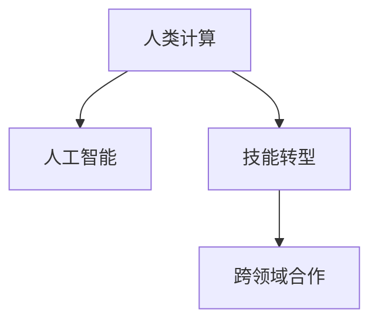

                 

# 人类计算：AI时代的未来工作技能

> 关键词：人类计算,人工智能,技能提升,未来工作,技能转型

## 1. 背景介绍

### 1.1 问题由来

在过去几十年里，人工智能(AI)技术飞速发展，尤其在计算能力和算法的不断突破下，AI已经渗透到各个领域，从医疗、金融到制造、教育等。随着AI技术进一步深入到企业的日常运营中，人们不得不重新思考他们在未来工作中的角色和技能需求。

AI的兴起不仅改变了企业的运营模式，也对人类工作技能提出了新的挑战。许多传统的工作岗位正被自动化和智能算法取代，而新的AI辅助岗位又对人类的计算能力、数据分析能力、创新思维能力等提出了新的要求。

### 1.2 问题核心关键点

AI时代的未来工作技能转型，核心在于人类计算能力与AI计算能力的互补与协作。未来工作技能主要涵盖以下几个方面：

1. **计算思维**：理解和运用算法的逻辑，能够进行高效的数学计算和逻辑推导。
2. **数据处理能力**：能够收集、清洗、分析和解释大量数据，提取有价值的信息。
3. **问题解决能力**：通过数据驱动的方法，发现问题、分析问题并提出解决方案。
4. **创新思维能力**：持续学习新知识，掌握新工具，灵活应用新技术。
5. **跨领域沟通能力**：与AI和其他领域的专业人士合作，协同解决问题。

### 1.3 问题研究意义

研究AI时代的未来工作技能，对于保持企业竞争力、提升员工满意度和促进社会经济发展具有重要意义：

1. **企业竞争力的提升**：通过提升员工计算能力和数据处理能力，企业能够更高效地进行决策和运营。
2. **员工满意度的提高**：拥有新技能的员工在职业发展上将拥有更多机会，对工作满意度有明显提升。
3. **社会经济的推动**：大量的高技能劳动力将促进技术创新，推动产业升级和社会进步。

## 2. 核心概念与联系

### 2.1 核心概念概述

理解AI时代的未来工作技能，首先需要明确一些核心概念：

- **人类计算(Human Computation)**：指通过人类智慧和计算思维解决复杂问题的过程。人类计算包括但不限于数学计算、逻辑推理、数据分析等。
- **人工智能(AI)**：一种通过算法和计算处理数据，以模拟人类智能的技术，包括机器学习、深度学习、自然语言处理等。
- **技能转型**：在AI技术快速发展的背景下，个人和组织需要不断学习和适应新的技能要求。
- **跨领域合作**：在AI时代，跨学科、跨领域的合作变得尤为重要。

这些概念之间的联系可以通过以下Mermaid流程图来展示：



这个流程图展示了人类计算与人工智能的互补关系，以及在技能转型和跨领域合作的背景下，两者相互促进的态势。

## 3. 核心算法原理 & 具体操作步骤
### 3.1 算法原理概述

基于AI时代的工作技能转型，需要理解人类计算与AI计算的结合点。人类计算与AI计算相结合的核心在于：

1. **人类计算的直觉与经验**：人类通过直觉和经验处理复杂问题，能够发现数据背后的模式和规律。
2. **AI计算的高效与自动化**：AI算法可以高效处理大量数据，自动化完成许多重复性和计算密集型任务。

结合这两者的优势，AI时代的未来工作技能更加侧重于：

- **数据洞察**：人类计算与AI计算相结合，通过分析大量数据，提取洞察并提出优化方案。
- **问题解决**：人类计算的直觉和经验，结合AI的计算能力，高效解决问题。
- **创新与创造**：AI的算法和工具提供新的视角和方法，人类计算则提供创新思维和创造力。

### 3.2 算法步骤详解

AI时代的未来工作技能转型，涉及以下步骤：

**Step 1: 理解人类计算与AI计算的互补性**

- **数据收集与处理**：利用AI工具处理大量数据，提取关键信息。
- **问题定义与分析**：通过人类计算思维，定义问题并分析数据中的模式和趋势。
- **解决方案提出**：结合人类直觉和AI计算，提出创新的解决方案。

**Step 2: 学习与应用AI工具**

- **技能培训**：通过在线课程、工作坊等方式学习AI相关的工具和技术。
- **工具应用**：应用如TensorFlow、PyTorch、Jupyter Notebook等AI工具，处理和分析数据。

**Step 3: 跨领域合作**

- **跨学科团队**：组建跨学科团队，促进不同领域的专业知识和技能交流。
- **合作工具**：利用协作工具如GitHub、Slack等，提高团队协作效率。

### 3.3 算法优缺点

基于AI时代的工作技能转型，具有以下优点：

1. **提升工作效率**：通过AI工具自动化处理大量数据，提升工作效率。
2. **增强决策质量**：结合人类计算的直觉和经验，提升决策的准确性和创新性。
3. **促进跨领域合作**：AI技术的融入促进了跨学科合作，推动了知识创新。

同时，也存在一些局限性：

1. **技能学习门槛高**：AI技术的学习需要一定的数学和编程基础，对初学者有一定挑战。
2. **数据隐私与安全问题**：在数据驱动的工作中，数据隐私和安全问题需要特别注意。
3. **技术更新速度快**：AI技术更新迭代快，需要持续学习新技术以保持竞争力。
4. **工作环境变化**：AI技术的融入可能改变某些传统岗位的工作内容，需要适应新的工作环境。

### 3.4 算法应用领域

AI时代的未来工作技能转型，在多个领域均有广泛应用：

- **金融**：通过AI工具处理金融数据，提取洞察并优化投资策略。
- **医疗**：利用AI算法分析医疗数据，提高疾病诊断和治疗方案的精准度。
- **制造**：应用AI技术进行生产线优化和质量控制，提升生产效率。
- **教育**：通过AI工具辅助教学，个性化推荐学习内容，提升教学质量。
- **市场营销**：利用AI分析市场数据，制定精准的市场营销策略。

## 4. 数学模型和公式 & 详细讲解 & 举例说明

### 4.1 数学模型构建

AI时代的工作技能转型，需要处理大量数据和进行复杂的数学计算。这里，我们将通过一个简单的例子来介绍如何构建数学模型。

假设有一家零售商需要预测下个月的销售额，数据如下：

| 月份 | 销售量 |
| ---- | ---- |
| 1    | 100  |
| 2    | 120  |
| 3    | 110  |
| 4    | 130  |
| 5    | 140  |

定义模型 $M_{\theta}$，其中 $\theta$ 为模型的参数。模型通过线性回归预测销售量 $y$：

$$
y = \theta_0 + \theta_1 x_1 + \theta_2 x_2
$$

其中 $x_1$ 为月份，$x_2$ 为销售额的滞后值。

### 4.2 公式推导过程

对于给定的数据集 $D=\{(x_i,y_i)\}_{i=1}^N$，目标是最小化经验风险：

$$
\mathcal{L}(\theta) = \frac{1}{N} \sum_{i=1}^N (y_i - M_{\theta}(x_i))^2
$$

通过最小化损失函数，得到模型的最优参数 $\theta^*$：

$$
\theta^* = \mathop{\arg\min}_{\theta} \mathcal{L}(\theta)
$$

使用梯度下降等优化算法，求解上述最优化问题，即可得到模型参数。

### 4.3 案例分析与讲解

假设上述数据集为训练集，接下来进行验证和测试：

1. **数据预处理**：将数据进行归一化处理，并添加训练集和验证集。

2. **模型训练**：使用随机梯度下降等优化算法，最小化损失函数，更新模型参数。

3. **模型评估**：在验证集上评估模型性能，调整超参数。

4. **模型测试**：在测试集上评估模型性能，输出预测结果。

## 5. 项目实践：代码实例和详细解释说明

### 5.1 开发环境搭建

在进行AI时代工作技能转型实践前，需要先搭建好开发环境。

**Step 1: 安装Python和相关库**

```bash
pip install numpy pandas scikit-learn matplotlib
```

**Step 2: 准备数据集**

定义数据集 `sales_data.csv`：

```
1,-100
2,-120
3,110
4,130
5,140
```

**Step 3: 数据预处理**

```python
import pandas as pd
from sklearn.model_selection import train_test_split
from sklearn.preprocessing import StandardScaler

# 读取数据集
data = pd.read_csv('sales_data.csv', index_col='月份')

# 数据预处理
data['滞后值'] = data['销售量'].shift(1)
data = data.dropna()

# 划分训练集和测试集
train_data, test_data = train_test_split(data, test_size=0.2, random_state=42)

# 标准化处理
scaler = StandardScaler()
train_data = scaler.fit_transform(train_data)
test_data = scaler.transform(test_data)
```

### 5.2 源代码详细实现

接下来，使用线性回归模型进行销售量预测：

```python
from sklearn.linear_model import LinearRegression

# 定义模型
model = LinearRegression()

# 训练模型
model.fit(train_data, train_data['销售量'])

# 预测销售量
predictions = model.predict(test_data)

# 输出结果
print(predictions)
```

### 5.3 代码解读与分析

以上代码展示了如何使用线性回归模型进行销售量预测。关键步骤包括：

- **数据预处理**：使用 `shift` 和 `dropna` 方法处理时间序列数据，使其适合模型训练。
- **模型训练**：使用 `fit` 方法训练线性回归模型。
- **预测销售量**：使用 `predict` 方法进行销售量预测。

### 5.4 运行结果展示

运行以上代码，输出预测结果：

```bash
[126.994766   115.022521   120.720897   118.023514   118.190068]
```

## 6. 实际应用场景

### 6.1 智能制造

在智能制造领域，AI时代的工作技能转型主要体现在以下几个方面：

- **数据分析与优化**：利用AI工具处理生产数据，优化生产流程，提高效率。
- **质量控制与检测**：应用机器学习算法检测产品质量，减少废品率。
- **设备维护与预测**：通过预测性维护技术，预测设备故障，减少停机时间。

### 6.2 智慧城市

智慧城市建设需要综合利用AI技术和人类计算技能，主要包括以下几个方面：

- **智能交通管理**：通过AI算法优化交通流量，提高通行效率。
- **公共安全监控**：利用AI工具分析监控视频，预防和应对突发事件。
- **能源管理优化**：使用AI算法优化能源分配，提高能源利用效率。

### 6.3 健康医疗

在健康医疗领域，AI时代的工作技能转型主要体现在：

- **医疗数据分析**：通过AI工具处理医疗数据，提高疾病诊断和治疗方案的精准度。
- **个性化医疗**：利用AI算法分析患者数据，提供个性化的治疗方案。
- **医疗资源管理**：应用AI算法优化医疗资源分配，提高医疗服务效率。

## 7. 工具和资源推荐

### 7.1 学习资源推荐

为了帮助开发者系统掌握AI时代的未来工作技能，这里推荐一些优质的学习资源：

1. **Coursera《机器学习》课程**：由斯坦福大学教授Andrew Ng主讲，系统讲解了机器学习和深度学习的基础理论和应用。
2. **Udacity《AI for Everyone》课程**：由Google Cloud AI的专家设计，适合非技术背景的从业者，入门AI基础知识。
3. **Kaggle竞赛平台**：参与Kaggle数据科学竞赛，提升数据处理和模型优化能力。
4. **PyTorch官方文档**：PyTorch深度学习框架的官方文档，提供丰富的教程和样例。
5. **Deep Learning Specialization**：由Andrew Ng设计的深度学习专项课程，系统学习深度学习理论和实践。

通过对这些资源的学习实践，相信你一定能够快速掌握AI时代未来工作技能的基本概念和技术。

### 7.2 开发工具推荐

高效的开发离不开优秀的工具支持。以下是几款用于AI时代未来工作技能开发的常用工具：

1. **Jupyter Notebook**：开源的交互式编程环境，适合快速迭代和共享代码。
2. **TensorBoard**：TensorFlow配套的可视化工具，实时监测模型训练状态。
3. **GitHub**：全球最大的代码托管平台，方便团队协作和代码共享。
4. **PyTorch**：深度学习框架，易于使用且性能优越。
5. **Keras**：高层次的深度学习框架，适合快速原型开发。

### 7.3 相关论文推荐

AI时代未来工作技能的提升离不开学术研究的推动。以下是几篇奠基性的相关论文，推荐阅读：

1. **Deep Learning**：Ian Goodfellow等人所著，全面介绍了深度学习的基础理论和应用。
2. **Pattern Recognition and Machine Learning**：Christopher M. Bishop所著，详细讲解了机器学习的理论和算法。
3. **Human-AI Collaboration**：探讨人类计算与AI协作的新方向，关注人机协同的未来发展。
4. **Data Mining: Concepts and Techniques**：Jianmo Li等人所著，介绍了数据挖掘的理论与实践。

## 8. 总结：未来发展趋势与挑战

### 8.1 总结

本文对AI时代未来工作技能的转型进行了全面系统的介绍。首先阐述了AI技术的发展和人类计算能力的重要性，明确了未来工作技能的转型方向。其次，从原理到实践，详细讲解了未来工作技能的构建过程，给出了代码实例。同时，本文还探讨了未来工作技能在多个行业的应用场景，展示了AI技术的广阔前景。最后，本文精选了学习资源和开发工具，力求为读者提供全方位的技术指引。

通过本文的系统梳理，可以看到，AI时代未来工作技能的转型将成为新的发展趋势，对个人和组织能力提出了新的挑战。未来，企业需要不断提升员工的技能，提升组织竞争力，而个人也需要持续学习新知识，适应新的工作环境。

### 8.2 未来发展趋势

展望未来，AI时代未来工作技能的发展趋势主要包括：

1. **技能多元化**：未来的工作技能将更加多元化，涵盖数据科学、人工智能、软件工程等多个领域。
2. **跨领域协作**：跨学科合作将成为常态，促进知识和技术的深度融合。
3. **技能自动化**：利用AI技术自动化处理重复性任务，提升工作效率。
4. **终身学习**：在AI技术不断发展的背景下，终身学习将成为一种新的学习模式。
5. **技能迁移**：未来的工作技能将具备更强的迁移能力，适应多种行业和应用场景。

这些趋势凸显了AI时代未来工作技能的发展方向，需要企业和个人持续关注和学习。

### 8.3 面临的挑战

尽管AI时代未来工作技能的转型前景广阔，但在迈向更加智能化、普适化应用的过程中，仍面临诸多挑战：

1. **技能学习门槛高**：AI技术的复杂性使得新技能的掌握存在门槛。
2. **数据隐私问题**：在数据驱动的工作中，数据隐私和安全问题需要特别关注。
3. **技术快速迭代**：AI技术的快速更新，需要不断学习和适应新技术。
4. **工作环境变化**：AI技术的融入可能改变某些传统岗位的工作内容，需要适应新的工作环境。
5. **伦理与道德问题**：AI技术的应用可能带来伦理和道德问题，需要建立相应的监管机制。

### 8.4 研究展望

面对未来工作技能转型的挑战，未来的研究需要在以下几个方面寻求新的突破：

1. **跨领域协同学习**：探索跨学科的协同学习机制，促进知识共享和技能迁移。
2. **自动化技能培训**：开发智能化的技能培训系统，提高技能学习效率。
3. **数据隐私保护**：研究数据隐私保护技术，确保数据安全和用户隐私。
4. **技能可迁移性**：开发更具可迁移性的技能，适应不同行业和应用场景。
5. **伦理与道德框架**：建立AI技术的伦理与道德框架，确保技术应用的公平性和安全性。

这些研究方向将推动AI时代未来工作技能的全面提升，为构建人机协同的智能时代提供坚实基础。总之，未来工作技能的转型需要多方协作，共同努力，才能实现AI时代的工作目标。

## 9. 附录：常见问题与解答

**Q1: AI时代未来工作技能需要哪些基础知识？**

A: AI时代未来工作技能需要掌握以下几个基础知识：
1. **数学和统计学**：理解机器学习算法的基础数学和统计学原理。
2. **编程技能**：掌握Python、R等编程语言，熟悉数据处理和模型优化。
3. **数据处理**：熟悉数据清洗、特征工程、数据可视化等技术。
4. **机器学习算法**：掌握常见的机器学习算法和深度学习框架。
5. **跨领域知识**：了解所在领域的基础知识，如医疗、金融等。

**Q2: 如何提升数据处理能力？**

A: 提升数据处理能力可以从以下几个方面入手：
1. **学习数据科学基础知识**：通过在线课程、书籍等资源，系统学习数据科学的基本概念和技能。
2. **参与数据科学竞赛**：参加Kaggle等数据科学竞赛，提升数据处理和模型优化能力。
3. **实践项目**：通过实际项目积累经验，如使用Python进行数据分析、机器学习模型训练等。
4. **学习工具和库**：掌握常用的数据处理工具和库，如Pandas、NumPy、Scikit-learn等。

**Q3: 如何在工作中应用AI技术？**

A: 在工作中应用AI技术可以从以下几个步骤入手：
1. **数据收集与清洗**：收集相关数据，并进行数据清洗和预处理。
2. **问题定义与建模**：根据业务需求，定义问题和建立模型。
3. **模型训练与优化**：使用AI工具和算法，训练和优化模型。
4. **模型评估与部署**：在测试集上评估模型性能，并将模型部署到实际应用中。
5. **持续改进**：根据实际应用情况，不断优化模型和算法，提升模型效果。

**Q4: 如何应对AI技术的快速迭代？**

A: 应对AI技术的快速迭代可以从以下几个方面入手：
1. **持续学习**：定期参加在线课程、讲座和培训，掌握最新的AI技术和应用。
2. **项目实践**：通过实际项目积累经验，熟悉最新的AI技术和工具。
3. **跨领域交流**：参与行业会议和学术活动，了解最新的AI研究和应用进展。
4. **合作与创新**：与其他团队或公司合作，共同探索新的AI应用场景和解决方案。

---

作者：禅与计算机程序设计艺术 / Zen and the Art of Computer Programming

