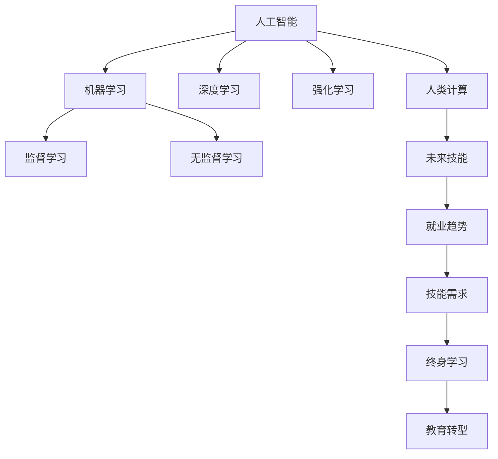

                 

# 人类计算：AI时代的未来技能发展与就业趋势

## 1. 背景介绍

### 1.1 问题由来
随着人工智能技术的迅猛发展，尤其是深度学习和机器学习技术的广泛应用，人类计算能力正在发生根本性的变革。AI系统在处理大量数据、执行复杂计算、进行智能决策等方面的能力，已远超人类的传统计算方式。这一转变对教育、就业、社会结构等多个方面带来了深远影响。

人类计算，即利用人类的思维和技能，结合机器算法和计算资源，解决复杂问题的能力，正在逐步被AI系统取代。这一趋势不仅改变了我们处理信息的方式，也重新定义了人类的技能结构和发展方向。

### 1.2 问题核心关键点
当前，AI技术在处理高维数据、大规模计算、多模态信息融合等方面已经展现出强大的优势。这使得人类在传统计算领域的核心技能逐渐被边缘化。如何评估和适应这一转变，以及如何发展未来技能以适应AI时代的就业需求，成为了一个亟待解决的问题。

1. **技能冗余与需求转变**：哪些人类技能会被AI替代，哪些会变得更加重要？
2. **终身学习与教育转型**：如何在AI时代保持技能竞争力？
3. **就业市场重塑**：AI技术将如何影响各行业的就业结构？
4. **跨学科技能需求**：未来的工作需要哪些跨学科技能？
5. **伦理与责任**：AI技术的广泛应用如何影响道德和责任边界？

### 1.3 问题研究意义
研究人类计算在AI时代的未来发展趋势，对于理解技术变革对教育、就业、社会的影响，制定适应性强的教育政策，以及培养未来的技术人才具有重要意义。通过深入分析AI技术对各领域的影响，可以为社会各界的决策提供科学依据，帮助人们更好地适应未来社会的发展变化。

## 2. 核心概念与联系

### 2.1 核心概念概述

- **人工智能（AI）**：通过模拟人类智能行为，如学习、推理、感知等，实现自主决策和问题解决的计算系统。
- **机器学习（ML）**：一种使机器能够通过数据学习和优化算法，从而自动改进性能的技术。
- **深度学习（DL）**：一种特殊的机器学习技术，通过构建多层次的神经网络模型，实现复杂数据模式的学习和分析。
- **人类计算（Human Computation）**：结合人类思维和机器算法，利用计算资源解决复杂问题的能力。
- **AI时代的未来技能**：在AI广泛应用的背景下，人类需要掌握的新型技能，如跨学科知识、创新能力、伦理素养等。
- **就业趋势**：AI技术发展对各行业就业结构的影响，包括新增职业、岗位需求变化、技能要求等。

这些概念之间的联系可以通过以下Mermaid流程图来展示：



这个流程图展示了人工智能、机器学习、深度学习等核心概念之间的联系，以及它们对人类计算和未来技能发展的潜在影响，最终如何通过终身学习和教育转型，适应AI时代的就业趋势。

## 3. 核心算法原理 & 具体操作步骤

### 3.1 算法原理概述

基于AI的机器学习和深度学习技术，使得复杂的计算任务可以被高效、准确地解决。但这些技术也带来了对人类传统计算技能的冲击。未来技能的发展需要重新评估人类计算的核心竞争力，并结合AI技术的特点，进行合理的技能迁移和转型。

**核心原理**：
1. **数据驱动的决策**：AI系统通过数据学习，能够自动进行决策和优化，减少了对人类经验性决策的依赖。
2. **自适应算法**：机器学习算法能够根据数据变化，自动调整模型参数，实现持续优化。
3. **多模态融合**：AI系统能够处理来自不同模态的信息，如文本、图像、声音等，实现更全面、准确的信息分析。
4. **大规模并行计算**：深度学习模型通过大规模并行计算，实现了对复杂数据模式的快速处理。

### 3.2 算法步骤详解

基于AI的机器学习和深度学习技术，未来技能的发展需要经历以下关键步骤：

**Step 1: 技能需求分析**
- 分析各行业对AI技术的需求，识别出当前AI系统难以胜任的任务。
- 确定这些任务对人类计算能力的具体要求，如逻辑推理、模式识别、复杂决策等。

**Step 2: 技能映射与评估**
- 将现有技能与AI技术的能力进行对比，识别出可以被替代的、以及需要增强的技能。
- 评估这些技能在AI系统中的潜在应用场景，如自动化工具的辅助下，人类计算能力能否得到有效发挥。

**Step 3: 技能转型与培训**
- 制定技能转型方案，明确未来技能的发展方向，如跨学科知识、创新思维、伦理素养等。
- 设计有针对性的培训项目，结合AI技术的特点，提升人类计算能力的实际应用水平。

**Step 4: 终身学习与持续优化**
- 建立终身学习的机制，鼓励持续学习和技能更新，适应AI技术的发展变化。
- 利用AI辅助工具，如智能导师、个性化学习系统等，提升学习效率和效果。

### 3.3 算法优缺点

**优点**：
1. **效率提升**：AI技术能够在短时间内处理大量数据，实现高效的计算和决策。
2. **精度提高**：机器学习模型通过数据学习，能够获得高精度的分析结果。
3. **成本节约**：自动化工具可以减少人力投入，降低计算和决策成本。
4. **多模态融合**：AI系统能够处理多种类型的数据，实现跨领域的信息整合。

**缺点**：
1. **技能冗余**：一些传统计算技能被自动化工具取代，需要重新评估和规划。
2. **技能依赖**：过度依赖AI系统可能导致技能退化，缺乏自主思考能力。
3. **伦理挑战**：AI系统的决策过程缺乏透明性，可能带来道德和责任问题。
4. **就业风险**：自动化工具的广泛应用可能导致某些职业的需求减少。

### 3.4 算法应用领域

未来技能的发展和就业趋势，将对教育、医疗、金融、制造等多个领域产生深远影响：

- **教育**：AI技术将改变教学模式，如自适应学习、个性化辅导等，要求教师具备更高的技术素养和跨学科知识。
- **医疗**：AI辅助诊断和治疗将提高医疗效率和准确性，但对医生的临床决策和人文关怀能力提出了新的要求。
- **金融**：智能投顾和算法交易将改变金融行业的就业结构，要求从业者具备数据分析和算法优化能力。
- **制造**：智能制造和工业互联网将提升生产效率和自动化水平，对工程师的技能需求将发生显著变化。

## 4. 数学模型和公式 & 详细讲解 & 举例说明

### 4.1 数学模型构建

在AI技术中，机器学习和深度学习模型通常通过构建数学模型来描述输入数据和输出结果之间的关系。常见的模型包括线性回归、逻辑回归、支持向量机、神经网络等。

以线性回归模型为例，假设输入为 $x \in \mathbb{R}^n$，输出为 $y \in \mathbb{R}$，则线性回归模型的目标是最小化预测值与真实值之间的平方误差，即：

$$
\min_{\theta} \sum_{i=1}^N (y_i - \theta^T x_i)^2
$$

其中，$\theta$ 为模型参数，包括权重和偏置。

### 4.2 公式推导过程

线性回归模型的参数更新公式为梯度下降法，具体推导如下：

$$
\theta_{k+1} = \theta_k - \alpha \frac{\partial}{\partial \theta} \sum_{i=1}^N (y_i - \theta^T x_i)^2
$$

其中，$\alpha$ 为学习率，用于控制参数更新的步长。

### 4.3 案例分析与讲解

假设有一个房价预测问题，已知历史数据集 $D=\{(x_i, y_i)\}_{i=1}^N$，其中 $x_i \in \mathbb{R}^3$ 表示房屋面积、房间数、楼层等特征，$y_i$ 表示房价。目标是构建一个线性回归模型，用于预测新房的房价。

在机器学习库Scikit-Learn中，可以使用线性回归模型来构建预测模型。具体步骤如下：

```python
from sklearn.linear_model import LinearRegression
from sklearn.metrics import mean_squared_error

# 准备数据
X_train, X_test, y_train, y_test = train_test_split(X, y, test_size=0.2, random_state=42)

# 构建模型
model = LinearRegression()
model.fit(X_train, y_train)

# 预测并评估
y_pred = model.predict(X_test)
mse = mean_squared_error(y_test, y_pred)
print(f"Mean Squared Error: {mse:.2f}")
```

通过上述代码，可以构建一个简单的线性回归模型，并使用历史数据进行训练和评估。在实际应用中，还可以进一步使用正则化、交叉验证等技术，优化模型性能。

## 5. 项目实践：代码实例和详细解释说明

### 5.1 开发环境搭建

在进行AI项目实践前，我们需要准备好开发环境。以下是使用Python进行TensorFlow开发的环境配置流程：

1. 安装Anaconda：从官网下载并安装Anaconda，用于创建独立的Python环境。

2. 创建并激活虚拟环境：
```bash
conda create -n tf-env python=3.8 
conda activate tf-env
```

3. 安装TensorFlow：根据CUDA版本，从官网获取对应的安装命令。例如：
```bash
pip install tensorflow==2.7
```

4. 安装TensorFlow扩展库：
```bash
pip install tensorflow-addons
```

5. 安装各类工具包：
```bash
pip install numpy pandas scikit-learn matplotlib tqdm jupyter notebook ipython
```

完成上述步骤后，即可在`tf-env`环境中开始AI项目实践。

### 5.2 源代码详细实现

下面我们以房价预测问题为例，给出使用TensorFlow对线性回归模型进行训练的PyTorch代码实现。

首先，定义训练数据集：

```python
import tensorflow as tf
import numpy as np
from sklearn.model_selection import train_test_split

# 准备数据
X = np.array([[1, 2, 3], [4, 5, 6], [7, 8, 9], [10, 11, 12]])
y = np.array([3000, 4000, 5000, 6000])

# 划分训练集和测试集
X_train, X_test, y_train, y_test = train_test_split(X, y, test_size=0.2, random_state=42)
```

然后，定义模型和优化器：

```python
# 定义模型
def linear_regression_model(input_dim, output_dim):
    model = tf.keras.Sequential([
        tf.keras.layers.Dense(1, input_dim=input_dim, kernel_initializer='uniform')
    ])
    return model

# 准备模型
model = linear_regression_model(3, 1)

# 定义优化器和损失函数
optimizer = tf.keras.optimizers.Adam(learning_rate=0.01)
loss_fn = tf.keras.losses.MeanSquaredError()
```

接着，定义训练和评估函数：

```python
# 定义训练函数
def train_epoch(model, data, optimizer, batch_size):
    with tf.GradientTape() as tape:
        for i in range(0, len(data), batch_size):
            x_train, y_train = data[i:i+batch_size]
            y_pred = model(x_train)
            loss = loss_fn(y_train, y_pred)
    gradients = tape.gradient(loss, model.trainable_variables)
    optimizer.apply_gradients(zip(gradients, model.trainable_variables))
    return loss

# 定义评估函数
def evaluate(model, data):
    mse = loss_fn(tf.convert_to_tensor(y_test), model(tf.convert_to_tensor(X_test)))
    return mse.numpy()
```

最后，启动训练流程并在测试集上评估：

```python
# 训练模型
epochs = 1000
batch_size = 4

for epoch in range(epochs):
    loss = train_epoch(model, (X_train, y_train), optimizer, batch_size)
    if epoch % 100 == 0:
        print(f"Epoch {epoch+1}, train loss: {loss:.4f}")

# 评估模型
test_loss = evaluate(model, (X_test, y_test))
print(f"Test MSE: {test_loss:.4f}")
```

以上就是使用TensorFlow对线性回归模型进行房价预测任务训练的完整代码实现。可以看到，利用TensorFlow可以轻松构建和训练模型，同时支持分布式计算和多设备部署。

### 5.3 代码解读与分析

让我们再详细解读一下关键代码的实现细节：

**模型定义**：
- `linear_regression_model`函数：定义一个简单的线性回归模型，包括一个全连接层。
- `model`变量：创建模型实例。

**训练函数**：
- `train_epoch`函数：对数据进行批次化训练，计算损失并反向传播更新模型参数。

**评估函数**：
- `evaluate`函数：计算测试集上的均方误差，用于评估模型性能。

**训练流程**：
- `epochs`和`batch_size`变量：设定训练轮数和批次大小。
- 循环迭代训练，每个epoch计算一次损失，并在重要节点打印输出。

可以看到，TensorFlow提供了强大的API，使得模型构建和训练变得简单高效。开发者可以通过简化模型定义和优化器选择，专注于数据处理和算法优化。

当然，实际应用中还需考虑更多因素，如超参数调优、模型剪枝、模型并行等，但核心的训练范式基本与此类似。

## 6. 实际应用场景

### 6.1 智能医疗

在医疗领域，AI技术已被广泛应用于疾病预测、影像诊断、药物研发等方面。随着技术的发展，未来AI系统将更加依赖人类计算能力，如临床决策、病情监控、康复指导等。

**具体应用**：
- **疾病预测**：利用AI模型对患者数据进行分析，预测潜在疾病风险，提前介入治疗。
- **影像诊断**：结合AI系统处理医学影像，提高诊断的准确性和效率。
- **药物研发**：利用AI进行药物筛选和分子模拟，加速新药开发进程。

**技能需求**：
- 跨学科知识：需要结合医学、药学、数据科学等多学科知识。
- 数据处理能力：能够处理复杂医疗数据，提取有价值的信息。
- 临床决策能力：能够理解和应用AI系统的输出结果，进行合理决策。

### 6.2 智能金融

在金融领域，AI技术被应用于算法交易、风险管理、客户服务等方面。未来AI系统将更加依赖人类计算能力，如市场分析、投资策略、客户咨询等。

**具体应用**：
- **算法交易**：利用AI模型进行市场预测，自动生成交易策略。
- **风险管理**：结合AI系统分析金融数据，评估风险水平。
- **客户服务**：通过AI系统进行客户咨询，提供个性化服务。

**技能需求**：
- 数据分析能力：能够处理大量金融数据，提取有价值的信息。
- 市场分析能力：能够理解市场动态，制定合理的投资策略。
- 客户沟通能力：能够有效与客户沟通，提供个性化的服务。

### 6.3 智能制造

在制造业，AI技术被应用于智能制造、质量控制、供应链优化等方面。未来AI系统将更加依赖人类计算能力，如设备维护、工艺优化、产品设计等。

**具体应用**：
- **智能制造**：利用AI系统进行生产过程优化，提高生产效率。
- **质量控制**：结合AI系统进行产品质量检测，提高检测准确性。
- **供应链优化**：利用AI系统进行供应链管理，降低成本。

**技能需求**：
- 机械设计能力：能够设计并优化生产设备和工艺流程。
- 数据处理能力：能够处理大量生产数据，提取有价值的信息。
- 项目管理能力：能够协调和管理生产过程，确保生产顺利进行。

### 6.4 未来应用展望

随着AI技术的不断进步，未来技能的发展和就业趋势将呈现以下几个重要方向：

1. **跨学科融合**：AI技术将与更多学科进行融合，形成新的交叉领域。未来的工作将更加注重跨学科知识的整合和应用。
2. **数据科学与分析**：数据处理和分析能力将成为未来的核心竞争力。未来的工作将更多依赖于数据驱动的决策和优化。
3. **伦理与责任**：AI系统的广泛应用将带来新的伦理和责任问题，如数据隐私、算法透明性等。未来的工作将更加注重伦理与责任的边界。
4. **终身学习与适应性**：AI技术的快速发展要求从业者具备持续学习的能力，不断适应新的技术和变化。
5. **人机协作**：未来的工作将更多依赖人机协作，AI系统作为辅助工具，提升人类计算的效率和效果。

## 7. 工具和资源推荐

### 7.1 学习资源推荐

为了帮助开发者系统掌握AI技术及其对未来技能的影响，这里推荐一些优质的学习资源：

1. **Coursera《机器学习》课程**：由斯坦福大学教授Andrew Ng开设，系统讲解机器学习和深度学习的基本概念和算法。
2. **DeepLearning.AI《深度学习》课程**：由深度学习领域知名学者Geoffrey Hinton等联合开设，涵盖深度学习的基础知识和前沿技术。
3. **TensorFlow官方文档**：提供丰富的教程和示例，帮助用户快速上手TensorFlow框架。
4. **Kaggle竞赛平台**：提供大量的数据集和竞赛任务，锻炼数据处理和模型优化能力。
5. **GitHub开源项目**：参与开源项目，了解最新的AI技术应用和最佳实践。

通过对这些资源的学习实践，相信你一定能够快速掌握AI技术及其对未来技能的影响，并用于解决实际问题。

### 7.2 开发工具推荐

高效的开发离不开优秀的工具支持。以下是几款用于AI项目开发的常用工具：

1. **Jupyter Notebook**：交互式编程环境，支持多种编程语言和数据可视化，便于调试和分享。
2. **PyTorch**：基于Python的开源深度学习框架，灵活动态的计算图，适合快速迭代研究。
3. **TensorFlow**：由Google主导开发的开源深度学习框架，生产部署方便，适合大规模工程应用。
4. **GitHub**：代码托管平台，支持版本控制和团队协作，便于代码管理和共享。
5. **Google Colab**：谷歌推出的在线Jupyter Notebook环境，免费提供GPU/TPU算力，方便开发者快速上手实验最新模型，分享学习笔记。

合理利用这些工具，可以显著提升AI项目的开发效率，加快创新迭代的步伐。

### 7.3 相关论文推荐

AI技术的发展源于学界的持续研究。以下是几篇奠基性的相关论文，推荐阅读：

1. **Deep Learning**（Goodfellow et al., 2016）：介绍深度学习的基本概念和算法，是深度学习领域的经典之作。
2. **The Unreasonable Effectiveness of Deep Learning**（LeCun et al., 2015）：探讨深度学习在多个领域的应用前景，对AI技术的发展趋势进行了预测。
3. **Reinforcement Learning: An Introduction**（Sutton and Barto, 2018）：介绍强化学习的基本原理和算法，是强化学习领域的经典教材。
4. **A Survey on Machine Learning in Healthcare**（Rao et al., 2019）：系统综述了机器学习在医疗领域的应用，对未来的发展趋势进行了展望。
5. **Future of Employment: How Susceptible are Jobs to Computerisation**（Ford et al., 2015）：分析了机器自动化对各行业就业结构的影响，对未来的就业趋势进行了预测。

这些论文代表了大AI技术的发展脉络。通过学习这些前沿成果，可以帮助研究者把握学科前进方向，激发更多的创新灵感。

## 8. 总结：未来发展趋势与挑战

### 8.1 研究成果总结

本文对AI技术对未来技能发展的影响进行了全面系统的介绍。首先阐述了AI技术对各领域计算能力的影响，明确了未来技能发展的方向和重点。其次，从原理到实践，详细讲解了AI技术对未来技能发展的机制，提供了实用的开发和评估方法。同时，本文还广泛探讨了AI技术在各领域的应用前景，展示了未来技能发展的广阔前景。

通过本文的系统梳理，可以看到，AI技术正在改变人类的工作方式，提升各行业的自动化和智能化水平。技能结构的转型和终身学习机制的建立，将是未来技能发展的重要方向。未来技能的发展和就业趋势，将直接关系到社会结构的变迁和经济的转型。

### 8.2 未来发展趋势

展望未来，AI技术的发展趋势将呈现以下几个重要方向：

1. **跨学科融合**：AI技术将与更多学科进行深度融合，形成新的交叉领域。未来的工作将更加注重跨学科知识的整合和应用。
2. **数据科学与分析**：数据处理和分析能力将成为未来的核心竞争力。未来的工作将更多依赖于数据驱动的决策和优化。
3. **伦理与责任**：AI系统的广泛应用将带来新的伦理和责任问题，如数据隐私、算法透明性等。未来的工作将更加注重伦理与责任的边界。
4. **终身学习与适应性**：AI技术的快速发展要求从业者具备持续学习的能力，不断适应新的技术和变化。
5. **人机协作**：未来的工作将更多依赖人机协作，AI系统作为辅助工具，提升人类计算的效率和效果。

以上趋势凸显了AI技术对未来技能发展的深远影响。这些方向的探索发展，必将进一步提升AI技术的实际应用价值，为社会各界的决策提供科学依据。

### 8.3 面临的挑战

尽管AI技术已经取得了瞩目成就，但在迈向更加智能化、普适化应用的过程中，它仍面临着诸多挑战：

1. **技能冗余与转型困难**：一些传统计算技能被自动化工具取代，需要重新评估和规划。
2. **数据隐私与伦理问题**：AI系统的广泛应用将带来新的伦理和责任问题，如何保护数据隐私和公平性是一个重要挑战。
3. **技术壁垒与跨领域协作**：AI技术的复杂性和跨学科特性，要求从业者具备多方面的知识和技能，跨领域协作能力成为新要求。
4. **资源消耗与环境影响**：AI技术的广泛应用将带来新的资源消耗和环境问题，如计算资源、能源消耗等。
5. **算法透明性与可解释性**：AI系统的决策过程缺乏透明性，可能带来算法不透明的问题。

这些挑战需要从政策、技术、社会等多个层面进行综合解决。只有通过多方协作，才能实现AI技术的可持续发展。

### 8.4 研究展望

面对AI技术带来的挑战，未来的研究需要在以下几个方面寻求新的突破：

1. **跨学科技能培养**：加强跨学科知识的学习和实践，提升从业者的综合能力。
2. **伦理与责任教育**：引入伦理与责任教育，增强从业者的道德素养和社会责任感。
3. **资源优化与环保**：优化AI系统的资源消耗，减少对环境的影响。
4. **算法透明性与可解释性**：提升AI系统的透明性和可解释性，增强用户信任和接受度。
5. **人机协作机制**：构建人机协作机制，充分发挥AI系统与人类计算的各自优势。

这些研究方向的探索，必将引领AI技术迈向更高的台阶，为构建安全、可靠、可解释、可控的智能系统铺平道路。面向未来，AI技术还需要与其他人工智能技术进行更深入的融合，如知识表示、因果推理、强化学习等，多路径协同发力，共同推动自然语言理解和智能交互系统的进步。只有勇于创新、敢于突破，才能不断拓展AI技术的边界，让人工智能更好地造福人类社会。

## 9. 附录：常见问题与解答

**Q1：AI技术是否会完全取代人类计算能力？**

A: AI技术在处理特定任务上已经展现出强大优势，但在需要人类直觉、创造力、情感等复杂能力的领域，AI系统的能力仍有限。未来技能的发展将更多依赖于人类与AI系统的协作，而非完全替代。

**Q2：人类需要哪些未来技能以适应AI技术？**

A: 未来技能的发展需要重新评估人类计算的核心竞争力，并结合AI技术的特点，进行合理的技能迁移和转型。具体技能包括：
- 跨学科知识：结合多个领域的知识，解决复杂问题。
- 数据科学与分析：处理和分析大量数据，提取有价值的信息。
- 伦理与责任：理解AI系统的决策过程，进行合理道德判断。
- 创新与创造力：利用AI技术辅助创新，产生新的解决方案。
- 人机协作：与AI系统协作，提升工作效率和效果。

**Q3：未来AI技术的发展会带来哪些就业机会？**

A: 随着AI技术的不断发展，未来将带来新的就业机会，如AI工程师、数据科学家、机器学习专家等。同时，一些传统职业的需求将减少，需要进行技能转型。

**Q4：如何为未来的技能发展做好准备？**

A: 建立终身学习机制，不断更新和提升技能。结合AI技术的特点，进行跨学科学习和实践，提升综合能力。

**Q5：AI技术的广泛应用如何影响社会结构？**

A: AI技术的广泛应用将带来新的社会结构变化，如自动化工具取代传统职业，新的职业和岗位需求增加。社会需要适应这些变化，重新规划教育和就业政策。

通过深入理解AI技术对未来技能发展的影响，我们可以更好地把握技术变革的机遇和挑战，为未来社会的发展做好准备。

