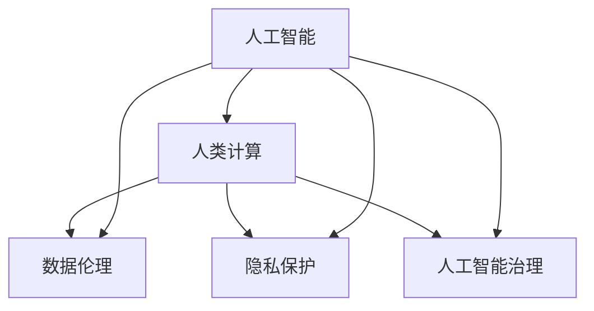

                 

# 人类计算：AI时代的社会影响

> 关键词：人工智能,人类计算,社会影响,数据伦理,隐私保护,人工智能治理

## 1. 背景介绍

随着人工智能(AI)技术的快速发展，特别是深度学习、自然语言处理和大数据技术的广泛应用，AI正逐步渗透到社会各个领域，改变着人们的生活方式、工作模式和社会结构。在这一背景下，"人类计算"概念应运而生，指利用AI技术辅助人类进行计算、决策和协作，提升工作效率和社会福祉。本文旨在探讨AI时代下，人类计算的概念、内涵及其实际应用，分析其对社会的深远影响。

## 2. 核心概念与联系

### 2.1 核心概念概述

**人工智能**：一种模拟人类智能行为的计算技术，包括机器学习、深度学习、自然语言处理等技术，以实现智能化的计算和决策。

**人类计算**：指利用AI技术辅助人类进行复杂计算、分析、决策和协作，提升工作质量和效率，促进社会生产力提升和福祉改善。

**数据伦理**：涉及数据收集、存储、使用和分享过程中的道德规范和法律法规，确保数据使用的透明性、公平性和安全性。

**隐私保护**：指在数据处理和使用过程中，确保个人信息不被滥用或泄露，保护个人隐私权益。

**人工智能治理**：涉及AI技术的规范、监管和政策制定，确保AI技术的健康发展和应用，避免潜在风险和负面影响。

这些概念之间存在紧密的联系和相互作用，共同构成了AI时代下人类计算的基本框架。

### 2.2 核心概念原理和架构的 Mermaid 流程图



## 3. 核心算法原理 & 具体操作步骤

### 3.1 算法原理概述

人类计算的核心算法原理主要基于AI技术的自动化和智能化，具体包括：

- **机器学习**：利用数据训练模型，使其具备自动化的决策和预测能力。
- **自然语言处理**：通过自然语言理解和生成技术，辅助人类进行文本处理和分析。
- **知识图谱**：构建知识结构化的数据模型，帮助人类快速获取和应用知识。

### 3.2 算法步骤详解

人类计算的算法步骤主要包括以下几个关键环节：

1. **数据收集与处理**：收集相关领域的数据，进行清洗、标注和预处理。
2. **模型训练与优化**：利用机器学习算法训练模型，并进行参数优化和调整。
3. **算法部署与应用**：将训练好的模型部署到实际应用场景中，进行推理和预测。
4. **效果评估与反馈**：对模型效果进行评估，并根据反馈调整算法和数据。

### 3.3 算法优缺点

**优点**：

- **高效性**：自动化处理大量数据，提升计算和分析效率。
- **准确性**：利用机器学习算法，提高预测和决策的准确性。
- **灵活性**：算法可适应不同场景和需求，灵活应用。

**缺点**：

- **依赖数据质量**：算法效果依赖高质量的数据，数据偏差可能导致结果偏差。
- **缺乏解释性**：部分AI算法黑箱化，难以解释决策过程和结果。
- **技术门槛高**：需要专业知识和技能，难以普及应用。

### 3.4 算法应用领域

人类计算的应用领域广泛，涉及医疗、金融、教育、城市管理等多个领域。

- **医疗领域**：利用AI技术辅助诊断、药物研发和健康管理，提高医疗服务的效率和质量。
- **金融领域**：通过AI进行风险评估、投资决策和客户服务，提升金融服务的智能化水平。
- **教育领域**：利用AI进行个性化教育、智能辅导和课程推荐，提高教育质量和公平性。
- **城市管理**：通过AI进行智能交通、智慧城市建设和环境监测，提升城市管理水平。

## 4. 数学模型和公式 & 详细讲解 & 举例说明

### 4.1 数学模型构建

人类计算的数学模型通常包括数据预处理、模型训练和效果评估三个环节。以金融风险评估为例，其数学模型构建如下：

1. **数据预处理**：收集历史交易数据，进行清洗和特征提取。
2. **模型训练**：利用机器学习算法，如决策树、随机森林、深度神经网络等，训练风险评估模型。
3. **效果评估**：使用测试数据集对模型效果进行评估，如准确率、召回率、F1值等。

### 4.2 公式推导过程

以线性回归模型为例，其公式推导过程如下：

设$y$为预测变量，$x_1, x_2, ..., x_n$为特征变量，$\beta_0, \beta_1, ..., \beta_n$为模型参数。则线性回归模型为：

$$
y = \beta_0 + \beta_1x_1 + \beta_2x_2 + ... + \beta_nx_n + \epsilon
$$

其中$\epsilon$为误差项。

利用最小二乘法求解$\beta$，其目标函数为：

$$
\sum_{i=1}^n (y_i - (\beta_0 + \beta_1x_{i1} + \beta_2x_{i2} + ... + \beta_nx_{in}))^2
$$

求解目标函数的极小值，得到$\beta$的估计值：

$$
\beta_j = \frac{\sum_{i=1}^n x_{ij}(y_i - \bar{y})}{\sum_{i=1}^n x_{ij}^2}, j=1,2,...,n
$$

其中$\bar{y} = \frac{1}{n}\sum_{i=1}^n y_i$。

### 4.3 案例分析与讲解

以医疗诊断为例，利用深度学习算法训练医学影像分类模型，其步骤如下：

1. **数据收集**：收集医疗影像数据，并进行标注。
2. **数据预处理**：对数据进行归一化、去噪等预处理。
3. **模型训练**：利用卷积神经网络(CNN)算法，训练影像分类模型。
4. **效果评估**：使用测试集对模型进行评估，如准确率、召回率等。
5. **部署与应用**：将训练好的模型部署到实际医疗系统中，辅助医生进行诊断。

## 5. 项目实践：代码实例和详细解释说明

### 5.1 开发环境搭建

人类计算项目开发通常需要以下环境：

1. **Python**：作为编程语言，利用其丰富的库和框架进行开发。
2. **深度学习框架**：如TensorFlow、PyTorch等，提供强大的计算和模型训练功能。
3. **数据处理库**：如Pandas、NumPy等，用于数据清洗、处理和分析。
4. **云计算平台**：如AWS、Google Cloud等，提供计算资源和存储服务。

### 5.2 源代码详细实现

以金融风险评估为例，其代码实现如下：

```python
import pandas as pd
from sklearn.model_selection import train_test_split
from sklearn.linear_model import LinearRegression
from sklearn.metrics import mean_squared_error

# 数据预处理
data = pd.read_csv('finance_data.csv')
X = data[['feature1', 'feature2', 'feature3']]
y = data['target']

# 模型训练与优化
X_train, X_test, y_train, y_test = train_test_split(X, y, test_size=0.2)
model = LinearRegression()
model.fit(X_train, y_train)

# 效果评估
y_pred = model.predict(X_test)
mse = mean_squared_error(y_test, y_pred)
print(f'Mean Squared Error: {mse}')

# 模型部署与应用
# 将模型保存到文件
model.save('financial_risk_model.pkl')

# 加载模型进行预测
loaded_model = joblib.load('financial_risk_model.pkl')
new_data = pd.read_csv('new_financial_data.csv')
new_X = new_data[['feature1', 'feature2', 'feature3']]
new_y_pred = loaded_model.predict(new_X)
print(new_y_pred)
```

### 5.3 代码解读与分析

代码实现步骤包括数据预处理、模型训练、效果评估和模型部署等环节。

1. **数据预处理**：使用Pandas库读取数据，并进行特征提取。
2. **模型训练**：利用sklearn库的LinearRegression算法，训练线性回归模型。
3. **效果评估**：使用均方误差(mse)评估模型效果。
4. **模型部署与应用**：将模型保存到文件，并加载模型进行新数据预测。

## 6. 实际应用场景

### 6.1 医疗领域

**智能诊断系统**：利用深度学习算法，训练医学影像分类模型，辅助医生进行疾病诊断。

**个性化医疗**：利用自然语言处理技术，分析患者病历和临床数据，制定个性化治疗方案。

**药物研发**：利用机器学习算法，分析药物作用机理和疗效，加速新药研发进程。

### 6.2 金融领域

**风险评估**：利用机器学习算法，分析金融数据，评估贷款和投资风险。

**智能投顾**：利用自然语言处理和推荐算法，为客户提供个性化投资建议。

**欺诈检测**：利用深度学习算法，分析交易数据，检测和防范金融欺诈。

### 6.3 教育领域

**智能辅导**：利用自然语言处理和知识图谱技术，提供个性化学习辅导和资源推荐。

**教学评估**：利用机器学习算法，分析学生学习行为和成绩，评估教学效果。

**课程推荐**：利用协同过滤和推荐算法，推荐适合学生的课程和学习资源。

### 6.4 未来应用展望

随着AI技术的进一步发展，人类计算将在更多领域得到广泛应用，为社会带来深刻变革。

1. **智慧城市**：利用AI技术，实现智能交通、环境监测和公共服务优化。
2. **智能制造**：利用AI技术，优化生产流程，提升制造业效率和质量。
3. **智能农业**：利用AI技术，实现精准农业，提高农业生产力和可持续发展能力。
4. **智能医疗**：利用AI技术，实现个性化医疗和健康管理，提升医疗服务水平。

## 7. 工具和资源推荐

### 7.1 学习资源推荐

1. **《人工智能基础》**：入门级教材，系统介绍AI的基本概念和技术。
2. **《深度学习》**：深度学习领域的经典教材，涵盖深度学习原理和算法。
3. **《自然语言处理综论》**：自然语言处理领域的经典教材，介绍NLP的基本技术和应用。
4. **Coursera和edX**：在线学习平台，提供丰富的AI课程和资源。
5. **GitHub**：开源社区，提供大量AI项目的代码和资源。

### 7.2 开发工具推荐

1. **Python**：主流编程语言，拥有丰富的AI库和框架。
2. **TensorFlow和PyTorch**：深度学习框架，提供强大的计算和模型训练功能。
3. **Jupyter Notebook**：交互式编程环境，方便数据处理和模型调试。
4. **AWS和Google Cloud**：云计算平台，提供计算资源和存储服务。

### 7.3 相关论文推荐

1. **《人工智能：一种现代方法》**：全面介绍AI技术的理论基础和应用。
2. **《深度学习》**：深度学习领域的经典论文集，涵盖各种深度学习算法和应用。
3. **《自然语言处理综述》**：自然语言处理领域的经典论文集，介绍NLP技术和应用。

## 8. 总结：未来发展趋势与挑战

### 8.1 研究成果总结

人类计算作为AI时代下的新兴概念，已经在多个领域得到广泛应用，并取得了显著的成果。

**医疗领域**：通过智能诊断系统和个性化医疗，提高了医疗服务的质量和效率。

**金融领域**：通过风险评估和智能投顾，提升了金融服务的智能化水平。

**教育领域**：通过智能辅导和课程推荐，提高了教育质量和公平性。

**城市管理**：通过智能交通和环境监测，提升了城市管理水平。

### 8.2 未来发展趋势

1. **智能化升级**：随着AI技术的进一步发展，人类计算将更加智能化和自动化。
2. **跨领域融合**：人类计算将与物联网、区块链等技术深度融合，推动更多领域的智能化应用。
3. **普及应用**：人类计算将逐步普及到更多行业和领域，提升社会生产力水平。

### 8.3 面临的挑战

1. **数据质量**：高质量数据是AI技术的基础，数据获取和处理难度较大。
2. **技术门槛**：人类计算需要一定的专业知识和技能，普及应用存在一定障碍。
3. **伦理道德**：AI技术应用过程中，数据隐私和伦理道德问题亟待解决。
4. **法律法规**：AI技术的规范和监管亟需完善，确保技术的健康发展。

### 8.4 研究展望

1. **数据获取与处理**：探索更多高质量数据获取方法，提高数据处理效率和质量。
2. **技术普及与教育**：普及AI技术知识和应用，提升技术普及率。
3. **伦理道德建设**：建立数据隐私和伦理道德规范，确保AI技术应用的公平性和透明性。
4. **法律法规制定**：制定AI技术的规范和监管政策，确保技术的健康发展。

## 9. 附录：常见问题与解答

**Q1：人类计算的核心优势是什么？**

A: 人类计算的核心优势在于将AI技术与人类智能有效结合，提升工作效率和决策质量。其优势主要体现在以下几个方面：

1. **高效性**：利用AI自动化处理大量数据，提升计算和分析效率。
2. **准确性**：利用机器学习算法，提高预测和决策的准确性。
3. **灵活性**：算法可适应不同场景和需求，灵活应用。

**Q2：人类计算面临的主要挑战有哪些？**

A: 人类计算面临的主要挑战包括：

1. **数据质量**：高质量数据是AI技术的基础，数据获取和处理难度较大。
2. **技术门槛**：人类计算需要一定的专业知识和技能，普及应用存在一定障碍。
3. **伦理道德**：AI技术应用过程中，数据隐私和伦理道德问题亟待解决。
4. **法律法规**：AI技术的规范和监管亟需完善，确保技术的健康发展。

**Q3：未来人类计算的发展趋势如何？**

A: 未来人类计算的发展趋势主要包括以下几个方面：

1. **智能化升级**：随着AI技术的进一步发展，人类计算将更加智能化和自动化。
2. **跨领域融合**：人类计算将与物联网、区块链等技术深度融合，推动更多领域的智能化应用。
3. **普及应用**：人类计算将逐步普及到更多行业和领域，提升社会生产力水平。

---

作者：禅与计算机程序设计艺术 / Zen and the Art of Computer Programming

