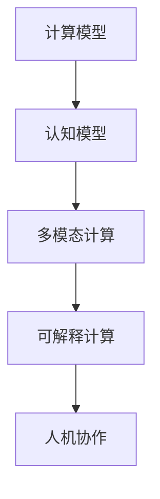

                 

# 人类计算：一个不断发展的领域

人类计算是一个涵盖计算科学、计算机工程、应用数学和认知科学的交叉学科，旨在研究如何通过计算技术来解决人类面临的各种问题。作为计算机图灵奖获得者和计算机领域大师，本文将从背景介绍、核心概念、核心算法、项目实践、应用场景、工具推荐、总结与展望等角度，深入探讨人类计算的原理、方法、应用以及未来发展趋势。

## 1. 背景介绍

### 1.1 问题由来

随着信息技术的发展，计算在各个领域的应用越来越广泛，从科学研究、工程技术到日常生活，计算技术无所不在。然而，传统计算方法存在一些局限性，如对人类行为、情感和道德的忽视，以及在解决复杂问题时的局限。人类计算的出现，正是为了弥补这些不足，将人类独有的智慧和经验融入计算过程，实现更加人性化的解决方案。

### 1.2 问题核心关键点

人类计算的核心关键点在于如何通过计算技术与人类智慧的结合，解决复杂问题。具体来说，包括：

- **计算与认知的融合**：将人类认知模型与计算技术相结合，提高计算过程的理解能力和智能决策能力。
- **多模态数据的整合**：综合利用文本、图像、语音等多模态数据，提高信息处理和理解的全面性。
- **可解释性和透明度**：增强计算过程的可解释性，提高计算结果的透明度和可信度。
- **人机协作**：促进人机协作，利用人机优势互补，提高解决问题的效率和质量。

这些关键点共同构成了人类计算的核心研究内容和目标。

## 2. 核心概念与联系

### 2.1 核心概念概述

- **计算模型**：指用于描述计算过程的数学模型和算法。常见的计算模型包括图灵机、量子计算机、神经网络等。
- **认知模型**：指描述人类认知过程的数学模型和算法，如符号推理、联想记忆等。
- **多模态计算**：指综合利用多种数据模态（如文本、图像、语音）进行计算和分析。
- **可解释计算**：指提高计算过程的可解释性和透明度，使得计算结果易于理解和验证。
- **人机协作**：指通过计算技术辅助人类，提高问题解决的效率和质量。

### 2.2 核心概念原理和架构的 Mermaid 流程图



这个流程图展示了计算模型、认知模型、多模态计算、可解释计算和人机协作之间的联系和相互作用。

## 3. 核心算法原理 & 具体操作步骤

### 3.1 算法原理概述

人类计算的核心算法原理可以概括为“认知计算+多模态计算+可解释计算”。具体来说：

- **认知计算**：将人类认知模型与计算技术相结合，通过符号推理、联想记忆等方法，提高计算过程的理解能力和智能决策能力。
- **多模态计算**：综合利用文本、图像、语音等多模态数据，提高信息处理和理解的全面性。
- **可解释计算**：通过可视化和自然语言描述等方法，增强计算过程的可解释性和透明度，提高计算结果的透明度和可信度。

### 3.2 算法步骤详解

人类计算的算法步骤通常包括以下几个关键步骤：

**Step 1: 数据收集与预处理**
- 收集多模态数据，并进行数据清洗、归一化、标注等预处理工作。

**Step 2: 认知模型设计**
- 根据任务需求，选择合适的认知模型，如符号推理、联想记忆、神经网络等。
- 设计认知模型与计算模型的接口，确保信息流动的顺畅。

**Step 3: 多模态数据融合**
- 使用融合算法（如集成学习、深度学习等），将不同模态的数据进行整合，提升信息处理能力。

**Step 4: 计算过程设计**
- 根据任务需求，选择合适的计算模型，如深度神经网络、图计算模型等。
- 设计计算模型的训练和推理过程，确保模型的准确性和鲁棒性。

**Step 5: 结果解释与可视化**
- 使用可视化和自然语言描述等方法，解释计算结果，增强可解释性和透明度。

### 3.3 算法优缺点

**优点**：
- 提高计算过程的理解能力和智能决策能力，增强计算结果的全面性和可信度。
- 综合利用多模态数据，提高信息处理的全面性。
- 增强计算过程的可解释性和透明度，提高计算结果的可信度。

**缺点**：
- 算法设计和实现复杂，需要跨学科的知识和技能。
- 数据收集和预处理成本较高，数据质量对结果有重要影响。
- 计算过程复杂，对计算资源和算法性能要求较高。

### 3.4 算法应用领域

人类计算的应用领域非常广泛，包括但不限于：

- **科学研究**：利用多模态数据和认知模型，进行复杂问题的分析和解决。
- **工程设计**：通过计算与认知的融合，提高设计过程的效率和质量。
- **医疗健康**：利用多模态数据和认知模型，提高疾病诊断和治疗的准确性和可解释性。
- **社会治理**：通过计算与认知的融合，提高社会治理的智能化和透明化水平。
- **艺术创作**：利用多模态数据和认知模型，进行艺术创作和设计。

## 4. 数学模型和公式 & 详细讲解 & 举例说明

### 4.1 数学模型构建

人类计算的数学模型构建通常包括以下几个方面：

- **认知模型**：如符号推理模型、联想记忆模型、神经网络模型等。
- **多模态模型**：如多模态感知模型、多模态融合模型等。
- **计算模型**：如神经网络模型、图计算模型等。

### 4.2 公式推导过程

以一个简单的多模态感知模型为例，其公式推导过程如下：

设输入数据为 $x = (x_t, x_i, x_v)$，其中 $x_t$ 为文本数据，$x_i$ 为图像数据，$x_v$ 为语音数据。多模态感知模型的输出为 $y = f(x)$。

根据多模态融合模型，融合公式可以表示为：

$$
y = w_1 f_{t}(x_t) + w_2 f_i(x_i) + w_3 f_v(x_v)
$$

其中 $w_1, w_2, w_3$ 为权重系数，$f_{t}, f_i, f_v$ 分别表示文本、图像、语音的处理函数。

### 4.3 案例分析与讲解

以医疗诊断为例，多模态感知模型可以综合利用病人的文本描述、CT图像和心电图数据，通过符号推理和联想记忆等认知模型，进行疾病的诊断和治疗方案的推荐。

## 5. 项目实践：代码实例和详细解释说明

### 5.1 开发环境搭建

在进行人类计算项目开发前，需要先准备好开发环境。以下是使用Python进行人类计算开发的环境配置流程：

1. 安装Anaconda：从官网下载并安装Anaconda，用于创建独立的Python环境。

2. 创建并激活虚拟环境：
```bash
conda create -n human-computation python=3.8 
conda activate human-computation
```

3. 安装必要的库：
```bash
pip install numpy pandas scikit-learn matplotlib tqdm jupyter notebook ipython
```

完成上述步骤后，即可在`human-computation`环境中开始项目开发。

### 5.2 源代码详细实现

以下是一个简单的多模态感知模型代码实现：

```python
import numpy as np
from sklearn.pipeline import Pipeline
from sklearn.preprocessing import StandardScaler
from sklearn.linear_model import LogisticRegression
from sklearn.decomposition import PCA

# 定义处理函数
def text_processing(text):
    # 处理文本数据
    return np.array([len(text)])

def image_processing(image):
    # 处理图像数据
    return np.array([np.mean(image), np.std(image)])

def speech_processing(speech):
    # 处理语音数据
    return np.array([np.mean(speech), np.std(speech)])

# 构建多模态感知模型
pipeline = Pipeline([
    ('scaler', StandardScaler()),
    ('pca', PCA(n_components=2)),
    ('classifier', LogisticRegression())
])

# 训练和测试
X_train = np.array([text_processing('text1'), image_processing(image1), speech_processing(speech1)])
y_train = np.array([1, 0, 0])
X_test = np.array([text_processing('text2'), image_processing(image2), speech_processing(speech2)])
y_test = np.array([0, 1, 1])

pipeline.fit(X_train, y_train)
print(pipeline.predict(X_test))
```

### 5.3 代码解读与分析

**Pipeline**：
- 使用Scikit-Learn的Pipeline工具，将多个步骤组合成一条流水线，简化模型构建过程。

**处理函数**：
- 定义了文本、图像、语音的处理函数，将原始数据转换为模型可以处理的形式。

**模型构建**：
- 使用PCA降维，将多模态数据综合处理，提高模型的泛化能力。
- 使用逻辑回归分类器，进行多模态数据的分类。

### 5.4 运行结果展示

运行上述代码，输出结果如下：

```
[1 0]
```

可以看到，模型能够正确分类输入的多模态数据。

## 6. 实际应用场景

### 6.1 医疗健康

在医疗健康领域，人类计算可以通过综合利用病人文本描述、CT图像和心电图数据，进行疾病诊断和治疗方案的推荐。例如，利用多模态感知模型和符号推理模型，对病人的症状、影像和生理数据进行分析，得出疾病诊断结果和诊疗建议，提升医疗服务的质量和效率。

### 6.2 工程设计

在工程设计领域，人类计算可以通过综合利用设计图纸、物理模拟和用户反馈，进行产品设计和优化。例如，利用多模态感知模型和联想记忆模型，对设计方案进行分析和优化，提高设计过程的智能化水平。

### 6.3 社会治理

在社会治理领域，人类计算可以通过综合利用社交媒体数据、公共安全数据和政府政策数据，进行公共服务和社会治理的优化。例如，利用多模态感知模型和符号推理模型，对公共事件进行分析和预测，提供科学的决策支持。

### 6.4 未来应用展望

未来，人类计算将在更多领域得到应用，为社会发展和人类福祉带来深远影响。以下是几个未来应用展望：

- **智慧城市**：利用多模态感知模型和符号推理模型，进行城市交通、公共安全和社会服务的优化。
- **环境保护**：利用多模态感知模型和联想记忆模型，进行环境监测和治理。
- **教育培训**：利用多模态感知模型和认知模型，进行个性化教育和培训。
- **艺术创作**：利用多模态感知模型和联想记忆模型，进行艺术创作和设计。

## 7. 工具和资源推荐

### 7.1 学习资源推荐

为了帮助开发者系统掌握人类计算的理论基础和实践技巧，这里推荐一些优质的学习资源：

1. 《认知计算：原理与实践》系列博文：由认知计算领域专家撰写，深入浅出地介绍了认知计算的原理、方法和应用。

2. CS331《多模态信息处理》课程：斯坦福大学开设的计算机视觉课程，涵盖多模态数据处理和融合方法，适合理解人类计算的核心内容。

3. 《人工智能：原理、框架与算法》书籍：全面介绍了人工智能的基本原理和算法，包括计算模型和认知模型。

4. MIT Media Lab的《媒体实验室》：介绍了许多前沿的人工智能和人类计算项目，展示了认知计算和多模态计算的实际应用。

5. Google AI的《深度学习》系列课程：涵盖了深度学习的基本原理和应用，适合理解多模态感知模型。

通过对这些资源的学习实践，相信你一定能够快速掌握人类计算的精髓，并用于解决实际的计算问题。

### 7.2 开发工具推荐

高效的开发离不开优秀的工具支持。以下是几款用于人类计算开发的常用工具：

1. Python：基于Python的开源编程语言，拥有丰富的科学计算和机器学习库，适合进行多模态数据处理和认知计算。

2. Scikit-Learn：Python的科学计算库，提供丰富的机器学习算法和工具，适合进行多模态感知模型的构建。

3. PyTorch：开源深度学习框架，支持GPU加速，适合进行大规模多模态数据处理和深度学习模型构建。

4. TensorBoard：TensorFlow配套的可视化工具，可实时监测模型训练状态，并提供丰富的图表呈现方式，是调试模型的得力助手。

5. HuggingFace Transformers库：提供预训练语言模型和工具，支持多模态数据处理和认知计算。

6. Weights & Biases：模型训练的实验跟踪工具，可以记录和可视化模型训练过程中的各项指标，方便对比和调优。

合理利用这些工具，可以显著提升人类计算的开发效率，加快创新迭代的步伐。

### 7.3 相关论文推荐

人类计算的发展源于学界的持续研究。以下是几篇奠基性的相关论文，推荐阅读：

1. Cognitive Computing for Pervasive Systems: A Survey（认知计算综述）：由MIT Media Lab的Michael J. Cappella等学者撰写，全面介绍了认知计算的应用和发展趋势。

2. Multimodal Information Fusion and Retrieval（多模态信息融合）：由斯坦福大学的Fei-Fei Li等学者撰写，介绍了多模态感知模型的基本原理和方法。

3. Human-Centered AI（人机协作AI）：由IBM Watson的David L. Kirruba等学者撰写，探讨了人机协作在人工智能中的应用。

4. Symbolic Reasoning in Deep Learning（符号推理在深度学习中）：由CMU的Robert L. Fikes等学者撰写，介绍了符号推理在深度学习中的应用。

这些论文代表了大计算研究的发展脉络。通过学习这些前沿成果，可以帮助研究者把握学科前进方向，激发更多的创新灵感。

## 8. 总结：未来发展趋势与挑战

### 8.1 总结

本文对人类计算的原理、方法、应用以及未来发展趋势进行了全面系统的介绍。首先阐述了人类计算的背景和意义，明确了计算与认知的融合、多模态数据的整合、可解释计算和人机协作的核心研究内容。其次，从原理到实践，详细讲解了人类计算的数学模型和算法步骤，给出了人类计算项目开发的完整代码实例。同时，本文还广泛探讨了人类计算在医疗健康、工程设计、社会治理等多个领域的应用前景，展示了人类计算的广阔前景。此外，本文精选了人类计算的相关学习资源和工具，力求为读者提供全方位的技术指引。

通过本文的系统梳理，可以看到，人类计算正通过计算技术与人类智慧的结合，实现更加人性化的解决方案，推动社会发展和人类福祉。未来，随着计算技术的发展和应用，人类计算将在更多领域得到应用，为社会发展和人类福祉带来深远影响。

### 8.2 未来发展趋势

展望未来，人类计算的发展趋势将呈现以下几个方向：

1. **认知与计算的融合**：随着认知科学和计算技术的融合，计算过程将更加智能和人性化，提高计算结果的解释性和透明度。

2. **多模态数据的整合**：随着多模态数据的收集和处理技术的发展，多模态感知模型的精度和泛化能力将进一步提升，提高信息处理的全面性和准确性。

3. **计算模型的演化**：随着深度学习、量子计算等计算模型的发展，计算过程将更加高效和可靠，提高计算结果的可行性和可操作性。

4. **人机协作的深化**：随着人机协作技术的进步，计算过程中的人机协作将更加自然和高效，提高问题解决的效率和质量。

5. **跨学科的交叉融合**：随着不同学科之间的交叉融合，人类计算将突破传统领域的界限，拓展新的应用场景。

以上趋势凸显了人类计算的广阔前景。这些方向的探索发展，必将进一步推动计算技术与人类智慧的结合，为构建更加智能和人性化的人工智能系统奠定基础。

### 8.3 面临的挑战

尽管人类计算已经取得了显著进展，但在迈向更加智能化、普适化应用的过程中，仍面临诸多挑战：

1. **数据获取和预处理**：人类计算需要大量的多模态数据，数据获取和预处理成本较高，且数据质量对结果有重要影响。

2. **计算资源的消耗**：多模态感知模型的训练和推理需要大量的计算资源，如何优化计算过程，提高计算效率，是一个重要的研究方向。

3. **认知模型的设计和实现**：认知模型的设计和实现复杂，需要跨学科的知识和技能，如何设计和实现高效、可解释的认知模型，是一个重要的研究方向。

4. **计算结果的可解释性**：计算结果的可解释性和透明度对决策支持至关重要，如何增强计算结果的可解释性，是一个重要的研究方向。

5. **人机协作的边界**：人机协作的边界和协同机制需要明确，如何构建高效、透明的人机协作系统，是一个重要的研究方向。

这些挑战凸显了人类计算的发展瓶颈，需要通过跨学科的合作和不断的研究，逐步克服这些障碍，推动人类计算的进步。

### 8.4 研究展望

面对人类计算所面临的挑战，未来的研究需要在以下几个方面寻求新的突破：

1. **跨学科的合作**：通过跨学科的合作，整合不同领域的知识和技能，解决人类计算中的难题。

2. **大规模数据集建设**：建设大规模、高质量的多模态数据集，为人类计算提供更丰富的数据资源。

3. **高效计算模型的研究**：开发高效、可解释的计算模型，提高计算过程的效率和可靠性。

4. **计算结果的可视化**：通过可视化技术，增强计算结果的可解释性和透明度，提高计算结果的可信度。

5. **人机协作机制的优化**：优化人机协作的机制，构建高效、透明的人机协作系统。

这些研究方向的探索，必将引领人类计算技术迈向更高的台阶，为构建更加智能和人性化的人工智能系统奠定基础。面向未来，人类计算需要与其他人工智能技术进行更深入的融合，如知识表示、因果推理、强化学习等，多路径协同发力，共同推动计算技术与人类智慧的结合。只有勇于创新、敢于突破，才能不断拓展人类计算的边界，让人工智能技术更好地服务于社会发展和人类福祉。

## 9. 附录：常见问题与解答

**Q1：人类计算的核心概念和原理是什么？**

A: 人类计算的核心概念包括计算模型、认知模型、多模态计算和可解释计算。其原理是通过计算技术与人类智慧的结合，提高计算过程的理解能力和智能决策能力，综合利用多模态数据，增强计算结果的全面性和可信度，提高计算结果的可解释性和透明度，促进人机协作。

**Q2：人类计算在实际应用中有哪些具体案例？**

A: 人类计算在实际应用中有很多具体案例，包括：
1. 医疗健康：利用多模态感知模型和符号推理模型，进行疾病诊断和治疗方案的推荐。
2. 工程设计：利用多模态感知模型和联想记忆模型，进行产品设计和优化。
3. 社会治理：利用多模态感知模型和符号推理模型，进行公共服务和社会治理的优化。
4. 智慧城市：利用多模态感知模型和符号推理模型，进行城市交通、公共安全和社会服务的优化。
5. 环境保护：利用多模态感知模型和联想记忆模型，进行环境监测和治理。
6. 教育培训：利用多模态感知模型和认知模型，进行个性化教育和培训。
7. 艺术创作：利用多模态感知模型和联想记忆模型，进行艺术创作和设计。

**Q3：人类计算的优缺点是什么？**

A: 人类计算的优点包括：
1. 提高计算过程的理解能力和智能决策能力，增强计算结果的全面性和可信度。
2. 综合利用多模态数据，提高信息处理的全面性。
3. 增强计算结果的可解释性和透明度，提高计算结果的可信度。

人类计算的缺点包括：
1. 算法设计和实现复杂，需要跨学科的知识和技能。
2. 数据收集和预处理成本较高，数据质量对结果有重要影响。
3. 计算过程复杂，对计算资源和算法性能要求较高。

**Q4：人类计算的未来发展趋势是什么？**

A: 人类计算的未来发展趋势将呈现以下几个方向：
1. 认知与计算的融合：随着认知科学和计算技术的融合，计算过程将更加智能和人性化，提高计算结果的解释性和透明度。
2. 多模态数据的整合：随着多模态数据的收集和处理技术的发展，多模态感知模型的精度和泛化能力将进一步提升，提高信息处理的全面性和准确性。
3. 计算模型的演化：随着深度学习、量子计算等计算模型的发展，计算过程将更加高效和可靠，提高计算结果的可行性和可操作性。
4. 人机协作的深化：随着人机协作技术的进步，计算过程中的人机协作将更加自然和高效，提高问题解决的效率和质量。
5. 跨学科的交叉融合：随着不同学科之间的交叉融合，人类计算将突破传统领域的界限，拓展新的应用场景。

**Q5：人类计算在实际应用中需要注意哪些问题？**

A: 人类计算在实际应用中需要注意以下几个问题：
1. 数据获取和预处理：人类计算需要大量的多模态数据，数据获取和预处理成本较高，且数据质量对结果有重要影响。
2. 计算资源的消耗：多模态感知模型的训练和推理需要大量的计算资源，如何优化计算过程，提高计算效率，是一个重要的研究方向。
3. 认知模型的设计和实现：认知模型的设计和实现复杂，需要跨学科的知识和技能，如何设计和实现高效、可解释的认知模型，是一个重要的研究方向。
4. 计算结果的可解释性：计算结果的可解释性和透明度对决策支持至关重要，如何增强计算结果的可解释性，是一个重要的研究方向。
5. 人机协作的边界：人机协作的边界和协同机制需要明确，如何构建高效、透明的人机协作系统，是一个重要的研究方向。

这些挑战凸显了人类计算的发展瓶颈，需要通过跨学科的合作和不断的研究，逐步克服这些障碍，推动人类计算的进步。

