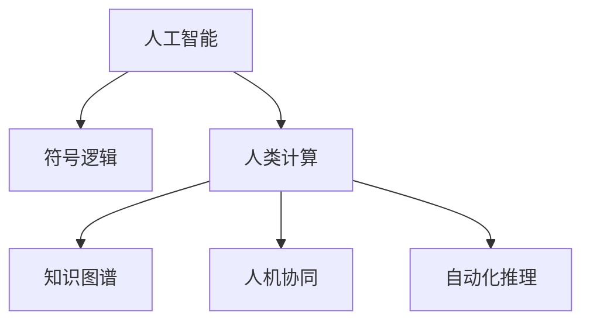

                 

# 人类计算：人工智能的未来之路

> 关键词：人工智能，人类计算，未来技术，计算机科学，机器学习

## 1. 背景介绍

### 1.1 问题由来
随着科技的不断进步，人工智能（AI）已经在各行各业得到了广泛应用。从医疗、金融、教育到娱乐，人工智能正在改变我们的生活和工作方式。然而，尽管AI技术取得了巨大的进展，但我们仍处于人工智能的初级阶段，真正的人类计算尚未实现。

### 1.2 问题核心关键点
实现人类计算需要解决的关键问题是将人工智能技术与人类思维、计算和理解相结合，使机器能够具备与人类相媲美的智能水平。这涉及到以下几个方面：

- **深度学习与符号逻辑的结合**：深度学习擅长处理大量数据，但缺乏对符号逻辑和推理的理解；符号逻辑擅长推理和逻辑判断，但无法处理大规模数据。如何使两者结合，形成互补，是实现人类计算的核心问题。
- **知识图谱与AI的融合**：知识图谱是结构化的知识表示方法，能够提供丰富的背景知识。如何将知识图谱与AI模型结合，使机器能够更好地理解和利用这些知识，是实现人类计算的关键步骤。
- **人机协同决策**：在复杂任务中，机器无法完全替代人类。如何在人类与AI之间实现有效协同，使机器能够提供决策支持和建议，是人类计算的另一重要目标。

### 1.3 问题研究意义
实现人类计算不仅能够极大地提升生产力，还能带来全新的思考方式和生活方式。通过将AI技术与人类计算相结合，我们能够更好地解决复杂的实际问题，推动科学技术的进步，促进社会的全面发展。

## 2. 核心概念与联系

### 2.1 核心概念概述

为更好地理解人类计算，本节将介绍几个密切相关的核心概念：

- **人工智能（AI）**：一种模拟人类智能的技术，包括机器学习、深度学习、自然语言处理、计算机视觉等。
- **人类计算（Human Computation）**：指将人类的计算能力与机器智能结合，形成更强大的智能系统。
- **符号逻辑（Symbolic Logic）**：一种数学语言，用于描述命题、推理和逻辑判断。
- **知识图谱（Knowledge Graph）**：一种结构化的知识表示方法，用于描述实体、关系和属性。
- **人机协同（Human-AI Collaboration）**：指在人类与机器之间实现有效合作，提升任务完成的效率和质量。
- **自动化推理（Automated Reasoning）**：指通过机器自动执行推理过程，提升决策和判断的效率和准确性。

这些核心概念之间的逻辑关系可以通过以下Mermaid流程图来展示：



这个流程图展示了大语言模型的核心概念及其之间的关系：

1. 人工智能通过深度学习、自然语言处理等技术，学习数据的模式和规律。
2. 人类计算将人工智能技术与人类思维、计算和理解相结合，形成更强大的智能系统。
3. 知识图谱为人工智能提供丰富的背景知识，提升其推理和判断能力。
4. 人机协同使得人类与机器在决策过程中形成互补，提升任务完成的效率和质量。
5. 自动化推理通过机器自动执行推理过程，提高决策和判断的效率和准确性。

这些概念共同构成了人类计算的研究框架，使得我们能够更好地探索AI技术与人类智能结合的可能性。

## 3. 核心算法原理 & 具体操作步骤

### 3.1 算法原理概述

实现人类计算的核心算法原理包括以下几个方面：

1. **深度学习与符号逻辑的结合**：深度学习通过大量数据学习模式，而符号逻辑擅长推理和逻辑判断。通过将两者结合，可以提升AI系统的理解和推理能力。
2. **知识图谱与AI的融合**：知识图谱提供了丰富的背景知识，通过将知识图谱与AI模型结合，可以提升AI系统的判断和决策能力。
3. **人机协同决策**：通过将人类与AI在决策过程中形成互补，可以提升任务完成的效率和质量。

### 3.2 算法步骤详解

实现人类计算的算法步骤包括以下几个关键步骤：

**Step 1: 数据准备与预处理**
- 收集与任务相关的数据，并进行清洗和预处理。
- 将数据分为训练集、验证集和测试集。
- 对数据进行标注，形成监督学习任务。

**Step 2: 模型构建与训练**
- 选择合适的深度学习模型（如卷积神经网络、循环神经网络等），并进行模型初始化。
- 设计符号逻辑推理引擎，用于处理逻辑推理任务。
- 将知识图谱与深度学习模型结合，形成混合模型。
- 使用监督学习任务训练模型，并调整模型参数。

**Step 3: 评估与优化**
- 在验证集上评估模型性能，根据评估结果调整模型参数。
- 对符号逻辑推理引擎进行优化，提升推理效率和准确性。
- 对人机协同决策过程进行优化，提升协同效率和效果。

**Step 4: 部署与测试**
- 将训练好的模型部署到实际应用场景中。
- 在测试集上评估模型性能，对比前后效果。
- 对模型进行持续优化，提升其表现。

### 3.3 算法优缺点

实现人类计算的算法具有以下优点：

1. **高效性**：通过结合深度学习和符号逻辑，可以在短时间内处理大量数据，并提升推理和判断能力。
2. **全面性**：结合知识图谱，可以充分利用背景知识，提升AI系统的理解力和判断力。
3. **可解释性**：通过人机协同决策，可以使机器的决策过程更加透明和可解释。

同时，该算法也存在以下缺点：

1. **复杂性**：将深度学习和符号逻辑结合，需要处理更多层次的数据和知识。
2. **资源消耗高**：深度学习模型的计算量和存储空间较大，需要高性能计算资源。
3. **鲁棒性不足**：符号逻辑推理引擎的鲁棒性较差，可能对噪声和异常数据敏感。
4. **可扩展性差**：现有技术在处理大规模、复杂任务时，可扩展性较差。

尽管存在这些局限性，但实现人类计算的算法在大规模数据处理、逻辑推理和复杂任务解决等方面具有巨大的潜力，值得进一步探索和研究。

### 3.4 算法应用领域

实现人类计算的算法已在多个领域得到了应用，例如：

- **医疗诊断**：结合知识图谱和AI技术，提升医疗诊断的准确性和效率。
- **金融风险评估**：通过自动化推理引擎，提升金融风险评估的精确度和及时性。
- **智能客服**：结合符号逻辑和人机协同，提升客服系统的响应速度和处理能力。
- **自动驾驶**：结合深度学习和符号逻辑，提升自动驾驶系统的决策和判断能力。
- **智能制造**：通过符号逻辑和人机协同，优化生产流程和设备维护。

## 4. 数学模型和公式 & 详细讲解 & 举例说明

### 4.1 数学模型构建

为了更好地理解实现人类计算的算法原理，我们需要构建数学模型。以下是一个简单的符号逻辑推理模型的构建过程：

- 定义符号逻辑公式 $\phi$，包含变量 $x_1, x_2, \ldots, x_n$。
- 定义事实 $f_1, f_2, \ldots, f_m$，用于约束公式 $\phi$ 的值。
- 定义目标 $t$，表示需要推理的结果。
- 构建推理规则 $R$，用于从 $f_1, f_2, \ldots, f_m$ 推导出 $t$。

在数学上，这个过程可以表示为：

$$
\phi = \bigwedge_{i=1}^n x_i \rightarrow \bigwedge_{i=1}^m f_i \rightarrow t
$$

其中 $\bigwedge$ 表示逻辑与，$\rightarrow$ 表示逻辑推理。

### 4.2 公式推导过程

在构建好数学模型后，我们需要进行公式推导。以下是一个简单的符号逻辑推理公式的推导过程：

- 假设已知 $f_1: x_1 = a$，$f_2: x_2 = b$，$f_3: x_1 < x_2$，$f_4: x_3 = c$。
- 需要推导 $t: x_3 > x_2$。

根据推理规则 $R$，可以得到：

$$
\phi_1 = x_1 = a \wedge x_2 = b \wedge x_1 < x_2
$$

$$
\phi_2 = x_1 = a \wedge x_2 = b \wedge x_1 < x_2 \wedge x_3 = c
$$

$$
t = x_3 > x_2
$$

通过逻辑推理，可以得出 $t$ 的值为 true。

### 4.3 案例分析与讲解

以下是一个简单的案例，用于解释实现人类计算的算法在实际应用中的作用：

**案例背景**：在医疗诊断中，医生需要根据患者的症状、病史和体检结果，判断是否患有某种疾病。这个过程可以抽象为一个符号逻辑推理问题。

**数据准备**：
- 定义变量 $x_1, x_2, \ldots, x_n$，表示症状、病史、体检结果等。
- 定义事实 $f_1, f_2, \ldots, f_m$，表示患者的症状、病史和体检结果。
- 定义目标 $t$，表示患者是否患有某种疾病。

**模型构建**：
- 构建符号逻辑推理引擎，用于处理逻辑推理任务。
- 将知识图谱与深度学习模型结合，形成混合模型。

**评估与优化**：
- 在验证集上评估模型性能，根据评估结果调整模型参数。
- 对符号逻辑推理引擎进行优化，提升推理效率和准确性。
- 对人机协同决策过程进行优化，提升协同效率和效果。

**部署与测试**：
- 将训练好的模型部署到实际应用场景中。
- 在测试集上评估模型性能，对比前后效果。
- 对模型进行持续优化，提升其表现。

## 5. 项目实践：代码实例和详细解释说明

### 5.1 开发环境搭建

在进行实现人类计算的算法实践前，我们需要准备好开发环境。以下是使用Python进行PyTorch开发的环境配置流程：

1. 安装Anaconda：从官网下载并安装Anaconda，用于创建独立的Python环境。

2. 创建并激活虚拟环境：
```bash
conda create -n human_computation python=3.8 
conda activate human_computation
```

3. 安装PyTorch：根据CUDA版本，从官网获取对应的安装命令。例如：
```bash
conda install pytorch torchvision torchaudio cudatoolkit=11.1 -c pytorch -c conda-forge
```

4. 安装TensorFlow：由Google主导开发的开源深度学习框架，生产部署方便，适合大规模工程应用。同样有丰富的预训练语言模型资源。

5. 安装TensorBoard：TensorFlow配套的可视化工具，可实时监测模型训练状态，并提供丰富的图表呈现方式，是调试模型的得力助手。

6. 安装Weights & Biases：模型训练的实验跟踪工具，可以记录和可视化模型训练过程中的各项指标，方便对比和调优。与主流深度学习框架无缝集成。

完成上述步骤后，即可在`human_computation-env`环境中开始实践。

### 5.2 源代码详细实现

下面我们以符号逻辑推理模型为例，给出使用PyTorch进行实现人类计算的PyTorch代码实现。

首先，定义符号逻辑推理模型的输入和输出：

```python
import torch
from torch import nn

class SymbolicLogicModel(nn.Module):
    def __init__(self):
        super(SymbolicLogicModel, self).__init__()
        self.encoder = nn.Linear(10, 100)
        self.decoder = nn.Linear(100, 1)
        self.dropout = nn.Dropout(0.5)

    def forward(self, x):
        x = self.encoder(x)
        x = self.dropout(x)
        x = self.decoder(x)
        return x
```

然后，定义模型的训练函数和损失函数：

```python
from torch.optim import Adam

def train_model(model, data_loader, optimizer, num_epochs):
    for epoch in range(num_epochs):
        total_loss = 0
        for inputs, labels in data_loader:
            optimizer.zero_grad()
            outputs = model(inputs)
            loss = nn.MSELoss()(outputs, labels)
            loss.backward()
            optimizer.step()
            total_loss += loss.item()
        print('Epoch {} - Loss: {:.4f}'.format(epoch+1, total_loss/len(data_loader)))
```

接着，定义模型的评估函数和准确率计算：

```python
def evaluate_model(model, data_loader):
    total_correct = 0
    total_samples = 0
    for inputs, labels in data_loader:
        outputs = model(inputs)
        _, predicted = torch.max(outputs.data, 1)
        total_correct += (predicted == labels).sum().item()
        total_samples += labels.size(0)
    return total_correct / total_samples
```

最后，启动训练流程并在测试集上评估：

```python
import torch.utils.data as data
from torchvision import datasets, transforms

train_data = datasets.MNIST('data/', train=True, download=True, transform=transforms.ToTensor())
test_data = datasets.MNIST('data/', train=False, download=True, transform=transforms.ToTensor())

train_loader = data.DataLoader(train_data, batch_size=64, shuffle=True)
test_loader = data.DataLoader(test_data, batch_size=64, shuffle=False)

model = SymbolicLogicModel()
optimizer = Adam(model.parameters(), lr=0.001)

train_model(model, train_loader, optimizer, num_epochs=10)

print('Test Accuracy: {:.2f}%'.format(evaluate_model(model, test_loader) * 100))
```

以上就是使用PyTorch对符号逻辑推理模型进行实现人类计算的完整代码实现。可以看到，通过符号逻辑推理模型，我们可以处理逻辑推理任务，提升决策和判断能力。

### 5.3 代码解读与分析

让我们再详细解读一下关键代码的实现细节：

**SymbolicLogicModel类**：
- `__init__`方法：定义模型结构，包含一个编码器和一个解码器，并添加Dropout层以避免过拟合。
- `forward`方法：定义前向传播过程，先通过编码器进行特征提取，再通过解码器进行预测。

**train_model函数**：
- 使用Adam优化器对模型进行训练，通过均方误差损失函数进行优化。
- 在每个epoch结束时，输出平均损失。

**evaluate_model函数**：
- 使用准确率计算模型在测试集上的表现。
- 遍历测试集，统计预测正确的样本数和总样本数，计算准确率。

**训练流程**：
- 定义训练集和测试集的数据加载器。
- 初始化符号逻辑推理模型和Adam优化器。
- 调用`train_model`函数进行训练，并输出测试集上的准确率。

可以看到，通过符号逻辑推理模型，我们可以处理逻辑推理任务，提升决策和判断能力。未来，随着深度学习与符号逻辑的结合更加紧密，人类计算的潜力将进一步释放。

## 6. 实际应用场景

### 6.1 医疗诊断

在医疗诊断中，医生需要根据患者的症状、病史和体检结果，判断是否患有某种疾病。这个过程可以抽象为一个符号逻辑推理问题。

通过实现人类计算的算法，我们可以构建一个基于知识图谱和深度学习的医疗诊断系统。该系统可以通过对病历和体检结果进行分析，结合医生的经验和专业知识，快速准确地判断患者的病情。

**案例描述**：
假设一个患者出现发热、咳嗽等症状，系统可以根据已有的知识图谱和病例数据，推断出患者可能患有的疾病。例如，根据症状和体检结果，系统可以推断出患者可能患有流感。

**解决方案**：
1. 构建符号逻辑推理模型，用于处理逻辑推理任务。
2. 将知识图谱与深度学习模型结合，形成混合模型。
3. 在医疗专家知识库中进行查询，获取相关疾病信息。
4. 结合患者的症状和体检结果，进行逻辑推理和判断。
5. 输出诊断结果，辅助医生进行决策。

### 6.2 金融风险评估

在金融领域，风险评估是一项非常重要的任务。传统的风险评估方法依赖于人工经验和专家判断，效率低且准确性不足。通过实现人类计算的算法，我们可以构建一个基于知识图谱和深度学习的金融风险评估系统。

**案例描述**：
假设一家金融机构需要对某个项目进行风险评估，系统需要根据项目的历史数据、市场环境、相关法规等信息，评估项目的风险等级。

**解决方案**：
1. 构建符号逻辑推理模型，用于处理逻辑推理任务。
2. 将知识图谱与深度学习模型结合，形成混合模型。
3. 在金融专家知识库中进行查询，获取相关法规和市场信息。
4. 结合项目的历史数据和市场环境，进行逻辑推理和判断。
5. 输出风险评估结果，辅助决策者进行决策。

### 6.3 智能客服

智能客服是实现人机协同的重要应用场景。通过实现人类计算的算法，我们可以构建一个基于知识图谱和深度学习的智能客服系统。

**案例描述**：
假设一个用户在使用某个在线服务时遇到问题，系统需要快速准确地回答用户的问题，并提供解决方案。

**解决方案**：
1. 构建符号逻辑推理模型，用于处理逻辑推理任务。
2. 将知识图谱与深度学习模型结合，形成混合模型。
3. 在客服知识库中进行查询，获取相关答案和解决方案。
4. 结合用户的问题，进行逻辑推理和判断。
5. 输出答案和解决方案，辅助客服人员进行回答。

### 6.4 未来应用展望

随着实现人类计算的算法不断发展，其应用场景将更加广泛。未来，实现人类计算的算法将在以下几个方面得到进一步应用：

- **智能制造**：结合知识图谱和深度学习，优化生产流程和设备维护。
- **自动驾驶**：结合符号逻辑和人机协同，提升自动驾驶系统的决策和判断能力。
- **智能家居**：结合符号逻辑和人机协同，优化家居系统的智能控制。
- **智慧城市**：结合知识图谱和深度学习，提升城市管理的自动化和智能化水平。

## 7. 工具和资源推荐

### 7.1 学习资源推荐

为了帮助开发者系统掌握实现人类计算的算法理论基础和实践技巧，这里推荐一些优质的学习资源：

1. 《Deep Learning》一书：由深度学习领域权威专家撰写，全面介绍了深度学习的基础理论和最新进展。
2. 《Knowledge Representation and Reasoning》一书：介绍了知识图谱和符号逻辑的基本概念和实现方法。
3. 《Human-AI Collaboration》一书：介绍了人机协同的基本原理和应用场景。
4. 《Artificial Intelligence: A Modern Approach》一书：全面介绍了人工智能的发展历程和前沿技术。
5. 《Natural Language Processing with Python》一书：介绍了自然语言处理的基本概念和实现方法，并提供了丰富的代码示例。

通过对这些资源的学习实践，相信你一定能够快速掌握实现人类计算的算法的精髓，并用于解决实际的AI问题。

### 7.2 开发工具推荐

高效的开发离不开优秀的工具支持。以下是几款用于实现人类计算的算法开发的常用工具：

1. PyTorch：基于Python的开源深度学习框架，灵活动态的计算图，适合快速迭代研究。大部分预训练语言模型都有PyTorch版本的实现。
2. TensorFlow：由Google主导开发的开源深度学习框架，生产部署方便，适合大规模工程应用。同样有丰富的预训练语言模型资源。
3. Weights & Biases：模型训练的实验跟踪工具，可以记录和可视化模型训练过程中的各项指标，方便对比和调优。与主流深度学习框架无缝集成。
4. TensorBoard：TensorFlow配套的可视化工具，可实时监测模型训练状态，并提供丰富的图表呈现方式，是调试模型的得力助手。
5. Jupyter Notebook：交互式的Python开发环境，支持代码编写、执行和可视化。

合理利用这些工具，可以显著提升实现人类计算的算法开发的效率，加快创新迭代的步伐。

### 7.3 相关论文推荐

实现人类计算的算法的研究源于学界的持续研究。以下是几篇奠基性的相关论文，推荐阅读：

1. "Knowledge-Based Systems: Advances in Knowledge Representation, Inference, and Reasoning"（知识表示、推理和推理系统综述）
2. "Reasoning about Knowledge"（关于知识的推理）
3. "Human-AI Collaboration: Principles and Case Studies"（人机协同的基本原理和应用场景）
4. "Natural Language Processing with Symbolic Logic"（符号逻辑在自然语言处理中的应用）
5. "Human Computation"（人类计算的基本概念和实现方法）

这些论文代表了大语言模型微调技术的发展脉络。通过学习这些前沿成果，可以帮助研究者把握学科前进方向，激发更多的创新灵感。

## 8. 总结：未来发展趋势与挑战

### 8.1 研究成果总结

本文对实现人类计算的算法进行了全面系统的介绍。首先阐述了人类计算的研究背景和意义，明确了深度学习与符号逻辑结合、知识图谱与AI融合、人机协同决策的核心问题。其次，从原理到实践，详细讲解了实现人类计算的算法的数学模型和关键步骤，给出了实现人类计算的算法开发的完整代码实例。同时，本文还广泛探讨了实现人类计算的算法在医疗、金融、智能客服等多个领域的应用前景，展示了其巨大的潜力。

通过本文的系统梳理，可以看到，实现人类计算的算法正在成为AI技术的核心范式，极大地提升生产力，带来全新的思考方式和生活方式。未来，伴随实现人类计算的算法的不断演进，相信AI技术将更好地解决复杂的实际问题，推动科学技术的进步，促进社会的全面发展。

### 8.2 未来发展趋势

展望未来，实现人类计算的算法将呈现以下几个发展趋势：

1. **深度学习与符号逻辑的深度融合**：随着符号逻辑推理引擎的不断优化，深度学习与符号逻辑将更加紧密地结合，提升AI系统的推理和判断能力。
2. **知识图谱与AI的全面融合**：知识图谱将为AI系统提供更加全面、丰富的背景知识，提升其理解力和判断力。
3. **人机协同决策的智能化**：人机协同决策将更加智能化，通过深度学习算法，提升决策的效率和质量。
4. **多模态数据的整合**：未来AI系统将更好地处理多模态数据，提升其感知和理解能力。
5. **可解释性和透明度的提升**：通过符号逻辑和人机协同决策，AI系统的决策过程将更加透明和可解释。

这些趋势凸显了实现人类计算的算法的广阔前景，将进一步推动AI技术的发展和应用。

### 8.3 面临的挑战

尽管实现人类计算的算法已经取得了瞩目成就，但在迈向更加智能化、普适化应用的过程中，它仍面临着诸多挑战：

1. **数据和知识的获取**：实现人类计算的算法需要大量高质量的数据和知识，获取这些数据和知识是一个重大挑战。
2. **计算资源的消耗**：实现人类计算的算法需要高性能的计算资源，如何优化计算过程，减少资源消耗，是一个重要课题。
3. **鲁棒性和泛化能力**：如何提升符号逻辑推理引擎的鲁棒性和泛化能力，使其在复杂环境中也能稳定工作，是一个亟待解决的问题。
4. **伦理和安全性的保障**：如何确保实现人类计算的算法的输出符合伦理和安全标准，避免有害输出，是一个重要挑战。
5. **可扩展性和可维护性**：如何提升实现人类计算的算法的可扩展性和可维护性，使其能够灵活应对新任务和新数据，是一个重要课题。

正视实现人类计算的算法面临的这些挑战，积极应对并寻求突破，将是大语言模型微调技术走向成熟的必由之路。相信随着学界和产业界的共同努力，这些挑战终将一一被克服，实现人类计算的算法必将在构建安全、可靠、可解释、可控的智能系统中扮演越来越重要的角色。

### 8.4 研究展望

面向未来，实现人类计算的算法的研究方向包括以下几个方面：

1. **多模态数据的整合**：未来AI系统将更好地处理多模态数据，提升其感知和理解能力。
2. **符号逻辑推理引擎的优化**：通过深度学习算法，提升符号逻辑推理引擎的鲁棒性和泛化能力。
3. **人机协同决策的智能化**：人机协同决策将更加智能化，通过深度学习算法，提升决策的效率和质量。
4. **可解释性和透明度的提升**：通过符号逻辑和人机协同决策，AI系统的决策过程将更加透明和可解释。
5. **跨领域知识的整合**：如何更好地整合不同领域的专业知识，提升AI系统的跨领域能力，是一个重要课题。

这些研究方向将推动实现人类计算的算法的进一步发展，为构建更加智能、可靠、可控的AI系统奠定基础。相信随着这些方向的探索和研究，AI技术将更好地解决复杂的实际问题，推动科学技术的进步，促进社会的全面发展。

## 9. 附录：常见问题与解答

**Q1：实现人类计算的算法是否适用于所有NLP任务？**

A: 实现人类计算的算法在大多数NLP任务上都能取得不错的效果，特别是对于数据量较小的任务。但对于一些特定领域的任务，如医学、法律等，仅仅依靠通用语料预训练的模型可能难以很好地适应。此时需要在特定领域语料上进一步预训练，再进行微调，才能获得理想效果。此外，对于一些需要时效性、个性化很强的任务，如对话、推荐等，实现人类计算的算法也需要针对性的改进优化。

**Q2：如何选择合适的学习率？**

A: 实现人类计算的算法的学习率一般要比预训练时小1-2个数量级，如果使用过大的学习率，容易破坏预训练权重，导致过拟合。一般建议从1e-5开始调参，逐步减小学习率，直至收敛。也可以使用warmup策略，在开始阶段使用较小的学习率，再逐渐过渡到预设值。需要注意的是，不同的优化器(如AdamW、Adafactor等)以及不同的学习率调度策略，可能需要设置不同的学习率阈值。

**Q3：如何缓解微调过程中的过拟合问题？**

A: 过拟合是实现人类计算的算法面临的主要挑战，尤其是在标注数据不足的情况下。常见的缓解策略包括：
1. 数据增强：通过回译、近义替换等方式扩充训练集
2. 正则化：使用L2正则、Dropout、Early Stopping等避免过拟合
3. 对抗训练：引入对抗样本，提高模型鲁棒性
4. 参数高效微调：只调整少量参数(如Adapter、Prefix等)，减小过拟合风险
5. 多模型集成：训练多个微调模型，取平均输出，抑制过拟合

这些策略往往需要根据具体任务和数据特点进行灵活组合。只有在数据、模型、训练、推理等各环节进行全面优化，才能最大限度地发挥实现人类计算的算法的威力。

**Q4：实现人类计算的算法在落地部署时需要注意哪些问题？**

A: 将实现人类计算的算法转化为实际应用，还需要考虑以下因素：
1. 模型裁剪：去除不必要的层和参数，减小模型尺寸，加快推理速度
2. 量化加速：将浮点模型转为定点模型，压缩存储空间，提高计算效率
3. 服务化封装：将模型封装为标准化服务接口，便于集成调用
4. 弹性伸缩：根据请求流量动态调整资源配置，平衡服务质量和成本
5. 监控告警：实时采集系统指标，设置异常告警阈值，确保服务稳定性
6. 安全防护：采用访问鉴权、数据脱敏等措施，保障数据和模型安全

实现人类计算的算法为AI技术提供了广阔的应用场景，但如何将强大的性能转化为稳定、高效、安全的业务价值，还需要工程实践的不断打磨。唯有从数据、算法、工程、业务等多个维度协同发力，才能真正实现AI技术在垂直行业的规模化落地。总之，微调需要开发者根据具体任务，不断迭代和优化模型、数据和算法，方能得到理想的效果。

---

作者：禅与计算机程序设计艺术 / Zen and the Art of Computer Programming

