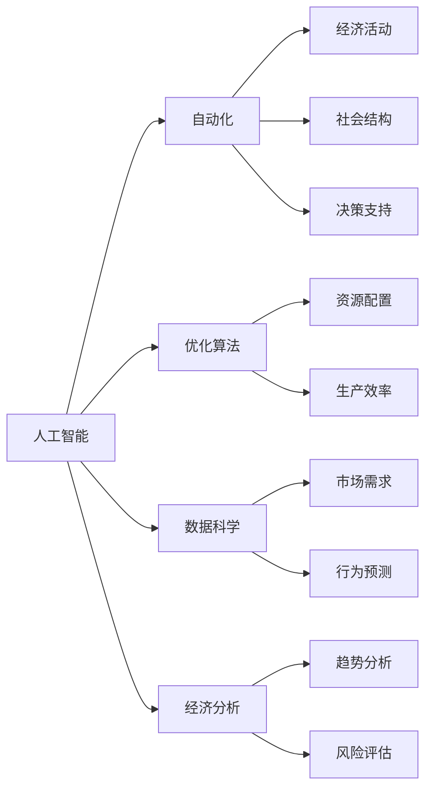

                 

# 人类计算：对社会和经济的影响

> 关键词：人工智能, 计算, 社会, 经济, 影响, 算法, 数据, 自动化, 优化, 预测, 风险, 伦理

## 1. 背景介绍

### 1.1 问题由来

随着数字化时代的到来，人类计算（Human Computing），即利用计算机和人力的混合方式处理复杂问题的能力，已经成为了一个热门话题。人类计算不仅应用于科学研究和技术开发，也在经济活动中扮演了重要角色。在数据驱动的现代社会，自动化和优化算法正在重新定义经济价值和社会行为，改变传统经济和社会结构。因此，深入理解人类计算对社会和经济的影响，具有重要的现实意义。

### 1.2 问题核心关键点

人类计算的核心关键点包括以下几点：

- **数据驱动**：在自动化算法和AI技术的推动下，数据成为经济活动的核心驱动力。
- **算法优化**：高效的算法能大幅提升生产效率和决策质量，优化资源配置。
- **人机协同**：结合人类智慧和计算机能力，提升问题解决能力。
- **经济影响**：自动化和优化算法对就业、收入分配、市场需求等方面产生了深远影响。
- **社会挑战**：算法偏见、隐私风险、社会分裂等问题逐渐凸显。

这些关键点相互交织，共同塑造了人类计算对社会和经济的影响格局。

## 2. 核心概念与联系

### 2.1 核心概念概述

在探讨人类计算的影响时，我们需要明确几个核心概念：

- **人工智能（AI）**：利用计算机模拟人脑的工作方式，实现问题的自动解决。
- **自动化**：利用算法和机器人技术，自动完成重复性、高风险任务。
- **优化算法**：如遗传算法、强化学习、优化器等，用于提高系统效率和性能。
- **数据科学**：通过数据分析和机器学习，挖掘数据背后的价值和规律。
- **经济分析**：利用量化模型和预测算法，分析经济活动中的趋势和风险。

这些概念紧密相关，共同推动了人类计算的发展，并对社会和经济产生深远影响。

### 2.2 核心概念原理和架构的 Mermaid 流程图



这个流程图展示了人工智能、自动化、优化算法、数据科学和经济分析之间的联系及其对经济活动和社会结构的影响。

## 3. 核心算法原理 & 具体操作步骤

### 3.1 算法原理概述

人类计算的核心算法原理主要围绕以下几个方面：

- **算法优化**：通过优化算法提高生产效率和决策质量。例如，遗传算法通过模拟生物进化过程，寻找最优解；强化学习通过试错机制，提升决策策略。
- **数据驱动**：利用大数据和机器学习算法，从海量数据中挖掘出有用的信息和规律，用于指导决策和优化。
- **人机协同**：结合人类智慧和计算机能力，利用人工智能技术增强人类计算能力。例如，在医疗诊断中，结合医生的专业知识和AI系统的辅助，提高诊断准确率。

### 3.2 算法步骤详解

人类计算的算法步骤通常包括以下几个关键步骤：

1. **数据收集与预处理**：收集相关数据，并进行清洗、归一化等预处理，确保数据质量。
2. **模型选择与训练**：选择合适的算法模型，利用训练数据进行模型训练。
3. **验证与调优**：在验证集上评估模型性能，根据结果进行调参和优化。
4. **部署与应用**：将训练好的模型部署到实际应用场景中，进行实时预测和优化。
5. **持续监控与改进**：根据运行反馈和业务需求，不断更新和改进模型。

### 3.3 算法优缺点

人类计算算法的优点包括：

- **效率高**：自动化和优化算法可以大幅提升处理速度和精度。
- **成本低**：通过算法优化，降低人工和物质资源的消耗。
- **灵活性**：算法可以灵活适应不同的应用场景和需求。

缺点则包括：

- **依赖数据**：算法的性能受数据质量影响较大。
- **技术复杂**：需要较高的技术门槛和专业知识。
- **透明度低**：一些算法的决策过程难以解释，存在“黑箱”问题。
- **伦理风险**：算法可能存在偏见，导致不公平决策。

### 3.4 算法应用领域

人类计算算法广泛应用于多个领域，包括：

- **金融分析**：利用算法进行市场预测、风险评估、投资组合优化等。
- **医疗健康**：通过机器学习和大数据分析，提高诊断准确率，优化治疗方案。
- **物流管理**：利用优化算法和AI技术，提高物流效率和配送质量。
- **供应链管理**：结合大数据和预测算法，优化库存管理和供应链流程。
- **智能制造**：应用自动化和机器视觉技术，提升生产自动化和智能化水平。

## 4. 数学模型和公式 & 详细讲解 & 举例说明

### 4.1 数学模型构建

以金融市场预测为例，数学模型构建过程如下：

设市场历史数据为 $x_1,x_2,\dots,x_n$，其中 $x_i$ 表示第 $i$ 个时刻的市场状态。市场价格变化可以表示为：

$$
p_i = f(x_i, \theta) + \epsilon_i
$$

其中 $f(\cdot)$ 为价格预测函数，$\theta$ 为模型参数，$\epsilon_i$ 为随机误差项。市场状态 $x_i$ 可以表示为多个因素的组合，例如利率、通货膨胀率、GDP增长率等。

### 4.2 公式推导过程

对市场价格进行预测时，可以使用回归分析方法，假设 $f(\cdot)$ 为线性函数：

$$
f(x_i, \theta) = \theta_0 + \sum_{k=1}^p \theta_k x_{ik}
$$

其中 $p$ 为特征数量。利用历史数据，可以求解模型参数 $\theta$：

$$
\hat{\theta} = \arg\min_{\theta} \sum_{i=1}^n (p_i - f(x_i, \theta))^2
$$

通过最小二乘法求解上述优化问题，得到最优参数估计 $\hat{\theta}$。

### 4.3 案例分析与讲解

以谷歌的AlphaGo为例，利用强化学习进行围棋博弈。AlphaGo通过模拟人机对弈，优化博弈策略，最终战胜了世界围棋冠军李世石。AlphaGo的成功，展示了算法优化在复杂博弈问题中的应用潜力。

## 5. 项目实践：代码实例和详细解释说明

### 5.1 开发环境搭建

开发环境搭建主要包括以下步骤：

1. 安装Python 3.8及以上版本。
2. 安装Anaconda Python发行版，确保有足够的库支持。
3. 安装TensorFlow和Keras等深度学习框架。
4. 安装必要的工具库，如NumPy、Pandas、Matplotlib等。

### 5.2 源代码详细实现

以下是一个简单的金融预测模型示例，使用TensorFlow实现：

```python
import tensorflow as tf
from tensorflow.keras.models import Sequential
from tensorflow.keras.layers import Dense

# 构建模型
model = Sequential()
model.add(Dense(64, input_dim=p, activation='relu'))
model.add(Dense(1))

# 编译模型
model.compile(optimizer='adam', loss='mse')

# 训练模型
model.fit(X_train, y_train, epochs=100, batch_size=32)

# 预测市场价格
predictions = model.predict(X_test)
```

### 5.3 代码解读与分析

代码中，我们使用TensorFlow构建了一个简单的线性回归模型，用于预测市场价格。首先，定义模型的输入层和输出层，并使用ReLU激活函数。然后，编译模型，选择Adam优化器和均方误差损失函数。最后，使用训练数据对模型进行训练，并对测试集进行预测。

## 6. 实际应用场景

### 6.1 智能城市管理

智能城市管理中，利用AI和大数据技术，可以实现交通流量优化、环境监测、公共安全管理等。例如，通过实时监测交通数据，预测交通拥堵情况，优化信号灯控制，减少交通延误。

### 6.2 农业智能化

农业智能化利用传感器和大数据技术，实时监测土壤湿度、温度、光照等环境因素，优化种植方案，提高农作物产量和质量。例如，通过智能灌溉系统，根据土壤湿度自动调整灌溉水量。

### 6.3 智能制造

智能制造利用自动化和机器人技术，实现生产过程的智能化和自动化。例如，利用机器视觉技术，自动识别产品缺陷，提高产品质量和生产效率。

### 6.4 未来应用展望

未来，人类计算将在更多领域得到应用，为社会和经济带来变革性影响。例如，在医疗健康领域，AI可以辅助医生进行诊断和治疗，优化资源配置。在环境保护领域，利用AI技术进行环境监测和预警，保护生态环境。

## 7. 工具和资源推荐

### 7.1 学习资源推荐

1. **《人工智能导论》**：斯坦福大学公开课，涵盖人工智能的基本概念和算法。
2. **《机器学习实战》**：书中包含大量实际应用案例，适合初学者学习。
3. **Kaggle**：数据科学竞赛平台，提供大量实际数据集和竞赛任务。
4. **Coursera**：提供多种AI和机器学习课程，涵盖从入门到高级的内容。
5. **GitHub**：开源社区，提供大量AI和机器学习项目的代码和资源。

### 7.2 开发工具推荐

1. **Python**：主流编程语言，支持广泛的数据分析和机器学习库。
2. **TensorFlow**：谷歌开源的深度学习框架，支持分布式计算和GPU加速。
3. **PyTorch**：Facebook开源的深度学习框架，灵活易用。
4. **Jupyter Notebook**：交互式编程环境，便于实验和数据探索。
5. **Docker**：容器化技术，便于应用部署和管理。

### 7.3 相关论文推荐

1. **《深度学习》**：Ian Goodfellow等人著，深度学习领域的经典教材。
2. **《机器学习》**：Tom Mitchell著，介绍机器学习的基本原理和算法。
3. **《强化学习》**：Richard Sutton等人著，介绍强化学习的理论和实践。

## 8. 总结：未来发展趋势与挑战

### 8.1 研究成果总结

人类计算在社会和经济中的应用前景广阔，通过自动化和优化算法，提升了生产效率和决策质量，优化了资源配置。同时，数据驱动和AI技术在各领域的应用，推动了技术进步和经济发展。

### 8.2 未来发展趋势

未来人类计算将继续向智能化和自动化方向发展，随着算力提升和算法优化，人类计算将进一步提升。同时，随着数据获取和处理的便捷性增加，数据驱动的决策将更加普遍。

### 8.3 面临的挑战

人类计算面临的挑战主要包括：

- **数据隐私**：如何保护数据隐私，避免数据泄露和滥用。
- **算法透明性**：算法的决策过程难以解释，存在“黑箱”问题。
- **技术门槛**：AI和大数据技术需要较高的技术门槛和专业知识。
- **伦理道德**：算法可能存在偏见，导致不公平决策。

### 8.4 研究展望

未来研究需要关注以下几个方面：

- **算法透明性**：增强算法的可解释性，提高算法透明度。
- **隐私保护**：设计隐私保护机制，保护用户数据隐私。
- **伦理道德**：研究算法伦理，避免不公平和有害的决策。
- **普适性**：推动AI技术在更多领域的应用，实现技术普惠。

## 9. 附录：常见问题与解答

**Q1：什么是人类计算？**

A: 人类计算（Human Computing）是指利用计算机和人力的混合方式处理复杂问题的能力。它结合了人类智慧和计算机技术，实现高效、准确的问题解决。

**Q2：人类计算有哪些应用？**

A: 人类计算广泛应用于多个领域，包括金融分析、医疗健康、物流管理、供应链管理、智能制造等。

**Q3：人类计算对经济有哪些影响？**

A: 人类计算通过自动化和优化算法，提升了生产效率和决策质量，优化了资源配置。同时，数据驱动的决策推动了技术进步和经济发展。

**Q4：人类计算面临哪些挑战？**

A: 人类计算面临的挑战主要包括数据隐私、算法透明性、技术门槛和伦理道德等。

**Q5：如何提高人类计算的普适性？**

A: 推动AI技术在更多领域的应用，实现技术普惠，设计隐私保护机制，增强算法的可解释性，避免不公平和有害的决策。

---

作者：禅与计算机程序设计艺术 / Zen and the Art of Computer Programming

