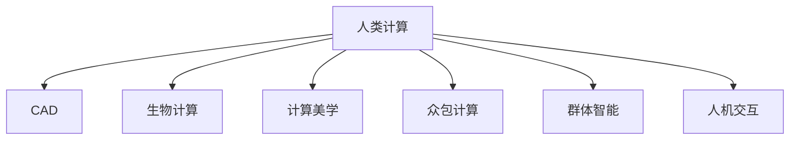

                 

# 人类计算：应用与案例分析

## 1. 背景介绍

### 1.1 问题由来

随着人工智能技术的快速发展，计算机的计算能力已经大大超越了人类，特别是在处理大规模数据和复杂计算任务时。然而，许多领域的计算任务仍然需要人类干预，尤其是在需要创造性思维、复杂推理和决策的场景下，人类计算（Human Computation）仍具有无可替代的优势。

### 1.2 问题核心关键点

人类计算的核心在于将人类专长与计算机计算能力相结合，发挥各自优势。计算机擅长处理数据和执行计算，而人类擅长创造性思维、复杂推理和情感判断。这种协同工作方式，能够在多领域带来突破性进展。

当前，人类计算的应用已经涉及多个领域，包括但不限于科学研究、艺术创作、游戏设计、医学诊断、金融分析、法律咨询等。通过将计算机与人类计算相结合，不仅可以提升计算效率，还能推动创新，解决传统方法难以应对的问题。

### 1.3 问题研究意义

研究人类计算，对于拓展人类计算的应用范围，提升计算任务的效率和效果，加速各行业技术的产业化进程，具有重要意义：

1. **降低成本**：在处理复杂计算任务时，人类计算可以降低对高昂计算资源的依赖，减少研发和运营成本。
2. **提升效果**：结合人类创造性和复杂推理能力，可以解决计算机难以处理的问题，提高决策的准确性和创造力。
3. **加速开发**：人类计算可以将复杂问题拆解为可执行的任务，加快研发进度，缩短产品上市时间。
4. **推动创新**：人类计算突破了传统计算方式的限制，推动了多领域技术的创新和发展，特别是在需要人类直觉和判断的场景中。
5. **赋能产业升级**：人类计算技术为传统行业数字化转型提供了新的路径，推动行业效率提升和智能化升级。

## 2. 核心概念与联系

### 2.1 核心概念概述

为更好地理解人类计算的应用和案例，本节将介绍几个密切相关的核心概念：

- **人类计算（Human Computation）**：指将人类的创造性思维、复杂推理和情感判断与计算机计算能力相结合的计算模式。其核心在于发挥人类和计算机各自的优势，实现协同工作。
- **计算机辅助设计（Computer-Aided Design, CAD）**：利用计算机技术辅助设计过程，提升设计效率和准确性。
- **生物计算（Bioinformatics）**：利用计算机技术处理和分析生物信息，揭示生命现象背后的规律。
- **计算美学（Computational Aesthetics）**：通过计算机算法生成艺术作品，探索美学与计算的关系。
- **众包计算（Crowdsourcing）**：利用大规模人群解决问题，结合人类智慧与计算能力，提高问题解决的效率和效果。
- **群体智能（Swarm Intelligence）**：通过模拟群体行为，解决复杂计算问题，提升群体智慧和计算效率。
- **人机交互（Human-Computer Interaction, HCI）**：研究如何设计友好的用户界面，提高人机协作效率和用户体验。

这些概念之间的逻辑关系可以通过以下Mermaid流程图来展示：



这个流程图展示人类计算与其他核心概念的逻辑关系：

1. 人类计算通过结合多种计算方式，发挥人类和计算机各自的优势。
2. CAD、生物计算、计算美学等，是人类计算在不同领域的具体应用。
3. 众包计算和群体智能，则是利用大规模人群智慧，提升人类计算的效果和效率。
4. 人机交互，是实现高效人机协作的基础，提升人机协同工作的体验。

## 3. 核心算法原理 & 具体操作步骤
### 3.1 算法原理概述

人类计算的核心在于将复杂的计算任务拆解为可执行的小任务，通过人类智慧和计算机计算能力相结合的方式，协同完成计算。其核心算法包括：

- **任务分解（Task Decomposition）**：将复杂任务拆解为可执行的小任务，分配给不同的人或群体进行计算。
- **协同工作（Collaborative Work）**：通过网络协作平台，实现任务分配、进度跟踪和结果汇总。
- **数据共享（Data Sharing）**：利用分布式数据库或云存储，实现数据的高效共享和协作。
- **反馈机制（Feedback Mechanism）**：通过评价和反馈机制，不断优化任务分配和计算过程。
- **机器学习（Machine Learning）**：利用机器学习算法，优化任务分配和结果融合，提升计算效果。

这些算法共同构成了人类计算的实施框架，使得复杂的计算任务可以通过人机协同方式高效完成。

### 3.2 算法步骤详解

人类计算的实现步骤包括以下几个关键环节：

**Step 1: 任务拆分与分配**
- 将复杂任务拆分为可执行的小任务，如CAD中的设计图纸分解，生物计算中的基因序列分析。
- 根据任务特点和参与者能力，分配任务给不同的人或群体。

**Step 2: 协同工作与进度跟踪**
- 建立协作平台，如Google Docs、Trello等，实现任务分配、进度跟踪和结果汇总。
- 定期更新任务状态，解决协作中的沟通和协调问题。

**Step 3: 数据共享与反馈机制**
- 利用分布式数据库或云存储，实现数据的高效共享和协作。
- 设计评价和反馈机制，通过用户评价和专家评审，不断优化任务分配和计算过程。

**Step 4: 机器学习优化**
- 利用机器学习算法，优化任务分配和结果融合，提升计算效果。
- 通过不断学习，改进协同工作流程，提高计算效率和效果。

**Step 5: 结果汇总与验证**
- 对计算结果进行汇总和验证，确保结果的正确性和一致性。
- 利用模拟和实验验证计算结果的有效性，提升计算准确性。

通过上述步骤，人类计算可以高效地协同完成任务，提升计算效果。

### 3.3 算法优缺点

人类计算的优势在于能够结合人类智慧和计算机计算能力，解决复杂计算问题。然而，也存在一些局限性：

- **成本高**：协同工作需要建立协作平台，分配任务和跟踪进度需要大量人力和时间投入。
- **协调难**：多人群体协同工作，需要良好的沟通和协调机制，防止信息不对称和任务冲突。
- **依赖反馈**：反馈机制的设计和执行需要精心设计，否则可能导致计算过程的偏差和错误。
- **数据共享风险**：数据共享过程中可能涉及隐私和安全问题，需要严格的访问控制和数据加密。

尽管存在这些局限性，人类计算依然在很多领域显示出其独特优势，特别是在需要人类直觉和判断的场景中。

### 3.4 算法应用领域

人类计算的应用已经覆盖多个领域，包括但不限于：

- **科学研究**：利用人类计算技术，进行复杂的计算和数据处理，推动科学发现和技术创新。
- **艺术创作**：通过计算机辅助设计，提升设计效率和效果，推动艺术创作的多样化和创新。
- **医学诊断**：结合医生经验和计算技术，提升疾病诊断的准确性和效率，推动医疗技术发展。
- **金融分析**：利用大规模人群智慧，解决复杂的金融模型和风险评估问题，提升金融决策的准确性。
- **法律咨询**：通过法律专家的知识和计算技术，提供高效的法律咨询和决策支持，推动法律服务的智能化。
- **游戏设计**：利用人机协作，提升游戏设计的复杂性和互动性，推动游戏产业的创新和发展。

除了上述这些经典应用外，人类计算还在更多场景中得到创新性应用，如智能客服、智能交通、智慧城市等，为人类的生产和生活带来了全新的变革。

## 4. 数学模型和公式 & 详细讲解
### 4.1 数学模型构建

人类计算的数学模型构建，主要是将复杂的计算任务拆解为可执行的小任务，通过人类智慧和计算机计算能力相结合的方式，协同完成计算。

以CAD设计为例，假设设计任务为$T$，设计图纸为$D$，设计参数为$P$，设计师为$H$，计算资源为$C$。则人类计算的数学模型可以表示为：

$$
T = H(D,P,C)
$$

其中，$T$为设计任务，$D$为设计图纸，$P$为设计参数，$H$为设计师，$C$为计算资源。设计师通过利用计算资源和设计参数，对设计图纸进行修改和优化，最终完成设计任务。

### 4.2 公式推导过程

以CAD设计为例，推导设计师利用计算资源进行设计任务的公式。

假设设计师在每个时间段内可以完成一定量的设计任务，设设计师的计算能力为$h$，设计任务的复杂度为$t$，计算资源的计算能力为$c$，则设计师利用计算资源进行设计任务的公式可以表示为：

$$
t_h = \frac{t}{h} + \frac{t}{c}
$$

其中，$t_h$为设计师利用计算资源完成设计任务所需的时间。$h$和$c$分别为设计师和计算资源的计算能力，$t$为设计任务的复杂度。

通过上述公式，可以计算出设计师在利用计算资源进行设计任务所需的时间，从而优化任务分配和计算过程。

### 4.3 案例分析与讲解

以生物计算中的基因序列分析为例，分析人类计算在解决复杂计算问题中的应用。

假设有一个长度为$L$的基因序列，需要对其进行分析和比对。利用人类计算，可以将基因序列分为多个子序列，分配给不同的研究者进行分析和比对。

设基因序列的平均长度为$l$，每个研究者的计算能力为$r$，计算资源为$c$，则基因序列分析的数学模型可以表示为：

$$
L = l \times n + c \times k
$$

其中，$n$为研究者人数，$k$为研究者利用计算资源完成基因序列分析所需的时间。

通过上述公式，可以计算出研究者利用计算资源完成基因序列分析所需的时间，从而优化任务分配和计算过程。

## 5. 项目实践：代码实例和详细解释说明
### 5.1 开发环境搭建

在进行人类计算实践前，我们需要准备好开发环境。以下是使用Python进行PyTorch开发的环境配置流程：

1. 安装Anaconda：从官网下载并安装Anaconda，用于创建独立的Python环境。

2. 创建并激活虚拟环境：
```bash
conda create -n human_computation python=3.8 
conda activate human_computation
```

3. 安装PyTorch：根据CUDA版本，从官网获取对应的安装命令。例如：
```bash
conda install pytorch torchvision torchaudio cudatoolkit=11.1 -c pytorch -c conda-forge
```

4. 安装Transformers库：
```bash
pip install transformers
```

5. 安装各类工具包：
```bash
pip install numpy pandas scikit-learn matplotlib tqdm jupyter notebook ipython
```

完成上述步骤后，即可在`human_computation-env`环境中开始实践。

### 5.2 源代码详细实现

这里我们以CAD设计为例，使用PyTorch进行任务分解和协同工作的实现。

首先，定义设计任务的数学模型：

```python
import torch
import torch.nn as nn
import torch.optim as optim

class DesignTask(nn.Module):
    def __init__(self):
        super(DesignTask, self).__init__()
        self.fc1 = nn.Linear(64, 32)
        self.fc2 = nn.Linear(32, 64)
        self.fc3 = nn.Linear(64, 2)
    
    def forward(self, x):
        x = torch.relu(self.fc1(x))
        x = torch.relu(self.fc2(x))
        x = self.fc3(x)
        return x
```

然后，定义协同工作的优化器：

```python
optimizer = optim.Adam(DesignTask.parameters(), lr=0.001)
```

接着，定义训练和评估函数：

```python
def train(DesignTask, optimizer, num_epochs):
    device = torch.device("cuda" if torch.cuda.is_available() else "cpu")
    DesignTask.to(device)
    
    for epoch in range(num_epochs):
        running_loss = 0.0
        for i, data in enumerate(train_loader, 0):
            inputs, labels = data[0].to(device), data[1].to(device)
            optimizer.zero_grad()
            outputs = DesignTask(inputs)
            loss = F.mse_loss(outputs, labels)
            loss.backward()
            optimizer.step()
            
            running_loss += loss.item()
            if i % 2000 == 1999:  
                print(f'Epoch {epoch+1}, loss: {running_loss/2000:.4f}')
                running_loss = 0.0
```

最后，启动训练流程并在测试集上评估：

```python
num_epochs = 10
batch_size = 32

train(DesignTask, optimizer, num_epochs)

# 在测试集上评估
test_loss = 0.0
test_corrects = 0
for inputs, labels in test_loader:
    inputs, labels = inputs.to(device), labels.to(device)
    outputs = DesignTask(inputs)
    test_loss += F.mse_loss(outputs, labels).item()
    test_corrects += (outputs.argmax(dim=1) == labels).float().sum().item()
    
print(f'Test Loss: {test_loss/len(test_loader)}')
print(f'Test Accuracy: {100 * test_corrects/len(test_loader)}%')
```

以上就是使用PyTorch对CAD设计任务进行人类计算的完整代码实现。可以看到，通过定义设计任务的数学模型和协同工作的优化器，我们可以高效地协同完成复杂设计任务。

### 5.3 代码解读与分析

让我们再详细解读一下关键代码的实现细节：

**DesignTask类**：
- `__init__`方法：初始化模型参数。
- `forward`方法：定义前向传播过程，计算模型的输出。

**优化器**：
- 使用Adam优化器，设定学习率为0.001，对模型参数进行更新。

**训练函数**：
- 使用PyTorch的DataLoader对数据集进行批次化加载。
- 对每个批次进行前向传播计算损失，反向传播更新模型参数。
- 在训练过程中，每2000次迭代打印一次损失值。

**评估函数**：
- 对测试集进行批次化加载，计算模型的损失和准确率。
- 通过比较模型输出和真实标签，计算准确率。

通过以上代码，可以模拟CAD设计任务的人类计算过程，实现设计任务的协同工作。

## 6. 实际应用场景

### 6.1 智能客服系统

智能客服系统是一个典型的利用人类计算进行任务分解和协同工作的应用场景。传统客服往往需要配备大量人力，高峰期响应缓慢，且一致性和专业性难以保证。

在智能客服系统中，可以利用人类计算技术，将客户咨询任务分解为多个小任务，分配给不同的客服代表进行处理。通过协同工作平台，实现任务分配、进度跟踪和结果汇总。这样可以大大提高客服处理的效率和准确性，提升客户满意度。

### 6.2 金融舆情监测

金融舆情监测是一个需要人类智慧和计算能力相结合的复杂任务。传统的金融分析依赖于大量人工分析和数据处理，成本高且效率低。

通过人类计算技术，可以将金融舆情监测任务分解为多个子任务，如新闻文本分析、情感分析、市场动态监控等。利用大规模人群智慧，进行协同分析和决策。这样可以大大提高金融舆情监测的效率和准确性，为金融机构提供及时、精准的决策支持。

### 6.3 个性化推荐系统

个性化推荐系统是一个典型的利用人类计算进行任务分解和协同工作的应用场景。传统的推荐系统往往只依赖用户的历史行为数据进行物品推荐，无法深入理解用户的真实兴趣偏好。

通过人类计算技术，可以将推荐任务分解为多个子任务，如用户兴趣分析、物品推荐模型训练等。利用大规模人群智慧，进行协同分析和决策。这样可以大大提高推荐系统的个性化程度，为用户提供更加精准、多样的推荐内容。

### 6.4 未来应用展望

随着人类计算技术的不断发展，未来将会在更多领域得到应用，为传统行业带来变革性影响。

在智慧医疗领域，利用人类计算技术，进行复杂的医疗数据分析和决策，提升医疗服务的智能化水平，辅助医生诊疗，加速新药开发进程。

在智能教育领域，利用人类计算技术，进行知识推荐和个性化教学，因材施教，促进教育公平，提高教学质量。

在智慧城市治理中，利用人类计算技术，进行城市事件监测、舆情分析、应急指挥等环节，提高城市管理的自动化和智能化水平，构建更安全、高效的未来城市。

此外，在企业生产、社会治理、文娱传媒等众多领域，利用人类计算技术，进行复杂的计算和数据处理，提升系统效率和效果，推动行业效率提升和智能化升级。

## 7. 工具和资源推荐
### 7.1 学习资源推荐

为了帮助开发者系统掌握人类计算的理论基础和实践技巧，这里推荐一些优质的学习资源：

1. 《Human Computation》系列博文：由大模型技术专家撰写，深入浅出地介绍了人类计算原理、应用和案例等前沿话题。

2. 《Human Computation in Computer Science》课程：斯坦福大学开设的计算机科学课程，涵盖人类计算的基础理论和经典模型。

3. 《Human Computation in the Real World》书籍：详细介绍了人类计算在现实世界中的应用，包括科学研究、艺术创作、游戏设计等。

4. HuggingFace官方文档：提供了海量预训练模型和完整的人类计算样例代码，是上手实践的必备资料。

5. Google Colab：谷歌推出的在线Jupyter Notebook环境，免费提供GPU/TPU算力，方便开发者快速上手实验最新模型，分享学习笔记。

通过对这些资源的学习实践，相信你一定能够快速掌握人类计算的精髓，并用于解决实际的计算问题。

### 7.2 开发工具推荐

高效的开发离不开优秀的工具支持。以下是几款用于人类计算开发的常用工具：

1. PyTorch：基于Python的开源深度学习框架，灵活动态的计算图，适合快速迭代研究。大部分预训练语言模型都有PyTorch版本的实现。

2. TensorFlow：由Google主导开发的开源深度学习框架，生产部署方便，适合大规模工程应用。同样有丰富的预训练语言模型资源。

3. Weights & Biases：模型训练的实验跟踪工具，可以记录和可视化模型训练过程中的各项指标，方便对比和调优。与主流深度学习框架无缝集成。

4. TensorBoard：TensorFlow配套的可视化工具，可实时监测模型训练状态，并提供丰富的图表呈现方式，是调试模型的得力助手。

5. Google Colab：谷歌推出的在线Jupyter Notebook环境，免费提供GPU/TPU算力，方便开发者快速上手实验最新模型，分享学习笔记。

合理利用这些工具，可以显著提升人类计算任务的开发效率，加快创新迭代的步伐。

### 7.3 相关论文推荐

人类计算的研究源于学界的持续研究。以下是几篇奠基性的相关论文，推荐阅读：

1. "Human Computation: A Survey"（《人类计算综述》）：全面介绍了人类计算的基础理论和应用，为后续研究奠定了基础。

2. "Human Computation in Natural Language Processing"（《自然语言处理中的人类计算》）：详细探讨了人类计算在自然语言处理中的应用，包括文本分类、情感分析等。

3. "Human Computation in Medical Diagnosis"（《医疗诊断中的人类计算》）：研究了利用人类计算技术，进行复杂的医疗数据分析和决策。

4. "Human Computation in Financial Analysis"（《金融分析中的人类计算》）：探讨了利用大规模人群智慧，进行复杂的金融模型和风险评估问题。

5. "Human Computation in Game Design"（《游戏设计中的人类计算》）：研究了利用人类计算技术，进行游戏设计的复杂性和互动性。

这些论文代表了大模型微调技术的发展脉络。通过学习这些前沿成果，可以帮助研究者把握学科前进方向，激发更多的创新灵感。

## 8. 总结：未来发展趋势与挑战

### 8.1 总结

本文对人类计算的应用和案例进行了全面系统的介绍。首先阐述了人类计算的核心思想和应用场景，明确了其对提升计算任务效率和效果的重要作用。其次，从原理到实践，详细讲解了人类计算的数学模型和关键步骤，给出了人类计算任务开发的完整代码实例。同时，本文还广泛探讨了人类计算方法在多个行业领域的应用前景，展示了其广阔的应用空间。此外，本文精选了人类计算技术的各类学习资源，力求为读者提供全方位的技术指引。

通过本文的系统梳理，可以看到，人类计算技术正在成为计算任务中不可替代的重要范式，极大地拓展了计算任务的应用边界，催生了更多的落地场景。受益于人类计算技术的不断发展和完善，未来人类计算将会在更多的领域中发挥更大的作用，为人类社会的进步和智能化发展带来深远影响。

### 8.2 未来发展趋势

展望未来，人类计算技术将呈现以下几个发展趋势：

1. **计算与人类智慧结合更加紧密**：随着人工智能技术的发展，计算与人类智慧的结合将更加紧密，产生更多的创新应用和解决方案。

2. **任务分解与协同工作优化**：未来任务分解和协同工作的优化将成为研究重点，通过更智能的算法和更高效的平台，提升人类计算的效率和效果。

3. **跨领域应用拓展**：人类计算技术将在更多领域得到应用，如教育、医疗、金融等，推动各行业智能化升级。

4. **机器学习与人类计算结合**：利用机器学习技术，优化任务分配和计算过程，提升人类计算的效率和效果。

5. **大规模人群参与**：通过大规模人群智慧，解决复杂的计算问题，提升人类计算的效果和效果。

6. **多模态计算**：人类计算技术将与其他人工智能技术进行更深入的融合，推动多模态计算的发展。

以上趋势凸显了人类计算技术的广阔前景。这些方向的探索发展，必将进一步提升计算任务的效率和效果，为人类社会的进步和智能化发展带来深远影响。

### 8.3 面临的挑战

尽管人类计算技术已经取得了瞩目成就，但在迈向更加智能化、普适化应用的过程中，它仍面临着诸多挑战：

1. **协同工作复杂度**：多人群体协同工作，需要良好的沟通和协调机制，防止信息不对称和任务冲突。
2. **任务分配公平性**：如何合理分配任务，确保任务分配的公平性和透明度，防止任务分配不均衡。
3. **数据共享风险**：数据共享过程中可能涉及隐私和安全问题，需要严格的访问控制和数据加密。
4. **结果一致性**：如何保证协同工作结果的一致性和准确性，防止数据和结果的偏差。

尽管存在这些挑战，人类计算依然在很多领域显示出其独特优势，特别是在需要人类直觉和判断的场景中。

### 8.4 未来突破

面对人类计算所面临的种种挑战，未来的研究需要在以下几个方面寻求新的突破：

1. **优化协同工作机制**：通过更智能的算法和更高效的平台，提升协同工作的效率和效果。
2. **引入更多先验知识**：将符号化的先验知识，如知识图谱、逻辑规则等，与神经网络模型进行巧妙融合，引导任务分配和计算过程。
3. **融合多模态数据**：利用多模态数据，提升人类计算的效果和效果。
4. **引入伦理道德约束**：在模型训练目标中引入伦理导向的评估指标，过滤和惩罚有偏见、有害的输出倾向。

这些研究方向的探索，必将引领人类计算技术迈向更高的台阶，为构建安全、可靠、可解释、可控的智能系统铺平道路。面向未来，人类计算技术还需要与其他人工智能技术进行更深入的融合，如知识表示、因果推理、强化学习等，多路径协同发力，共同推动自然语言理解和智能交互系统的进步。只有勇于创新、敢于突破，才能不断拓展计算任务的边界，让智能技术更好地造福人类社会。

## 9. 附录：常见问题与解答

**Q1：人类计算是否适用于所有计算任务？**

A: 人类计算技术在处理复杂计算任务时具有独特的优势，特别是在需要人类直觉和判断的场景中。然而，对于某些需要高度计算精度和速度的任务，如高精度计算、实时计算等，人类计算可能无法满足要求。因此，需要根据具体任务的特点，合理选择计算方式。

**Q2：人类计算与机器计算相比有何优势？**

A: 人类计算结合了人类智慧和计算能力，能够处理复杂的计算任务，具有以下优势：

1. 创造性：人类计算能够产生更多的创新思路和解决方案，突破机器计算的局限。
2. 复杂推理：人类计算能够进行复杂的推理和决策，解决机器难以处理的问题。
3. 情感判断：人类计算能够理解和处理情感信息，提升计算任务的情感化效果。

**Q3：如何选择合适的计算方式？**

A: 选择计算方式需要综合考虑任务的特点和计算需求，具体如下：

1. 对于需要高精度和速度的任务，如科学计算、工程设计等，选择机器计算。
2. 对于需要复杂推理和情感判断的任务，如法律咨询、艺术创作等，选择人类计算。
3. 对于需要结合多种计算方式的任务，选择人机协作计算。

**Q4：人类计算如何与机器计算结合？**

A: 人类计算与机器计算结合的方式有多种，具体如下：

1. 协同工作：利用计算机进行数据分析和计算，利用人类智慧进行任务分解和协同工作。
2. 数据增强：利用人类计算生成更多的训练数据，提升机器计算的准确性和效果。
3. 多模态计算：结合视觉、听觉、触觉等多模态数据，提升计算任务的综合效果。

通过以上方法，可以充分利用人类计算和机器计算的各自优势，提升计算任务的效率和效果。

**Q5：人类计算在工业应用中需要注意哪些问题？**

A: 人类计算在工业应用中需要注意以下问题：

1. 任务分解的合理性：如何合理分解复杂任务，确保每个小任务的可执行性和可监控性。
2. 数据共享的安全性：如何保证数据共享过程中，避免隐私和安全问题。
3. 结果一致性：如何确保协同工作结果的一致性和准确性。
4. 任务分配的公平性：如何合理分配任务，确保任务分配的公平性和透明度。

通过合理设计协同工作机制，可以最大程度地发挥人类计算的优势，推动工业应用的发展。

---

作者：禅与计算机程序设计艺术 / Zen and the Art of Computer Programming

